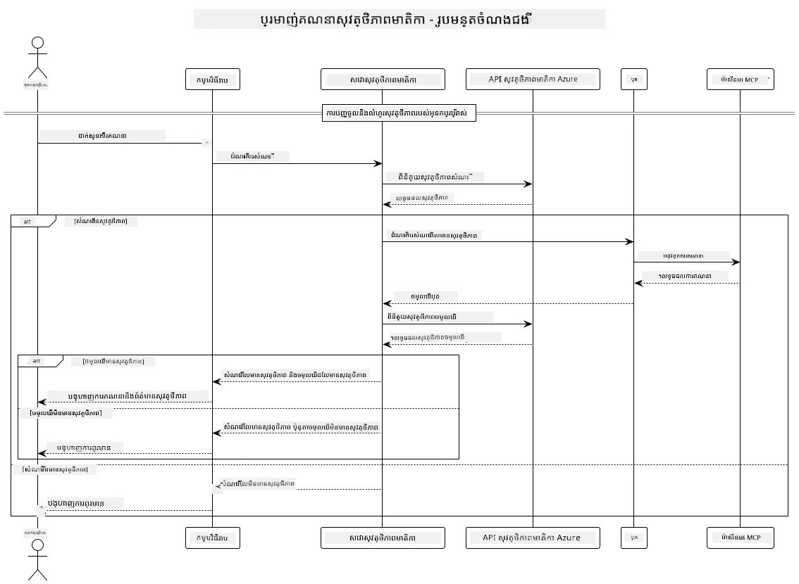

## រចនាសម្ព័ន្ធប្រព័ន្ធ

គម្រោងនេះបង្ហាញពីកម្មវិធីវែបមួយ ដែលប្រើការត្រួតពិនិត្យសុវត្ថិភាពមាតិកាមុនពេលផ្ញើសំណួរបស់អ្នកប្រើទៅសេវាកម្មគណនាគ្រឹះតាមរយៈព Protocol Model Context (MCP)។



### វាធ្វើការបែបណា

1. **ការបញ្ចូលពីអ្នកប្រើ**៖ អ្នកប្រើបញ្ចូលសំណួរក្នុងផ្ទៃមុខវែប
2. **ការត្រួតពិនិត្យសុវត្ថិភាពមាតិកា (បញ្ចូល)**៖ សំណួរត្រូវបានវិភាគដោយ Azure Content Safety API
3. **ការសម្រេចចិត្តសុវត្ថិភាព (បញ្ចូល)**៖
   - ប្រសិនបើមាតិកាសុវត្ថិភាព (កម្រិតធ្ងន់ធ្ងរ < 2 ក្នុងគ្រប់ប្រភេទ) វាបន្តទៅកាន់គណនាគ្រឹះ
   - ប្រសិនបើមាតិកាត្រូវបានសង្ស័យថាអាចមានគ្រោះថ្នាក់ ដំណើរការជប់ស្ងាត់ហើយបង្រួមសារព្រមាន
4. **ការរួមបញ្ចូលគណនាគ្រឹះ**៖ មាតិកាសុវត្ថិភាពត្រូវបានដំណើរការដោយ LangChain4j ដែលទំនាក់ទំនងជាមួយម៉ាស៊ីនបម្រើគណនាគ្រឹះ MCP
5. **ការត្រួតពិនិត្យសុវត្ថិភាពមាតិកា (បញ្ចូល)**៖ ចម្លើយរបស់បុតត្រូវបានវិភាគដោយ Azure Content Safety API
6. **ការសម្រេចចិត្តសុវត្ថិភាព (ចេញ)**៖
   - ប្រសិនបើចម្លើយបុតសុវត្ថិភាព វាត្រូវបង្ហាញទៅអ្នកប្រើ
   - ប្រសើបើចម្លើយបុតត្រូវបានសង្ស័យថាអាចមានគ្រោះថ្នាក់ វាត្រូវបានជំនួសដោយសារព្រមាន
7. **ចម្លើយ**៖ លទ្ធផល (បើសុវត្ថិភាព) ត្រូវបានបង្ហាញទៅអ្នកប្រើជាមួយនឹងការវិភាគសុវត្ថិភាពទ្វេផ្ទៃ

## ការប្រើប្រាស់ Model Context Protocol (MCP) ជាមួយសេវាកម្មគណនាគ្រឹះ

គម្រោងនេះបង្ហាញពីវិធីការប្រើប្រាស់ Model Context Protocol (MCP) ដើម្បីហៅសេវាកម្មគណនាគ្រឹះ MCP ពី LangChain4j។ ការអនុវត្តប្រើម៉ាស៊ីនបម្រើ MCP ក្នុងតំបន់មូលដ្ឋានដែលដំណើរការនៅច្រក ៨០៨០ ដើម្បីផ្ដល់ប្រតិបត្តិការ គណនាគ្រឹះ។

### ការតំឡើងសេវាកម្ម Azure Content Safety

មុនពេលប្រើលក្ខណៈសុវត្ថិភាពមាតិកា អ្នកត្រូវបង្កើតធនធានសេវាកម្ម Azure Content Safety:

1. ចូលទៅកាន់ [Azure Portal](https://portal.azure.com)
2. ចុច "Create a resource" ហើយស្វែងរក "Content Safety"
3. ជ្រើសរើស "Content Safety" ហើយចុច "Create"
4. បញ្ចូលឈ្មោះមួយដែលមិនមានមុនសម្រាប់ធនធានរបស់អ្នក
5. ជ្រើសរើសកុងត្រូវរបស់អ្នក និងក្រុមធនធាន (ឬបង្កើតថ្មី)
6. ជ្រើសរើសតំបន់ដែលគាំទ្រ (ពិនិត្យ [Region availability](https://azure.microsoft.com/en-us/global-infrastructure/services/?products=cognitive-services) សម្រាប់ព័ត៌មានលម្អិត)
7. ជ្រើសរើសកម្រិតតម្លៃដែលសមរម្យ
8. ចុច "Create" ដើម្បីដាក់បញ្ចូលធនធាន
9. បន្ទាប់ពីដាក់បញ្ចូលបាន សូមចុច "Go to resource"
10. នៅផ្នែកខាងឆ្វេង ក្រោម "Resource Management" សូមជ្រើសរើស "Keys and Endpoint"
11. ចម្លងកូនសោមួយណាមួយ និង URL ចុងផ្លូវសម្រាប់ប្រើក្នុងជំហានបន្ទាប់

### ការកំណត់អថេរសហព័ន្ធបរិស្ថាន

កំណត់អថេរ `GITHUB_TOKEN` សម្រាប់ការផ្ទៀងផ្ទាត់ម៉ូដែល GitHub:
```sh
export GITHUB_TOKEN=<your_github_token>
```

សម្រាប់លក្ខណៈសុវត្ថិភាពមាតិកា កំណត់៖
```sh
export CONTENT_SAFETY_ENDPOINT=<your_content_safety_endpoint>
export CONTENT_SAFETY_KEY=<your_content_safety_key>
```

អថេរសហព័ន្ធបរិស្ថានទាំងនេះត្រូវបានកម្មវិធីប្រើសម្រាប់ផ្ទៀងផ្ទាត់ជាមួយសេវាកម្ម Azure Content Safety។ ប្រសិនបើអថេរទាំងនេះមិនត្រូវបានកំណត់ កម្មវិធីនឹងប្រើតម្លៃជំនួសសម្រាប់បង្ហាញ តែលក្ខណៈសុវត្ថិភាពមាតិកានឹងមិនដំណើរការប្រកបដោយត្រឹមត្រូវទេ។

### ការចាប់ផ្តើមម៉ាស៊ីនបម្រើ Calculator MCP

មុនពេលបង្រួងអតិថិជន អ្នកត្រូវចាប់ផ្តើមម៉ាស៊ីនបម្រើ calculator MCP ក្នុងរបៀប SSE នៅ localhost:8080។

## សេចក្ដីពិពណ៌នាគម្រោង

គម្រោងនេះបង្ហាញពីការរួមបញ្ចូល Model Context Protocol (MCP) ជាមួយ LangChain4j ដើម្បីហៅសេវាកម្មគណនាគ្រឹះ។ លក្ខណៈសំខាន់រួមមាន៖

- ការប្រើ MCP ដើម្បីភ្ជាប់ទៅកាន់សេវាកម្មគណនាគ្រឹះសម្រាប់ប្រតិបត្តិការអាគុយម៉ង់មូលដ្ឋាន
- ការត្រួតពិនិត្យសុវត្ថិភាពមាតិកាទ្វេស្រទាប់លើសំណួរអ្នកប្រើ និងចម្លើយបុត
- ការរួមបញ្ចូលជាមួយម៉ូដែល gpt-4.1-nano របស់ GitHub តាម LangChain4j
- ការប្រើប្រាស់ Server-Sent Events (SSE) សម្រាប់ដឹកជញ្ជូន MCP

## ការរួមបញ្ចូលសុវត្ថិភាពមាតិកា

គម្រោងរួមបញ្ចូលលក្ខណៈសុវត្ថិភាពមាតិកាដែលពេញលេញ ដើម្បីធានាថា ទាំងការបញ្ចូលរបស់អ្នកប្រើ និងចម្លើយប្រព័ន្ធ គឺមិនមានមាតិកាអាក្រក់៖

1. **ការត្រួតពិនិត្យបញ្ចូល**៖ សំណួរទាំងអស់របស់អ្នកប្រើត្រូវបានវិភាគសម្រាប់ជំពូកមាតិកាហានិភ័យដូចជា ភាសាកំហឹង ការរើសអើងខ្លួន ឬមាតិកាផ្លូវភេទ មុនពេលដំណើរការ។

2. **ការត្រួតពិនិត្យចេញ**៖ ទោះបីប្រើម៉ូដែលមិនត្រូវបាន censored កម្មវិធីក៏ពិនិត្យចម្លើយទាំងអស់តាមតំបន់ត្រួតពិនិត្យសុវត្ថិភាពដដែល មុនដាក់បង្ហាញឲ្យអ្នកប្រើ។

វិធីនេះធានាថាប្រព័ន្ធមានសុវត្ថិភាព ទោះបីប្រើម៉ូដែល AI ណាក៏ដោយ រក្សាអ្នកប្រើពីការបញ្ចូលគ្រោះថ្នាក់ និងផលប៉ះពាល់អាក្រក់ពីចម្លើយ AI។

## អតិថិជនវែប

កម្មវិធីរួមបញ្ចូលផ្ទៃមុខវែបងាយស្រួលសម្រាប់អ្នកប្រើ ដែលអនុញ្ញាតឲ្យប្រើប្រាស់ប្រព័ន្ធ Content Safety Calculator ៖

### លក្ខណៈផ្ទៃមុខវែប

- បែបបទឆមាសងាយស្រួលសម្រាប់បញ្ចូលសំណួរកំណត់គណនា
- ការត្រួតពិនិត្យសុវត្ថិភាពមាតិកាទ្វេស្រទាប់ (បញ្ចូល និងចេញ)
- មតិវិភាគពេលវេលាពិតលើសុវត្ថិភាពសំណួរ និងចម្លើយ
- សញ្ញាសុវត្ថិភាពពណ៌ត្រូវគ្នាសម្រាប់ការបកស្រាយងាយៗ
- ការរចនាស្អាត និងឆាប់រហ័ស ដែលអាចប្រើបានលើឧបករណ៍ផ្សេងៗ
- ឧទាហរណ៍សំណួរសុវត្ថិភាពសម្រាប់ណែនាំអ្នកប្រើ

### ការប្រើប្រាស់អតិថិជនវែប

1. ចាប់ផ្តើមកម្មវិធី៖
   ```sh
   mvn spring-boot:run
   ```

2. បើកកម្មវិធីរុករកហើយចូលទៅកាន់ `http://localhost:8087`

3. បញ្ចូលសំណួរក្នុងតំបន់អត្ថបទដែលមាន (ឧ. "គណនាចំនួនសរុបនៃ 24.5 និង 17.3")

4. ចុច "Submit" ដើម្បីដំណើរការសំណើរបស់អ្នក

5. មើលលទ្ធផល ដែលរួមមាន៖
   - ការវិភាគសុវត្ថិភាពមាតិកាសំណួររបស់អ្នក
   - លទ្ធផលគណនាលទ្ធផល (បើសំណួរពិតសុវត្ថិភាព)
   - ការវិភាគសុវត្ថិភាពមាតិកាចម្លើយបុត
   - វិញ្ញាណនៃការព្រមានប្រសិនបើការបញ្ចូល ឬចេញត្រូវបានសង្ស័យ

អតិថិជនវែបគ្រប់គ្រងដំណើរការត្រួតពិនិត្យសុវត្ថិភាពទាំងពីរដោយស្វ័យប្រវត្តិ ប្រាកដថាសកម្មភាពទាំងអស់មានសុវត្ថិភាព និងសមរម្យ ទោះបីប្រើម៉ូដែល AI ណាក៏ដោយ។

---

<!-- CO-OP TRANSLATOR DISCLAIMER START -->
**ការបដិសេធ**៖  
ឯកសារនេះត្រូវបានបកប្រែដោយប្រើសេវាកម្មបកប្រែ AI [Co-op Translator](https://github.com/Azure/co-op-translator)។ ខណៈពេលយើងខិតខំរកភាពត្រឹមត្រូវ សូមយល់ព័ត៌មានថាការបកប្រែដោយស្វ័យប្រវត្តិអាចមានកំហុសឬភាពមិនត្រឹមត្រូវ។ ឯកសារដើមក្នុងភាសាតិជនដើមគួរត្រូវបានទាក់ទងជាផ្នែកចម្បងដែលមានអំណាច។ សម្រាប់ព័ត៌មានសំខាន់ៗ ការបកប្រែដោយអ្នកជំនាញមនុស្សគឺត្រូវបានណែនាំ។ យើងមិនទទួលខុសត្រូវចំពោះការយល់គ្នាវិញឬការបកប្រែខុសពីការប្រើប្រាស់ការបកប្រែនេះទេ។
<!-- CO-OP TRANSLATOR DISCLAIMER END -->