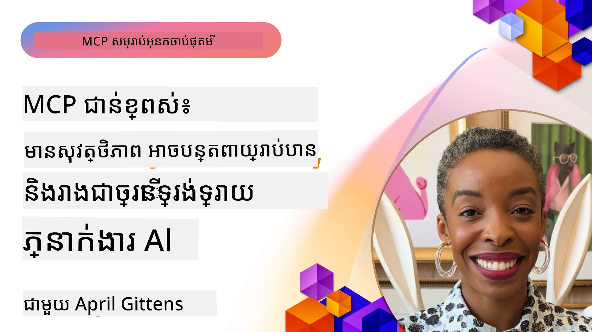

# ប្រធានបទកម្រិតខ្ពស់នៅក្នុង MCP

_(ចុចលើរូបភាពខាងលើដើម្បីមើលវីដេអូមេរៀននេះ)_

ជំពូកនេះគ្របដណ្ដប់ប្រធានបទកម្រិតខ្ពស់ជាច្រើននៅក្នុងការអនុវត្តន៍ Model Context Protocol (MCP) រួមមានការរួមបញ្ចូលប្រភេទពហុម៉ូដ, ការកំណត់សមត្ថភាពពហុស្ទួន, ប្រព័ន្ធសន្តិសុខល្អបំផុត និងការរួមបញ្ចូលសហគ្រាស។ ប្រធានបទទាំងនេះមានសារៈសំខាន់សម្រាប់ការសាងសង់កម្មវិធី MCP ដែលរឹងមាំ និងត្រៀមបង្ហោះដែលអាចបំពេញតម្រូវការរបស់ប្រព័ន្ធ AI សម័យចុងក្រោយ។

## ទិដ្ឋភាពទូទៅ

មេរៀននេះស្វែងយល់គំនិតកម្រិតខ្ពស់ក្នុងការអនុវត្តន៍ Model Context Protocol ដែលផ្តោតលើការរួមបញ្ចូលពហុម៉ូដ ការកំណត់សមត្ថភាពពហុស្ទួន ប្រព័ន្ធសន្តិសុខល្អបំផុត និងការរួមបញ្ចូលសហគ្រាស។ ប្រធានបទទាំងនេះជារឿងចាំបាច់សម្រាប់ការសាងសង់កម្មវិធី MCP មានគុណភាពផលិតកម្មដែលអាចដោះស្រាយតម្រូវការញឹកញាប់ក្នុងបរិដ្ឋានសហគ្រាស។

## គោលបំណងសិក្សា

នៅចុងបញ្ចប់មេរៀននេះ អ្នកនឹងអាច៖

- អនុវត្តសមត្ថភាពពហុម៉ូដក្នុងស៊ុម MCP
- រចនាស្ថាបត្យកម្ម MCP ដែលអាចកំណត់សមត្ថភាពខ្ពស់ក្នុងស្ថានការណ៍មានតម្រូវការខ្ពស់
- អនុវត្តអនុស្សរណៈសន្តិសុខឲ្យសមរម្យតាមទ្រឹស្តីសន្តិសុខរបស់ MCP
- រួមបញ្ចូល MCP ជាមួយប្រព័ន្ធ និងស៊ុម AI សហគ្រាស
- បង្កើនប្រសិទ្ធភាព និងភាពទុកចិត្តនៅក្នុងបរិដ្ឋានផលិតកម្ម

## មេរៀន និងគំរោងគំរូ

| Link | Title | Description |
|------|-------|-------------|
| [5.1 Integration with Azure](./mcp-integration/README.md) | រួមបញ្ចូលជាមួយ Azure | រៀនពីរបៀបរួមបញ្ចូលម៉ាស៊ីនមេ MCP របស់អ្នកនៅលើ Azure |
| [5.2 Multi modal sample](./mcp-multi-modality/README.md) | គំរូ MCP ពហុម៉ូដ | គំរូសម្រាប់សម្លេង រូបភាព និងការឆ្លើយតបពហុម៉ូដ |
| [5.3 MCP OAuth2 sample](../../../05-AdvancedTopics/mcp-oauth2-demo) | គំរូ MCP OAuth2 | កម្មវិធី Spring Boot តូចបង្ហាញ OAuth2 ជាមួយ MCP អាទិភាពឲ្យជាទាំងម៉ាស៊ីនបញ្ជាក់សិទ្ធិក្នុងការចូល និងម៉ាស៊ីនធនធាន។ បង្ហាញពីការចេញសញ្ញាសុវត្ថិភាព ការពារចំណុចចូល បញ្ជូន Azure Container Apps និងការរួមបញ្ចូលជាមួយ API Management។ |
| [5.4 Root Contexts](./mcp-root-contexts/README.md) | បរិបទដើម | រៀនបន្ថែមពីបរិបទដើម និងរបៀបអនុវត្តវា |
| [5.5 Routing](./mcp-routing/README.md) | ការផ្ញើ | រៀនពីប្រភេទផ្លូវដឹកជញ្ជូនខុសគ្នា |
| [5.6 Sampling](./mcp-sampling/README.md) | ការរើស | រៀនពីរបៀបធ្វើការរើសយក |
| [5.7 Scaling](./mcp-scaling/README.md) | ការកំណត់សមត្ថភាព | រៀនអំពីការកំណត់សមត្ថភាព |
| [5.8 Security](./mcp-security/README.md) | សន្តិសុខ | ការពារម៉ាស៊ីនមេ MCP របស់អ្នក |
| [5.9 Web Search sample](./web-search-mcp/README.md) | ស្វែងរកតាមវេប MCP | ម៉ាស៊ីនមេ និងម៉ាស៊ីនអតិថិជន Python MCP រួមបញ្ចូលជាមួយ SerpAPI ស្វែងរកវេប ព័ត៌មានទាន់ពេល ផលិតផល និង សំណួរ និងតប តាមពេលវេលាពិតប្រាកដ។ បង្ហាញពីការរួមបញ្ចូលឧបករណ៍ច្រើន ការចូល API ខាងក្រៅ និងការគ្រប់គ្រងកំហុសយ៉ាងរឹងមាំ។ |
| [5.10 Realtime Streaming](./mcp-realtimestreaming/README.md) | ការចាក់ស្ទ្រីមពេលវេលាពិតប្រាកដ | ការចាក់ស្ទ្រីមទិន្នន័យពេលវេលាពិតប្រាកដគឺមានសារៈសំខាន់ក្នុងពិភពទិន្នន័យមួយនៅសព្វថ្ងៃ ដែលអាជីវកម្ម និងកម្មវិធីត្រូវការចូលដំណើរការមំឡុងពេលវេលាបានភ្លាមៗដើម្បីធ្វើការសម្រេចចិត្តភ្លាមៗ។ |
| [5.11 Realtime Web Search](./mcp-realtimesearch/README.md) | ស្វែងរកតាមវេបពេលវេលាពិតប្រាកដ | របៀបដែល MCP ផ្លាស់ប្ដូរស្វែងរកតាមវេបពេលវេលាពិតប្រាកដដោយផ្ដល់វិធីសាស្រ្តមានស្តង់ដារសម្រាប់ការគ្រប់គ្រងបរិបទនៅពាក់កណ្តាលនៃគំរូ AI គំរូស្វែងរក និងកម្មវិធី។ |
| [5.12  Entra ID Authentication for Model Context Protocol Servers](./mcp-security-entra/README.md) | ការផ្ទៀងផ្ទាត់អត្តសញ្ញាណ Entra ID | Microsoft Entra ID ផ្តល់ដំណោះស្រាយគ្រប់គ្រងអត្តសញ្ញាណ និងការចូលប្រើផ្អែកលើពពកយ៉ាងរឹងមាំ ជួយធានាថាមនុស្ស និងកម្មវិធីមានសិទ្ធិត្រឹមត្រូវតែប៉ុណ្ណោះអាចមានអន្តរកម្មជាមួយម៉ាស៊ីនមេ MCP របស់អ្នក។ |
| [5.13 Azure AI Foundry Agent Integration](./mcp-foundry-agent-integration/README.md) | ការរួមបញ្ចូលភ្នាក់ងារ Azure AI Foundry | រៀនពីរបៀបរួមបញ្ចូលម៉ាស៊ីនមេ Model Context Protocol ជាមួយភ្នាក់ងារ Azure AI Foundry អនុញ្ញាតឲ្យមានការគ្រប់គ្រងឧបករណ៍មានប្រសិទ្ធភាព និងសមត្ថភាព AI សហគ្រាសជាមួយការតភ្ជាប់ប្រភពទិន្នន័យខាងក្រៅដដែលៗ។ |
| [5.14 Context Engineering](./mcp-contextengineering/README.md) | វិទ្យាសាស្រ្តបរិបទ | មានឱកាសអនាគតនៃបច្ចេកទេសវិទ្យាសាស្រ្តបរិបទសម្រាប់ម៉ាស៊ីនមេ MCP រួមមានការបង្កើតបរិបទឲ្យមានប្រសិទ្ធភាព ការគ្រប់គ្រងបរិបទសកម្ម និងយុទ្ធសាស្រ្តសម្រាប់បង្កើតបន្ទាត់បញ្ចូលមានប្រសិទ្ធភាពនៅក្នុងស៊ុម MCP។ |
| [5.15 MCP Custom Transport](./mcp-transport/README.md) | ការដឹកជញ្ជូនបែបផ្ទាល់ខ្លួន | រៀនពីរបៀបអនុវត្តន៍យានដ្ឋានដឹកជញ្ជូនផ្ទាល់ខ្លួនសម្រាប់ស្ថានการณ์សារព័ត៌មានជាមួយ MCP ជាពិសេស។ |
| [5.16 Protocol Features Deep Dive](./mcp-protocol-features/README.md) | លក្ខណៈពិសេសនៃប្រតិកម្ម | រៀនជម្រៅលើលក្ខណៈពិសេសតាមប្រតិកម្ម រួមមានការជូនដំណឹងវឌ្ឍនភាព ការបោះបង់សំណើ គំរូធនធាន និងគំរូគ្រប់គ្រងកំហុស។ |

> **ថ្មីនៅក្នុងកំណែ MCP Specification 2025-11-25**: កំណែនេះមានការគាំទ្រប្រភេទតេស្ត **Tasks** (ប្រតិបត្តិការរយៈពេលវែងជាមួយតាមដានវឌ្ឍនភាព), **Tool Annotations** (ព័ត៌មានលម្អិតអំពីរបៀបប្រើឧបករណ៍សម្រាប់សុវត្ថិភាព), **URL Mode Elicitation** (ស្នើសុំព័ត៌មាន URL ច្បាស់ពីអតិថិជន), និង **Roots** បានកាន់តែមានកម្លាំង (សម្រាប់ការគ្រប់គ្រងបរិបទកន្លែងបម្រើការងារ)។ សូមមើល [MCP Specification changelog](https://spec.modelcontextprotocol.io/) សម្រាប់ព័ត៌មានលម្អិតទាំងមូល។

## ឯកសារជំនួយបន្ថែម

សម្រាប់ព័ត៌មានទាន់សម័យបំផុតអំពីប្រធានបទ MCP កម្រិតខ្ពស់ ចូរយោងទៅកាន់៖
- [ឯកសារ MCP Documentation](https://modelcontextprotocol.io/)
- [MCP Specification (2025-11-25)](https://spec.modelcontextprotocol.io/specification/2025-11-25/)
- [ឃ្លាំងកូដ GitHub Repository](https://github.com/modelcontextprotocol)
- [OWASP MCP Top 10](https://microsoft.github.io/mcp-azure-security-guide/mcp/) - លំបាកសន្តិសុខ និងវិធានការការពារ
- [សិក្ខាសាលា MCP Security Summit Workshop (Sherpa)](https://azure-samples.github.io/sherpa/) - ហត្ថកម្មសន្តិសុខជាក់ស្តែង

## ចំណុចសំខាន់ក្នុងការយកចិត្តទុកដាក់

- ការអនុវត្តពហុម៉ូដ MCP ផ្តល់សមត្ថភាព AI ទៅលើមិនត្រឹមតែការប្រែប្រួលអត្ថបទតែប៉ុណ្ណោះ
- ការកំណត់សមត្ថភាពគឺមានសារៈសំខាន់សម្រាប់ការដាក់បង្ហោះនៅសហគ្រាស ហើយអាចដោះស្រាយតាមរបៀបបញ្ជំព្យួរនិងបញ្ជំជាន់
- វិធានសន្តិសុខគ្របដណ្តប់ទាំងមូលជួយការពារទិន្នន័យ និងធានារបស់កំណត់ការចូលដំណើរការ
- ការរួមបញ្ចូលសហគ្រាសជាមួយវេទិកាដូចជា Azure OpenAI និង Microsoft AI Foundry កែលម្អសមត្ថភាព MCP
- ការអនុវត្ត MCP គឺទទួលផលពីស្ថាបត្យកម្មបានប្រសើរឡើង និងការគ្រប់គ្រងធនធានយ៉ាងប្រុងប្រយ័ត្ន

## លំហាត់

រចនាការអនុវត្ត MCP មានគុណភាពសហគ្រាសសម្រាប់ករណីប្រើប្រាស់ជាក់លាក់៖

1. កំណត់តម្រូវការប្រភេទពហុម៉ូដសម្រាប់ករណីរបស់អ្នក
2. រៀបចំពិនិត្យការគ្រប់គ្រងសន្តិសុខត្រូវបានល្អដើម្បីការពារទិន្នន័យសម្ងាត់
3. រចនាស្ថាបត្យកម្មអាចបង្កើនទំហំដែលអាចដោះស្រាយទម្ងន់ការផ្ទុកបំប្រែក
4. គ្រោងចំណុចរួមបញ្ចូលជាមួយប្រព័ន្ធ AI សហគ្រាស
5. ឯកសារអំពីកន្លែងបញ្ចេញផលប៉ះពាល់ និងយុទ្ធសាស្រ្តការកាត់បន្ថយ

## ឯកសារជំនួយបន្ថែម

- [Azure OpenAI Documentation](https://learn.microsoft.com/en-us/azure/ai-services/openai/)
- [Microsoft AI Foundry Documentation](https://learn.microsoft.com/en-us/ai-services/)

---

## តើអ្វីទៅជា​បន្ទាប់

ស្វែងយល់ពីមេរៀននៅក្នុងម៉ូឌុលនេះចាប់ផ្តើមពី: [5.1 MCP Integration](./mcp-integration/README.md)

បន្ទាប់ពីអ្នកបញ្ចប់ម៉ូឌុលនេះ សូមបន្តទៅ: [Module 6: Community Contributions](../06-CommunityContributions/README.md)

---

<!-- CO-OP TRANSLATOR DISCLAIMER START -->
**ការព្រមាន**៖  
ឯកសារនេះត្រូវបានបម្លែងភាសាដោយប្រើសេវាកម្មបម្លែងភាសា AI [Co-op Translator](https://github.com/Azure/co-op-translator)។ ខណៈពេលដែលយើងខំប្រឹងរកភាពត្រឹមត្រូវ អ្នកសូមយកចិត្តទុកដាក់ថាការបម្លែងភាសា​ដោយស្វ័យប្រវត្តិអាចមានកំហុស ឬច្រឡំ។ ឯកសារជាភាសាមូលដ្ឋានគួរត្រូវបានទទួលស្គាល់ថាជាម្ចាស់ដើមនៃព័ត៌មាន។ សម្រាប់ព័ត៌មានសំខាន់ សូមអនុវត្តការបម្លែង​ដោយមនុស្សជំនាញ។ យើងមិនទទួលខុសត្រូវចំពោះការយល់ច្រឡំហា ឬការបកអក្សរខុសពីការប្រើប្រាស់ការបម្លែងនេះទេ។
<!-- CO-OP TRANSLATOR DISCLAIMER END -->