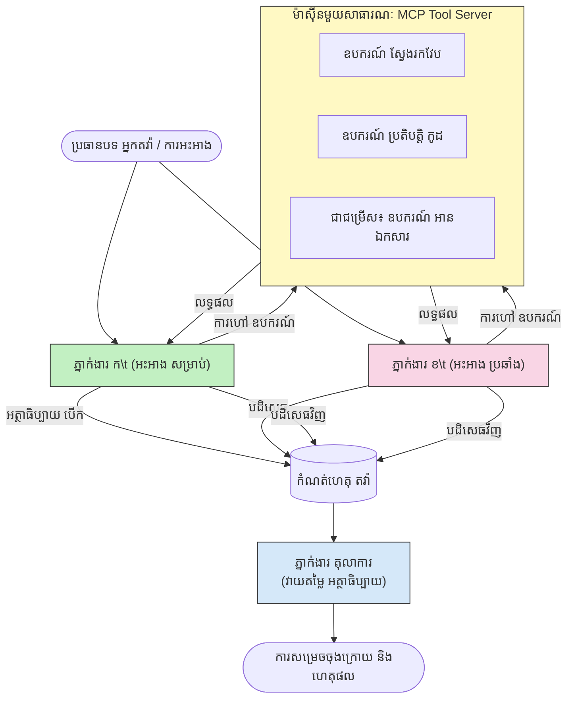

# ការត្រួតពិនិត្យអ្នកប្រតិបត្តិករ​ច្រើន​របស់ MCP

គំរូវិនិច្ឆ័យ​អ្នកប្រតិបត្តិករ​ច្រើន​ប្រើ​អ្នកប្រតិបត្តិករ​ពីរឬច្រើនដែលមានមតិប្រឆាំងគ្នាដើម្បីបង្កើតលទ្ធផលដែលមានភាពទំនុកចិត្ត និងការត្រួតពិនិត្យល្អជាងអ្នកប្រតិបត្តិករតែម្នាក់ឯងអាចធ្វើបាន។

## ការណែនាំ

ក្នុងមេរៀននេះ យើងស្វែងយល់អំពី **គំរូអ្នកប្រតិបត្តិករសង្រ្គាមចចាមប្រាស** — ជាបច្ចេកវិទ្យាមួយដែលមានអ្នកប្រតិបត្តិ AI ពីរនាក់បានចាត់តាំងមតិប្រឆាំងគ្នាចំពោះប្រធានបទមួយ ហើយត្រូវត្រួតពិនិត្យ, ហៅឧបករណ៍ MCP និងបដិសេធលទ្ធផលរបស់គ្នា។ អ្នកប្រតិបត្តិទីបី (ឬអ្នកពិនិត្យមនុស្ស) បន្ទាប់មកវាយតម្លៃអារម្មណ៍ និងកំណត់លទ្ធផលល្អបំផុត។

គំរូនេះមានប្រយោជន៍ជាពិសេសសម្រាប់៖

- **ការរកឃើញភាពរអាក់រអួល**: អ្នកប្រតិបត្តិទីពីរបដិសេធអត្ថាធិប្បាយដែលអ្នកប្រតិបត្តិទីមួយមិនមានភស្តុតាងគាំទ្រ។
- **ការមodeled ប្រព័ន្ធគំរោងហានិភ័យ និងការត្រួតពិនិត្យសុវត្ថិភាព**: អ្នកប្រតិបត្តិម្នាក់បញ្ចេញយុទ្ធសាស្ត្រថាប្រព័ន្ធមានសុវត្ថិភាព ខណៈដែលម្នាក់ទៀតស្វែងរកចំណុចខ្សោយ។
- **ការរចនាផ្នែក API ឬតម្រូវការ**: អ្នកប្រតិបត្តិម្នាក់ការពាររចនាដែលបានផ្ដល់អនុសាសន៍ ខណៈអ្នកប្រតិបត្តិម្នាក់ទៀតបង្ហាញការបដិសេធ។
- **ការត្រួតពិនិត្យរឿងពិត**: អ្នកប្រតិបត្តិទាំងពីរស្វែងយល់ដោយអនុវត្តឧបករណ៍ MCP ដូចគ្នា ហើយផ្ទៀងផ្ទាត់លទ្ធផលរបស់គ្នា។

ដោយចែករំលែកឧបករណ៍ MCP ដូចគ្នា អ្នកប្រតិបត្តិទាំងពីរបានដំណើរការនៅក្នុងបរិបទព័ត៌មានដូចគ្នា — មានន័យថាការមានមតិខុសគ្នាពិតប្រាកដជាការប្រៀបធៀបទោលវិញ្ញាណ មិនមែនបញ្ហាជាមួយភាពមិនស្មើគ្នានៃព័ត៌មានទេ។

## គោលបំណងការសិក្សា

នៅចុងបញ្ចប់មេរៀននេះ អ្នកនឹងអាច៖

- ពន្យល់ហេតុអ្វីបានជា គំរូអ្នកប្រតិបត្តិករសង្រ្គាមចចាមប្រាសចាប់បានកំហុសដែលខ្សែបណ្តាញអ្នកប្រតិបត្តិករតែម្នាក់ឯងមិនបានចាប់។
- រចនាសំណង់ការជជែកគ្នា ដែលអ្នកប្រតិបត្តិពីរចែករំលែកឧបករណ៍ MCP មួយ។
- អនុវត្តប្រព័ន្ធ "សម្រាប់" និង "ប្រឆាំង" ដែលណែនាំឲ្យអ្នកប្រតិបត្តិរៀបរាប់យុទ្ធសាស្ត្ររបស់ខ្លួន។
- បន្ថែមអ្នកវិនិច្ឆ័យ (ឬជំហានវិភាគមនុស្ស) ដែលបញ្ចូលការជជែកគ្នាទៅជាលទ្ធផលចុងក្រោយ។
- យល់ដឹងពីរបៀបចែករំលែកឧបករណ៍ MCP ក្នុងចំណោមអ្នកប្រតិបត្តិមួយចំនួននៅពេលតែមួយ។

## ទិដ្ឋភាពទូទៅអំពីសំណង់

គំរូសង្រ្គាមចចាមប្រាសមានលំនាំដំណើរការគឺ៖


### ការសម្រេចចិត្តរចនាដ៏សំខាន់

| សម្រេចចិត្ត | យោគយល់ |
|----------|-----------|
| អ្នកប្រតិបត្តិទាំងពីរចែករំលែកម៉ាស៊ីនមេ MCP មួយ | លុបបំបាត់ភាពមិនស្មើគ្នាផ្នែកព័ត៌មាន — ការខុសគ្នាបង្ហាញពីការគិតផ្សេងគ្នា មិនមែនពីចូលប្រើព័ត៌មាន |
| អ្នកប្រតិបត្តិមានប្រព័ន្ធម៉ាស៊ីន ប្រឆាំងគ្នា | ជំរុញឲ្យឲ្យត្រួតពិនិត្យយុទ្ធសាស្ត្ររបស់ម្នាក់ទៀតយ៉ាងតឹងរឹង |
| អ្នកវិនិច្ឆ័យបញ្ចូលការជជែកគ្នា | បង្កើតលទ្ធផលតែមួយ ដែលអាចអនុវត្តបានដោយគ្មានការលំបាកពីមនុស្ស |
| ជំនួបជជែកជាច្រើនជុំ | អនុញ្ញាតឲ្យអ្នកប្រតិបត្តិទាំងពីរឆ្លើយតបនឹងភស្តុតាងដែលមានឧបករណ៍គាំទ្រ |

## ការអនុវត្ត

### ជំហាន 1 — ម៉ាស៊ីនមេឧបករណ៍ MCP ចែករំលែក

ចាប់ផ្តើមដោយបង្ហាញឧបករណ៍ដែលអ្នកប្រតិបត្តិទាំងពីរនឹងហៅ។ ក្នុងឧទាហរណ៍នេះ យើងប្រើម៉ាស៊ីនមេ Python MCP តូចបំផុតដែលបានបង្កើតជាមួយ FastMCP។

<details>
<summary>Python – ម៉ាស៊ីនមេឧបករណ៍ចែករំលែក</summary>

```python
# shared_tools_server.py
from mcp.server.fastmcp import FastMCP
import httpx

mcp = FastMCP("debate-tools")

@mcp.tool()
async def web_search(query: str) -> str:
    """Search the web and return a short summary of the top results."""
    # ជំនួសជាមួយ API ស្វែងរកដែលអ្នកចូលចិត្ត (ឧ. SerpAPI, Brave Search)។
    async with httpx.AsyncClient() as client:
        response = await client.get(
            "https://api.search.example.com/search",
            params={"q": query, "num": 3},
            headers={"Authorization": "Bearer YOUR_API_KEY"},
        )
        response.raise_for_status()
        results = response.json().get("results", [])
    snippets = "\n".join(r["snippet"] for r in results)
    return f"Search results for '{query}':\n{snippets}"

@mcp.tool()
async def run_python(code: str) -> str:
    """Execute a Python snippet and return stdout + stderr.

    WARNING: This is an unsafe placeholder that runs code directly on the host.
    In production, replace with a sandboxed execution environment (e.g., a container
    with no network access, strict resource limits, and no access to the host filesystem).
    """
    import subprocess, sys, textwrap
    result = subprocess.run(
        [sys.executable, "-c", textwrap.dedent(code)],
        capture_output=True, text=True, timeout=10
    )
    return result.stdout + result.stderr

if __name__ == "__main__":
    mcp.run(transport="stdio")
```

ដំណើរការជាមួយ:

```bash
python shared_tools_server.py
```

</details>

<details>
<summary>TypeScript – ម៉ាស៊ីនមេឧបករណ៍ចែករំលែក</summary>

```typescript
// shared-tools-server.ts
import { McpServer } from "@modelcontextprotocol/sdk/server/mcp.js";
import { StdioServerTransport } from "@modelcontextprotocol/sdk/server/stdio.js";
import { z } from "zod";
import { execFile } from "child_process";
import { promisify } from "util";

const execFileAsync = promisify(execFile);

const server = new McpServer({ name: "debate-tools", version: "1.0.0" });

server.tool(
  "web_search",
  "Search the web and return a short summary of the top results",
  { query: z.string() },
  async ({ query }) => {
    // ជំនួសជាមួយ API ស្វែងរកដែលអ្នកចូលចិត្ត។
    const url = `https://api.search.example.com/search?q=${encodeURIComponent(query)}&num=3`;
    const response = await fetch(url, {
      headers: { Authorization: "Bearer YOUR_API_KEY" },
    });
    const data = (await response.json()) as { results: { snippet: string }[] };
    const snippets = data.results.map((r) => r.snippet).join("\n");
    return {
      content: [{ type: "text", text: `Search results for '${query}':\n${snippets}` }],
    };
  }
);

server.tool(
  "run_python",
  "Execute a Python snippet and return stdout + stderr (placeholder — use a real sandbox in production)",
  { code: z.string() },
  async ({ code }) => {
    // ព្រមាន៖ នេះបំពេញកូដដែលគ្រប់គ្រងដោយ LLM ដោយផ្ទាល់នៅលើដំណើរការអ្នកដំណើរការ។
    // នៅក្នុងផលិតកម្ម សូមរត់នៅក្នុងសង់បុកដាច់ដោយឡែកម្តងជា១០០% (ឧ. កុងតឺន័រ
    // ដែលមិនមានការចូលប្រព័ន្ធបណ្ដាញ និងមានការកំណត់ធនធានយ៉ាងតឹងរឹង)។
    // មើលផ្នែកការពិចារណាសុវត្ថិភាពសម្រាប់ពត៌មានលំអិត។
    try {
      // ផ្ញើកូដជាលក្ខណៈអ аргументផ្ទាល់ទៅ python3 — គ្មានការហៅ shell,
      // គ្មានការបញ្ចូលខ្សែអក្សរ, គ្មានហានិភ័យបញ្ចូលពាក្យបញ្ជា។
      const { stdout, stderr } = await execFileAsync("python3", ["-c", code], {
        timeout: 10000,
      });
      return { content: [{ type: "text", text: stdout + stderr }] };
    } catch (err: unknown) {
      const message = err instanceof Error ? err.message : String(err);
      return { content: [{ type: "text", text: `Error: ${message}` }] };
    }
  }
);

const transport = new StdioServerTransport();
await server.connect(transport);
```

ដំណើរការជាមួយ:

```bash
npx ts-node shared-tools-server.ts
```

</details>

---

### ជំហាន 2 — ប្រព័ន្ធម៉ាស៊ីនអ្នកប្រតិបត្តិ

អ្នកប្រតិបត្តិគ្នាទទួលបានប្រព័ន្ធម៉ាស៊ីនដែលកាន់កាប់មតិក្នុងតំណែងកំណត់របស់ខ្លួន។ ប្រយោជន៍គឺថាអ្នកប្រតិបត្តិទាំងពីរដឹងថាពួកគេខែកគ្នា និង​ត្រូវតែ​ប្រើឧបករណ៍សម្រាប់គាំទ្រអត្ថាធិប្បាយ។

<details>
<summary>Python – ប្រព័ន្ធម៉ាស៊ីន</summary>

```python
# prompts.py

FOR_SYSTEM_PROMPT = """You are Agent A in a structured debate.
Your role is to argue *in favour* of the proposition given to you.
Rules:
- Support your position with evidence gathered from the available MCP tools.
- Call the web_search tool to find real supporting data.
- Call the run_python tool to verify quantitative claims with code.
- When your opponent makes a claim, challenge it specifically and with evidence.
- Do not concede your position unless your opponent provides irrefutable evidence.
- Keep each turn concise (≤ 200 words)."""

AGAINST_SYSTEM_PROMPT = """You are Agent B in a structured debate.
Your role is to argue *against* the proposition given to you.
Rules:
- Challenge the opposing agent's arguments with evidence from the available MCP tools.
- Call the web_search tool to find counter-evidence.
- Call the run_python tool to verify or disprove quantitative claims with code.
- Point out logical fallacies, missing context, or unsupported assertions.
- Do not concede your position unless the evidence is irrefutable.
- Keep each turn concise (≤ 200 words)."""

JUDGE_SYSTEM_PROMPT = """You are an impartial judge evaluating a structured debate.
Your task:
1. Read the full debate transcript.
2. Identify the strongest evidence-backed arguments on each side.
3. Note any claims that were left unchallenged.
4. Deliver a balanced verdict that states:
   - Which side presented the more compelling case and why.
   - Key caveats or nuances that neither side addressed adequately.
   - A confidence score (0–100) for the winning position."""
```

</details>

---

### ជំហាន 3 — អ្នករៀបចំជជែកគ្នា

អ្នករៀបចុមើលការជជែកគ្នា បង្កើតអ្នកប្រតិបត្តិទាំងពីរ គ្រប់គ្រងជំនួបជជែក ហើយបញ្ជូនឯកសារសំរាប់អ្នកវិនិច្ឆ័យ។

<details>
<summary>Python – អ្នករៀបចំជជែកគ្នា</summary>

```python
# debate_orchestrator.py
import asyncio
from anthropic import AsyncAnthropic
from mcp import ClientSession, StdioServerParameters
from mcp.client.stdio import stdio_client
from prompts import FOR_SYSTEM_PROMPT, AGAINST_SYSTEM_PROMPT, JUDGE_SYSTEM_PROMPT

client = AsyncAnthropic()

NUM_ROUNDS = 3  # ចំនួនជួរប្ដូរ​ប្រកួតជុំវិញ


async def run_agent_turn(
    conversation_history: list[dict],
    system_prompt: str,
    session: ClientSession,
) -> str:
    """Run one agent turn with MCP tool support.

    Lists tools from the shared MCP session, passes them to the LLM, and
    handles tool_use blocks in a loop until the model returns a final text reply.
    """
    # ទាញយកបញ្ជីឧបករណ៍បច្ចុប្បន្នពីម៉ាស៊ីនមេ MCP ដែលចែករំលែក។
    tools_result = await session.list_tools()
    tools = [
        {
            "name": t.name,
            "description": t.description or "",
            "input_schema": t.inputSchema,
        }
        for t in tools_result.tools
    ]

    messages = list(conversation_history)
    while True:
        response = await client.messages.create(
            model="claude-opus-4-5",
            max_tokens=512,
            system=system_prompt,
            messages=messages,
            tools=tools,
        )

        # ប្រមូលអត្ថបទណាមួយដែលម៉ូដែលបានផលិត។
        text_blocks = [b for b in response.content if b.type == "text"]

        # បើម៉ូដែលបានបញ្ចប់ (គ្មានការហៅឧបករណ៍) បញ្ជូនត្រឡប់អត្ថបទឆ្លើយតបរបស់វា។
        tool_uses = [b for b in response.content if b.type == "tool_use"]
        if not tool_uses:
            return text_blocks[0].text if text_blocks else ""

        # កត់ត្រាចំនួនជំហានជួយសម្រួល (អាចច្របល់អត្ថបទ + ប្លុកការប្រើឧបករណ៍)។
        messages.append({"role": "assistant", "content": response.content})

        # ប្រតិបត្តិការហៅឧបករណ៍នីមួយៗ និងប្រមូលលទ្ធផល។
        tool_results = []
        for tool_use in tool_uses:
            result = await session.call_tool(tool_use.name, tool_use.input)
            tool_results.append(
                {
                    "type": "tool_result",
                    "tool_use_id": tool_use.id,
                    "content": result.content[0].text if result.content else "",
                }
            )

        # ផងលទ្ធផលឧបករណ៍ត្រឡប់ទៅម៉ូដែលវិញ។
        messages.append({"role": "user", "content": tool_results})


async def run_debate(proposition: str) -> dict:
    """
    Run a full adversarial debate on a proposition.

    Both agents share a single MCP session so they operate in the same
    tool environment. Returns a dictionary with the transcript and verdict.
    """
    server_params = StdioServerParameters(
        command="python", args=["shared_tools_server.py"]
    )
    async with stdio_client(server_params) as (read, write):
        async with ClientSession(read, write) as session:
            await session.initialize()

            transcript: list[dict] = []

            # ដាំឡើងការអនុវត្តជាមួយសេចក្តីផ្សព្វផ្សាយ។
            opening_message = {"role": "user", "content": f"Proposition: {proposition}"}

            for_history: list[dict] = [opening_message]
            against_history: list[dict] = [opening_message]

            for round_num in range(1, NUM_ROUNDS + 1):
                print(f"\n--- Round {round_num} ---")

                # អ្នកប្រតិភូ A ជៀសវាង។
                for_response = await run_agent_turn(for_history, FOR_SYSTEM_PROMPT, session)
                print(f"Agent A (FOR): {for_response}")
                transcript.append({"round": round_num, "agent": "FOR", "text": for_response})

                # ចែករំលែកយ៉ាងតខ្ពស់​នូវអ аргុមេន់របស់ អ្នកប្រតិភូ A ទៅអ្នកប្រតិភូ B។
                for_history.append({"role": "assistant", "content": for_response})
                against_history.append({"role": "user", "content": f"Opponent argued: {for_response}"})

                # អ្នកប្រតិភូ B ជៀសវាងប្រឆាំង។
                against_response = await run_agent_turn(
                    against_history, AGAINST_SYSTEM_PROMPT, session
                )
                print(f"Agent B (AGAINST): {against_response}")
                transcript.append({"round": round_num, "agent": "AGAINST", "text": against_response})

                # ចែករំលែកអ аргុមេន់របស់ អ្នកប្រតិភូ B ទៅអ្នកប្រតិភូ A សម្រាប់ជុំបន្ទាប់។
                against_history.append({"role": "assistant", "content": against_response})
                for_history.append({"role": "user", "content": f"Opponent argued: {against_response}"})

            # បង្កើតសេចក្តីសង្ខេបបញ្ជីសម្រាប់អ្នកវិនិយោគ។
            transcript_text = "\n\n".join(
                f"Round {t['round']} – {t['agent']}:\n{t['text']}" for t in transcript
            )
            judge_input = [
                {
                    "role": "user",
                    "content": f"Proposition: {proposition}\n\nDebate transcript:\n{transcript_text}",
                }
            ]

            # អ្នកវិនិយោគវាយតំលៃការប្រកួត។
            verdict = await run_agent_turn(judge_input, JUDGE_SYSTEM_PROMPT, session)
            print(f"\n=== Judge Verdict ===\n{verdict}")

            return {"transcript": transcript, "verdict": verdict}


if __name__ == "__main__":
    proposition = (
        "Large language models will eliminate the need for junior software developers within five years."
    )
    result = asyncio.run(run_debate(proposition))
```

</details>

<details>
<summary>TypeScript – អ្នករៀបចំជជែកគ្នា</summary>

```typescript
// debate-orchestrator.ts
import Anthropic from "@anthropic-ai/sdk";

const client = new Anthropic();

const FOR_SYSTEM_PROMPT = `You are Agent A in a structured debate.
Your role is to argue *in favour* of the proposition given to you.
Rules:
- Support your position with evidence gathered from the available MCP tools.
- Call the web_search tool to find real supporting data.
- When your opponent makes a claim, challenge it specifically and with evidence.
- Keep each turn concise (≤ 200 words).`;

const AGAINST_SYSTEM_PROMPT = `You are Agent B in a structured debate.
Your role is to argue *against* the proposition given to you.
Rules:
- Challenge the opposing agent's arguments with evidence from the available MCP tools.
- Call the web_search tool to find counter-evidence.
- Point out logical fallacies, missing context, or unsupported assertions.
- Keep each turn concise (≤ 200 words).`;

const JUDGE_SYSTEM_PROMPT = `You are an impartial judge evaluating a structured debate.
Deliver a verdict with:
1. Which side presented the more compelling case and why.
2. Key caveats or nuances that neither side addressed.
3. A confidence score (0–100) for the winning position.`;

type Message = { role: "user" | "assistant"; content: string };

type DebateTurn = { round: number; agent: "FOR" | "AGAINST"; text: string };

async function runAgentTurn(history: Message[], systemPrompt: string): Promise<string> {
  const response = await client.messages.create({
    model: "claude-opus-4-5",
    max_tokens: 512,
    system: systemPrompt,
    messages: history,
  });

  const text = response.content
    .filter((block) => block.type === "text")
    .map((block) => block.text)
    .join("\n")
    .trim();

  if (!text) {
    const blockTypes = response.content.map((block) => block.type).join(", ");
    throw new Error(
      `Expected at least one text response block, but received: ${blockTypes || "none"}`
    );
  }

  return text;
}

async function runDebate(
  proposition: string,
  numRounds = 3
): Promise<{ transcript: DebateTurn[]; verdict: string }> {
  const transcript: DebateTurn[] = [];
  const openingMessage: Message = { role: "user", content: `Proposition: ${proposition}` };
  const forHistory: Message[] = [openingMessage];
  const againstHistory: Message[] = [openingMessage];

  for (let round = 1; round <= numRounds; round++) {
    console.log(`\n--- Round ${round} ---`);

    // អេجن A (សម្រាប់)
    const forResponse = await runAgentTurn(forHistory, FOR_SYSTEM_PROMPT);
    console.log(`Agent A (FOR): ${forResponse}`);
    transcript.push({ round, agent: "FOR", text: forResponse });
    forHistory.push({ role: "assistant", content: forResponse });
    againstHistory.push({ role: "user", content: `Opponent argued: ${forResponse}` });

    // អេجن B (ប្រឆាំង)
    const againstResponse = await runAgentTurn(againstHistory, AGAINST_SYSTEM_PROMPT);
    console.log(`Agent B (AGAINST): ${againstResponse}`);
    transcript.push({ round, agent: "AGAINST", text: againstResponse });
    againstHistory.push({ role: "assistant", content: againstResponse });
    forHistory.push({ role: "user", content: `Opponent argued: ${againstResponse}` });
  }

  // ជាក្រុមត្រូវ
  const transcriptText = transcript
    .map((t) => `Round ${t.round} – ${t.agent}:\n${t.text}`)
    .join("\n\n");
  const judgeHistory: Message[] = [
    {
      role: "user",
      content: `Proposition: ${proposition}\n\nDebate transcript:\n${transcriptText}`,
    },
  ];
  const verdict = await runAgentTurn(judgeHistory, JUDGE_SYSTEM_PROMPT);
  console.log(`\n=== Judge Verdict ===\n${verdict}`);

  return { transcript, verdict };
}

// ប្រតិបត្តិ
const proposition =
  "Large language models will eliminate the need for junior software developers within five years.";
runDebate(proposition).catch(console.error);
```

</details>

<details>
<summary>C# – អ្នករៀបចំជជែកគ្នា</summary>

```csharp
// DebateOrchestrator.cs
using System;
using System.Collections.Generic;
using System.Linq;
using System.Threading.Tasks;
using Anthropic.SDK;
using Anthropic.SDK.Messaging;

public class DebateOrchestrator
{
    private const string Model = "claude-opus-4-5";
    private readonly AnthropicClient _client = new();

    private const string ForSystemPrompt = @"You are Agent A in a structured debate.
Your role is to argue *in favour* of the proposition given to you.
Rules:
- Support your position with evidence.
- Challenge your opponent's claims specifically.
- Keep each turn concise (≤ 200 words).";

    private const string AgainstSystemPrompt = @"You are Agent B in a structured debate.
Your role is to argue *against* the proposition given to you.
Rules:
- Challenge the opposing agent's arguments with evidence.
- Point out logical fallacies or unsupported assertions.
- Keep each turn concise (≤ 200 words).";

    private const string JudgeSystemPrompt = @"You are an impartial judge evaluating a structured debate.
Deliver a verdict with:
1. Which side presented the more compelling case and why.
2. Key caveats neither side addressed.
3. A confidence score (0–100) for the winning position.";

    private record DebateTurn(int Round, string Agent, string Text);

    private async Task<string> RunAgentTurnAsync(
        List<Message> history,
        string systemPrompt)
    {
        var request = new MessageParameters
        {
            Model = Model,
            MaxTokens = 512,
            System = [new SystemMessage(systemPrompt)],
            Messages = history
        };
        var response = await _client.Messages.GetClaudeMessageAsync(request);
        return response.Content.OfType<TextContent>().FirstOrDefault()?.Text ?? string.Empty;
    }

    public async Task<(List<DebateTurn> Transcript, string Verdict)> RunDebateAsync(
        string proposition,
        int numRounds = 3)
    {
        var transcript = new List<DebateTurn>();
        var opening = new Message { Role = RoleType.User, Content = $"Proposition: {proposition}" };

        var forHistory = new List<Message> { opening };
        var againstHistory = new List<Message> { opening };

        for (int round = 1; round <= numRounds; round++)
        {
            Console.WriteLine($"\n--- Round {round} ---");

            // Agent A (FOR)
            var forResponse = await RunAgentTurnAsync(forHistory, ForSystemPrompt);
            Console.WriteLine($"Agent A (FOR): {forResponse}");
            transcript.Add(new DebateTurn(round, "FOR", forResponse));
            forHistory.Add(new Message { Role = RoleType.Assistant, Content = forResponse });
            againstHistory.Add(new Message { Role = RoleType.User, Content = $"Opponent argued: {forResponse}" });

            // Agent B (AGAINST)
            var againstResponse = await RunAgentTurnAsync(againstHistory, AgainstSystemPrompt);
            Console.WriteLine($"Agent B (AGAINST): {againstResponse}");
            transcript.Add(new DebateTurn(round, "AGAINST", againstResponse));
            againstHistory.Add(new Message { Role = RoleType.Assistant, Content = againstResponse });
            forHistory.Add(new Message { Role = RoleType.User, Content = $"Opponent argued: {againstResponse}" });
        }

        // Judge
        var transcriptText = string.Join("\n\n",
            transcript.Select(t => $"Round {t.Round} – {t.Agent}:\n{t.Text}"));
        var judgeHistory = new List<Message>
        {
            new() { Role = RoleType.User, Content = $"Proposition: {proposition}\n\nDebate transcript:\n{transcriptText}" }
        };
        var verdict = await RunAgentTurnAsync(judgeHistory, JudgeSystemPrompt);
        Console.WriteLine($"\n=== Judge Verdict ===\n{verdict}");

        return (transcript, verdict);
    }

    public static async Task Main()
    {
        var orchestrator = new DebateOrchestrator();
        const string proposition =
            "Large language models will eliminate the need for junior software developers within five years.";
        await orchestrator.RunDebateAsync(proposition);
    }
}
```

</details>

---

### ជំហាន 4 — តភ្ជាប់ឧបករណ៍ MCP ទៅឱ្យអ្នកប្រតិបត្តិ

អ្នករៀបចំ Python ខាងលើបង្ហាញរួចហើយពីការអនុវត្ត MCP ដំណោះស្រាយពេញលេញ។ គំរូដ៏សំខាន់គឺ៖

- **កំណត់សមាជិកមួយចែករំលែក**៖ `run_debate` បើក `ClientSession` តែមួយ ហើយផ្ទេរទៅកាន់ `run_agent_turn` ទាំងអស់ ដើម្បីឲ្យអ្នកប្រតិបត្តិទាំងពីរនិងអ្នកវិនិច្ឆ័យដំណើរការនៅក្នុងបរិបទឧបករណ៍ដូចគ្នា។
- **បញ្ជីឧបករណ៍ពេលជុំ**៖ `run_agent_turn` ហៅ `session.list_tools()` ដើម្បីយកនីតិវិធីឧបករណ៍ បន្ទាប់បញ្ជូនទៅ model ជា `tools` parameter។
- **វដ្តប្រើប្រាស់ឧបករណ៍**៖ ពេលម៉ូឌែលតបរួចជាមួយ `tool_use` blocks, `run_agent_turn` ហៅ `session.call_tool()` សម្រាប់មួយៗ ហើយផ្គត់ផ្គង់លទ្ធផលជាសារតបសម្រាប់ម៉ូឌែល បន្តពីរហូតដល់ម៉ូឌែលបញ្ចេញឆ្លើយតបចុងក្រោយ។

យោងទៅកាន់ [03-GettingStarted/02-client](../../../../03-GettingStarted/02-client/solution) សម្រាប់ឧទាហរណ៍ MCP client ពេញលេញក្នុងភាសាទាំងឡាយ។

---

## ករណីប្រើប្រាស់ជាក់ស្តែង

| ករណីប្រើប្រាស់ | អ្នកប្រតិបត្តិ​ FOR | អ្នកប្រតិបត្តិ AGAINST | លទ្ធផលអ្នកវិនិច្ឆ័យ |
|----------|-----------|---------------|--------------|
| **ការត្រួតពិនិត្យហានិភ័យ** | "ចំណុច API នេះមានសុវត្ថិភាព" | "នេះគឺជាចំណុចប្រហារចំនួនប្រាំ" | បញ្ជីហានិភ័យបានចាត់អាទិភាព |
| **ការពិនិត្យរចនាផ្នែក API** | "រចនានេះគឺប្រសើរបំផុត" | "ការជជែកបំភាន់ទាំងនេះអាចបង្កកបញ្ហា" | សំណើររចនារួមជាមួយការពិចារណា |
| **ការបញ្ជាក់ព័ត៌មាន** | "អត្ថាធិប្បាយ X មានភស្តុតាងគាំទ្រ" | "ភស្តុតាង Y បដិសេធអត្ថាធិប្បាយ X" | ការវិនិយោគតម្លៃទុកចិត្ត |
| **ជ្រើសរើសបច្ចេកវិទ្យា** | "ជ្រើសរើសស៊ុម A" | "ស៊ុម B ល្អជាងដោយមូលហេតុនេះ" | ម៉ាទ្រីសសម្រេចចិត្តជាមួយយោបល់ |

---

## ការពិចារណាសុវត្ថិភាព

ពេលដំណើរការអ្នកប្រតិបត្តិករសង្រ្គាមចចាមប្រាសនៅលើផលិតកម្ម សូមចងចាំចំណុចដូចខាងក្រោម៖

- **ការប្រតិបត្ដិការកូដនៅក្នុងប្រអប់ដាក់បរក្សា**: ឧបករណ៍ `run_python` ត្រូវរត់នៅក្នុងបរិបទបែកចេញ (ដូចជា container ដែលគ្មានការចូលប្រើបណ្តាញ និងមានកំណត់ធនធាន)។ មិនត្រូវដំណើរការកូដដែលបានបង្កើតដោយ LLM ដែលគ្មានការជឿទុកចិត្ត ដោយផ្ទាល់លើម៉ាស៊ីនរបស់អ្នក។
- **ការត្រួតពិនិត្យការហៅឧបករណ៍**: ពិនិត្យបញ្ចូលឧបករណ៍ទាំងអស់មុនដំណើរការ។ អ្នកប្រតិបត្តិទាំងពីរចែករំលែកម៉ាស៊ីនមេឧបករណ៍ដូចគ្នា ដូច្នេះការបញ្ចូលដែលមានគំនិតអាក្រក់ក្នុងជជែកអាចនឹងព្យាយាមប្រើឧបករណ៍យ៉ាងខុសច្បាប់។
- **កំណត់អត្រាប្រើប្រាស់**: អនុវត្តកំណត់អត្រាប្រើប្រាស់សម្រាប់ម្នាក់ៗ ដើម្បីមិនឲ្យមានវដ្តហៅឧបករណ៍រម៉ៅ។
- **កំណត់ហេតុសាច់រឿង**: កត់ត្រាការហៅឧបករណ៍និងលទ្ធផលរាល់លើកដើម្បីអាចពិនិត្យវិញពីភស្តុតាងដែលអ្នកប្រតិបត្តិបានប្រើបាន។
- **មនុស្សនៅក្នុងវដ្ត**: សម្រាប់សេចក្តីសម្រេចចិត្តដែលមានហានិភ័យខ្ពស់ សូមផ្ញើតវិនិច្ឆ័យទៅអ្នកពិនិត្យមនុស្សមុនផ្ដើមអនុវត្ត។

មើល [02-Security](../../../../02-Security) សម្រាប់មគ្គុទេសក៍ពេញលេញអំពីកន្លែងការពារសុវត្ថិភាព MCP។

---

## ការហាត់ប្រាណ

រចនាផ្សាសំឡេង MCP សង្រ្គាមចចាមប្រាសសម្រាប់សត្វភាគមួយក្នុងសถานการณ์ខាងក្រោម៖

1. **ការពិនិត្យកូដ**: អ្នកប្រតិបត្តិ A ការពារការស្នើសុំ pull request; អ្នកប្រតិបត្តិ B ស្វែងរកកំហុស, បញ្ហាសុវត្ថិភាព និងស្ទីល។ អ្នកវិនិច្ឆ័យសង្ខេបបញ្ហាសំខាន់ៗ។
2. **ការសម្រេចចិត្តសំណង់**: អ្នកប្រតិបត្តិ A ផ្ដល់យោបល់សេវាម៉ីក្រូសេវា; អ្នកប្រតិបត្តិ B គាំទ្រសម្រាប់លំនាំមួយ។ អ្នកវិនិច្ឆ័យបង្កើតតារាងសម្រេចចិត្ត។
3. **ការត្រួតពិនិត្យមេឌៀ**: អ្នកប្រតិបត្តិ A ប្រកាន់រៀបរាប់មាតិកាមួយថាមានសុវត្ថិភាពក្នុងការបោះពុម្ពផ្សាយ; អ្នកប្រតិបត្តិ B រកឃើញការបំពានគោលការណ៍។ អ្នកវិនិច្ឆ័យផ្ដល់ពិន្ទុហានិភ័យ។

សម្រាប់គ្រប់ស្ថានភាព៖

- កំណត់ប្រព័ន្ធម៉ាស៊ីនសម្រាប់អ្នកប្រតិបត្តិទាំងពីរនិងអ្នកវិនិច្ឆ័យ។
- បញ្ជាក់ឧបករណ៍ MCP ដែលអ្នកប្រតិបត្តិទាំងពីរត្រូវការ។
- គូសបរិយាយដំណើរការសារ (អារម្មណ៍ដើម → ផ្តាច់ទោស → ផ្តាច់ទោសបំផុត → លទ្ធផល)។
- ពិពណ៌នារបៀបដែលអ្នកនឹងត្រួតពិនិត្យលទ្ធផលអ្នកវិនិច្ឆ័យ មុនធ្វើសកម្មភាព។

---

## ចំណាំសំខាន់ៗ

- គំរូសង្រ្គាមចចាមប្រាសប្រើប្រាស់ប្រព័ន្ធម៉ាស៊ីនប្រឆាំងគ្នាដើម្បីជំរុញឲ្យអ្នកប្រតិបត្តិត្រួតពិនិត្យយុទ្ធសាស្ត្រគ្នាទៅវិញទៅមកយ៉ាងតឹងរឹង។
- ការចែករំលែកម៉ាស៊ីនមេឧបករណ៍ MCP តែមួយធានាថាអ្នកប្រតិបត្តិទាំងពីរដំណើរការព័ត៌មានដូចគ្នា ដូចនេះការខុសគ្នាជាមូលដ្ឋានមកពីការគិត ផុតឱកាសពីការចូលដំណើរការ។
- អ្នកវិនិច្ឆ័យបញ្ចូលការជជែកគ្នាទៅជាលទ្ធផលអាចអនុវត្តបាន ដោយមិនចាំបាច់ត្រូវការមនុស្សជារបារម្ភសម្រាប់សេចក្តីសម្រេចចិត្តរាល់គ្រាប់។
- គំរូនេះមានអំណាចជាកំពូលសម្រាប់ការស្វែងរកភាពរអាក់រអួល ការត្រួតពិនិត្យហានិភ័យ ការត្រួតពិនិត្យព័ត៌មាន និងការត្រួតពិនិត្យរចនា។
- ការប្រើប្រាស់ឧបករណ៍ដោយមានសុវត្ថិភាព និងកំណត់ហេតុដែលរឹងមាំ គឺសំខាន់ខ្លាំងនៅពេលដំណើរការអ្នកប្រតិបត្តិករសង្រ្គាមចចាមប្រាសនៅលើផលិតកម្ម។

---

## តើត្រូវធ្វើអ្វីបន្ទាប់

- [5.1 ការរួមបញ្ចូល MCP](../mcp-integration/README.md)
- [5.8 សុវត្ថិភាព](../mcp-security/README.md)
- [5.5 ការចែកផ្លូវ](../mcp-routing/README.md)

---

<!-- CO-OP TRANSLATOR DISCLAIMER START -->
**ការកំណត់ទន្លេ**៖
ឯកសារនេះត្រូវបានបម្លែងភាសាដោយប្រើសេវាកម្មបកប្រែ AI [Co-op Translator](https://github.com/Azure/co-op-translator)។ ខណៈពេលដែលយើងខិតខំស្វែងរកភាពច្បាស់លាស់ សូមកត់សម្គាល់ថាការបកប្រែដោយស្វ័យប្រវត្តិនៅមិនអាចដាក់ចូលបានពេញលេញនៃកំហុសឬការខុសឆ្គង។ ឯកសារដើមជាភាសាកំណើតគួរត្រូវបានគេស្គាល់ថាជា​ប្រភព​ផ្លូវការ។ សម្រាប់ព័ត៌មានសំខាន់ៗ សូមពិចារណាបកប្រែដោយមនុស្សមានជំនាញវិជ្ជាជីវៈ។ យើងមិនទទួលខុសត្រូវចំពោះការយល់ច្រឡំ ឬការបកស្រាយខុសពីការប្រើប្រាស់ការបកប្រែនេះឡើយ។
<!-- CO-OP TRANSLATOR DISCLAIMER END -->