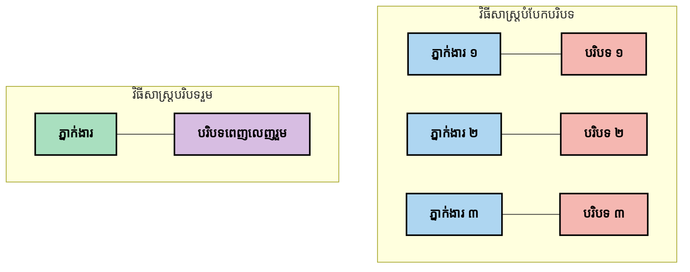
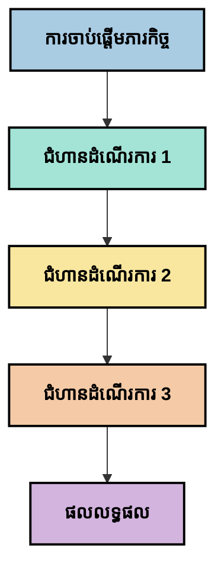
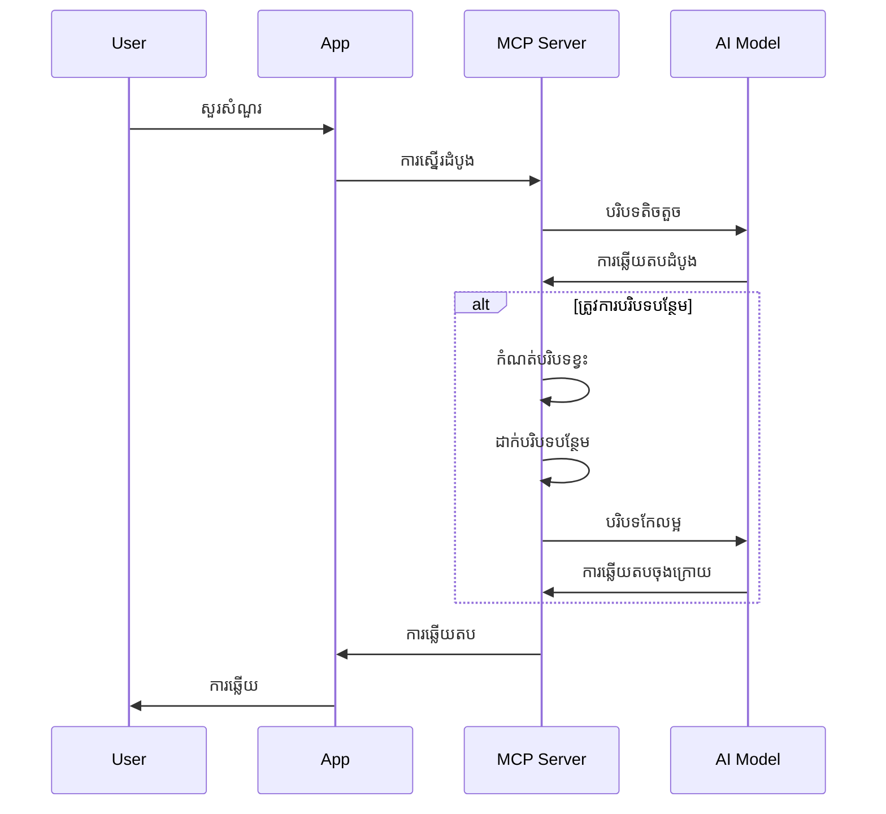
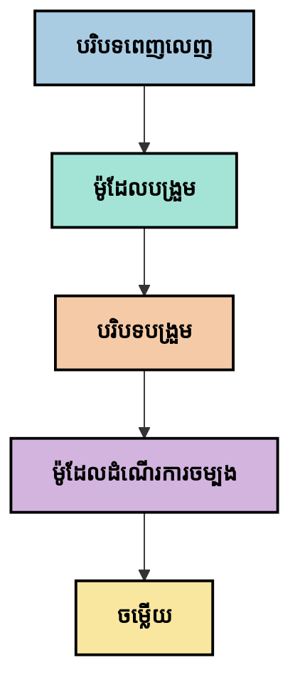
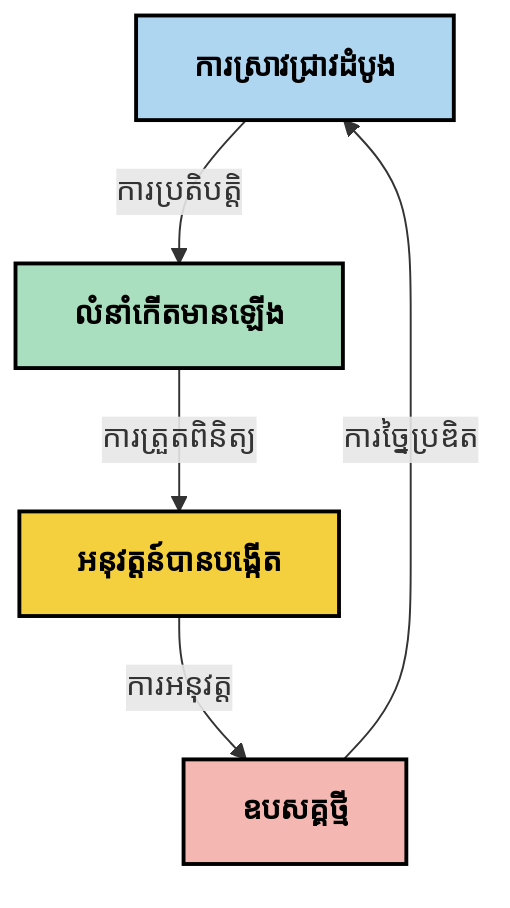

# វិទ្យាសាស្ត្ររៀបចំបរិបទ៖ យល់ដឹងថ្មីមួយនៅក្នុងប្រព័ន្ធបរិគ្រិត MCP

## ទិដ្ឋភាពទូទៅ

វិទ្យាសាស្ត្ររៀបចំបរិបទគឺជាគំនិតថ្មីមួយនៅក្នុងវិស័យ AI ដែលស្វែងយល់ពីរបៀបរៀបចំ ផ្ដល់ និងថែទាំព័ត៌មានទាំងអស់នៅក្នុងអន្តរប្រតិបត្តិការពីរវិញអតិថិជន និងសេវាកម្ម AI។ ការវិវឌ្ឍន៍ប្រព័ន្ធ Model Context Protocol (MCP) កំពុងកើតឡើង ជាកត្តាសំខាន់ក្នុងការយល់ដឹងពីរបៀបគ្រប់គ្រងបរិបទយ៉ាងមានប្រសិទ្ធភាព។ ម៉ូឌុលនេះណែនាំគំនិតវិទ្យាសាស្ត្ររៀបចំបរិបទ និងស្វែងរកការអនុវត្តន៍ពាក់ព័ន្ធជាមួយការអនុវត្ត MCP។

## គោលបំណងអប់រំនៃមូឌុលនេះ

នៅចុងបញ្ចប់នៃមូឌុលនេះ អ្នកនឹងអាច៖

- យល់ដឹងអំពីគំនិតថ្មីវិទ្យាសាស្ត្ររៀបចំបរិបទ និងតួនាទីដែលវាអាចមានក្នុងកម្មវិធី MCP
- បង្ហាញឲ្យឃើញពីបញ្ហាសំខាន់ៗនៃការគ្រប់គ្រងបរិបទ ដែលការរចនាប្រាក់បច្ចេកទេស MCP ដោះស្រាយ
- ស្វែងយល់បច្ចេកទេសសម្រាប់បង្កើនទំនួលខុសត្រូវម៉ូឌែលតាមរយៈការគ្រប់គ្រងបរិបទល្អប្រសើរ
- ពិចារណារបៀបវាស់វែង និងវាយតម្លៃប្រសិទ្ធភាពបរិបទ
- អនុវត្តគំនិតថ្មីៗ ដើម្បីបង្កើនបទពិសោធន៍ AI តាមរយៈស៊ុម MCP

## ការណែនាំអំពីវិទ្យាសាស្ត្ររៀបចំបរិបទ

វិទ្យាសាស្ត្ររៀបចំបរិបទគឺជាគំនិតថ្មីមួយផ្ដោតលើការរចនា និងគ្រប់គ្រងការចេញចូលព័ត៌មានយ៉ាងយកចិត្តទុកដាក់រវាងអ្នកប្រើ ប្រាក់កម្មវិធី និងម៉ូឌែល AI។ ខុសពីវិស័យដែលបានបង្កើតជាស្រេចដូចជា prompt engineering វិទ្យាសាស្ត្ររៀបចំបរិបទនៅតែមិនបានកំណត់យ៉ាងច្បាស់ ដោយអ្នកអនុវត្តការងារត្រូវកំពុងដោះស្រាយបញ្ហាប្រឈមពិសេសដែលមានក្នុងការផ្ដល់ព័ត៌មានត្រឹមត្រូវទៅម៉ូឌែល AI នៅពេលត្រឹមត្រូវ។

នៅពេលម៉ូឌែលភាសាធំៗ (LLMs) បានអភិវឌ្ឍន៍ទំនើប ហារការសំខាន់នៃបរិបទកើតចេញយ៉ាងច្បាស់។ គុណភាព ភាពពាក់ព័ន្ធ និងរបៀបរៀបចំបរិបទដែលយើងផ្ដល់ ឥទ្ធិពលដោយផ្ទាល់លើលទ្ធផលម៉ូឌែល។ វិទ្យាសាស្ត្ររៀបចំបរិបទស្វែងយល់ពីទំនាក់ទំនងនេះ ហើយស្វែងរកនីតិវិធីសម្រាប់គ្រប់គ្រងបរិបទយ៉ាងមានប្រសិទ្ធភាព។

> "នៅឆ្នាំ ២០២៥ ម៉ូឌែលទាំងនោះខ្លាំងខ្ពស់ណាស់។ ប៉ុន្តែមនុស្សដ៏វៃឆ្លាតបំផុតក៏មិនអាចបំពេញការងាររបស់ពួកគេបានយ៉ាងមានប្រសិទ្ធិភាពទេ ដោយគ្មានបរិបទនៃអ្វីដែលពួកគេចង់ឲ្យធ្វើ... ‘វិទ្យាសាស្ត្ររៀបចំបរិបទ’ គឺជាកម្រិតបន្ទាប់នៃ prompt engineering។ វាជាការធ្វើវាដោយស្វ័យប្រវត្តិនៅក្នុងប្រព័ន្ធដ៏រលូន។” — Walden Yan, Cognition AI

វិទ្យាសាស្ត្ររៀបចំបរិបទអាចបូករួម៖

1. **ការជ្រើសរើសបរិបទ**៖ កំណត់អ្វីដែលពាក់ព័ន្ធសម្រាប់កិច្ចការមួយ
2. **ការរៀបចំបរិបទ**៖ រៀបចំព័ត៌មានឲ្យកើនការយល់ដឹងម៉ូឌែល
3. **ការផ្ដល់បរិបទ**៖ បង្រួមរបៀប និងពេលវេលាផ្ដល់ព័ត៌មានទៅម៉ូឌែល
4. **ការថែទាំបរិបទ**៖ គ្រប់គ្រងសភាព និងការវិវឌ្ឍន៍បរិបទតាមពេលវេលា
5. **ការវាយតម្លៃបរិបទ**៖ វាស់វែង និងធ្វើឲ្យប្រសើរបរិបទ

វិស័យទាំងនេះមានទំនាក់ទំនងយ៉ាងជិតស្និទ្ធទៅប្រព័ន្ធ MCP ដែលផ្ដល់វិធីសាស្ត្រតាមស្តង់ដារ សម្រាប់កម្មវិធីផ្ដល់បរិបទទៅ LLMs។

## ទស្សនៈដំណើរការបរិបទ

វិធីមួយក្នុងការមើលវិទ្យាសាស្ត្ររៀបចំបរិបទ គឺគូរទន្តិភាពនៃព័ត៌មានក្នុងប្រព័ន្ធ MCP៖


### វគ្គសំខាន់ៗនៅក្នុងដំណើរការបរិបទ៖

1. **ការបញ្ចូលពីអ្នកប្រើ**៖ ព័ត៌មានដើមពីអ្នកប្រើ (អត្ថបទ រូបភាព ឯកសារ)
2. **ការប្រមូលបរិបទ**៖ ផ្ដុំការបញ្ចូលអ្នកប្រើជាមួយបរិបទប្រព័ន្ធ ប្រវត្តិការសន្ទនា និងព័ត៌មានផ្សេងទៀត
3. **ការបញ្ជាក់ម៉ូឌែល**៖ ម៉ូឌែល AI បកស្រាយបរិបទដែលបានប្រមូល
4. **ការបង្កើតចម្លើយ**៖ ម៉ូឌែលផលិតលទ្ធផលក្រោមបរិបទ
5. **ការគ្រប់គ្រងស្ថានភាព**៖ ប្រព័ន្ធធ្វើបច្ចុប្បន្នភាពស្ថានភាពភាគក្នុងដោយផ្អែកលើអន្តរប្រតិបត្តិការ

ទស្សនៈនេះបង្ហាញពីធម្មជាតិកម្មវិធីបរិបទរលូននៅក្នុងប្រព័ន្ធ AI ហើយបង្ហាញសំណួរសំខាន់ៗអំពីរបៀបគ្រប់គ្រងព័ត៌មាននៅរៀងរាល់ដំណាក់កាល។

## គោលនីតិថ្មីៗក្នុងវិទ្យាសាស្ត្ររៀបចំបរិបទ

នៅពេលវិស័យវិទ្យាសាស្ត្ររៀបចំបរិបទកំពុងតែបង្កើតមាន ប្រសាសន៍មួយចំនួនបានចាប់ផ្តើមកើតឡើងពីអ្នកអនុវត្ត។ គោលនីតិទាំងនេះអាចជួយទាក់ទាញការជ្រើសរើសអនុវត្ត MCP៖

### គោលនីតិ ១៖ ចែករំលែកបរិបទអោយពេញលេញ

បរិបទគួរតែចែករំលែកពេញលេញក្នុងគ្រប់ផ្នែកនៃប្រព័ន្ធ មិនមែនបែកបាក់ទៅតាមភាគី ឬដំណើរការ។ នៅពេលបរិបទត្រូវចែកចាយ ការសម្រេចចិត្តនៅផ្នែកមួយអាចឧបសគ្គការសម្រេចចិត្តនៅផ្នែកផ្សេង។


នៅក្នុងកម្មវិធី MCPនេះ ការរចនាប្រព័ន្ធដែលបរិបទលេចធ្លោឆ្លងកាត់សរុប ហែរជាជម្រើសល្អថែម។

### គោលនីតិ ២៖ យល់ថាសកម្មភាពបង្ហាញការសម្រេចចិត្តភាសារ

សកម្មភាពនីមួយៗដែលម៉ូឌែលអនុវត្តគឺផ្ទុកការសម្រេចចិត្តភាសារពាក់ព័ន្ធនឹងរបៀបអក្សររបស់បរិបទ។ នៅពេលមានភាគីជាច្រើនអនុវត្តការងារលើបរិបទខុសគ្នា ការសម្រេចចិត្តភាសារនោះអាចបង្កការរអាក់រអួល ឬលទ្ធផលមិនស្របគ្នា។

គោលនីតិនេះមានន័យសំខាន់សម្រាប់កម្មវិធី MCP ៖
- ចូលចិត្តដំណើរការរៀងរហូតលើការងារលំបាក ជាងដំណើរការសមមូលបែបបែកបាក់បរិបទ
- ទាមទារថាសំរេចចិត្តគ្រប់ចំណុចទទួលបានព័ត៌មានបរិបទដដែល
- រចនាប្រព័ន្ធឲ្យជំហានផ្សេងៗអាចមើលឃើញបរិបទពេញលេញនៃកិច្ចសម្រេចចិត្តមុនៗ

### គោលនីតិ ៣៖ ជម្រុញជម្រៅបរិបទដោយតំរូវការពីផ្ទៃបង្អួច

ចំពោះការសន្ទនានិងដំណើរការដែលយូរជាងនេះ បរិបទនៃផ្ទៃបង្អួចគឺបំពង់ពេញរហូត។ វិទ្យាសាស្ត្ររៀបចំបរិបទស្វែងរកវិធីដើម្បីគ្រប់គ្រងភាពប៉ះពាល់រវាងបរិបទទូលំទូលាយ និងកំណត់បច្ចេកទេស។

វិធីជាច្រើនកំពុងត្រូវបានសាកល្បងរួមមាន៖
- ការបង្ហាប់បរិបទដែលរក្សាព័ត៌មានសំខាន់ ខណៈកាត់បន្ថយប្រើប្រាស់សញ្ញាសំគាល់
- ការផ្ទុកបរិបទជាថ្មីដោយបន្តទៅតាមមាតិកាសំខាន់
- សេចក្តីសង្ខេបអំពីអន្តរកម្មមុនៗ រួមបញ្ចូលការសម្រេចចិត្ត និងព័ត៌មានសំខាន់ៗ

## បញ្ហាប្រឈមនិងការរចនាប្រាក់បច្ចេកទេស MCP

ប្រព័ន្ធ Model Context Protocol (MCP) ត្រូវបានរចនាឡើងជាមួយនឹងការយល់ដឹងអំពីបញ្ហាប្រឈមកាចំណុះការគ្រប់គ្រងបរិបទ។ ការយល់ដឹងបញ្ហានេះជួយពន្យល់ពីផ្នែកសំខាន់ៗនៃការរចនាប្រាក់បច្ចេកទេស MCP៖

### បញ្ហា ១៖ កំណត់ទំហំផ្ទៃបង្អួចបរិបទ  
ម៉ូឌែល AI ភាគច្រើនមានទំហំផ្ទៃបង្អួចកំណត់ ដោយដាក់ព្រំដែនលើការបញ្ចូលព័ត៌មានក្នុងមួយដង។

**ចម្លើយរចនាប្រាក់ MCP៖**  
- ប្រាក់បច្ចេកទេសគាំទ្របរិបទដែលមានរចនាសម្ព័ន្ធ និងប្រើធនធានយ៉ាងមានប្រសិទ្ធភាព  
- ធនធានអាចប្រើលេខصفح, ហើយអាចផ្ទុកតាមដំណាក់កាល

### បញ្ហា ២៖ កំណត់ភាពពាក់ព័ន្ធ  
ការសម្រេចចិត្តតើព័ត៌មានណាដែលពាក់ព័ន្ធបំផុតសម្រាប់បញ្ចូលបរិបទពិបាក។

**ចម្លើយរចនាប្រាក់ MCP៖**  
- ឧបករណ៍បត់បែនជួយស្វែងយល់ព័ត៌មានតាមតំរូវការ  
- ការចាត់តាំង prompt មានរចនាសម្ព័ន្ធដើម្បីរៀបចំបរិបទឲ្យមានកម្រិតសំលាប់

### បញ្ហា ៣៖ ការរក្សាប្រវត្តិបរិបទ  
ការគ្រប់គ្រងស្ថានភាពជារយៈពេលអាចត្រូវការតាមដានយ៉ាងប្រុងប្រយ័ត្ន។

**ចម្លើយរចនាប្រាក់ MCP៖**  
- ការគ្រប់គ្រងសម័យយ៉ាងស្តង់ដារ  
- លំនាំអន្តរប្រតិបត្តិការប្រាប់លម្អិតសម្រាប់បរិបទវិវឌ្ឍន៍

### បញ្ហា ៤៖ បរិបទពហុរាងការ  
ទិន្នន័យប្រភេទផ្សេងៗ (អត្ថបទ រូបភាព ទិន្នន័យរៀបចំ) ត្រូវការរបៀបគ្រប់គ្រងខុសៗគ្នា។

**ចម្លើយរចនាប្រាក់ MCP៖**  
- ការរចនាប្រាក់អាចគ្រប់គ្រងមាតិកាប្រភេទចម្រុះ  
- តំណាងមាតិកាពហុរាងការយ៉ាងស្តង់ដារ

### បញ្ហា ៥៖ សុវត្ថិភាព និងភាពឯកជន  
បរិបទហាក់បីដូចជាមានព័ត៌មានផ្តោតអារម្មណ៍ដែលត្រូវការការពារ។

**ចម្លើយរចនាប្រាក់ MCP៖**  
- ព្រំដែនច្បាស់លាស់រវាងការទទួលខុសត្រូវរបស់អតិថិជន និងម៉ាស៊ីនបម្រើ  
- ជម្រើសកំណត់ដំណើរការបង្ការការរអត្ថាធិប្បាយទិន្នន័យ

ការយល់ដឹងពីបញ្ហាប្រឈមទាំងនេះ និងរបៀប MCP បំពេញអាចជាជំនួយមូលដ្ឋានសម្រាប់ការស្វែងយល់បច្ចេកទេសវិទ្យាសាស្ត្ររៀបចំបរិបទកាន់តែទូលំទូលាយ។

## វិធីសាស្ត្រនៅក្រោមការសាកល្បងក្នុងវិទ្យាសាស្ត្ររៀបចំបរិបទ

នៅពេលវិស័យវិទ្យាសាស្ត្ររៀបចំបរិបទកំពុងអភិវឌ្ឍន៍ វិធីសាស្ត្រមួយចំនួនកំពុងគ្រោងបង្ហាញគំនិតបច្ចុប្បន្ន។ វាពិតជាគំនិតបច្ចេកទេស ប៉ុន្តែពួកវាបានបង្ហាញឡើងលំនាំនៃការអនុវត្ត MCP ដែលនឹងរីកចម្រើនជាថ្មី។

### ១. ដំណើរការរៀងរាល់ជំហានតែមួយ

ផ្ទុយពីរចនាសម្ព័ន្ធ multi-agent ដែលចែកចាយបរិបទ អ្នកអនុវត្តមួយចំនួនឯកភាពថា ដំណើរការរៀងរាល់ជំហានតែមួយឲ្យលទ្ធផលជាប់ជាមួយគ្នា។ នេះស្របទៅនឹងគោលនីតិរក្សាបរិបទសរុបមួយទៀត។


ក្នុងខណៈដែលវិធីនេះនឹងមើលទៅសមត្ថភាពស្ទើរតិចជាងដំណើរការសមមូល វាធ្វើការប្រសើរលទ្ធផលស្មោះត្រង់ និងទុកចិត្តបានល្អ ដោយមនុស្សរាល់ជំហានមានការយល់ច្បាស់ពីការសម្រេចចិត្តមុនៗ។

### ២. ចែកបរិបទធំៗទៅជាផ្នែកតូច និងកំណត់អាទិភាព

បំបែកបរិបទធំទៅជាផ្នែកធ្វើការងារងាយស្រួល និងផ្តល់អាទិភាពចំពោះអ្វីសំខាន់បំផុត។

```python
# ឧទាហរណ៍គំនិត៖ ការបំបែកបរិបទ និងការប្រកាន់ទំនាក់ទំនងជាអាទិភាព
def process_with_chunked_context(documents, query):
    # ១. បំបែកឯកសារឲ្យក្លាយជា គ្រាប់ខ្នាតតូចៗ
    chunks = chunk_documents(documents)
    
    # ២. គណនាចំណាំភាពសមរម្យសម្រាប់គ្រាប់ខ្នាតនីមួយៗ
    scored_chunks = [(chunk, calculate_relevance(chunk, query)) for chunk in chunks]
    
    # ៣. រៀបចំគ្រាប់ខ្នាតដោយផ្អែកលើចំណាំភាពសមរម្យ
    sorted_chunks = sorted(scored_chunks, key=lambda x: x[1], reverse=True)
    
    # ៤. ប្រើគ្រាប់ខ្នាតដែលមានភាពសមរម្យខ្ពស់ជាបរិបទ
    context = create_context_from_chunks([chunk for chunk, score in sorted_chunks[:5]])
    
    # ៥. ដំណើរការជាមួយបរិបទដែលត្រូវបានប្រកាន់ជាអាទិភាព
    return generate_response(context, query)
```

គំនិតខាងលើបង្ហាញពីរបៀបបំបែកឯកសារធំៗទៅជាចំណែកតូចៗ និងជ្រើសរើសតែផ្នែកពាក់ព័ន្ធបំផុតសម្រាប់បរិបទ។ វិធីនេះជួយឲ្យដំណើរការមិនលុបបំបាក់ផ្ទៃបង្អួច ហើយអាចប្រើប្រាស់មូលដ្ឋានចំណេះដឹងធំៗបានយ៉ាងល្អ។

### ៣. ការផ្ទុកបរិបទជាថ្មីតាមដំណាក់កាល

ផ្ទុកបរិបទជាថ្មីតាមតម្រូវការ មិនមែនផ្ទុកអស់ជាលើកដំបូង។


ការផ្ទុកបរិបទជាថ្មីចាប់ពីតិចតួច ហើយពង្រីកតួយ៉ាងតិចតួចតាមបំណង។ នេះអាចកាត់បន្ថយប្រើប្រាស់សញ្ញាសំគាល់សម្រាប់សំណួរងាយៗ ខណៈដែលរក្សាជំនាញដោះស្រាយសំណួរលំបាក។

### ៤. ការបង្ហាប់ និងសង្ខេបបរិបទ

កាត់បន្ថយទំហំបរិបទ ខណៈរក្សាព័ត៌មានសំខាន់ៗមិនបាត់បង់។


ការបង្ហាប់បរិបទផ្តោតលើ៖  
- ការដកព័ត៌មានមិនចាំបាច់ចេញ  
- សង្ខេបមាតិកាយូរ  
- ដកស្រាយភារកិច្ច និងព័ត៌មានសំខាន់ៗ  
- រក្សាធាតុបរិបទសំខាន់  
- បង្កើតភាពប្រសិទ្ធភាពក្នុងប្រើសញ្ញាសំគាល់

វិធីនេះមានប្រយោជន៍បំផុតសម្រាប់រក្សាសន្ទនារយៈពេលវែងក្នុងផ្ទៃបង្អួច ឬសម្រាប់ដំណើរការឯកសារធំៗយ៉ាងមានប្រសិទ្ធភាព។ អ្នកអនុវត្តមួយចំនួនកំពុងប្រើម៉ូឌែលពិសេសក្នុងការបង្ហាប់ និងសង្ខេបប្រវត្តិសន្ទនា។

## ការពិចារណាក្នុងការស្វែងរកវិទ្យាសាស្ត្ររៀបចំបរិបទ

នៅពេលយើងស្វែងយល់ពីវិស័យថ្មីនេះ មានចំនុចមួយចំនួនគួរតែរក្សាទុកកន្លែងចិត្តពេលអនុវត្ត MCP។ ពួកវាមិនមែនជាការណែនាំបួសមួយទេ ប៉ុន្តែជាវិស័យសម្រាប់សាកល្បងក្នុងការកែលម្អឧបករណ៍របស់អ្នក។

### ពិចារណាគោលដៅបរិបទរបស់អ្នក

មុនធ្វើការអនុវត្តដំណោះស្រាយការគ្រប់គ្រងបរិបទស្មុគស្មាញ សូមបញ្ជាក់ច្បាស់ថាតើអ្នកចង់សម្រេចអ្វី៖  
- តើព័ត៌មានណាដែលម៉ូឌែលត្រូវការដើម្បីជោគជ័យ?  
- ព័ត៌មានណាដែលមានសារៈសំខាន់ និងណាដែលជារឿងបន្ថែម?  
- កំណត់កម្រិតប្រសិទិ្ធភាពរបស់អ្នក (ពេលយូរ ដែនកំណត់សញ្ញាសំគាល់ ចំណាយ)?

### ស្វែងរករបៀបបរិបទជាស្រទាប់

អ្នកអនុវត្តមួយចំនួនរកឃើញភាពជោគជ័យជាមួយបរិបទដែលត្រូវបានរៀបចំតាមស្រទាប់គំនិត៖  
- **ស្រទាប់ស្នូល**៖ ព័ត៌មានបាច់បាច់ដែលម៉ូឌែលតែងតែរ benötigt  
- **ស្រទាប់ស្ថានភាព**៖ បរិបទពាក់ព័ន្ធនឹងអន្តរកម្មបច្ចុប្បន្ន  
- **ស្រទាប់គាំទ្រ**៖ ព័ត៌មានបន្ថែមដែលអាចជួយបាន  
- **ស្រទាប់ជំនួស**៖ ព័ត៌មានដែលបានចូលប្រើតែពេលចាំបាច់

### ស្វែងយល់យុទ្ធសាស្ត្រស្វែងរក

ប្រសិទ្ធភាពបរិបទច្រើនពាសពេញលើរបៀបអ្នកស្វែងរកព័ត៌មាន៖  
- ស្វែងរកអត្ថានុរកម្ម និង embeddings សម្រាប់មាតិកាពាក់ព័ន្ធគំនិត  
- ស្វែងរកជាប់គន្លឹះសម្រាប់ព័ត៌មានបច្ចេកទេស  
- របៀបផ្សំសម្រាប់ការស្វែងរកច្រើនវិធីផ្សំជាមួយគ្នា  
- ការតម្រៀប metadata ដើម្បីកំណត់វិសាលភាព​ជាប់លើប្រភេទ ថ្ងៃខែ ឬប្រភព

### សាកល្បងដោយផ្អែកលើភាពរលូនបរិបទ

របៀបរៀបចំបរិបទ និងចរន្តអាចប៉ះពាល់ដល់ការយល់យ៉ាងម៉ូឌែល៖  
- ការប្រមូលព័ត៌មានទាក់ទងគ្នា  
- ប្រើទ្រង់ទ្រាយ និងការរៀបចំស្របតាមទំរង់  
- រក្សាចំណុចតាមត្រង់ខ្លឹមសារឬលំដាប់ពេលវេលា  
- ការជៀសវាងព័ត៌មានមិនស្របគ្នា

### កំណត់តុល្យភាពរវាងរចនាសម្ព័ន្ធ Multi-Agent

ក្នុងខណៈដែលរចនាសម្ព័ន្ធ multi-agent មានប្រជាប្រិយភាពក្នុងផ្នែក AI ជាច្រើន វាបណ្ដាលមកនូវបញ្ហាធំៗសម្រាប់គ្រប់គ្រងបរិបទ៖  
- ការបែកបាក់បរិបទអាចបណ្តាលឲ្យការសម្រេចចិត្តមិនស្របគ្នាអ្នកចូលរួមផ្សេងៗគ្នា  
- ដំណើរការសមមូលអាចបង្កគូទំហឹងផ្សេងៗដែលពិបាកដោះស្រាយ  
- ចរន្តទំនាក់ទំនងជាច្រើនរវាងភាគីអាចប៉ះពាល់លទ្ធផល  
- តម្រូវការគ្រប់គ្រងស្ថានភាពស្មុគសម្ព័ន្ធ

នៅក្នុងករណីភាគច្រើន វិធីសាស្ត្រភាគីតែមួយដើម្បីគ្រប់គ្រងបរិបទពេញលេញអាចផ្តល់លទ្ធផលទំនុកចិត្តល្អជាង multi-agent ដែលបែកបាក់បរិបទ។

### អភិវឌ្ឍវិធីវាយតម្លៃ

ដើម្បីបង្កើនវិទ្យាសាស្ត្ររៀបចំបរិបទរយៈពេលវែង សូមពិចារណារបៀបវាស់វែងភាពជោគជ័យ៖  
- ការធ្វើតេស្ត A/B លើរចនាបរិបទផ្សេងៗ  
- តាមដានប្រើប្រាស់សញ្ញាសំគាល់ និងពេលវេលាទទួលចម្លើយ  
- តាមដានការពេញចិត្តអ្នកប្រើ និងអត្រាជោគជ័យបន្ទុក  
- វិភាគករណីបរាជ័យនៃយុទ្ធសាស្ត្របរិបទ

ចំណុចទាំងនេះជាគន្លងស្វែងយល់មួយនៅក្នុងស្រុកវិទ្យាសាស្ត្ររៀបចំបរិបទ។ នៅពេលវាសម្រេចកំណត់ត្រឹមត្រូវ វិធីសាស្ត្រ និងនីតិវិធីរឹងមាំថែមទៀតនឹងកើតឡើង។

## វាស់ប្រសិទ្ធភាពបរិបទ៖ ស៊ុមកំពុងរីកចម្រើន

នៅពេលវិទ្យាសាស្ត្ររៀបចំបរិបទកំពុងក្លាយជាគំនិត អ្នកអនុវត្តកំពុងស្វែងរកវិធីវាស់វែងប្រសិទ្ធភាពរបស់វា។ មិនមានស៊ុមធម្មតាឡើយ ប៉ុន្តែត្រូវពិនិត្យមាត្រដ្ឋានមួយចំនួនសម្រាប់ប្រែប្រួលនាពេលអនាគត។

### មាត្រដ្ឋានវាស់វែងសក្តានុពល


#### ១. ការពិចារណាលើប្រសិទ្ធភាពបញ្ចូល

- **សមាមាត្របរិបទទៅចម្លើយ**៖ តើតម្រូវបរិបទប៉ុន្មានទាក់ទងនឹងទំហំចម្លើយ?  
- **ប្រើប្រាស់សញ្ញាសំគាល់**៖ តើភាគរយនៃសញ្ញាសំគាល់បានផ្ដល់បរិបទមានឥទ្ធិពលលើចម្លើយ?  
- **កាត់បន្ថយបរិបទ**៖ តើការបង្ហាប់ព័ត៌មានដើមមានប្រសិទ្ធភាពប៉ុណ្ណា?

#### ២. ការពិចារណាលើប្រសិទ្ធភាព

- **ឥទ្ធិពលលើពេលវេលា**៖ តើការគ្រប់គ្រងបរិបទប៉ះពាល់ម៉ោងផ្លាស់ប្ដូរប៉ុណ្ណា?  
- **សេដ្ឋកិច្ចសញ្ញាសំគាល់**៖ តើយើងប្រើសញ្ញាសំគាល់ដោយមានប្រសិទ្ធភាពទេ?  
- **ភាពត្រឹមត្រូវនៃការស្វែងរក**៖ តើព័ត៌មានបានរក្ោសពាក់ព័ន្ធកំរិតណា?  
- **ប្រើប្រាស់ធនធាន**៖ តើតម្រូវការត្រុមកុំព្យូទ័រក្នុងការប្រើប្រាស់?

#### ៣. ការពិចារណាលើគុណភាព

- **ភាពពាក់ព័ន្ធចម្លើយ**៖ តើចម្លើយឆ្លើយសំណួរដូចម្តេច?  
- **ភាពត្រឹមត្រូវនៃតើ**៖ តើការគ្រប់គ្រងបរិបទធ្វើឲ្យមានភាពត្រឹមត្រូវខ្ពស់?  
- **ភាពត្រឹមត្រូវស្របគ្នា**៖ តើចម្លើយស្របគ្នាសម្រាប់សំណួរដូចគ្នា?  
- **អត្រាព្រមានចោល**៖ តើបរិបទល្អធ្វើឲ្យម៉ូឌែលបន្ថយការស្រមោល?

#### ៤. ការពិចារណាលើបទពិសោធន៍អ្នកប្រើ

- **អត្រាផ្សព្វផ្សាយតាមបន្ត**៖ តើអ្នកប្រើត្រូវការបញ្ជាក់ជាបន្ដទៀតប៉ុណ្ណា?  
- **ការសម្រេចបេសកកម្ម**៖ តើអ្នកប្រើបញ្ចប់គោលបំណងរបស់ពួកគេបានទេ?  
- **មើលឃើញភាពពេញចិត្ត**៖ តើអ្នកប្រើវាយតម្លៃបទពិសោធន៍យ៉ាងដូចម្តេច?

### វិធីសាកល្បងសម្រាប់វាស់វែង

ពេលសាកល្បងវិទ្យាសាស្ត្ររៀបចំបរិបទនៃកម្មវិធី MCP សូមពិចារណាវិធីសាកល្បង៖

1. **ប្រៀបធៀបមូលដ្ឋាន**៖ ច្បាស់លាស់ដោយប្រើវិធីសាមញ្ញ មុនសាកល្បងវិធីច្រើនលំដាប់  
2. **បម្លែងបន្ដិចៗ**៖ ប្តូរមួយចំណុចនៃការគ្រប់គ្រងបរិបទក្នុងមួយដង ដើម្បីដឹងប្រសិទ្ធភាព  
3. **វាយតម្លៃផ្អែកលើអ្នកប្រើ**៖ បញ្ចូលទៅខ្នាតសង្ខេបវិចារ និងមតិអ្នកប្រើ  
4. **វិភាគករណីបរាជ័យ**៖ សិក្សាករណីដែលយុទ្ធសាស្ត្របរិបទបរាជ័យដើម្បីរកកំណែល  
5. **ការវាយតម្លៃពហុវិមាត្រ**៖ ពិចារណាតុល្យភាពរវាងប្រសិទ្ធភាព គុណភាព និងបទពិសោធន៍អ្នកប្រើ

វិធីសាកល្បងនិងពហុវិមាត្រនេះស្របទៅនឹងធម្មជាតិនៃវិទ្យាសាស្ត្ររៀបចំបរិបទ។

## ចំណាត់ថ្នាក់ចុងក្រោយ

វិទ្យាសាស្ត្ររៀបចំបរិបទគឺជាវិស័យថ្មីមួយដែលអាចធ្វើដំណើរជាគន្លងសំខាន់ក្នុងកម្មវិធី MCP។ ដោយការពិចារណាយ៉ាងម៉ត់ចត់អំពីរបៀបព័ត៌មានឆ្លងកាត់ប្រព័ន្ធ អ្នកអាចបង្កើតបទពិសោធន៍ AI ឲ្យមានប្រសិទ្ធភាព ច្បាស់លាស់ និងមានតម្លៃសម្រាប់អ្នកប្រើ។

បច្ចេកទេស និងវិធីសាស្ត្រនៅក្នុងមូឌុលនេះបង្ហាញពីគំនិតដំបូង ចំពោះពេលនេះមិនមែនជាពិធីការដែលបានកំណត់។ វិទ្យាសាស្ត្ររៀបចំបរិបទអាចអភិវឌ្ឍក្លាយជាវិស័យកំណត់ខ្ពស់នៅពេលម៉ាស៊ីន AI វិវឌ្ឍ និងយល់ដឹងច្រើនឡើង។ សព្វថ្ងៃ ការសាកល្បងជាមួយការវាស់វែងស្តង់ដារត្រូវបានគេសង្កេតថាជាវិធីមានប្រសិទ្ធភាពបំផុត។

## ទិសដៅអនាគតសក្តានុពល

វិស័យវិទ្យាសាស្ត្ររៀបចំបរិបទនៅក្នុងដំណាក់កាលដំបូង ប៉ុន្តែមានទិសដៅសង្ឃឹម៖

- គោលនីតិវិទ្យាសាស្ត្ររៀបចំបរិបទអាចប៉ះពាល់យ៉ាងខ្លាំងលើប្រសិទ្ធភាពម៉ូឌែល ទំនួលខុសត្រូវ និងភាពទុកចិត្ត  
- វិធីសាស្ត្រយោងតែមួយជាមួយការគ្រប់គ្រងបរិបទពេញលេញអាចលើសរចនាសម្ព័ន្ធ multi-agent សម្រាប់ករណីជាច្រើន  
- ម៉ូឌែលបង្ហាប់បរិបទពិសេសអាចក្លាយជាផ្នែកស្តង់ដារបស់ទីន្នន័យ AI  
- តុល្យភាពរវាងបរិបទពេញលេញ និងកំណត់សញ្ញាសំគាល់នឹងជួយបង្កើតការកែលម្អថ្មីៗ  
- នៅពេលម៉ូឌែលកាន់តែប្រសើរជាមួយការប្រាស្រ័យទាក់ទងដូចមនុស្ស ការសហការពហុភាគីពិតប្រាកដអាចកើតមានជាបន្ដ  
- ការអនុវត្ត MCP អាចអភិវឌ្ឍស្តង់ដារក្នុងការគ្រប់គ្រងបរិបទដែលកើតឡើងពីការសាកល្បងបច្ចុប្បន្ន


## ប្រាក់ធនធាន

### ប្រាក់ធនធាន MCP ផ្លូវការបាន
- [គេហទំព័រ​គន្លង​បច្ចេកវិទ្យា​ប្រតិបត្តិការ​ទ្រង់ទ្រាយ](https://modelcontextprotocol.io/)
- [បញ្ជាក់​ទ្រង់ទ្រាយ​គន្លង​បច្ចេកវិទ្យា​ប្រតិបត្តិការ](https://github.com/modelcontextprotocol/modelcontextprotocol)
- [ឯកសារ MCP](https://modelcontextprotocol.io/docs)
- [MCP C# SDK](https://github.com/modelcontextprotocol/csharp-sdk)
- [MCP Python SDK](https://github.com/modelcontextprotocol/python-sdk)
- [MCP TypeScript SDK](https://github.com/modelcontextprotocol/typescript-sdk)
- [MCP Inspector](https://github.com/modelcontextprotocol/inspector) - គ្រឿង​ចំហរ​តេស្ត​ភាព​ថ្មី​សម្រាប់ម៉ាស៊ីន​បម្រើ MCP

### អត្ថបទ​វិស្វកម្ម​គន្លង
- [កុំ​សាងសង់អូស *Multi-Agents*: គោលការណ៍​នៃ​វិស្វកម្ម​គន្លង](https://cognition.ai/blog/dont-build-multi-agents) - ចំណេះដឹង​របស់ Walden Yan អំពី​គោលការណ៍​នៃ​វិស្វកម្ម​គន្លង
- [មក​ភ្នាក់ងារ​សាងសង់​ដោយ​អនុវត្ត](https://cdn.openai.com/business-guides-and-resources/a-practical-guide-to-building-agents.pdf) - មគ្គុទ្ទេសក៍​របស់ OpenAI អំពី​ការ​រចនា​ភ្នាក់ងារ​ប្រសើរ
- [សាងសង់​ភ្នាក់ងារ​ប្រសើរ](https://www.anthropic.com/engineering/building-effective-agents) - វិធីសាស្រ្ត​របស់ Anthropic សម្រាប់​ការ​អភិវឌ្ឍ​ភ្នាក់ងារ

### ការស្រាវជ្រាវ​ដែលពាក់ព័ន្ធ
- [ការបង្កើន​ការយក​ចេញ​ដោយ δυναmique សម្រាប់​ម៉ូដែល​ភាសា​ធំ](https://arxiv.org/abs/2310.01487) - ការស្រាវជ្រាវ​អំពី​វិធីសាស្រ្ត​យក​ចេញ​ដោយ δυναmique
- [បាត់បង់​នៅ​កណ្តាល: ម៉ូដែល​ភាសា​យក​ប្រេកង់​ច្រើនយូរ​ដូចម្តេច](https://arxiv.org/abs/2307.03172) - ការស្រាវជ្រាវ​សំខាន់​អំពី​គំរូ​ដំណើរការ​គន្លង
- [ការចម្លង​រាង​រូបភាព​គោលបំណង​តាមអត្ថបទ​មានរៀបចំ​ដោយ CLIP Latents](https://arxiv.org/abs/2204.06125) - ឯកសារ DALL-E 2 ជាមួយចំណេះដឹង​អំពី​ការ​រៀបចំ​គន្លង
- [ការស្រាវ​ជ្រាវ​តួនាទី​គន្លង​ក្នុង​ស្ថាបត្យកម្ម​ម៉ូដែល​ភាសា​ធំ](https://aclanthology.org/2023.findings-emnlp.124/) - ការស្រាវ​ជ្រាវ​ថ្មីៗ​អំពី​ការ​ដោះស្រាយ​គន្លង
- [សហប្រតិបត្តិការ​ម៉ូលטי​អេហ្សិន: ការស្ទង់មតិ](https://arxiv.org/abs/2304.03442) - ការស្រាវជ្រាវ​អំពី​ប្រព័ន្ធ​ម៉ូលਟੀ​អេហ្សិន និង​បញ្ហា​របស់​ពួកវា

### ឯកសារ​បន្ថែម
- [បច្ចេកទេស​ប្រសើរ​សម្រាប់​បង្ខូច​បង្អួច​គន្លង](https://learn.microsoft.com/en-us/azure/ai-services/openai/concepts/context-window)
- [បច្ចេកទេស RAG ជាក់លាក់](https://www.microsoft.com/en-us/research/blog/retrieval-augmented-generation-rag-and-frontier-models/)
- [ឯកសារ Semantic Kernel](https://github.com/microsoft/semantic-kernel)
- [ឧបករណ៍ AI សម្រាប់​ការ​គ្រប់គ្រង​គន្លង](https://github.com/microsoft/aitoolkit)

## តើ​បន្ទាប់​ទៅ​ជា​អ្វី

- [5.15 MCP ការដឹកជញ្ជូន​ផ្ទាល់ខ្លួន](../mcp-transport/README.md)

---

<!-- CO-OP TRANSLATOR DISCLAIMER START -->
**ការបដិសេធ**៖  
ឯកសារនេះបានបំប្រួញបកប្រែដោយប្រើសេវាកម្មបកប្រែ AI [Co-op Translator](https://github.com/Azure/co-op-translator)។ ខណៈពេលដែលយើងខិតខំរកភាពត្រឹមត្រូវ សូមយកចិត្តទុកដាក់ថាការបកប្រែដោយស្វ័យប្រវត្តិអាចមានកំហុស ឬការខុសត្រូវអាក្រក់មួយចំនួន។ ឯកសារដើមក្នុងភាសាមាតុភាសាត្រូវបានគិរីទុកឲ្យជាផ្លូវការ និងជាឯកសារយោងដើម។ សម្រាប់ព័ត៌មានសំខាន់ៗ ការបកប្រែដោយអ្នកជំនាញមនុស្សត្រូវបានផ្តល់អនុសាសន៍។ យើងមិនទទួលខុសត្រូវចំពោះការយល់ច្រឡំ ឬការបកស្រាយមិនត្រឹមត្រូវណាមួយដែលមានប្រតិកម្មចេញពីការប្រើប្រាស់ការបកប្រែនេះនៅឡើយទេ។
<!-- CO-OP TRANSLATOR DISCLAIMER END -->