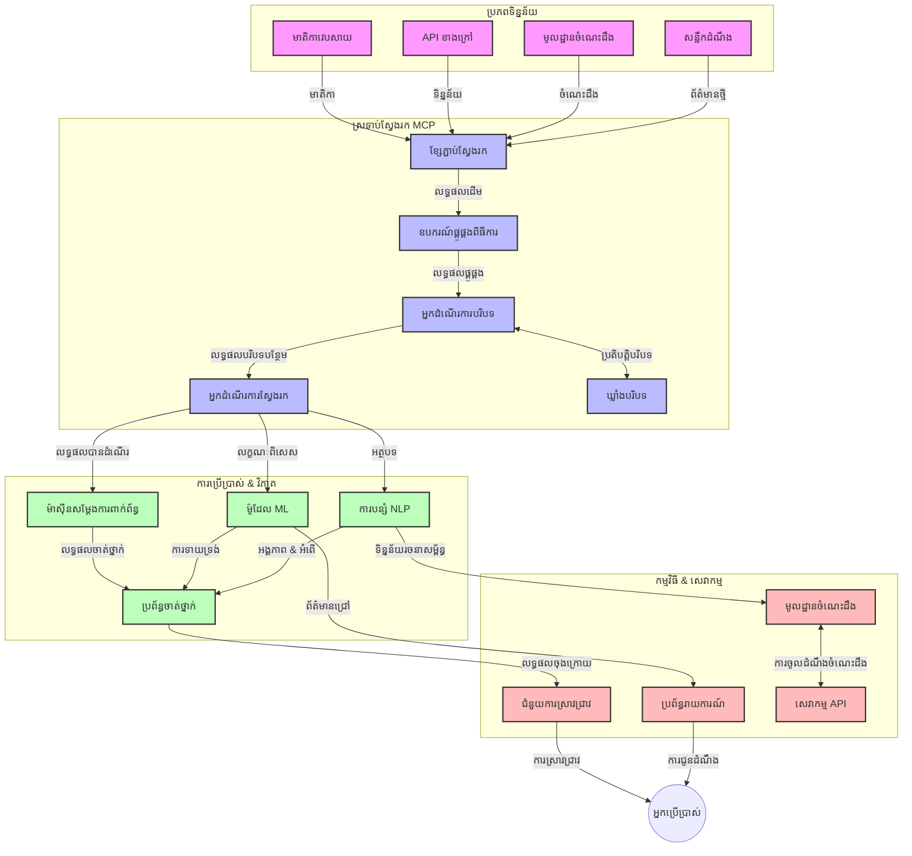
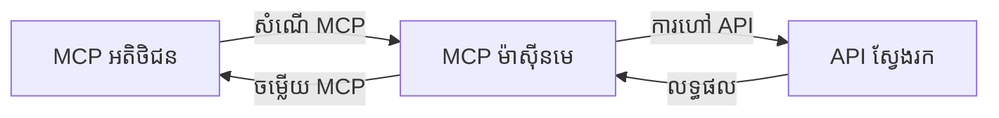
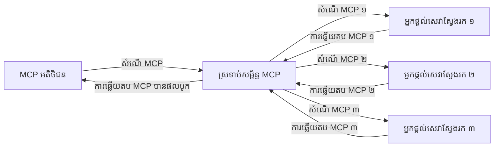
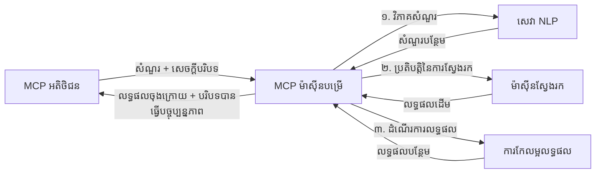

# Model Context Protocol សម្រាប់ស្វែងរកវែបផ្ទាល់ខ្លួន

## រួមបញ្ចូលទិដ្ឋភាព

ការស្វែងរកវែបផ្ទាល់ខ្លួនបានក្លាយជាភាពចាំបាច់ក្នុងបរិយាកាសដែលផ្អែកលើព័ត៌មានសព្វថ្ងៃនេះ ដែលកម្មវិធីត្រូវការចូលដំណើរការព័ត៌មានថ្មីៗគ្រប់ទីកន្លែងនៅលើអ៊ីនធឺណិត ដើម្បីផ្តល់នូវចម្លើយដែលពាក់ព័ន្ធ និងទាន់ពេលវេលា។ ប្រតិបត្តិការម៉ូឌុល Model Context Protocol (MCP) តំណាងឱ្យការរីកចម្រើនយ៉ាងសំខាន់ក្នុងការបង្កើតប្រតិបត្តិការស្វែងរកនេះ កែលម្អប្រសិទ្ធិភាពស្វែងរក គ្រប់គ្រងបរិបទ និងធ្វើឱ្យប្រសើរឡើងនូវការសម្តែងប្រព័ន្ធទួទាំងមូល។

ម៉ូឌុលនេះស្វែងយល់ពីរបៀបដែល MCP បម្លែងការស្វែងរកវែបផ្ទាល់ខ្លួនដោយផ្តល់នូវវិធីសាស្ត្រតម្កល់បរិបទដែលមានស្តង់ដារសម្រាប់គ្រប់គ្រងបរិបទចន្លោះគំរូ AI ម៉ាស៊ីនស្វែងរក និងកម្មវិធី។

### អ្វីដែលអ្នកនឹងរៀន

ក្នុងមេរៀនទូលំទូលាយនេះ អ្នកនឹងរកឃើញ៖

- របៀបដែល MCP បង្កើតស្ពានពេញលេញចន្លោះគំរូ AI និងសមត្ថភាពស្វែងរកវែបផ្ទាល់ខ្លួន
- គំរូស្ថាបត្យកម្មសម្រាប់អនុវត្តន៍ដំណោះស្រាយស្វែងរកមានប្រសិទ្ធិភាព និងអាចពង្រីកបានជាមួយ MCP
- វិធីសាស្ត្ររក្សាទុកបរិបទស្វែងរកក្នុងចន្លោះសំណួរច្រើន និងអន្តរកម្ម
- កូដអនុវត្តន៍ជាក់ស្តែងដោយប្រើ Python និង JavaScript សម្រាប់ស្ថានភាពស្វែងរកផ្សេងៗ
- វិធីសាស្ត្ររៀបចំតុល្យភាពរវាងភាពពាក់ព័ន្ធ ភាពទាន់ពេលវេលា និងប្រសិទ្ធភាពក្នុងប្រព័ន្ធស្វែងរកដែលបើកដោយ MCP

## របៀបស្វែងរកវែបផ្ទាល់ខ្លួន

ការស្វែងរកវែបផ្ទាល់ខ្លួនគឺជាវិធីសាស្រ្តបច្ចេកវិទ្យា ដែលអនុញ្ញាតឱ្យសំណួរស្វែងរក ត្រូវបានដំណើរការតាមបែបជាបន្តបន្ទាប់ ការពិនិត្យ និងវិភាគព័ត៌មានវែបនៅពេលវាបង្ហាញ ឬកែប្រែថ្មីៗ ដើម្បីអនុញ្ញាតឱ្យប្រព័ន្ធផ្តល់ព័ត៌មានថ្មី និងមានភាពពាក់ព័ន្ធជាមួយចុងក្រោយដោយមានពេលពន្យារតិច។ ខុសពីប្រព័ន្ធស្វែងរកដើមដែលដំណើរការនៅលើទិន្នន័យដែលបានរៀបចំហើយដែលអាចចាស់ជាងមួយម៉ោង ឬរយៈពេលជាច្រើនថ្ងៃ ការស្វែងរកវែបផ្ទាល់ខ្លួនដំណើរការទិន្នន័យនៅក្នុងរយៈពេលពិតពីវែប ដើម្បីផ្តល់នូវចំលើយ និងព័ត៌មានដែលបង្ហាញស្ថានភាពបច្ចុប្បន្ននៃមាតិកាបណ្តាញ។

### មូលដ្ឋានគំនិតសម្រាប់ការស្វែងរកវែបផ្ទាល់ខ្លួន៖

- **ដំណើរការសំណួរបន្តបន្ទាប់**៖ សំណួរស្វែងរកត្រូវបានដំណើរការជាប់ជានិច្ចប្រឆាំងនឹងប្រភពទិន្នន័យដែលកំពុងតែបច្ចុប្បន្នភាពជាបានទៀងទាត់
- **ឲ្យអាទិភាពភាពទាន់សម័យ**៖ ប្រព័ន្ធត្រូវរចនាឡើងដោយផ្តោតទៅលើព័ត៌មានថ្មីៗ
- **តុល្យភាពភាពពាក់ព័ន្ធ**៖ រក្សាទំនាក់ទំនងរវាងភាពពាក់ព័ន្ធនិងភាពទាន់សម័យ
- **ស្ថាបត្យកម្មអាចពង្រីកបាន**៖ ប្រព័ន្ធត្រូវអាចដោះស្រាយពីបន្ទុកសំណួរផ្សេងៗ និងបរិមាណទិន្នន័យផ្សេងៗ
- **ការយល់ដឹងបរិបទ**៖ ការរក្សាទុកបរិបទអ្នកប្រើតាមពេលវេលាស្វែងរកគឺសំខាន់សម្រាប់លទ្ធផលមានន័យ
- **ការកែសម្រួលសំណួរបន្តបន្ទាប់**៖ កែប្រែសំណួរយ៉ាងឆ្លាតវៃរៀងរាល់ខណៈមានបរិបទ និងលទ្ធផលពីមុន
- **ការរួមបញ្ចូលប្រភពច្រើន**៖ ប្រមូលលទ្ធផលពីអ្នកផ្គត់ផ្គង់ស្វែងរក និងប្រភពវែបច្រើនៗ
- **ការយល់ដឹងខាងមាតិកា**៖ ដំណើរការសំណួរនិងមាតិកាសម្របសម្រួលទៅនឹងអត្ថន័យមិនមែនតែពាក្យគន្លឹះប៉ុណ្ណោះ
- **ការរៀបចំលំដាប់វាល័យពេលវេលាពិត**៖ កែតម្រូវលំដាប់លទ្ធផលជាបន្តបន្ទាប់ពេលមានព័ត៌មានថ្មីបញ្ចូល

### Model Context Protocol និងការស្វែងរកវែបផ្ទាល់ខ្លួន

Model Context Protocol (MCP) ដោះស្រាយបញ្ហាសំខាន់ៗជាច្រើននៅក្នុងបរិយាកាសស្វែងរកវែបផ្ទាល់ខ្លួន៖

1. **ការរក្សាទុកបរិបទស្វែងរក**៖ MCP ស្តង់ដារបានរបៀបរក្សាទុកបរិបទឲ្យនៅតាមរយៈគ្រឿងផ្សំស្វែងរកដែលចែកចាយ ប្រាកដថាគំរូ AI និងកន្លែងដំណើរការមានការចូលដំណើរការទៅកាន់ប្រវត្តិសំណួរដែលពាក់ព័ន្ធ និងចំណាប់អារម្មណ៍របស់អ្នកប្រើ។

2. **ការគ្រប់គ្រងសំណួរបានប្រសិទ្ធភាព**៖ ដោយផ្តល់កម្រិតស្រទាប់រៀបចំសម្រាប់ចែកចាយបរិបទ MCP កាត់បន្ថយភាពធ្ងន់ធ្ងរនៃការផ្តោតបរិបទស្វែងរកក្នុងរៀងរាល់វដ្តស្វែងរក។

3. **ភាពអាចផ្សព្វផ្សាយគ្នា**៖ MCP បង្កើតភាសាធម្មតាសម្រាប់ការចែកចាយបរិបទចន្លោះបច្ចេកវិទ្យាស្វែងរក និងគំរូ AI ផ្សេងគ្នា អនុញ្ញាតឲ្យមានស្ថាបត្យកម្មបត់បែន និងអាចពង្រីកបានកាន់តែច្រើន។

4. **បរិបទដែលបត់បែនសម្រាប់ស្វែងរក**៖ ការអនុវត្ត MCP អាចផ្តោតលើធាតุบរិបទណាដែលមានសារៈសំខាន់សម្រាប់ស្វែងរកមានប្រសិទ្ធភាព បង្កើនទាំងប្រសិទ្ធភាព និងភាពត្រឹមត្រូវ។

5. **ដំណើរការស្វែងរកឆ្លាតវៃ**៖ ជាមួយការគ្រប់គ្រងបរិបទត្រឹមត្រូវតាមរយៈ MCP ប្រព័ន្ធស្វែងរកអាចកែតម្រូវដំណើរការតាមតម្រូវការលំដាប់អ្នកប្រើ និងស្ថានភាពព័ត៌មានដែលរីកចម្រើន។

ក្នុងកម្មវិធីទំនើបចាប់ពីការប្រមូលផ្តុំព័ត៌មានដល់ជំនួយការស្រាវជ្រាវ ការចងក្រង MCP ជាមួយបច្ចេកវិទ្យាស្វែងរកវែបឲ្យមានស្វែងរកឆ្លាតវៃ មានការយល់ដឹងពីបរិបទ ដែលអាចផ្តល់លទ្ធផលពាក់ព័ន្ធកាន់តែច្រើន១ ជាមួយអន្តរកម្មរបស់អ្នកប្រើគ្រប់ពេល។

## គោលបំណងការរៀន

នៅចុងមេរៀននេះ អ្នកនឹងអាច៖

- យល់ដឹងពីមូលដ្ឋាននៃការស្វែងរកវែបផ្ទាល់ខ្លួន និងបញ្ហាសំខាន់នៅក្នុងកម្មវិធីទំនើប
- ពន្យល់ពីរបៀបដែល Model Context Protocol (MCP) បង្កើនសមត្ថភាពស្វែងរកវែបផ្ទាល់ខាប
- អនុវត្តដំណោះស្រាយស្វែងរកមានមូលដ្ឋាន MCP ដោយប្រើប្រាស់សម្ព័ន្ធនិងAPIពេញនិយម
- រៀបចំ និងដាក់ឲ្យដំណើរការស្ថាបត្យកម្មស្វែងរកមានប្រសិទ្ធិភាពខ្ពស់ជាមួយ MCP
- ដាក់ MCP ចូលទៅក្នុងករណីប្រើប្រាស់ផ្សេងៗ រួមមានការស្វែងរកផ្សេងៗ គំនិតស្រាវជ្រាវ និងការមើលតាម AI
- ប៉ាន់ប្រមាណនិន្នាការ និងច្នៃប្រឌិតនាពេលអនាគតក្នុងបច្ចេកវិទ្យាស្វែងរកដែលមានមូលដ្ឋាន MCP
- អភិវឌ្ឍប្រព័ន្ធស្វែងរកមានបរិបទដែលរៀនពីអន្តរកម្មអ្នកប្រើ
- ស្ថាបនាតំបន់ស្វែងរកវែបចូលទៅក្នុងជំនួយការផ្អែកលើ AI ដោយប្រើប្រព័ន្ធ MCP ស្តង់ដារ
- បង្កើតបណ្ដាញស្វែងរកច្រើនជំហានដែលធ្វើអោយលទ្ធផលកាន់តែច្បាស់លាស់សម្របទៅនឹងបរិបទ
- បង្កើនប្រសិទ្ធភាពស្វែងរក ខណៈរក្សាទុកការយល់ដឹងបរិបទបានយ៉ាងទូលំទូលាយ

### ការបណ្តាក់ទំនាក់ទំនង និងសារៈសំខាន់របស់វា

ការស្វែងរកវែបផ្ទាល់ខ្លួនពាក់ព័ន្ធនឹងការសំណួរបន្តបន្ទាប់ ការទាញយក និងការផ្ដល់ព័ត៌មានវែបដោយពេលពន្យារតិច។ ខុសពីម៉ាស៊ីនស្វែងរកបែបប្រពៃណី ដែលធ្វើការប្រមូល និងចុះរក្សាទុកវែបជាថ្ងៃៗ មុនស្វែងរកផ្ទាល់ខ្លួនគោលបំណងបង្ហាញព័ត៌មាននៅពេលដែលវាធ្វើបានបន្ទាន់ អនុញ្ញាតឱ្យចូលដំណើរការយ៉ាងរហ័សទៅកាន់មាតិកាថ្មីបំផុត។

លក្ខណៈសំខាន់ៗនៃការស្វែងរកវែបផ្ទាល់ខ្លួនរួមមាន៖

- **ភាពស្រស់**៖ ផ្តោតលើមាតិកា និងបច្ចុប្បន្នភាពថ្មីៗ
- **ដំណើរការបន្តបន្ទាប់**៖ តាមដានព័ត៌មានថ្មីៗជាបន្តរហូត
- **ការកែសម្រួលសំណួរ**៖ ពង្រីកសំណួរស្វែងរកដោយផ្អែកលើបរិបទ និងមតិយោបល់
- **ការផ្ដល់ជូនភ្លាមៗ**៖ ផ្ដល់លទ្ធផលក្នុងពេលវេលាកាត់បន្ថយ
- **ការរក្សាទុកបរិបទ**៖ អនុវត្តទៅលើសំណួរពីមុនសម្រាប់ភាពពាក់ព័ន្ធកាន់តែប្រសើរ។

### បញ្ហានៅក្នុងការស្វែងរកវែបប្រពៃណី

វិធីសាស្ត្រស្វែងរកវែបប្រពៃណីមានកំណត់ភាពជាច្រើនពេលប្រើនៅក្នុងស្ថានភាពពេលវេលាពិត៖

1. **ការលំបាកក្នុងការរក្សាបរិបទ**៖ ពិបាករក្សាបរិបទស្វែងរកនៅចន្លោះសំណួរច្រើន
2. **ភាពថ្មីនៃព័ត៌មាន**៖ បញ្ហាក្នុងការចូលដំណើរការ និងផ្តោតលើព័ត៌មានថ្មីបំផុត
3. **ភាពស្មុគស្មាញនៃការភ្ជាប់រួម**៖ បញ្ហាក្នុងការបញ្ចូលគ្នារវាងប្រព័ន្ធស្វែងរក និងកម្មវិធី
4. **បញ្ហាពេលពន្យារពេល**៖ តុល្យភាពរវាងការស្វែងរកពេញលេញ និងតម្រូវការសំរាប់ពេលឆ្លើយតប
5. **កំណត់ទិសភាពពាក់ព័ន្ធ**៖ បញ្ជាក់ភាពត្រឹមត្រូវ និងពាក់ព័ន្ធ ខណៈផ្តោតលើភាពថ្មី

## ការយល់ដឹងអំពី Model Context Protocol (MCP) សម្រាប់ស្វែងរក

### MCP ជាអ្វីនៅក្នុងបរិបទស្វែងរក?

Model Context Protocol (MCP) គឺជាអង្គភាពសំភារៈនៃពិធីការទំនាក់ទំនង​ដែលបានកំណត់ស្តង់ដារ ដើម្បីជួយកែលម្អអន្តរកម្មរវាងគំរូ AI និងកម្មវិធី។ ក្នុងបរិបទស្វែងរកវែបផ្ទាល់ខ្លួន MCP ផ្តល់ខ្នាតម៉ាស៊ីនសម្រាប់៖

- រក្សាបរិបទស្វែងរកពេញលេញទៅតាមសំណួរដោយបន្តបន្ទាប់
- ស្តង់ដារលក្ខណៈសំណួរស្វែងរក និងទ្រង់ទ្រាយលទ្ធផល
- បង្កើនប្រសិទ្ធភាពការផ្ញើបរិបទស្វែងរក និងលទ្ធផល
- កែលម្អការទំនាក់ទំនងរវាងគំរូ និងម៉ាស៊ីនស្វែងរក

### គ្រឿងផ្សំសំខាន់និងស្ថាបត្យកម្ម

ស្ថាបត្យកម្ម MCP សម្រាប់ការស្វែងរកវែបផ្ទាល់ខ្លួនរួមមានគ្រឿងផ្សំសំខាន់ៗ៖

1. **អ្នកគ្រប់គ្រងបរិបទសំណួរ**៖ គ្រប់គ្រងនិងរក្សាបរិបទស្វែងរកនៅចន្លោះសំណួរច្រើន
2. **អ្នកដំណើរការស្វែងរក**៖ ដំណើរការសំណើស្វែងរកចូលមកដោយប្រើវិធីសាស្ត្រយល់ដឹងបរិបទ
3. **ឧបករណ៍បម្លែងពិធីការ**៖ បម្លែងរវាង API ស្វែងរកខុសៗគ្នាខណៈរក្សាបរិបទ
4. **ទុកបរិបទ**៖ រក្សាទុក និងទាញយកប្រវត្តិស្វែងរក និងចំណូលចិត្តបានយ៉ាងមានប្រសិទ្ធភាព
5. **ខ្សែភ្ជាប់ស្វែងរក**៖ ភ្ជាប់ទៅកាន់ម៉ាស៊ីនស្វែងរក និង API វែបផ្សេងៗ


### របៀបដែល MCP បង្កើនការស្វែងរកវែបផ្ទាល់ខ្លួន

MCP ដោះស្រាយបញ្ហាស្វែងរកវែបប្រពៃណីតាមរយៈ៖

- **បន្តភាពបរិបទ**៖ រក្សាភាពទំនាក់ទំនងរវាងសំណួរនៅក្នុងសម័យស្វែងរកទាំងមូល
- **ការផ្ញើបានប្រសិទ្ធភាព**៖ កាត់បន្ថយការស្ទួនរវាងបរិបទស្វែងរកតាមរយៈការគ្រប់គ្រងបរិបទយ៉ាងឆ្លាតវៃ
- **ចំណុចផ្តោតដោយស្តង់ដារ**៖ ផ្ដល់ API យោងសម្រាប់គ្រឿងផ្សំស្វែងរក
- **កាត់បន្ថយពេលពន្យារ**៖ បន្ថយប្រតិបត្តិការខណៈដំណើរការបរិបទយ៉ាងមានប្រសិទ្ធភាព
- **លើកកម្ពស់ភាពពាក់ព័ន្ធ**៖ កែលម្អភាពពាក់ព័ន្ធស្វែងរកដោយរក្សាបំណងអ្នកប្រើឲ្យបានមានសេចក្ដីច្បាស់ក្នុងចន្លោះសំណួរច្រើន

## ការរួមបញ្ចូល និងអនុវត្តន៍

ប្រព័ន្ធស្វែងរកវែបផ្ទាល់ខ្លួនត្រូវការជំនាញកែលម្អស្ថាបត្យកម្ម និងអនុវត្តន៍យ៉ាងប្រុងប្រយ័ត្ន ដើម្បីរក្សាទុកទាំងប្រសិទ្ធភាព និងភាពមិនខ្វះខាតបរិបទ។ Model Context Protocol ផ្តល់វិធីសាស្ត្រមានស្តង់ដារសម្រាប់ការរួមបញ្ចូលគំរូ AI និងបច្ចេកវិទ្យាស្វែងរក អនុញ្ញាតឲ្យមានបណ្ដាញស្វែងរកមានការយល់ដឹងពីបរិបទ និងមានសម្បទានខ្ពស់កាន់តែច្រើន។

### ទិដ្ឋភាពទូទៅនៃការរួមបញ្ចូល MCP ក្នុងស្ថាបត្យកម្មស្វែងរក

ការអនុវត្ត MCP ក្នុងបរិយាកាសស្វែងរកវែបផ្ទាល់ខ្លួនមានចំណុចជាច្រើនដែលត្រូវពិចារណា៖

1. **Serialization បរិបទស្វែងរក**៖ MCP ផ្តល់ម៉ាស៊ីនមានប្រសិទ្ធភាពសម្រាប់ encode ព័ត៌មានបរិបទនៅក្នុងសំណើស្វែងរក ដើម្បីធានាថាបរិបទសំខាន់ៗត្រូវតែធ្វើដំណើរក្នុងរយៈពេលដំណើរការទាំងមូល។ រួមមានទ្រង់ទ្រាយ serialization ដែលស្តង់ដារនិងត្រូវបានកែលម្អសម្រាប់មេតាដាតាដែលពាក់ព័ន្ធនឹងការស្វែងរក។

2. **ដំណើរការស្វែងរកមានស្ថានភាព**៖ MCP អនុញ្ញាតដំណើរការស្ថាប័នមានស្ថានភាពដោយរក្សាទុកការតំណាងបរិបទឲ្យស្ថិតស្ថេរ កាន់តែមានប្រយោជន៍សម្រាប់បណ្ដាញស្វែងរកច្រើនជំហានដែលកែលម្អបរិបទធ្វើឲ្យលទ្ធផលកាន់តែប្រសើរ។

3. **ពង្រីក និងកែលម្អសំណួរ**៖ ការអនុវត្ត MCP ក្នុងប្រព័ន្ធស្វែងរកអាចជួយជំហានបន្ថែមនិងកែលម្អសំណួរផ្អែកលើបរិបទសរុប ហើយអាចផ្តល់លទ្ធផលពាក់ព័ន្ធធំជាងមុននៅពេលសម័យស្វែងរកកើតទៅ។

4. **ផ្ទុកលទ្ធផលក្នុងខ្សែឈាម និងលំដាប់អាទិភាព**៖ ដោយស្តង់ដារការគ្រប់គ្រងបរិបទ MCP ជួយគ្រប់គ្រងការផ្ទុកនិងលំដាប់លទ្ធផលអាចធ្វើឲ្យធាតុផ្សេងៗបំលែងទៅតាមបរិបទការស្វែងរកកំពុងរីកចម្រើន។

5. **សហគមន៍ស្វែងរក និងប្រមូលផ្តុំ**៖ MCP អនុញ្ញាតសហគមន៍ស្វែងរកដ៏ស្មុគស្មាញជាងមុន រួមបញ្ចូលការដាក់បរិបទអោយមានរចនាសម្ព័ន្ធលំអិតបន្ថែម គ្រប់គ្រងការប្រមូលផ្តុំលទ្ធផលពីប្រភពច្រើនដែលមានភាពថែរក្សាយ៉ាងមានន័យ។

ការអនុវត្ត MCP នៅក្នុងបច្ចេកវិទ្យាស្វែងរកផ្សេងៗបង្កើតវិធីសាស្ត្រតែមួយសម្រាប់គ្រប់គ្រងបរិបទ បន្ថយការតម្រូវការសរសេរកូដបញ្ចូលផ្ទាល់ខ្លួន ខណៈកែលម្អសមត្ថភាពប្រព័ន្ធក្នុងការរក្សាតម្លៃបរិបទមានន័យពេលសំណួរស្វែងរកអភិវឌ្ឍ។

### MCP ក្នុងការអនុវត្តស្វែងរកវែបនានា

ឧទាហរណ៍ទាំងនេះតាមSpecification MCP បច្ចុប្បន្នដែលផ្តោតលើពិធីការជាមួយ JSON-RPC ជាមួយមេកានីសមរងចែកផ្សេងៗ។ កូដបង្ហាញពីរបៀបដែលអ្នកអាចអនុវត្តន៍ការបញ្ចូលស្វែងរកផ្ទាល់ខ្លួន ខណៈរក្សាទំនូដពេញលេញជាមួយពិធីការ MCP។

<details>  
<summary>ការអនុវត្ត Python ជាមួយ Generic Search API</summary>

```python
import asyncio
import json
import aiohttp
from typing import Dict, Any, Optional, List
from contextlib import asynccontextmanager
from collections.abc import AsyncIterator

# នាំចូលបណ្ណាល័យ MCP ស្តង់ដារ
from mcp.client.session import ClientSession
from mcp.client.streamable_http import streamablehttp_client
from mcp.types import TextContent, CreateMessageRequestParams, CreateMessageResult
from mcp.server.fastmcp import FastMCP

# បង្កើតម៉ាស៊ីនមេ FastMCP សម្រាប់ស្វែងរកវែប
search_server = FastMCP("WebSearch")

# ថ្នាក់សម្រាប់ដោះស្រាយប្រតិបត្តិការស្វែងរកវែប
class WebSearchHandler:
    def __init__(self, api_endpoint: str, api_key: str):
        self.api_endpoint = api_endpoint
        self.api_key = api_key
        self.session = None
        
    async def initialize(self):
        """Initialize the HTTP session"""
        self.session = aiohttp.ClientSession(
            headers={"Authorization": f"Bearer {self.api_key}"}
        )
    
    async def close(self):
        """Close the HTTP session"""
        if self.session:
            await self.session.close()
            
    async def perform_search(self, query: str, max_results: int = 5, 
                           include_domains: List[str] = None, 
                           exclude_domains: List[str] = None,
                           time_period: str = "any") -> Dict[str, Any]:
        """Perform web search using the search API"""
        # បង្កើតប៉ារ៉ាម៉ែត្រស្វែងរក
        search_params = {
            "q": query,
            "limit": max_results,
            "time": time_period
        }
        
        if include_domains:
            search_params["site"] = ",".join(include_domains)
            
        if exclude_domains:
            search_params["exclude_site"] = ",".join(exclude_domains)
        
        # អនុវត្តសំណើស្វែងរក
        try:
            async with self.session.get(
                self.api_endpoint,
                params=search_params
            ) as response:
                if response.status != 200:
                    error_text = await response.text()
                    raise Exception(f"Search API error: {response.status} - {error_text}")
                
                search_data = await response.json()
                
                # បម្លែងចម្លើយជាក់លាក់ API ទៅទ្រង់ទ្រាយស្ដង់ដារ
                results = []
                for item in search_data.get("results", []):
                    results.append({
                        "title": item.get("title", ""),
                        "url": item.get("url", ""),
                        "snippet": item.get("snippet", ""),
                        "date": item.get("published_date", ""),
                        "source": item.get("source", "")
                    })
                
                return {
                    "query": query,
                    "totalResults": len(results),
                    "results": results
                }
        except Exception as e:
            print(f"Search API request error: {e}")
            raise

# ចាប់ផ្តើមការដោះស្រាយស្វែងរក
search_handler = WebSearchHandler(
    api_endpoint="https://api.search-service.example/search",
    api_key="your-api-key-here"
)

# រៀបចំអាយុកាលដើម្បីគ្រប់គ្រងការដោះស្រាយស្វែងរក
@asyncio.asynccontextmanager
async def app_lifespan(server: FastMCP):
    """Manage application lifecycle"""
    await search_handler.initialize()
    try:
        yield {"search_handler": search_handler}
    finally:
        await search_handler.close()

# កំណត់អាយុកាលសម្រាប់ម៉ាស៊ីនមេ
search_server = FastMCP("WebSearch", lifespan=app_lifespan)

# កំណត់ឧបករណ៍ស្វែងរកវែប
@search_server.tool()
async def web_search(query: str, max_results: int = 5, 
                   include_domains: List[str] = None,
                   exclude_domains: List[str] = None,
                   time_period: str = "any") -> Dict[str, Any]:
    """
    Search the web for information
    
    Args:
        query: The search query
        max_results: Maximum number of results to return (default: 5)
        include_domains: List of domains to include in search results
        exclude_domains: List of domains to exclude from search results
        time_period: Time period for results ("day", "week", "month", "any")
        
    Returns:
        Dictionary containing search results
    """
    ctx = search_server.get_context()
    search_handler = ctx.request_context.lifespan_context["search_handler"]
    
    results = await search_handler.perform_search(
        query=query,
        max_results=max_results,
        include_domains=include_domains,
        exclude_domains=exclude_domains,
        time_period=time_period
    )
    
    return results

# ឧទាហរណ៍ការប្រើប្រាស់អតិថិជន
async def client_example():
    # ភ្ជាប់ទៅម៉ាស៊ីនមេស្វែងរកដោយប្រើការដឹកជញ្ជូន HTTP Streamable
    async with streamablehttp_client("http://localhost:8000/mcp") as (read, write, _):
        async with ClientSession(read, write) as session:
            # ចាប់ផ្តើមការភ្ជាប់
            await session.initialize()
            
            # ហៅឧបករណ៍ web_search
            search_results = await session.call_tool(
                "web_search", 
                {
                    "query": "latest developments in AI and Model Context Protocol",
                    "max_results": 5,
                    "time_period": "day",
                    "include_domains": ["github.com", "microsoft.com"]
                }
            )
            
            print(f"Search results: {search_results}")

# ឧទាហរណ៍ការប្រតិបត្តិម៉ាស៊ីនមេ
if __name__ == "__main__":
    # ដំណើរការម៉ាស៊ីនមេជាមួយការដឹកជញ្ជូន HTTP Streamable
    search_server.run(transport="streamable-http")
```
</details> 

<details>  
<summary>ការអនុវត្ត JavaScript ជាមួយស្វែងរកជាម៉ាស៊ីនកម្មវិធីគ្រប់គ្រង</summary>

```javascript
// ការអនុវត្តម៉ាស៊ីនបម្រើ MCP សម្រាប់ស្វែងរកវែប
import { McpServer, ResourceTemplate } from '@modelcontextprotocol/sdk/server/mcp.js';
import { StreamableHTTPServerTransport } from '@modelcontextprotocol/sdk/server/streamableHttp.js';
import { z } from 'zod';

// បង្កើតម៉ាស៊ីនបម្រើ MCP សម្រាប់ស្វែងរកវែប
const searchServer = new McpServer({
    name: "BrowserSearch",
    description: "A server that provides web search capabilities"
});

// ថ្នាក់សេវាកម្មស្វែងរក
class SearchService {
    constructor(searchApiUrl, apiKey) {
        this.searchApiUrl = searchApiUrl;
        this.apiKey = apiKey;
    }

    async performSearch(parameters) {
        const {
            query = '',
            maxResults = 5,
            includeDomains = [],
            excludeDomains = [],
            timePeriod = 'any'
        } = parameters;
        
        // សង់ URL ស្វែងរកជាមួយប៉ារ៉ាម៉ែត្រ
        const url = new URL(this.searchApiUrl);
        url.searchParams.append('q', query);
        url.searchParams.append('limit', maxResults);
        url.searchParams.append('time', timePeriod);
        
        if (includeDomains.length > 0) {
            url.searchParams.append('site', includeDomains.join(','));
        }
        
        if (excludeDomains.length > 0) {
            url.searchParams.append('exclude_site', excludeDomains.join(','));
        }
        
        try {
            const response = await fetch(url.toString(), {
                method: 'GET',
                headers: {
                    'Authorization': `Bearer ${this.apiKey}`,
                    'Content-Type': 'application/json'
                }
            });
            
            if (!response.ok) {
                const errorText = await response.text();
                throw new Error(`Search API error: ${response.status} - ${errorText}`);
            }
            
            const searchData = await response.json();
            
            // បំលែងចម្លើយ API ជាទ្រង់ទ្រាយស្តង់ដារ
            const results = searchData.results?.map(item => ({
                title: item.title || '',
                url: item.url || '',
                snippet: item.snippet || '',
                date: item.published_date || '',
                source: item.source || ''
            })) || [];
            
            return {
                query,
                totalResults: results.length,
                results
            };
        } catch (error) {
            console.error('Search API request error:', error);
            throw error;
        }
    }
}

// ចាប់ផ្តើមសេវាកម្មស្វែងរក
const searchService = new SearchService(
    'https://api.search-service.example/search',
    'your-api-key-here'
);

// តំឡើងអ្នកផ្គត់ផ្គង់បរិបទសម្រាប់ម៉ាស៊ីនបម្រើ
searchServer.setContextProvider(() => {
    return {
        searchService
    };
});

// ចុះបញ្ជីឧបករណ៍ស្វែងរកវែប
searchServer.tool({
    name: 'web_search',
    description: 'Search the web for information',
    parameters: {
        type: 'object',
        properties: {
            query: {
                type: 'string',
                description: 'The search query'
            },
            maxResults: {
                type: 'integer',
                description: 'Maximum number of results to return',
                default: 5
            },
            includeDomains: {
                type: 'array',
                items: { type: 'string' },
                description: 'List of domains to include in search results'
            },
            excludeDomains: {
                type: 'array',
                items: { type: 'string' },
                description: 'List of domains to exclude from search results'
            },
            timePeriod: {
                type: 'string',
                description: 'Time period for results',
                enum: ['day', 'week', 'month', 'any'],
                default: 'any'
            }
        },
        required: ['query']
    },
    handler: async (params, context) => {
        const { searchService } = context;
        return await searchService.performSearch(params);
    }
});

// ឧទាហរណ៍កូដអតិថិជនដើម្បីភ្ជាប់ទៅម៉ាស៊ីនបម្រើស្វែងរក
import { Client } from '@modelcontextprotocol/sdk/client/index.js';
import { StreamableHTTPClientTransport } from '@modelcontextprotocol/sdk/client/streamableHttp.js';

async function connectToSearchServer() {
    // ភ្ជាប់ទៅម៉ាស៊ីនបម្រើស្វែងរក
    const transport = new StreamableHTTPClientTransport(
        new URL('http://localhost:8000/mcp')
    );
    
    const client = new Client({
        name: 'search-client',
        version: '1.0.0'
    });
    
    await client.connect(transport);
    
    // ប្រតិបត្ដិឧបករណ៍ស្វែងរក
    const searchResults = await client.callTool({
        name: 'web_search',
        arguments: {
            query: 'Model Context Protocol implementation examples',
            maxResults: 10,
            timePeriod: 'week',
            includeDomains: ['github.com', 'docs.microsoft.com']
        }
    });
    
    console.log('Search results:', searchResults);
    
    // សម្អាតបញ្ចប់
    await client.disconnect();
}

// ចាប់ផ្តើមម៉ាស៊ីនបម្រើ
const transport = new StreamableHTTPServerTransport();
await searchServer.connect(transport);
console.log('Search server running at http://localhost:8000/mcp');

// នៅក្នុងដំណើរការផ្សេង ឬបន្ទាប់ពីម៉ាស៊ីនបម្រើបានចាប់ផ្តើម
// connectToSearchServer().catch(console.error);
```
</details> 

## ការព្រមានពីឧទាហរណ៍កូដ

> **សំគាល់សំខាន់**៖ ឧទាហរណ៍កូដខាងក្រោមបង្ហាញការរួមបញ្ចូល Model Context Protocol (MCP) ជាមួយមុខងារស្វែងរកវែប។ ខណៈពួកវាកាន់តែអនុវត្តតាមរចនាប័ទ្មនិងរចនាសម្ព័ន្ធរបស់ម៉ាស៊ីនស្វែងរក MCP ផ្លូវការខ្លះ តែបានសម្រួលសម្រាប់គោលបំណងអប់រំ។
> 
> ឧទាហរណ៍ទាំងនេះបង្ហាញ៖
> 
> 1. **ការអនុវត្ត Python**៖ ការចាប់ផ្តើមម៉ាស៊ីន FastMCP ដែលផ្តល់ឧបករណ៍ស្វែងរកវែប និងភ្ជាប់ទៅកាន់ API ស្វែងរកខាងក្រៅ។ ឧទាហរណ៍នេះបង្ហាញពីការគ្រប់គ្រងរយៈពេលជីវិតត្រឹមត្រូវ ការគ្រប់គ្រងបរិបទ និងការអនុវត្តឧបករណ៍ ដោយដើរតាមរចនាបទ [MCP Python SDK ផ្លូវការ](https://github.com/modelcontextprotocol/python-sdk)។ ម៉ាស៊ីននេះប្រើប្រាស់ការដឹកជញ្ជូន HTTP ប្រកបដោយមុខងារ Streamable ដែលជំនួសដំណើរការ SSE ចាស់សម្រាប់ការដាក់ឲ្យដំណើរការផលិតកម្ម។
> 
> 2. **ការអនុវត្ត JavaScript**៖ ការអនុវត្ត TypeScript/JavaScript ដោយប្រើ FastMCP ដែលប្រភពមកពី [MCP TypeScript SDK ផ្លូវការ](https://github.com/modelcontextprotocol/typescript-sdk) ដើម្បីបង្កើតម៉ាស៊ីនស្វែងរកដែលមានការកំណត់ឧបករណ៍ និងភ្ជាប់អតិថិជនបានត្រឹមត្រូវ។ វាអនុវត្តតាមរចនាបទថ្មីសម្រាប់ការគ្រប់គ្រងសម័យ និងការរក្សាទុកបរិបទ។
> 
> ឧទាហរណ៍ទាំងនេះត្រូវការការគ្រប់គ្រងករណីកំហុសបន្ថែម ការផ្ទៀងផ្ទាត់ ហើយកូដចូលទៅកាន់ API ជាក់លាក់សម្រាប់ប្រើប្រាស់ផលិតកម្ម។ ចំណុចចូល API ស្វែងរកដែលបង្ហាញ (`https://api.search-service.example/search`) ជាកន្លែងជំនួស ហើយត្រូវការប្តូរជាមួយចំណុចដើមមុខងារពិតប្រាកដ។
> 
> សម្រាប់ព័ត៌មានអំពីការអនុវត្តលម្អិត និងវិធីសាស្ត្រថ្មីៗ សូមមើល [ព័ត៌មានវាយតម្លៃ MCP ផ្លូវការ](https://spec.modelcontextprotocol.io/) និងឯកសារនៃSDK។

## គំនិតមូលដ្ឋាន

### ស៊ុមរចនាសម្ព័ន្ធ Model Context Protocol (MCP)

នៅមូលដ្ឋាន MCP ផ្តល់វិធីសាស្ត្រតែមួយស្តង់ដារសម្រាប់គំរូ AI កម្មវិធី និងសេវាកម្មក្នុងការចែកចាយបរិបទ។ ក្នុងការស្វែងរកវែបទាន់ហេតុការណ៍ វិធីសាស្ត្រនេះចាំបាច់សម្រាប់បង្កើតបទពិសោធន៍ស្វែងរកច្រើនជំហានរួមចំណោមគ្នា។ គ្រឿងផ្សំសំខាន់រួមមាន៖

1. **ស្ថាបត្យកម្មអតិថិជន-ម៉ាស៊ីនបម្រើ**៖ MCP បង្កើតការបំបែកច្បាស់រវាងអតិថិជនស្វែងរក(អ្នកស្នើ) និងម៉ាស៊ីនបម្រើស្វែងរក(អ្នកផ្តល់) អនុញ្ញាតឲ្យមានម៉ូឌែលដាក់មុខងារបត់បែន។

2. **ការទំនាក់ទំនង JSON-RPC**៖ ពិធីការនេះប្រើ JSON-RPC សម្រាប់ការបង្រ្កាបសារប្រាស្រ័យទាក់ទង មានភាពសមរម្យជាមួយបច្ចេកវិទ្យាវែប និងងាយស្រួលអនុវត្តនៅលើវេទិកាផ្សេងៗ។

3. **គ្រប់គ្រងបរិបទ**៖ MCP កំណត់វិធីសាស្រ្តរៀបចំសម្រាប់រក្សា កែលម្អ និងប្រើប្រាស់បរិបទស្វែងរកក្នុងចន្លោះអន្តរកម្មច្រើន។

4. **និយមន័យឧបករណ៍**៖ សមត្ថភាពស្វែងរកត្រូវបានបង្ហាញជាឧបករណ៍តែមួយតេព័ន្ធមានលក្ខណៈស្តង់ដារ​និងមានប៉ារ៉ាម៉ែត្រ និងតម្លៃត្រលប់បានកំណត់ច្បាស់។

5. **ការគាំទ្រចរន្ត**៖ ពិធីការគាំទ្រការផ្សាយលទ្ធផលចរន្ត ខ្លួនពុំទាន់មានសារៈសំខាន់សម្រាប់ការស្វែងរកពេលវេលាពិតដែលលទ្ធផលអាចមកបានជាឆាប់រៀងរាល់ជំហាន។

### គំរូរួមបញ្ចូលស្វែងរកវែប

ពេលរួមបញ្ចូល MCP ជាមួយការស្វែងរកវែប គំរូជាច្រើនត្រូវបានរកឃើញ៖

#### 1. រួមបញ្ចូលម៉ាស៊ីនផ្តល់ស្វែងរកដោយផ្ទាល់


ក្នុងគំរូនេះ ម៉ាស៊ីនបម្រើ MCP ផ្ទាល់តំណាក់ទំនងជាមួយ API ស្វែងរកមួយឬច្រើន ដោយបម្លែងសំណើ MCP ទៅជាការហៅ API ពិសេស និងទ្រង់ទ្រាយលទ្ធផលជាជំនួយ MCP ។

#### 2. សហគមន៍ស្វែងរកជាមួយការរក្សាបរិបទ


គំរូនេះចែកចាយសំណួរស្វែងរកទៅអ្នកផ្តល់ស្វែងរកម៉ាស៊ីន MCP ច្រើនៗដែលអាចមានឯកទេសនៅវាលមាតិកា ឬសមត្ថភាពខុសៗគ្នា ខណៈការរក្សា​ស្ថានភាពបរិបទតែមួយ។

#### 3. ខ្សែស្វែងរកពង្រឹងបរិបទ


គំរូនេះដាក់ដំណើរការស្វែងរកជាជំហានច្រើន ដោយបរិបទត្រូវបានបន្ថែមជានិរន្តរភាពនៅក្នុងជំហាននីមួយៗ បង្កើតលទ្ធផលដែលពាក់ព័ន្ធបន្ថែមឡើង។

### គ្រឿងផ្សំបរិបទស្វែងរក

នៅក្នុងការស្វែងរកវែបផ្អែកលើ MCP បរិបទជាទូទៅរួមមាន៖

- **ប្រវត្តិសំណួរ**៖ សំណួរស្វែងរកមុនៗនៅក្នុងសម័យនោះ
- **ចំណូលចិត្តអ្នកប្រើ**៖ ភាសា តំបន់ ការកំណត់ស្វែងរកសុវត្ថិភាព
- **ប្រវត្តិអន្តរកម្ម**៖ លទ្ធផលណាដែលបានឆ្លៀត សម្រាប់ពេលវេលាដែលបានចំណាយលើលទ្ធផល
- **ប៉ារ៉ាម៉ែត្រស្វែងរក**៖ តម្រង ប្រភេទតម្រៀប និងបច្ចេកទេសផ្សេងៗ
- **ចំណេះដឹងវិស័យ**៖ បរិបទដែលពាក់ព័ន្ធទៅវិស័យដែលស្វែងរក
- **បរិបទពេលវេលា**៖ ហេតុផលកំណត់នៃភាពពាក់ព័ន្ធលើកម្រិតពេលវេលា
- **ចំណូលចិត្តប្រភព**៖ ប្រភពព័ត៌មានដែលទុកចិត្ត ឬអាទិភាព

## ករណីប្រើប្រាស់ និងកម្មវិធី

### ស្រាវជ្រាវ និងប្រមូលព័ត៌មាន

MCP លើកកម្ពស់ដំណើរការស្រាវជ្រាវដោយ៖

- រក្សាបរិបទស្រាវជ្រាវនៅចន្លោះសម័យស្វែងរក
- អនុញ្ញាតសំណួរវិជ្ជាជីវៈនិងពាក់ព័ន្ធបរិបទកាន់តែច្បាស់
- គាំទ្រសហការស្វែងរកប្រភពច្រើន
- ជួយកែច្នៃចំណេះដឹងពីលទ្ធផលស្វែងរក

### វិធានការពិតប្រាកដព័ត៌មាន និងតាមដាននិន្នាការ

ការស្វែងរកបើកដោយ MCP ផ្តល់លក្ខណៈពិសេសសម្រាប់តាមដានព័ត៌មាន៖

- ស្វែងរកសេរីដោយក្បាលពេលនូវកំណើតព័ត៌មានថ្មីៗ
- ការតម្រងព័ត៌មានពាក់ព័ន្ធដោយបរិបទ
- តាមដានប្រធានបទ និងអត្តសញ្ញាណនៅចន្លោះប្រភពជាច្រើន
- ការជូនដំណឹងព័ត៌មានផ្ទាល់ខ្លួនដោយផ្អែកលើបរិបទអ្នកប្រើ

### ការប្រមូល AI រម្លឹកនិងស្រាវជ្រាវ

MCP បង្កើតលក្ខណៈពិសេស សម្រាប់ការប្រមូល AI រម្លឹក៖

- សំណើស្វែងរកដោយផ្អែកលើសកម្មភាពរបស់កម្មវិធីរុករកបច្ចុប្បន្ន
- រួមបញ្ចូលការស្វែងរកវែបជាមួយជំនួយការផ្អែក LLM បានឥតខ្ទាត
- ការកែលម្អស្វែងរកជាច្រើនជំហានជាមួយការរក្សាបរិបទ
- ការត្រួតពិនិត្យភាពត្រឹមត្រូវ និងបញ្ជាក់ព័ត៌មានលំអិត

## និន្នាការអនាគត និងការច្នៃប្រឌិត

### ការវិកាស MCP នៅក្នុងការស្វែងរកវែប

កំពុងរង់ចាំ MCP ពិចារណានូវៈ
- **ស្វែងរកមយ្យភេទចម្រុះ**: រួមបញ្ចូលការស្វែងរកអត្ថបទ រូបភាព សំឡេង និងវីដេអូ ជាមួយនឹងការរក្សាការប្រយោគបរិបទ
- **ស្វែងរកប្លែកលើបណ្តាញ**: គាំទ្រប្រព័ន្ធស្វែងរកចែកចាយ និងសហជីព
- **ភាពឯកជនក្នុងការស្វែងរក**: ការប្រតិបត្តិការស្វែងរកដែលរក្សាទុកភាពឯកជនដោយស្វ័យប្រវត្តិទៅលើបរិបទ
- **ការយល់ដឹងសំណើ**: ការវិភាគអារម្មណ៍ជ្រាលជ្រៅនៃសំណួរស្វែងរកភាសាធម្មជាតិ

### ការរីកចម្រើនអាចមានរបស់បច្ចេកវិទ្យា

បច្ចេកវិទ្យាកំពុងចាប់ផ្តើមដែលនឹងបន្សល់ទុកអនាគតនៃការស្វែងរក MCP:

1. **សំណុំរចនាសម្ព័ន្ធស្វែងរកប្រើប្រព័ន្ធបណ្តាញសរសៃប្រសាទ**: ប្រព័ន្ធស្វែងរកដែលផ្អែកលើការបញ្ចូលប្រព័ន្ធសម្រាប់ MCP
2. **បរិបទស្វែងរកផ្ទាល់ខ្លួន**: ការសិក្សាផលប្រយោជន៍ការស្វែងរករបស់អ្នកប្រើប្រាស់ជាមួយពេលវេលា
3. **ការរួមបញ្ចូលគំនូសតំណាងចំណេះដឹង**: ការស្វែងរកដែលមានបរិបទបានលើកកម្ពស់ដោយគំនូសតំណាងចំណេះដឹងជាក់លាក់
4. **បរិបទមួយចំនួនមួយជំនួស**: ថែរក្សាបរិបទឆ្លងកាត់ប្រភេទការស្វែងរកផ្សេងៗគ្នា

## ការហាត់ជាក់ស្តែង

### ហាត់ទី ១: ការតំឡើងបន្ទាត់បញ្ចូលស្វែងរក MCP មូលដ្ឋាន

ក្នុងការហាត់នេះ អ្នកនឹងរៀនធ្វើរបៀប:
- កំណត់បរិស្ថានស្វែងរក MCP មូលដ្ឋាន
- អនុវត្តអ្នកដំណើរការបរិបទសម្រាប់ការស្វែងរកតាមវែប
- សាកល្បងនិងផ្ទៀងផ្ទាត់ការរក្សាបរិបទក្នុងចន្លោះកំណត់ស្វែងរកជាបន្ទាប់

### ហាត់ទី ២: បង្កើតជំនួយការស្រាវជ្រាវជាមួយការស្វែងរក MCP

បង្កើតកម្មវិធីពេញលេញដែល:
- ដំណើរការសំណួរស្រាវជ្រាវភាសាធម្មជាតិ
- បំពេញការស្វែងរកតាមអ៊ិនធឺណិតផ្អែកលើបរិបទ
- ប្រមូលព័ត៌មានពីប្រភពជាច្រើន
- ប្រគល់លទ្ធផលស្រាវជ្រាវដែលមានរបៀបរៀបចំ

### ហាត់ទី ៣: អនុវត្តសហគមន៍ការស្វែងរកពីប្រភពច្រើនជាមួយ MCP

ហាត់កម្រិតខ្ពស់គ្រប់គ្រាន់នូវ៖
- ការបញ្ជូនសំណើជាបរិបទទៅម៉ាស៊ីនស្វែងរកជាច្រើន
- ការរៀបចំលំដាប់និងការប្រមូលលទ្ធផល
- ការបញ្ជីតាមបរិបទនិងការដកលទ្ធផលចម្លង
- ការដោះស្រាយព័ត៌មានផ្នែកមេតាអំពីប្រភព

## ធនធានបន្ថែម

- [Model Context Protocol Specification](https://spec.modelcontextprotocol.io/) - លិខិតបញ្ជាក់ MCP និងឯកសារពិពណ៌នាព័ត៌មានលម្អិត
- [Model Context Protocol Documentation](https://modelcontextprotocol.io/) - មេរៀនលម្អិត និងមគ្គុទេសក៍អនុវត្ត
- [MCP Python SDK](https://github.com/modelcontextprotocol/python-sdk) - កម្មវិធីអនុវត្ត MCP ជាភាសា Python
- [MCP TypeScript SDK](https://github.com/modelcontextprotocol/typescript-sdk) - កម្មវិធីអនុវត្ត MCP ជាភាសា TypeScript
- [MCP Reference Servers](https://github.com/modelcontextprotocol/servers) - កម្មវិធីបម្រើ MCP គំរូ
- [Bing Web Search API Documentation](https://learn.microsoft.com/en-us/bing/search-apis/bing-web-search/overview) - API ស្វែងរកតាមវែបរបស់ Microsoft
- [Google Custom Search JSON API](https://developers.google.com/custom-search/v1/overview) - ម៉ាស៊ីនស្វែងរកដែលអាចកំណត់របស់ Google
- [SerpAPI Documentation](https://serpapi.com/search-api) - API លទ្ធផលតារាងស្វែងរក
- [Meilisearch Documentation](https://www.meilisearch.com/docs) - ម៉ាស៊ីនស្វែងរកប្រភពបើក
- [Elasticsearch Documentation](https://www.elastic.co/guide/index.html) - ម៉ាស៊ីនស្វែងរកចែកចាយនិងវិភាគ
- [LangChain Documentation](https://python.langchain.com/docs/get_started/introduction) - ការបង្កើតកម្មវិធីជាមួយម៉ាស៊ីនរៀនភាសាធំពីគួរ

## លទ្ធផលការសិក្សា

ដោយបញ្ចប់មូឌុលនេះ អ្នកនឹងអាច:
- យល់ដឹងគោលការណ៍ស្វែងរកតាមវែបតាមពេលវេលាពិត និងបញ្ហាពាក់ព័ន្ធ
- ពន្យល់ពីរបៀបដែល Model Context Protocol (MCP) បង្កើនសមត្ថភាពស្វែងរកតាមវែបពេលវេលាពិត
- អនុវត្តដំណោះស្រាយស្វែងរកដោយប្រើ MCP ជាមួយបណ្ណាល័យនិង API ពេញនិយម
- រចនានិងដាក់អនុវត្តសំណុំស្វែងរកដែលអាចបង្រៀននិងមានប្រសិទ្ធភាពខ្ពស់ជាមួយ MCP
- ប្រើប្រាស់គំនិត MCP សម្រាប់ករណីប្រើប្រាស់ផ្សេងៗ រួមមានស្វែងរកពហុអត្ថន័យ ជំនួយស្រាវជ្រាវ និងការរុករករូបិយបច្ចេកវិទ្យាផ្ទាល់ដោយ AI
- ប៉ាន់ប្រមាណនិន្នាការតាមពេលវេលានិងការច្នៃប្រឌិតនៅអនាគតអំពីបច្ចេកវិទ្យាស្វែងរកដោយប្រើ MCP

### ការពិនិត្យនិងការយកចិត្តទុកដាក់ពីវិស័យទំនុកចិត្តនិងសុវត្ថិភាព

ពេលអនុវត្តដំណោះស្រាយស្វែងរកតាមវែបដែលផ្អែកលើ MCP សូមចងចាំនូវគោលការណ៍សំខាន់ៗពីលិខិតបញ្ជាក់ MCP:

1. **ការយល់ព្រម និងការគ្រប់គ្រងរបស់អ្នកប្រើប្រាស់**: អ្នកប្រើប្រាស់ត្រូវតែយល់ព្រមយ៉ាងច្បាស់និងយល់ដឹងពីការចូលដំណើរការទិន្នន័យ និងសកម្មភាពទាំងអស់។ នេះគឺសំខាន់សម្រាប់ការអនុវត្តស្វែងរកតាមវែបដែលអាចចូលដំណើរការទិន្នន័យពីប្រភពខាងក្រៅ។

2. **ភាពឯកជននៃទិន្នន័យ**: សូមធានាការគ្រប់គ្រងសំណើស្វែងរកនិងលទ្ធផលយ៉ាងត្រឹមត្រូវ ជាពិសេសនៅពេលដែលមានព័ត៌មានមានភាពប្រាជ្ញា។ អនុវត្តការគ្រប់គ្រងការចូលប្រើដែលសមរម្យដើម្បីការពារទិន្នន័យអ្នកប្រើប្រាស់។

3. **សុវត្ថិភាពឧបករណ៍**: ដាក់ចេញការអនុញ្ញាតនិងការផ្ទៀងផ្ទាត់សម្រាប់ឧបករណ៍ស្វែងរក ដោយព្រោះវាអាចបង្កឱ្យមានហានិភ័យសន្តិសុខតាមរយៈការប្រតិបត្តិកូដមួយចំនួន។ ពិពណ៌នាអំពីអត្តសញ្ញាណឧបករណ៍គួរត្រូវបានពិចារណាថាមិនទុកចិត្តលើសង Unlessបានទទួលពីម៉ាស៊ីនបម្រើដែលទុកចិត្ត។

4. **ឯកសារបញ្ជាក់ច្បាស់លាស់**: ផ្ដល់ឯកសារបញ្ជាក់ទាំងច្បាសអំពីសមត្ថភាព កម្រិតកំណត់ និងការយកចិត្តទុកដាក់សុវត្ថិភាពនៃការអនុវត្តស្វែងរក MCP របស់អ្នក ដោយបន្តតាមមគ្គុទេសក៍ដែលមាននៅលិខិតបញ្ជាក់ MCP។

5. **ដំណើរការយល់ព្រមជាប់រឹងមាំ**: បង្កើតដំណើរការយល់ព្រមនិងអនុញ្ញាតដែលវែងហើយច្បាស់លាស់ អំពីអ្វីដែលឧបករណ៍ដែលប្រើ មុនពេលអនុញ្ញាតឲ្យវាដំណើរការ ជាពិសេសសម្រាប់ឧបករណ៍ដែលមានការតភ្ជាប់នឹងធនធានវែបខាងក្រៅ។

សម្រាប់ព័ត៌មានលម្អិតអំពីសុវត្ថិភាពនិងការយកចិត្តទុកដាក់ក្នុង MCP សូមយោងទៅ [ឯកសារផ្លូវការជាភាសាអង់គ្លេស](https://modelcontextprotocol.io/specification/2025-03-26#security-and-trust-%26-safety)។

## អ្វីដែលនៅបន្ទាប់

- [5.12 ការផ្ទៀងផ្ទាត់អត្តសញ្ញាណ Entra ID សម្រាប់ម៉ាស៊ីនបម្រើ Model Context Protocol](../mcp-security-entra/README.md)

---

<!-- CO-OP TRANSLATOR DISCLAIMER START -->
**ការបដិសេធ**៖  
ឯកសារនេះត្រូវបានបកប្រែដោយប្រើសេវាកម្មបកប្រែ AI [Co-op Translator](https://github.com/Azure/co-op-translator)។ ខណៈពេលយើងប្រឹងប្រែងឲ្យបានភាពត្រឹមត្រូវ សូមយកចិត្តទុកដាក់ថា ការបកប្រែដោយស្វ័យប្រវត្តិអាចមានកំហុស ឬការមិនត្រឹមត្រូវខ្លះៗ។ ឯកសារដើមក្នុងភាសាមូលដ្ឋានគួរត្រូវបានគេស្គាល់ថាជាផ្លូវការជាដើម។ សម្រាប់ព័ត៌មានសំខាន់ៗ អ្នកត្រូវការបកប្រែដោយមនុស្សជំនាញជាពលកម្មតែម្ដង។ យើងមិនទទួលខុសត្រូវចំពោះការយល់ច្រឡំ ឬការបកបរាជ័យណាមួយដែលកើតឡើងពីការប្រើប្រាស់ការបកប្រែនេះឡើយ។
<!-- CO-OP TRANSLATOR DISCLAIMER END -->