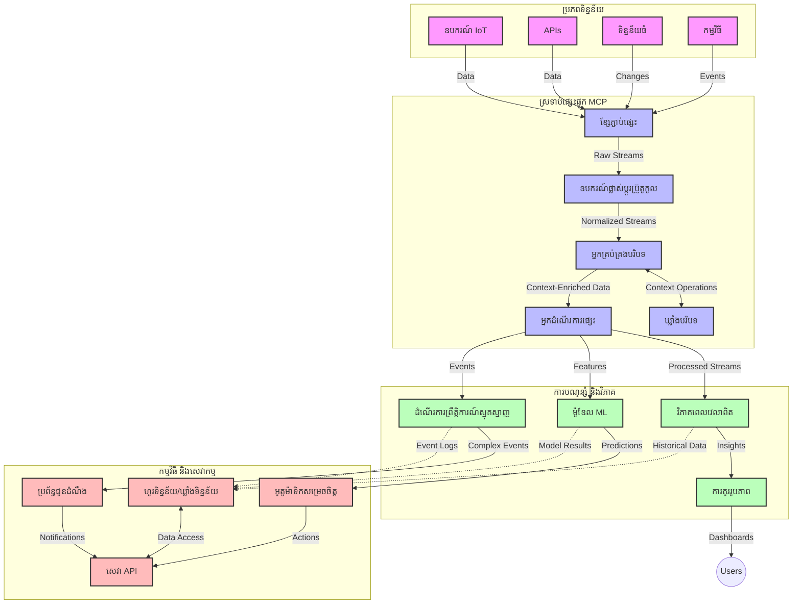

# Model Context Protocol សម្រាប់ការបញ្ចូនទិន្នន័យពេលវេលាពិតប្រាកដ

## ទិដ្ឋភាពទូទៅ

ការបញ្ចូនទិន្នន័យពេលវេលាពិតប្រាកដក្លាយជារឿងសំខាន់នៅក្នុងពិភពទិន្នន័យសម័យចុងក្រោយនេះ ដែលមានអាជីវកម្ម និងកម្មវិធីតម្រូវឲ្យមានការចូលដំណើរការព័ត៌មានភ្លាមៗ ដើម្បីធ្វើការសំរេចចិត្តបានទាន់ពេលវេលា។ Model Context Protocol (MCP) បង្ហាញពីការរីកចម្រើនយ៉ាងសំខាន់ក្នុងការបង្កើនប្រសិទ្ធភាពនៃដំណើរការបញ្ចូនទិន្នន័យពេលវេលាពិតប្រាកដ ដោយបង្កើនប្រសិទ្ធិភាពការបង្ហោះទិន្នន័យ រក្សាមានភាពស្របតាមបរិបទ និងបង្កើនសមត្ថភាពប្រព័ន្ធទូទៅ។

មូឌុលនេះស្វែងយល់ពីរបៀបដែល MCP បញ្ចូលការបញ្ចូនទិន្នន័យពេលវេលាពិតប្រាកដតាមរយៈការផ្តល់នូវវិធីសាស្រ្តស្តង់ដារសម្រាប់ការគ្រប់គ្រងបរិបទទូទាំងគំរូ AI, វេទិការបញ្ចូនទិន្នន័យ និងកម្មវិធី។

## ការណែនាំអំពីការបញ្ចូនទិន្នន័យពេលវេលាពិតប្រាកដ

ការបញ្ចូនទិន្នន័យពេលវេលាពិតប្រាកដគឺជាគំនិតបច្ចេកវិទ្យាដែលអនុញ្ញាតឲ្យមានការផ្ទេរ អនុវត្ត និងវិភាគទិន្នន័យជាបណ្តោះអាសន្នៗ នៅពេលដែលវាត្រូវបានបង្កើតឡើង ដែលអនុញ្ញាតឱ្យប្រព័ន្ធឆ្លើយតបភ្លាមៗចំពោះព័ត៌មានថ្មី។ ខុសពីដំណើរការបញ្ចប់ជាក្រុម (batch processing) ដែលដំណើរការលើឈុតទិន្នន័យថេរៗ ការបញ្ចូនទិន្នន័យនេះដំណើរការលើទិន្នន័យផ្លាស់ទី ដោយផ្តល់ជូននូវការយល់ដឹង និងសកម្មភាពក្នុងពេលវេលាតិចតួច។

### គំនិតស្នូលនៃការបញ្ចូនទិន្នន័យពេលវេលាពិតប្រាកដ៖

- **ទិន្នន័យហូរបន្តបន្ទាប់**៖ ទិន្នន័យត្រូវបានដំណើរការជាស្ទ្រីមទំនេរមិនបញ្ចប់នៃព្រឹត្តិការណ៍ ឬកំណត់ត្រា។
- **ការដំណើរការបន្ថយពេលពន្យារពេក**៖ ប្រព័ន្ធត្រូវបានរចនាឡើងដើម្បីកាត់បន្ថយពេលវេលាចន្លោះការបង្កើតទិន្នន័យ និងការបញ្ចូលដំណើរការ។
- **ការវាស់វែងសមត្ថភាព**៖ ស្ថាបត្យកម្មស្ទ្រីមត្រូវតែអាចដោះស្រាយទិន្នន័យដែលមានចំនួន និងល្បឿនប្លែកៗគ្នា។
- **ការមានភាពធន់ទ្រាំខុសបារម្ភ**៖ ប្រព័ន្ធត្រូវមានភាពធន់ទ្រាំចំពោះកំហុសដើម្បីធានាការបន្តធ្វើការបញ្ចូលទិន្នន័យ។
- **ការដំណើរការដោយមានស្ថានភាព**៖ ការជួសជុលបរិបទនៅលើព្រឹត្តិការណ៍គឺមានសារៈសំខាន់សម្រាប់ការវិភាគមានអត្ថន័យ។

### Model Context Protocol និងការបញ្ចូនទិន្នន័យពេលវេលាពិតប្រាកដ

Model Context Protocol (MCP) ដំឡើងបញ្ហាសំខាន់ៗជាច្រើននៅក្នុងបរិយាកាសស្ទ្រីមពេលវេលាពិតប្រាកដ៖

1. **ភាពបន្តបរិបទ**៖ MCP ស្តង់ដារបែបបទរក្សាបរិបទទាំងមូលក្នុងសមាសភាគបញ្ចូនទិន្នន័យចែកចាយ ដោយធានាថាគំរូ AI និងកម្មវិធីដំណើរការមានចូលដំណើរការនូវបរិបទប្រវត្តិ និងបរិយាកាសគាំទ្រ។

2. **ការគ្រប់គ្រងស្ថានភាពបន្ថែមប្រសិទ្ធភាព**៖ ដោយផ្តល់នូវយន្តការសម្របសម្រួលសម្រាប់ការផ្ទេបរិបទ MCP បន្ថយភាពស្មុគស្មាញនៃការគ្រប់គ្រងស្ថានភាពនៅក្នុងខ្សែបញ្ចូន។

3. **ភាពអាចប្រើរួមគ្នា**៖ MCP បង្កើតភាសារួមសម្រាប់ការចែករំលែកបរិបទពីបច្ចេកវិទ្យាស្ទ្រីមផ្សេងគ្នា និងគំរូ AI ផ្តល់ឱកាសក្នុងការរចនាស្ថាបត្យកម្មឆាប់រហ័សនិងពង្រីកបាន។

4. **បរិបទដែលអាចបង្រួមស្ទ្រីមបាន**៖ ការអនុវត្ត MCP អាចផ្តល់អាទិភាពចំពោះធាតុបរិបទដែលមានសារៈសំខាន់បំផុតសម្រាប់ការសំរេចចិត្តពេលវេលាពិតប្រាកដ បង្រួមសំរាប់ទាំងប្រសិទ្ធភាព និងត្រឹមត្រូវ។

5. **ការដំណើរការបត់បែន**៖ ជាមួយការគ្រប់គ្រងបរិបទត្រឹមត្រូវតាម MCP ប្រព័ន្ធស្ទ្រីមអាចបត់បែនដំណើរការតាមលក្ខខណ្ឌនិងរចនាប្រែប្រួលនៅក្នុងទិន្នន័យ។

នៅលើកម្មវិធីសម័យទំនើបចាប់ពីបណ្តាញឧបករណ៍ IoT ដល់វេទិកាការជួញដូរហិរញ្ញវត្ថុ ការរួមបញ្ចូល MCP ជាមួយបច្ចេកវិទ្យាស្ទ្រីមបង្កើតដំណើរការដែលមានការយល់ដឹងបរិបទ និងឆ្លើយតបបានត្រឹមត្រូវទៅនឹងស្ថានភាពស្មុគស្មាញនៅពេលវេលាពិតប្រាកដ។

## គោលបំណងសិក្សា

នៅចុងបញ្ចប់មេរៀននេះ អ្នកនឹងអាច៖

- យល់ដឹងមូលដ្ឋានអំពីការបញ្ចូនទិន្នន័យពេលវេលាពិតប្រាកដ និងបញ្ហារបស់វា
- ពន្យល់ពីរបៀបដែល Model Context Protocol (MCP) ជួយបង្កើនប្រសិទ្ធភាពការបញ្ចូនទិន្នន័យពេលវេលាពិតប្រាកដ
- អនុវត្តដំណោះស្រាយបញ្ចូនផ្តល់អត្ថប្រយោជន៍ MCP ដោយប្រើស៊ុមសាងសង់ដែលពេញនិយមដូចជា Kafka និង Pulsar
- រចនា និងដាក់ពង្រីកស្ថាបត្យកម្មស្ទ្រីមដែលធន់នឹងកំហុស មានប្រសិទ្ធភាពខ្ពស់ជាមួយ MCP
- ក្លាយជាអ្នកអនុវត្តគំនិត MCP នៅក្នុងករណីប្រើ IoT, ពាណិជ្ជកម្មហិរញ្ញវត្ថុ និងវិភាគដែលបើកបរដោយ AI
- វាយតម្លៃនិន្នាការ និងរឿងអនាគតក្នុងបច្ចេកវិទ្យាស្ទ្រីមផ្អែកលើ MCP

### ការពិពណ៌នានិងអាទិបរមា

ការបញ្ចូនទិន្នន័យពេលវេលាពិតប្រាកដមានន័យថាការបង្កើត ដំណើរការ និងផ្តល់ទិន្នន័យជាបន្តបន្ទាប់ជាមួយពេលលឿនចុងក្រោយ។ ខុសពីការបញ្ចប់ជាក្រុមដែលទិន្នន័យត្រូវបានប្រមូល និងដំណើរការជាក្រុមៗ យ៉ាងហោចណាស់ ទិន្នន័យស្ទ្រីមត្រូវបានដំណើរការនៅពេលវាបានមកដល់ អនុញ្ញាតឲ្យទទួលបានការយល់ដឹង និងសកម្មភាពភ្លាមៗ។

លក្ខណៈសំខាន់នៃការបញ្ចូនទិន្នន័យពេលវេលាពិតប្រាកដរួមមាន៖

- **ពេលតិចលឿន**៖ ដំណើរ និងវិភាគទិន្នន័យក្នុងរយៈពេលមីល្លិវិនាទីដល់វិនាទី
- **ហូរបន្តបន្ទាប់**៖ ជាប្រព័ន្ធស្ទ្រីមដែលមិនឈប់ចេញពីប្រភពផ្សេងៗ
- **ដំណើរការភ្លាមៗ**៖ វិភាគទិន្នន័យនៅពេលវាត្រូវបានទទួល មិនមែនប្រមូលជាក្រុម
- **ស្ថាបត្យកម្មបណ្តាលពីព្រឹត្តិការណ៍**៖ ឆ្លើយតបដល់ព្រឹត្តិការណ៍នៅពេលវាដើរឡើង

### បញ្ហាក្នុងការបញ្ចូនទិន្នន័យនៃរបៀបបែបបុរាណ

វិធីសាស្រ្តបែបបុរាណមានកំណត់ជាច្រើន៖

1. **បាត់បង់បរិបទ**៖ មានការលំបាកក្នុងការរក្សាបរិបទនៅលើប្រព័ន្ធចែកចាយ
2. **បញ្ហាកំណត់សមត្ថភាព**៖ លំបាកក្នុងការវាស់វែងដើម្បីដោះស្រាយទិន្នន័យដែលមានចំនួន និងល្បឿនខ្ពស់
3. **ភាពស្មុគស្មាញក្នុងការរួមបញ្ចូល**៖ បញ្ហាអំពីភាពអាចប្រើរួមគ្នារវាងប្រព័ន្ធផ្សេងៗ
4. **ការគ្រប់គ្រងពេលវេលាបន្ថែម**៖ តម្រូវការប្រកួតប្រជែងគ្នានៅចន្លោះផលិតផលិតកម្ម និងពេលវេលាដំណើរការ
5. **ភាពត្រឹមត្រូវនៃទិន្នន័យ**៖ ការធានានូវភាពត្រឹមត្រូវ និងពេញលេញនៃទិន្នន័យក្នុងខ្សែបញ្ចូន

## ការយល់ដឹងពី Model Context Protocol (MCP)

### MCP ជាអ្វី?

Model Context Protocol (MCP) គឺជាពិធីការទំនាក់ទំនងស្តង់ដារដែលរចនាឡើងសម្រាប់ជួយសម្រួលការប្រាស្រ័យទាក់ទងយ៉ាងមានប្រសិទ្ធភាពរវាងគំរូ AI និងកម្មវិធី។ ក្នុងបរិបទនៃការបញ្ចូនទិន្នន័យពេលវេលាពិតប្រាកដ MCP ផ្តល់នូវស្ថាបត្យកម្មសម្រាប់៖

- រក្សាបរិបទក្នុងខ្សែបញ្ចូនទិន្នន័យ
- ស្តង់ដាផលិតផលផ្លាស់ប្តូរទិន្នន័យ
- បង្កើនប្រសិទ្ធភាពការផ្ទេរកំណត់ត្រាធំៗ
- បង្កើនសមត្ថភាពទំនាក់ទំនងរវាងគំរូនិងគំរូ និងគំរូនិងកម្មវិធី

### ធាតុសំខាន់ និងរចនាសម្ព័ន្ធ

រចនាសម្ព័ន្ធ MCP សម្រាប់ការបញ្ចូនទិន្នន័យពេលវេលាពិតប្រាកដ មានធាតុសំខាន់ៗដូចជា៖

1. **អ្នកគ្រប់គ្រងបរិបទ**៖ គ្រប់គ្រង និងរក្សាព័ត៌មានបរិបទទំនាក់ទំនងទូទាំងខ្សែបញ្ចូន
2. **អ្នកដំណើរការស្ទ្រីម**៖ ដំណើរការស្ទ្រីមទិន្នន័យដែលបានទទួលដោយប្រើវិធីសាស្រ្តមានបរិបទ
3. **ឧបករណ៍បម្លែងពិធីការ**៖ បំលែងរវាងពិធីការផ្សេងៗនៅក្នុងស្ទ្រីម ដោយរក្សាបរិបទ
4. **ផ្ទុកបរិបទ**៖ រក្សានិងទាញយកពត៌មានបរិបទយ៉ាងមានប្រសិទ្ធភាព
5. **ឧបករណ៍ភ្ជាប់ស្ទ្រីម**៖ ភ្ជាប់ទៅវេទិកាស្ទ្រីមផ្សេងៗ (Kafka, Pulsar, Kinesis, និងផ្សេងទៀត)


### របៀបដែល MCP បង្កើនការដោះស្រាយទិន្នន័យពេលវេលាពិតប្រាកដ

MCP ដោះស្រាយបញ្ហាស្ទ្រីមបែបបុរាណតាមរយៈ៖

- **ភាពទៀងទាត់នៃបរិបទ**៖ រក្សាទំនាក់ទំនងរវាងចំណុចទិន្នន័យទូទាំងខ្សែបញ្ចូន
- **ការផ្ទេរផលិតផលបង្រួម**៖ បន្ថយភាពមិនចាំបាច់ក្នុងការផ្លាស់ប្តូរទិន្នន័យតាមរយៈការគ្រប់គ្រងបរិបទយ៉ាងឆ្លាតវៃ
- **ចំណុចចូលម៉ាស៊ីនស្តង់ដារ**៖ ផ្តល់ API ស្តង់ដារចំពោះសមាសភាគស្ទ្រីម
- **បន្ថយពេលយឺត**៖ កាត់បន្ថយការចំណាយពេលក្នុងការដំណើរការដោយការគ្រប់គ្រងបរិបទមានប្រសិទ្ធភាព
- **បង្កើនសមត្ថភាពបញ្ជាការដូចមួយ**៖ គាំទ្រការដំណើរការជួរ (horizontal scaling) នៅពេលរក្សាបរិបទ

## ការរួមបញ្ចូល និងការអនុវត្ត

ប្រព័ន្ធបញ្ចូនទិន្នន័យពេលវេលាពិតប្រាកដតម្រូវឲ្យមានការរចនាស្ថាបត្យកម្មយ៉ាងប្រុងប្រយ័ត្ន និងអនុវត្ត ដើម្បីរក្សាទាំងសមត្ថភាព និងភាពទៀងទាត់បរិបទ។ Model Context Protocol ផ្តល់វិធីសាស្រ្តស្តង់ដារសម្រាប់ការរួមបញ្ចូលគំរូ AI និងបច្ចេកវិទ្យាស្ទ្រីម ដើម្បីបានខ្សែបញ្ចូនដំណើរការដំណាក់ទាន់សម័យ និងមានការយល់ដឹងបរិបទ។

### ទិដ្ឋភាពទូទៅនៃការរួមបញ្ចូល MCP ក្នុងស្ថាបត្យកម្មស្ទ្រីម

ការអនុវត្ត MCP នៅក្នុងបរិយាកាសស្ទ្រីមពេលវេលាពិតប្រាកដអនុវត្តជាការពិចារណាចម្បងៗ៖

1. **ការតម្រៀបនិងផ្ទេរបរិបទ**៖ MCP ផ្តល់យន្តការសម្របសម្រួលសម្រាប់កូដីងព័ត៌មានបរិបទនៅក្នុងកញ្ចប់ទិន្នន័យស្ទ្រីម ដើម្បីធានាថាបរិបទសំខាន់បានតាមទិន្នន័យគ្រប់ដំណាក់កាល។ រួមមានទ្រង់ទ្រាយស្តង់ដារកូដីងដែលបង្រួមសម្រាប់ការផ្ទេរស្ទ្រីម។

2. **ការដំណើរការជាស្ថានភាព**៖ MCP អនុញ្ញាតឲ្យមានការដំណើរការជាស្ថានភាពដោយរក្សាតម្លៃបរិបទឲ្យស្របគ្នានៅលើកន្លែងដំណើរការ។ មានតំលៃខ្ពស់ក្នុងស្ថាបត្យកម្មស្ទ្រីមចែកចាយដែលការគ្រប់គ្រងស្ថានភាពជារឿងលំបាក។

3. **ព្រឹត្តិការណ៍-ពេលវេលា ប្រឆាំង ជាមួយ ដំណើរការ-ពេលវេលា**៖ ការអនុវត្ត MCP នៅប្រព័ន្ធស្ទ្រីមត្រូវដោះស្រាយបញ្ហារវាងពេលវេលាព្រឹត្តិការណ៍កើតឡើង និងពេលវេលាដំណើរការចាប់ផ្តើម។ ពិធីការអាចរួមបញ្ចូលបរិបទផ្នែកពេលវេលាដើម្បីរក្សាគោលការណ៍ព្រឹត្តិការណ៍។

4. **ការគ្រប់គ្រង Backpressure**៖ ដោយស្តង់ដារផលិតផលបរិបទ MCP ជួយគ្រប់គ្រងសម្ពាធក្រោយក្នុងប្រព័ន្ធស្ទ្រីម អនុញ្ញាតឲ្យគ្រឿងផ្សារបានទំនាក់ទំនងនូវសមត្ថភាពដំណើរការរបស់ពួកគេ និងកែប្រែការហូរបានត្រឹមត្រូវ។

5. **ការបង្ហាញបរិបទវីនដូ និងជំនុំជម្រះ**៖ MCP ជួយអនុវត្តការបំលែងវីនដូតាមបរិបទដោយផ្តល់តំណាងរចនាសម្ព័ន្ធសម្រាប់បរិបទពេលវេលា និងទំនាក់ទំនងពាក់ព័ន្ធ បង្កើនភាពសន្ដិសុខក្នុងការជំនុំជម្រះនៃស្ទ្រីមព្រឹត្តិការណ៍។

6. **ដំណើរការពេញលេញតែម្ដង**៖ សម្រាប់ប្រព័ន្ធស្ទ្រីមដែលត្រូវការលក្ខណៈ exactly-once MCP អាចរួមបញ្ចូលព័ត៌មាននៃការដំណើរការដើម្បីតាមដាន និងផ្ទៀងផ្ទាត់ស្ថានភាពក្នុងសមាសភាគចែកចាយ។

ការអនុវត្ត MCP នៅក្នុងបច្ចេកវិទ្យាស្ទ្រីមផ្សេងៗបង្កើតវិធីសាស្រ្តរួមសម្រាប់ការគ្រប់គ្រងបរិបទ បន្ថយការតម្រូវកូដរួមបញ្ចូលបុគ្គលិក និងបង្កើនសមត្ថភាពរបស់ប្រព័ន្ធក្នុងការរក្សាបរិបទមានអត្ថន័យនៅពេលទិន្នន័យហូរចូលខ្សែបញ្ចូន។

### MCP ក្នុងស៊ុមសាងសង់បញ្ចូនទិន្នន័យផ្សេងៗ

ឧទាហរណ៍ទាំងនេះអនុវត្តតាមការបញ្ជាក់ MCP បច្ចុប្បន្នដែលផ្អែកលើ JSON-RPC ជាមួយយន្តការផ្ទេរផ្សេងៗគ្នា។ កូដបង្ហាញរបៀបអាចអនុវត្តការផ្ទេរតាមបំណែកក្រៅដែលរួមបញ្ចូលវេទិកាដូចជា Kafka និង Pulsar ខណៈរក្សាទំនាក់ទំនងពេញលេញជាមួយពិធីការម៉ូឌុល MCP។

ឧទាហរណ៍ទាំងនេះបានរចនាឡើងដើម្បីបង្ហាញថាវេទិកាស្ទ្រីមអាចរួមបញ្ចូលជាមួយ MCP ដើម្បីផ្តល់នូវដំណើរការទិន្នន័យពេលវេលាពិតប្រាកដ ស្របតាមការយល់ដឹងបរិបទដែលជាគោលមូល MCP។ វិធីសាស្រ្តនេះធានាថាគំរូកូដមានភាពត្រឹមត្រូវ ទ្រង់ទ្រាយជាប់មិនផ្លាស់ប្ដូរជាមួយការបញ្ជាក់ MCP ចុងក្រោយនៅខែមិថុនា ២០២៥។

MCP អាចរួមបញ្ចូលជាមួយស៊ុមមួយចំនួនដែលពេញនិយមរួមមាន៖

#### ការរួមបញ្ចូល Apache Kafka

```python
import asyncio
import json
from typing import Dict, Any, Optional
from confluent_kafka import Consumer, Producer, KafkaError
from mcp.client import Client, ClientCapabilities
from mcp.core.message import JsonRpcMessage
from mcp.core.transports import Transport

# ថ្នាក់ដឹកជញ្ជូនប្ដូរតាមបំណងដើម្បីភ្ជាប់ MCP ជាមួយ Kafka
class KafkaMCPTransport(Transport):
    def __init__(self, bootstrap_servers: str, input_topic: str, output_topic: str):
        self.bootstrap_servers = bootstrap_servers
        self.input_topic = input_topic
        self.output_topic = output_topic
        self.producer = Producer({'bootstrap.servers': bootstrap_servers})
        self.consumer = Consumer({
            'bootstrap.servers': bootstrap_servers,
            'group.id': 'mcp-client-group',
            'auto.offset.reset': 'earliest'
        })
        self.message_queue = asyncio.Queue()
        self.running = False
        self.consumer_task = None
        
    async def connect(self):
        """Connect to Kafka and start consuming messages"""
        self.consumer.subscribe([self.input_topic])
        self.running = True
        self.consumer_task = asyncio.create_task(self._consume_messages())
        return self
        
    async def _consume_messages(self):
        """Background task to consume messages from Kafka and queue them for processing"""
        while self.running:
            try:
                msg = self.consumer.poll(1.0)
                if msg is None:
                    await asyncio.sleep(0.1)
                    continue
                
                if msg.error():
                    if msg.error().code() == KafkaError._PARTITION_EOF:
                        continue
                    print(f"Consumer error: {msg.error()}")
                    continue
                
                # ពន្យល់តម្លៃសារាជាភាសា JSON-RPC
                try:
                    message_str = msg.value().decode('utf-8')
                    message_data = json.loads(message_str)
                    mcp_message = JsonRpcMessage.from_dict(message_data)
                    await self.message_queue.put(mcp_message)
                except Exception as e:
                    print(f"Error parsing message: {e}")
            except Exception as e:
                print(f"Error in consumer loop: {e}")
                await asyncio.sleep(1)
    
    async def read(self) -> Optional[JsonRpcMessage]:
        """Read the next message from the queue"""
        try:
            message = await self.message_queue.get()
            return message
        except Exception as e:
            print(f"Error reading message: {e}")
            return None
    
    async def write(self, message: JsonRpcMessage) -> None:
        """Write a message to the Kafka output topic"""
        try:
            message_json = json.dumps(message.to_dict())
            self.producer.produce(
                self.output_topic,
                message_json.encode('utf-8'),
                callback=self._delivery_report
            )
            self.producer.poll(0)  # ចាប់ផ្តើមការហៅត្រឡប់
        except Exception as e:
            print(f"Error writing message: {e}")
    
    def _delivery_report(self, err, msg):
        """Kafka producer delivery callback"""
        if err is not None:
            print(f'Message delivery failed: {err}')
        else:
            print(f'Message delivered to {msg.topic()} [{msg.partition()}]')
    
    async def close(self) -> None:
        """Close the transport"""
        self.running = False
        if self.consumer_task:
            self.consumer_task.cancel()
            try:
                await self.consumer_task
            except asyncio.CancelledError:
                pass
        self.consumer.close()
        self.producer.flush()

# គំរូការប្រើប្រាស់ការដឹកជញ្ជូន Kafka MCP
async def kafka_mcp_example():
    # បង្កើតអតិថិជន MCP ជាមួយការដឹកជញ្ជូន Kafka
    client = Client(
        {"name": "kafka-mcp-client", "version": "1.0.0"},
        ClientCapabilities({})
    )
    
    # បង្កើត និងភ្ជាប់ការដឹកជញ្ជូន Kafka
    transport = KafkaMCPTransport(
        bootstrap_servers="localhost:9092",
        input_topic="mcp-responses",
        output_topic="mcp-requests"
    )
    
    await client.connect(transport)
    
    try:
        # ផ្តើមវគ្គ MCP
        await client.initialize()
        
        # ឧទាហរណ៍នៃការប្រតិបត្តិឧបករណ៍តាមរយៈ MCP
        response = await client.execute_tool(
            "process_data",
            {
                "data": "sample data",
                "metadata": {
                    "source": "sensor-1",
                    "timestamp": "2025-06-12T10:30:00Z"
                }
            }
        )
        
        print(f"Tool execution response: {response}")
        
        # បិទប្រព័ន្ធយ៉ាងស្អាត
        await client.shutdown()
    finally:
        await transport.close()

# ដំណើរការឧទាហរណ៍
if __name__ == "__main__":
    asyncio.run(kafka_mcp_example())
```

#### ការអនុវត្ត Apache Pulsar

```python
import asyncio
import json
import pulsar
from typing import Dict, Any, Optional
from mcp.core.message import JsonRpcMessage
from mcp.core.transports import Transport
from mcp.server import Server, ServerOptions
from mcp.server.tools import Tool, ToolExecutionContext, ToolMetadata

# បង្កើតការដឹកជញ្ជូន MCP តាមបំណងដែលប្រើ Pulsar
class PulsarMCPTransport(Transport):
    def __init__(self, service_url: str, request_topic: str, response_topic: str):
        self.service_url = service_url
        self.request_topic = request_topic
        self.response_topic = response_topic
        self.client = pulsar.Client(service_url)
        self.producer = self.client.create_producer(response_topic)
        self.consumer = self.client.subscribe(
            request_topic,
            "mcp-server-subscription",
            consumer_type=pulsar.ConsumerType.Shared
        )
        self.message_queue = asyncio.Queue()
        self.running = False
        self.consumer_task = None
    
    async def connect(self):
        """Connect to Pulsar and start consuming messages"""
        self.running = True
        self.consumer_task = asyncio.create_task(self._consume_messages())
        return self
    
    async def _consume_messages(self):
        """Background task to consume messages from Pulsar and queue them for processing"""
        while self.running:
            try:
                # ទទួលបានដោយមិនឆក់ដោយមានពេលកំណត់
                msg = self.consumer.receive(timeout_millis=500)
                
                # ដំណើរការប្រកាស
                try:
                    message_str = msg.data().decode('utf-8')
                    message_data = json.loads(message_str)
                    mcp_message = JsonRpcMessage.from_dict(message_data)
                    await self.message_queue.put(mcp_message)
                    
                    # យល់ព្រមប្រកាស
                    self.consumer.acknowledge(msg)
                except Exception as e:
                    print(f"Error processing message: {e}")
                    # មិនយល់ព្រម ប្រសិនបើមានកំហុស
                    self.consumer.negative_acknowledge(msg)
            except Exception as e:
                # ដោះស្រាយពេលវេលាលើកលែងឬករណីលំបាកផ្សេងទៀត
                await asyncio.sleep(0.1)
    
    async def read(self) -> Optional[JsonRpcMessage]:
        """Read the next message from the queue"""
        try:
            message = await self.message_queue.get()
            return message
        except Exception as e:
            print(f"Error reading message: {e}")
            return None
    
    async def write(self, message: JsonRpcMessage) -> None:
        """Write a message to the Pulsar output topic"""
        try:
            message_json = json.dumps(message.to_dict())
            self.producer.send(message_json.encode('utf-8'))
        except Exception as e:
            print(f"Error writing message: {e}")
    
    async def close(self) -> None:
        """Close the transport"""
        self.running = False
        if self.consumer_task:
            self.consumer_task.cancel()
            try:
                await self.consumer_task
            except asyncio.CancelledError:
                pass
        self.consumer.close()
        self.producer.close()
        self.client.close()

# កំណត់ឧបករណ៍ MCP គំរូដែលដំណើរការទិន្នន័យបញ្ចាទិន្នន័យ
@Tool(
    name="process_streaming_data",
    description="Process streaming data with context preservation",
    metadata=ToolMetadata(
        required_capabilities=["streaming"]
    )
)
async def process_streaming_data(
    ctx: ToolExecutionContext,
    data: str,
    source: str,
    priority: str = "medium"
) -> Dict[str, Any]:
    """
    Process streaming data while preserving context
    
    Args:
        ctx: Tool execution context
        data: The data to process
        source: The source of the data
        priority: Priority level (low, medium, high)
        
    Returns:
        Dict containing processed results and context information
    """
    # ឧទាហរណ៍ដំណើរការដែលប្រើបទបរិបទ MCP
    print(f"Processing data from {source} with priority {priority}")
    
    # ចូលទៅកាន់បទបរិបទការសន្ទនាពី MCP
    conversation_id = ctx.conversation_id if hasattr(ctx, 'conversation_id') else "unknown"
    
    # ត្រឡប់លទ្ធផលជាមួយបទបរិបទបានបង្កើន
    return {
        "processed_data": f"Processed: {data}",
        "context": {
            "conversation_id": conversation_id,
            "source": source,
            "priority": priority,
            "processing_timestamp": ctx.get_current_time_iso()
        }
    }

# ឧទាហរណ៍អនុវត្តម៉ាស៊ីនមេ MCP ដែលប្រើការដឹកជញ្ជូន Pulsar
async def run_mcp_server_with_pulsar():
    # បង្កើតម៉ាស៊ីនមេ MCP
    server = Server(
        {"name": "pulsar-mcp-server", "version": "1.0.0"},
        ServerOptions(
            capabilities={"streaming": True}
        )
    )
    
    # ចុះបញ្ជីឧបករណ៍របស់យើង
    server.register_tool(process_streaming_data)
    
    # បង្កើត និងភ្ជាប់ការដឹកជញ្ជូន Pulsar
    transport = PulsarMCPTransport(
        service_url="pulsar://localhost:6650",
        request_topic="mcp-requests",
        response_topic="mcp-responses"
    )
    
    try:
        # ចាប់ផ្តើមម៉ាស៊ីនមេជាមួយការដឹកជញ្ជូន Pulsar
        await server.run(transport)
    finally:
        await transport.close()

# បើកម៉ាស៊ីនមេ
if __name__ == "__main__":
    asyncio.run(run_mcp_server_with_pulsar())
```

### ការអនុវត្តវិធីសាស្ត្រល្អបំផុតសម្រាប់ការដាក់ប្រាក់

ពេលអនុវត្ត MCP សម្រាប់ស្ទ្រីមពេលវេលាពិតប្រាកដ៖

1. **រចនាដើម្បីធន់នឹងកំហុស**៖
   - អនុវត្តការដោះស្រាយកំហុសត្រឹមត្រូវ
   - ប្រើ dead-letter queues សម្រាប់សារដែលបរាជ័យ
   - រចនាអ្នកដំណើរការមានលក្ខណៈ idempotent

2. **បង្កើនប្រសិទ្ធភាព**៖
   - កំណត់ទំហំ buffer ដោយសមរម្យ
   - ប្រើការបញ្ចេញជាក្រុមនៅពេលមានសមត្ថភាព
   - អនុវត្តយន្តការបញ្ជាទាញបន្ទាន់ (backpressure)

3. **តាមដាន និងពិនិត្យ**៖
   - តាមដានវាយតម្លៃដំណើរការស្ទ្រីម
   - តាមដានការផ្សព្វផ្សាយបរិបទ
   - កំណត់សំរាមប្រកាសអំពីករណីមិនសម្រួល

4. **ធានាឲ្យមានសុវត្ថិភាពស្ទ្រីមរបស់អ្នក**៖
   - អនុវត្តការអ៊ិនគ្រីបសម្រាប់ទិន្នន័យដែលមានភាពរស់រវើក
   - ប្រើការផ្ទៀងផ្ទាត់ និងអាជ្ញាបណ្ណ
   - អនុវត្តការគ្រប់គ្រងការចូលប្រើដែលត្រឹមត្រូវ

### MCP ក្នុង IoT និងកុំព្យូទ័រនៅព្រំដែន

MCP បង្កើនស្ទ្រីម IoT ដោយ៖

- ការរក្សាបរិបទឧបករណ៌នៅលើខ្សែបញ្ចូន
- អាចបញ្ជូនទិន្នន័យពីកាប់ជាលើមេឆ្ងាយបានប្រសើរ
- គាំទ្រវិភាគទិន្នន័យវិលជុំខាងក្នុងនៃ IoT
- ផ្គុំការប្រាស្រ័យទាក់ទងឧបករណ៍-ទៅ-ឧបករណ៍ជាមួយបរិបទ

ឧទាហរណ៍៖ បណ្តាញកាមេរ៉ាសញ្ញាប័ណ្ណទីក្រុងឆ្លាត
```
Sensors → Edge Gateways → MCP Stream Processors → Real-time Analytics → Automated Responses
```

### តួនាទៅក្នុងប្រតិបត្តិការហិរញ្ញវត្ថុ និងពាណិជ្ជកម្មល្បឿនខ្ពស់

MCP ផ្តល់អត្ថប្រយោជន៍ខ្លាំងលើការបញ្ចូនទិន្នន័យហិរញ្ញវត្ថុ៖

- ដំណើរការពេលវេលាបន្ថែមទាបបំផុតសម្រាប់សំរេចចិត្តជួញដូរ
- រក្សាបរិបទប្រតិបត្តិការតាមដំណើរការ
- គាំទ្រគ្រប់គ្រងព្រឹត្តិការណ៍ស្មុគស្មាញជាមួយការយល់ដឹងបរិបទ
- ធានាបានភាពត្រឹមត្រូវនៃទិន្នន័យនៅក្នុងប្រព័ន្ធជួញដូរចែកចាយ

### បង្កើនការវិភាគទិន្នន័យដែលបើកបរដោយ AI

MCP បង្កើតឱកាសថ្មីក្នុងវិភាគស្ទ្រីម៖

- ការបណ្តុះបណ្តាលគំរូ និងការប៉ាន់ស្មាននៅពេលវេលាពិតប្រាកដ
- ការរៀនបន្តពីទិន្នន័យស្ទ្រីម
- ការដកស្រង់លក្ខណៈដោយយល់អំពីបរិបទ
- ខ្សែដំណើរការជាប់គ្នានៃការប៉ាន់ស្មានគំរូច្រើនដោយរក្សាបរិបទ

## និន្នាការ និងបច្ចេកវិទ្យាអនាគត

### ការវិវឌ្ឍ MCP នៅក្នុងបរិយាកាសពេលវេលាពិតប្រាកដ

មើលទៅមុខ យើងរំពឹងថា MCP នឹងមានការវិវឌ្ឍបញ្ចូល៖

- **ការរួមបញ្ចូលកុំព្យូទ័រចាំបាច់**៖ រៀបចំសម្រាប់ស្ទ្រីមសុីស្ទេមបែប quantum
- **ការដំណើរការនៅលើគ្រឿងនៅព្រំដែន**៖ ផ្លាស់ប្ដូរការដំណើរការយល់ដឹងបរិបទទៅឧបករណ៍នៅព្រំដែន
- **គ្រប់គ្រងស្ទ្រីមដោយខ្លួនឯង**៖ ខ្សែដំណើរដំណើរការស្ទ្រីមដែលអាចបង្កើតបណ្តោយដោយខ្លួនឯង
- **ស្ទ្រីមចែកចាយសហគមន៍**៖ ដំណើរការចែកចាយដោយរក្សាសិទ្ធិឯកជនភាព

### ការបង្កើតបច្ចេកវិទ្យាថ្មី

បច្ចេកវិទ្យាថ្មីៗដែលនឹងរុំផែន MCP ស្ទ្រីមអនាគត៖

1. **ពិធីការបញ្ចូនស្ទ្រីមសម្រាប់ AI**៖ ពិធីការបុគ្គលិកលក្ខណៈបែបតេស្ត​សម្រាប់បន្ទុកការ AI
2. **ការរួមបញ្ចូលកុំព្យូទ័រដែលផ្តោតលើខួរក្បាល**៖ កុំព្យូទ័របែបប្រព័ន្ធខួរក្បាលសម្រាប់ដំណើរការស្ទ្រីម
3. **ស្ទ្រីមគ្មានម៉ាស៊ីនផ្ទុក**៖ ស្ទ្រីមបណ្តាលពីព្រឹត្តិការណ៍ អាចពង្រីកបានដោយមិនត្រូវគ្រប់គ្រងមូលដ្ឋាន
4. **ការផ្ទុកបរិបទចែកចាយ**៖ រក្សាបរិបទអ្នកតន្លឹមនៅលើពិភពលោកបែកចេញប៉ុន្តែមានភាពត្រឹមត្រូវខ្ពស់

## ការអនុវត្តដៃ

### អនុវត្តទី ១៖ កំណត់បរិក្ខារថ្មីសម្រាប់ខ្សែបញ្ចូន MCP មូលដ្ឋាន

ក្នុងអនុវត្តនេះ អ្នកនឹងសិក្សាពីរបៀប៖
- កំណត់បរិក្ខារស្ទ្រីម MCP មូលដ្ឋាន
- អនុវត្តអ្នកគ្រប់គ្រងបរិបទសម្រាប់ដំណើរការស្ទ្រីម
- សាកល្បង និងផ្ទៀងផ្ទាត់ការរក្សាបរិបទ

### អនុវត្តទី ២៖ បង្កើតផ្ទាំងតូចវិភាគពេលវេលាពិតប្រាកដ

បង្កើតកម្មវិធីពេញលេញដែល៖
- ទទួលទិន្នន័យស្ទ្រីមតាម MCP
- ដំណើរការស្ទ្រីមពេលរក្សាបរិបទ
- បង្ហាញលទ្ធផលនៅពេលវេលាពិតប្រាកដ

### អនុវត្តទី ៣៖ អនុវត្តការដំណើរការព្រឹត្តិការណ៍ស្មុគស្មាញជាមួយ MCP

អនុវត្តស៊ី្ងំ៖
- ស្វែងរករបៀបក្នុងស្ទ្រីម
- ភាសារភាគទាក់ទងបរិបទនៅលើស្ទ្រីមច្រើន
- បង្កើតព្រឹត្តិការណ៍ស្មុគស្មាញជាមួយបរិបទដែលរក្សាទុក

## ឯកសារជំនួយបន្ថែម

- [Model Context Protocol Specification](https://github.com/modelcontextprotocol) - ពិធីការច្បាស់លាស់ និងឯកសារ MCP ទំនាក់ទំនង
- [Apache Kafka Documentation](https://kafka.apache.org/documentation/) - រៀនអំពី Kafka សម្រាប់ដំណើរការស្ទ្រីម
- [Apache Pulsar](https://pulsar.apache.org/) - វេទិកាសារនិងស្ទ្រីមរួមមួយ
- [Streaming Systems: The What, Where, When, and How of Large-Scale Data Processing](https://www.oreilly.com/library/view/streaming-systems/9781491983867/) - សៀវភៅ​ពេញលេញអំពីស្ថាបត្យកម្មស្ទ្រីម
- [Microsoft Azure Event Hubs](https://learn.microsoft.com/azure/event-hubs/event-hubs-about) - សេវាស្ទ្រីមព្រឹត្តិការណ៍គ្រប់គ្រង
- [MLflow Documentation](https://mlflow.org/docs/latest/index.html) - សម្រាប់តាមដាននិងដាក់បង្ហោះគំរូ ML
- [Real-Time Analytics with Apache Storm](https://storm.apache.org/releases/current/index.html) - ស៊ុមដំណើរការសម្រាប់គណនាពេលវេលាពិតប្រាកដ
- [Flink ML](https://nightlies.apache.org/flink/flink-ml-docs-master/) - បណ្ណាល័យថ្នាក់វិទ្យាសម្រាប់ Apache Flink
- [LangChain Documentation](https://python.langchain.com/docs/get_started/introduction) - ការសាងសង់កម្មវិធីជាមួយ LLMs

## លទ្ធផលសិក្សា

ដោយបញ្ចប់មូឌុលនេះ អ្នកនឹងអាច៖

- យល់ដឹងពីមូលដ្ឋាននៃការបញ្ចូនទិន្នន័យពេលវេលាពិតប្រាកដ និងបញ្ហារបស់វា
- ពន្យល់ពីរបៀបដែល Model Context Protocol (MCP) បង្កើនប្រសិទ្ធភាពការបញ្ចូនទិន្នន័យពេលវេលាពិតប្រាកដ
- អនុវត្តដំណោះស្រាយបញ្ចូនស្ទ្រីម MCP ដោយប្រើស៊ុមសាងសង់ពេញនិយមដូចជា Kafka និង Pulsar
- រចនានិងដាក់ពង្រីកស្ថាបត្យកម្មស្ទ្រីមធន់នឹងកំហុស និងមានប្រសិទ្ធភាពខ្ពស់ជាមួយ MCP
- ប្រើគំនិត MCP ក្នុងករណីប្រើ IoT, ពាណិជ្ជកម្មហិរញ្ញវត្ថុ និងវិភាគដែលបើកបរដោយ AI
- វាយតម្លៃនិន្នាការនិងបច្ចេកវិទ្យាថ្មីៗនៅ MCP

## បន្ទាប់ពីនេះ

- [5.11 Realtime Search](../mcp-realtimesearch/README.md)

---

<!-- CO-OP TRANSLATOR DISCLAIMER START -->
**ការបដិសេធ**៖
ឯកសារនេះត្រូវបានបកប្រែ​ដោយ​ប្រើ​សេវាកម្ម​បកប្រែ AI [Co-op Translator](https://github.com/Azure/co-op-translator)។ ខណៈពេលយើងខិតខំធ្វើឱ្យមានភាពត្រឹមត្រូវ សូមយកចិត្តទុកដាក់ថា ការបកប្រែ​ដោយស្វ័យប្រវត្តិអាចមានកំហុស ឬភាពមិនត្រឹមត្រូវ។ ឯកសារដើមនៅក្នុងភាសាមនុស្សដើមគួរត្រូវបានចាត់ទុកថាជាដើមប្រភពដែលមានសុពលភាព។ សម្រាប់ព័ត៌មានសំខាន់ៗ ការបកប្រែ​ម៉នុស្សវិជ្ជាជីវៈត្រូវបានណែនាំ។ យើងមិនទទួលខុសត្រូវចំពោះការយល់ច្រឡំ រឺការបកស្រាយខុសណាមួយ ដែលកើតឡើងពីការប្រើប្រាស់ការបកប្រែនេះឡើយ។
<!-- CO-OP TRANSLATOR DISCLAIMER END -->