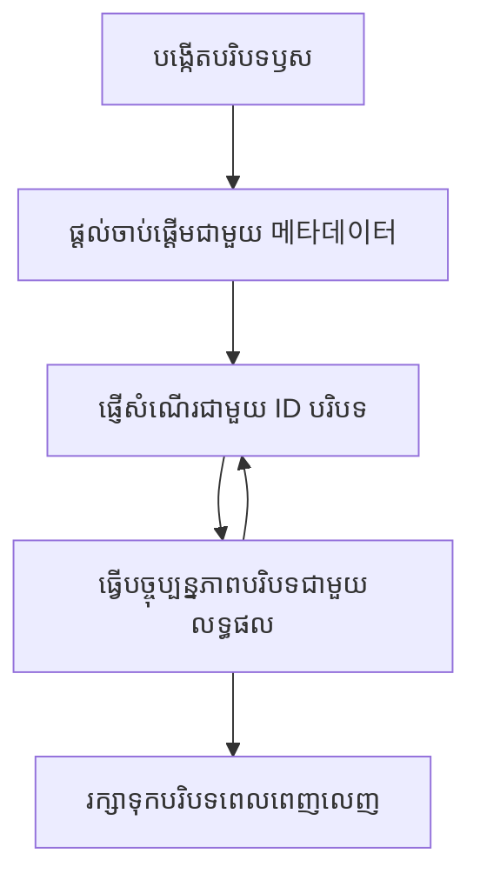

# មូលដ្ឋានសំណុំបែបបទ MCP

មូលដ្ឋានសំណុំបែបបទគឺជាគំនិតមូលដ្ឋានមួយនៅក្នុងពិធីការសំណុំបែបបទម៉ូដែលដែលផ្តល់ជាស្រទាប់ឃ្លានសម្រាប់រក្សាទុកប្រវត្តិសន្ទនា និងស្ថានភាពចែករំលែក តាមរយៈសំណើនិងសម័យផ្សេងៗជាច្រើន។

## ជំនួយ

ក្នុងមេរៀននេះ យើងនឹងស្វែងយល់ពីរបៀបបង្កើត គ្រប់គ្រង និងប្រើប្រាស់មូលដ្ឋានសំណុំបែបបទនៅក្នុង MCP។

## គោលបំណងសិក្សា

នៅចុងបញ្ចប់មេរៀននេះ អ្នកនឹងអាច៖

- យល់ដឹងពីគោលបំណង និងរចនាសម្ព័ន្ធរបស់មូលដ្ឋានសំណុំបែបបទ
- បង្កើត និងគ្រប់គ្រងមូលដ្ឋានសំណុំបែបបទដោយប្រើបណ្ណាល័យអតិថិជន MCP
- អនុវត្តមូលដ្ឋានសំណុំបែបបទនៅក្នុងកម្មវិធី .NET, Java, JavaScript, និង Python
- ប្រើប្រាស់មូលដ្ឋានសំណុំបែបបទសម្រាប់ការសន្ទនាដើរច្រើនជំហាន និងការគ្រប់គ្រងស្ថានភាព
- អនុវត្តអនុគណនBest Practices សម្រាប់ការគ្រប់គ្រងមូលដ្ឋានសំណុំបែបបទ

## យល់ដឹងអំពីមូលដ្ឋានសំណុំបែបបទ

មូលដ្ឋានសំណុំបែបបទដូចជាអ្នកផ្ដាប់ដែលផ្ទុកប្រវត្តិ និងស្ថានភាពសម្រាប់ស៊េរីនៃប្រតិកម្មដែលពាក់ព័ន្ធ។ ពួកវាអនុញ្ញាតដល់៖

- **ការរក្សាទុកសន្ទនា**: រក្សាសន្ទនាដើរច្រើនជំហានឲ្យមានលំនាំស្ដាប់ស្រប
- **ការគ្រប់គ្រងអង្គចងចាំ**: រក្សាទុក និងយកព័ត៌មានវិញក្នុងចំណោមប្រតិកម្ម
- **ការគ្រប់គ្រងស្ថានភាព**: តាមដានការវិវឌ្ឍនៅក្នុងលំហការងារឆ្លាស់ដដែល
- **ការចែករំលែកបរិបទ**: អនុញ្ញាតឲ្យអតិថិជនជាច្រើនចូលដំណើរការស្ថានភាពសន្ទនា ដូចគ្នា

នៅក្នុង MCP មូលដ្ឋានសំណុំបែបបទមានលក្ខណៈសំខាន់ៗដូចខាងក្រោម៖

- មូលដ្ឋានសំណុំបែបបទនីមួយៗមានអត្តសញ្ញាណដ៏ប្លែក។
- ពួកវាអាចមានប្រវត្តិសន្ទនា ចំណង់ចំណូលចិត្តអ្នកប្រើ និងម៉េតាដាតាផ្សេងទៀត។
- អាចបង្កើត ចូលដំណើរការ និងផ្ទុកអេក្សាលីវបានតាមតម្រូវការ។
- គាំទ្រការត្រួតពិនិត្យការចូលដំណើរការ និងសិទ្ធិយ៉ាងម៉ត់ចត់។

## រយៈពេលជីវិតមូលដ្ឋានសំណុំបែបបទ


## ការប្រតិបត្តិក៏មូលដ្ឋានសំណុំបែបបទ

នេះគឺជាឧទាហរណ៍នៃរបៀបបង្កើត និងគ្រប់គ្រងមូលដ្ឋានសំណុំបែបបទ។

### អនុវត្តន៍ជាមួយ C#

```csharp
// .NET Example: Root Context Management
using Microsoft.Mcp.Client;
using System;
using System.Threading.Tasks;
using System.Collections.Generic;

public class RootContextExample
{
    private readonly IMcpClient _client;
    private readonly IRootContextManager _contextManager;
    
    public RootContextExample(IMcpClient client, IRootContextManager contextManager)
    {
        _client = client;
        _contextManager = contextManager;
    }
    
    public async Task DemonstrateRootContextAsync()
    {
        // 1. Create a new root context
        var contextResult = await _contextManager.CreateRootContextAsync(new RootContextCreateOptions
        {
            Name = "Customer Support Session",
            Metadata = new Dictionary<string, string>
            {
                ["CustomerName"] = "Acme Corporation",
                ["PriorityLevel"] = "High",
                ["Domain"] = "Cloud Services"
            }
        });
        
        string contextId = contextResult.ContextId;
        Console.WriteLine($"Created root context with ID: {contextId}");
        
        // 2. First interaction using the context
        var response1 = await _client.SendPromptAsync(
            "I'm having issues scaling my web service deployment in the cloud.", 
            new SendPromptOptions { RootContextId = contextId }
        );
        
        Console.WriteLine($"First response: {response1.GeneratedText}");
        
        // Second interaction - the model will have access to the previous conversation
        var response2 = await _client.SendPromptAsync(
            "Yes, we're using containerized deployments with Kubernetes.", 
            new SendPromptOptions { RootContextId = contextId }
        );
        
        Console.WriteLine($"Second response: {response2.GeneratedText}");
        
        // 3. Add metadata to the context based on conversation
        await _contextManager.UpdateContextMetadataAsync(contextId, new Dictionary<string, string>
        {
            ["TechnicalEnvironment"] = "Kubernetes",
            ["IssueType"] = "Scaling"
        });
        
        // 4. Get context information
        var contextInfo = await _contextManager.GetRootContextInfoAsync(contextId);
        
        Console.WriteLine("Context Information:");
        Console.WriteLine($"- Name: {contextInfo.Name}");
        Console.WriteLine($"- Created: {contextInfo.CreatedAt}");
        Console.WriteLine($"- Messages: {contextInfo.MessageCount}");
        
        // 5. When the conversation is complete, archive the context
        await _contextManager.ArchiveRootContextAsync(contextId);
        Console.WriteLine($"Archived context {contextId}");
    }
}
```

នៅក្នុងកូដខាងលើ យើងបាន៖

1. បង្កើតមូលដ្ឋានសំណុំបែបបទសម្រាប់សម័យគាំទ្រអតិថិជន។
1. ផ្ញើសារ​ច្រើនក្នុងបរិបទនោះ ដែលអនុញ្ញាតឲ្យម៉ូដែលរក្សាស្ថានភាព។
1. ធ្វើបច្ចុប្បន្នភាពបរិបទជាមួយម៉េតាដាតាដែលពាក់ព័ន្ធ ដោយផ្អែកលើការសន្ទនា។
1. ទាញយកព័ត៌មានបរិបទដើម្បីយល់ពីប្រវត្តិសន្ទនា។
1. ផ្ទុកអេក្សាលីវបរិបទនៅពេលសន្ទនាបានបញ្ចប់។

## ឧទាហរណ៍៖ អនុវត្តមូលដ្ឋានសំណុំបែបបទសម្រាប់វិភាគហិរញ្ញវត្ថុ

នៅឧទាហរណ៍នេះ យើងនឹងបង្កើតមូលដ្ឋានសំណុំបែបបទសម្រាប់សម័យវិភាគហិរញ្ញវត្ថុ ដើម្បីបង្ហាញរបៀបរក្សាស្ថានភាពតាមរយៈប្រតិកម្មជាច្រើន។

### អនុវត្តន៍ជាមួយ Java

```java
// ឧទាហរណ៍ Java៖ ការអនុវត្ត Context Root
package com.example.mcp.contexts;

import com.mcp.client.McpClient;
import com.mcp.client.ContextManager;
import com.mcp.models.RootContext;
import com.mcp.models.McpResponse;

import java.util.HashMap;
import java.util.Map;
import java.util.UUID;

public class RootContextsDemo {
    private final McpClient client;
    private final ContextManager contextManager;
    
    public RootContextsDemo(String serverUrl) {
        this.client = new McpClient.Builder()
            .setServerUrl(serverUrl)
            .build();
            
        this.contextManager = new ContextManager(client);
    }
    
    public void demonstrateRootContext() throws Exception {
        // បង្កើតមេតាដាតា Context
        Map<String, String> metadata = new HashMap<>();
        metadata.put("projectName", "Financial Analysis");
        metadata.put("userRole", "Financial Analyst");
        metadata.put("dataSource", "Q1 2025 Financial Reports");
        
        // 1. បង្កើត Context Root ថ្មីមួយ
        RootContext context = contextManager.createRootContext("Financial Analysis Session", metadata);
        String contextId = context.getId();
        
        System.out.println("Created context: " + contextId);
        
        // 2. ប្រតិបត្តិការដំបូង
        McpResponse response1 = client.sendPrompt(
            "Analyze the trends in Q1 financial data for our technology division",
            contextId
        );
        
        System.out.println("First response: " + response1.getGeneratedText());
        
        // 3. ធ្វើបច្ចុប្បន្នភាព Context ជាមួយព័ត៌មានសំខាន់ដែលទទួលបានពីចម្លើយ
        contextManager.addContextMetadata(contextId, 
            Map.of("identifiedTrend", "Increasing cloud infrastructure costs"));
        
        // ប្រតិបត្តិការទីពីរ - ប្រើ Context ដដែល
        McpResponse response2 = client.sendPrompt(
            "What's driving the increase in cloud infrastructure costs?",
            contextId
        );
        
        System.out.println("Second response: " + response2.getGeneratedText());
        
        // 4. បង្កើតសេចក្តីសង្ខេបនៃវគ្គវិភាគ
        McpResponse summaryResponse = client.sendPrompt(
            "Summarize our analysis of the technology division financials in 3-5 key points",
            contextId
        );
        
        // រក្សាទុកសេចក្តីសង្ខេបនៅក្នុងមេតាដាតា Context
        contextManager.addContextMetadata(contextId, 
            Map.of("analysisSummary", summaryResponse.getGeneratedText()));
            
        // ទទួលបានព័ត៌មាន Context ដែលបានជំរុញ
        RootContext updatedContext = contextManager.getRootContext(contextId);
        
        System.out.println("Context Information:");
        System.out.println("- Created: " + updatedContext.getCreatedAt());
        System.out.println("- Last Updated: " + updatedContext.getLastUpdatedAt());
        System.out.println("- Analysis Summary: " + 
            updatedContext.getMetadata().get("analysisSummary"));
            
        // 5. បម្រុង Context ពេលបញ្ចប់
        contextManager.archiveContext(contextId);
        System.out.println("Context archived");
    }
}
```

នៅក្នុងកូដខាងលើ យើងបាន៖

1. បង្កើតមូលដ្ឋានសំណុំបែបបទសម្រាប់សម័យវិភាគហិរញ្ញវត្ថុ។
2. ផ្ញើសារ​ច្រើនក្នុងបរិបទនោះ ដែលអនុញ្ញាតឲ្យម៉ូដែលរក្សាស្ថានភាព។
3. ធ្វើបច្ចុប្បន្នភាពបរិបទជាមួយម៉េតាដាតាដែលពាក់ព័ន្ធ ដោយផ្អែកលើការសន្ទនា។
4. បង្កើតសេចក្ដីសង្ខេបនៃសម័យវិភាគ ហើយរក្សាទុកវានៅក្នុងម៉េតាដាតាបរិបទ។
5. ផ្ទុកអេក្សាលីវបរិបទនៅពេលសន្ទនាបានបញ្ចប់។

## ឧទាហរណ៍៖ ការគ្រប់គ្រងមូលដ្ឋានសំណុំបែបបទ

ការគ្រប់គ្រងមូលដ្ឋានសំណុំបែបបទយ៉ាងមានប្រសិទ្ធភាពគឺសំខាន់សម្រាប់រក្សាភាពត្រឹមត្រូវនៃប្រវត្តិសន្ទនា និងស្ថានភាព។ ខាងក្រោមគឺជាឧទាហរណ៍នៃរបៀបអនុវត្តការគ្រប់គ្រងមូលដ្ឋានសំណុំបែបបទ។

### អនុវត្តន៍ជាមួយ JavaScript

```javascript
// ឧទាហរណ៍ JavaScript: គ្រប់គ្រង MCP Root Contexts
const { McpClient, RootContextManager } = require('@mcp/client');

class ContextSession {
  constructor(serverUrl, apiKey = null) {
    // កំណត់តថាអតិថិជន MCP
    this.client = new McpClient({
      serverUrl,
      apiKey
    });
    
    // កំណត់គ្រប់គ្រង context
    this.contextManager = new RootContextManager(this.client);
  }
  
  /**
   * Create a new conversation context
   * @param {string} sessionName - Name of the conversation session
   * @param {Object} metadata - Additional metadata for the context
   * @returns {Promise<string>} - Context ID
   */
  async createConversationContext(sessionName, metadata = {}) {
    try {
      const contextResult = await this.contextManager.createRootContext({
        name: sessionName,
        metadata: {
          ...metadata,
          createdAt: new Date().toISOString(),
          status: 'active'
        }
      });
      
      console.log(`Created root context '${sessionName}' with ID: ${contextResult.id}`);
      return contextResult.id;
    } catch (error) {
      console.error('Error creating root context:', error);
      throw error;
    }
  }
  
  /**
   * Send a message in an existing context
   * @param {string} contextId - The root context ID
   * @param {string} message - The user's message
   * @param {Object} options - Additional options
   * @returns {Promise<Object>} - Response data
   */
  async sendMessage(contextId, message, options = {}) {
    try {
      // ផ្ញើសារ ន используя context ដែលបានកំណត់
      const response = await this.client.sendPrompt(message, {
        rootContextId: contextId,
        temperature: options.temperature || 0.7,
        allowedTools: options.allowedTools || []
      });
      
      // ប្រសិទ្ធិនៃការផ្ទុកដាក់ជាទម្រង់ធាតុសំខាន់ៗ ពីសន្ទនា
      if (options.storeInsights) {
        await this.storeConversationInsights(contextId, message, response.generatedText);
      }
      
      return {
        message: response.generatedText,
        toolCalls: response.toolCalls || [],
        contextId
      };
    } catch (error) {
      console.error(`Error sending message in context ${contextId}:`, error);
      throw error;
    }
  }
  
  /**
   * Store important insights from a conversation
   * @param {string} contextId - The root context ID
   * @param {string} userMessage - User's message
   * @param {string} aiResponse - AI's response
   */
  async storeConversationInsights(contextId, userMessage, aiResponse) {
    try {
      // រ័ត្នមើលចន្លោះអាចមានinsights (នៅក្នុងកម្មវិធីពិតប្រាកដ នេះនឹងមានភាពស្មុគស្មាញជាងនេះ)
      const combinedText = userMessage + "\n" + aiResponse;
      
      // វិធីសាស្រ្តងាយស្រួល ដើម្បីសម្គាល់ insights អាចមាន
      const insightWords = ["important", "key point", "remember", "significant", "crucial"];
      
      const potentialInsights = combinedText
        .split(".")
        .filter(sentence => 
          insightWords.some(word => sentence.toLowerCase().includes(word))
        )
        .map(sentence => sentence.trim())
        .filter(sentence => sentence.length > 10);
      
      // ផ្ទុក insights ក្នុង context metadata
      if (potentialInsights.length > 0) {
        const insights = {};
        potentialInsights.forEach((insight, index) => {
          insights[`insight_${Date.now()}_${index}`] = insight;
        });
        
        await this.contextManager.updateContextMetadata(contextId, insights);
        console.log(`Stored ${potentialInsights.length} insights in context ${contextId}`);
      }
    } catch (error) {
      console.warn('Error storing conversation insights:', error);
      // កំហុសមិនសំខាន់ ដូច្នេះគ្រាន់តែកត់ត្រាការព្រមាន
    }
  }
  
  /**
   * Get summary information about a context
   * @param {string} contextId - The root context ID
   * @returns {Promise<Object>} - Context information
   */
  async getContextInfo(contextId) {
    try {
      const contextInfo = await this.contextManager.getContextInfo(contextId);
      
      return {
        id: contextInfo.id,
        name: contextInfo.name,
        created: new Date(contextInfo.createdAt).toLocaleString(),
        lastUpdated: new Date(contextInfo.lastUpdatedAt).toLocaleString(),
        messageCount: contextInfo.messageCount,
        metadata: contextInfo.metadata,
        status: contextInfo.status
      };
    } catch (error) {
      console.error(`Error getting context info for ${contextId}:`, error);
      throw error;
    }
  }
  
  /**
   * Generate a summary of the conversation in a context
   * @param {string} contextId - The root context ID
   * @returns {Promise<string>} - Generated summary
   */
  async generateContextSummary(contextId) {
    try {
      // សុំម៉ូដែលបង្កើតសង្ខេប ពីសន្ទនា ដល់បច្ចុប្បន្ន
      const response = await this.client.sendPrompt(
        "Please summarize our conversation so far in 3-4 sentences, highlighting the main points discussed.",
        { rootContextId: contextId, temperature: 0.3 }
      );
      
      // ផ្ទុកសង្ខេបក្នុង context metadata
      await this.contextManager.updateContextMetadata(contextId, {
        conversationSummary: response.generatedText,
        summarizedAt: new Date().toISOString()
      });
      
      return response.generatedText;
    } catch (error) {
      console.error(`Error generating context summary for ${contextId}:`, error);
      throw error;
    }
  }
  
  /**
   * Archive a context when it's no longer needed
   * @param {string} contextId - The root context ID
   * @returns {Promise<Object>} - Result of the archive operation
   */
  async archiveContext(contextId) {
    try {
      // បង្កើតសង្ខេបចុងក្រោយ មុនពេលអាគីវ
      const summary = await this.generateContextSummary(contextId);
      
      // អាគីវ context
      await this.contextManager.archiveContext(contextId);
      
      return {
        status: "archived",
        contextId,
        summary
      };
    } catch (error) {
      console.error(`Error archiving context ${contextId}:`, error);
      throw error;
    }
  }
}

// ឧទាហរណ៍ប្រើប្រាស់
async function demonstrateContextSession() {
  const session = new ContextSession('https://mcp-server-example.com');
  
  try {
    // 1. បង្កើត context ថ្មី សម្រាប់សន្ទនាជំនួយផលិតផល
    const contextId = await session.createConversationContext(
      'Product Support - Database Performance',
      {
        customer: 'Globex Corporation',
        product: 'Enterprise Database',
        severity: 'Medium',
        supportAgent: 'AI Assistant'
      }
    );
    
    // 2. សារដំបូងក្នុងសន្ទនា
    const response1 = await session.sendMessage(
      contextId,
      "I'm experiencing slow query performance on our database cluster after the latest update.",
      { storeInsights: true }
    );
    console.log('Response 1:', response1.message);
    
    // សារតាមក្រោយ នៅក្នុង context ដដែល
    const response2 = await session.sendMessage(
      contextId,
      "Yes, we've already checked the indexes and they seem to be properly configured.",
      { storeInsights: true }
    );
    console.log('Response 2:', response2.message);
    
    // 3. ទទួលបានព័ត៌មានអំពី context
    const contextInfo = await session.getContextInfo(contextId);
    console.log('Context Information:', contextInfo);
    
    // 4. បង្កើត និងបង្ហាញសង្ខេបសន្ទនា
    const summary = await session.generateContextSummary(contextId);
    console.log('Conversation Summary:', summary);
    
    // 5. អាគីវ context ពេលបញ្ចប់
    const archiveResult = await session.archiveContext(contextId);
    console.log('Archive Result:', archiveResult);
    
    // 6. ដោះស្រាយកំហុសយ៉ាងអំណត់អំណែង
  } catch (error) {
    console.error('Error in context session demonstration:', error);
  }
}

demonstrateContextSession();
```

នៅក្នុងកូដខាងលើ យើងបាន៖

1. បង្កើតមូលដ្ឋានសំណុំបែបបទសម្រាប់ការសន្ទនាគាំទ្រផលិតផល ជាមួយមុខងារ `createConversationContext`។ នៅសំណុំបែបបទនេះ និយាយអំពីបញ្ហាប្រសិទ្ធភាពតារាងទិន្នន័យ។

1. ផ្ញើសារ​ច្រើនក្នុងបរិបទនោះ ដែលអនុញ្ញាតឲ្យម៉ូដែលរក្សាស្ថានភាព ជាមួយមុខងារ `sendMessage`។ សារ​ដែលបានផ្ញើទាំងនេះពាក់ព័ន្ធនឹងប្រសិទ្ធភាពសំណួរឈប់និងការកំណត់តារាង។

1. ធ្វើបច្ចុប្បន្នភាពបរិបទជាមួយម៉េតាដាតាដែលពាក់ព័ន្ធ ដោយផ្អែកលើការសន្ទនា។

1. បង្កើតសេចក្ដីសង្ខេបពីការសន្ទនា ហើយរក្សាទុកវានៅក្នុងម៉េតាដាតាបរិបទជាមួយមុខងារ `generateContextSummary`។

1. ផ្ទុកអេក្សាលីវបរិបទនៅពេលសន្ទនាបានបញ្ចប់ ជាមួយមុខងារ `archiveContext`។

1. ដោះស្រាយកំហុសយ៉ាងទន់ភ្លន់ ដើម្បីធានាគុណភាព។

## មូលដ្ឋានសំណុំបែបបទសម្រាប់ជំនួយដើរច្រើនជំហាន

នៅឧទាហរណ៍នេះ យើងនឹងបង្កើតមូលដ្ឋានសំណុំបែបបទសម្រាប់សម័យជំនួយដើរច្រើន ជាឧទាហរណ៍បង្ហាញរបៀបរក្សាស្ថានភាពតាមប្រតិកម្មជាច្រើន។

### អនុវត្តន៍ជាមួយ Python

```python
# ឧទាហរណ៍ Python: ប្រភេទគ្រប់ដណ្តប់សម្រាប់ជំនួយជាច្រើនជំហាន
import asyncio
from datetime import datetime
from mcp_client import McpClient, RootContextManager

class AssistantSession:
    def __init__(self, server_url, api_key=None):
        self.client = McpClient(server_url=server_url, api_key=api_key)
        self.context_manager = RootContextManager(self.client)
    
    async def create_session(self, name, user_info=None):
        """Create a new root context for an assistant session"""
        metadata = {
            "session_type": "assistant",
            "created_at": datetime.now().isoformat(),
        }
        
        # បន្ថែមព័ត៌មានអ្នកប្រើបើបានផ្តល់
        if user_info:
            metadata.update({f"user_{k}": v for k, v in user_info.items()})
            
        # បង្កើតប្រភេទគ្រប់ដណ្តប់
        context = await self.context_manager.create_root_context(name, metadata)
        return context.id
    
    async def send_message(self, context_id, message, tools=None):
        """Send a message within a root context"""
        # បង្កើតជម្រើសជាមួយអត្តសញ្ញាណបរិបទ
        options = {
            "root_context_id": context_id
        }
        
        # បន្ថែមឧបករណ៍បើបានបញ្ជាក់
        if tools:
            options["allowed_tools"] = tools
        
        # ផ្ញើសញ្ញាស្នើសុំក្នុងបរិបទ
        response = await self.client.send_prompt(message, options)
        
        # ចាប់ផ្តើមការអាប់ដេតពត៌មានបរិបទជាមួយជំនួបជជែក
        await self.context_manager.update_context_metadata(
            context_id,
            {
                f"message_{datetime.now().timestamp()}": message[:50] + "...",
                "last_interaction": datetime.now().isoformat()
            }
        )
        
        return response
    
    async def get_conversation_history(self, context_id):
        """Retrieve conversation history from a context"""
        context_info = await self.context_manager.get_context_info(context_id)
        messages = await self.client.get_context_messages(context_id)
        
        return {
            "context_info": context_info,
            "messages": messages
        }
    
    async def end_session(self, context_id):
        """End an assistant session by archiving the context"""
        # បង្កើតសញ្ញាសង្ខេបជាលើកដំបូង
        summary_response = await self.client.send_prompt(
            "Please summarize our conversation and any key points or decisions made.",
            {"root_context_id": context_id}
        )
        
        # រក្សាទុកសង្ខេបក្នុងពត៌មានបរិបទ
        await self.context_manager.update_context_metadata(
            context_id,
            {
                "summary": summary_response.generated_text,
                "ended_at": datetime.now().isoformat(),
                "status": "completed"
            }
        )
        
        # សន្សំព្រឹត្តិការណ៍បរិបទ
        await self.context_manager.archive_context(context_id)
        
        return {
            "status": "completed",
            "summary": summary_response.generated_text
        }

# ឧទាហរណ៍ការប្រើប្រាស់
async def demo_assistant_session():
    assistant = AssistantSession("https://mcp-server-example.com")
    
    # 1. បង្កើតសម័យ
    context_id = await assistant.create_session(
        "Technical Support Session",
        {"name": "Alex", "technical_level": "advanced", "product": "Cloud Services"}
    )
    print(f"Created session with context ID: {context_id}")
    
    # 2. ការជជែកដំបូង
    response1 = await assistant.send_message(
        context_id, 
        "I'm having trouble with the auto-scaling feature in your cloud platform.",
        ["documentation_search", "diagnostic_tool"]
    )
    print(f"Response 1: {response1.generated_text}")
    
    # ការជជែកទីពីរនៅក្នុងបរិបទដដែល
    response2 = await assistant.send_message(
        context_id,
        "Yes, I've already checked the configuration settings you mentioned, but it's still not working."
    )
    print(f"Response 2: {response2.generated_text}")
    
    # 3. ទទួលបានប្រវត្តិ
    history = await assistant.get_conversation_history(context_id)
    print(f"Session has {len(history['messages'])} messages")
    
    # 4. បញ្ចប់សម័យ
    end_result = await assistant.end_session(context_id)
    print(f"Session ended with summary: {end_result['summary']}")

if __name__ == "__main__":
    asyncio.run(demo_assistant_session())
```

នៅក្នុងកូដខាងលើ យើងបាន៖

1. បង្កើតមូលដ្ឋានសំណុំបែបបទសម្រាប់សម័យគាំទ្របច្ចេកទេសជាមួយមុខងារ `create_session`។ បរិបទមានព័ត៌មានអ្នកប្រើដូចជា ឈ្មោះ និងកម្រិតបច្ចេកទេស។

1. ផ្ញើសារ​ច្រើនក្នុងបរិបទនោះ ដែលអនុញ្ញាតឲ្យម៉ូដែលរក្សាស្ថានភាពជាមួយមុខងារ `send_message`។ សារដែលបានផ្ញើពាក់ព័ន្ធនឹងបញ្ហាជាមួយមុខងារ auto-scaling។

1. ទាញយកប្រវត្តិសន្ទនាមានមុខងារ `get_conversation_history` ដែលផ្តល់ព័ត៌មានបរិបទនិងសារ។

1. បញ្ចប់សម័យដោយផ្ទុកអេក្សាលីវបរិបទ និងបង្កើតសេចក្ដីសង្ខេបជាមួយមុខងារ `end_session`។ សេចក្ដីសង្ខេបចាប់យកចំណុចសំខាន់ពីការសន្ទនា។

## អនុគណនBest Practices សម្រាប់មូលដ្ឋានសំណុំបែបបទ

នេះជាកម្មវិធីល្អៗសម្រាប់គ្រប់គ្រងមូលដ្ឋានសំណុំបែបបទយ៉ាងមានប្រសិទ្ធភាព៖

- **បង្កើតបរិបទច្បាស់លាស់**: បង្កើតមូលដ្ឋានសំណុំបែបបទបំបែកសម្រាប់គោលបំណងសន្ទនាផ្សេងៗ ឬដែនកំណត់ដើម្បីរក្សាភាពច្បាស់លាស់។

- **កំណត់គោលនយោបាយផុតកំណត់**: អនុវត្តនយោបាយដើម្បីផ្ទុកអេក្សាលីវ ឬលុបទិន្នន័យចាស់ៗ ដើម្បីគ្រប់គ្រងការផ្ទុកនិងគោរពទៅនឹងគោលការណ៍រក្សាទុកទិន្នន័យ។

- **រក្សាទុកម៉េតាដាតាដែលពាក់ព័ន្ធ**: ប្រើម៉េតាដាតាបរិបទក្នុងការផ្ទុកព័ត៌មានសំខាន់អំពីសន្ទនាដែលអាចមានប្រយោជន៍នៅពេលក្រោយ។

- **ប្រើរូបសញ្ញាបរិបទយ៉ាងឥតបញ្ច្លោះ**: ពេលបង្កើតបរិបទហើយ សូមប្រើអត្តសញ្ញាណរបស់វាទាំងអស់សម្រាប់សំណើទាក់ទងគ្នា ដើម្បីរក្សាការបន្តតាមរយៈ។

- **បង្កើតសេចក្ដីសង្ខេប**: ពេលបរិបទធំឡើង សូមពិចារណាបង្កើតសេចក្ដីសង្ខេបដើម្បីចាប់យកព័ត៌មានសំខាន់ៗ ខណៈបញ្ជា​ទំហំបរិបទ។

- **អនុវត្តការត្រួតពិនិត្យត្រួតកម្ម**: សម្រាប់ប្រព័ន្ធដែលមានអ្នកប្រើជាច្រើន សូមអនុវត្តការត្រួតពិនិត្យចូលដំណើរការយ៉ាងត្រឹមត្រូវ ដើម្បីធានាភាពឯកជន និងសន្តិសុខនៃបរិបទសន្ទនា។

- **ដោះស្រាយកម្រិតដែនកំណត់បរិបទ**: សូមយល់ពីកម្រិតទំហំបរិបទ ហើយអនុវត្តយុទ្ធសាស្រ្តដោះស្រាយសម្រាប់ការសន្ទនាដែលយូរណាស់។

- **ផ្ទុកអេក្សាលីវពេលបញ្ចប់**: ផ្ទុកអេក្សាលីវបរិបទនៅពេលសន្ទនាបានបញ្ចប់ ដើម្បីដោះស្រាលធនធាន ខណៈរក្សាប្រវត្តិសន្ទនា។

## បន្ទាប់?

- [5.5 Routing](../mcp-routing/README.md)

---

<!-- CO-OP TRANSLATOR DISCLAIMER START -->
**កំណត់ហេតុ**៖  
ឯកសារនេះត្រូវបានបកប្រែដោយប្រើសេវាបកប្រែ AI [Co-op Translator](https://github.com/Azure/co-op-translator)។ ចំពោះការព្យាយាមរកភាពត្រឹមត្រូវ យើងសូមជម្រាបឲ្យដឹងថាការបកប្រែដោយស្វ័យប្រវត្តិអាចមានកំហុស ឬការមិនត្រឹមត្រូវ។ ឯកសារដើមនៅក្នុងភាសាទ្រព្យសិទ្ធិគួរត្រូវបានទទួលស្គាល់ជាទិន្នន័យត្រឹមត្រូវបំផុត។ សម្រាប់ព័ត៌មានសំខាន់ៗ សូមពិចារណាបកប្រែដោយអ្នកជំនាញមនុស្សវិជ្ជាជីវៈ។ យើងមិនទទួលខុសត្រូវចំពោះការយល់ច្រឡំ ឬការបកស្រាយខុសពីការប្រើប្រាស់ការបកប្រែនេះឡើយ។
<!-- CO-OP TRANSLATOR DISCLAIMER END -->