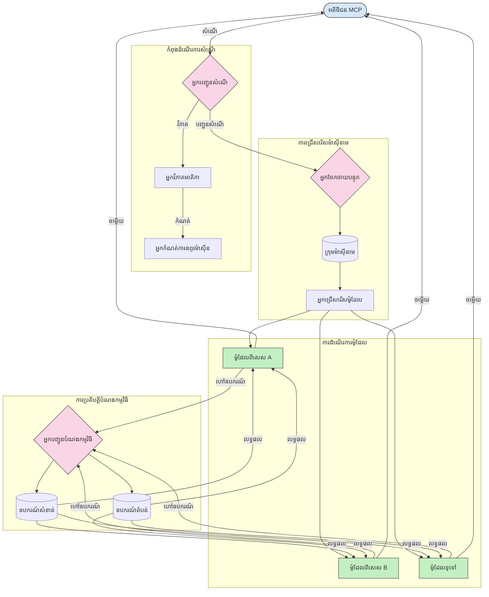

# ការផ្លូវចរាចរណ៍នៅក្នុងប្រព័ន្ធរួមបញ្ចូលគំរូ

ការផ្លូវចរាចរណ៍គឺសំខាន់សម្រាប់បញ្ជូនសំណើទៅកាន់គំរូ តុបភាគ ឬសេវាកម្មសមរម្យនៅក្នុងប្រព័ន្ធនៃ MCP។

## ការណែនាំ

ការផ្លូវចរាចរណ៍នៅក្នុងប្រព័ន្ធរួមបញ្ចូលគំរូ (MCP) មានន័យថាបញ្ជូនសំណើទៅកាន់គំរូ ឬសេវាកម្មដែលសមរម្យបំផុតដោយផ្អែកលើលក្ខណៈត្រូវបានកំណត់ដូចជាប្រភេទខ្លឹមសារ បរិបទអ្នកប្រើប្រាស់ និងផ្ទុកប្រព័ន្ធ។ វាធានាថាការដំណើរការជោគជ័យ និងការប្រើប្រាស់ធនធានបានយ៉ាងមានប្រសិទ្ធភាព។

## គោលបំណងការសិក្សា

នៅចុងដំណើរការសិក្សានេះ អ្នកនឹងអាច:

- យល់ដឹងពីគោលការណ៍នៃការផ្លូវចរាចរណ៍នៅ MCP។
- អនុវត្តការផ្លូវចរាចរណ៍ដោយផ្អែកលើខ្លឹមសារដើម្បីបញ្ជូនសំណើទៅសេវាកម្មជាស្ទើរតែរ។
- អនុវត្តយុទ្ធសាស្រ្តតុល្យភាពផ្ទុកយ៉ាងឆ្លាតវៃ ដើម្បីធ្វើឲ្យមានប្រសិទ្ធិភាពក្នុងការប្រើប្រាស់ធនធាន។
- អនុវត្តការផ្លូវចរាចរណ៍ឧបករណ៍ដែលមានហេតុផលបែបលក្ខណៈអាស្រ័យលើបរិបទសំណើ។

## ការផ្លូវចរាចរណ៍ផ្អែកលើខ្លឹមសារ

ការផ្លូវចរាចរណ៍ផ្អែកលើខ្លឹមសារបញ្ជូនសំណើទៅសេវាកម្មជាស្ទើរតែដោយផ្អែកលើខ្លឹមសារនៃសំណើ។ ឧទាហរណ៍ សំណើដែលទាក់ទងនឹងការបង្កើតកូដអាចបញ្ជូនទៅគំរូកូដជាស្ទើរតែ ខណៈដែលសំណើការសរសេរច្នៃប្រឌិតអាចបញ្ជូនទៅគំរូការសរសេរច្នៃប្រឌិត។

ចង់ដឹងអំពីការអនុវត្តន៍ជាក់លាក់នៅក្នុងភាសាកម្មវិធីផ្សេងៗ។

<details>
<summary>.NET</summary>

```csharp
// .NET Example: Content-based routing in MCP
public class ContentBasedRouter
{
    private readonly Dictionary<string, McpClient> _specializedClients;
    private readonly RoutingClassifier _classifier;
    
    public ContentBasedRouter()
    {
        // Initialize specialized clients for different domains
        _specializedClients = new Dictionary<string, McpClient>
        {
            ["code"] = new McpClient("https://code-specialized-mcp.com"),
            ["creative"] = new McpClient("https://creative-specialized-mcp.com"),
            ["scientific"] = new McpClient("https://scientific-specialized-mcp.com"),
            ["general"] = new McpClient("https://general-mcp.com")
        };
        
        // Initialize content classifier
        _classifier = new RoutingClassifier();
    }
    
    public async Task<McpResponse> RouteAndProcessAsync(string prompt, IDictionary<string, object> parameters = null)
    {
        // Classify the prompt to determine the best specialized service
        string category = await _classifier.ClassifyPromptAsync(prompt);
        
        // Get the appropriate client or fall back to general
        var client = _specializedClients.ContainsKey(category) 
            ? _specializedClients[category] 
            : _specializedClients["general"];
            
        Console.WriteLine($"Routing request to {category} specialized service");
        
        // Send request to the selected service
        return await client.SendPromptAsync(prompt, parameters);
    }
    
    // Simple classifier for routing decisions
    private class RoutingClassifier
    {
        public Task<string> ClassifyPromptAsync(string prompt)
        {
            prompt = prompt.ToLowerInvariant();
            
            if (prompt.Contains("code") || prompt.Contains("function") || 
                prompt.Contains("program") || prompt.Contains("algorithm"))
            {
                return Task.FromResult("code");
            }
            
            if (prompt.Contains("story") || prompt.Contains("creative") || 
                prompt.Contains("imagine") || prompt.Contains("design"))
            {
                return Task.FromResult("creative");
            }
            
            if (prompt.Contains("science") || prompt.Contains("research") || 
                prompt.Contains("analyze") || prompt.Contains("study"))
            {
                return Task.FromResult("scientific");
            }
            
            return Task.FromResult("general");
        }
    }
}
```

ក្នុងកូដខាងលើ យើងបាន៖

- បង្កើតថ្នាក់ `ContentBasedRouter` ដែលបញ្ជូនសំណើដោយផ្អែកលើខ្លឹមសារនៃសំណើ។
- ចាប់ផ្តើមអ្នកប្រើប្រាស់ជាស្ទើរតេលក្ខណៈពិសេសសម្រាប់ដែនផ្សេងៗ (កូដ ច្នៃប្រឌិត វិទ្យាសាស្រ្ត ទូទៅ)។
- អនុវត្តកម្មវិធីចំណាត់ថ្នាក់សាមញ្ញមួយដែលកំណត់ប្រភេទនៃសំណើ ហើយបញ្ជូនទៅសេវាកម្មជាស្ទើរតែមួយសមរម្យ។
- ប្រើយន្តការប្រាក់ត្រឡប់វិញដើម្បីបញ្ជូនសំណើទៅសេវាកម្មទូទៅ ប្រសិនបើគ្មានសេវាកម្មជាស្ទើរតែមួយទេ។
- អនុវត្តការដំណើរការអាស៊ីនក្រោមបែប asynchronous ដើម្បីគ្រប់គ្រងសំណើបានយ៉ាងមានប្រសិទ្ធភាព។
- ប្រើពាក្យសព្ទ dict ទៅដាក់ផែនទីប្រភេទខ្លឹមសារទៅអ្នកប្រើប្រាស់ MCP ជាស្ទើរតែ។
- អនុវត្តកម្មវិធីចំណាត់ថ្នាក់សាមញ្ញមួយដែលវិភាគសំណើ ហើយត្រលប់ប្រភេទសមរម្យ។
- ប្រើអ្នកប្រើប្រាស់ជាស្ទើរតែដើម្បីផ្ញើសំណើ និងទទួលការឆ្លើយតប។
- ដំណើរការករណីដែលសំណើមិនត្រូវនឹងប្រភេទជាស្ទើរតែណាមួយដោយបញ្ជូនទៅសេវាកម្មទូទៅ។

</details>

## តុល្យភាពផ្ទុកឆ្លាតវៃ

តុល្យភាពផ្ទុកធ្វើឲ្យមានប្រសិទ្ធភាពក្នុងការប្រើប្រាស់ធនធាន និងធានាលទ្ធផលខ្ពស់សម្រាប់សេវាកម្ម MCP។ មានវិធីជាច្រើនក្នុងការអនុវត្តតុល្យភាពផ្ទុក ដូចជា round-robin, weighted response time, ឬយុទ្ធនាការដែលជ្រាបខ្លឹមសារ។

មកមើលការអនុវត្តឧទាហរណ៍ខាងក្រោមដែលប្រើយុទ្ធនាការខាងក្រោម:

- **Round Robin**: ចែកចាយសំណើចេញតាមធម្មតាទៅលើម៉ាស៊ីនមេដែលមានស្រាប់។
- **Weighted Response Time**: បញ្ជូនសំណើទៅម៉ាស៊ីនមេដោយផ្អែកលើពេលវេលាចំលើយភាគរយ។
- **Content-Aware**: បញ្ជូនសំណើទៅម៉ាស៊ីនមេជាស្ទើរតែដោយផ្អែកលើខ្លឹមសារនៃសំណើ។

<details>
<summary>Java</summary>

```java
// ឧទាហរណ៍ Java: ការចែកចាយបន្ទុកឆ្លាតវៃសម្រាប់ម៉ាស៊ីនបម្រើ MCP
public class McpLoadBalancer {
    private final List<McpServerNode> serverNodes;
    private final LoadBalancingStrategy strategy;
    
    public McpLoadBalancer(List<McpServerNode> nodes, LoadBalancingStrategy strategy) {
        this.serverNodes = new ArrayList<>(nodes);
        this.strategy = strategy;
    }
    
    public McpResponse processRequest(McpRequest request) {
        // ជ្រើសរើសម៉ាស៊ីនបម្រើដ៏ល្អបំផុតដោយផ្អែកលើយុទ្ធសាស្ត្រ
        McpServerNode selectedNode = strategy.selectNode(serverNodes, request);
        
        try {
            // បញ្ជូនសំណើទៅកាន់កំណត់តំណរដែលបានជ្រើស
            return selectedNode.processRequest(request);
        } catch (Exception e) {
            // រៀបចំពេលមានបរាជ័យ - ប្រតិបត្តិការជម្រុញម្តងទៀត ឬយុទ្ធសាស្ត្រប្តូរជម្រើស
            System.err.println("Error processing request on node " + selectedNode.getId() + ": " + e.getMessage());
            
            // សម្គាល់កំណត់តំណ្រថាពិតជាមានបញ្ហាសុខភាព
            selectedNode.recordFailure();
            
            // ព្យាយាមកំណត់តំណដែលល្អបំផុតបន្ទាប់ជាជម្រើសប្តូរ
            List<McpServerNode> remainingNodes = new ArrayList<>(serverNodes);
            remainingNodes.remove(selectedNode);
            
            if (!remainingNodes.isEmpty()) {
                McpServerNode fallbackNode = strategy.selectNode(remainingNodes, request);
                return fallbackNode.processRequest(request);
            } else {
                throw new RuntimeException("All MCP server nodes failed to process the request");
            }
        }
    }
    
    // បម្រែបម្រួលការត្រួតពិនិត្យសុខភាពកំណត់តំណ
    public void startHealthChecks(Duration interval) {
        ScheduledExecutorService scheduler = Executors.newScheduledThreadPool(1);
        scheduler.scheduleAtFixedRate(() -> {
            for (McpServerNode node : serverNodes) {
                try {
                    boolean isHealthy = node.checkHealth();
                    System.out.println("Node " + node.getId() + " health status: " + 
                                      (isHealthy ? "HEALTHY" : "UNHEALTHY"));
                } catch (Exception e) {
                    System.err.println("Health check failed for node " + node.getId());
                    node.setHealthy(false);
                }
            }
        }, 0, interval.toMillis(), TimeUnit.MILLISECONDS);
    }
    
    // ចំណុចជួបសម្រាប់យុទ្ធសាស្ត្រចែកចាយបន្ទុក
    public interface LoadBalancingStrategy {
        McpServerNode selectNode(List<McpServerNode> nodes, McpRequest request);
    }
    
    // យុទ្ធសាស្ត្រជារង្វិលជាប់រង្វង់
    public static class RoundRobinStrategy implements LoadBalancingStrategy {
        private AtomicInteger counter = new AtomicInteger(0);
        
        @Override
        public McpServerNode selectNode(List<McpServerNode> nodes, McpRequest request) {
            List<McpServerNode> healthyNodes = nodes.stream()
                .filter(McpServerNode::isHealthy)
                .collect(Collectors.toList());
            
            if (healthyNodes.isEmpty()) {
                throw new RuntimeException("No healthy nodes available");
            }
            
            int index = counter.getAndIncrement() % healthyNodes.size();
            return healthyNodes.get(index);
        }
    }
    
    // យុទ្ធសាស្ត្រពេលឆ្លើយតបដែលបានផ្ដល់ទំងន់
    public static class ResponseTimeStrategy implements LoadBalancingStrategy {
        @Override
        public McpServerNode selectNode(List<McpServerNode> nodes, McpRequest request) {
            return nodes.stream()
                .filter(McpServerNode::isHealthy)
                .min(Comparator.comparing(McpServerNode::getAverageResponseTime))
                .orElseThrow(() -> new RuntimeException("No healthy nodes available"));
        }
    }
    
    // យុទ្ធសាស្ត្រដែលមានការយល់ដឹងពីមាតិការសា្ត
    public static class ContentAwareStrategy implements LoadBalancingStrategy {
        @Override
        public McpServerNode selectNode(List<McpServerNode> nodes, McpRequest request) {
            // កំណត់លក្ខណៈសំណើ
            boolean isCodeRequest = request.getPrompt().contains("code") || 
                                   request.getAllowedTools().contains("codeInterpreter");
            
            boolean isCreativeRequest = request.getPrompt().contains("creative") || 
                                       request.getPrompt().contains("story");
            
            // ស្វែងរកកំណត់តំណដែលមានជំនាញពិសេស
            Optional<McpServerNode> specializedNode = nodes.stream()
                .filter(McpServerNode::isHealthy)
                .filter(node -> {
                    if (isCodeRequest && node.getSpecialization().equals("code")) {
                        return true;
                    }
                    if (isCreativeRequest && node.getSpecialization().equals("creative")) {
                        return true;
                    }
                    return false;
                })
                .findFirst();
            
            // ត្រឡប់កំណត់តំណពិសេស ឬកំណត់តំណដែលមានបន្ទុកតិចបំផុត
            return specializedNode.orElse(
                nodes.stream()
                    .filter(McpServerNode::isHealthy)
                    .min(Comparator.comparing(McpServerNode::getCurrentLoad))
                    .orElseThrow(() -> new RuntimeException("No healthy nodes available"))
            );
        }
    }
}
```

ក្នុងកូដខាងលើ យើងបាន៖

- បង្កើតថ្នាក់ `McpLoadBalancer` ដែលគ្រប់គ្រងបញ្ជីវ៉ែបផ្ទុកម៉ាស៊ីនមេ MCP ហើយបញ្ជូនសំណើដោយផ្អែកលើយុទ្ធនាការតុល្យភាពផ្ទុកដែលបានជ្រើស។
- អនុវត្តយុទ្ធនាការតុល្យភាពផ្ទុកផ្សេងៗ: `RoundRobinStrategy`, `ResponseTimeStrategy`, និង `ContentAwareStrategy`។
- ប្រើ `ScheduledExecutorService` ដើម្បីពិនិត្យសុខភាពនៃម៉ាស៊ីនមេជាថ្មីៗរៀងរាល់រយៈពេល។
- អនុវត្តយន្តការពិនិត្យសុខភាព ដែលសម្គាល់ម៉ាស៊ីនមេជាសុខភាព ឬមិនសុខភាពដោយផ្អែកលើការឆ្លើយតប។
- ដំណើរការសំណើដោយមានការគ្រប់គ្រងកំហុស និងយុទ្ធសាស្រ្តប្រាក់ត្រឡប់ដើម្បីធានាលទ្ធផលខ្ពស់។
- ប្រើថ្នាក់ `McpServerNode` ដើម្បីតំណាងម៉ាស៊ីនមេ MCP ឯកជន រួមមានស្ថានភាពសុខភាព ពេលចំលើយមធ្យម និងផ្ទុកបច្ចុប្បន្ន។
- អនុវត្តថ្នាក់ `McpRequest` ដើម្បីផ្ទុកព័ត៌មានលម្អិតសំណើដូចជា សំណើ និងឧបករណ៍ដែលញាប់អនុញ្ញាត។
- ប្រើ Java Streams ដើម្បីធ្វើការតម្រៀប និងជ្រើសរើសម៉ាស៊ីនមេដោយផ្អែកលើសុខភាព និងការជាស្ទើរតែ។

</details>

## ការផ្លូវចរាចរណ៍ឧបករណ៍ទីផ្សារជឿនលឿន

ការផ្លូវចរាចរណ៍ឧបករណ៍ធានាថាការហៅឧបករណ៍ត្រូវបានបញ្ជូនទៅសេវាកម្មសមរម្យបំផុតដោយផ្អែកលើបរិបទ។ ឧទាហរណ៍ ការហៅឧបករណ៍អាកាសធាតុអាចត្រូវបានបញ្ជូនទៅចំណុចសេវាកម្មតំបន់តាមទីតាំងអ្នកប្រើប្រាស់ ឬឧបករណ៍គណនាអាចត្រូវបានប្រើជាមួយកំណែជាក់លាក់នៃ API។

ចង់ស្គាល់ពីការអនុវត្តឧទាហរណ៍ដែលបង្ហាញពីការផ្លូវចរាចរណ៍ឧបករណ៍ដែលអាចបត់បែនបានដោយផ្អែកលើវិភាគសំណើ ចំណុចសេវាកម្មតំបន់ និងការគាំទ្រកំណែ។

<details>
<summary>Python</summary>

```python
# ឧទាហរណ៍ Python: ការបញ្ជូនឧបករណ៍ឌីណាមិចផ្អែកលើវិភាគសំណើ
class McpToolRouter:
    def __init__(self):
        # ចុះបញ្ជីចំនុចបញ្ចប់ឧបករណ៍ដែលមាន
        self.tool_endpoints = {
            "weatherTool": "https://weather-service.example.com/api",
            "calculatorTool": "https://calculator-service.example.com/compute",
            "databaseTool": "https://database-service.example.com/query",
            "searchTool": "https://search-service.example.com/search"
        }
        
        # ចំនុចបញ្ចប់តំបន់សម្រាប់ការចែកចាយជាកិច្ចដែនសកល
        self.regional_endpoints = {
            "us": {
                "weatherTool": "https://us-west.weather-service.example.com/api",
                "searchTool": "https://us.search-service.example.com/search"
            },
            "europe": {
                "weatherTool": "https://eu.weather-service.example.com/api",
                "searchTool": "https://eu.search-service.example.com/search"
            },
            "asia": {
                "weatherTool": "https://asia.weather-service.example.com/api",
                "searchTool": "https://asia.search-service.example.com/search"
            }
        }
        
        # គាំទ្រកំណែឧបករណ៍
        self.tool_versions = {
            "weatherTool": {
                "default": "v2",
                "v1": "https://weather-service.example.com/api/v1",
                "v2": "https://weather-service.example.com/api/v2",
                "beta": "https://weather-service.example.com/api/beta"
            }
        }
    
    async def route_tool_request(self, tool_name, parameters, user_context=None):
        """Route a tool request to the appropriate endpoint based on context"""
        endpoint = self._select_endpoint(tool_name, parameters, user_context)
        
        if not endpoint:
            raise ValueError(f"No endpoint available for tool: {tool_name}")
        
        # អនុវត្តសំណើពិតទៅចំពោះចំនុចបញ្ចប់ដែលបានជ្រើស
        return await self._execute_tool_request(endpoint, tool_name, parameters)
    
    def _select_endpoint(self, tool_name, parameters, user_context=None):
        """Select the most appropriate endpoint based on context"""
        # ចំនុចបញ្ចប់មូលដ្ឋានពីឃ្លាំង
        if tool_name not in self.tool_endpoints:
            return None
            
        base_endpoint = self.tool_endpoints[tool_name]
        
        # ពិនិត្យមើលថាតើយើងត្រូវប្រើកំណែឧបករណ៍ជាក់លាក់ឬអត់
        if tool_name in self.tool_versions:
            version_info = self.tool_versions[tool_name]
            
            # ប្រើកំណែនិយមឬកំណែដែលបានបញ្ជាក់
            requested_version = parameters.get("_version", version_info["default"])
            if requested_version in version_info:
                base_endpoint = version_info[requested_version]
        
        # ពិនិត្យការបញ្ជូនតាមតំបន់បើតំបន់អ្នកប្រើបានគ្រប់គ្រាន់
        if user_context and "region" in user_context:
            user_region = user_context["region"]
            
            if user_region in self.regional_endpoints:
                regional_tools = self.regional_endpoints[user_region]
                
                if tool_name in regional_tools:
                    # ប្រើចំនុចបញ្ចប់ឧបករណ៍ជាតំបន់
                    return regional_tools[tool_name]
        
        # ពិនិត្យការទាមទារស្នាក់នៅទិន្នន័យ
        if user_context and "data_residency" in user_context:
            # នេះនឹងអនុវត្តតុល្យ័យដើម្បីធ្វើឲ្យទិន្នន័យនៅក្នុងអាណាចក្រដែលបានបញ្ជាក់
            pass
        
        # ពិនិត្យមើលការបញ្ជូនផ្អែកលើពេលយឺតយ៉ាវ
        if user_context and "latency_sensitive" in user_context and user_context["latency_sensitive"]:
            # នេះនឹងអនុវត្តតុល្យ័យដើម្បីជ្រើសរើសចំនុចបញ្ចប់ដែលមានពេលយឺតយ៉ាវទាបបំផុត
            pass
            
        return base_endpoint
        
    async def _execute_tool_request(self, endpoint, tool_name, parameters):
        """Execute the actual tool request to the selected endpoint"""
        try:
            async with aiohttp.ClientSession() as session:
                async with session.post(
                    endpoint,
                    json={"toolName": tool_name, "parameters": parameters},
                    headers={"Content-Type": "application/json"}
                ) as response:
                    if response.status == 200:
                        result = await response.json()
                        return result
                    else:
                        error_text = await response.text()
                        raise Exception(f"Tool execution failed: {error_text}")
        except Exception as e:
            # អនុវត្តតុល្យ័យព្យាយាមម្តងទៀតឬយុទ្ធសាស្ត្រប្ដូរជម្រើស
            print(f"Error executing tool {tool_name} at {endpoint}: {str(e)}")
            raise
```

ក្នុងកូដខាងលើ យើងបាន៖

- បង្កើតថ្នាក់ `McpToolRouter` ដែលគ្រប់គ្រងការផ្លូវចរាចរណ៍ឧបករណ៍ដោយផ្អែកលើវិភាគសំណើ ចំណុចសេវាកម្មតំបន់ និងការគាំទ្រកំណែ។
- ចុះបញ្ជីចំណុចសេវាកម្មឧបករណ៍ដែលមានស្រាប់ និងចំណុចសេវាកម្មតំបន់សម្រាប់ចែកចាយជាសកល។
- អនុវត្តយន្តការផ្លូវចរាចរណ៍អាចបត់បែនបាន ដែលជ្រើសចំណុចសេវាកម្មសមរម្យដោយផ្អែកលើបរិបទអ្នកប្រើប្រាស់ ដូចជាតំបន់ និងតម្រូវការទីតាំងទិន្នន័យ។
- អនុវត្តការគាំទ្រកំណែសម្រាប់ឧបករណ៍ ដែលអនុញ្ញាតឲ្យអ្នកប្រើប្រាស់បញ្ជាក់កំណែឧបករណ៍ដែលចង់ប្រើ។
- ប្រើសំណើ HTTP អាស៊ីនក្រោម asynchronous ដើម្បីអនុវត្តការហៅឧបករណ៍ និងដំណើរការឆ្លើយតប។

</details>

## សំណាំ និងស្ថាបត្យកម្មការផ្លូវចរាចរណ៍នៅក្នុង MCP

សំណាំគឺជាធាតុសំខាន់មួយនៃប្រព័ន្ធរួមបញ្ចូលគំរូ (MCP) ដែលអនុញ្ញាតឲ្យមានការដំណើរការសំណើ និងការផ្លូវចរាចរណ៍យ៉ាងមានប្រសិទ្ធភាព។ វា រួមមានការវិភាគសំណើដែលមកដល់ ដើម្បីកំណត់គំរូ ឬសេវាកម្មសមរម្យបំផុតសម្រាប់ដំណើរការពួកវា ដោយផ្អែកលើលក្ខណៈផ្សេងៗដូចជាប្រភេទខ្លឹមសារ បរិបទអ្នកប្រើ និងផ្ទុកប្រព័ន្ធ។

ការសំណាំ និងការផ្លូវចរាចរណ៍អាចត្រូវតែមករួមគ្នា ដើម្បីបង្កើតស្ថាបត្យកម្មរឹងមាំ ដែលធ្វើឲ្យប្រសើរនៃការប្រើប្រាស់ធនធាន និងធានាលទ្ធផលខ្ពស់។ ដំណើរការសំណាំអាចប្រើសម្រាប់ចំណាត់ថ្នាក់សំណើ ខណៈដែលការផ្លូវចរាចរណ៍បញ្ជូនពួកវាទៅគំរូ ឬសេវាកម្មដែលសមរម្យ។

រូបភាពខាងក្រោមបង្ហាញពីរបៀបសំណាំ និងការផ្លូវចរាចរណ៍ធ្វើការជាមួយគ្នា ក្នុងស្ថាបត្យកម្ម MCP ដ៏ទូលំទូលាយ៖


## តើអ្វីទៅជាដំណាក់កាលបន្ទាប់

- [5.6 Sampling](../mcp-sampling/README.md)

---

<!-- CO-OP TRANSLATOR DISCLAIMER START -->
**ការបញ្ជាក់**៖  
ឯកសារនេះត្រូវបានបកប្រែដោយប្រើសេវាបកប្រែ AI [Co-op Translator](https://github.com/Azure/co-op-translator)។ ខណៈពេលដែលយើងខំប្រឹងប្រែងដើម្បីភាពត្រឹមត្រូវ សូមយល់ថាការបកប្រែដោយស្វ័យប្រវត្តិអាចមានកំហុស ឬភាពមិនត្រឹមត្រូវ។ ឯកសារដើមក្នុងភាសាដើមគួរត្រូវបានលើកឡើងថាជាដួនប្រភពផ្លូវការជាមូលដ្ឋាន។ សម្រាប់ព័ត៌មានសំខាន់ៗ ការបកប្រែដោយមនុស្សជំនាញត្រូវបានផ្ដល់អនុសាសន៍។ យើងមិនទទួលលទ្ធផលនៃការយល់ច្រឡំ ឬការបកប្រែមិនត្រឹមត្រូវណាមួយដែលកើតឡើងពីការប្រើប្រាស់ការបកប្រែនេះទេ។
<!-- CO-OP TRANSLATOR DISCLAIMER END -->