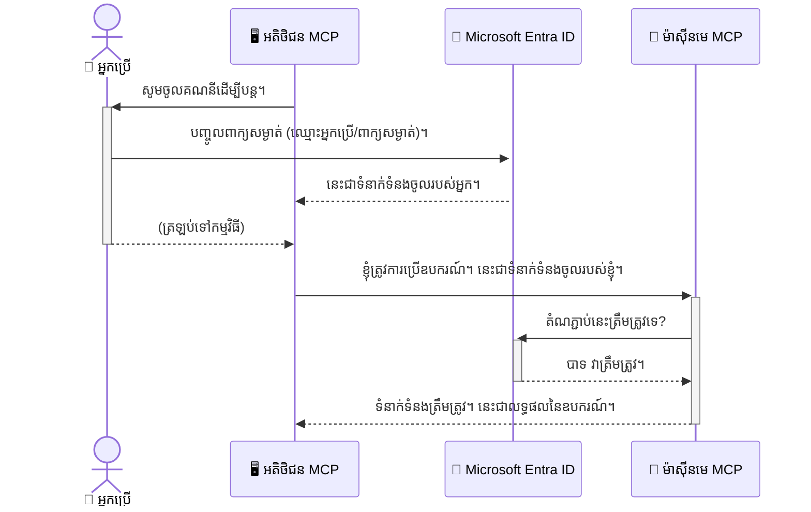

# ការប្រើប្រាស់សុវត្ថិភាពសម្រាប់ស្ដ្រីម AI: ការផ្ទៀងផ្ទាត់ដោយ Entra ID សម្រាប់ម៉ូដែល Context Protocol Servers

## ការណែនាំ
ការរក្សាសុវត្ថិភាពបម្រើការ Model Context Protocol (MCP) របស់អ្នកសំខាន់បែបដូចនឹងការចាក់សោរបើកបង្ហាញច្រកចេញច្រកចូលផ្ទះរបស់អ្នក។ ការដាក់បម្រើការ MCP របស់អ្នកបើកធ្វើឲ្យឧបករណ៍ និងទិន្នន័យរបស់អ្នកមានហានិភ័យក្នុងការចូលដំណើរការដោយគ្មានអនុញ្ញាតដែលអាចនាំឲ្យមានការបំពានសុវត្ថិភាព។ Microsoft Entra ID ផ្ដល់ជូនដំណោះស្រាយគ្រប់គ្រងអត្តសញ្ញាណ និងការចូលដំណើរការផ្អែកលើពពកដោយមានភាពរឹងមាំ ជួយធានាថាមនុស្សប្រើប្រាស់ និងកម្មវិធីដែលមានសិទិ្ធត្រឹមត្រូវតែប៉ុណ្ណោះអាចធ្វើប្រតិបត្តិការជាមួយបម្រើ MCP របស់អ្នក។
ក្នុងផ្នែកនេះ អ្នកនឹងរៀនពីវិធីការពារការប្រតិបត្តិការស្រាវជ្រាវ AI របស់អ្នកដោយប្រើការផ្ទៀងផ្ទាត់ Entra ID។

## គោលដៅក្នុងការរៀន
នៅចុងផ្នែកនេះ អ្នកនឹងអាច៖

- យល់ដឹងអំពីសារសំខាន់នៃការរក្សាសុវត្ថិភាពម៉ាស៊ីនបម្រើ MCP។
- ពិពណ៌នាអំពីមូលដ្ឋាន Microsoft Entra ID និងការផ្ទៀងផ្ទាត់ OAuth 2.0។
- សម្គាល់ភាពខុសគ្នារវាងអតិថិជនសាធារណៈ និងអតិថិជនសម្ងាត់។
- អនុវត្តការផ្ទៀងផ្ទាត់ Entra ID ក្នុងស្ថានការណ៍ម៉ាស៊ីនបម្រើ MCP ពិសេសនិងចំរូងចំរាស (អតិថិជនសាធារណៈ) និងចម្ងាយ (អតិថិជនសម្ងាត់)។
- អនុវត្តអនុវត្តន៍ល្អបំផុតក្នុងការរស់នៅសុវត្ថិភាពពេលបង្កើតការប្រតិបត្តិការស្រាវជ្រាវ AI ។

## សុវត្ថិភាព និង MCP

ដូចជាអ្នកមិននឹងចាក់សោរបើកច្រកផ្ទះរបស់អ្នកដោយសារមួយទេ អ្នកក៏មិនគួរធ្វើដូចគ្នាជាមួយម៉ាស៊ីនបម្រើ MCP របស់អ្នកដោយបើកឲ្យគេចូលដំណើរការដោយមិនមានការអនុញ្ញាត។ ការរក្សាសុវត្ថិភាពប្រតិបត្តិការស្រាវជ្រាវ AI របស់អ្នកគឺមានសារៈសំខាន់សម្រាប់ការបង្កើតកម្មវិធីដែលរឹងមាំ រាប់អាន និងមានសុវត្ថិភាព។ ចំណែកឆនេះនឹងណែនាំអ្នកក្នុងការប្រើប្រាស់ Microsoft Entra ID ដើម្បីរក្សា MCP របស់អ្នកឲ្យមានសុវត្ថិភាព ប្រាកដថាមនុស្សប្រើប្រាស់ និងកម្មវិធីដែលមានសិទិ្ធត្រឹមត្រូវតែប៉ុណ្ណោះអាចចូលប្រើតម្កល់ឧបករណ៍ និងទិន្នន័យរបស់អ្នក។

## ហេតុអ្វីបានជាសុវត្ថិភាពមានសារៈសំខាន់សម្រាប់ម៉ាស៊ីនបម្រើ MCP

និទស្សន៍ស្រដៀងគ្នា៖ ម៉ាស៊ីនបម្រើ MCP របស់អ្នកមានឧបករណ៍ដែលអាចផ្ញើអ៊ីមែលឬចូលប្រតិបត្តិការទិន្នន័យអតិថិជន។ ម៉ាស៊ីនបម្រើដែលមិនមានសុវត្ថិភាពមានន័យថា គេសមត្ថភាពប្រើឧបករណ៍នោះដោយគ្មានការអនុញ្ញាត ដោយនាំឲ្យមានការចូលដំណើរការទិន្នន័យដោយខុសច្បាប់ ផ្ញើសារពស់ៗ (ស្ពាម) ឬសកម្មភាពរបស់មនុស្សកំហុសផ្សេងទៀតបាន។

ដោយអនុវត្តការផ្ទៀងផ្ទាត់ អ្នកបញ្ជាក់ថាពីរបព្វគ្រប់សំណើទៅម៉ាស៊ីនបម្រើរបស់អ្នកត្រូវបានផ្ទៀងផ្ទាត់ សម្រាប់ផ្ទៀងផ្ទាត់អត្តសញ្ញាណអ្នកប្រើប្រាស់ឬកម្មវិធីដែលធ្វើសំណើ។ នេះជាជំហានដំបូង និងមានសារៈសំខាន់បំផុតក្នុងការពារការប្រតិបត្តិការស្រាវជ្រាវ AI របស់អ្នក។

## ការណែនាំ Microsoft Entra ID

[**Microsoft Entra ID**](https://adoption.microsoft.com/microsoft-security/entra/) គឺជាសេវាកម្មគ្រប់គ្រងអត្តសញ្ញាណ និងការចូលដំណើរការដោយផ្អែកលើពពក។ គិតវាដូចជាជាមន្ត្រីសុវត្ថិភាពសកលសម្រាប់កម្មវិធីរបស់អ្នក។ វាដំណើរការប្រតិបត្តិការរឹងមាំនៃការផ្ទៀងផ្ទាត់អត្តសញ្ញាណអ្នកប្រើប្រាស់ (authentication) និងកំណត់តើពួកគេអាចធ្វើអ្វីបាន (authorization)។

ដោយប្រើប្រាស់ Entra ID អ្នកអាច៖

- បើកអភិវឌ្ឍការចូលប្រើដោយសុវត្ថិភាពសម្រាប់អ្នកប្រើប្រាស់។
- ការពារប្រព័ន្ធ API និងសេវាកម្ម។
- គ្រប់គ្រងគោលនយោបាយចូលប្រើពីកន្លែងមួយដាច់ខាត។

សម្រាប់ម៉ាស៊ីនបម្រើ MCP, Entra ID ផ្តល់ដំណោះស្រាយដ៏រឹងមាំ និងទទួលបានការជឿជាក់យ៉ាងទូលំទូលាយដើម្បីគ្រប់គ្រងមនុស្សដែលអាចចូលប្រើមុខងារម៉ាស៊ីនបម្រើរបស់អ្នក។

---

## ដើម្បីយល់ដឹងពីភាពអស្ចារ្យ៖ របៀបដែល Entra ID Authentication ប្រតិបត្តិការ

Entra ID ប្រើស្តង់ដារបើកទូលាយដូចជា **OAuth 2.0** ដើម្បីដំណើរការផ្ទៀងផ្ទាត់។ ទោះបីជារឿងលម្អិតអាចស្មុគស្មាញ កំលាំងស្នូលទំនងមានភាពសាមញ្ញ ហើយអាចយល់បានតាមការប្រាក់ប្រៀប។

### ការណែនាំស្រួលៗចំពោះ OAuth 2.0: កូនសោប៉ះវ៉ាឡេត

គិតពី OAuth 2.0 ដូចជា សេវាកម្មវ៉ាល់ឱ្យរថយន្តរបស់អ្នក។ នៅពេលអ្នកទៅភោជនីយដ្ឋាន អ្នកមិនទទួលទាន់បំប្លែងវ៉ារូបសោភ្ជាប់របស់អ្នកទៅវ៉ាល់ទេ។ ផ្ទុយទៅវិញ អ្នកផ្ដល់ឱ្យវ៉៉ាល់នូវ **កូនសោប៉ះវ៉ាឡេត** ដែលមានសិទ្ធិការពារ​កំណត់៖ វាអាចបើករថយន្តនិងចាក់សោទ្វារបាន ប៉ុន្តាមិនអាចបើកកញ្ចក់ឆ្នូតឬប្រអប់ដៃបាន។

ក្នុងការប្រាក់នេះ៖

- **អ្នក** គឺជា **អ្នកប្រើប្រាស់**។
- **រថយន្តរបស់អ្នក** គឺជា **ម៉ាស៊ីនបម្រើ MCP** ដែលមានឧបករណ៍ និងទិន្នន័យមានតម្លៃ។
- **វ៉៉ាល់** គឺជា **Microsoft Entra ID**។
- **អ្នកគ្រប់គ្រងចតរថយន្ត** គឺជា **អតិថិជន MCP** (កម្មវិធីដែលព្យាយាមចូលប្រើម៉ាស៊ីនបម្រើ)។
- **កូនសោប៉ះវ៉ាឡេត** គឺជា **សញ្ញាភាពចូលដំណើរការ (Access Token)**។

សញ្ញាភាពចូលដំណើរការជាសមាសធាតុអក្សរដែលបង្កើតដោយ Entra ID សម្រាប់អតិថិជន MCP បន្ទាប់ពីអ្នកចូលគណនី។ អតិថិជនរួចទៅនាំឲ្យម៉ាស៊ីនបម្រើ MCP ដោយមានសញ្ញានេះជាមួយសំណើរនីមួយៗ។ ម៉ាស៊ីនបម្រើអាចផ្ទៀងផ្ទាត់បានថាសំណើរនេះត្រឹមត្រូវ និងអតិថិជនមានសិទ្ធិចូលប្រើឧបករណ៍ ដោយមិនចាំបាច់ដឹងពាក្យសម្ងាត់របស់អ្នក។

### ដំណើរការផ្ទៀងផ្ទាត់

នេះជារបៀបដំណើរការនៅក្នុងអនុវត្តន៍៖



### ការណែនាំ Microsoft Authentication Library (MSAL)

មុនពេលចូលទៅកូដ វាជារឿងសំខាន់ក្នុងការណែនាំម៉ូឌុលសំខាន់មួយដែលអ្នកនឹងឃើញនៅឧទាហរណ៍៖ **Microsoft Authentication Library (MSAL)**។

MSAL គឺជាបណ្ណាល័យដែល Microsoft បង្កើតឡើងនៅឲ្យអ្នកអភិវឌ្ឍកែងកុំព្យូទ័រក្នុងការគ្រប់គ្រងការផ្ទៀងផ្ទាត់បានស្រួល។ ជំនួសការចាំបាច់សរសេរកូដស្មុគស្មាញសម្រាប់គ្រប់គ្រងសញ្ញាសុវត្ថិភាព ចូលគណនី និងត្រឡប់បន្ទាន់ក្រោយផ្លូវផ្សេងៗ MSAL ទទួលខុសត្រូវគ្រប់គ្រង។

ការប្រើប្រាស់បណ្ណាល័យ MSAL ផ្តល់អត្ថប្រយោជន៍ដូចជា៖

- **មានសុវត្ថិភាព៖** វានាំយករបៀបស្តង់ដារអន្តរជាតិ និងអនុវត្តការអនុវត្តល្អបំផុតក្នុងជំនាញសុវត្ថិភាព។ បន្ថយហានិភ័យក្នុងកូដរបស់អ្នក។
- **ផ្សាភាពកូដងាយស្រួល៖** វាភាគរយភាពកូដសម្រួល OAuth 2.0 និង OpenID Connect ដើម្បីឲ្យអ្នកបញ្ចូលការផ្ទៀងផ្ទាត់ដោយគ្រាន់តែបន្ទាត់កូដតិចតួច។
- **ត្រូវបានថែទាំ៖** Microsoft រក្សាទុក និងបន្ទាន់សម័យ MSAL ដើម្បីដោះស្រាយការគំរាមកំហែងសុវត្ថិភាពថ្មីៗ និងការផ្លាស់ប្ដូរផ្នែកផ្សេងៗរបស់វេទិកា។

MSAL គាំទ្រភាសារនិងរចនាសម្ព័ន្ធកម្មវិធីជាច្រើន រួមមាន .NET, JavaScript/TypeScript, Python, Java, Go, និងវេទិកាម៉ូប៊ីលដូចជា iOS និង Android។ នេះមានន័យថាអ្នកអាចប្រើប្រាស់គំរូផ្ទៀងផ្ទាត់ដែលកំណត់ស្តង់ដារជាប្រចាំសម្រាប់បច្ចេកវិទ្យាទាំងមូលរបស់អ្នក។

ដើម្បីរៀនបន្ថែមអំពី MSAL អ្នកអាចពិនិត្យឯកសារមានសិទិ្ធ [MSAL overview documentation](https://learn.microsoft.com/entra/identity-platform/msal-overview) ។

---

## រក្សាសុវត្ថិភាពម៉ាស៊ីនបម្រើ MCP របស់អ្នកជាមួយ Entra ID: មគ្គុទេសក៍ជំហានបន្ទាប់បន្ទាប់

ឥឡូវនេះ អណ្ដែតទៅមើលរបៀបរក្សាសុវត្ថិភាពម៉ាស៊ីនបម្រើ MCP មួយដែលដំណើរការទីភ្នាក់ងារក្នុងស្រុក (ដែលផ្សព្វផ្សាយតាម stdio) ដោយប្រើ Entra ID។ ឧទាហរណ៍នេះប្រើអតិថិជនសាធារណៈ ដែលសមរម្យសម្រាប់កម្មវិធីដែលដំណើរការលើកុំព្យូទ័រផ្ទាល់អ្នកប្រើ ដូចជាកម្មវិធីតុ ឬម៉ាស៊ីនបម្រើអភិវឌ្ឍក្នុងស្រុក។

### ស្ថានការណ៍ទី ១៖ រក្សាសុវត្ថិភាពម៉ាស៊ីនបម្រើ MCP ក្នុងស្រុក (ជាមួយអតិថិជនសាធារណៈ)

នៅក្នុងស្ថានការណ៍នេះ យើងនឹងមើលម៉ាស៊ីនបម្រើ MCP ដែលដំឡើងក្នុងស្រុក ផ្ញើរសារ​តាម stdio ហើយប្រើ Entra ID ដើម្បីផ្ទៀងផ្ទាត់អ្នកប្រើមុនពេលឲ្យចូលឧបករណ៍របស់វា។ ម៉ាស៊ីនបម្រើនឹងមានឧបករណ៍តែមួយសម្រាប់យកព័ត៌មានប្រវត្តិរូបអ្នកប្រើប្រាស់ពី Microsoft Graph API។

#### ១. ការតំឡើងកម្មវិធីក្នុង Entra ID

មុនសរសេរកូដណាមួយ អ្នកត្រូវចុះបញ្ជីកម្មវិធីរបស់អ្នកក្នុង Microsoft Entra ID។ នេះនាំឲ្យ Entra ID ដឹងពីកម្មវិធីរបស់អ្នក និងផ្ដល់សិទិ្ធកម្មវិធីប្រើបណ្តាសេវាកម្មផ្ទៀងផ្ទាត់។

1. ចូលទៅកាន់ **[Microsoft Entra បណ្ដាញបណ្ដា](https://entra.microsoft.com/)**។
2. ទៅកាន់ **ការ​ចុះបញ្ជីកម្មវិធី (App registrations)** ហើយចុច **ការ​ចុះបញ្ជី​ថ្មី (New registration)**។
3. ផ្ដល់ឈ្មោះកម្មវិធីរបស់អ្នក (ឧ. "ម៉ាស៊ីនបម្រើ MCP នៅក្នុងស្រុករបស់ខ្ញុំ")។
4. សម្រាប់ **ប្រភេទគណនីនៅក្នុងគណនីគ្រប់គ្នា** ជ្រើសរើស **គណនីក្នុងថតនាម្រិតត្រឹមតែអង្គការនេះ**។
5. អ្នកអាចទុកវាល **Redirect URI** ឲ្យទទេសម្រាប់ឧទាហរណ៍នេះ។
6. ចុច **ចុះបញ្ជី (Register)**។

បន្ទាប់ពីចុះបញ្ជី សូមចំណាំលេខ **Application (client) ID** និង **Directory (tenant) ID** ដែលអ្នកនឹងប្រើនៅក្នុងកូដ។

#### ២. កូដ៖ ការពិភាក្សារប្រយោគ

មកមើលផ្នែកសំខាន់នៃកូដដែលគ្រប់គ្រងការផ្ទៀងផ្ទាត់។ កូដពេញលេញសម្រាប់ឧទាហរណ៍នេះអាចរកបានក្នុងថត [Entra ID - Local - WAM](https://github.com/Azure-Samples/mcp-auth-servers/tree/main/src/entra-id-local-wam) របស់ [mcp-auth-servers GitHub repository](https://github.com/Azure-Samples/mcp-auth-servers) ។

**`AuthenticationService.cs`**

ថ្នាក់នេះទទួលខុសត្រូវរៀបចំការប្រតិបត្តិការជាមួយ Entra ID ។

- **`CreateAsync`**៖ វិធីសាស្ត្រនេះធ្វើការចាប់ផ្ដើម `PublicClientApplication` ពី MSAL ។ វាត្រូវបានចេញផ្សាយជាមួយ clientId និង tenantId នៃកម្មវិធីរបស់អ្នក។
- **`WithBroker`**៖ អនុញ្ញាតឲ្យប្រើ broker (ដូចជា Windows Web Account Manager) ដែលផ្ដល់បទពិសោធន៍ single sign-on ដ៏មានសុវត្ថិភាពនិងរលូន។
- **`AcquireTokenAsync`**៖ វិធីសាស្ត្រសំខាន់នេះព្យាយាមទទួលបានសញ្ញាភាពដោយស្ងាត់ (silent) ប្រសិនបើមានសកម្មភាពហៅមុនបានហើយ។ ប្រសិនបើមិនទទួលបាន វានឹងផ្សព្វផ្សាយអ្នកប្រើឲ្យចូលគណនីដោយផ្ទាល់។

```csharp
// Simplified for clarity
public static async Task<AuthenticationService> CreateAsync(ILogger<AuthenticationService> logger)
{
    var msalClient = PublicClientApplicationBuilder
        .Create(_clientId) // Your Application (client) ID
        .WithAuthority(AadAuthorityAudience.AzureAdMyOrg)
        .WithTenantId(_tenantId) // Your Directory (tenant) ID
        .WithBroker(new BrokerOptions(BrokerOptions.OperatingSystems.Windows))
        .Build();

    // ... cache registration ...

    return new AuthenticationService(logger, msalClient);
}

public async Task<string> AcquireTokenAsync()
{
    try
    {
        // Try silent authentication first
        var accounts = await _msalClient.GetAccountsAsync();
        var account = accounts.FirstOrDefault();

        AuthenticationResult? result = null;

        if (account != null)
        {
            result = await _msalClient.AcquireTokenSilent(_scopes, account).ExecuteAsync();
        }
        else
        {
            // If no account, or silent fails, go interactive
            result = await _msalClient.AcquireTokenInteractive(_scopes).ExecuteAsync();
        }

        return result.AccessToken;
    }
    catch (Exception ex)
    {
        _logger.LogError(ex, "An error occurred while acquiring the token.");
        throw; // Optionally rethrow the exception for higher-level handling
    }
}
```


**`Program.cs`**

នេះគឺជាកន្លែងតំឡើងម៉ាស៊ីនបម្រើ MCP ហើយបញ្ចូលសេវាកម្ម authentication ។

- **`AddSingleton<AuthenticationService>`** ៖ រក្សាទុកជាសេវាកម្ម AuthenticationService ក្នុង container dependency injection ដើម្បីអាចប្រើគ្នានៅផ្នែកផ្សេងទៀត (ដូចជា ឧបករណ៍)។
- **`GetUserDetailsFromGraph` tool** ៖ ឧបករណ៍នេះត្រូវការតំណាង AuthenticationService។ មុនធ្វើសកម្មភាព ឧបករណ៍ហៅ `authService.AcquireTokenAsync()` ដើម្បីទទួលបានសញ្ញាភាពចូលដំណើរការដែលត្រឹមត្រូវ។ ប្រសិនបើបញ្ចប់ជោគជ័យ វាប្រើសញ្ញាបានទៅស្នើ Microsoft Graph API ដើម្បីយកព័ត៌មានអ្នកប្រើ។

```csharp
// Simplified for clarity
[McpServerTool(Name = "GetUserDetailsFromGraph")]
public static async Task<string> GetUserDetailsFromGraph(
    AuthenticationService authService)
{
    try
    {
        // This will trigger the authentication flow
        var accessToken = await authService.AcquireTokenAsync();

        // Use the token to create a GraphServiceClient
        var graphClient = new GraphServiceClient(
            new BaseBearerTokenAuthenticationProvider(new TokenProvider(authService)));

        var user = await graphClient.Me.GetAsync();

        return System.Text.Json.JsonSerializer.Serialize(user);
    }
    catch (Exception ex)
    {
        return $"Error: {ex.Message}";
    }
}
```


#### ៣. របៀបធ្វើការរួមគ្នា

1. នៅពេលអតិថិជន MCP ព្យាយាមប្រើឧបករណ៍ `GetUserDetailsFromGraph` ឧបករណ៍នោះហៅទៅកាន់ `AcquireTokenAsync` ជាទីមួយ។
2. `AcquireTokenAsync` ដំណើរការ​បណ្ណាល័យ MSAL ដើម្បីស្វែងរកសញ្ញាភាពត្រឹមត្រូវ។
3. ប្រសិនបើមិនមានសញ្ញាភាព នៅក្នុង broker MSAL នឹងរំញោចអ្នកប្រើឲ្យចូលគណនី Entra ID របស់ពួកគេ។
4. បន្ទាប់ពីចូលគណនី សញ្ញាភាពចូលដំណើរការត្រូវបានចេញអោយដោយ Entra ID។
5. ឧបករណ៍ទទួលបានសញ្ញានិងប្រើវាចូលស្នើ Microsoft Graph API ដោយមានសុវត្ថិភាព។
6. ព័ត៌មានអ្នកប្រើត្រូវបានត្រឡប់ទៅអតិថិជន MCP។

ដំណើរការនេះធានាថាមនុស្សប្រើប្រាស់ដែលបានផ្ទៀងផ្ទាត់តែប៉ុណ្ណោះអាចប្រើឧបករណ៍នេះបាន ដែលជាការការពារម៉ាស៊ីនបម្រើ MCP ក្នុងស្រុករបស់អ្នក។

### ស្ថានការណ៍ទី ២៖ រក្សាសុវត្ថិភាពម៉ាស៊ីនបម្រើ MCP ចម្ងាយ (ជាមួយ អតិថិជនសម្ងាត់)

នៅពេលម៉ាស៊ីនបម្រើ MCP របស់អ្នកដំណើរការលើម៉ាស៊ីនចម្ងាយ (ដូចជា ម៉ាស៊ីនបម្រើពពក) ហើយផ្សព្វផ្សាយតាមប្រព័ន្ធភាសាដូចជា HTTP Streaming សុវត្ថិភាពមានលក្ខខណ្ឌខុសគ្នា។ ក្នុងករណីនេះ អ្នកគួរប្រើ **អតិថិជនសម្ងាត់ (confidential client)** និង **Authorization Code Flow** ដែលជាវិធីសុវត្ថិភាពល្អព្រោះអាគុយម៉ង់សកម្មភាពកម្មវិធីមិនត្រូវបង្ហាញទៅកាន់កម្មវិធីរកមើលបណ្ដាញ (browser) ។

ឧទាហរណ៍នេះប្រើម៉ាស៊ីនបម្រើ MCP ដែលសរសេរដោយ TypeScript ប្រើ Express.js ដើម្បីដោះស្រាយសំណើ HTTP ។

#### ១. ការតំឡើងកម្មវិធីក្នុង Entra ID

ការតំឡើងនៅក្នុង Entra ID ដូចជាស្ថានការណ៍អតិថិជនសាធារណៈ ប៉ុន្តែមានភាពខុសគ្នាមួយគឺ អ្នកត្រូវបង្កើត **client secret** ។

1. ចូលទៅកាន់ **[Microsoft Entra បណ្ដាញបណ្ដា](https://entra.microsoft.com/)**។
2. នៅក្នុងការចុះបញ្ជីកម្មវិធីរបស់អ្នក ទៅកាន់ផ្នែក **Certificates & secrets**។
3. ចុច **New client secret**, ផ្ដល់ពណ៌នា ហើយចុច **Add**។
4. **សំខាន់៖** ចម្លងតម្លៃ secret យ៉ាងឆាប់រហ័ស ព្រោះអ្នកមិនអាចមើលវាម្តងទៀតបានទេ។
5. អ្នកត្រូវកំណត់ **Redirect URI** ផងដែរ។ ទៅផ្នែក **Authentication**, ចុច **Add a platform**, ជ្រើស **Web**, ហើយបញ្ចូល URI ផ្លាស់ទីសម្រាប់កម្មវិធីរបស់អ្នក (ឧ. `http://localhost:3001/auth/callback`)។

> **⚠️ សំគាល់សុវត្ថិភាពសំខាន់៖** សម្រាប់កម្មវិធីផលិតផល Microsoft ណែនាំយ៉ាងខ្លាំងឲ្យប្រើវិធីផ្ទៀងផ្ទាត់ដែលមិនប្រើសម្ងាត់ដែលបានគ្រប់គ្រង ដូចជា **Managed Identity** ឬ **Workload Identity Federation** ជំនួស client secrets។ client secrets មានហានិភ័យសុវត្ថិភាពព្រោះអាចត្រូវបង្ហាញ ឬបំផ្ទុះ។ Managed Identities ផ្ដល់នូវវិធីសុវត្ថិភាពជាងដោយបរាជ័យចាំបាច់ផ្ទុកការផ្ទៀងផ្ទាត់ក្នុងកូដឬកំណត់រចនាសម្ព័ន្ធ។
>
> សម្រាប់ព័ត៌មានបន្ថែមអំពី managed identities និងរបៀបអនុវត្តកម្មវីធី សូមមើល [Managed identities for Azure resources overview](https://learn.microsoft.com/entra/identity/managed-identities-azure-resources/overview) ។

#### ២. កូដ៖ ការពិភាក្សារប្រយោគ

ឧទាហរណ៍នេះប្រើវីធីសាស្ត្រប្រតិបត្តិការផ្អែកលើសម័យសមាទេវកម្ម។ នៅពេលអ្នកប្រើប្រាស់បានផ្ទៀងផ្ទាត់ ម៉ាស៊ីនបម្រើរក្សាទុកសញ្ញាភាពចូលដំណើរការ និងសញ្ញាភាពបន្ទាន់នៅក្នុងសម័យ ហើយផ្ដល់សញ្ញាសម័យទៅអ្នកប្រើ។ សញ្ញាសម័យនេះប្រើសម្រាប់សំណើបន្ទាប់ៗ។ កូដពេញលេញសម្រាប់ឧទាហរណ៍នេះអាចរកបានក្នុងថត [Entra ID - Confidential client](https://github.com/Azure-Samples/mcp-auth-servers/tree/main/src/entra-id-cca-session) របស់ [mcp-auth-servers GitHub repository](https://github.com/Azure-Samples/mcp-auth-servers) ។

**`Server.ts`**

ឯកសារនេះកំណត់ម៉ាស៊ីនបម្រើ Express និងស្រទាប់ដឹកជញ្ជូន MCP ។

- **`requireBearerAuth`** ៖ កម្មវិធីចន្លោះ (middleware) ដែលការពារ endpoints `/sse` និង `/message`។ វាជ្រាបតែមានសញ្ញាប្រើប្រាស់ bearer ត្រឹមត្រូវនៅក្នុង header `Authorization` នៃសំណើបន្ថែម។
- **`EntraIdServerAuthProvider`** ៖ ថ្នាក់ផ្ទាល់ខ្លួនដែលអនុវត្តកម្មវិធី `McpServerAuthorizationProvider`។ វាទទួលខុសត្រូវដំណើរការតាម flow OAuth 2.0។
- **`/auth/callback`** ៖ Endpoint នេះគ្រប់គ្រងការផ្លាស់ទីពី Entra ID បន្ទាប់ពីអ្នកប្រើបានផ្ទៀងផ្ទាត់។ វាបម្លែងកូដផ្ទៀងផ្ទាត់ទៅសញ្ញាភាពចូលដំណើរការ និងសញ្ញាភាពបន្ទាន់។

```typescript
// បានបញ្ជាក់ឲ្យច្បាស់
const app = express();
const { server } = createServer();
const provider = new EntraIdServerAuthProvider();

// គ្រប់គ្រងចំណុចផ្ដោត SSE
app.get("/sse", requireBearerAuth({
  provider,
  requiredScopes: ["User.Read"]
}), async (req, res) => {
  // ... ចូលទៅកាន់ការដឹកជញ្ជូន ...
});

// គ្រប់គ្រងចំណុចផ្ដោតសារ
app.post("/message", requireBearerAuth({
  provider,
  requiredScopes: ["User.Read"]
}), async (req, res) => {
  // ... ដោះស្រាយសារ ...
});

// ដោះស្រាយការហៅត្រឡប់ OAuth 2.0
app.get("/auth/callback", (req, res) => {
  provider.handleCallback(req.query.code, req.query.state)
    .then(result => {
      // ... ដោះស្រាយភាពជោគជ័យ ឬ ភាពបរាជ័យ ...
    });
});
```


**`Tools.ts`**

ឯកសារនេះកំណត់ឧបករណ៍ដែលម៉ាស៊ីនបម្រើ MCP ផ្តល់។ ឧបករណ៍ `getUserDetails` ស្រដៀងនឹងឧទាហរណ៍មុន ប៉ុន្តែលើកនេះវាទទួលសញ្ញាភាពចូលដំណើរការពីសម័យ។

```typescript
// សម្រួលសម្រាប់ភាពច្បាស់លាស់
server.setRequestHandler(CallToolRequestSchema, async (request) => {
  const { name } = request.params;
  const context = request.params?.context as { token?: string } | undefined;
  const sessionToken = context?.token;

  if (name === ToolName.GET_USER_DETAILS) {
    if (!sessionToken) {
      throw new AuthenticationError("Authentication token is missing or invalid. Ensure the token is provided in the request context.");
    }

    // ទទួលយកសញ្ញាប័ត្រ Entra ID ពីឃ្លាំងសម័យ
    const tokenData = tokenStore.getToken(sessionToken);
    const entraIdToken = tokenData.accessToken;

    const graphClient = Client.init({
      authProvider: (done) => {
        done(null, entraIdToken);
      }
    });

    const user = await graphClient.api('/me').get();

    // ... បញ្ជូនមេតាបទអ្នកប្រើប្រាស់ ...
  }
});
```


**`auth/EntraIdServerAuthProvider.ts`**

ថ្នាក់នេះគ្រប់គ្រងយុទ្ធសាស្ត្រ៖

- បញ្ជូនអ្នកប្រើទៅទំព័រចូល Entra ID។
- បម្លែងកូដផ្ទៀងផ្ទាត់ទៅសញ្ញាភាពចូលដំណើរការ។
- រក្សាទុកសញ្ញាភាពនៅក្នុង `tokenStore`។
- ត្រឡប់សញ្ញាភាពចូលដំណើរការចុងក្រោយពេលវាផុតកំណត់។

#### ៣. របៀបធ្វើការរួមគ្នា
1. នៅពេលអ្នកប្រើប្រាស់ព្យាយាមភ្ជាប់ទៅម៉ាស៊ីនមេ MCP ជាលើកដំបូង កម្មវិធីចាក់អនុញ្ញាត `requireBearerAuth` នឹងឃើញថាពួកគេមិនមានសម័យផូរកម្មត្រឹមត្រូវ ហើយនឹងបញ្ជូនពួកគេទៅកាន់ទំព័រចូល Entra ID។
2. អ្នកប្រើប្រាស់ចូលដោយគណនី Entra ID របស់ពួកគេ។
3. Entra ID នឹងបញ្ជូនបញ្ជូនអ្នកប្រើប្រាស់ត្រឡប់ទៅចំណុចចូល `/auth/callback` ជាមួយកូដអនុញ្ញាត។
4. ម៉ាស៊ីនមេប្ដូរកូដនោះជាទំនិញសម្រាប់សញ្ញាសុវត្ថិភាព (access token) និងសញ្ញាបន្ថែម (refresh token), រក្សាទុកពួកវា, និងបង្កើតសញ្ញាសម័យនិយមដែលផ្ញើទៅអ្នកប្រើប្រាស់។
5. ឥឡូវនេះ អ្នកប្រើប្រាស់អាចប្រើសញ្ញាសម័យនិយមនេះក្នុងក្បាលសំណើ `Authorization` សម្រាប់សំណើថ្មីៗទៅម៉ាស៊ីនមេ MCP។
6. នៅពេលដែលឧបករណ៍ `getUserDetails` ត្រូវបានហៅ វាប្រើសញ្ញាសម័យនិយមដើម្បីស្វែងរកសញ្ញាសុវត្ថិភាព Entra ID ហើយបន្ទាប់មកប្រើសញ្ញានោះហៅ API Microsoft Graph។

ចរន្តនេះស្មុគស្មាញជាងចរន្តអតិថិជនសាធារណៈ ប៉ុន្តែត្រូវការសម្រាប់ចំណុចចូលដែលប្រើបានពីអ៊ីនធឺណិត។ ដោយសារម៉ាស៊ីនមេ MCP ពីចម្ងាយអាចចូលដំណើរការបានតាមអ៊ីនធឺណិតសាធារណៈ ពួកវាត្រូវការវិធានសុវត្ថិភាពដ៏រឹងមាំ ដើម្បីការពារការចូលប្រើដោយខុសច្បាប់ និងការវាយប្រហារអាចកើតមាន។

## Security Best Practices

- **មើលតែការប្រើប្រាស់ HTTPS**: អ៊ិនគ្រីបការទំនាក់ទំនងរវាងអតិថិជននិងម៉ាស៊ីនមេ ដើម្បីការពារសញ្ញាពីការចាប់យក។
- **អនុវត្តការគ្រប់គ្រងចូលដំណើរការតាមតួនាទី (RBAC)**: កុំត្រឹមតែពិនិត្យ *ថា* អ្នកប្រើបន្សំពិតប្រាកដទេ ត្រូវពិនិត្យ *អ្វី* ដែលពួកគេសិទិ្ធអនុញ្ញាតិអោយធ្វើ។ អ្នកអាចកំណត់តួនាទីនៅក្នុង Entra ID ហើយពិនិត្យក្នុងម៉ាស៊ីនមេ MCP របស់អ្នក។
- **តាមដាននិងធ្វើតេស្ថ**: កត់ត្រាព្រឹត្តិការណ៍សម្គាល់កិច្ចសម្ងាត់ទាំងអស់ ដើម្បីអាចរកឃើញនិងឆ្លើយតបសកម្មភាពចង់បាន។
- **គ្រប់គ្រងកំណត់អត្រានិងរំខាន**: Microsoft Graph និង API ផ្សេងទៀតអនុវត្តកំណត់អត្រាការប្រើប្រាស់ ដើម្បីទប់ស្កាត់ការអំពើសារជាតិ។ អនុវត្តការបន្សុតតម្លៃកើនឡើង និងយកចិត្តទុកដាក់ថាគោលការណ៍ស្នើសុំជាថ្មីនៅក្នុងម៉ាស៊ីនមេ MCP របស់អ្នក ដើម្បីទប់ស្កាត់ចម្លើយ HTTP 429 (សំណើច្រើនពេក) ទៅដោយស្រួល។ សូមពិចារណាការចងក្រងទិន្នន័យដែលប្រើប្រាស់ញឹកញាប់ ដើម្បីកាត់បន្ថយការហៅ API។
- **រក្សាទុកសញ្ញាជាក់ស្តែង**: រក្សាទុកសញ្ញាសុវត្ថិភាព និងសញ្ញាបន្ថែមយ៉ាងមានសុវត្ថិភាព។ សម្រាប់កម្មវិធីក្នុងផ្ទះ ប្រើយន្តការការពាររបស់ប្រព័ន្ធ។ សម្រាប់កម្មវិធីម៉ាស៊ីនមេ សូមពិចារណាការប្រើការផ្ទុកជាសំលៀកបំពាក់ច្រើនជាងមុន ឬសេវាកម្មគ្រប់គ្រងកូនសោដូចជា Azure Key Vault។
- **គ្រប់គ្រងការបញ្ចប់សម្គាល់សញ្ញា**: សញ្ញាសុវត្ថិភាពមានអាយុកាលកំណត់។ អនុវត្តការបន្តបំពេញសញ្ញាផ្លាស់ប្តូរ ប្រើសញ្ញាបន្ថែម ដើម្បីរក្សាបទពិសោធន៍អ្នកប្រើប្រាស់ឲ្យរលូនដោយមិនចាំបាច់ចូលរួមម្តងទៀត។
- **ពិចារណាការប្រើ Azure API Management**: ខណៈពេលអនុវត្តសុវត្ថិភាពដោយផ្ទាល់ក្នុងម៉ាស៊ីនមេ MCP របស់អ្នកអាចផ្តល់ការត្រួតពិនិត្យយ៉ាងល្អ API Gateway ដូចជា Azure API Management អាចគ្រប់គ្រងបញ្ហាសុវត្ថិភាពជាច្រើនដោយស្វ័យប្រវត្តិ រួមមាន ការផ្ទៀងផ្ទាត់ ការអនុញ្ញាត កំណត់អត្រា និងការតាមដាន។ ពួកវាបង្កើតស្រទាប់សុវត្ថិភាពកណ្តាល ដែលស្ថិតនៅចន្លោះអតិថិជនរបស់អ្នក និងម៉ាស៊ីនមេ MCP របស់អ្នក។ សម្រាប់ព័ត៌មានលម្អិតបន្ថែមអំពីការប្រើ API Gateway ជាមួយ MCP, សូមមើល [Azure API Management Your Auth Gateway For MCP Servers](https://techcommunity.microsoft.com/blog/integrationsonazureblog/azure-api-management-your-auth-gateway-for-mcp-servers/4402690)។

## Key Takeaways

- ការការពារម៉ាស៊ីនមេ MCP របស់អ្នកមានសារៈសំខាន់សម្រាប់ការការពារទិន្នន័យ និងឧបករណ៍របស់អ្នក។
- Microsoft Entra ID ផ្តល់ជាដំណោះស្រាយរឹងមាំ និងអាចបន្ដទទួលបានសម្រាប់ការផ្ទៀងផ្ទាត់ និងការអនុញ្ញាត។
- ប្រើ **អតិថិជនសាធារណៈ** សម្រាប់កម្មវិធីក្នុងផ្ទះ និង **អតិថិជនបានទុកចិត្ត** សម្រាប់ម៉ាស៊ីនមេពីចម្ងាយ។
- **Authorization Code Flow** គឺជាជម្រើសដែលមានសុវត្ថិភាពខ្ពស់បំផុតសម្រាប់កម្មវិធីវេប។

## Exercise

1. សូមគិតអំពីម៉ាស៊ីនមេ MCP ដែលអ្នកអាចបង្កើត។ តើវាជាម៉ាស៊ីនមេក្នុងផ្ទះ ឬម៉ាស៊ីនមេពីចម្ងាយ?
2. អាស្រ័យលើចម្លើយរបស់អ្នក តើអ្នកនឹងប្រើអតិថិជនសាធារណៈ ឬអតិថិជនបានទុកចិត្ត?
3. តើសិទ្ធិអ្វីដែលម៉ាស៊ីនមេ MCP របស់អ្នកនឹងស្នើសុំសម្រាប់អនុវត្តសកម្មភាពប្រឆាំង Microsoft Graph?

## Hands-on Exercises

### Exercise 1: Register an Application in Entra ID  
ចូលទៅកាន់របែងការងារ Microsoft Entra។  
ចុះបញ្ជីកម្មវិធីថ្មីសម្រាប់ម៉ាស៊ីនមេ MCP របស់អ្នក។  
ថតសញ្ញាប័ណ្ណ Application (client) ID និង Directory (tenant) ID។

### Exercise 2: Secure a Local MCP Server (Public Client)  
- អនុវត្តខ្សែបន្ទាត់កូដដើម្បីរួមបញ្ចូល MSAL (បណ្ណាល័យផ្ទៀងផ្ទាត់ Microsoft) សម្រាប់ការផ្ទៀងផ្ទាត់អ្នកប្រើប្រាស់។  
- សាកល្បងចរន្តការផ្ទៀងផ្ទាត់ ដោយហៅឧបករណ៍ MCP ដែលយកព័ត៌មានអ្នកប្រើពី Microsoft Graph។

### Exercise 3: Secure a Remote MCP Server (Confidential Client)  
- ចុះបញ្ជីអតិថិជនបានទុកចិត្តនៅ Entra ID និងបង្កើតគន្លងសម្ងាត់របស់អតិថិជន។  
- កំណត់ម៉ាស៊ីនមេ MCP Express.js របស់អ្នកប្រើ Authorization Code Flow។  
- សាកល្បងចំណុចចូលដែលបានការពារ និងបញ្ជាក់ការចូលដោយមូលដ្ឋានលើសញ្ញា។

### Exercise 4: Apply Security Best Practices  
- បើកការប្រើ HTTPS សម្រាប់ម៉ាស៊ីនមេក្នុងផ្ទះ ឬពីចម្ងាយរបស់អ្នក។  
- អនុវត្តការគ្រប់គ្រងចូលដំណើរការតាមតួនាទី (RBAC) ក្នុងលីចិកម៉ាស៊ីនមេរបស់អ្នក។  
- បន្ថែមការគ្រប់គ្រងការបញ្ចប់សញ្ញា និងការរក្សាទុកសញ្ញាជាក់ស្តែងឲ្យមានសុវត្ថិភាព។

## Resources

1. **MSAL Overview Documentation**  
   រៀនពីរបៀបដែលបណ្ណាល័យផលិតកម្ម Microsoft (MSAL) អនុញ្ញាតឲ្យទទួលបានសញ្ញាសុវត្ថិភាពយ៉ាងមានសុវត្ថិភាពជាតលសម័យ៖  
   [MSAL Overview on Microsoft Learn](https://learn.microsoft.com/en-gb/entra/msal/overview)

2. **Azure-Samples/mcp-auth-servers GitHub Repository**  
   ឧទាហរណ៍អនុវត្តម៉ាស៊ីនមេ MCP បង្ហាញចរន្តការផ្ទៀងផ្ទាត់៖  
   [Azure-Samples/mcp-auth-servers on GitHub](https://github.com/Azure-Samples/mcp-auth-servers)

3. **Managed Identities for Azure Resources Overview**  
   យល់ដឹងពីរបៀបកាត់បន្ថយសម្ងាត់ដោយប្រើ managed identities ដែលបានផ្ដល់ដោយប្រព័ន្ធឬអ្នកប្រើប្រាស់៖  
   [Managed Identities Overview on Microsoft Learn](https://learn.microsoft.com/en-us/entra/identity/managed-identities-azure-resources/)

4. **Azure API Management: Your Auth Gateway for MCP Servers**  
   ការរាយការណ៏ជំរៅអំពីការប្រើ APIM ជារបារសុវត្ថិភាព OAuth2 សម្រាប់ម៉ាស៊ីនមេ MCP៖  
   [Azure API Management Your Auth Gateway For MCP Servers](https://techcommunity.microsoft.com/blog/integrationsonazureblog/azure-api-management-your-auth-gateway-for-mcp-servers/4402690)

5. **Microsoft Graph Permissions Reference**  
   បញ្ជីពពិធិបត្រពីសិទ្ធិក្នុង Microsoft Graph ដែលមានសិទ្ធិប្រើចេញពីអ្នកប្រើ និងកម្មវិធី៖  
   [Microsoft Graph Permissions Reference](https://learn.microsoft.com/zh-tw/graph/permissions-reference)

## Learning Outcomes  
បន្ទាប់ពីបញ្ចប់ផ្នែកនេះ អ្នកនឹងអាច៖

- សង្កេតមើលថាហេតុអ្វីបានជាការផ្ទៀងផ្ទាត់មានសារៈសំខាន់សម្រាប់ម៉ាស៊ីនមេ MCP និងចរន្ត AI។  
- កំណត់ និងកំណត់រចនាសម្ព័ន្ធការផ្ទៀងផ្ទាត់ Entra ID សម្រាប់សេណារីយ៉ោម៉ាស៊ីនមេ MCP ក្នុងផ្ទះ និងពីចម្ងាយទាំងពីរ។  
- ជ្រើសរើសប្រភេទអតិថិជនសមរម្យ (សាធារណៈ ឬបានទុកចិត្ត) ជាមូលដ្ឋានលើការផ្ដល់ម៉ាស៊ីនមេរបស់អ្នក។  
- អនុវត្តពិធីសាស្ត្រសរសេរកូដមានសុវត្ថិភាព រួមមានការរក្សាទុកសញ្ញា និងការអនុញ្ញាតតាមតួនាទី។  
- ការពារម៉ាស៊ីនមេ MCP និងឧបករណ៍របស់អ្នកពីការចូលប្រើក្រៅកំណត់ដោយជំនាញ។

## What's next 

- [5.13 Model Context Protocol (MCP) Integration with Azure AI Foundry](../mcp-foundry-agent-integration/README.md)

---

<!-- CO-OP TRANSLATOR DISCLAIMER START -->
**ការកំណត់ចំណាំ**៖
ឯកសារនេះត្រូវបានបកប្រែដោយប្រើសេវាកម្មបកប្រែ AI [Co-op Translator](https://github.com/Azure/co-op-translator)។ ខណៈដែលយើងខិតខំរកការត្រឹមត្រូវ សូមយកចិត្តទុកដាក់ទៅលើការយល់ដឹងថាការបកប្រែដោយស្វ័យគុណអាចមានកំហុសឬភាពមិនត្រឹមត្រូវ។ ឯកសារដើមជាភាសាផ្ទាល់គួរត្រូវបានគិតថាជា ប្រភពដែលមានសិទ្ធិចម្បង។ សម្រាប់ព័ត៌មានសំខាន់ៗ សូមណែនាំឲ្យមានការបកប្រែដោយមនុស្សជំនាញ។ យើងមិនមានបំណុលចំពោះការយល់ច្រឡំ ឬការបកប្រែខុសពីការប្រើប្រាស់ការបកប្រែនេះឡើយ។
<!-- CO-OP TRANSLATOR DISCLAIMER END -->