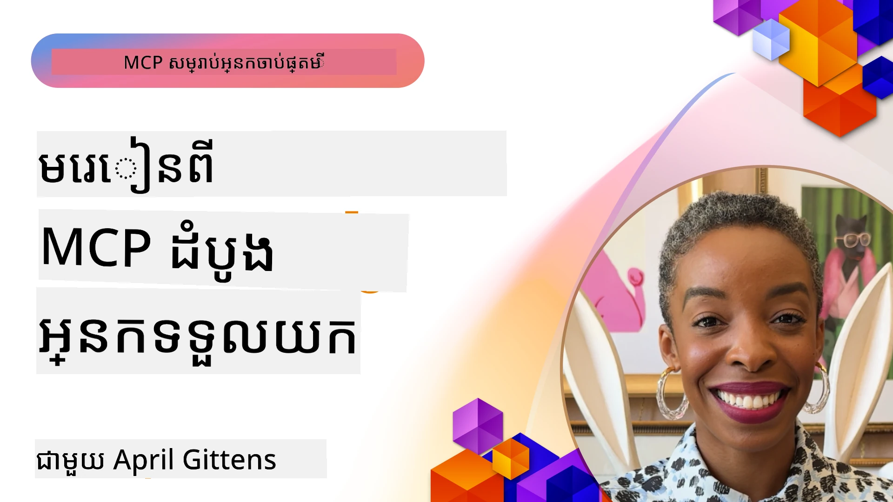

# 🌟 មេរៀនពីអ្នកប្រើប្រាស់ដំបូង

[](https://youtu.be/jds7dSmNptE)

_(ចុចរូបភាពខាងលើដើម្បីមើលវីដេអូស្តីពីមេរៀននេះ)_

## 🎯 មេរៀននេះគ្របដណ្តប់អ្វីខ្លះ

មេរៀននេះស៊ើបអង្កេតពីរបៀបដែលអង្គការពិតប្រាកដនិងអ្នកអភិវឌ្ឍន៍កំពុងប្រើប្រាស់ Model Context Protocol (MCP) ដើម្បីដោះស្រាយបញ្ហាពិតប្រាកដ និងជំរុញការច្នៃប្រឌិត។ តាមរយៈករណីសិក្សាដ៏លំអិត គម្រោងប្រាណដៃ និងគំរូជាក់ស្តែង អ្នកនឹងបានរកឃើញថា MCP អនុញ្ញាតឱ្យមានការតភ្ជាប់ AI ដែលមានសុវត្ថិភាព អាចពង្រីកបាន ដែលភ្ជាប់គំរូភាសា ឧបករណ៍ និងទិន្នន័យសហគ្រាសជាមួយគ្នា។

### 📚 មើល MCP ក្នុងសកម្មភាព

ចង់ឃើញគោលការណ៍ទាំងនេះត្រូវបានអនុវត្តទៅឧបករណ៍ដែលត្រៀមប្រើប្រាស់ក្នុងការផលិតដែរឬទេ? សូមមើល [**ម៉ាស៊ីនម៉ិក្រូសូហ្វ MCP ជំនួយ ១០ ដែលកំពុងបម្លែងប្រសិទ្ធភាពអ្នកអភិវឌ្ឍន៍**](microsoft-mcp-servers.md) ដែលបង្ហាញពីម៉ាស៊ីន MCP ពិតប្រាកដរបស់ម៉ិក្រូសូហ្វ ដែលអ្នកអាចប្រើបានថ្ងៃនេះ។

## ការពិពណ៌នា

មេរៀននេះស្វែងយល់ពីរបៀបដែលអ្នកប្រើប្រាស់ដំបូងបានប្រើ Model Context Protocol (MCP) ដើម្បីដោះស្រាយបញ្ហាផ្នែកពិភពផ្សេងៗ និងជំរុញការច្នៃប្រឌិតនៅក្នុងគ្រប់ឧស្សាហកម្ម។ តាមរយៈករណីសិក្សាដ៏លំអិត និងគម្រោងប្រាណដៃ អ្នកនឹងឃើញថា MCP អាចធ្វើឱ្យការតភ្ជាប់ AI មានស្តង់ដារ មានសុវត្ថិភាព និងអាចពង្រីកបាន—ភ្ជាប់គំរូភាសាធំៗ ឧបករណ៍ និងទិន្នន័យសហគ្រាសក្នុងបណ្តាញឯកភាពមួយ។ អ្នកនឹងទទួលបានបទពិសោធន៍ជាក់ស្តែងក្នុងការរចនា និងសាងសង់ដំណោះស្រាយមូលដ្ឋាន MCP, រៀនពីគម្លាតអនុវត្តន៍ដែលបានបញ្ជាក់ និងរកឃើញនិទានល្អបំផុតសម្រាប់ដាក់ MCP ក្នុងបរិស្ថានផលិតកម្ម។ មេរៀនក៏បង្ហាញពីល្បឿនថ្មីៗ ទិសដៅអនាគត និងធនធានមូលដ្ឋានប្រាក់ធនធានសម្រាប់ជួយអ្នកនៅកំពូលបច្ចេកវិទ្យា MCP និងបរិស្ថានរីកចម្រើនរបស់វា។

## គោលបំណងសិក្សា

- វិភាគអនុវត្ត MCP នៅពិភពគ្រប់ឧស្សាហកម្ម
- រចនា និងសាងសង់កម្មវិធីពេញលេញមូលដ្ឋាន MCP
- ស្វែងយល់ពីល្បឿនថ្មី និងទិសដៅអនាគតក្នុងបច្ចេកវិទ្យា MCP
- អនុវត្តន៍បទពិសោធន៍ល្អបំផុតនៅក្នុងស្ថានការណ៍អភិវឌ្ឍន៍ពិតប្រាកដ

## អនុវត្ត MCP ពិភពពិតប្រាកដ

### ករណីសិក្សា 1: ស្វ័យប្រវត្តិការគាំទ្រអតិថិជនសហគ្រាស

ក្រុមហ៊ុនពហុជាតិនិយមមួយបានអនុវត្តដំណោះស្រាយមូលដ្ឋាន MCP ដើម្បីចងភ្ជាប់អន្តរកម្ម AI នៅក្នុងប្រព័ន្ធគាំទ្រអតិថិជនរបស់ពួកគេ។ វាអនុញ្ញាតឱ្យពួកគេ៖

- បង្កើតចំណុចប្រទាក់តែមួយសម្រាប់អ្នកផ្គត់ផ្គង់ LLM ច្រើន
- រក្សាការគ្រប់គ្រងបង្ហាញការជូនដំណឹងសរុបគ្នាតាមដេប៉ាតឺម៉ង់
- អនុវត្តន៍ត្រួតពិនិត្យសុវត្ថិភាព និងការអនុវត្តតាមបណ្ដាប្រការមានទំរង់ខ្ជាប់ខ្ជួន
- ប្ដូរគំរូ AI មួយទៅមួយបានយ៉ាងងាយស្រួលជាស្រេចដោយផ្អែកលើតម្រូវការពិសេស

**អនុវត្តបច្ចេកទេស:**

```python
# ការ​អនុវត្ត​ម៉ាស៊ីន​មេ MCP របស់ Python សម្រាប់ការគាំទ្រអតិថិជន
import logging
import asyncio
from modelcontextprotocol import create_server, ServerConfig
from modelcontextprotocol.server import MCPServer
from modelcontextprotocol.transports import create_http_transport
from modelcontextprotocol.resources import ResourceDefinition
from modelcontextprotocol.prompts import PromptDefinition
from modelcontextprotocol.tool import ToolDefinition

# កំណត់​កំណត់ហេតុ
logging.basicConfig(level=logging.INFO)

async def main():
    # បង្កើត​ការ​កំណត់​ម៉ាស៊ីន​មេ
    config = ServerConfig(
        name="Enterprise Customer Support Server",
        version="1.0.0",
        description="MCP server for handling customer support inquiries"
    )
    
    # ចាប់ផ្តើម​ម៉ាស៊ីន​មេ MCP
    server = create_server(config)
    
    # ចុះបញ្ជីធនធានមូលដ្ឋានចំណេះដឹង
    server.resources.register(
        ResourceDefinition(
            name="customer_kb",
            description="Customer knowledge base documentation"
        ),
        lambda params: get_customer_documentation(params)
    )
    
    # ចុះបញ្ជីសោមបង្ហាញ
    server.prompts.register(
        PromptDefinition(
            name="support_template",
            description="Templates for customer support responses"
        ),
        lambda params: get_support_templates(params)
    )
    
    # ចុះបញ្ជីឧបករណ៍គាំទ្រ
    server.tools.register(
        ToolDefinition(
            name="ticketing",
            description="Create and update support tickets"
        ),
        handle_ticketing_operations
    )
    
    # ចាប់ផ្តើម​ម៉ាស៊ីន​មេជាមួយការដឹកជញ្ជួញ HTTP
    transport = create_http_transport(port=8080)
    await server.run(transport)

if __name__ == "__main__":
    asyncio.run(main())
```
  
**លទ្ធផល៖** កាត់បន្ថយតម្លៃគំរូបាន ៣០%, បង្កើនកម្រិតការឆ្លើយតបរួម ៤៥%, និងបង្កើនការអនុវត្តតាមបណ្ដាប្រការណ៍ទូទាំងប្រតិបត្តិការពិភពលោក។

### ករណីសិក្សា 2: ជំនួយវេជ្ជបណ្ឌិតវាយតម្លៃជំងឺ

អ្នកផ្គត់ផ្គង់សុខាភិបាលមួយបានអភិវឌ្ឍរចនាសម្ព័ន្ធ MCP ដើម្បីភ្ជាប់គំរូ AI វេជ្ជសាស្ត្រពិសេសច្រើនខណៈការពារទិន្នន័យអ្នកជំងឺឱ្យមានសុវត្ថិភាព៖

- ប្ដូរម៉ូឌែលវេជ្ជសាស្ត្រធម្មតាទៅជាពិសេសបានដោយរលូន
- ត្រួតពិនិត្យភាពឯកជនយ៉ាងតឹងរឹង និងមានតាមដានកំណត់ហេតុ
- ភ្ជាប់ជាមួយប្រព័ន្ធកំណត់ត្រាសុខាភិបាលអេឡិចត្រូនិច (EHR) មានស្រាប់
- រក្សាការត្រួតពិនិត្យបង្ហាញការជូនដំណឹងដោយឯកទេសសម្រាប់ពាក្យវេជ្ជសាស្ត្រ

**អនុវត្តបច្ចេកទេស:**

```csharp
// C# MCP host application implementation in healthcare application
using Microsoft.Extensions.DependencyInjection;
using ModelContextProtocol.SDK.Client;
using ModelContextProtocol.SDK.Security;
using ModelContextProtocol.SDK.Resources;

public class DiagnosticAssistant
{
    private readonly MCPHostClient _mcpClient;
    private readonly PatientContext _patientContext;
    
    public DiagnosticAssistant(PatientContext patientContext)
    {
        _patientContext = patientContext;
        
        // Configure MCP client with healthcare-specific settings
        var clientOptions = new ClientOptions
        {
            Name = "Healthcare Diagnostic Assistant",
            Version = "1.0.0",
            Security = new SecurityOptions
            {
                Encryption = EncryptionLevel.Medical,
                AuditEnabled = true
            }
        };
        
        _mcpClient = new MCPHostClientBuilder()
            .WithOptions(clientOptions)
            .WithTransport(new HttpTransport("https://healthcare-mcp.example.org"))
            .WithAuthentication(new HIPAACompliantAuthProvider())
            .Build();
    }
    
    public async Task<DiagnosticSuggestion> GetDiagnosticAssistance(
        string symptoms, string patientHistory)
    {
        // Create request with appropriate resources and tool access
        var resourceRequest = new ResourceRequest
        {
            Name = "patient_records",
            Parameters = new Dictionary<string, object>
            {
                ["patientId"] = _patientContext.PatientId,
                ["requestingProvider"] = _patientContext.ProviderId
            }
        };
        
        // Request diagnostic assistance using appropriate prompt
        var response = await _mcpClient.SendPromptRequestAsync(
            promptName: "diagnostic_assistance",
            parameters: new Dictionary<string, object>
            {
                ["symptoms"] = symptoms,
                patientHistory = patientHistory,
                relevantGuidelines = _patientContext.GetRelevantGuidelines()
            });
            
        return DiagnosticSuggestion.FromMCPResponse(response);
    }
}
```
  
**លទ្ធផល៖** ពូកែការផ្ដល់ការណែនាំវាយតម្លៃជំងឺសម្រាប់គ្រូពេទ្យ ខណៈរក្សាភាពផ្ទៃក្នុងត្រឹមត្រូវលើ HIPAA ដោយពេញលេញ និងកាត់បន្ថយការប្ដូរការងារភ្ជាប់ផ្សេងៗ។

### ករណីសិក្សា 3: វិភាគហានិភ័យសេវាហិរញ្ញវត្ថុន

ស្ថាប័នហិរញ្ញវត្ថុមួយបានអនុវត្ត MCP ដើម្បីស្តង់ដារដំណើរការវិភាគហានិភ័យរបស់ពួកគេទោលលើដេប៉ាតឺម៉ង់ផ្សេងៗ៖

- បង្កើតចំណុចប្រទាក់តែមួយសម្រាប់គំរូហានិភ័យឥណទាន ការស្វែងរកក្រឆៃ និងហានិភ័យវិនិយោគ
- អនុវត្តត្រួតពិនិត្យការចូលប្រើយ៉ាងតឹងរឹង និងវើឃឺនគំរូ
- ធានាការតាមដានបានច្បាស់លាស់សម្រាប់សំណើ AI ទាំងអស់
- រក្សាទ្រង់ទ្រាយទិន្នន័យឱ្យជាប់ស្តង់ដារតាមប្រព័ន្ធចម្រុះៗ

**អនុវត្តបច្ចេកទេស:**

```java
// ម៉ាស៊ីនមេ Java MCP សម្រាប់ការវាយតម្លៃហានិភ័យហិរញ្ញវត្ថុ
import org.mcp.server.*;
import org.mcp.security.*;

public class FinancialRiskMCPServer {
    public static void main(String[] args) {
        // បង្កើតម៉ាស៊ីនមេ MCP ជាមួយមុខងារច្បាប់ហិរញ្ញវត្ថុ
        MCPServer server = new MCPServerBuilder()
            .withModelProviders(
                new ModelProvider("risk-assessment-primary", new AzureOpenAIProvider()),
                new ModelProvider("risk-assessment-audit", new LocalLlamaProvider())
            )
            .withPromptTemplateDirectory("./compliance/templates")
            .withAccessControls(new SOCCompliantAccessControl())
            .withDataEncryption(EncryptionStandard.FINANCIAL_GRADE)
            .withVersionControl(true)
            .withAuditLogging(new DatabaseAuditLogger())
            .build();
            
        server.addRequestValidator(new FinancialDataValidator());
        server.addResponseFilter(new PII_RedactionFilter());
        
        server.start(9000);
        
        System.out.println("Financial Risk MCP Server running on port 9000");
    }
}
```
  
**លទ្ធផល៖** បង្កើនការអនុវត្តតាមបណ្ដាប្រការស្បៀងយ៉ាងតឹងរឹង, ម៉ូដែលដាក់បញ្ចូលរហ័សជាងមុន ៤០%, និងកម្រិតវិភាគហានិភ័យមានភាពរឹងមាំនៅតាមដេប៉ាតឺម៉ង់។

### ករណីសិក្សា 4: ម៉ាស៊ីនម៉ិក្រូសូហ្វ Playwright MCP សម្រាប់ស្វ័យប្រវត្តិកម្មរុករកវេប

ម៉ិក្រូសូហ្វបានអភិវឌ្ឍ [ម៉ាស៊ីន Playwright MCP](https://github.com/microsoft/playwright-mcp) ដើម្បីអនុញ្ញាតស្វ័យប្រវត្តិកម្មរុករកវេបក្នុងសុវត្ថិភាព និងមានស្តង់ដារ តាមរយៈ Model Context Protocol។ ម៉ាស៊ីនផលិតកម្មនេះអនុញ្ញាតឱ្យភ្នាក់ងារនិង LLM អន្តរកម្មជាមួយកម្មវិធីរុករកវេបដោយគ្រប់គ្រងបាន និងមានការaudit បាននឹងអាចពង្រីកបាន— ធ្វើឱ្យមានករណីប្រើប្រាស់ដូចជា ការប្រត់តេស្តវេបស្វ័យប្រវត្តិសាស្ត្រ, ការទាញយកទិន្នន័យ និងដំណើរការពេញលេញ។ 

> **🎯 ឧបករណ៍ត្រៀមប្រើប្រាស់ក្នុងផលិតកម្ម**  
>  
> ករណីសិក្សានេះបង្ហាញពីម៉ាស៊ីន MCP ពិតប្រាកដដែលអ្នកអាចប្រើបានថ្ងៃនេះ! សូមបន្តអានពី Playwright MCP Server និងម៉ាស៊ីន MCP Microsoft 9 ផ្សេងទៀតនៅក្នុង [**ការណែនាំម៉ាស៊ីន MCP Microsoft**](microsoft-mcp-servers.md#8--playwright-mcp-server)។

**លក្ខណៈសំខាន់ៗ៖**  
- បង្ហាញសមត្ថភាពស្វ័យប្រវត្តិកម្មរុករក (ការប្រែបំលែង ទំរង់បញ្ចូល ការចាប់រូបភាព…) ជាឧបករណ៍ MCP  
- អនុវត្តន៍ត្រួតពិនិត្យការចូលប្រើយ៉ាងតឹងរឹង និងបិទឡើងសំណង់ដើម្បីទប់ស្កាត់សកម្មភាពមិនបានអនុញ្ញាត  
- ផ្តល់កំណត់ហេតុ audit ក្នុងលម្អិតសម្រាប់អន្តរកម្មរុករកទាំងអស់  
- គាំទ្រការភ្ជាប់ជាមួយ Azure OpenAI និងអ្នកផ្គត់ផ្គង់ LLM ផ្សេងៗសម្រាប់ស្វ័យប្រវត្តិកម្មដោយភ្នាក់ងារ  
- ជំរុញកំណត់ GitHub Copilot's Coding Agent ជាមួយសមត្ថភាពរុករកវេប

**អនុវត្តបច្ចេកទេស:**

```typescript
// ពី TypeScript: ការចុះបញ្ជីឧបករណ៍រៀបចំកម្មវិធីរុករក Playwright នៅក្នុងម៉ាស៊ីនបម្រើ MCP
import { createServer, ToolDefinition } from 'modelcontextprotocol';
import { launch } from 'playwright';

const server = createServer({
  name: 'Playwright MCP Server',
  version: '1.0.0',
  description: 'MCP server for browser automation using Playwright'
});

// ចុះបញ្ជីឧបករណ៍សម្រាប់នាវីហ្គេតទៅ URL និងចាប់រូបភាពអេក្រង់
server.tools.register(
  new ToolDefinition({
    name: 'navigate_and_screenshot',
    description: 'Navigate to a URL and capture a screenshot',
    parameters: {
      url: { type: 'string', description: 'The URL to visit' }
    }
  }),
  async ({ url }) => {
    const browser = await launch();
    const page = await browser.newPage();
    await page.goto(url);
    const screenshot = await page.screenshot();
    await browser.close();
    return { screenshot };
  }
);

// ចាប់ផ្តើមម៉ាស៊ីនបម្រើ MCP
server.listen(8080);
```
  
**លទ្ធផល៖**  
- អនុញ្ញាតស្វ័យប្រវត្តិកម្មរុករកកូដសំរាប់ភ្នាក់ងារ AI និង LLM  
- កាត់បន្ថយការខិតខំសាកល្បងដោយដៃ និងបង្កើនការគ្របដណ្តប់ក្នុងការតេស្តកម្មវិធីវេប  
- ផ្តល់ស៊្រង់សម្រាប់ការតភ្ជាប់ឧបករណ៍គ្រប់គ្រងរុករកនៅក្នុងបរិស្ថានសហគ្រាស  
- ជំរុញសមត្ថភាពរុករកវេបរបស់ GitHub Copilot  

**យោង៖**  

- [Playwright MCP Server GitHub Repository](https://github.com/microsoft/playwright-mcp)  
- [Microsoft AI and Automation Solutions](https://azure.microsoft.com/en-us/products/ai-services/)  

### ករណីសិក្សា 5: Azure MCP – សេវាកម្ម Model Context Protocol វេទិកាសហគ្រាស

ម៉ាស៊ីន Azure MCP Server ([https://aka.ms/azmcp](https://aka.ms/azmcp)) គឺជាការអនុវត្តដែលមានការគ្រប់គ្រងលំដាប់សហគ្រាសរបស់ Model Context Protocol ដែលបំពាក់មុខងារសមត្ថភាពម៉ាស៊ីន MCP ដែលអាចពង្រីក បាន ដំណើរការដោយសុវត្ថិភាព និងសំបួសតាមច្បាប់ជាសេវាឃ្លោដ។ Azure MCP អនុញ្ញាតឱ្យអង្គការបោះពុម្ព ផ្ដល់ដំណើរការ និងភ្ជាប់ម៉ាស៊ីន MCP ជាមួយ Azure AI ទិន្នន័យ និងសេវាកម្មសុវត្ថិភាព ដើម្បីកាត់បន្ថយការប្រើប្រាស់ថាមពល និងជំរុញការទទួលយក AI រហ័ស។

> **🎯 ឧបករណ៍ត្រៀមប្រើប្រាស់ក្នុងផលិតកម្ម**  
>  
> នេះជាម៉ាស៊ីន MCP ពិតប្រាកដដែលអ្នកអាចប្រើបានថ្ងៃនេះ! សូមបន្តអានអំពី Azure AI Foundry MCP Server ក្នុង [**ការណែនាំម៉ាស៊ីន MCP Microsoft**](microsoft-mcp-servers.md)។

- មានការគ្រប់គ្រងម៉ាស៊ីន MCP ពេញលេញជាមួយស្ទេឡាចម្រុះ ការត្រួតពិនិត្យ និងសុវត្ថិភាព  
- ភ្ជាប់ដើមជាមួយ Azure OpenAI, Azure AI Search និងសេវាកម្ម Azure ផ្សេងៗ  
- ការផ្ទៀងផ្ទាត់សំរាប់សហគ្រាសតាម Microsoft Entra ID  
- គាំទ្រឧបករណ៍ផ្ទាល់ខ្លួន ត័ម្រៀបតម្រឹម និងអ្នកភ្ជាប់ធនធាន  
- ត្រូវបានត្រួតពិនិត្យសុវត្ថិភាព និងគោរពតាមបណ្ដាប្រការណ៍សម្រាប់សហគ្រាស

**អនុវត្តបច្ចេកទេស:**

```yaml
# Example: Azure MCP server deployment configuration (YAML)
apiVersion: mcp.microsoft.com/v1
kind: McpServer
metadata:
  name: enterprise-mcp-server
spec:
  modelProviders:
    - name: azure-openai
      type: AzureOpenAI
      endpoint: https://<your-openai-resource>.openai.azure.com/
      apiKeySecret: <your-azure-keyvault-secret>
  tools:
    - name: document_search
      type: AzureAISearch
      endpoint: https://<your-search-resource>.search.windows.net/
      apiKeySecret: <your-azure-keyvault-secret>
  authentication:
    type: EntraID
    tenantId: <your-tenant-id>
  monitoring:
    enabled: true
    logAnalyticsWorkspace: <your-log-analytics-id>
```
  
**លទ្ធផល៖**  
- កាត់បន្ថយពេលវេលារកម្លាំងក្នុងគម្រោង AI សហគ្រាសដោយផ្ដល់ម៉ាស៊ីន MCP ដែលប្រើប្រាស់បានភ្លាមៗ  
- ងាយស្រួលក្នុងការភ្ជាប់គ្រឿង LLMs ឧបករណ៍ និងប្រភពទិន្នន័យសហគ្រាស  
- បង្កើនសុវត្ថិភាព ភាពអាចមើលឃើញ និងប្រសិទ្ធភាពប្រតិបត្តិការ MCP  
- រីកចម្រើនគុណភាពកូដជាមួយក្បួនល្អៗនៃ Azure SDK និងលំនាំបច្ចុប្បន្ននៃការផ្ទៀងផ្ទាត់  

**យោង៖**  
- [Azure MCP Documentation](https://aka.ms/azmcp)  
- [Azure MCP Server GitHub Repository](https://github.com/Azure/azure-mcp)  
- [Azure AI Services](https://azure.microsoft.com/en-us/products/ai-services/)  
- [Microsoft MCP Center](https://mcp.azure.com)  

## ករណីសិក្សា 6៖ NLWeb  
MCP (Model Context Protocol) គឺជាព្រឹត្តិបត្រមួយដែលកំពុងកើនឡើងសម្រាប់ Chatbots និងជំនួយការបញ្ញាសិប្បនិម្មិតដើម្បីអន្តរកម្មជាមួយឧបករណ៍។ គ្រប់មុខងារ NLWeb ក៏ជាម៉ាស៊ីន MCP មួយ ផ្តល់ជំនួសវិធីសាស្ត្រមួយគ្រប់គ្រងមុខងារ ask ដែលប្រើសម្រាប់សួរលើគេហទំព័រមួយជាភាសាធម្មជាតិ។ ការឆ្លើយតបដែលបានត្រូវប្រើ schema.org ដែលជាភាសាវិចារណាលេខសម្រាប់ពិពណ៌នាទិន្នន័យវេប។ យ៉ាងសាមញ្ញ MCP គឺដូចជា NLWeb សម្រាប់ Http ទៅ HTML។ NLWeb បញ្ចូលគ្នាពីព្រឹត្តិបត្រ schema.org និងកូដគំរូ ដើម្បីជួយវេបសាយបង្កើតចំណុចចេញទទួលសំណួរបានយ៉ាងរហ័ស ពោលគឺមានអត្ថប្រយោជន៍សម្រាប់មនុស្សតាមរយៈអ៊ីនធឺរហ្វេសជជែក ហើយមេប៉ែលតាមប្រព័ន្ធភ្នាក់ងារជាមួយនឹងការអន្តរកម្មថ្នាក់ក្រាប។

មានពីរផ្នែកចម្បងក្នុង NLWeb។  
- ព្រឹត្តិបត្រ មួយដែលអាចចាប់ផ្តើមបានយ៉ាងសាមញ្ញសម្រាប់ជជែកជាមួយវេបសាយជាភាសាធម្មជាតិ និងទ្រង់ទ្រាយដែលប្រើ json និង schema.org សម្រាប់ចម្លើយតប។ ចូរមើលឯកសារសម្រាប់ REST API សម្រាប់ព័ត៌មានលម្អិតបន្ថែម។  
- អនុវត្តដែលងាយស្រួលនៃ(១) ដែលប្រើ markup ដែលមានស្រាប់សម្រាប់វេបសាយដែលអាចរួមបញ្ចូលជាបញ្ជីធាតុ (ផលិតផល, មាន់ចៀន, ទេសភាព, ការពិចារណា។) រួមជាមួយវីហ្គិត UI អ្នកប្រើបង្ហាញអាចផ្តល់អ៊ីនធឺរហ្វេសជជែកជាមួយមាតិកានៅលើវេបបានយ៉ាងងាយស្រួល។ សូមមើលឯកសារប្រវត្តិនៃសំណួរជជែកសម្រាប់ព័ត៌មានបន្ថែមពីរបៀបដំណើរការ។

**យោង៖**  
- [Azure MCP Documentation](https://aka.ms/azmcp)  
- [NLWeb](https://github.com/microsoft/NlWeb)  

### ករណីសិក្សា 7: Azure AI Foundry MCP Server – ការភ្ជាប់ភ្នាក់ងារចម្លើយ AI ជាសហគ្រាស

ម៉ាស៊ីន Azure AI Foundry MCP បង្ហាញពីរបៀបដែល MCP អាចប្រើសម្រាប់គ្រប់គ្រងនិងចងក្រងភ្នាក់ងារចម្លើយ AI និងដំណើរការជាមួយគ្នាក្នុងបរិស្ថានសហគ្រាស។ តាមរយៈការភ្ជាប់ MCP ជាមួយ Azure AI Foundry អង្គការអាចស្តង់ដារអន្តរកម្មភ្នាក់ងារ ប្រើប្រាស់ការគ្រប់គ្រងដំណើរការរបស់ Foundry និងធានាសុវត្ថិភាព ការលូតលាស់បាន និងការដាក់នៅក្នុងផលិតកម្មដោយមានច្បាប់ស្រេច។

> **🎯 ឧបករណ៍ត្រៀមប្រើប្រាស់ក្នុងផលិតកម្ម**  
>  
> នេះជាម៉ាស៊ីន MCP ពិតប្រាកដដែលអ្នកអាចប្រើបានថ្ងៃនេះ! សូមបន្តអានអំពី Azure AI Foundry MCP Server ក្នុង [**ការណែនាំម៉ាស៊ីន MCP Microsoft**](microsoft-mcp-servers.md#9--azure-ai-foundry-mcp-server)។

**លក្ខណៈសំខាន់ៗ:**  
- ចូលដំណើរការ AI ក្នុងសេវាកម្ម Azure ដូចជា កាតាឡុកគំរូ និងការគ្រប់គ្រងដាក់ផ្ដល់ដំណើរការ  
- ការរៀបចំចំណេះដឹងជាមួយ Azure AI Search សម្រាប់កម្មវិធី RAG  
- ឧបករណ៍វាយតម្លៃសមត្ថភាពគំរូ AI និងធានាគុណភាព  
- ភ្ជាប់ជាមួយ Azure AI Foundry Catalog និង Labs សម្រាប់គំរូស្រាវជ្រាវដ៏ទំនើប  
- ការគ្រប់គ្រងភ្នាក់ងារ និងសមត្ថភាពវាយតម្លៃសម្រាប់ស្ថានការណ៍ផលិតកម្ម

**លទ្ធផល៖**  
- គំរូសាកល្បងរហ័ស និងត្រួតពិនិត្យដំណើរការភ្នាក់ងារ AI បានយ៉ាងរឹងមាំ  
- ភ្ជាប់នៅជាមួយសេវាកម្ម Azure AI សម្រាប់ស្ថានការណ៍ជំរុញ  
- ចំណុចប្រទាក់ឯកភាពក្នុងការសាងសង់ ផ្ដល់ដំណើរការ និងត្រួតពិនិត្យបំពង់ភ្នាក់ងារ  
- ការកែលម្អសុវត្ថិភាព សាប់សំរាប់ការអនុវត្ត និងប្រតិបត្តិការសំរាប់អង្គការ  
- ជំរុញការទទួលយក AI ពេលដែលមានការគ្រប់គ្រងលើដំណើរការភ្នាក់ងារដ៏ស្មុគស្មាញ

**យោង៖**  
- [Azure AI Foundry MCP Server GitHub Repository](https://github.com/azure-ai-foundry/mcp-foundry)  
- [Integrating Azure AI Agents with MCP (Microsoft Foundry Blog)](https://devblogs.microsoft.com/foundry/integrating-azure-ai-agents-mcp/)  

### ករណីសិក្សា 8: Foundry MCP Playground – ការប្រលង និងការសាកល្បង

Foundry MCP Playground ផ្តល់បរិយាកាសស្រេចប្រើសម្រាប់សាកល្បងម៉ាស៊ីន MCP និងការភ្ជាប់ Azure AI Foundry។ អ្នកអភិវឌ្ឍន៍អាចសាងសង់គំរូសាកល្បង សាកល្បង និងវាយតម្លៃគំរូ AI និងដំណើរការភ្នាក់ងារបានយ៉ាងរហ័ស ដោយប្រើធនធានពី Azure AI Foundry Catalog និង Labs។ កន្លែងនេះបានបង្រួមការតំឡើងផ្ដល់គំរូគម្រោង និងគាំទ្រការអភិវឌ្ឍរួមគ្នា ដែលធ្វើឱ្យងាយក្នុងការស្វែងរកបទពិសោធន៍ល្អ និងស្ថានការណ៍ថ្មីៗដោយប្រើប្រាស់ថាមពលតិច។ វាមានប្រយោជន៍ជាពិសេសសម្រាប់ក្រុមដែលចង់បញ្ជាក់គំនិត ចែករំលែកបទពិសោធន៍ និងជំរុញការសិក្សាដោយមិនចាំបាច់មានហេដ្ឋារចនាបថស្មុគស្មាញ។ ការកាត់បន្ថយការរុះរើចូលចិត្តនេះជួយលើកកម្ពស់ការច្នៃប្រឌិត និងការរួមចំណែកសហគមន៍ក្នុងទីផ្សារម៉ាស៊ីន MCP និង Azure AI Foundry។

**យោង៖**

- [Foundry MCP Playground GitHub Repository](https://github.com/azure-ai-foundry/foundry-mcp-playground)

### ករណីសិក្សា 9: ម៉ាស៊ីន Microsoft Learn Docs MCP – ការចូលប្រើឯកសារដោយ AI

ម៉ាស៊ីន Microsoft Learn Docs MCP គឺជាសេវាកម្មផ្ទុកតាមពពក ដែលផ្តល់ឱ្យជំនួយការដោយ AI ចូលប្រើឯកសារផ្លូវការម៉ាស៊ីន Microsoft សម្រាប់ការស្វែងរកតាម Model Context Protocol។ ម៉ាស៊ីនផលិតកម្មនេះភ្ជាប់ទៅក្នុងប្រព័ន្ធ Microsoft Learn ដែលពេញលេញ ហើយអាចស្វែងរកនៅលើប្រភពព័ត៌មាន Microsoft ផ្លូវការទាំងអស់ជាសំឡេង។

> **🎯 ឧបករណ៍ត្រៀមប្រើប្រាស់ក្នុងផលិតកម្ម**  
>  
> នេះជាម៉ាស៊ីន MCP ពិតប្រាកដដែលអ្នកអាចប្រើបានថ្ងៃនេះ! សូមបន្តអានពី Microsoft Learn Docs MCP Server ក្នុង [**ការណែនាំម៉ាស៊ីន MCP Microsoft**](microsoft-mcp-servers.md#1--microsoft-learn-docs-mcp-server)។

**លក្ខណៈសំខាន់ៗ៖**  
- ចូលប្រើឯកសារផ្លូវការម៉ាស៊ីន Microsoft ជាក់ស្តែង និងឯកសារ Azure, Microsoft 365  
- មានសមត្ថភាពស្វែងរកសាមញ្ញយ៉ាងល្អដែលយល់ពីបរិយាកាស និងបំណង  
- មានព័ត៌មានបច្ចុប្បន្នបន្តិចបន្តួចដូចជាការចេញផ្សាយមួយៗក្នុង Microsoft Learn  
- គ្របដណ្តប់ទូលំទូលាយលើ Microsoft Learn, ឯកសារ Azure និង Microsoft 365  
- ផ្ទុកតទៅលើ ១០ ចំណុចព័ត៌មានមានគុណភាពខ្ពស់ជាមួយចំណងជើងអត្ថបទ និងតំណភ្ជាប់ URL

**ហេតុអ្វីបានជាវាជាចំណុចសំខាន់៖**  
- ដោះស្រាយបញ្ហាជំនាញ AI ដែលចាស់ចំងល់សម្រាប់បច្ចេកវិទ្យាម៉ាស៊ីន Microsoft  
- ធានាឱ្យ AI មានការចូលប្រើមុខងារ .NET, C#, Azure និង Microsoft 365 ថ្មីៗ  
- ផ្តល់ព័ត៌មានគន្លងផ្លូវផ្លូវការ ជាធារាសាស្រ្តដ៏ត្រឹមត្រូវសម្រាប់បង្កើតកូដមួយ  
- គឺចាំបាច់សម្រាប់អ្នកអភិវឌ្ឍន៍ធ្វើការជាមួយបច្ចេកវិទ្យាម៉ាស៊ីន Microsoft ដែលកំពុងតែបំផ្លាញប្រពៃណី

**លទ្ធផល៖**  
- កែលម្អភាពត្រឹមត្រូវនៃកូដដែលបានបង្កើតដោយ AI សម្រាប់បច្ចេកវិទ្យាម៉ាស៊ីន Microsoft  
- កាត់បន្ថយពេលវេលាក្នុងការស្វែងរកឯកសារបច្ចុប្បន្ន និងបទពិសោធន៍ល្អៗ  
- បង្កើនប្រសិទ្ធភាពអ្នកអភិវឌ្ឍន៍ជាមួយការទាញយកឯកសារតាមបរិយាកាស  
- ភ្ជាប់រលូនជាមួយលំនាំអភិវឌ្ឍដោយគ្មានការចាកចេញពី IDE  

**យោង៖**  
- [Microsoft Learn Docs MCP Server GitHub Repository](https://github.com/MicrosoftDocs/mcp)  
- [Microsoft Learn Documentation](https://learn.microsoft.com/)

## គម្រោងប្រាណដៃ

### គម្រោង 1: សាងសង់ម៉ាស៊ីន MCP រាប់អ្នកផ្គត់ផ្គង់

**គោលបំណង៖** បង្កើតម៉ាស៊ីន MCP ដែលអាចផ្ញើសំណើទៅអ្នកផ្គត់ផ្គង់គំរូ AI ច្រើនដោយផ្អែកលើលក្ខណៈពិសេសខុសៗគ្នា។

**តម្រូវការ៖**

- គាំទ្រអ្នកផ្គត់ផ្គង់គំរូយ៉ាងហោចណាស់បីរូប (ឧ. OpenAI, Anthropic, គំរូក្នុងស្រុក)  
- អនុវត្តប្រព័ន្ធបញ្ជូនសំណើដោយផ្អែកលើទិន្នន័យរាយការណ៍សំណើ  
- បង្កើតប្រព័ន្ធកំណត់រចនាសម្ព័ន្ធសម្រាប់គ្រប់គ្រងលិខិតសម្គាល់អ្នកផ្គត់ផ្គង់  
- បន្ថែមការផ្ទុកទិន្នន័យបណ្ដោះអាសន្នដើម្បីបង្កើនប្រសិទ្ធិភាព និងកាត់បន្ថយថ្លៃដើម  
- សាងសង់ផ្ទាំងគ្រប់គ្រងសាមញ្ញសម្រាប់ត្រួតពិនិត្យការប្រើប្រាស់  

**ជំហានអនុវត្ត៖**

1. រៀបចំខ្នាតដីល MCP សំរាប់ម៉ាស៊ីន  
2. អនុវត្តអាដាប់ធ័រ​អ្នកផ្គត់ផ្គង់សម្រាប់សេវាកម្មគំរូ AI នីមួយៗ  
3. បង្កើតយុទ្ធសាស្ត្របញ្ជូនសំណើដោយផ្អែកលើលក្ខណៈពិសេស  
4. បន្ថែមប្រព័ន្ធផ្ទុកបណ្ដោះអាសន្នសម្រាប់សំណើជាញឹកញាប់  
5. អភិវឌ្ឍផ្ទាំងត្រួតពិនិត្យ  
6. សាកល្បងជាមួយគំរូសំណើផ្សេងៗ  

**បច្ចេកវិទ្យា៖** ជ្រើសរើសពី Python (.NET / Java / Python អាស្រ័យលើចំណូលចិត្ត) Redis សម្រាប់ផ្ទុកបណ្ដោះអាសន្ន និងស៊្រង់វេបសាមញ្ញសម្រាប់ផ្ទាំងត្រួតពិនិត្យ។

### គម្រោង 2: ប្រព័ន្ធគ្រប់គ្រងបង្ហាញការជូនដំណឹងសហគ្រាស
**គោលបំណងៈ** អភិវឌ្ឍប្រព័ន្ធផ្អែកលើ MCP សម្រាប់គ្រប់គ្រង កំណែ និងដាក់ចេញទម្រង់បញ្ចូលសំណួរជាទូទៅនៅក្នុងអង្គការមួយ។

**តម្រូវការៈ**

- បង្កើតឃ្លាំងមួយផ្តោតកណ្តាលសម្រាប់ទម្រង់បញ្ចូលសំណួរ
- អនុវត្តការគ្រប់គ្រងកំណែ និងនីតិវិធីអនុម័ត
- បង្កើតសមត្ថភាពសាកល្បងទម្រង់ជាមួយនឹងទិន្នន័យគំរូ
- អភិវឌ្ឍការគ្រប់គ្រងការចូលដោយផ្អែកលើតួនាទី
- បង្កើត API សម្រាប់ព័ត៌មានទទួលបាន និងដាក់ចេញទម្រង់

**ជំហានអនុវត្តៈ**

1. រចនាសំណុំគំរូទិន្នន័យសម្រាប់ផ្ទុកទម្រង់
2. បង្កើត API មូលដ្ធានសម្រាប់ប្រតិបត្តិការបង្កើត អាន អាប់ដេត លុបទម្រង់
3. អនុវត្តប្រព័ន្ធកំណែ
4. បង្កើតនីតិវិធីអនុម័ត
5. អភិវឌ្ឍគ្រោងការសាកល្បង
6. បង្កើតចំណុចប្រទាក់វេបសាមញ្ញសម្រាប់ការគ្រប់គ្រង
7. ធ្វើការរួមបញ្ចូលជាមួយម៉ាស៊ីនបម្រើ MCP

**បច្ចេកវិទ្យាៈ** ជ្រើសរើសខ្នាតបណ្តាញផ្នែកខាងក្រោយ SQL ឬ NoSQL និងបណ្តាញផ្នែកមុខសម្រាប់ចំណុចប្រទាក់គ្រប់គ្រង។

### គម្រោងទី 3៖ វេទិកាបង្កើតមាតិកាប្រព័ន្ធផ្អែកលើ MCP

**គោលបំណងៈ** បង្កើតវេទិកាបង្កើតមាតិកាដែលប្រើប្រាស់ MCP ដើម្បីផ្តល់លទ្ធផលដូចគ្នានៅលើមាតិកាប្រភេទផ្សេងៗ។

**តម្រូវការៈ**

- គាំទ្រទម្រង់មាតិកាច្រើន (អត្ថបទប្លក់ បណ្តាញសង្គម ចម្លងផ្សព្វផ្សាយ)
- អនុវត្តការបង្កើតដោយផ្អែកលើទម្រង់ជាមួយជម្រើសប្តូរតាមចំនូលចិត្ត
- បង្កើតប្រព័ន្ធពិនិត្យមាតិកា និងប្រតិកម្ម
- តាមដានមាត្រដ្ឋានលទ្ធផលមាតិកា
- គាំទ្រកំណែ និងការស្តារឡើងវិញមាតិកា

**ជំហានអនុវត្តៈ**

1. តំឡើងហេដ្ឋារចនាសម្ព័ន្ធអតិថិជន MCP
2. បង្កើតទម្រង់សម្រាប់មាតិកាប្រភេទផ្សេងៗ
3. បង្កើតដំណើរការបង្កើតមាតិកា
4. អនុវត្តប្រព័ន្ធពិនិត្យ
5. អភិវឌ្ឍប្រព័ន្ធតាមដានមាត្រដ្ឋាន
6. បង្កើតចំណុចប្រទាក់អ្នកប្រើសម្រាប់គ្រប់គ្រងទម្រង់ និងបង្កើតមាតិកា

**បច្ចេកវិទ្យាៈ** ភាសាកម្មវិធី, បណ្តាញគេហទំព័រ, និងប្រព័ន្ធទិន្នន័យដែលអ្នកចូលចិត្ត។

## ទិសដៅអនាគតសម្រាប់បច្ចេកវិទ្យា MCP

### និន្នាការរីកចម្រើន

1. **MCP ពហុរូបមន្ត**
   - ការពង្រីក MCP ដើម្បីសម្រួលប្រតិបត្តិការជាមួយម៉ូដែលរូបភាព សម្លេង និងវីដេអូ
   - អភិវឌ្ឍសមត្ថភាពហែកប្រភេទមូលដ្ឋានផ្សេងគ្នាជាបន្តបន្ទាប់
   - ទម្រង់បញ្ចូលសំណួរតាមស្តង់ដារសម្រាប់រូបមន្តខុសគ្នា

2. **ហេដ្ឋារចនាសម្ព័ន្ធ MCP ឯករាជ្យបែបហ្វេដែរ**
   - បណ្ដាញ MCP ចែករំលែកធនធានគ្នាតាមអង្គការ
   - ព្រឹត្តិការណ៍ស្តង់ដារសម្រាប់ការចែកម៉ូដែលដោយសុវត្ថិភាព
   - បច្ចេកវិទ្យាគណនាជាការការពារសម្ងាត់

3. **ផ្សារភ្ជាប់ MCP**
   - ប្រព័ន្ធអេកូសិស្ទំសម្រាប់ចែករំលែក និងមានប្រាក់ចំណេញពីទម្រង់ MCP និងប្លក់អង្គផ្សេងៗ
   - ដំណើរការធានាគុណភាព និងវិញ្ញាបនប័ត្រ
   - រួមបញ្ចូលជាមួយផ្សារម៉ូដែល

4. **MCP សម្រាប់ Edge Computing**
   - ការប្តូរទម្រង់ MCP សម្រាប់ឧបករណ៍គ្រប់គ្រងធនធានមានកំណត់
   - ព្រឹត្តិការណ៍ស្តង់ដារអង់ពង់ទាប
   - ការអនុវត្ត MCP ផ្ទាល់ខ្លួនសម្រាប់ប្រព័ន្ធ IoT

5. **ស្ថាបត្យកម្មគ្រប់គ្រងច្បាប់**
   - អភិវឌ្ឍការពង្រីក MCP សម្រាប់ការអនុវត្តតាមច្បាប់
   - ច្រកត្រួតពិនិត្យ និងអាំងតែរ៉េហ្សួរវិទ្ធសាស្ត្រមានស្តង់ដារ
   - រួមបញ្ចូលជាមួយស្ថាបត្យកម្មគ្រប់គ្រង AI អចិន្រ្តៃយ៍

### អភិវឌ្ឍន៍ MCP ពី Microsoft

Microsoft និង Azure បានអភិវឌ្ឍឃ្លាំងមេធ្វើការលើកទឹកចិត្តសម្រាប់អ្នកអភិវឌ្ឍដើម្បីអនុវត្ត MCP នៅក្នុងសេណារីយ៉ូផ្សេងៗ៖

#### អង្គការលោក Microsoft

1. [playwright-mcp](https://github.com/microsoft/playwright-mcp) - ម៉ាស៊ីនបម្រើ MCP Playwright សម្រាប់ស្វ័យប្រវត្តិកម្មកម្មវិធីរុករក និងសាកល្បង
2. [files-mcp-server](https://github.com/microsoft/files-mcp-server) - អនុវត្តម៉ាស៊ីនបម្រើ MCP មួយសម្រាប់ OneDrive សម្រាប់សាកល្បងក្នុងដែនបណ្តោះអាសន្នក្នុងសហគមន៍
3. [NLWeb](https://github.com/microsoft/NlWeb) - NLWeb ជាកំណែកម្មវិធីបើកប្រភព និងឧបករណ៍បើកប្រភពសម្រាប់កំណត់ឋានៈគ្រឹះសម្រាប់ AI Web

#### អង្គការលោក Azure-Samples

1. [mcp](https://github.com/Azure-Samples/mcp) - តំណភ្ជាប់ទៅឧទាហរណ៍ ឧបករណ៍ និងធនធានសម្រាប់បង្កើត និងរួមបញ្ចូលម៉ាស៊ីនបម្រើ MCP លើ Azure ជាមួយភាសាច្រើន
2. [mcp-auth-servers](https://github.com/Azure-Samples/mcp-auth-servers) - ម៉ាស៊ីនបម្រើ MCP យោងដែលបង្ហាញការផ្ទៀងផ្ទាត់តាមការបញ្ជាក់ត្រឹមត្រូវ Model Context Protocol បច្ចុប្បន្ន
3. [remote-mcp-functions](https://github.com/Azure-Samples/remote-mcp-functions) - ទំព័រចុះឈ្មោះសម្រាប់អនុវត្តម៉ាស៊ីនបម្រើ MCP ពីចម្ងាយនៅ Azure Functions ជាមួយតំណភ្ជាប់ទៅឃ្លាំងភាសារបស់តំបន់
4. [remote-mcp-functions-python](https://github.com/Azure-Samples/remote-mcp-functions-python) - គំរូប៊្លុកឆាតឆាប់សម្រាប់បង្កើត និងដាក់ចេញម៉ាស៊ីនបម្រើ MCP ពីចម្ងាយប្រើ Azure Functions ជាមួយ Python
5. [remote-mcp-functions-dotnet](https://github.com/Azure-Samples/remote-mcp-functions-dotnet) - គំរូប៊្លុកឆាតឆាប់សម្រាប់បង្កើត និងដាក់ចេញម៉ាស៊ីនបម្រើ MCP ពីចម្ងាយប្រើ Azure Functions ជាមួយ .NET/C#
6. [remote-mcp-functions-typescript](https://github.com/Azure-Samples/remote-mcp-functions-typescript) - គំរូប៊្លុកឆាតឆាប់សម្រាប់បង្កើត និងដាក់ចេញម៉ាស៊ីនបម្រើ MCP ពីចម្ងាយប្រើ Azure Functions ជាមួយ TypeScript
7. [remote-mcp-apim-functions-python](https://github.com/Azure-Samples/remote-mcp-apim-functions-python) - ការគ្រប់គ្រង API Azure ជាភ្នាក់ងារច្រក AI ទៅម៉ាស៊ីនបម្រើ MCP ពីចម្ងាយប្រើ Python
8. [AI-Gateway](https://github.com/Azure-Samples/AI-Gateway) - ការប្រលង AI ក្រោម APIM ស្របស្រួលចូលនឹងមុខងារ MCP រួមបញ្ចូលជាមួយ Azure OpenAI និង AI Foundry

ឃ្លាំងទាំងនេះផ្តល់នូវការអនុវត្តក្រោយស្នូល គំរូ និងធនធានសម្រាប់ការងារជាមួយ Model Context Protocol ក្នុងភាសាកម្មវិធី និងសេវាកម្ម Azure ផ្សេងៗ។ ពួកវាគ្របដណ្តប់ពីការអនុវត្តម៉ាស៊ីនបម្រើធម្មតាទៅការផ្ទៀងផ្ទាត់ អភិវឌ្ឍខ្មែររ​ផ្សេងៗ ហើយរួមបញ្ចូលជាមួយសំណុំវិធីអាជីវកម្ម។

#### ឃ្លាំងធនធាន MCP

[ឃ្លាំងធនធាន MCP](https://github.com/microsoft/mcp/tree/main/Resources) នៅក្នុងឃ្លាំងផ្លូវការ Microsoft MCP ផ្តល់នូវសំណុំធនធានគំរូបានជ្រើសរើស រួមមានទម្រង់បញ្ចូលសំណួរ វត្ថុធាតុឧបករណ៍ និងការកំណត់ធនធានសម្រាប់ជួយការងារជាមួយម៉ាស៊ីនបម្រើ Model Context Protocol។ ឃ្លាំងនេះត្រូវបានរចនាសម្រាប់ជួយអ្នកអភិវឌ្ឍឲ្យចាប់ផ្តើមយ៉ាងលឿនជាមួយ MCP ដោយផ្តល់ឧបករណ៍ស្ដារវិញនិងគំរូអនុវត្តល្អបំផុតសម្រាប់៖

- **ទម្រង់បញ្ចូលសំណួរ៖** ទម្រង់បញ្ចូលសំណួរដែលស្រាប់សម្រាប់ភារកិច្ច AI និងសេណារីយ៉ိုទូទៅដែលអាចកែប្រែបានសម្រាប់ការអនុវត្តម៉ាស៊ីនបម្រើ MCP របស់អ្នក។
- **ការកំណត់ឧបករណ៍៖** គំរូសម្រាប់កោណស៊ីម៉ង់ឧបករណ៍ និងម៉េតាដាតា ដើម្បីស្តង់ដារសម្របសម្រួលនិងការអំពាវនាវឧបករណ៍ក្នុងម៉ាស៊ីនបម្រើ MCP ផ្សេងៗ។
- **ឧទាហរណ៍ធនធាន៖** កំណត់ឧទាហរណ៍ធនធានសម្រាប់ភ្ជាប់ទៅមូលដ្ឋានទិន្នន័យ API និងសេវាកម្មខាងក្រៅក្នុងបរិបទ MCP។
- **ការអនុវត្តយោង៖** គំរូមួយចំនួនដែលបង្ហាញពីរបៀបរៀបចំធនធាន បញ្ចូលសំណួរ និងឧបករណ៍ក្នុងគម្រោង MCP ពិត។

ធនធានទាំងនេះជួយដល់ការអភិវឌ្ឍលឿនជាងមុន ផ្តល់ស្តង់ដារបរិយាកាស និងធានាបាននូវវិធីសាស្ត្រល្អបំផុតនៅពេលបង្កើត និងដាក់ MCP ប្រើប្រាស់។

#### ឃ្លាំងធនធាន MCP

- [ធនធាន MCP (ទម្រង់បញ្ចូលសំណួរ គ្រឿងចក្រ និងការកំណត់ធនធាន)](https://github.com/microsoft/mcp/tree/main/Resources)

### ឱកាសស្រាវជ្រាវ

- បច្ចេកវិទ្យាសំរបសំរួលសំណួរយ៉ាងមានប្រសិទ្ធិភាពនៅក្នុងស៊ុម MCP
- ម៉ូដែលសុវត្ថិភាពសម្រាប់ការដាក់ MCP នៅលើហិរញ្ញវត្ថុច្រើន
- វាស់តម្លៃសមត្ថភាពអនុវត្ត MCP ផ្សេងៗគ្នា
- វិធីសាស្ត្រត្រួតពិនិត្យផ្លូវការសម្រាប់ម៉ាស៊ីនបម្រើ MCP

## សេចក្ដីសន្និដ្ឋាន

Model Context Protocol (MCP) កំពុងបម្លែងអនាគតនៃការរួមបញ្ចូល AI ដោយមានស្តង់ដា សុវត្ថិភាព និងអាចប្រើប្រាស់រួមគ្នាបាននៅពាណិជ្ជកម្ម។ តាមរយៈករណីសិក្សា និងគម្រោងអនុវត្តក្នុងមេរៀននេះ អ្នកបានឃើញថា អ្នកទទួលយកដំបូងៗ រួមទាំង Microsoft និង Azure កំពុងប្រើ MCP ដើម្បីដោះស្រាយបញ្ហាពិភពពិត ជំរុញការទទួលយក AI និងធានាការប្រកបដោយច្បាប់ សុវត្ថិភាព និង២០លទ្ធភាពក្នុងការពង្រីក។ របៀបមើលដែលអាចធ្វើបានពហុផ្នែករបស់ MCP អនុញ្ញាតឲ្យអង្គការភ្ជាប់ម៉ូដែលភាសាធំៗ ឧបករណ៍ និងទិន្នន័យសហគ្រាសក្នុងបរិបទត្រួតពិនិត្យបាន។ ខណៈ MCP បន្តបង្កើតឡើង ការរួមចំណែកជាមួយសហគមន៍ ការស្រាវជ្រាវធនធានបើកចំហ និងការអនុវត្តវិធីសាស្ត្រល្អនឹងជួយសំណង់ដំណោះស្រាយ AI ដែលរឹងមាំ ស្រា និងមានការត្រៀមខ្លួនចំពោះអនាគត។

## ធនធានបន្ថែម

- [ឃ្លាំង MCP Foundry GitHub](https://github.com/azure-ai-foundry/mcp-foundry)
- [Foundry MCP Playground](https://github.com/azure-ai-foundry/foundry-mcp-playground)
- [ការរួមបញ្ចូលភ្នាក់ងារ Azure AI ជាមួយ MCP (ប្លុក Microsoft Foundry)](https://devblogs.microsoft.com/foundry/integrating-azure-ai-agents-mcp/)
- [ឃ្លាំង MCP GitHub (Microsoft)](https://github.com/microsoft/mcp)
- [ឃ្លាំងធនធាន MCP (ទម្រង់បញ្ចូលសំណួរ គ្រឿងចក្រ និងការកំណត់ធនធាន)](https://github.com/microsoft/mcp/tree/main/Resources)
- [សហគមន៍ និងឯកសារ MCP](https://modelcontextprotocol.io/introduction)
- [ការបញ្ជាក់ MCP (2025-11-25)](https://spec.modelcontextprotocol.io/specification/2025-11-25/)
- [ឯកសារ Azure MCP](https://aka.ms/azmcp)
- [OWASP MCP Top 10](https://microsoft.github.io/mcp-azure-security-guide/mcp/) - វិធីសាស្ត្រសុវត្ថិភាពល្អបំផុត
- [Playwright MCP Server GitHub Repository](https://github.com/microsoft/playwright-mcp)
- [Files MCP Server (OneDrive)](https://github.com/microsoft/files-mcp-server)
- [Azure-Samples MCP](https://github.com/Azure-Samples/mcp)
- [MCP Auth Servers (Azure-Samples)](https://github.com/Azure-Samples/mcp-auth-servers)
- [Remote MCP Functions (Azure-Samples)](https://github.com/Azure-Samples/remote-mcp-functions)
- [Remote MCP Functions Python (Azure-Samples)](https://github.com/Azure-Samples/remote-mcp-functions-python)
- [Remote MCP Functions .NET (Azure-Samples)](https://github.com/Azure-Samples/remote-mcp-functions-dotnet)
- [Remote MCP Functions TypeScript (Azure-Samples)](https://github.com/Azure-Samples/remote-mcp-functions-typescript)
- [Remote MCP APIM Functions Python (Azure-Samples)](https://github.com/Azure-Samples/remote-mcp-apim-functions-python)
- [AI-Gateway (Azure-Samples)](https://github.com/Azure-Samples/AI-Gateway)
- [ដំណោះស្រាយ Microsoft AI និងស្វ័យប្រវត្តិកម្ម](https://azure.microsoft.com/en-us/products/ai-services/)

## ការហ្វឹកហ្វឺន

1. វិភាគករណីសិក្សាមួយ ហើយស្នើរបៀបអនុវត្តជំនួសជាជម្រើសម្ដងទៀត។
2. ជ្រើសរើសគំនិតគម្រោងមួយ និងបង្កើតលក្ខណៈបច្ចេកទេសលម្អិត។
3. ស្រាវជ្រាវឧស្សាហកម្មមួយដែលមិនមានក្នុងករណីសិក្សា ហើយរៀបរាប់របៀបដែល MCP អាចដោះស្រាយបញ្ហាពិសេសរបស់វា។
4. ស្វែងយល់ពីទិសដៅអនាគតមួយ ហើយបង្កើតគំនិតសម្រាប់ការពង្រីក MCP ថ្មីដើម្បីគាំទ្រទិសដៅនោះ។

## តើត្រូវធ្វើយ៉ាងដូចម្ដេចបន្ទាប់ពីនេះ

ស្វែងរកបន្ថែម៖ [ម៉ាស៊ីនបម្រើ Microsoft MCP](./microsoft-mcp-servers.md)

បន្តទៅ៖ [ផ្នែកទី 8៖ វិធីសាស្ត្រល្អបំផុត](../08-BestPractices/README.md)

---

<!-- CO-OP TRANSLATOR DISCLAIMER START -->
**ការបញ្ចាក់**៖  
ឯកសារនេះត្រូវបានបកប្រែដោយប្រើសេវាបកប្រែ AI [Co-op Translator](https://github.com/Azure/co-op-translator)។ ទោះយើងខ្ញុំខិតខំប្រឹងប្រែងបំផុតសម្រាប់ភាពត្រឹមត្រូវ ក៏សូមដឹងថាការបកប្រែដោយស្វ័យប្រវត្តិក៏អាចមានកំហុស ឬភាពមិនត្រឹមត្រូវបានផងដែរ។ ឯកសារដើមក្នុងភាសាជាតិរបស់វាគួរត្រូវបានចាប់យកជាធនាគារដ៏មានអំណាច។ សម្រាប់ព័ត៌មានសំខាន់ណាស់ ការបកប្រែដោយមនុស្សជំនាញត្រូវបានផ្តល់អនុសាសន៍។ យើងខ្ញុំមិនទទួលខុសត្រូវចំពោះការយល់ច្រឡំ ឬការជឿនលឿនខុសពីការប្រើប្រាស់ការបកប្រែនេះឡើយ។
<!-- CO-OP TRANSLATOR DISCLAIMER END -->