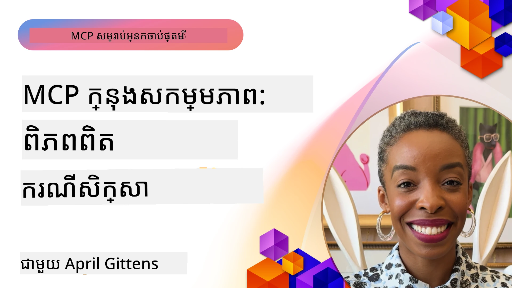

# MCP ក្នុងសកម្មភាព៖ ករណីសិក្សាពិតប្រាកដ

_(ចុចរូបភាពខាងលើដើម្បីមើលវីដេអូបង្រៀននេះ)_

Model Context Protocol (MCP) កំពុងបំលែងរបៀបដែលកម្មវិធី AI មានអន្តរកម្មជាមួយទិន្នន័យ ឧបករណ៍ និងសេវាកម្ម។ ផ្នែកនេះបង្ហាញករណីសិក្សាពិតប្រាកដ ដែលបង្ហាញពីការមានប្រយោជន៍ជាក់ស្តែងនៃ MCP ក្នុងស្ថានការណ៍អាជីវកម្មផ្សេងៗ។

## សង្ខេប

ផ្នែកនេះបង្ហាញឧទាហរណ៍ជាក់ស្តែងនៃការអនុវត្ត MCP ដោយផ្តោតលើរបៀបដែលអង្គភាពខុសៗគ្នាកំពុងយកប្រយោជន៍ពីប្រព័ន្ធនេះ ដើម្បីដោះស្រាយបញ្ហាអាជីវកម្មដ៏ស្មុគស្មាញ។ ការសិក្សាករណីទាំងនេះនឹងផ្តល់ឱ្យអ្នកនូវទស្សនវិជ្ជានៃចំណុចចំរូងចំរាស អាចបន្ថែមវិមាត្រ និងអត្ថប្រយោជន៍ជាក់ស្តែងនៃ MCP នៅក្នុងស្ថានការណ៍ពិតប្រាកដ។

## គោលបំណងហ្វឹកហាត់​សំខាន់ៗ

តាមរយៈការសិក្សាករណីទាំងនេះ អ្នកនឹង៖

- យល់ដឹងពីរបៀបប្រើប្រាស់ MCP ដើម្បីដោះស្រាយបញ្ហាអាជីវកម្មជាក់លាក់
- រៀនអំពីលំនាំបញ្ចូល និងវិធីសាស្ត្រពហុស្ថាបត្យកម្មផ្សេងៗ
- ស្គាល់អំពីការអនុវត្តល្អបំផុតសម្រាប់ MCP នៅបរិយាកាសអង្គភាព
- ទទួលបានព្រះរៀនពីបញ្ហា និងដំណោះស្រាយក្នុងការអនុវត្តពិតប្រាកដ
- ស្វែងរកឱកាសក្នុងការប្រើប្រាស់លំនាំដូចគ្នានៅគម្រោងរបស់អ្នកផ្ទាល់

## ករណីសិក្សាប្រសូត

### 1. [Azure AI Travel Agents – ការអនុវត្តយោង](./travelagentsample.md)

ករណីសិក្សានេះពិចារណាអំពីដំណោះស្រាយយោងលម្អិតរបស់ Microsoft ដែលបង្ហាញពីរបៀបសាងសង់កម្មវិធីផែនការធ្វើដំណើរជាមួយភ្នាក់ងារច្រើន ដែលបើកបរ​ដោយ AI ដោយប្រើ MCP, Azure OpenAI និង Azure AI Search។ គម្រោងនេះបង្ហាញ៖

- ការជួបសម្របសម្រួលភ្នាក់ងារច្រើនតាមរយៈ MCP
- ការរួមបញ្ចូលទិន្នន័យអង្គភាពជាមួយ Azure AI Search
- ស្ថាបត្យកម្មដែលមានសុវត្ថិភាព និងអាចបន្ថែមទំហំដោយប្រើសេវាកម្ម Azure
- ឧបករណ៍អាចពង្រីកបានជាមួយផ្នែក MCP ដែលអាចប្រើឡើងវិញ
- បទពិសោធន៍អ្នកប្រើអន្តរកម្មដែលបើកបរ​ដោយ Azure OpenAI

រចនាសម្ព័ន្ធ និងព័ត៌មាន​អនុវត្ត​ផ្ដល់ចំណេះដឹងមានតម្លៃអំពីការសាងសង់ប្រព័ន្ធភ្នាក់ងារច្រើនស្មុគស្មាញជាមួយ MCP ជាស្រទាប់ត្រួតពិនិត្យ។

### 2. [បحديثផ្លាស់ប្តូរធាតុ Azure DevOps ពីទិន្នន័យ YouTube](./UpdateADOItemsFromYT.md)

ករណីសិក្សានេះបង្ហាញពីការអនុវត្តពិតប្រាកដនៃ MCP សម្រាប់ស្វ័យប្រវត្តិកម្មលំហូរងារ។ វាបង្ហាញពីរបៀបប្រើឧបករណ៍ MCP ដើម្បី៖

- ចេញទិន្នន័យពីហ្វ្លាតហ្វើមអនឡាញ (YouTube)
- ផ្លាស់ប្តូរថ្ងៃធាតុការងារនៅក្នុងប្រព័ន្ធ Azure DevOps
- បង្កើតលំហូរស្វ័យប្រវត្តិដែលអាចធ្វើឡើងឡើងវិញ
- រួមបញ្ចូលទិន្នន័យពីប្រព័ន្ធខុសៗគ្នា

ឧទាហរណ៍នេះបង្ហាញថា ការអនុវត្ត MCP ដែលសាមញ្ញអាចផ្តល់ផលប្រយោជន៍ខ្ពស់ក្នុងការបង្កើនប្រសិទ្ធភាព ដោយស្វ័យប្រវត្តិកម្មកិច្ចការរដ្ឋបាលទ្បាន និងបង្កើនភាពច្បាស់លាស់នៃទិន្នន័យអន្តរប្រព័ន្ធ។

### 3. [ការទាញយកឯកសារទាន់ពេលវេលាជាមួយ MCP](./docs-mcp/README.md)

ករណីសិក្សានេះណែនាំអ្នកដោយអនុវត្តការតភ្ជាប់កម្មវិធី Python console client ទៅ MCP server ដើម្បីទាញយក និងកត់ត្រាឯកសារម៉ៃក្រូសុីហ្វដែលមានបរិបទពាក់ព័ន្ធបច្ចុប្បន្ន។ អ្នកនឹងរៀន៖

- តភ្ជាប់ទៅ MCP server ដោយប្រើ Python client និង MCP SDK ផ្លូវការ
- ប្រើ client HTTP បញ្ចេញស្ទ្រីមដើម្បីទាញទិន្នន័យកាន់តែលឿន និងទាន់ពេលវេលា
- ហៅឧបករណ៍ឯកសារលើម៉ាស៊ីន server និងកត់ត្រាចម្លើយទៅ console ដោយផ្ទាល់
- រួមបញ្ចូលឯកសារម៉ៃក្រូសុីហ្វទាន់សម័យទៅក្នុងលំហូរសកម្មភាពដោយមិនចាកចេញពី terminal

ជំពូកនេះរួមមានការប្រលងសកម្មភាពក្បាលដៃ ឧទាហរណ៍កូដធ្វើការតិចតួច និងតំណភ្ជាប់ទៅធនធានបន្ថែមសម្រាប់ការរៀនជ្រៅជាងនេះ។ ទស្សនាវដ្តីនិងកូដពេញលេញនៅក្នុងជំពូកដែលបានភ្ជាប់ ដើម្បីយល់ពីរបៀប MCP អាចបំលែងការចូលប្រើឯកសារ និងផលិតភាពអ្នកអភិវឌ្ឍក្នុងបរិយាកាស console។

### 4. [កម្មវិធីបង្កើតផែនការសិក្សាអន្តរកម្មជាមួយ MCP](./docs-mcp/README.md)

ករណីសិក្សានេះបង្ហាញរបៀបសាងសង់កម្មវិធីវែបអង់តែរកម្មជាមួយ Chainlit និង Model Context Protocol (MCP) ដើម្បីបង្កើតផែនការសិក្សាផ្ទាល់ខ្លួនសម្រាប់ប្រធានបទណាមួយ។ អ្នកប្រើអាចបញ្ជាក់មុខវិជ្ជា (ដូចជា "វិញ្ញាបនបត្រ AI-900") និងរយៈពេលសិក្សា (ឧ. ៨ សប្ដាហ៍) ហើយកម្មវិធីនឹងផ្តល់ការបំបែកមាតិកាតាមសប្ដាហ៍។ Chainlit អនុញ្ញាតិផ្ទាំងផ្ទាល់ខ្លួននៃការពិភាក្សា ប្រើប្រាស់សម្រាប់ធ្វើឱ្យបទពិសោធន៍មានភាពរំភើប និងអាចសម្របសម្រួលបាន។

- កម្មវិធីវែបអន្តរកម្មបើកបរ​ដោយ Chainlit
- អ្នកប្រើបញ្ជូនដំណឹងចូលពីប្រធានបទ និងរយៈពេល
- សំណើមាតិកាតាមសប្ដាហ៍ដោយប្រើ MCP
- ចម្លើយចូលរួម និងបត់បែនបានក្នុងផ្ទាំងជជែក

គម្រោងនេះបង្ហាញពីរបៀបរួមបញ្ចូល AI អន្តរកម្ម និង MCP ដើម្បីបង្កើតឧបករណ៍អប់រំបត់បែន និងផ្អែកលើអ្នកប្រើនៅក្នុងបរិយាកាសវែបសម័យទំនើប។

### 5. [ឯកសារជា In-Editor ជាមួយក្ដារបាញ់ MCP នៅ VS Code](./docs-mcp/README.md)

ករណីសិក្សានេះបង្ហាញរបៀបធ្វើឱ្យ Microsoft Learn Docs មាននៅក្នុងបរិយាកាស VS Code របស់អ្នកដោយប្រើ MCP server — មិនចាំបាច់បើកផ្ទាំងប្រៅស៊ែរច្រើនទៀតទេ! អ្នកនឹងឃើញរបៀប៖

- ស្វែងរក និងអានឯកសារបានភ្លាមៗនៅក្នុង VS Code ដោយប្រើផ្ទាំង MCP ឬផ្ទាំងបញ្ជា
- សម្រុកឯកសារនិងបញ្ចូលតំណទៅក្នុង README ឬឯកសារ markdown ផ្សេងៗ
- ប្រើ GitHub Copilot និង MCP ជាមួយគ្នាសម្រាប់លំហូរការងារអភិវឌ្ឍ​ដោយបើកបរ_AI
- ពិនិត្យ និងបង្កើនគុណភាពឯកសារដោយប្រើមតិយោបល់រៀងរាល់ពេល និងភាពត្រឹមត្រូវពី Microsoft
- រួមបញ្ចូល MCP ជាមួយលំហូរកា​រ GitHub សម្រាប់ការពិនិត្យឯកសារដែលបន្ត

ការអនុវត្តនេះរួមមាន៖

- ការកំណត់ malin vscode/mcp.json ងាយស្រួលសម្រាប់ការតំឡើង
- រូបភាពកំណត់ត្រារត់អន្តរកម្មនៅក្នុង editor
- យោបល់សម្រាប់ការរួមបញ្ចូល Copilot និង MCP ដើម្បីកំណត់ភាពផលិតភាពអតិបរមា

ស្ថានការណ៍នេះល្អសម្រាប់អ្នកនិពន្ធវគ្គ បុគ្គលិកឯកសារ និងអ្នកអភិវឌ្ឍ ដែលចង់ផ្តោតសកម្មភាពក្នុង editor របស់ពួកគេ ខណៈពេលធ្វើការជាមួយឯកសារ Copilot និងឧបករណ៍ត្រួតពិនិត្យ — ដែលទាំងអស់នេះបើកបរ​ដោយ MCP។

### 6. [ការបង្កើត MCP Server របស់ APIM](./apimsample.md)

ករណីសិក្សានេះផ្តល់មគ្គុទេសក៍ជំហានដោយជំហានអំពីរបៀបបង្កើត MCP server ដោយប្រើ Azure API Management (APIM)។ វាគ្របដណ្តប់៖

- ការកំណត់ MCP server ក្នុង Azure API Management
- បង្ហាញប្រតិបត្តិការ API ជាឧបករណ៍ MCP
- កំណត់គោលនយោបាយសម្រាប់ការកំណត់ដែនអត្រា និងសុវត្ថិភាព
- ធ្វើតេស្ត MCP server ដោយប្រើ Visual Studio Code និង GitHub Copilot

ឧទាហរណ៍នេះបង្ហាញពីរបៀបប្រើប្រាស់សមត្ថភាព Azure ដើម្បីបង្កើត MCP server រឹងមាំដែលអាចប្រើនៅក្នុងកម្មវិធីផ្សេងៗ ដើម្បីពង្រីកការរួមបញ្ចូលប្រព័ន្ធ AI ជាមួយ API អង្គភាព។

### 7. [GitHub MCP Registry — ជំរុញការរួមបញ្ចូលភ្នាក់ងារយ៉ាងចំណាយលឿន](https://github.com/mcp)

ករណីសិក្សានេះពិចារណាអំពីរបៀប GitHub MCP Registry ដែលបានចាប់ផ្តើមនៅខែកញ្ញា ឆ្នាំ ២០២៥ ដោះស្រាយបញ្ហាសំខាន់ក្នុងអេកូសิส្ទេម AI៖ ការរកឃើញ និងចែកចាយ MCP servers ដែលខុសៗគ្នា។

#### សង្ខេប
**MCP Registry** ដោះស្រាយបញ្ហាផ្សព្វផ្សាយផ្នែក MCP servers ដែលចែកជាច្រើនឲ្យភ្ជាប់នៅក្នុង repository និង registry ដែលកន្លងមកធ្វើឲ្យការរួមបញ្ចូលយឺត និងងាយច្រឡំ។ server ទាំងនេះអនុញ្ញាតឲ្យភ្នាក់ងារ AI មានអន្តរកម្មជាមួយប្រព័ន្ធខាងក្រៅដូចជា API, ទិន្នន័យ និងប្រភពឯកសារ។

#### បញ្ហា
អ្នកអភិវឌ្ឍន៍ដែលបង្កើតលំហូរប្រតិបត្តិការភ្នាក់ងារប្រឈមមុខនឹងបញ្ហាចម្បង៖
- ការរកឃើញ MCP servers ដែលខ្សោយនៅលើវេទិកាផ្សេងៗ
- សំណួរការតំឡើងមិនចាំបាច់ ដែលផ្សព្វផ្សាយនៅកន្លែងវេទិកា និងឯកសារ
- គ្រោះថ្នាក់សុវត្ថិភាពពីប្រភពមិនធ្វើការ ត្រួតពិនិត្យ ឬទទួលទាន
- ខ្វះស្តង់ដារសម្រាប់គុណភាព និងការចំរូងកាលភាព server

#### រចនាសម្ព័ន្ធដំណោះស្រាយ
GitHub MCP Registry ផ្តែក MCP servers ដែលទុកចិត្តបានមួយកន្លែង ជាមួយលក្ខណៈសម្បត្តិ៖
- ការតំឡើងមួយ​ចុច​តាមរយៈ VS Code សម្រាប់ការដំឡើងលឿន
- ការតំឡោចចំណាត់ថ្នាក់ដោយការចាប់ផ្តើម, សកម្មភាព និងការផ្ទៀងផ្ទាត់សហគមន៍
- ការរួមបញ្ចូលផ្ទាល់ជាមួយ GitHub Copilot និងឧបករណ៍ MCP យ៉ាងគ្រប់គ្រាន់
- ម៉ូដែលចូលរួមបើកដែលអនុញ្ញាតឲ្យសហគមន៍ និងដៃគូអាជីវកម្មរួមចំណែក

#### ផលប៉ះពាល់អាជីវកម្ម
registry បានផ្តល់ឱ្យមានការកែលម្អដែលអាចវាស់បាន៖
- ការចូលរួមលឿនសម្រាប់អ្នកអភិវឌ្ឍន៍ប្រើឧបករណ៍ដូចជា Microsoft Learn MCP Server ដែលផ្ញើឯកសារផ្លូវការផ្ទាល់ទៅភ្នាក់ងារ
- ការកែលម្អផលិតភាពតាមរយៈ server ជំនាញដូចជា `github-mcp-server` ដែលអនុញ្ញាតឲ្យមានស្វ័យប្រវត្តិកម្មភាសារឆ្លាត (បង្កើត PR, រត់ CI ថ្មី, ស្កេនកូដ)
- ទំនុកចិត្តក្នុងអេកូស៊ីស្ទេមជាមូលដ្ឋានតាមរយៈបញ្ជីរជ្រើសរើស និងស្តង់ដារការកំណត់ដែលបើកបរ

#### តម្លៃយុទ្ធសាស្រ្ត
សម្រាប់អ្នកអនុវត្តជំនាញគ្រប់គ្រងវដ្តជីវិតភ្នាក់ងារនិងលំហូរធ្វើការដែលអាចកើតឡើង វេប MCP Registry ផ្តល់៖
- សមត្ថភាពដាក់ភ្នាក់ងារជាគ្រឿងបន្លាសាចំរូងជាមួយបង្គាប់ស្តង់ដា
- ខ្សែបន្ទាត់បقييمសម្រាប់ត្រួតពិនិត្យ និងផ្ទៀងផ្ទាត់មានមាត្រដ្ឋាន
- សមត្ថភាពរួមបញ្ចូលឧបករណ៍គ្នាដោយគ្មានបញ្ហា ក្នុងវេទិកា AI ផ្សេងៗ

ករណីសិក្សានេះបង្ហាញថា MCP Registry មិនមែនគ្រាន់តែជា directory ប៉ុណ្ណោះទេ តែជាវេទិកាមូលដ្ឋានសម្រាប់ការរួមបញ្ចូលម៉ូដែលដែលអាចបន្ថែមទំហំ និងការបង្ហោះប្រព័ន្ធភ្នាក់ងារយ៉ាងចម្រាស់នៅការ​ផលិតដំណើរការ​ពិតប្រាកដ។

## សេចក្តីសន្និដ្ឋាន

ករណីសិក្សាជាចំនួនប្រាំពីរនេះបង្ហាញពីភាពចំរូងចំរាស និងអត្ថប្រយោជន៍ជាក់ស្តែងនៃ Model Context Protocol នៅក្នុងស្ថានការណ៍ពិតប្រាកដផ្សេងៗ។ ចាប់ពីប្រព័ន្ធផែនការធ្វើដំណើរអាជីវកម្មពីរ-Agent និងការគ្រប់គ្រង API អង្គភាព ដល់លំហូរឯកសារដោះស្រាយ និង GitHub MCP Registry ដែលប្រើប្រាស់បានយ៉ាងទូលំទូលាយ គំរូទាំងនេះបង្ហាញថា MCP ផ្តល់របៀបស្តង់ដា និងអាចបន្ថែមទំហំបានក្នុងការតភ្ជាប់ប្រព័ន្ធ AI ជាមួយឧបករណ៍ ទិន្នន័យ និងសេវាកម្ម ដើម្បីបង្កើតតម្លៃល្អឥតខ្ចោះ។

ករណីសិក្សាផ្ទាល់គ្នាគ្របដណ្តប់វិមាត្រចម្បងនៃការអនុវត្ត MCP៖
- **ការបញ្ចូលអង្គភាព**៖ ការគ្រប់គ្រង Azure API និងស្វ័យប្រវត្តិការ Azure DevOps
- **ការជួបសម្របសម្រួលភ្នាក់ងារច្រើន**៖ ផែនការធ្វើដំណើរជាមួយភ្នាក់ងារ AI ដែលបានត្រួតត្រា
- **ផលិតភាពអ្នកអភិវឌ្ឍន៍**៖ ការរួមបញ្ចូល VS Code និងការចូលប្រើឯកសារទាន់ពេលវេលា
- **ការអភិវឌ្ឍអេកូស៊ីស្ទេម**៖ GitHub MCP Registry ជាវេទិកាមូលដ្ឋាន
- **កម្មវិធីអប់រំនានា**៖ កម្មវិធីបង្កើតផែនការសិក្សា និងផ្ទាំងជជែកអន្តរកម្ម

តាមរយៈការសិក្សាការអនុវត្តទាំងនេះ អ្នកទទួលបានចំណេះដឹងសំខាន់ៗអំពី៖
- **លំនាំស្ថាបត្យកម្ម** សម្រាប់វិមាត្រផ្ទុយៗ និងករណីប្រើប្រាស់
- **យុទ្ធសាស្រ្តអនុវត្ត** ដែលត្រូវតែមិនបាត់បង់មុខងារ និងមានភាពងាយស្រួលជួសជុល
- **កិច្ចការសុវត្ថិភាព និងការបន្ថែមទំហំ** សម្រាប់ការបង្ហោះផលិតកម្ម
- **អនុវត្តល្អបំផុត** សម្រាប់ការអភិវឌ្ឍ MCP server និងការរួមបញ្ចូល client
- **គំនិតអេកូស៊ីស្ទេម** សម្រាប់សាងសង់ដំណោះស្រាយ AI ដែលភ្ជាប់គ្នា

ឧទាហរណ៍ទាំងនេះបង្ហាញថា MCP មិនមែនគ្រាន់តែជា សំណុំច្បាប់ទ្រឹស្តី ប៉ុណ្ណោះទេ ប៉ុន្តែជាប្រព័ន្ធដែលបានសាកល្បង និងរួមបញ្ចូលបានចាំបាច់សម្រាប់ដោះស្រាយបញ្ហាអាជីវកម្មស្មុគស្មាញ។ មិនថាអ្នកកំពុងបង្កើតឧបករណ៍ស្វ័យប្រវត្តិសាមញ្ញ ឬប្រព័ន្ធភ្នាក់ងារច្រើនស្មុគស្មាញ ការតាមដាននិងវិធីសាស្ត្រដែលបានបង្ហាញនៅទីនេះ ផ្តល់មូលដ្ឋានដ៏រឹងមាំសម្រាប់គម្រោង MCP របស់អ្នក។

## ធនធានបន្ថែម

- [ទិន្នន័យ GitHub របស់ Azure AI Travel Agents](https://github.com/Azure-Samples/azure-ai-travel-agents)
- [ឧបករណ៍ Azure DevOps MCP](https://github.com/microsoft/azure-devops-mcp)
- [ឧបករណ៍ Playwright MCP](https://github.com/microsoft/playwright-mcp)
- [Microsoft Docs MCP Server](https://github.com/MicrosoftDocs/mcp)
- [GitHub MCP Registry — ជំរុញការរួមបញ្ចូលភ្នាក់ងារយ៉ាងចំណាយលឿន](https://github.com/mcp)
- [ឧទាហរណ៍សហគមន៍ MCP](https://github.com/microsoft/mcp)

## តើអ្វីជាដំណាក់កាលបន្ទាប់

- មុន៖ [Module 8: Best Practices](../08-BestPractices/README.md)
- បន្ទាប់៖ [Module 10: Streamlining AI Workflows: Building an MCP Server with AI Toolkit](../10-StreamliningAIWorkflowsBuildingAnMCPServerWithAIToolkit/README.md)

---

<!-- CO-OP TRANSLATOR DISCLAIMER START -->
**ការបដិសេធ**៖  
ឯកសារនេះត្រូវបានបកប្រែដោយប្រើសេវាបកប្រែ AI [Co-op Translator](https://github.com/Azure/co-op-translator)។ ខណៈពេលយើងខំប្រឹងរកความត្រឹមត្រូវ សូមយល់ដឹងថាការបកប្រែដោយស្វ័យប្រវត្តិនេះអាចមានកំហុស ឬការខ្វះខាតខ្លះៗ។ ឯកសារដើមដែលសរសេរជាភាសាដើមគួរត្រូវបានគិតថាជាភាសាផ្លូវការដែលត្រូវគោរព។ សម្រាប់ព័ត៌មានសំខាន់ៗ សូមណែនាំឲ្យប្រើការបកប្រែដោយមនុស្សជំនាញ។ យើងមិនទទួលខុសត្រូវចំពោះការយល់ច្រឡំ ឬការបកប្រែមិនត្រឹមត្រូវណាមួយដែលបណ្តាលមកពីការប្រើប្រាស់ការបកប្រែនេះទេ។
<!-- CO-OP TRANSLATOR DISCLAIMER END -->