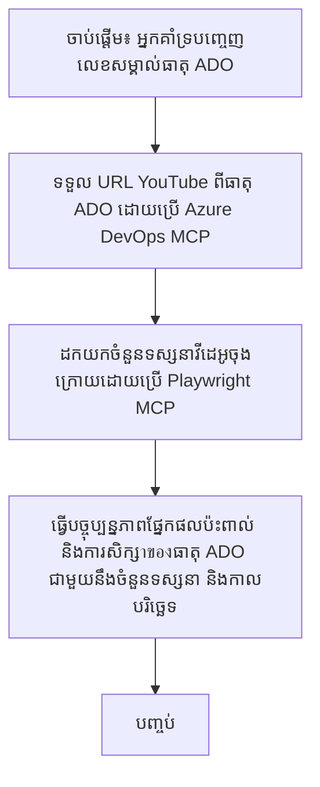

# ករណីស្រាវជ្រាវ: បច្ចុប្បន្នភាពធាតុ Azure DevOps ពីទិន្នន័យ YouTube ជាមួយ MCP

> **ការបដិសេធ:** មានឧបករណ៍ និងរបាយការណ៍តាមអ៊ីនធឺណិតដែលមានស្រាប់ ដែលអាចស្វ័យប្រវត្តិកម្មដំណើរការបច្ចុប្បន្នភាពធាតុ Azure DevOps ជាមួយទិន្នន័យពីវេទិកាដូចជា YouTube។ ស្ថានភាពខាងក្រោមត្រូវបានផ្ដល់ជាគំរូគ្រាន់ដើម្បីបង្ហាញរបៀបដែលឧបករណ៍ MCP អាចប្រើសម្រាប់ស្វ័យប្រវត្តិកម្ម និងការលាយបញ្ចូល។

## សង្ខេប

ករណីស្រាវជ្រាវនេះបង្ហាញឧទាហរណ៍មួយនៃរបៀបដែល Model Context Protocol (MCP) និងឧបករណ៍របស់វាអាចប្រើស្វ័យប្រវត្តិកម្មដំណើរការបច្ចុប្បន្នភាពធាតុការងារ Azure DevOps (ADO) ជាមួយព័ត៌មានដែលទទួលបានពីវេទិកា អ៊ីនធឺណិត ដូចជា YouTube។ ស្ថានភាពដែលបានពិពណ៌នាគឺជាគំរូតែមួយនៃសមត្ថភាពទូលំទូលាយរបស់ឧបករណ៍ទាំងនេះ ដែលអាចប្ដូរតាមតម្រូវការស្វ័យប្រវត្តិដូចគ្នា។

នៅក្នុងឧទាហរណ៍នេះ អ្នកគាំទ្រម្នាក់តាមដានសម័យផ្សាយផ្សេងៗតាមអ៊ីនធឺណិតដោយប្រើធាតុ ADO ដែលមាន URL វីដេអូ YouTube ជារបស់ខ្លួន។ ដោយការប្រើប្រាស់ឧបករណ៍ MCP អ្នកគាំទ្រអាចរក្សាថាតើធាតុ ADO ត្រូវបានបច្ចុប្បន្នភាពជាមួយមាត្រដ្ឋានវីដេអូបច្ចុប្បន្ន ដូចជា ចំនួនមើល នៅតាមរបៀបដែលអាចធ្វើឡើងជាបន្តបន្ទាប់និងដោយស្វ័យប្រវត្តិ។ វិធីសាស្ត្រនេះអាចទូទៅទៅឧទាហរណ៍ផ្សេងៗ ដែលព័ត៌មានពីហេតុផលអ៊ីនធឺណិតត្រូវបានលាយបញ្ចូលទៅក្នុង ADO ឬប្រព័ន្ធផ្សេងទៀត។

## ស្ថានភាព

អ្នកគាំទ្រម្នាក់ទទួលបន្ទុកក្នុងការតាមដានផលប៉ះពាល់នៃសម័យផ្សាយតាមអ៊ីនធឺណិតនិងការចូលរួមសហគមន៍។ សម័យនីមួយៗត្រូវបានកត់ត្រារួមជាធាតុការងារ ADO ក្នុងគម្រោង 'DevRel' ហើយធាតុការងារនោះមានវាលសម្រាប់ URL វីដេអូ YouTube។ ដើម្បីរាយការណ៍យ៉ាងត្រឹមត្រូវពីការផលិតសម័យនោះ អ្នកគាំទ្រត្រូវការបច្ចុប្បន្នភាពធាតុ ADO ជាមួយចំនួនមើលវីដេអូបច្ចុប្បន្ន និងកាលបរិច្ឆេទដែលបានយកព័ត៌មាននេះ។

## ឧបករណ៍ដែលប្រើ

- [Azure DevOps MCP](https://github.com/microsoft/azure-devops-mcp): អនុញ្ញាតឲ្យចូលប្រើកម្មវិធីនិងបច្ចុប្បន្នភាពធាតុការងារ ADO តាមរយៈ MCP។
- [Playwright MCP](https://github.com/microsoft/playwright-mcp): ស្វ័យប្រវត្តិកម្មសកម្មភាពក្នុងកម្មវិធីរកមើលដើម្បីទាញយកទិន្នន័យផ្ទាល់ពីទំព័របណ្ដាញ ដូចជា ស្ថិតិវីដេអូ YouTube។

## ដំណើរប្រតិបត្តិជាងជំហាន

1. **កំណត់សម្គាល់ធាតុ ADO**៖ ចាប់ផ្តើមជាមួយលេខសម្គាល់ធាតុការងារ ADO (ឧ. 1234) ក្នុងគម្រោង 'DevRel'។
2. **យក URL YouTube**៖ ប្រើឧបករណ៍ Azure DevOps MCP ដើម្បីយក URL YouTube ពីធាតុការងារ។
3. **ទាញចំនួនមើលវីដេអូ**៖ ប្រើឧបករណ៍ Playwright MCP ដើម្បីចូលទៅកាន់ URL YouTube ហើយទាញចំនួនមើលបច្ចុប្បន្ន។
4. **បច្ចុប្បន្នភាពធាតុ ADO**៖ សរសេរចំនួនមើលថ្មីនិងកាលបរិច្ឆេទដែលបានយក ទៅក្នុងផ្នែក 'អត្ថប្រយោជន៍ និងការស្វែងយល់' នៃធាតុការងារ ADO ដោយប្រើឧបករណ៍ Azure DevOps MCP។

## ឧទាហរណ៍សំណុំបែបបទ

```bash
- Work with the ADO Item ID: 1234
- The project is '2025-Awesome'
- Get the YouTube URL for the ADO item
- Use Playwright to get the current views from the YouTube video
- Update the ADO item with the current video views and the updated date of the information
```

## Mermaid Flowchart


## ការអនុវត្តបច្ចេកទេស

- **ការរៀបចំ MCP**៖ ដំណើរការត្រូវបានរៀបចំដោយម៉ាស៊ីនបម្រើ MCP ដែលសម្របសម្រួលការប្រើប្រាស់ឧបករណ៍ Azure DevOps MCP និង Playwright MCP ទាំងពីរ។
- **ស្វ័យប្រវត្តិកម្ម**៖ ដំណើរការអាចចាប់ផ្តើមដោយដៃ ឬកំណត់វាឱ្យដំណើរការជាប្រចាំដើម្បីរក្សាថាធាតុ ADO ត្រូវបានបច្ចុប្បន្នភាព។
- **ការពង្រីក**៖ លំនាំដូចគ្នាអាចពង្រីក ដើម្បីបញ្ចូលឧបករណ៍សម្រាប់បច្ចុប្បន្នភាពធាតุ ADO ជាមួយមាត្រដ្ឋានអ៊ីនធឺណិតផ្សេងទៀត (ឧ. ចំណូលចិត្ត ការសរសេរគំរោង) ឬពីវេទិកាផ្សេងទៀត។

## លទ្ធផល និងផលប៉ះពាល់

- **ប្រសិទ្ធភាព**៖ កាត់បន្ថយកិច្ចការដៃសម្រាប់អ្នកគាំទ្រ ដោយស្វ័យប្រវត្តិកម្មនូវការទាញយកនិងបច្ចុប្បន្នភាពមាត្រដ្ឋានវីដេអូមាន។
- **ត្រឹមត្រូវភាព**៖ ធានាថាធាតុ ADO បង្ហាញមាត្រដ្ឋានទិន្នន័យបច្ចុប្បន្នពីប្រភពអ៊ីនធឺណិត។
- **អាចធ្វើឡើងម្តងទៀត**៖ ផ្តល់ដំណើរការដែលអាចប្រើឡើងវិញសម្រាប់ស្ថានភាពដដែលៗ ដែលពាក់ព័ន្ធនឹងប្រភពទិន្នន័យ ឬមាត្រដ្ឋានផ្សេងទៀត។

## ឯកសារយោង

- [Azure DevOps MCP](https://github.com/microsoft/azure-devops-mcp)
- [Playwright MCP](https://github.com/microsoft/playwright-mcp)
- [Model Context Protocol (MCP)](https://modelcontextprotocol.io/)

## អ្វីទៅបន្ទាប់

- ត្រឡប់ទៅ៖ [ទិដ្ឋភាពទូទៅរបស់ករណីសិក្សា](./README.md)
- បន្ទាប់៖ [ការទាញយកឯកសារពេលវេលាជាក់លាក់ជាមួយ MCP](./docs-mcp/README.md)

---

<!-- CO-OP TRANSLATOR DISCLAIMER START -->
**ការបដិសេធ**៖  
ឯកសារនេះត្រូវបានបកប្រែដោយប្រើសេវាកម្មបកប្រែ AI [Co-op Translator](https://github.com/Azure/co-op-translator)។ ខណៈពេលដែលយើងខិតខំក្នុងការរក្សាភាពត្រឹមត្រូវ សូមចំណាំថាការបកប្រែដោយស្វ័យប្រវត្តិអាចមានកំហុសឬភាពមិនត្រូវគ្នា។ ឯកសារដើមជាភាសាដើមគួរត្រូវបានពិចារណាជាផ្លូវការដ៏ទៃទៀត។ សម្រាប់ព័ត៌មានសំខាន់ៗ យើងណែនាំឱ្យប្រើការបកប្រែដោយមនុស្សដែលមានវិជ្ជាជីវៈ។ យើងមិនទទួលខុសត្រូវចំពោះការយល់ច្រឡំ ឬការបកប្រែខុសប្លែកណាមួយដែលកើតឡើងពីការប្រើប្រាស់ការបកប្រែនេះឡើយ។
<!-- CO-OP TRANSLATOR DISCLAIMER END -->