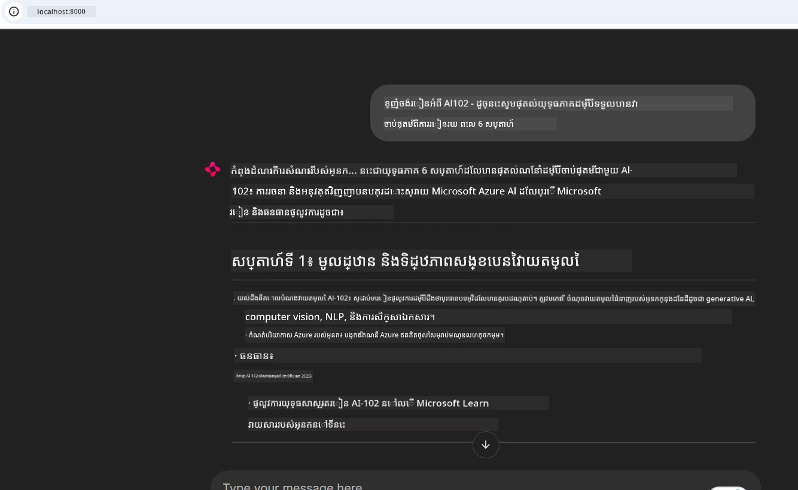
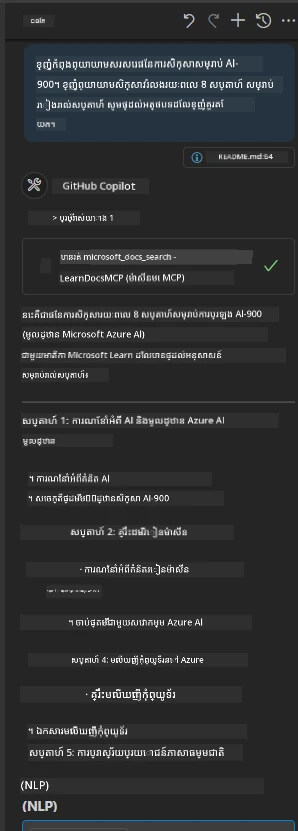

# ការសិក្សាទីបង្ហាញ៖ ការតភ្ជាប់ទៅម៉ាស៊ែរក្នុងសីីស្វីហ៍ Microsoft Learn Docs MCP ពីកម្មវិធីឆ្លាតវៃ

តើអ្នកធ្លាប់មានស្ថានភាពស្ទាក់ស្ទើរនៅចន្លោះគេហទំព័រឯកសារ Stack Overflow និងបេសកកម្មស្វែងរកជាច្រើនវីវរទេ ខណៈកំពុងព្យាយាមដោះស្រាយបញ្ហាមួយក្នុងកូដរបស់អ្នក? ប្រហែលជាអ្នករក្សាទុកម៉ូនីទ័រទីពីរមួយសម្រាប់ឯកសារ ឬអ្នកប្តូរតាមមួយជំហានរវាង IDE និងកម្មវិធីរកមើលបណ្តាញជាទៀងទាត់មែនទេ? តើមិនល្អជាងទេ ប្រសិនបើអ្នកអាចយកឯកសារចូលទៅក្នុងប្រតិបត្តិការរបស់អ្នកដោយផ្ទាល់—បញ្ចូលតាមកម្មវិធីរបស់អ្នក IDE ឬឧបករណ៍ផ្ទាល់ខ្លួនរបស់អ្នក? ក្នុងការសិក្សាទីនេះ យើងនឹងពិនិត្យរបៀបធ្វើវាតាមការតភ្ជាប់ផ្ទាល់ទៅម៉ាស៊ែរក្នុងសីីស្វីហ៍ Microsoft Learn Docs MCP ពីកម្មវិធីឆ្លាតវៃផ្ទាល់របស់អ្នក។

## ទិដ្ឋភាពទូទៅ

ការអភិវឌ្ឍទំនើបមិនត្រឹមតែសរសេរកូដទេ—វាគឺជាការស្វែងរកព័ត៌មានត្រឹមត្រូវនៅពេលវេលាត្រឹមត្រូវ។ ឯកសារនៅរាយការណ៍នៅគ្រប់កន្លែង ប៉ុន្តែវាម្ដងទេដែលនៅកន្លែងដែលអ្នកត្រូវការ៖ នៅក្នុងឧបករណ៍ និងដំណើរការរបស់អ្នក។ ដោយបញ្ចូលការទាញយកឯកសារផ្ទាល់ទៅក្នុងកម្មវិធីរបស់អ្នក អ្នកអាចជៀសវាងការប្តូរយោង វិលត្រឡប់បែបបញ្ហា និងបង្កើនផលិតភាព។ ក្នុងផ្នែកនេះ យើងនឹងបង្ហាញរបៀបបង្កើតការតភ្ជាប់ណាមួយចូលម៉ាស៊ែរក្នុងសីីស្វីហ៍ Microsoft Learn Docs MCP ដើម្បីអ្នកអាចចូលប្រើឯកសារពិសេសនិងអាចទទួលបានព័ត៌មានដោយផ្ទាល់ដោយមិនចេញពីកម្មវិធីរបស់អ្នក។

យើង​នឹងដើរតាមដំណើរការបង្កើតការតភ្ជាប់ ផ្ញើសំណើ និងដោះស្រាយចម្លើយបន្តភ្លាមៗយ៉ាងមានប្រសិទ្ធភាព។ របៀបនេះមិនត្រឹមតែបង្កើតប្រតិបត្តិការ​ងាយស្រួលប៉ុណ្ណោះទេ ប៉ុន្តែថែមទាំងបើកទ្វារជាមួយឧបករណ៍អភិវឌ្ឍន៍ឆ្លាតវៃមានប្រយោជន៍។

## គោលបំណងរៀន

ហេតុអ្វីបានជាយើងធ្វើបែបនេះ? ព្រោះបទពិសោធន៍អភិវឌ្ឍន៍ល្អបំផុតគឺយ៉ាងដែលកាត់បន្ថយដំណើរការលំបាក។ ស្រមៃឃើញពិភពមួយដែលកូដអ្នកកែសម្រួល ឆាតបូត ឬកម្មវិធីវេបអាចឆ្លើយសំណួរឯកសាររបស់អ្នកភ្លាមៗ ដោយប្រើមាតិកាបច្ចុប្បន្នពី Microsoft Learn។ នៅចុងបញ្ចប់ចំណុចនេះ អ្នកនឹងដឹងចេញពីរបៀប៖

- យល់ដឹងមូលដ្ឋាននៃការទំនាក់ទំនង MCP រវាងម៉ាស៊ែរនិងឧបករណ៍អតិថិជនសម្រាប់ឯកសារ
- អនុវត្តកម្មវិធីកុងសូល ឬវេបសម្រាប់តភ្ជាប់ទៅ Microsoft Learn Docs MCP
- ប្រើអតិថិជន HTTP បន្តភ្លាមៗសម្រាប់ទាញយកឯកសារពេលវេលាពិត
- កត់ត្រានិងបកស្រាយចម្លើយឯកសារនៅក្នុងកម្មវិធីរបស់អ្នក

អ្នកនឹងឃើញថាជំនាញទាំងនេះជួយអ្នកបង្កើតឧបករណ៍ ដែលមិនត្រឹមតែឆ្លើយតបប៉ុណ្ណោះទេ ប៉ុន្តែពិតប្រាកដជាផ្តល់មាតិកាត្រឹមត្រូវនិងអនុវត្តបរិបទ។

## ស្ថានការណ៍ទី ១ - ទាញយកឯកសារពេលវេលាពិតជាមួយ MCP

ក្នុងស្ថានការណ៍នេះ យើងនឹងបង្ហាញរបៀបតភ្ជាប់កម្មវិធីអតិថិជនទៅម៉ាស៊ែរក្នុងសីីស្វី Microsoft Learn Docs MCP ដើម្បីចូលប្រើឯកសារពេលវេលាពិត និងមានបរិបទដោយមិនចេញពីកម្មវិធីរបស់អ្នក។

ចូរផ្លាស់ប្តូរព្រឹត្តិការណ៍នេះទៅកម្មវិធីដែលភ្ជាប់ទៅម៉ាស៊ែរក្នុងសីីស្វី Microsoft Learn Docs MCP បានហៅឧបករណ៍ `microsoft_docs_search` ហើយកត់ត្រាចម្លើយបន្តទៅកុងសូល។

### ហេតុអ្វីបានជាវិធីនេះ?
ព្រោះវាគឺជាគ្រឿងដ្ឋានសំខាន់សម្រាប់ការតភ្ជាប់កម្រិតខ្ពស់ជាងនេះ— មិនថាអ្នកចង់បង្កើតឆាតបូត កម្មវិធី IDE បន្ថែម ឬផ្ទាំងគ្រប់គ្រងវេប។

អ្នកអាចរកឃើញកូដ និងណែនាំសម្រាប់ស្ថានការណ៍នេះនៅក្នុងថត [`solution`](./solution/README.md) របស់ការសិក្សាទីនេះ។ ជំហាននឹងណែនាំអ្នកដូចតទៅ៖
- ប្រើ MCP SDK ផ្លូវការនិងអតិថិជន HTTP ដែលអាចបន្តរបានសម្រាប់ការតភ្ជាប់
- ហៅឧបករណ៍ `microsoft_docs_search` ជាមួយប៉ារ៉ាម៉ែត្រស្វែងរកដើម្បីទាញយកឯកសារ
- អនុវត្តកំណត់ហេតុ និងដោះស្រាយបញ្ហាឯកសារល្អ
- បង្កើតមុខងារកុងសូលអន្តរកម្មសម្រាប់អនុញ្ញាតឱ្យអ្នកប្រើបញ្ចូលសំណួរស្វែងរកជាច្រើន

ស្ថានការណ៍នេះបង្ហាញពីរបៀប៖
- តភ្ជាប់ទៅម៉ាស៊ែរក្នុងសីីDocs MCP
- ផ្ញើសំណួរ
- វិភាគនិងបង្ហាញលទ្ធផល

នេះគឺជាគំរូការបើកដំណោះស្រាយដែលអាចមើលឃើញ៖

```
Prompt> What is Azure Key Vault?
Answer> Azure Key Vault is a cloud service for securely storing and accessing secrets. ...
```

ខាងក្រោមគឺជាគំរូដំណោះស្រាយតិចតួច។ កូដពេញលេញនិងព័ត៌មានលម្អិតមានក្នុងថតដំណោះស្រាយ។

<details>
<summary>Python</summary>

```python
import asyncio
from mcp.client.streamable_http import streamablehttp_client
from mcp import ClientSession

async def main():
    async with streamablehttp_client("https://learn.microsoft.com/api/mcp") as (read_stream, write_stream, _):
        async with ClientSession(read_stream, write_stream) as session:
            await session.initialize()
            result = await session.call_tool("microsoft_docs_search", {"query": "Azure Functions best practices"})
            print(result.content)

if __name__ == "__main__":
    asyncio.run(main())
```

- សម្រាប់ការអនុវត្តពេញលេញនិងកំណត់ហេតុ សូមមើលនៅ [`scenario1.py`](../../../../09-CaseStudy/docs-mcp/solution/python/scenario1.py)។
- សម្រាប់ការដំឡើងនិងការប្រើប្រាស់ សូមមើលឯកសារ [`README.md`](./solution/python/README.md) ក្នុងថតដូចគ្នា។
</details>


## ស្ថានការណ៍ទី ២ - កម្មវិធីធ្វើផែនការសិក្សាអន្តរកម្មតាមវេបជាមួយ MCP

ក្នុងស្ថានការណ៍នេះ អ្នកនឹងរៀនពីរបៀបបញ្ចូល Docs MCP ចូលទៅក្នុងគម្រោងអភិវឌ្ឍន៍វេប។ គោលបំណងគឺឲ្យអ្នកប្រើអាចស្វែងរកឯកសារ Microsoft Learn ពីផ្ទាំងវេបដោយផ្ទាល់ ធ្វើឲ្យឯកសារអាចចូលប្រើបានភ្លាមៗក្នុងកម្មវិធី ឬគេហទំព័ររបស់អ្នក។

អ្នកនឹងឃើញពីរបៀបធ្វើ៖
- រៀបចំកម្មវិធីវេប
- តភ្ជាប់ទៅម៉ាស៊ែរក្នុងសីី Docs MCP
- ដោះស្រាយការបញ្ចូលរបស់អ្នកប្រើ ហើយបង្ហាញលទ្ធផល

នេះគឺជាគំរូនៃការបើកដំណោះស្រាយ៖

```
User> I want to learn about AI102 - so suggest the roadmap to get it started from learn for 6 weeks

Assistant> Here’s a detailed 6-week roadmap to start your preparation for the AI-102: Designing and Implementing a Microsoft Azure AI Solution certification, using official Microsoft resources and focusing on exam skills areas:

---
## Week 1: Introduction & Fundamentals
- **Understand the Exam**: Review the [AI-102 exam skills outline](https://learn.microsoft.com/en-us/credentials/certifications/exams/ai-102/).
- **Set up Azure**: Sign up for a free Azure account if you don't have one.
- **Learning Path**: [Introduction to Azure AI services](https://learn.microsoft.com/en-us/training/modules/intro-to-azure-ai/)
- **Focus**: Get familiar with Azure portal, AI capabilities, and necessary tools.

....more weeks of the roadmap...

Let me know if you want module-specific recommendations or need more customized weekly tasks!
```

ខាងក្រោមគឺជាគំរូដំណោះស្រាយតិចតួច។ កូដពេញលេញនិងព័ត៌មានលម្អិតមានក្នុងថតដំណោះស្រាយ។



<details>
<summary>Python (Chainlit)</summary>

Chainlit គឺជាស៊ុមហ្វ្រេមវើកសម្រាប់បង្កើតកម្មវិធីឆាតអភិវឌ្ឍអេไอតាមវេប។ វាធ្វើឲ្យស្រួលក្នុងការបង្កើតឆាតបូតនិងជំនួយការអាចហៅឧបករណ៍ MCP និងបង្ហាញលទ្ធផលនៅពេលវេលាពិត។ វាសមស្របសម្រាប់សំណើរសំណង់ឆាប់រហ័ស និងផ្ទាំងអ្នកប្រើងាយស្រួល។

```python
import chainlit as cl
import requests

MCP_URL = "https://learn.microsoft.com/api/mcp"

@cl.on_message
def handle_message(message):
    query = {"question": message}
    response = requests.post(MCP_URL, json=query)
    if response.ok:
        result = response.json()
        cl.Message(content=result.get("answer", "No answer found.")).send()
    else:
        cl.Message(content="Error: " + response.text).send()
```

- សម្រាប់ការអនុវត្តពេញលេញ សូមមើលនៅ [`scenario2.py`](../../../../09-CaseStudy/docs-mcp/solution/python/scenario2.py)។
- សម្រាប់ការតំឡើងនិងរត់សូមមើលនៅ [`README.md`](./solution/python/README.md)។
</details>


## ស្ថានការណ៍ទី ៣: ឯកសារនៅក្នុងកម្មវិធីកែសម្រួល VS Code ជាមួយម៉ាស៊ែរក្នុងសីី MCP

បើអ្នកចង់ទទួលបានឯកសារ Microsoft Learn Docs ផ្ទាល់ក្នុង VS Code របស់អ្នក (ជំនួសការប្តូរតាប្វារតាមកម្មវិធីរកមើលបណ្តាញ) អ្នកអាចប្រើម៉ាស៊ែរក្នុងសីី MCP នៅក្នុងកម្មវិធីកែសម្រួល។ វាផ្ដល់ឱ្យអ្នកឲ្យ៖
- ស្វែងរក និងអានឯកសារនៅក្នុង VS Code ដោយមិនចេញពីបរិយាកាសកូដ
- យោងឯកសារនិងបញ្ចូលតំណនៅក្នុង README ឬឯកសារមុខវិជ្ជារបស់អ្នកដោយផ្ទាល់
- ប្រើ GitHub Copilot និង MCP រួមគ្នាសម្រាប់ដំណើរការឯកសារដោយ AI កាន់តែងាយស្រួល

**អ្នកនឹងឃើញរបៀប៖**
- បន្ថែមឯកសារ `.vscode/mcp.json` ត្រឹមត្រូវទៅកាន់ឫសថតការងាររបស់អ្នក (សូមមើលគំរូខាងក្រោម)
- បើកផ្ទាំង MCP ឬប្រើ command palette ក្នុង VS Code ដើម្បីស្វែងរក និងបញ្ចូលឯកសារ
- យោងទៅឯកសារដោយផ្ទាល់ក្នុងឯកសារម៉ាកដោនរបស់អ្នកនៅពេលកំពុងធ្វើការងារ
- ผสานការប្រើរំពេទរកូដ GitHub Copilot ជាមួយការដំណើរការនេះសម្រាប់ផលិតភាពកាន់តែខ្ពស់ជាងមុន

នេះជាគំរូការរៀបចំម៉ាស៊ែរក្នុងសីី MCP នៅក្នុង VS Code៖

```json
{
  "servers": {
    "LearnDocsMCP": {
      "url": "https://learn.microsoft.com/api/mcp"
    }
  }
}
```

</details>

> សម្រាប់ការបង្រៀនលម្អិតជាមួយរូបថតនិងជំហានរៀងរាល់ជំហាន សូមមើល [`README.md`](./solution/scenario3/README.md)។



របៀបនេះសមស្របសម្រាប់នរណាដែលកំពុងបង្កើតមុខវិជ្ជាតេកណូឡូជី សរសេរឯកសារ ឬអភិវឌ្ឍន៍កូដដែលត្រូវការយោងញៀនញ។ 

## ចំណុចសំខាន់ដែលត្រូវយល់

ការបញ្ចូលឯកសារផ្ទាល់ទៅក្នុងឧបករណ៍របស់អ្នកមិនមែនត្រឹមតែនឹងនាំយកភាពងាយស្រួលគ្រប់គ្រាន់ទេ—វាជាការផ្លាស់ប្តូរប្រព័ន្ធសម្រាប់ផលិតភាព។ ដោយតភ្ជាប់ទៅម៉ាស៊ែរក្នុងសីី Microsoft Learn Docs MCP ពីកម្មវិធីរបស់អ្នក អ្នកអាច៖

- ដកចេញការប្តូរបរិបទចន្លោះកូដ និងឯកសារ
- ទាញយកឯកសារថ្មីទាន់សម័យ មានបរិបទនៅពេលវេលាពិត
- បង្កើតឧបករណ៍អភិវឌ្ឍន៍ឆ្លាតវៃ បន្ថែមនិម្មិតនិងអន្តរកម្ម

ជំនាញទាំងនេះនឹងជួយអ្នកបង្កើតដំណោះស្រាយដែលមិនត្រឹមតែមានប្រសិទ្ធភាពទេ អ្វីដែលកាន់តែរីករាយក្នុងការប្រើផងដែរ។

## ឯកសារបន្ថែម

ដើម្បីបង្កើនការយល់ដឹងរបស់អ្នក សូមស្រាវជ្រាវឯកសារផ្លូវការទាំងនេះ៖

- [Microsoft Learn Docs MCP Server (GitHub)](https://github.com/MicrosoftDocs/mcp)
- [ចាប់ផ្តើមជាមួយ Azure MCP Server (mcp-python)](https://learn.microsoft.com/en-us/azure/developer/azure-mcp-server/get-started#create-the-python-app)
- [Azure MCP Server មួយមានអ្វីខ្លះ?](https://learn.microsoft.com/en-us/azure/developer/azure-mcp-server/)
- [ការណែនាំអំពី Model Context Protocol (MCP)](https://modelcontextprotocol.io/introduction)
- [បន្ថែមផ្លក់អាំងពីម៉ាស៊ែរក្នុងសីី MCP (Python)](https://learn.microsoft.com/en-us/semantic-kernel/concepts/plugins/adding-mcp-plugins)

## តើអ្វីទៅជាដំណើរបន្ទាប់

- ត្រឡប់ទៅ៖ [ទិដ្ឋភាពទូទៅនៃការសិក្សាទីបង្ហាញ](../README.md)
- បន្តទៅ៖ [មូឌុល ១០៖ រៀបចំកម្មវិធី AI រួមជាមួយ AI Toolkit](../../10-StreamliningAIWorkflowsBuildingAnMCPServerWithAIToolkit/README.md)

---

<!-- CO-OP TRANSLATOR DISCLAIMER START -->
**ការបដិសេធ**៖  
ឯកសារនេះត្រូវបានបកប្រែដោយប្រើសេវាកម្មបកប្រែ AI [Co-op Translator](https://github.com/Azure/co-op-translator)។ ខណៈពេលយើងខិតខំសំរាប់ភាពត្រឹមត្រូវ សូមយល់ដឹងថាការបកប្រែដោយស្វ័យប្រវត្តិក្នុងខ្លឹមសារអាចមានកំហុសឬភាពមិនត្រឹមត្រូវ។ ឯកសារដើមនៅក្នុងភាសារដើមគួរត្រូវបានគិតថាជាផ្ទៃដីក្តី។ សម្រាប់ព័ត៌មានសំខាន់ៗ សូមផ្ដល់អាទិភាពទៅការបកប្រែដោយមនុស្សអ្នកជំនាញ។ យើងមិនទទួលខុសត្រូវចំពោះការយល់ច្រឡំ ឬការបកប្រែមិនត្រឹមត្រូវណាមួយដែលកើតឡើងពីការប្រើប្រាស់ការបកប្រែនេះឡើយ។
<!-- CO-OP TRANSLATOR DISCLAIMER END -->