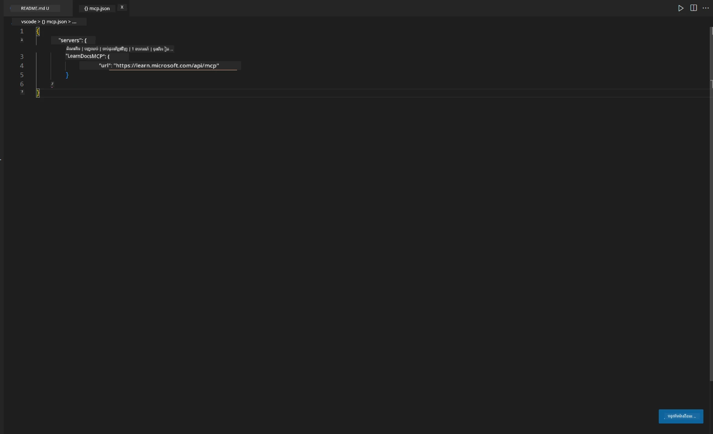
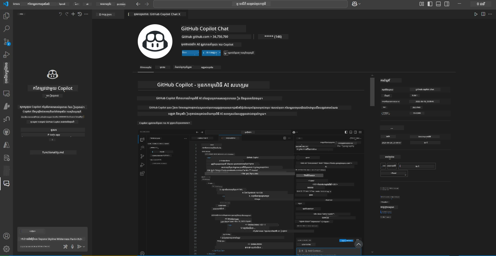
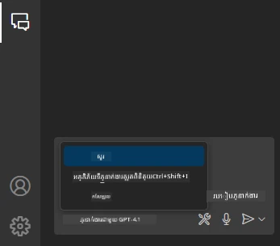
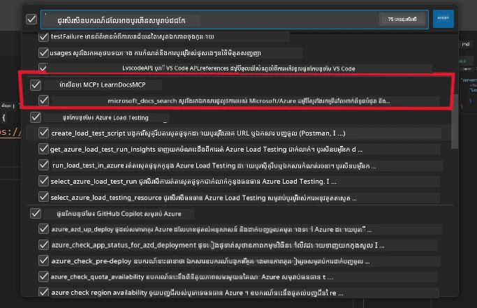
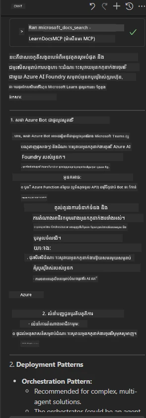

# វិថីទី៣: ឯកសារជាលក្ខណៈក្នុងកូដរួមជាមួយម៉ាស៊ីនបម្រើ MCP ក្នុង VS Code

## ទិដ្ឋភាពទូទៅ

នៅក្នុងវិថីនេះ អ្នកនឹងរៀនពីរបៀបដាក់ទិន្នន័យ Microsoft Learn Docs ទៅក្នុងបរិស្ថាន Visual Studio Code ដោយប្រើម៉ាស៊ីនបម្រើ MCP។ ជំនួសឱ្យការប្តូរតាបបទស្សនាវដ្ដីដោយជាប់គ្នាសម្រាប់ស្វែងរកឯកសារ អ្នកអាចចូលដំណើរការ ស្វែងរក និងយោងឯកសារផ្លូវការនៅក្នុងកូដរបស់អ្នកផ្ទាល់។ វិធីសាស្រ្តនេះធ្វើឱ្យដំណើរការងាររបស់អ្នកមានប្រសិទ្ធភាព ការផ្ដោតអារម្មណ៍របស់អ្នកត្រូវបានរក្សាទុក និងអាចភ្ជាប់រួមជាមួយឧបករណ៍ដូចជា GitHub Copilot បានយ៉ាងឆាប់រហ័ស។

- ស្វែងរក និងអានឯកសារជាចំាកណ្តាលក្នុង VS Code ដោយមិនចេញពីបរិស្ថានកូដ។
- យោងឯកសារ និងបញ្ចូលតំណភ្ជាប់ដោយផ្ទាល់ក្នុង README ឬឯកសារមុខវិជ្ជារបស់អ្នក។
- ប្រើ GitHub Copilot និង MCP រួមគ្នាដើម្បីមានដំណើរការងារ AI ដោយឥតខ្ចោះ។

## គោលបំណងរៀន

នៅចុងបញ្ចប់ជំពូកនេះ អ្នកនឹងយល់ពីរបៀបតម្រូវ និងប្រើម៉ាស៊ីនបម្រើ MCP ក្នុង VS Code ដើម្បីធ្វើឱ្យដំណើរការងារឥតខ្ចោះនៃឯកសារ និងការអភិវឌ្ឍកម្មវិធី។ អ្នកនឹងអាច:

- កំណត់តំបន់ការងាររបស់អ្នកសម្រាប់ប្រើម៉ាស៊ីនបម្រើ MCP សម្រាប់ស្វែងរកឯកសារ។
- ស្វែងរក និងបញ្ចូលឯកសារជាចំាកណ្តាលពីក្នុង VS Code។
- លាយកម្លាំងរបស់ GitHub Copilot និង MCP សម្រាប់ដំណើរការងារសម្រាប់អ្នកដែលមានផលិតផលភាពខ្ពស់ជាមួយ AI។

ជំនាញទាំងនេះនឹងជួយឱ្យអ្នករឹតបន្តឹងការផ្ដោតអារម្មណ៍ បង្កើនគុណភាពឯកសារ និងបង្កើនផលិតផលភាពរបស់អ្នកជាអ្នកអភិវឌ្ឍន៍ឬអ្នកសរសេរបច្ចេកទេស។

## ដំណោះស្រាយ

ដើម្បីទទួលបានការចូលដំណើរការឯកសារជាលក្ខណៈក្នុងកូដ អ្នកនឹងធ្វើតាមជំហាននានាដែលភ្ជាប់ម៉ាស៊ីនបម្រើ MCP ជាមួយ VS Code និង GitHub Copilot។ ដំណោះស្រាយនេះល្អសម្រាប់អ្នកនិពន្ធមុខវិជ្ជា អ្នកសរសេរ​ឯកសារ និងអ្នកអភិវឌ្ឍដែលចង់រក្សាផ្ដោតអារម្មណ៍នៅក្នុងកូដរបស់ពួកគេ ខណៈពេលកំពុងធ្វើការជាមួយឯកសារ និង Copilot។

- បន្ថែមតំណភ្ជាប់ឯកសារយោងទៅក្នុង README ក្រោមពេលសរសេរមុខវិជ្ជាឬឯកសារគម្រោង។
- ប្រើ Copilot ដើម្បីបង្កើតកូដ និង MCP ដើម្បីស្វែងរក និងយោងឯកសារដែលពាក់ព័ន្ធភ្លាមៗ។
- រក្សាផ្ដោតអារម្មណ៍ក្នុងកូដរបស់អ្នក និងបង្កើនផលិតផលភាព។

### មេរៀនជាគន្លង

ដើម្បីចាប់ផ្ដើម អ្នកអាចអនុវត្តភាពតាមជំហានខាងក្រោម។ សម្រាប់មួយជំហាន អ្នកអាចបញ្ចូលរូបថតពីថតអាសយដ្ឋានដើម្បីបង្ហាញយ៉ាងច្បាស់ពីក្របខណ្ឌនោះ។

1. **បន្ថែមការកំណត់ MCP៖**  
   នៅក្នុងគម្រោងរបស់អ្នក ដោះសោមួយឯកសារ `.vscode/mcp.json` ហើយបញ្ចូលការកំណត់ដូចខាងក្រោម៖  
   ```json
   {
     "servers": {
       "LearnDocsMCP": {
         "url": "https://learn.microsoft.com/api/mcp"
       }
     }
   }
   ```
   ការកំណត់នេះប្រាប់ VS Code របៀបភ្ជាប់ទៅម៉ាស៊ីនបម្រើ [`Microsoft Learn Docs MCP server`](https://github.com/MicrosoftDocs/mcp)។  
   
   
    
2. **បើកផ្ទាំង GitHub Copilot Chat៖**  
   ប្រសិនបើអ្នកមិនទាន់មានផ្នែកបន្ថែម GitHub Copilot បានដំឡើងក្នុង VS Code សូមទៅមើលផ្ទាំង Extensions ហើយដំឡើងវា។ អ្នកអាចទាញយកផ្ទាល់ពី [Visual Studio Code Marketplace](https://marketplace.visualstudio.com/items?itemName=GitHub.copilot-chat)។ បន្ទាប់មក បើកផ្ទាំង Copilot Chat ពីមីនុយជាប់បន្ទាត់។

   

3. **បើកប្រើម៉ូដភ្នាក់ងារ និងពិនិត្យឧបករណ៍ទាំងឡាយ៖**  
   នៅក្នុងផ្ទាំង Copilot Chat សូមបើកម៉ូដភ្នាក់ងារ។

   

   បន្ទាប់ពីបើកម៉ូដភ្នាក់ងារ សូមពិនិត្យថាម៉ាស៊ីនបម្រើ MCP បានរាយបញ្ជូលក្នុងបញ្ជីឧបករណ៍ដែលអាចប្រើបាន។ នេះធានាថាភ្នាក់ងារអាចចូលប្រើម៉ាស៊ីនបម្រើឯកសារ ដើម្បីយកព័ត៌មានដែលមានសុពលភាពមកប្រើបាន។
   
   
4. **ចាប់ផ្ដើមជជែកថ្មី និងផ្ញើសំណួរទៅភ្នាក់ងារ៖**  
   បើកជជែកថ្មីនៅក្នុងផ្ទាំង Copilot Chat។ ឥឡូវនេះ អ្នកអាចសាកសួរភ្នាក់ងារជាមួយសំណួរអំពីឯកសាររបស់អ្នក។ ភ្នាក់ងារនឹងប្រើម៉ាស៊ីនបម្រើ MCP ដើម្បីយក និងបង្ហាញឯកសារដែលពាក់ព័ន្ធពី Microsoft Learn ដោយផ្ទាល់ក្នុងកូដរបស់អ្នក។

   - *"ខ្ញុំកំពុងសរសេរ​ផែនការសិក្សាទៅលើមុខវិជ្ជា X។ ខ្ញុំនឹងសិក្សា៨សប្តាហ៍ សម្រាប់មួយសប្តាហ៍ សូមណែនាំមាតិកាដែលខ្ញុំគួរទទួលបាន។"*

   

5. **សំណួរផ្ទាល់ទីលាន៖**

   > មកយកសំណួរផ្ទាល់ពីផ្នែក [#get-help](https://discord.gg/D6cRhjHWSC) ក្នុង Discord Azure AI Foundry ([មើលសារដើម](https://discord.com/channels/1113626258182504448/1385498306720829572))៖  
   
   *"ខ្ញុំកំពុងស្វែងរកចម្លើយអំពីរបៀបដាក់តំឡើងដំណោះស្រាយ multi-agent ជាមួយភ្នាក់ងារ AI ដែលបានអភិវឌ្ឍនៅលើយោង Azure AI Foundry។ ខ្ញុំមើលឃើញថាមិនមានវិធីដាក់តំឡើងផ្ទាល់ដូចជា Copilot Studio channels។ តើវិធីជាច្រើនដែលអាចធ្វើបានសម្រាប់អ្នកប្រើប្រាស់សហគ្រាសដើម្បីធ្វើការទំនាក់ទំនង និងបំពេញការងារមានអ្វីខ្លះ? មានអត្ថបទជាច្រើនដែលឲ្យដឹងថាអាចប្រើសេវាកម្ម Azure Bot ដើម្បីធ្វើការងារនេះ ដែលអាចដំណើរការជាឃ្លឹបខ្សែភាពយន្តរវាង MS Teams និង Azure AI Foundry Agents តើ វានឹងដំណើរការបើខ្ញុំបង្កើត Azure bot ដែលភ្ជាប់ទៅកាន់ Orchestrator Agent នៅ Azure AI Foundry តាមរយៈ Azure function ដើម្បីអនុវត្ត orchestration ឬត្រូវបង្កើត Azure function សម្រាប់ភ្នាក់ងារ AI នីមួយៗដែលជាផ្នែកនៃដំណោះស្រាយ multi-agent ដើម្បីធ្វើ orchestration នៅ Bot framework? មានយោបល់ផ្សេងទៀតទេ?"*

   

   ភ្នាក់ងារនឹងឆ្លើយតបជាមួយតំណភ្ជាប់ឯកសារដែលពាក់ព័ន្ធ និងសេចក្ដីសង្ខេប ដែលអ្នកអាចបញ្ចូលទៅក្នុងឯកសារម៉ារកដោនរបស់អ្នក ឬប្រើជាយោងក្នុងកូដ។

### សំណួរឧទាហរណ៍

នេះជាសំណួរឧទាហរណ៍មួយចំនួនដែលអ្នកអាចសាកល្បង។ សំណួរទាំងនេះនឹងបង្ហាញពីរបៀបដែលម៉ាស៊ីនបម្រើ MCP និង Copilot អាចរួមសហការគ្នាដើម្បីផ្ដល់ឯកសារដែលមានបរិបទ និងយោងភ្លាមៗដោយមិនចេញពី VS Code៖

- "បង្ហាញខ្ញុំពីរបៀបប្រើ triggers នៅក្នុង Azure Functions។"
- "បញ្ចូលតំណភ្ជាប់ទៅឯកសារផ្លូវការនៃ Azure Key Vault។"
- "អ្វីខ្លះជាវិធីសាស្រ្តល្អបំផុតសម្រាប់ការពារ Azure resources?"
- "ស្វែងរក quickstart សម្រាប់សេវាកម្ម Azure AI។"

សំណួរទាំងនេះនឹងបង្ហាញពីរបៀបដែលម៉ាស៊ីនបម្រើ MCP និង Copilot អាចផ្គុំការងារជារួមដើម្បីផ្ដល់ឯកសារដែលមានបរិបទ និងយោងភ្លាមៗដោយមិនចេញពី VS Code។

---

---

<!-- CO-OP TRANSLATOR DISCLAIMER START -->
**ការប្រុងប្រយ័ត្ន**៖  
ឯកសារនេះត្រូវបានបកប្រែដោយប្រើសេវាកម្មបកប្រែ AI [Co-op Translator](https://github.com/Azure/co-op-translator)។ ខណៈពេលយើងខិតខំប្រឹងប្រែងសម្រាប់ភាពត្រឹមត្រូវ សូមយល់ដឹងថាការបកប្រែដោយស្វ័យប្រវត្តិអាចមានកំហុសឬភាពមិនត្រឹមត្រូវ។ ឯកសារដើមនៅភាសាដើមគួរត្រូវបានគេពិចារណាថាជាអ្នកផ្តល់ព័ត៌មានដែលមានសិទ្ធិ។ សម្រាប់ព័ត៌មានសំខាន់ យើងផ្តល់អនុសាសន៍ឱ្យប្រើការបកប្រែដោយអ្នកជំនាញមនុស្ស។ យើងមិនទទួលខុសត្រូវចំពោះការយល់ច្រឡំ ឬការបកប្រែខុស ពីការប្រើប្រាស់ការបកប្រែនេះទេ។
<!-- CO-OP TRANSLATOR DISCLAIMER END -->