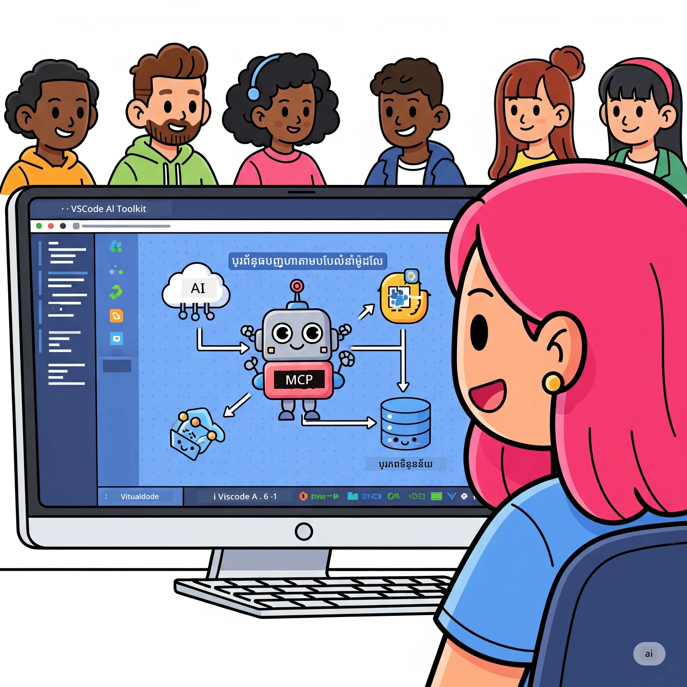
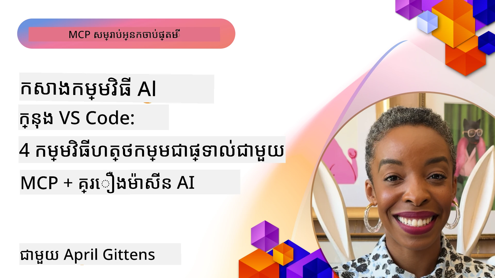

# ការរៀបចំដំណើរការងារពី AI ឱ្យរលូន៖ ការសាងសង់ម៉ាស៊ីនមេ MCP ជាមួយឧបករណ៍ AI Toolkit

## 🎯 ជាវិឆ្លើយ

_(ចុចលើរូបភាពខាងលើ ដើម្បីមើលវីដេអូស្តីពីមេរៀននេះ)_

សូមស្វាគមន៍មកកាន់ **វគ្គសិក្សា Model Context Protocol (MCP)**! វគ្គសិក្សាដៃគូដ៏ទូលំទូលាយនេះ បញ្ចូលបច្ចេកវិទ្យាទំនើបពីរដើម្បីបំលែងការអភិវឌ្ឍកម្មវិធី AI៖

- **🔗 Model Context Protocol (MCP)**: ស្តង់ដារបើកសម្រាប់ការភ្ជាប់ឧបករណ៍ AI ដោយរលូន
- **🛠️ AI Toolkit សម្រាប់ Visual Studio Code (AITK)**: ផ្នែកបន្ថែមកាន់តែខ្លាំងពី Microsoft សម្រាប់អភិវឌ្ឍ AI

### 🎓 អ្វីដែលអ្នកនឹងបានរៀន

នៅចុងបញ្ចប់នៃវគ្គនេះ អ្នកនឹងមានជំនាញក្នុងការសាងសង់កម្មវិធីបញ្ញាសម្រាប់ភ្ជាប់ម៉ូឌែល AI ជាមួយឧបករណ៍ និងសេវាកម្មពិតប្រាកដ។ ចាប់ពីការធ្វើតេស្តដោយស្វ័យប្រវត្តิจល់រហូតដល់ការភ្ជាប់ API ប្លែកៗ អ្នកនឹងទទួលបានជំនាញអនុវត្តដើម្បីដោះស្រាយបញ្ហាអាជីវកម្មស្មុគស្មាញ។

## 🏗️ សំណុំបច្ចេកវិទ្យា

### 🔌 Model Context Protocol (MCP)

MCP គឺជា **"USB-C សម្រាប់ AI"** - ស្តង់ដារសកលដែលភ្ជាប់ម៉ូឌែល AI ទៅឧបករណ៍ និងប្រភពទិន្នន័យខាងក្រៅ។

**✨ លក្ខណៈសំខាន់៖**

- 🔄 **ការភ្ជាប់ដែលបានស្តង់ដារ**: ចំណុចប្រទាក់សកលសម្រាប់ការភ្ជាប់ឧបករណ៍ AI
- 🏛️ **ស្ថាបត្យកម្មបត់បែន**: ម៉ាស៊ីនមេក្នុងផ្ទះ & ពីចម្ងាយតាម stdio/SSE
- 🧰 **បរិយាកាសសម្បូរ**: ឧបករណ៍, ដំណើរការ និងធនធានក្នុង protocol តែមួយ
- 🔒 **រួចរាល់សម្រាប់សាជីវកម្ម**: មានសុវត្ថិភាព និងទុកចិត្តបាន

**🎯 ហេតុអ្វីហេតុ MCP មានសារៈសំខាន់៖**  
ដូច USB-C បានបញ្ឈឺច្រឡំខ្សែ កាលណា MCP សំរេចចេញពីភាពស្មុគស្មាញនៃការភ្ជាប់ AI។ Protocol តែមួយ, ការពិចារណាអតិបរិមា។

### 🤖 AI Toolkit សម្រាប់ Visual Studio Code (AITK)

ផ្នែកបន្ថែម AI ដ៏សំខាន់របស់ Microsoft ដែលបម្លែង VS Code ទៅជាគ្រឹះបណ្ដាញ AI ។ 

**🚀 សមត្ថភាពស្នូល៖**

- 📦 **កាតាឡុកម៉ូឌែល**: ចូលប្រើម៉ូឌែលពី Azure AI, GitHub, Hugging Face, Ollama
- ⚡ **ការថែរក្សារទិន្នន័យក្នុងថ្នាក់ក្រោមម៉ាស៊ីនយន្ត**: មុខងារ ONNX សម្រាប់ CPU/GPU/NPU 
- 🏗️ **អ្នកបង្កើតភ្នាក់ងារ**: ការអភិវឌ្ឍភ្នាក់ងារដោយរូបភាពជាមួយការភ្ជាប់ MCP
- 🎭 **មុខងារពហុមធ្យោបាយ**: សម្រាប់អត្ថបទ, ទស្សនៈ, និងលទ្ធផលដំឡើងរចនាសម្ព័ន្ធ

**💡 ផលប្រយោជន៍នៃការអភិវឌ្ឍ៖**

- ដំឡើងម៉ូឌែលដោយមិនចាំបាច់កំណត់កំណត់
- បង្កើតសញ្ញាប័ណ្ណបញ្ញាស៍ដោយរូបភាព
- កន្លែងសាកល្បងម៉ូឌែលជាពេលពិត
- ការភ្ជាប់ម៉ាស៊ីនមេ MCP ដោយរលូន

## 📚 ដំណើររៀន

### [🚀 មេរៀន 1៖ មូលដ្ឋាន AI Toolkit](./lab1/README.md)

**រយៈពេល**៖ 15 នាទី

- 🛠️ ដំឡើង និងកំណត់រចនាសម្ព័ន្ធ AI Toolkit សម្រាប់ VS Code  
- 🗂️ ស្វែងយល់កាតាឡុកម៉ូឌែល (100+ ម៉ូឌែលពី GitHub, ONNX, OpenAI, Anthropic, Google)  
- 🎮 យល់ដឹងកន្លែងតេស្តម៉ូឌែលផ្ទាល់ក្នុងពេលពិត  
- 🤖 បង្កើតភ្នាក់ងាររបស់អ្នកដំបូងជាមួយ Agent Builder  
- 📊 វាយតម្លៃការប្រតិបត្តិម៉ូឌែលជាមួយគណិតវិទ្យាក្នុងម៉ាស៊ីន (F1, relevance, similarity, coherence)  
- ⚡ រៀនពីការប្រតិបត្តិប៉ុស្តិ៍និងគាំទ្រមុខងារពហុមធ្យោបាយ  

**🎯 លទ្ធផលរៀន**៖ បង្កើតភ្នាក់ងារបញ្ញាស៍មួយដោយយល់ដឹងគ្រប់ទាំងអំពីសមត្ថភាព AITK

### [🌐 មេរៀន 2៖ MCP ជាមួយ AI Toolkit មូលដ្ឋាន](./lab2/README.md)

**រយៈពេល**៖ 20 នាទី

- 🧠 យល់ដឹងអំពីស្ថាបត្យកម្ម និងគំនិត MCP  
- 🌐 ស្វែងយល់បរិយាកាសម៉ាស៊ីនមេ MCP របស់ Microsoft  
- 🤖 បង្កើតភ្នាក់ងារអូតូម៉ាទ័រក្នុងកម្មវិធីរុករកដោយប្រើ Playwright MCP server  
- 🔧 ភ្ជាប់ម៉ាស៊ីនមេ MCP ជាមួយ AI Toolkit Agent Builder  
- 📊 កំណត់រចនាសម្ព័ន្ធ និងតេស្តឧបករណ៍ MCP ក្នុងភ្នាក់ងាររបស់អ្នក  
- 🚀 នាំចេញ និងដាក់ឲ្យប្រើភ្នាក់ងារ MCP សម្រាប់ផលិតកម្ម

**🎯 លទ្ធផលរៀន**៖ ដាក់ឲ្យប្រើភ្នាក់ងារបញ្ញាស៍ដែលមានឧបករណ៍ខាងក្រៅតាមរយៈ MCP

### [🔧 មេរៀន 3៖ ការអភិវឌ្ឍ MCP លំអិតជាមួយ AI Toolkit](./lab3/README.md)

**រយៈពេល**៖ 20 នាទី

- 💻 បង្កើតម៉ាស៊ីនមេ MCP ផ្ទាល់ខ្លួនដោយប្រើ AI Toolkit  
- 🐍 កំណត់រចនាសម្ព័ន្ធ និងប្រើ MCP Python SDK ថ្មីបំផុត (v1.9.3)  
- 🔍 កំណត់និងប្រើ MCP Inspector សម្រាប់ដំណោះស្រាយបញ្ហា  
- 🛠️ បង្កើតម៉ាស៊ីនមេព័ត៍មានអាកាសធាតុ MCP ជាមួយដំណើរការជំនួយដំណោះស្រាយបញ្ហាដោយជំនាញ  
- 🧪 ដំណោះស្រាយបញ្ហាទាំងក្នុង Agent Builder និង Inspector

**🎯 លទ្ធផលរៀន**៖ អភិវឌ្ឍនិងដោះស្រាយបញ្ហា MCP servers ផ្ទាល់ខ្លួនជាមួយឧបករណ៍ទំនើប

### [🐙 មេរៀន 4៖ ការអភិវឌ្ឍ MCP ភាពជាក់ស្ដែង - ម៉ាស៊ីនមេ GitHub Clone ផ្ទាល់ខ្លួន](./lab4/README.md)

**រយៈពេល**៖ 30 នាទី

- 🏗️ បង្កើតម៉ាស៊ីនមេ GitHub Clone MCP សម្រាប់ដំណើរការអភិវឌ្ឍ  
- 🔄 អនុវត្តការចម្លង repository ដោយមានការត្រួតពិនិត្យនិងគ្រប់គ្រងកំហុស  
- 📁 បង្កើតការគ្រប់គ្រងថតឯកសារដោយខ្លាំង និងការភ្ជាប់ជាមួយ VS Code  
- 🤖 ប្រើ GitHub Copilot Agent Mode ជាមួយឧបករណ៍ MCP ផ្ទាល់ខ្លួន  
- 🛡️ អនុវត្តភាពទុកចិត្តនិងការធានាសំរាប់ផលិតកម្មនៅគ្រប់វេទិកា

**🎯 លទ្ធផលរៀន**៖ ដាក់ប្រើម៉ាស៊ីនមេ MCP សម្រាប់ផលិតកម្មដែលជួយរៀបចំដំណើរការអភិវឌ្ឍពិតប្រាកដ

## 💡 ករណីប្រើប្រាស់ពិតប្រាកដ និងប៉ះពាល់

### 🏢 ករណីប្រើប្រាស់សម្រាប់សាជីវកម្ម

#### 🔄 ការអូតូម៉ាទ័រដំណើរការ DevOps

បំលែងដំណើរការអភិវឌ្ឍរបស់អ្នកជាមួយការអូតូម៉ាទ័រដែលបញ្ញាស្រាល៖

- **គ្រប់គ្រង Repository ឆ្លាតវៃ**: ពិនិត្យកូដ និងសម្រេចចិត្តប្រកបដោយ AI  
- **CI/CD ឆ្លាតវៃ**: បង្កើតផ្លូវបណ្តោះអង្គផ្សែដោយស្វ័យប្រវត្តិមកពីការផ្លាស់ប្តូរកូដ  
- **ចាត់ចែងបញ្ហា**: ចំណាត់ថ្នាក់កំហុស និងចែកចាយដោយស្វ័យប្រវត្តិ

#### 🧪 បម្លែងគុណភាពធានា

លើកកំពស់ការធ្វើតេស្តជាមួយការអូតូម៉ាទ័រដោយ AI៖

- **ការបង្កើតតេស្តឆ្លាតវៃ**: បង្កើតសំណុំតេស្តជាភាគីរឺដោយស្វ័យប្រវត្តិ  
- **តេស្តបង្វិល UI**: ការគាំទ្ររកឃើញការផ្លាស់ប្តូរផ្ទៃតំណាញ់ UI ដោយ AI  
- **ត្រួតពិនិត្យប្រសិទិ្ឋភាព**: ការស្វែងរកបញ្ហា និងដោះស្រាយជាមុន

#### 📊 បញ្ហានៃបំណែកទិន្នន័យ

បង្កើតដំណើរការចំណាត់ថ្នាក់ទិន្នន័យឆ្លាតវៃ៖

- **ដំណើរការបម្លែង ETL ឆ្លាតវៃ**: បម្លែងទិន្នន័យដោយផលិតភាពខ្លួនឯង  
- **រកឃើញកំហុសលើកឡើង**: ត្រួតពិនិត្យគុណភាពទិន្នន័យពេលពិត  
- **ចំណាត់ថ្នាក់ដឹកជញ្ជូនឆ្លាតវៃ**: គ្រប់គ្រងស្ទ្រីមទិន្នន័យយ៉ាងមានប្រសិទ្ធិភាព

#### 🎧 ការពង្រឹងបទពិសោធន៍អតិថិជន

បង្កើតការចូលរួមអតិថិជនដ៏អស្ចារ្យ៖

- **គាំទ្រដោយបរិបទ**: ភ្នាក់ងារ AI មានចូលដំណើរការប្រវត្តិអតិថិជន  
- **ដោះស្រាយបញ្ហាដោយចូរអំពីខ្លួន**: សេវាកម្មអតិថិជនដែលប៉ាន់ប្រមាណភាព  
- **ការភ្ជាប់ពហុប៉្លាតហ្វોર્મ**:បទពិសោធន៍ AI សង្គមរួមគ្នាបន្តការងារ

## 🛠️ លក្ខខណ្ឌនិងការតំឡើង

### 💻 តម្រូវការ ប្រព័ន្ធ

| ផ្នែក | តម្រូវការ | កំណត់ចំណាំ |
|-----------|-------------|-------|
| **ប្រព័ន្ធប្រតិបត្តិការ** | Windows 10+, macOS 10.15+, Linux | ប្រព័ន្ធប្រតិបត្តិការ​ទំនើបគ្រប់ប្រភេទ |
| **Visual Studio Code** | ជំនាន់ស្ថិតស្ថេរ​ក្រោយបំផុត | តម្រូវអោយមានសម្រាប់ AITK |
| **Node.js** | v18.0+ និង npm | សម្រាប់អភិវឌ្ឍម៉ាស៊ីនមេ MCP |
| **Python** | 3.10+ | ជាជម្រើសសម្រាប់ម៉ាស៊ីនមេ MCP Python |
| **ម៉េម៉ូរី** | អប្បបរមា 8GB RAM | ផ្ដល់អនុសាសន៍16GB សម្រាប់ម៉ូឌែលដែលដំណើរការផ្ទាល់ |

### 🔧 បរិយាកាសអភិវឌ្ឍ

#### បន្ថែម VS Code ដែលសំណូមពរជាទូទៅ

- **AI Toolkit** (ms-windows-ai-studio.windows-ai-studio)  
- **Python** (ms-python.python)  
- **Python Debugger** (ms-python.debugpy)  
- **GitHub Copilot** (GitHub.copilot) - ជម្រើសប៉ុន្តិត្រូវប្រើ

#### ឧបករណ៍ជម្រើស

- **uv**: កម្មវិធីគ្រប់គ្រងចង្ក្រាន Python ទំនើប  
- **MCP Inspector**: ឧបករណ៍វាយតម្លៃដំណោះស្រាយម៉ាស៊ីនមេ MCP  
- **Playwright**: សម្រាប់ឧទាហរណ៍អូតូម៉ាទ័របណ្ដាញ

## 🎖️ លទ្ធផលរៀន និងផ្លូវវិញ្ញាបនបត្រ

### 🏆 បញ្ជីត្រួតពិនិត្យជំនាញ

ដោយបញ្ចប់វគ្គសិក្សានេះ អ្នកនឹងមានជំនាញលំអិត៖

#### 🎯 ជំនាញស្នូល

- [ ] **ជំនាញ MCP Protocol**៖ យល់ដឹងជ្រាលជ្រៅអំពីស្ថាបត្យកម្ម និងទម្លាប់អនុវត្ត  
- [ ] **ជំនាញ AITK**៖ ប្រើប្រាស់ AI Toolkit ដោយជំនាញកំពូល  
- [ ] **ការអភិវឌ្ឍ ម៉ាស៊ីនមេផ្ទាល់ខ្លួន**៖ សាងសង់, បង្ហោះ និងថែទាំម៉ាស៊ីនមេ MCP សម្រាប់ផលិតកម្ម  
- [ ] **ការភ្ជាប់ឧបករណ៍ឯកទេស**៖ ភ្ជាប់ AI ជាមួយដំណើរការអភិវឌ្ឍមានស្រាប់រលូន  
- [ ] **ការដោះស្រាយបញ្ហា**៖ អនុវត្តជំនាញក្នុងការដោះស្រាយបញ្ហាអាជីវកម្មពិតប្រាកដ

#### 🔧 ជំនាញបច្ចេកទេស

- [ ] កំណត់រចនាសម្ព័ន្ធ និងដំណើរការ AI Toolkit ក្នុង VS Code  
- [ ] ការរចនា និងអភិវឌ្ឍម៉ាស៊ីនមេ MCP ផ្ទាល់ខ្លួន  
- [ ] ភ្ជាប់ម៉ូឌែល GitHub ជាមួយស្ថាបត្យកម្ម MCP  
- [ ] ការបង្កើតដំណើរការតេស្តដោយអូតូម៉ាទ័រជាមួយ Playwright  
- [ ] ដាក់តួនាទីភ្នាក់ងារ AI សម្រាប់ផលិតកម្ម  
- [ ] ធ្វើដំណោះស្រាយបញ្ហា និងបង្រ្កាបសមត្ថភាពម៉ាស៊ីនមេ MCP

#### 🚀 សមត្ថភាពកម្រិតខ្ពស់

- [ ] រចនាសម្ព័ន្ធការភ្ជាប់ AI នៅលើស្ព្ទតសាជីវកម្មធំធេង  
- [ ] អនុវត្តវិធានសុវត្ថិភាពមានប្រសិទ្ធភាពសម្រាប់កម្មវិធី AI  
- [ ] រចនាស្ថាបត្យកម្មម៉ាស៊ីនមេ MCP ដែលអាចពង្រីកបាន  
- [ ] បង្កើតខ្សែឧបករណ៍ផ្ទាល់ខ្លួនសម្រាប់វិស័យជាក់លាក់  
- [ ] ជ្រាបជំនាញអភិវឌ្ឍ AI ដោយផ្ទាល់ខ្លួន និងបង្រៀនអ្នកដទៃ

## 📖 ធនធានបន្ថែម

- [MCP Specification (2025-11-25)](https://spec.modelcontextprotocol.io/specification/2025-11-25/)  
- [AI Toolkit GitHub Repository](https://github.com/microsoft/vscode-ai-toolkit)  
- [Sample MCP Servers Collection](https://github.com/modelcontextprotocol/servers)  
- [Best Practices Guide](https://modelcontextprotocol.io/docs/best-practices)  
- [OWASP MCP Top 10](https://microsoft.github.io/mcp-azure-security-guide/mcp/) - ជំហានល្អបំផុតសុវត្ថិភាព

---

**🚀 តើអ្នករៀបចំចិត្តរួចហើយឬនៅ ដើម្បីបំលែងដំណើរការអភិវឌ្ឍ AI របស់អ្នក?**

មកសាងសង់អនាគតកម្មវិធីបញ្ញាស័ក្តិសមជាមួយ MCP និង AI Toolkit!

## បន្ទាប់គឺ

បន្តទៅ: [Module 11: MCP Server Hands-On Labs](../11-MCPServerHandsOnLabs/README.md)

---

<!-- CO-OP TRANSLATOR DISCLAIMER START -->
**ការ​បដិសេធ**៖  
ឯកសារ​នេះ​ត្រូវ​បាន​ប្រែ​ជា​ភាសា​ខ្មែរ​ដោយ​ប្រើ​សេវាកម្ម​ប្រែ​សម្រួល AI [Co-op Translator](https://github.com/Azure/co-op-translator)។ ទោះបី​យើង​ព្យាយាម​ធ្វើ​ឲ្យ​ត្រឹមត្រូវ​ជាយ៉ាង​ច្បាស់ ក៏ដោយ សូម​ជ្រាបថា​ការ​ប្រែប្រួល​ដោយ​ស្វ័យប្រវត្តិ​អាច​មាន​កំហុស ឬ​ភាព​មិន​ត្រឹមត្រូវ​ណាមួយ។ ឯកសារ​ដើម​ក្នុង​ភាសាម៉ូលដ្ឋាន​គួរ​ត្រូវ​បាន​គេ​យក​ជា​មូល​ដ្ឋាន​ស្តើង​ទុក។ សម្រាប់​ព័ត៌មាន​បន្ទាប់​ប្រាក់ ដូចជា​ព័ត៌មាន​សំខាន់ៗ ការ​ប្រែ​សម្រួល​ដោយ​មនុស្ស​ជំនាញ​ត្រូវបាន​ផ្ដល់​អនុសាសន៍។ យើង​មិន​ទទួល​ខុសត្រូវ​ចំពោះ​ការ​យល់​ព្រម​ផ្សេង ឬ​ការបក​ប្រែខុសៗ ដែល​កើត​ឡើង​ពី​ការ​ប្រើប្រាស់​ការ​ប្រែ​សម្រួល​នេះ​ឡើយ។
<!-- CO-OP TRANSLATOR DISCLAIMER END -->