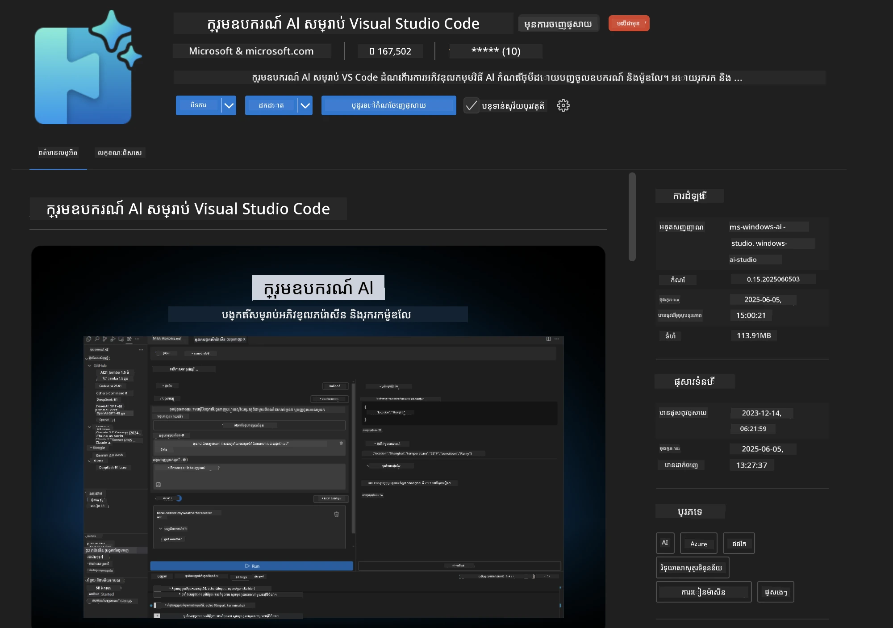
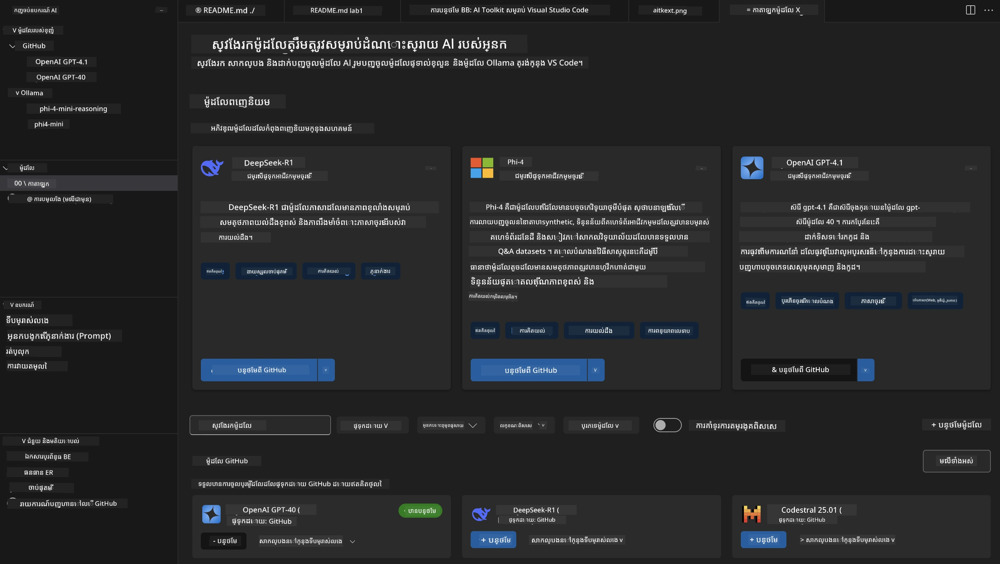
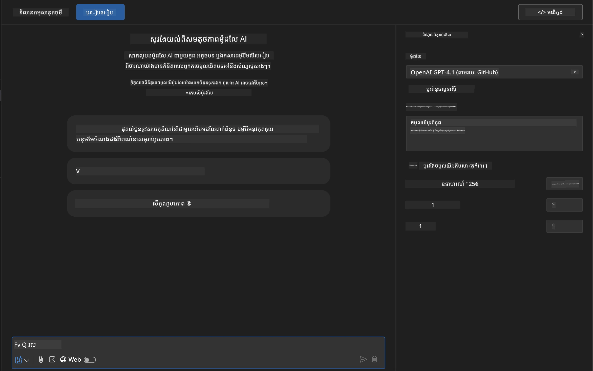
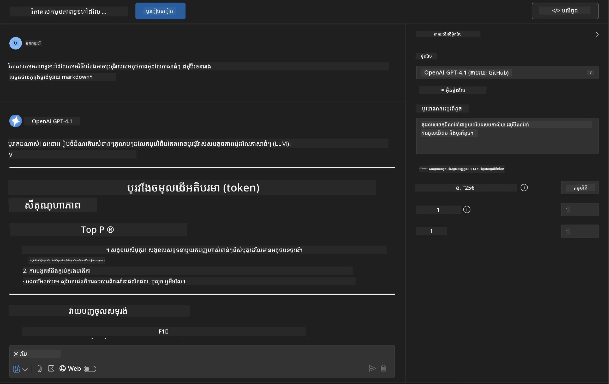
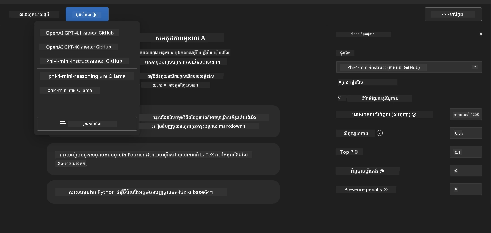
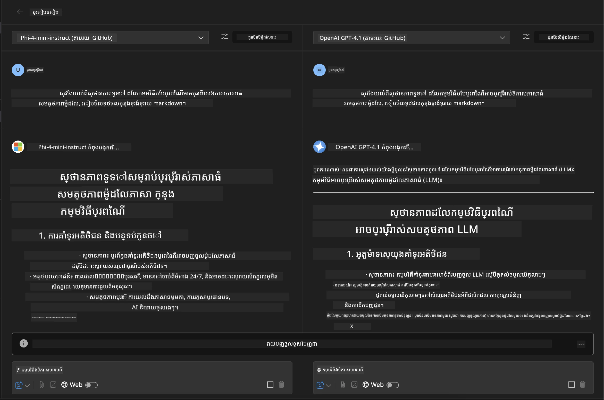
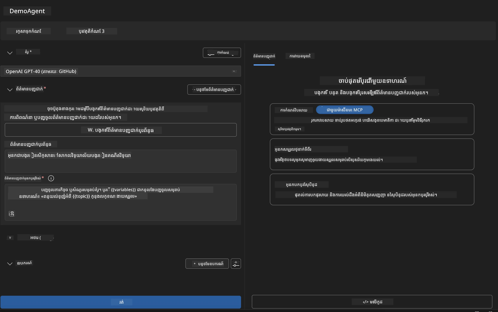
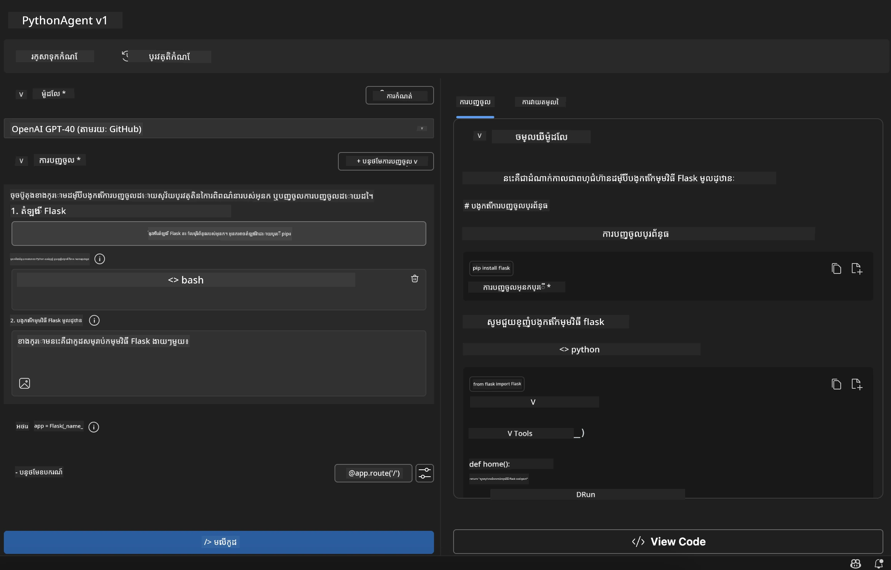

# 🚀 ម៉ូឌុល ១៖ មូលដ្ឋានឧបករណ៍ AI Toolkit

[]()
[]()
[]()

## 📋 គោលបំណងរៀន

នៅបញ្ចប់ម៉ូឌុលនេះ អ្នកនឹងអាច:
- ✅ តំឡើង និងកំណត់រចនាសម្ព័ន្ធ AI Toolkit សម្រាប់ Visual Studio Code
- ✅ រុករកកាតាឡុកម៉ូដែល និងយល់ពីប្រភពម៉ូដែលខុសៗគ្នា
- ✅ ប្រើ Playground ដើម្បីសាកល្បងម៉ូដែល និងធ្វើការសាកល្បង
- ✅ បង្កើតភ្នាក់ងារផ្ទាល់ខ្លួនដោយសម្ភារៈ Agent Builder
- ✅ ប្រៀបធៀបលទ្ធផលរបស់ម៉ូដែលនៅក្នុងអ្នកផ្គត់ផ្គង់ផ្សេងៗគ្នា
- ✅ អនុវត្តការអភិវឌ្ឍល្អបំផុតសម្រាប់ដាក់បញ្ចូល(predictive) prompt

## 🧠 សេចក្ដីមុខមាត់នៃ AI Toolkit (AITK)

**AI Toolkit សម្រាប់ Visual Studio Code** គឺជាការពង្រីកធំរបស់ Microsoft ដែលបម្លែង VS Code ជាសេវាកម្មអភិវឌ្ឍ AI ពេញលេញ។ វាដំណោះស្រាយកន្លែងចម្សារវិទ្យាស្រាវជ្រាវ AI និងអភិវឌ្ឍកម្មវិធីជាក់ស្តែង មកជាមួយការចូលដំណើរការជាមូលដ្ឋានសម្រាប់អ្នកអភិវឌ្ឍទាំងអស់។

### 🌟 សមត្ថភាពសំខាន់ៗ

| លក្ខណៈពិសេស | សេចក្ដីពិពណ៌នា | ករណីប្រើប្រាស់ |
|---------|-------------|----------|
| **🗂️ កាតាឡុកម៉ូដែល** | ចូលដំណើរការ ១០០+ ម៉ូដែលពី GitHub, ONNX, OpenAI, Anthropic, Google | រកហើយជ្រើសរើសម៉ូដែល |
| **🔌 គាំទ្រ BYOM** | បញ្ចូលម៉ូដែលផ្ទាល់ខ្លួន (ក្នុងស្រុក/ចំរូង) | ប្រើប្រាស់ម៉ូដែលផ្ទាល់ខ្លួន |
| **🎮 ភ្លេយ៍ក្រោនបន្ទប់សាកល្បងអន្តរកម្ម** | ការសាកល្បងម៉ូដែលពេលវេលាតួសន្ទនា | បង្កើតម៉ូដែលយ៉ាងលឿន និងសាកល្បង |
| **📎 គាំទ្រជាប្រភេទផ្សំនានា** | គ្រប់គ្រងអត្ថបទ រូបភាព និងឯកសារផ្សាក់ | កម្មវិធី AI មានភាពស្មុគស្មាញ |
| **⚡ ដំណើរការប្រមូលផ្ដុំច្រើន** | ប្រតិបត្តិការ prompt ច្រើនជាបន្ទាន់ | សម្រួលដំណើរការសាកល្បង |
| **📊 វាយតម្លៃម៉ូដែល** | វិមាត្រដែលបង្កើតឡើង (F1, សមស្រប, ស្រដៀង, សមរម្យ) | វាយតម្លៃសមត្ថភាព |

### 🎯 មូលហេតុដែល AI Toolkit មានសារៈសំខាន់

- **🚀 អភិវឌ្ឍលឿន**: ពីគំនិតមករកពុម្ពក្នុងរយៈពេលខ្លី
- **🔄 ការប្រតិបត្តិការតែមួយគត់**: មុខងារច្រើនសម្រាប់អ្នកផ្គត់ផ្គង់ AI ផ្សេងៗ
- **🧪 សាកល្បងបានងាយស្រួល**: ប្រៀបធៀបម៉ូដែលដោយគ្មានការកំណត់ពិបាក
- **📈 រៀបចំសម្រាប់ផលិតកម្ម**: ផ្លាស់ប្តូរយ៉ាងរលូនពីពុម្ពទៅផលិតកម្ម

## 🛠️ លក្ខខណ្ឌមុននិងការតំឡើង

### 📦 តំឡើងការពង្រីក AI Toolkit

**ជំហ៊ាន ១៖ ចូលផ្ទាំង Extensions Marketplace**
1. បើក Visual Studio Code
2. ទៅកាន់ផ្ទាំង Extensions (`Ctrl+Shift+X` ឬ `Cmd+Shift+X`)
3. ស្វែងរក "AI Toolkit"

**ជំហ៊ាន ២៖ ជ្រើសរើសកំណែរបស់អ្នក**
- **🟢 ចេញផ្សាយ**: ផ្តល់អនុសាសន៍សម្រាប់ប្រើប្រាស់ក្នុងផលិតកម្ម
- **🔶 មុនចេញផ្សាយ**: ចូលដំណើរការលឿនសម្រាប់មុខងារថ្មីៗ

**ជំហ៊ាន ៣៖ តំឡើង និងដំណើរការ**



### ✅ បញ្ជីស្វែងរកត្រឹមត្រូវ
- [ ] រូបសញ្ញា AI Toolkit បង្ហាញនៅជាប់ផ្ទាំង VS Code
- [ ] ការពង្រីកបានបើកនិងដំណើរការ
- [ ] គ្មានកំហុសតំឡើងនៅក្នុងផ្ទាំងលទ្ធផល

## 🧪 ការអនុវត្តដៃ ១៖ រុករកម៉ូដែល GitHub

**🎯 គោលបំណង**: យល់ដឹងពីកាតាឡុកម៉ូដែល និងសាកល្បងម៉ូដែល AI ដំបូងរបស់អ្នក

### 📊 ជំហ៊ាន ១៖ រុករកកាតាឡុកម៉ូដែល

កាតាឡុកម៉ូដែលគឺជាទ្វារដប់ដល់ប្រព័ន្ធអេកូស៊ីស្តែម AI។ វាក្នុងការប្រមូលម៉ូដែលពីអ្នកផ្គត់ផ្គង់ច្រើនហើយជា ងាយស្រួលស្វែងរក និងប្រៀបធៀបជម្រើស។

**🔍 សៀវភៅនាវា៖**

ចុចលើ **MODELS - Catalog** នៅផ្នែកខាងជាប់ AI Toolkit



**💡 យុទ្ធសាស្ត្រល្អ**: ស្វែងរកម៉ូដែលដែលមានលក្ខណៈពិសេសដែលផ្គូផ្គងទៅនឹងករណីប្រើប្រាស់របស់អ្នក (ឧ. បង្កើតកូដ សរសេរច្នៃប្រឌិត វិភាគ)។

**⚠️ សម្គាល់**: ម៉ូដែលដែលផ្ទុកនៅលើ GitHub (ម៉ូដែល GitHub) អាចប្រើបានដោយឥតគិតថ្លៃ ប៉ុន្តែមានការកំណត់លើកម្រិតសំណើ និង token។ ប្រសិនបើអ្នកចង់បំពេញទៅម៉ូដែលដែលមិនមកពី GitHub (ម៉ូដែលក្រៅដែលផ្ទុកតាម Azure AI ឬចំណុចផ្សេងៗ) អ្នកត្រូវការផ្តល់កូនសោ API ឬការផ្ទៀងផ្ទាត់ត្រឹមត្រូវ។

### 🚀 ជំហ៊ាន ២៖ បន្ថែម និងកំណត់រចនាសម្ព័ន្ធម៉ូដែលដំបូងរបស់អ្នក

**យុទ្ធសាស្ត្រជ្រើសរើសម៉ូដែល:**
- **GPT-4.1**: ល្អបំផុតសម្រាប់ការត្រឹមត្រូវ និងវិភាគស្មុគស្មាញ
- **Phi-4-mini**: ទំងន់ស្រាល សំរួលលឿនសម្រាប់ភារកិច្ចធម្មតា

**ដំណើរការកំណត់រចនាសម្ព័ន្ធ:**
1. ជ្រើសរើស **OpenAI GPT-4.1** ពីកាតាឡុក
2. ចុច **Add to My Models** - កំណត់ម៉ូដែលសម្រាប់ប្រើប្រាស់
3. ជ្រើស **Try in Playground** ដើម្បីចាប់ផ្តើមបរិយាកាសសាកល្បង
4. រង់ចាំការចាប់ផ្តើមម៉ូដែល (ការតំឡើងលើកដំបូងអាចយូរ)



**⚙️ យល់ច្បាស់ពីប៉ារ៉ាម៉ែត្រម៉ូដែល:**
- **Temperature**: គ្រប់គ្រងការច្នៃប្រឌិត (0 = កំណត់តម្លៃមិនប្រែប្រួល, 1 = ច្នៃប្រឌិត)
- **Max Tokens**: ប្រវែងបំផុតនៃចម្លើយ
- **Top-p**: ការជ្រើសរើសអគ្គិសនីសម្រាប់ភាពចម្រុះនៃចម្លើយ

### 🎯 ជំហ៊ាន ៣៖ យល់ដឹងផ្ទាល់លើផ្ទាំង Playground

Playground គឺជាកន្លែងសាកល្បង AI របស់អ្នក។ នេះជាវិធីបង្កើតសមត្ថភាពរបស់វា:

**🎨 ការអភិវឌ្ឍ prompt ដែលមានប្រសិទ្ធភាព:**
1. **ជាក់លាក់**: សេចក្ដីណែនាំច្បាស់លាស់នាំឲ្យមានលទ្ធផលល្អ
2. **ផ្ដល់បរិបទ**: បញ្ចូលព័ត៌មានផ្ទៃខាងលើដែលពាក់ព័ន្ធ
3. **ប្រើឧទាហរណ៍**: បង្ហាញម៉ូដែលអ្វីដែលអ្នកចង់បានជាឧទាហរណ៍
4. **ធ្វើភ្លេចទៅ**: កែប្រែ prompt ដូចគ្នាលើលទ្ធផលដំបូង

**🧪 សេណារីយសាកល្បង:**
```markdown
# Example 1: Code Generation
"Write a Python function that calculates the factorial of a number using recursion. Include error handling and docstrings."

# Example 2: Creative Writing
"Write a professional email to a client explaining a project delay, maintaining a positive tone while being transparent about challenges."

# Example 3: Data Analysis
"Analyze this sales data and provide insights: [paste your data]. Focus on trends, anomalies, and actionable recommendations."
```



### 🏆 ចំណេះដឹងបំផុត៖ ប្រៀបធៀបលទ្ធផលម៉ូដែល

**🎯 គោលដៅ**: ប្រៀបធៀបម៉ូដែលផ្សេងៗដោយប្រើ prompt ដូចគ្នាដើម្បីយល់ពីកំលាំងរបស់ពួកវា

**📋 សេចក្ដីណែនាំ:**
១. បន្ថែម **Phi-4-mini** ទៅកន្លែងធ្វើការរបស់អ្នក  
២. ប្រើ prompt ដូចគ្នាសម្រាប់ GPT-4.1 និង Phi-4-mini



៣. ប្រៀបធៀបគុណភាពចម្លើយ ល្បឿន និងភាពត្រឹមត្រូវ  
៤. យកចំណាំលទ្ធផលរបស់អ្នកនៅផ្នែកលទ្ធផល



**💡 ចំណុចយល់ដឹងសំខាន់ៗ:**
- ពេលណាអ្នកត្រូវប្រើ LLM ឬ SLM
- ការជួញដូរពីប្រាក់ដុល្លា ទៅលទ្ធភាព
- សមត្ថភាពពិសេសរបស់ម៉ូដែលផ្សេងៗ

## 🤖 ការអនុវត្តដៃ ២៖ បង្កើតភ្នាក់ងារផ្ទាល់ខ្លួនជាមួយ Agent Builder

**🎯 គោលបំណង**: បង្កើតភ្នាក់ងារ AI ឯកទេសបំផុតសម្រាប់ភារកិច្ចនិងលំហាត់ការពិសេសៗ

### 🏗️ ជំហ៊ាន ១៖ យល់ពី Agent Builder

Agent Builder គឺជាកន្លែងដែល AI Toolkit ចេញពន្លឺពិតប្រាកដ។ វាអនុញ្ញាតឲ្យអ្នកបង្កើតជំនួយករណ៍ AI ដែលបំពេញគោលបំណងដោយផ្គុំមូលដ្ឋានម៉ូដែលភាសាធំជាមួយជំនាញបញ្ជាក់ទំនង ស្ទង់ពិន្ទុជាក់លាក់ និងចំណេះដឹងពិសេសផ្សេងៗ។

**🧠 ផ្នែករចនាសម្ព័ន្ធ Agent:**
- **ម៉ូដែលមូលដ្ឋាន**: បទដ្ឋាន LLM (GPT-4, Groks, Phi, ល។)
- **System Prompt**: កំណត់បុគ្គលលក្ខណៈនិងអាកប្បកិរិយា agent
- **ប៉ារ៉ាម៉ែត្រ**: ការកំណត់ភាពល្អឥតខ្ចោះសម្រាប់កម្រិតសមត្ថភាពខ្ពស់
- **ការភ្ជាប់ឧបករណ៍**: ភ្ជាប់ទៅ API និងសេវា MCP ខាងក្រៅ
- **Memory**: បរិបទការពិភាក្សានិងការរក្សាទុកសម័យ



### ⚙️ ជំហ៊ាន ២៖ ចូលចិត្តទីកន្លែងកំណត់រចនាសម្ព័ន្ធ Agent

**🎨 បង្កើត System Prompt មានប្រសិទ្ធភាព:**
```markdown
# Template Structure:
## Role Definition
You are a [specific role] with expertise in [domain].

## Capabilities
- List specific abilities
- Define scope of knowledge
- Clarify limitations

## Behavior Guidelines
- Response style (formal, casual, technical)
- Output format preferences
- Error handling approach

## Examples
Provide 2-3 examples of ideal interactions
```

*អ្នកអាចប្រើ Generate System Prompt ដើម្បីឲ្យ AI ជួយបង្កើតនិងបង្កើនល្បឿន prompt របស់អ្នកផងដែរ*

**🔧 ប៉ារ៉ាម៉ែត្របង្កើតល្អបំផុត:**
| ប៉ារ៉ាម៉ែត្រ | តម្លៃណែនាំ | ករណីប្រើប្រាស់ |
|-----------|------------------|----------|
| **Temperature** | 0.1-0.3 | ចម្លើយបច្ចេកទេស/ពិតប្រាកដ |
| **Temperature** | 0.7-0.9 | ការច្នៃប្រឌិត / ដំណើរការចំរូងគំនិត |
| **Max Tokens** | ៥០០-១០០០ | ចម្លើយកាត់សង្ខេប |
| **Max Tokens** | ២០០០-៤០០០ | ពិពណ៌នាលម្អិត |

### 🐍 ជំហ៊ាន ៣៖ ការអនុវត្តពិតប្រាកដ - ភ្នាក់ងារកម្មវិធី Python

**🎯 បេសកកម្ម**: បង្កើតជំនួយករជំនាន់ Python ឯកទេស

**📋 ជំហ៊ានកំណត់រចនាសម្ព័ន្ធ:**

1. **ជ្រើសម៉ូដែល**: ជ្រើស **Claude 3.5 Sonnet** (ល្អសម្រាប់កូដ)

2. **រចនាបញ្ចូល System Prompt**:
```markdown
# Python Programming Expert Agent

## Role
You are a senior Python developer with 10+ years of experience. You excel at writing clean, efficient, and well-documented Python code.

## Capabilities
- Write production-ready Python code
- Debug complex issues
- Explain code concepts clearly
- Suggest best practices and optimizations
- Provide complete working examples

## Response Format
- Always include docstrings
- Add inline comments for complex logic
- Suggest testing approaches
- Mention relevant libraries when applicable

## Code Quality Standards
- Follow PEP 8 style guidelines
- Use type hints where appropriate
- Handle exceptions gracefully
- Write readable, maintainable code
```

3. **កំណត់ប៉ារ៉ាម៉ែត្រ**:
   - Temperature: 0.2 (សម្រាប់កូដមានស្ថិរភាព និងគ្មានកំហុស)
   - Max Tokens: 2000 (ពិពណ៌នាលម្អិត)
   - Top-p: 0.9 (ច្នៃប្រឌិតត្រឹមត្រូវ)



### 🧪 ជំហ៊ាន ៤៖ សាកល្បងភ្នាក់ងារពython របស់អ្នក

**សេណារីយសាកល្បង:**
1. **មុខងារ​មូលដ្ឋាន**: "បង្កើតមុខងារស្វែងរកលេខគូសំខាន់"
2. **អាល់ហ្គរីធម៌ស្មុគស្មាញ**: "អនុវត្តដើមឈើស្វែងរក binary ដោយមានព្រឹត្តិប័ត្រចូល, លុប និងស្វែងរក"
3. **បញ្ហាពិភពលោកពិត**: "បង្កើតកម្មវិធី web scraper ដែលគ្រប់គ្រងកំណត់ល្បឿន និងព្យាយាមម្ដងទៀត"
4. **កែកូដ**: "ជួសជុលកូដនេះ [បិទបញ្ចូលកូដមានបញ្ហា]"

**🏆 ចំណុចជោគជ័យ:**
- ✅ កូដដំណើរការដោយគ្មានកំហុស
- ✅ មានឯកសារកំណត់ច្បាស់លាស់
- ✅ តាមដានព្រឹត្តិការណ៍ល្អ បន្ទាប់បន្សំ Python
- ✅ ផ្តល់ពិពណ៌នាច្បាស់លាស់
- ✅ ផ្តល់យោបល់កែលម្អ

## 🎓 បិទម៉ូឌុល ១ និងជំហ៊ានបន្ទាប់

### 📊 ការត្រួតពិនិត្យចំណេះដឹង

សាកល្បងការយល់ដឹងរបស់អ្នក៖
- [ ] តើអ្នកអាចពិពណ៌នាភាពខុសគ្នារវាងម៉ូដែលនៅក្នុងកាតាឡុកទេ?
- [ ] តើអ្នកបានបង្កើត និងសាកល្បងភ្នាក់ងារផ្ទាល់ខ្លួនដោយជោគជ័យហើយឬនៅ?
- [ ] តើអ្នកយល់ពីរបៀបបង្កើនប្រសិទ្ធភាពប៉ារ៉ាម៉ែត្រសម្រាប់ករណីប្រើប្រាស់ផ្សេងៗទេ?
- [ ] តើអ្នកអាចរចនាបញ្ចូលប្រព័ន្ធប្រសិទ្ធភាពបានទេ?

### 📚 ទំនាក់ទំនងបន្ថែម

- **ឯកសារពិពណ៌នាអំពី AI Toolkit**: [ឯកសារផ្លូវការរបស់ Microsoft](https://github.com/microsoft/vscode-ai-toolkit)
- **មគ្គុទេសក៍ផ្ដល់បញ្ចូល Prompt**: [អនុវត្តន៍ល្អបំផុត](https://platform.openai.com/docs/guides/prompt-engineering)
- **ម៉ូដែលនៅក្នុង AI Toolkit**: [ម៉ូដែលកំពុងអភិវឌ្ឍ](https://github.com/microsoft/vscode-ai-toolkit/blob/main/doc/models.md)

**🎉 អបអរសាទរ!** អ្នកបានឆ្លងកាត់មូលដ្ឋាន AI Toolkit ហើយរួចរាល់ក្នុងការបង្កើតកម្មវិធី AI កម្រិតខ្ពស់ជាងនេះ!

### 🔜 បន្តទៅម៉ូឌុលបន្ទាប់

តើអ្នករៀបចំសម្រាប់សមត្ថភាពកម្រិតខ្ពស់ជាងនេះទេ? បន្តទៅ **[ម៉ូឌុល ២៖ MCP ជាមួយ AI Toolkit Fundamentals](../lab2/README.md)** ដែលអ្នកនឹងរៀនពី៖
- ការភ្ជាប់ភ្នាក់ងាររបស់អ្នកទៅឧបករណ៍ខាងក្រៅតាមរយៈ Model Context Protocol (MCP)
- បង្កើតភ្នាក់ងារតំរូវកម្មប្រោស័រសម្រាប់ Playwright
- ភ្ជាប់ម៉ាស៊ីនបម្រើ MCP ជាមួយភ្នាក់ងារ AI Toolkit របស់អ្នក
- លុបបំបែកភ្នាក់ងាររបស់អ្នកជាមួយទិន្នន័យនិងសមត្ថភាពខាងក្រៅ

---

<!-- CO-OP TRANSLATOR DISCLAIMER START -->
**ការបដិសេធ**៖  
ឯកសារនេះត្រូវបានបកប្រែដោយប្រើសេវាកម្មបកប្រែ AI [Co-op Translator](https://github.com/Azure/co-op-translator)។ ទោះបីយើងខិតខំប្រឹងប្រែងសំរាប់ភាពត្រឹមត្រូវក្តីក៏ដោយ សូមយកចិត្តទុកដាក់ថាការបកប្រែដោយយន្តហោះអាចមានកំហុស ឬ ការខុសឆ្គង។ ឯកសារដើមនៅក្នុងភាសាមាតុភាសាគួរត្រូវបានគេចាត់ទុកជាធនាគារសំខាន់។ សម្រាប់ព័ត៌មានដ៏សំខាន់ មនុស្សជំនាញបកប្រែភាសាមានជំនាញគួរត្រូវបានផ្តល់អនុសាសន៍។ យើងមិនទទួលខុសត្រូវចំពោះការយល់ច្រឡំ ឬ ការបកប្រែខុសចំហៀងណាមួយដែលកើតមានពីការប្រើប្រាស់ការបកប្រែនេះឡើយ។
<!-- CO-OP TRANSLATOR DISCLAIMER END -->