# 🌐 មូឌុល 2: មូលដ្ឋាន MCP ជាមួយឧបករណ៍ AI Toolkit

[]()
[]()
[]()

## 📋 គោលបំណងសិក្សា

នៅចប់មូឌុលនេះ អ្នកនឹងសមត្ថភាពៈ
- ✅ យល់ដឹងអំពីស្ថាបត្យកម្ម និងអត្ថប្រយោជន៍របស់ Model Context Protocol (MCP)
- ✅ ស្វែងយល់អំពីប្រព័ន្ធម៉ាស៊ីនមេ MCP របស់ Microsoft
- ✅ រួមបញ្ចូលម៉ាស៊ីនមេ MCP ជាមួយ AI Toolkit Agent Builder
- ✅ បង្កើតភ្នាក់ងារដំណើរការប្រពន្ធ័កម្មវិធីរុករកដោយប្រើ Playwright MCP
- ✅ កំណត់តម្លៃ និងសាកល្បងឧបករណ៍ MCP ក្នុងភ្នាក់ងារ
- ✅ បញ្ជ.Export និងដាក់បញ្ចេញភ្នាក់ងារដែលមានសមត្ថភាព MCP សម្រាប់ប្រើប្រាស់ផលិតកម្ម

## 🎯 ការបំពេញលើមូឌុល ១

នៅក្នុងមូឌុល ១ ពួកយើងបានចាប់ផ្តើមហ្វុងដាមេនតាលនៃ AI Toolkit ហើយបានបង្កើតភ្នាក់ងារភាសា Python ដំបូងរបស់យើង។ ឥឡូវនេះ យើងនឹង **បង្កើនថាមពល** ភ្នាក់ងាររបស់អ្នកដោយភ្ជាប់ពួកវាជាមួយឧបករណ៍ និងសេវាកម្មខាងក្រៅតាមរយៈបច្ចេកវិទ្យាថ្មី **Model Context Protocol (MCP)** ។

គិតថា វាជាការលើកកម្រិតពីម៉ាស៊ីនគណនាគ្រាន់តែធម្មតាទៅកំរិតកុំព្យូទ័រពេញលេញ - ភ្នាក់ងារ AI របស់អ្នកនឹងមានសមត្ថភាពដូចជាៈ
- 🌐 លេងរុករក និងអន្តរកម្មជាមួយគេហទំព័រ
- 📁 ចូលប្រើនិងកែប្រែឯកសារ
- 🔧 រួមបញ្ចូលជាមួយប្រព័ន្ធអាជីវកម្ម
- 📊 ដំណើរការទិន្នន័យពិតម៉ោងពី API

## 🧠 យល់ដឹងអំពី Model Context Protocol (MCP)

### 🔍 តើ MCP គឺជាអ្វី?

Model Context Protocol (MCP) គឺជា **"USB-C សម្រាប់កម្មវិធី AI"** - ស្តង់ដារស៊ីហ្វថ្មថ្មីដែលភ្ជាប់ ម៉ូឌែលភាសាធំ (LLMs) ទៅឧបករណ៍ខាងក្រៅ ក្រោយទិន្នន័យ និងសេវាកម្ម។ ដូចដែល USB-C បានដោះស្រាយភាពស শান্তច្របូកច្របល់ចំពោះខ្សែ តែមួយវិញ MCP លុបបំបាត់ភាពស្មុគស្មាញនៃការរួមបញ្ចូល AI ដោយមានស្តង់ដារតែមួយ។

### 🎯 បញ្ហាដែល MCP ដោះស្រាយ

**មុន MCP:**
- 🔧 ការរួមបញ្ចូលផ្ទាល់ខ្លួនសម្រាប់ឧបករណ៍រាល់មួយ
- 🔄 ការចាក់សោរនៅជាមួយអ្នកផ្គត់ផ្គង់ដែលមានដំណោះស្រាយផ្ទាល់ខ្លួន
- 🔒 ភាពងាយរងគ្រោះសុវត្ថិភាពពីការតភ្ជាប់ដោយគ្រោះថ្នាក់
- ⏱️ រយៈពេលខែៗសម្រាប់អភិវឌ្ឍន៍ការរួមបញ្ចូលមូលដ្ឋាន

**ជាមួយ MCP:**
- ⚡ រួមបញ្ចូលឧបករណ៍ដោយប្រើបែបផ្លាស់ប្តូរជាបន្ទាន់
- 🔄 ស្ថាបត្យកម្មមិនតំរូវអ្នកផ្គត់ផ្គង់ពិសេស
- 🛡️ អនុវត្តន៍វិធានសុវត្ថិភាពដ៏ល្អបំផុតក្នុងខ្លួន
- 🚀 ចំណាយតែប៉ុន្មាននាទីដើម្បីបន្ថែមសមត្ថភាពថ្មី

### 🏗️ ពីរភាគ MCP Architecture

MCP តាមរចនាសម្ព័ន្ធ **ម៉ាស៊ីនភ្ញៀវ-ម៉ាស៊ីនមេ** ដែលបង្កើតអេកូស៊ីស្តែមមានសុវត្ថិភាព និងអាចពង្រីកបាន៖

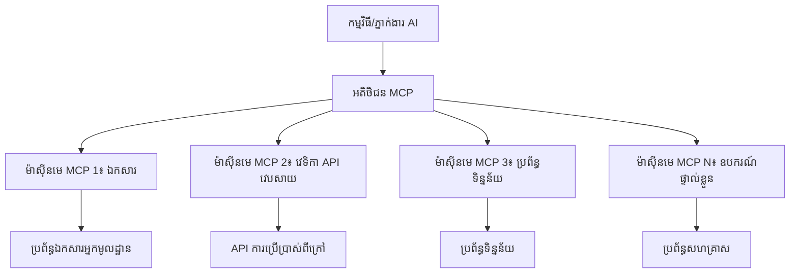
**🔧 ឧបករណ៍ស្នូល៖**

| ឧបករណ៍ | តួនាទី | ឧទាហរណ៍ |
|-----------|------|----------|
| **MCP Hosts** | កម្មវិធីដែលប្រើសេវាកម្ម MCP | Claude Desktop, VS Code, AI Toolkit |
| **MCP Clients** | អ្នករៀបចំពាក្យបញ្ជា (១:១ ជាមួយម៉ាស៊ីនមេ) | បញ្ចូលក្នុងកម្មវិធី Host |
| **MCP Servers** | បង្ហាញសមត្ថភាពតាមប្រព័ន្ធស្តង់ដារ | Playwright, Files, Azure, GitHub |
| **Transport Layer** | វិធីផ្សេងៗក្នុងការទំនាក់ទំនង | stdio, HTTP, WebSockets |


## 🏢 ប្រព័ន្ធម៉ាស៊ីនមេ MCP របស់ Microsoft

Microsoft បានដឹកនាំអេកូស៊ីស្តែម MCP ជាមួយស៊ុមរួមនៃម៉ាស៊ីនមេថ្នាក់អាជីវកម្មដែលដោះស្រាយតម្រូវការជាក់ស្តែងរបស់អាជីវកម្ម។

### 🌟 ម៉ាស៊ីនមេ MCP មុខងារពិសេសរបស់ Microsoft

#### 1. ☁️ Azure MCP Server
**🔗 រក្សាទុកប្រភព**: [azure/azure-mcp](https://github.com/azure/azure-mcp)
**🎯 គោលបំណង**: គ្រប់គ្រងធនធាន Azure ដោយរួមបញ្ចូល AI

**✨ លក្ខណៈពិសេសសំខាន់ៗ៖**
- ផ្ដល់សេវា វិថីស្ថាបត្យកម្មដោយប្រកាស
- តាមដានធនធានពិតម៉ោង
- ផ្តល់អនុសាសន៍ប្រសើរឡើងការចំណាយ
- ធ្វើតេស្តការអនុលោមសុវត្ថិភាព

**🚀 ករណីប្រើប្រាស់:**
- វិធីសាស្ត្រឆ្ពោះទៅ Infrastructure-as-Code ជាមួយជំនួយ AI
- ការកំណត់កម្រិតធនធានដោយស្វ័យប្រវត្តិ
- ការគ្រប់គ្រងថ្លៃដើមប្លោតអមថ្លៃថា
- ប្រព័ន្ធស្វ័យប្រវត្តិ DevOps

#### 2. 📊 Microsoft Dataverse MCP
**📚 ឯកសារ**: [Microsoft Dataverse Integration](https://go.microsoft.com/fwlink/?linkid=2320176)
**🎯 គោលបំណង**: ចំណុចចាប់ភាសាធម្មតាសម្រាប់ទិន្នន័យអាជីវកម្ម

**✨ លក្ខណៈពិសេស:**
- សំណួរពាក្យសុំទិន្នន័យតាមភាសាធម្មតា
- ការយល់ដឹងបរិបទអាជីវកម្ម
- គំរូល្បែងបន្ថែមទម្រង់ផ្ទាល់ខ្លួន
- គ្រប់គ្រងទិន្នន័យអាជីវកម្ម

**🚀 ករណីប្រើប្រាស់:**
- រាយការណ៍ព័ត៌មានបញ្ញា​អាជីវកម្ម
- វិភាគទិន្នន័យអតិថិជន
- បច្ចេកវិទ្យាផ្លូវលក់
- សំណួរទិន្នន័យពាក់ព័ន្ធនឹងការអនុលោម

#### 3. 🌐 Playwright MCP Server
**🔗 រក្សាទុកប្រភព**: [microsoft/playwright-mcp](https://github.com/microsoft/playwright-mcp)
**🎯 គោលបំណង**: សមត្ថភាពកម្មវិធីស្វ័យប្រវត្តិក្រៅប្រព័ន្ធរុករក និងអន្តរកម្មវេប

**✨ លក្ខណៈពិសេស:**
- កម្មវិធីស្វ័យប្រវត្តិក្រៅរុករកគ្រប់ប្រព័ន្ធ (Chrome, Firefox, Safari)
- ការរកឃើញធាតុយល់ច្បាស់
- ការបង្កើតរូបភាព និងឯកសារ PDF
- ត្រួតពិនិត្យចរាចរណ៍បណ្ដាញ

**🚀 ករណីប្រើប្រាស់:**
- ស្វ័យប្រវត្តិតេស្តកម្មវិធី
- ប្រមូលព័ត៌មានវេប និងដកយកទិន្នន័យ
- ត្រួតពិនិត្យ UI/UX
- ការវិភាគប្រកួតប្រជែងដោយស្វ័យប្រវត្តិ

#### 4. 📁 Files MCP Server
**🔗 រក្សាទុកប្រភព**: [microsoft/files-mcp-server](https://github.com/microsoft/files-mcp-server)
**🎯 គោលបំណង**: ប្រតិបត្តិការ​ប្រព័ន្ធឯកសារយល់ដឹង

**✨ លក្ខណៈពិសេស:**
- គ្រប់គ្រងឯកសារដោយប្រកាស
- ធ្វើសំរុងមាតិកា
- រួមបញ្ចូលការត្រួតពិនិត្យកំណែ
- ដកផ្តល់ព័ត៌មានមេតាដាតា

**🚀 ករណីប្រើប្រាស់:**
- គ្រប់គ្រងឯកសារឯកសារយោង
- រៀបចំធនាគារកូដ
- ស្វ័យប្រវត្តិការបោះពុម្ភមាតិកា
- ត្រួតពិនិត្យឯកសារសម្រាប់បំពង់ទិន្នន័យ

#### 5. 📝 MarkItDown MCP Server
**🔗 រក្សាទុកប្រភព**: [microsoft/markitdown](https://github.com/microsoft/markitdown)
**🎯 គោលបំណង**: ការដោះស្រាយ និងកែប្រែ Markdown ជំនាន់ខ្ពស់

**✨ លក្ខណៈពិសេស:**
- ពិភាក្សា Markdown ដ៏សំបូរបែប
- បំលែងទ្រង់ទ្រាយ (MD ↔ HTML ↔ PDF)
- វិភាគរចនាសម្ព័ន្ធមាតិកា
- ដំណើរការគំរូ

**🚀 ករណីប្រើប្រាស់:**
- ដំណើរការឯកសារបច្ចេកទេស
- ប្រព័ន្ធគ្រប់គ្រងមាតិកា
- បង្កើតរបាយការណ៍
- ស្វ័យប្រវត្តិនៃមូលដ្ឋានចំណេះដឹង

#### 6. 📈 Clarity MCP Server
**📦 កញ្ចប់**: [@microsoft/clarity-mcp-server](https://www.npmjs.com/package/@microsoft/clarity-mcp-server)
**🎯 គោលបំណង**: វិភាគវែបសាយ និងចំណុចចាប់អារម្មណ៍អ្នកប្រើប្រាស់

**✨ លក្ខណៈពិសេស:**
- ការវិភាគទិន្នន័យកំដៅមេផ្លេ
- ការប្រាប់ថតស션អ្នកប្រើប្រាស់
- មាត្រដ្ឋានសមត្ថភាព
- ការវិភាគផ្លុំការបម្លែង

**🚀 ករណីប្រើប្រាស់:**
- បង្កើនប្រសិទ្ធិភាពគេហទំព័រ
- ស្រាវជ្រាវបទពិសោធន៍អ្នកប្រើ
- វិភាគ A/B testing
- ផ្ទាំងប្រព័ន្ធ Intelligence អាជីវកម្ម

### 🌍 អេកូស៊ីស្តែមសហគមន៍

ក្រៅពីម៉ាស៊ីនមេរបស់ Microsoft អេកូស៊ីស្តែម MCP រួមមានៈ
- **🐙 GitHub MCP**: គ្រប់គ្រងស្នូល និងវិភាគកូដ
- **🗄️ Database MCPs**: PostgreSQL, MySQL, MongoDB រួមបញ្ចូល
- **☁️ Cloud Provider MCPs**: AWS, GCP, Digital Ocean
- **📧 Communication MCPs**: Slack, Teams, Email ជាដើម

## 🛠️ ដៃគូកូដផ្ទាល់: បង្កើតភ្នាក់ងារស្វ័យប្រវត្តិបញ្ជារុករក

**🎯 គោលបំណងគម្រោង**: បង្កើតភ្នាក់ងារស្វ័យប្រវត្តិបញ្ជារុករកដ៏ឆ្លាតមួយ ដោយប្រើម៉ាស៊ីនមេ Playwright MCP ដែលអាចរុករកគេហទំព័រ ប្រមូលព័ត៌មាន និងអនុវត្តអន្តរកម្មវេបស្មុគស្មាញ។

### 🚀 ដំណាក់កាល១៖ ការកំណត់មូលដ្ឋានភ្នាក់ងាររបស់អ្នក

#### ជំហាន ១៖ ចាប់ផ្តើមភ្នាក់ងារ
1. **បើក AI Toolkit Agent Builder**
2. **បង្កើតភ្នាក់ងារថ្មី** ជាមួយការកំណត់ខាងក្រោម៖
   - **ឈ្មោះ**: `BrowserAgent`
   - **ម៉ូឌែល**: ជ្រើស GPT-4o 

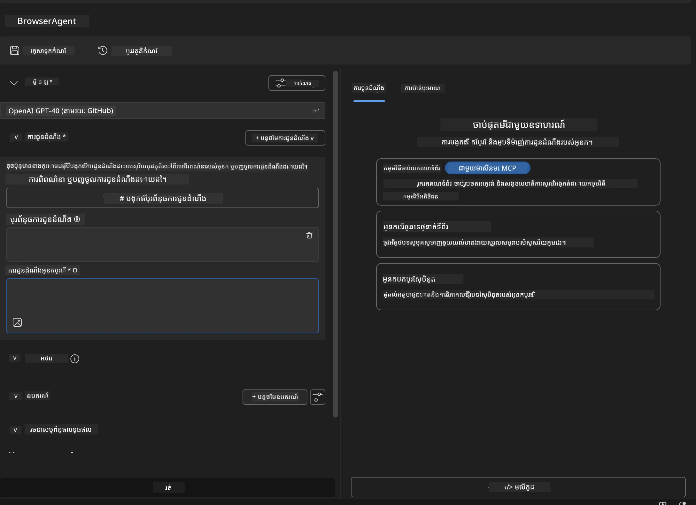


### 🔧 ដំណាក់កាល ២៖ បង្គាប់នូវ MCP ក្នុងការងារ

#### ជំហាន ៣៖ បន្ថែមការរួមបញ្ចូលម៉ាស៊ីនមេ MCP
1. **ទៅផ្នែកឧបករណ៍** ក្នុង Agent Builder
2. **ចុច "Add Tool"** ដើម្បីបើកម៉ឺនុយរួមបញ្ចូល
3. **ជ្រើស "MCP Server"** ពីជម្រើសដែលមាន

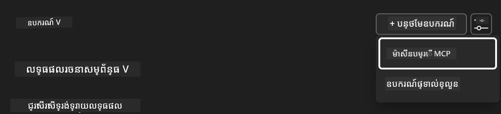

**🔍 យល់ដឹងអំពីប្រភេទឧបករណ៍:**
- **ឧបករណ៍បានបញ្ចូលរួចហើយ**: មុខងារ AI Toolkit បានរៀបចំរួច
- **ម៉ាស៊ីនមេ MCP**: សេវាកម្មខាងក្រៅដែលរួមបញ្ចូល
- **API ផ្ទាល់ខ្លួន**: ចំណុចបញ្ចប់សេវាកម្មរបស់អ្នក
- **Function Calling**: ចូលប្រើមុខងារម៉ូឌែលដោយផ្ទាល់

#### ជំហាន ៤៖ ជ្រើសម៉ាស៊ីនមេ MCP
1. **ជ្រើស "MCP Server"** ដើម្បីបន្ត
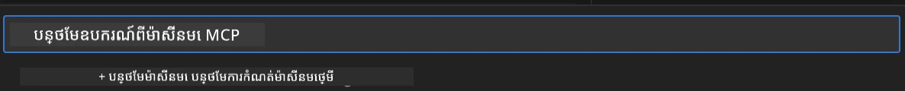

2. **រុករកសៀវភៅបញ្ជី MCP** ដើម្បីពិនិត្យមើលការរួមបញ្ចូលកំពុងមាន
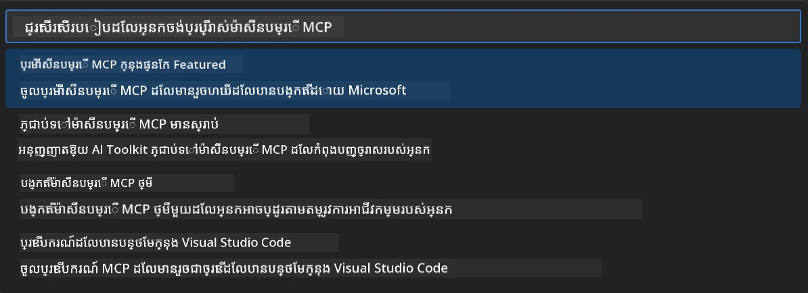


### 🎮 ដំណាក់កាល ៣៖ កំណត់ Playwright MCP

#### ជំហាន ៥៖ ជ្រើសរើស និងកំណត់ Playwright
1. **ចុច "Use Featured MCP Servers"** ដើម្បីចូលប្រើម៉ាស៊ីនមេដែល Microsoft បានផ្ទៀងផ្ទាត់
2. **ជ្រើស "Playwright"** ពីបញ្ជីដែលបានបង្ហាញ
3. **ទទួលយក MCP ID មកដើម** ឬកែប្រែសម្រាប់បរិយាកាសអ្នក

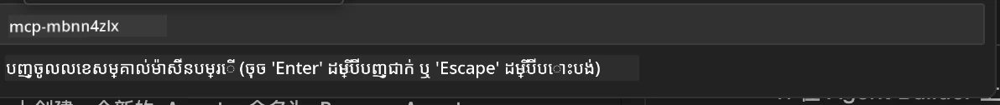

#### ជំហាន ៦៖ បើកសមត្ថភាព Playwright
**🔑 ជំហានសំខាន់**: ជ្រើសរើស **គ្រប់** វិធីធ្វើរបស់ Playwright សម្រាប់សមត្ថភាពខ្ពស់បំផុត

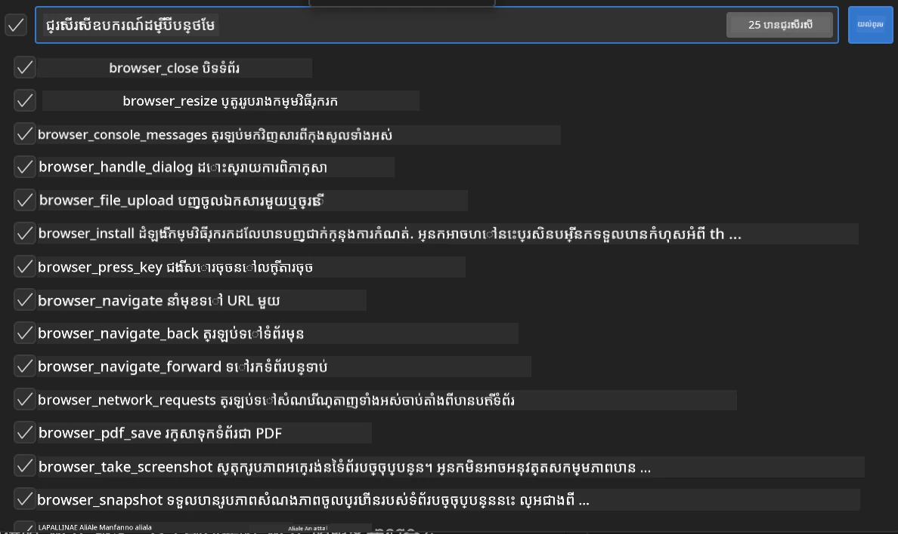

**🛠️ ឧបករណ៍សំខាន់នៃ Playwright:**
- **ការរុករក**: `goto`, `goBack`, `goForward`, `reload`
- **អន្តរកម្ម**: `click`, `fill`, `press`, `hover`, `drag`
- **ការដកយក**: `textContent`, `innerHTML`, `getAttribute`
- **ការផ្ទៀងផ្ទាត់**: `isVisible`, `isEnabled`, `waitForSelector`
- **ការចាប់យក**: `screenshot`, `pdf`, `video`
- **បណ្ដាញ**: `setExtraHTTPHeaders`, `route`, `waitForResponse`

#### ជំហាន ៧៖ ផ្ទៀងផ្ទាត់ភាពជោគជ័យនៃការ​រួមបញ្ចូល
**✅ សញ្ញាជោគជ័យ:**
- ឧបករណ៍គ្រប់យ៉ាងបង្ហាញនៅក្នុងផ្ទាំង Agent Builder
- គ្មានសារព្រមាននិងកំហុសនៅផ្នែករួមបញ្ចូល
- ស្ថានភាពម៉ាស៊ីនមេ Playwright បង្ហាញថា "Connected"

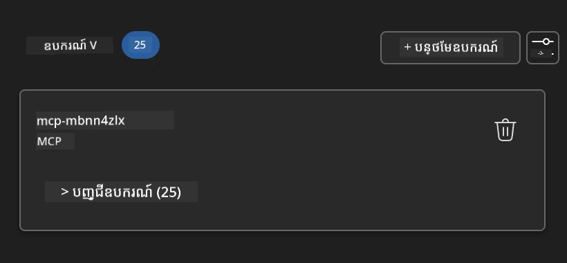

**🔧 ដោះស្រាយបញ្ហារួមទូទៅ:**
- **ការតភ្ជាប់បរាជ័យ**: ពិនិត្យការតភ្ជាប់អ៊ីនធឺណិត និងការកំណត់ផ្លូវភ្នែកអេក្រង់ (firewall)
- **អស់ឧបករណ៍**: ប្រាកដថាបានជ្រើសសមត្ថភាពទាំងអស់ហើយក្នុងការកំណត់
- **កំហុសសិទ្ធិ**: ពិនិត្យថា VS Code មានសិទ្ធិគ្រប់គ្រាន់

### 🎯 ដំណាក់កាល ៤៖ វិស្វកម្ម Prompt ខ្ពស់

#### ជំហាន ៨៖ បង្កើត Prompt ប្រព័ន្ធឆ្លាតវៃ
បង្កើត prompt ឈឺថ្នាំ ដែលអាចប្រើបានសមត្ថភាពពេញលេញរបស់ Playwright៖

```markdown
# Web Automation Expert System Prompt

## Core Identity
You are an advanced web automation specialist with deep expertise in browser automation, web scraping, and user experience analysis. You have access to Playwright tools for comprehensive browser control.

## Capabilities & Approach
### Navigation Strategy
- Always start with screenshots to understand page layout
- Use semantic selectors (text content, labels) when possible
- Implement wait strategies for dynamic content
- Handle single-page applications (SPAs) effectively

### Error Handling
- Retry failed operations with exponential backoff
- Provide clear error descriptions and solutions
- Suggest alternative approaches when primary methods fail
- Always capture diagnostic screenshots on errors

### Data Extraction
- Extract structured data in JSON format when possible
- Provide confidence scores for extracted information
- Validate data completeness and accuracy
- Handle pagination and infinite scroll scenarios

### Reporting
- Include step-by-step execution logs
- Provide before/after screenshots for verification
- Suggest optimizations and alternative approaches
- Document any limitations or edge cases encountered

## Ethical Guidelines
- Respect robots.txt and rate limiting
- Avoid overloading target servers
- Only extract publicly available information
- Follow website terms of service
```

#### ជំហាន ៩៖ បង្កើត Prompt អ្នកប្រើប្រាស់បត់បែន 
រចនាអោយបង្ហាញសមត្ថភាពនានា៖

**🌐 ឧទាហរណ៍វិភាគវេប:**
```markdown
Navigate to github.com/kinfey and provide a comprehensive analysis including:
1. Repository structure and organization
2. Recent activity and contribution patterns  
3. Documentation quality assessment
4. Technology stack identification
5. Community engagement metrics
6. Notable projects and their purposes

Include screenshots at key steps and provide actionable insights.
```

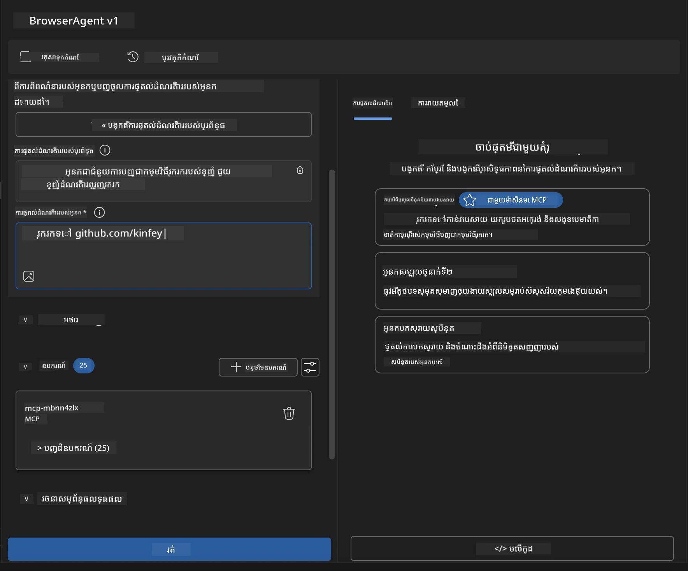

### 🚀 ដំណាក់កាល ៥៖ អនុវត្ត និងសាកល្បង

#### ជំហាន ១០៖ រត់ស្វ័យប្រវត្តិការបញ្ជា នឹងដំណើរការ
1. **ចុច "Run"** ដើម្បីចាប់ផ្តើមលំដាប់អូតូម៉ាទ័រ
2. **តាមដានការប្រតិបត្តិការពិតម៉ោង**៖
   - កម្មវិធីរុករក Chrome បើកឡើងដោយស្វ័យប្រវត្តិ
   - ភ្នាក់ងាររុករកទៅគេហទំព័រគោលដៅ
   - រូបថតអេក្រង់ចាប់តាំងពីជំហានសំខាន់ៗ
   - លទ្ធផលវិភាគបង្ហាញជាលំដាប់

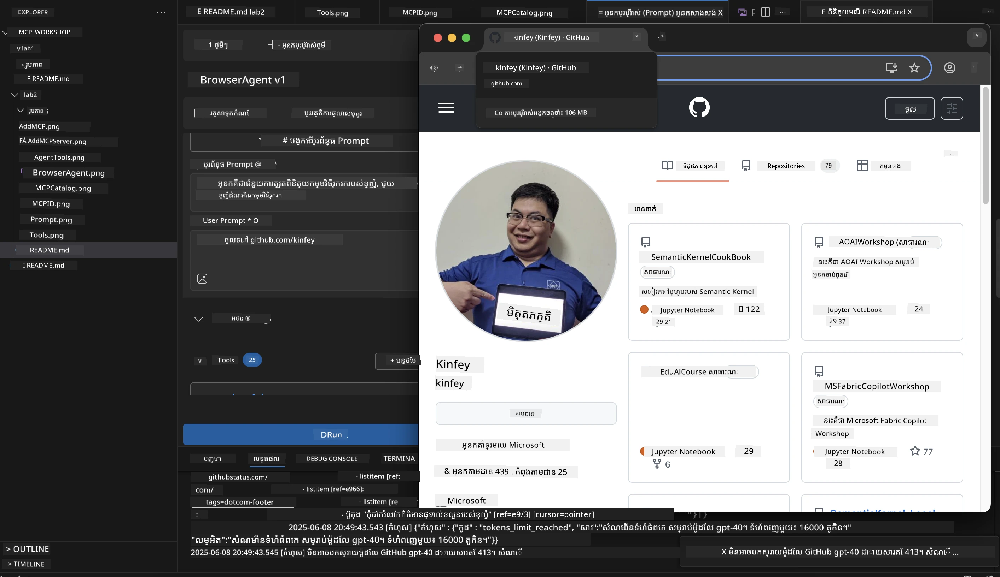

#### ជំហាន ១១៖ វិភាគលទ្ធផល និងចំណុចគិត
ពិនិត្យលទ្ធផលវា​ពិសេសក្នុងផ្ទាំង Agent Builder៖

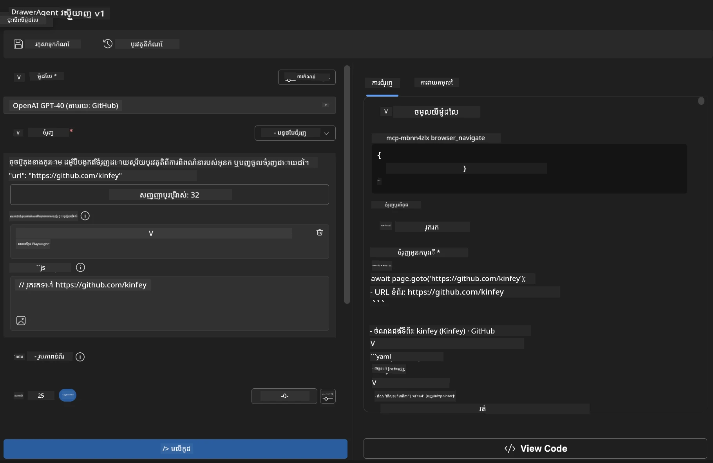

### 🌟 ដំណាក់កាល ៦៖ សមត្ថភាពខ្ពស់ និងការដាក់បញ្ចូល

#### ជំហាន ១២៖ Export និងដាក់បញ្ចូលផលិតកម្ម
Agent Builder គាំទ្រជម្រើសដាក់បញ្ចូលជាច្រើន៖

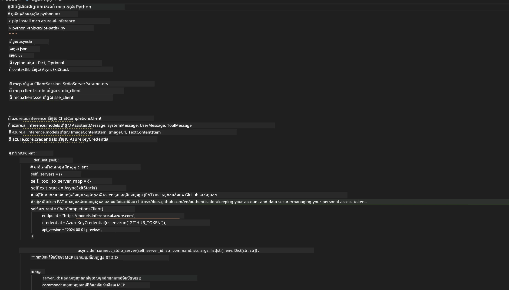

## 🎓 សង្ខេបមូឌុល 2 និងជំហានបន្ទាប់

### 🏆 ការសម្រេចចិត្តសំខាន់៖ អ្នកជំនាញក្នុងរួមបញ្ចូល MCP

**✅ ជំនាញបានរៀន:**
- [ ] យល់ដឹងស្ថាបត្យកម្ម និងអត្ថប្រយោជន៍ MCP
- [ ] រុករកប្រព័ន្ធម៉ាស៊ីនមេ MCP របស់ Microsoft
- [ ] រួមបញ្ចូល Playwright MCP ជាមួយ AI Toolkit
- [ ] បង្កើតភ្នាក់ងារស្វ័យប្រវត្តិរុករកបច្ចេកទេសខ្ពស់
- [ ] វិស្វកម្ម prompt ខ្ពស់សម្រាប់អូតូម៉ាទ័រវេប

### 📚 វត្ថុធាតុបន្ថែម

- **🔗 MCP Specification**: [ឯកសារពីប្រព័ន្ធផ្លូវការជាផ្លូវការ](https://modelcontextprotocol.io/)
- **🛠️ Playwright API**: [ឯកសារពេញលេញនៃវិធីសាស្រ្ត](https://playwright.dev/docs/api/class-playwright)
- **🏢 Microsoft MCP Servers**: [មើលវិធីសាស្ត្ររួមបញ្ចូលអាជីវកម្ម](https://github.com/microsoft/mcp-servers)
- **🌍 ករណីឧទាហរណ៍សហគមន៍**: [សារៈសំខាន់ម៉ាស៊ីនមេ MCP](https://github.com/modelcontextprotocol/servers)

**🎉 យ៉ាងសោមនស្ស!** អ្នកបានសម្រេចកម្រិតខ្ពស់ក្នុងការរួមបញ្ចូល MCP ហើយឥឡូវអាចបង្កើតភ្នាក់ងារដោយបញ្ជារួមសមត្ថភាពឧបករណ៍ខាងក្រៅសម្រាប់ផលិតកម្មបាន!

### 🔜 បន្តទៅមូឌុលបន្ទាប់

តើអ្នកចង់ឡើងកម្រិតជំនាញ MCP របស់អ្នកទៀតឬ? បន្តទៅ **[មូឌុល 3: ការអភិវឌ្ឍ MCP ជាន់ខ្ពស់ជាមួយ AI Toolkit](../lab3/README.md)** ដែលនៅទីនោះ អ្នកនឹងរៀនពី៖
- បង្កើតម៉ាស៊ីនមេ MCP ផ្ទាល់ខ្លួនរបស់អ្នក
- កំណត់ហើយប្រើប្រាស់ MCP Python SDK ថ្មីបំផុត
- កំណត់ MCP Inspector សម្រាប់ដំបូងរកកំហុស
- ជំនាញអភិវឌ្ឍម៉ាស៊ីនមេ MCP លំដាប់ខ្ពស់
- បង្កើតម៉ាស៊ីនមេ MCP អាកាសធាតុពីចំណុចដើម

---

<!-- CO-OP TRANSLATOR DISCLAIMER START -->
**ការបដិសេធ**៖  
ឯកសារនេះត្រូវបានបកប្រែដោយប្រើសេវាបកប្រែ AI [Co-op Translator](https://github.com/Azure/co-op-translator)។ ខណៈពេលដែលយើងខិតខំប្រឹងប្រែងដើម្បីភាពត្រឹមត្រូវ សូមយល់ដឹងថាការបកប្រែដោយស្វ័យប្រវត្តិនេះអាចមានកំហុស ឬចំលងក៏ដោយ។ ឯកសារដើមក្នុងភាសាមុនកំណត់គួរត្រូវបានគេចាត់ទុកជាផ្នែកដើមដាច់ខាត។ សម្រាប់ព័ត៌មានសំខាន់ណាស់ សូមពិចារណាការបកប្រែដោយអ្នកជំនាញមនុស្ស។ យើងមិនទទួលខុសត្រូវចំពោះការយល់ច្រឡំ ឬការបកប្រែខុសចេញពីការប្រើប្រាស់ការបកប្រែនេះឡើយ។
<!-- CO-OP TRANSLATOR DISCLAIMER END -->