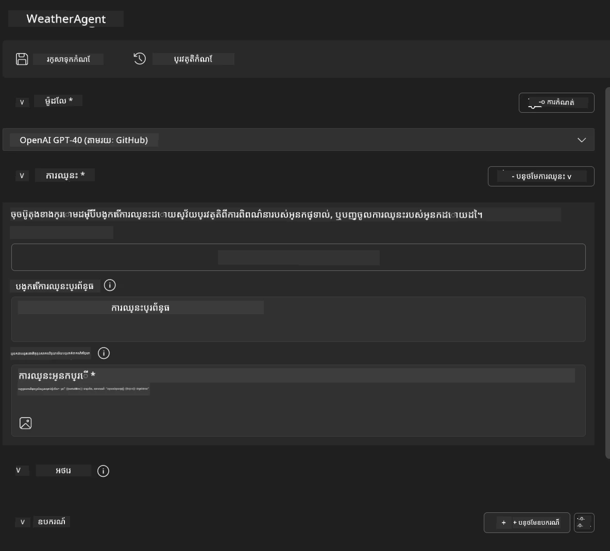
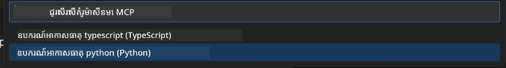
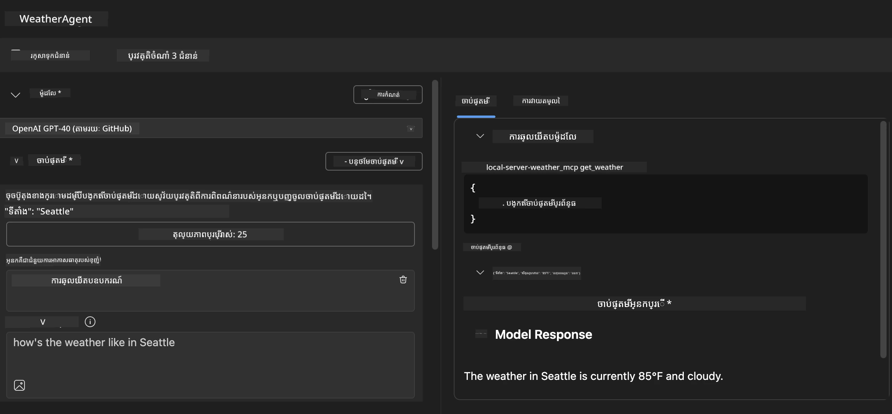
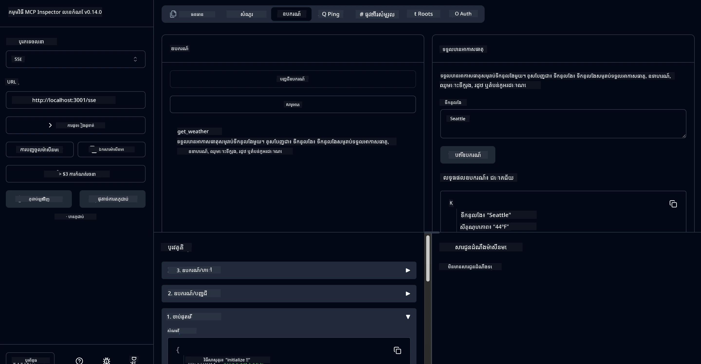

# 🔧 មូឌុល 3៖ ការអភិវឌ្ឍ MCP ជាន់ខ្ពស់ជាមួយឧបករណ៍ AI Toolkit


## 🎯 គោលបំណងសិក្សា

នៅចុងបញ្ចប់មេរៀននេះ អ្នកនឹងអាច៖

- ✅ បង្កើតម៉ាស៊ីនបម្រើ MCP ផ្ទាល់ខ្លួនដោយប្រើ AI Toolkit
- ✅ កំណត់ការនិងប្រើ MCP Python SDK ចុងក្រោយ (ខ្នាត v1.9.3)
- ✅ រៀបចំនិងប្រើ MCP Inspector សម្រាប់ដំណោះស្រាយសតិ្ដ
- ✅ សម្របសម្រួលរាល់ម៉ាស៊ីនបម្រើ MCP នៅទាំងបរិយាកាស Agent Builder និង Inspector
- ✅ យល់ពីដំណើរការអភិវឌ្ឍម៉ាស៊ីនបម្រើ MCP ជាន់ខ្ពស់

## 📋 លក្ខខណ្ឌមុនប្រកប

- បានបញ្ចប់មេរៀន Lab 2 (មូលដ្ឋាន MCP)
- មានកម្មវិធី VS Code ជាមួយផ្នែកបន្ថែម AI Toolkit តម្លើងរួច
- បរិយាកាស Python 3.10+ 
- Node.js និង npm សម្រាប់រៀបចំ Inspector

## 🏗️ អ្វីដែលអ្នកនឹងបង្កើត

ក្នុងមេរៀននេះ អ្នកនឹងបង្កើត **ម៉ាស៊ីនបម្រើ Weather MCP** ដែលបង្ហាញពី៖
- ការអនុវត្តម៉ាស៊ីនបម្រើ MCP ផ្ទាល់ខ្លួន
- ការភ្ជាប់ជាមួយ AI Toolkit Agent Builder
- ដំណើរការដោះស្រាយម៉ាស៊ីនបម្រើដោយជំនាញវិជ្ជាជីវៈ
- ការប្រើប្រាស់ MCP SDK ដ៏ទំនើប

---

## 🔧 ពិការណ៍សំខាន់ៗរបស់ម៉ូឌុល

### 🐍 MCP Python SDK
MCP Python SDK ផ្តល់មូលដ្ឋានសម្រាប់ស្ថាបនាម៉ាស៊ីនបម្រើ MCP ផ្ទាល់ខ្លួន។ អ្នកនឹងប្រើខ្នាត 1.9.3 ជាមួយមុខងារដោះស្រាយមានប្រសិទ្ធភាពកាន់តែខ្ពស់។

### 🔍 MCP Inspector
ឧបករណ៍ដោះស្រាយខុសត្រូវខ្លាំង ដែលផ្តល់៖
- ការត្រួតពិនិត្យម៉ាស៊ីនបម្រើពេលវេលានឹង
- ការមើលមាត់រការប្រតិបត្តិឧបករណ៍
- ការត្រួតពិនិត្យសំណើ/ចម្លើយបណ្តាញ
- បរិយាកាសសាកល្បងអន្តរាគមន៍

---

## 📖 ដំណើរការអនុវត្តពីដំណាក់កាលមួយទៅមួយ

### ជំហាន 1៖ បង្កើត WeatherAgent ក្នុង Agent Builder

1. **បើក Agent Builder** នៅក្នុង VS Code តាមផ្នែកបន្ថែម AI Toolkit
2. **បង្កើត agent ថ្មី** ជាមួយការកំណត់ដូចខាងក្រោម៖
   - ឈ្មោះ Agent៖ `WeatherAgent`



### ជំហាន 2៖ ចាប់ផ្តើមគម្រោង MCP Server

1. **ចូល Tools** → **Add Tool** នៅក្នុង Agent Builder
2. **ជ្រើស "MCP Server"** ពីជម្រើសដែលមាន
3. **ជ្រើស "Create A new MCP Server"**
4. **ជ្រើសរចនាសម្ព័ន្ធ `python-weather`**
5. **ដាក់ឈ្មោះម៉ាស៊ីនបម្រើ៖** `weather_mcp`



### ជំហាន 3៖ បើកនិងពិនិត្យគម្រោង

1. **បើកគម្រោងដែលបានបង្កើត** នៅក្នុង VS Code
2. **ពិនិត្យរចនាសម្ព័ន្ធគម្រោង៖**
   ```
   weather_mcp/
   ├── src/
   │   ├── __init__.py
   │   └── server.py
   ├── inspector/
   │   ├── package.json
   │   └── package-lock.json
   ├── .vscode/
   │   ├── launch.json
   │   └── tasks.json
   ├── pyproject.toml
   └── README.md
   ```

### ជំហាន 4៖ ធ្វើបច្ចុប្បន្នភាពទៅ MCP SDK ចុងក្រោយ

> **🔍 ហេតុអ្វីត្រូវបច្ចុប្បន្នភាព?** យើងចង់ប្រើ MCP SDK ចុងក្រោយ (v1.9.3) និងសេវាកម្ម Inspector (0.14.0) សម្រាប់មុខងារកែលម្អ និងដោះស្រាយមានប្រសិទ្ធភាពខ្ពស់។

#### 4a. ធ្វើបច្ចុប្បន្នភាពផ្នែកដេប៉ាំ Python

**កែសម្រួល `pyproject.toml`:** បច្ចុប្បន្នភាព [./code/weather_mcp/pyproject.toml](../../../../10-StreamliningAIWorkflowsBuildingAnMCPServerWithAIToolkit/lab3/code/weather_mcp/pyproject.toml)


#### 4b. ធ្វើបច្ចុប្បន្នភាពការកំណត់ Inspector

**កែសម្រួល `inspector/package.json`:** បច្ចុប្បន្នភាព [./code/weather_mcp/inspector/package.json](../../../../10-StreamliningAIWorkflowsBuildingAnMCPServerWithAIToolkit/lab3/code/weather_mcp/inspector/package.json)

#### 4c. ធ្វើបច្ចុប្បន្នភាពផ្នែកដេប៉ាំ Inspector

**កែសម្រួល `inspector/package-lock.json`:** បច្ចុប្បន្នភាព [./code/weather_mcp/inspector/package-lock.json](../../../../10-StreamliningAIWorkflowsBuildingAnMCPServerWithAIToolkit/lab3/code/weather_mcp/inspector/package-lock.json)

> **📝 បញ្ជាក់:** ឯកសារនេះមានការកំណត់ផ្នែកដេប៉ាំយ៉ាងពិសេស។ ខាងក្រោមនេះជារចនាសម្ព័ន្ធសំខាន់ៗ - មាតិកាសរុបធានាការដោះស្រាយផ្នែកដេប៉ាំត្រឹមត្រូវ។

> **⚡ ហេតុអ្វីហៅ package-lock ពេញលេញ៖**ឯកសារ package-lock.json ពេញលេញ រួមបញ្ចូល ~3000 បន្ទាត់នៃការកំណត់ផ្នែកដេប៉ាំ។ ខាងលើបង្ហាញរចនាសម្ព័ន្ធសំខាន់ៗ – សូមប្រើឯកសារដែលផ្តល់សម្រាប់ការដោះស្រាយដែរទាំងមូល។

### ជំហាន 5៖ កំណត់ការដោះស្រាយកំហុស VS Code

*សម្គាល់៖ សូមចម្លងឯកសារនៅទីតាំងដែលបានបញ្ជាក់ដើម្បីជំនួសឯកសារផ្ទាល់ខ្លួន*

#### 5a. បច្ចុប្បន្នភាពការកំណត់ Launch

**កែសម្រួល `.vscode/launch.json`:**

```json
{
  "version": "0.2.0",
  "configurations": [
    {
      "name": "Attach to Local MCP",
      "type": "debugpy",
      "request": "attach",
      "connect": {
        "host": "localhost",
        "port": 5678
      },
      "presentation": {
        "hidden": true
      },
      "internalConsoleOptions": "neverOpen",
      "postDebugTask": "Terminate All Tasks"
    },
    {
      "name": "Launch Inspector (Edge)",
      "type": "msedge",
      "request": "launch",
      "url": "http://localhost:6274?timeout=60000&serverUrl=http://localhost:3001/sse#tools",
      "cascadeTerminateToConfigurations": [
        "Attach to Local MCP"
      ],
      "presentation": {
        "hidden": true
      },
      "internalConsoleOptions": "neverOpen"
    },
    {
      "name": "Launch Inspector (Chrome)",
      "type": "chrome",
      "request": "launch",
      "url": "http://localhost:6274?timeout=60000&serverUrl=http://localhost:3001/sse#tools",
      "cascadeTerminateToConfigurations": [
        "Attach to Local MCP"
      ],
      "presentation": {
        "hidden": true
      },
      "internalConsoleOptions": "neverOpen"
    }
  ],
  "compounds": [
    {
      "name": "Debug in Agent Builder",
      "configurations": [
        "Attach to Local MCP"
      ],
      "preLaunchTask": "Open Agent Builder",
    },
    {
      "name": "Debug in Inspector (Edge)",
      "configurations": [
        "Launch Inspector (Edge)",
        "Attach to Local MCP"
      ],
      "preLaunchTask": "Start MCP Inspector",
      "stopAll": true
    },
    {
      "name": "Debug in Inspector (Chrome)",
      "configurations": [
        "Launch Inspector (Chrome)",
        "Attach to Local MCP"
      ],
      "preLaunchTask": "Start MCP Inspector",
      "stopAll": true
    }
  ]
}
```

**កែសម្រួល `.vscode/tasks.json`:**

```
{
  "version": "2.0.0",
  "tasks": [
    {
      "label": "Start MCP Server",
      "type": "shell",
      "command": "python -m debugpy --listen 127.0.0.1:5678 src/__init__.py sse",
      "isBackground": true,
      "options": {
        "cwd": "${workspaceFolder}",
        "env": {
          "PORT": "3001"
        }
      },
      "problemMatcher": {
        "pattern": [
          {
            "regexp": "^.*$",
            "file": 0,
            "location": 1,
            "message": 2
          }
        ],
        "background": {
          "activeOnStart": true,
          "beginsPattern": ".*",
          "endsPattern": "Application startup complete|running"
        }
      }
    },
    {
      "label": "Start MCP Inspector",
      "type": "shell",
      "command": "npm run dev:inspector",
      "isBackground": true,
      "options": {
        "cwd": "${workspaceFolder}/inspector",
        "env": {
          "CLIENT_PORT": "6274",
          "SERVER_PORT": "6277",
        }
      },
      "problemMatcher": {
        "pattern": [
          {
            "regexp": "^.*$",
            "file": 0,
            "location": 1,
            "message": 2
          }
        ],
        "background": {
          "activeOnStart": true,
          "beginsPattern": "Starting MCP inspector",
          "endsPattern": "Proxy server listening on port"
        }
      },
      "dependsOn": [
        "Start MCP Server"
      ]
    },
    {
      "label": "Open Agent Builder",
      "type": "shell",
      "command": "echo ${input:openAgentBuilder}",
      "presentation": {
        "reveal": "never"
      },
      "dependsOn": [
        "Start MCP Server"
      ],
    },
    {
      "label": "Terminate All Tasks",
      "command": "echo ${input:terminate}",
      "type": "shell",
      "problemMatcher": []
    }
  ],
  "inputs": [
    {
      "id": "openAgentBuilder",
      "type": "command",
      "command": "ai-mlstudio.agentBuilder",
      "args": {
        "initialMCPs": [ "local-server-weather_mcp" ],
        "triggeredFrom": "vsc-tasks"
      }
    },
    {
      "id": "terminate",
      "type": "command",
      "command": "workbench.action.tasks.terminate",
      "args": "terminateAll"
    }
  ]
}
```


---

## 🚀 រត់ និងសាកល្បងម៉ាស៊ីនបម្រើ MCP របស់អ្នក

### ជំហាន 6៖ ដំឡើងផ្នែកដេប៉ាំ

បន្ទាប់ពីធ្វើការផ្លាស់ប្ដូរកំណត់ សូមរត់ពាក្យបញ្ជាដូចខាងក្រោម៖

**ដំឡើងផ្នែកដេប៉ាំ Python:**
```bash
uv sync
```

**ដំឡើងផ្នែកដេប៉ាំ Inspector:**
```bash
cd inspector
npm install
```

### ជំហាន 7៖ ដោះស្រាយកំហុសជាមួយ Agent Builder

1. **ចុច F5** ឬប្រើការកំណត់ **"Debug in Agent Builder"**
2. **ជ្រើសការកំណត់សមាសភាព** ពីផ្ទាំងដោះស្រាយកំហុស
3. **រង់ចាំម៉ាស៊ីនបម្រើចាប់ផ្តើម** និងបើក Agent Builder
4. **សាកល្បងម៉ាស៊ីនបម្រើ weather MCP របស់អ្នក** ជាមួយសំណួរភាសាធម្មជាតិ

បញ្ចូលបញ្ហាជាដូចខាងក្រោម

SYSTEM_PROMPT

```
You are my weather assistant
```

USER_PROMPT

```
How's the weather like in Seattle
```



### ជំហាន 8៖ ដោះស្រាយកំហុសជាមួយ MCP Inspector

1. **ប្រើការកំណត់ "Debug in Inspector"** (Edge រឺ Chrome)
2. **បើកផ្ទាំង Inspector នៅ `http://localhost:6274`**
3. **រុករកបរិយាកាសសាកល្បងអន្តរាគមន៍៖**
   - មើលឧបករណ៍ដែលមានស្រាប់
   - សាកល្បងប្រតិបត្តិការឧបករណ៍
   - ត្រួតពិនិត្យសំណើបណ្តាញ
   - ដោះស្រាយចម្លើយម៉ាស៊ីនបម្រើ



---

## 🎯 លទ្ធផលសំខាន់ៗក្នុងការសិក្សា

ដោយបញ្ចប់មេរៀននេះ អ្នកបាន៖

- [x] **បង្កើតម៉ាស៊ីនបម្រើ MCP ផ្ទាល់ខ្លួន** ដោយប្រើមាតិការបស់ AI Toolkit
- [x] **ធ្វើបច្ចុប្បន្នភាពទៅ MCP SDK ចុងក្រោយ** (v1.9.3) សម្រាប់មុខងារកែលម្អ
- [x] **កំណត់ដំណើរការដោះស្រាយកំហុសជំនាញវិជ្ជាជីវៈ** សម្រាប់រួមគ្នា Agent Builder និង Inspector
- [x] **រៀបចំ MCP Inspector** សម្រាប់សាកល្បងម៉ាស៊ីនបម្រើអន្តរាគមន៍
- [x] **ចេះភ្ជាប់ VS Code ជាមួយដំណើរការដោះស្រាយកំហុស** សម្រាប់អភិវឌ្ឍ MCP

## 🔧 មុខងារជាន់ខ្ពស់ដែលបានសិក្សា

| មុខងារ | ការពិពណ៌នា | ករណីប្រើប្រាស់ |
|---------|-------------|----------------|
| **MCP Python SDK v1.9.3** | ការអនុវត្តន៍ពិធីការចុងក្រោយ | ការអភិវឌ្ឍម៉ាស៊ីនបម្រើទំនើប |
| **MCP Inspector 0.14.0** | ឧបករណ៍ដោះស្រាយកំហុសអន្តរាគមន៍ | សាកល្បងម៉ាស៊ីនបម្រើពេលវេលានឹង |
| **VS Code Debugging** | បរិយាកាសអភិវឌ្ឍគ្រប់ជ្រុង | ដំណើរការដោះស្រាយកំហុសជំនាញវិជ្ជាជីវៈ |
| **ការភ្ជាប់ Agent Builder** | ការតភ្ជាប់ផ្ទាល់ AI Toolkit | សាកល្បងរួមគ្នាជាមួយ agent |

## 📚 សេចក្ដីអភិវឌ្ឍន៍បន្ថែម

- [ឯកសារ MCP Python SDK](https://modelcontextprotocol.io/docs/sdk/python)
- [មគ្គុទេសក៍ផ្នែកបន្ថែម AI Toolkit](https://code.visualstudio.com/docs/ai/ai-toolkit)
- [ឯកសារ VS Code ការដោះស្រាយកំហុស](https://code.visualstudio.com/docs/editor/debugging)
- [លក្ខណៈពិសេស Model Context Protocol](https://modelcontextprotocol.io/docs/concepts/architecture)

---

**🎉 បាទ/ចាស!** អ្នកបានបញ្ចប់ Lab 3 ដោយជោគជ័យ ហើយឥឡូវអាចបង្កើត ដោះស្រាយកំហុស និងចេញផ្សាយម៉ាស៊ីនបម្រើ MCP ផ្ទាល់ខ្លួនដោយប្រើដំណើរការអភិវឌ្ឍជំនាញវិជ្ជាជីវៈ។

### 🔜 បន្តទៅមូឌុលបន្ទាប់

ពាសពេញចិត្តច្បាស់ចង់ផ្លាស់ប្តូរជំនាញ MCP របស់អ្នកទៅដំណើរការអភិវឌ្ឍពិតប្រាកដ? បន្តទៅ **[Module 4: Practical MCP Development - Custom GitHub Clone Server](../lab4/README.md)** ដែលអ្នកនឹង៖
- ស្ថាបនាម៉ាស៊ីនបម្រើ MCP ដែលមានភាពរឹងមាំសម្រាប់ដំណើរការកម្មវិធី GitHub
- អនុវត្តមុខងារចម្លង repository GitHub តាម MCP
- ភ្ជាប់ម៉ាស៊ីនបម្រើ MCP ផ្ទាល់ខ្លួនជាមួយ VS Code និង GitHub Copilot Agent Mode
- សាកល្បង និងចេញផ្សាយម៉ាស៊ីនបម្រើ MCP ផ្ទាល់ខ្លួននៅក្នុងបរិយាកាសផលិតកម្ម
- រៀនអំពីដំណើរការអូតូមាតិកសម្រាប់អ្នកអភិវឌ្ឍន៍

---

<!-- CO-OP TRANSLATOR DISCLAIMER START -->
**ការបដិសេធ**៖  
ឯកសារនេះត្រូវបានបកប្រែដោយប្រើសេវាកម្មបកប្រែ AI [Co-op Translator](https://github.com/Azure/co-op-translator)។ ទោះយើងខិតខំប្រឹងប្រែងដើម្បីភាពត្រឹមត្រូវ យើងសូមជំរាបថា ការបកប្រែដោយស្វ័យប្រវត្តិនោះអាចមានកំហុសឬការមិនត្រឹមត្រូវ។ ឯកសារដើមក្នុងភាសា​ដើមគួរត្រូវបាននិយាយថាជា ប្រភពដែលមានសិទ្ធិសម្រេចចិត្ត។ សម្រាប់ព័ត៌មានសំខាន់ៗ យោងជាបកប្រែដោយមនុស្សដែលជាជំនាញគឺត្រូវបានផ្តល់អនុសាសន៍។ យើងមិនទទួលខុសត្រូវចំពោះការយល់ច្រឡំណ ឬការបកប្រែខុសប្លែកណាមួយដែលមានដំណើរការពីការប្រើប្រាស់ការបកប្រែនេះឡើយ។
<!-- CO-OP TRANSLATOR DISCLAIMER END -->