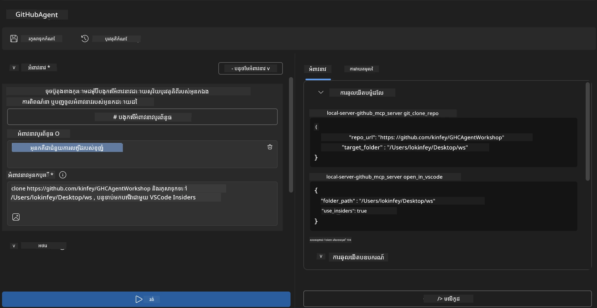
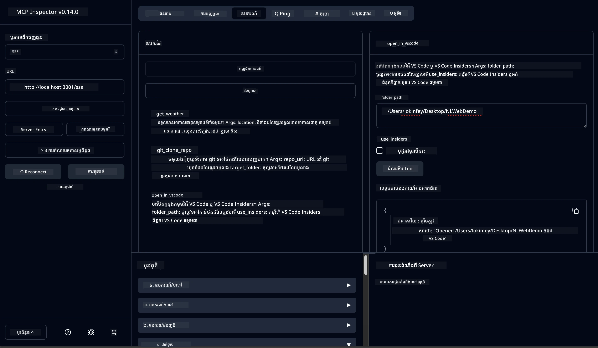

# 🐙 ម៉ូឌុល 4៖ ការអភិវឌ្ឍ MCP ដោយអនុវត្តច្បាស់ - ម៉ាស៊ីនមេ GitHub Clone ផ្ទាល់ខ្លួន


> **⚡ ចាប់ផ្តើមរហ័ស៖** បង្កើតម៉ាស៊ីនមេ MCP សម្រាប់ផលិតកម្មដែលអាចដំណើរការការចម្លងគ្រប់គ្រង GitHub repository និងការរួមបញ្ចូលជាមួយ VS Code នៅក្នុង ៣០ នាទីប៉ុណ្ណោះ!

## 🎯 គោលបំណងរៀន

នៅចុងបញ្ចប់ការបង្រៀននេះ អ្នកនឹងអាច:

- ✅ បង្កើតម៉ាស៊ីនមេ MCP ផ្ទាល់ខ្លួនសម្រាប់ដំណើរការអភិវឌ្ឍពិតប្រាកដ
- ✅ អនុវត្តមុខងារចម្លង GitHub repository តាមរយៈ MCP
- ✅ រួមបញ្ចូលម៉ាស៊ីនមេ MCP ផ្ទាល់ខ្លួនជាមួយ VS Code និង Agent Builder
- ✅ ប្រើម៉ូដ GitHub Copilot Agent ជាមួយឧបករណ៍ MCP ផ្ទាល់ខ្លួន
- ✅ សាកល្បង និងដាក់ចេញម៉ាស៊ីនមេ MCP ផ្ទាល់ខ្លួនក្នុងបរិយាកាសផលិតកម្ម

## 📋 គ្រាប់ពហុចាំបាច់

- បញ្ចប់ការងារមេ Lab 1-3 (គ្រឹះ MCP និងអភិវឌ្ឍកម្រិតខ្ពស់)
- ជាវ GitHub Copilot ([ចុះឈ្មោះដោយឥតគិតថ្លៃមានស្រាប់](https://github.com/github-copilot/signup))
- VS Code ជាមួយបណ្ណាល័យ AI Toolkit និង បន្ថែម GitHub Copilot
- Git CLI បានដំឡើងនិងកំណត់រចនា

## 🏗️ រូបមន្តគម្រោង

### **សម្រួលការអភិវឌ្ឍពិតប្រាកដនៅពិភពលោក**
ក្នុងនាមជាអ្នកអភិវឌ្ឍ យើងខ្លួនញឹកញាប់ប្រើ GitHub ដើម្បីចម្លង repository ហើយបើកវា​ក្នុង VS Code ឬ VS Code Insiders។ ដំណើរការដោយដៃនេះមាន៖
1. បើក terminal/command prompt
2. ទៅកាន់ថតដែលចង់បាន
3. រត់ពាក្យបញ្ជា `git clone`
4. បើក VS Code ក្នុងថតដែលបានចម្លង

**ដំណោះស្រាយ MCP របស់យើងបង្កើតទាំងវាក្នុងពាក្យបញ្ជាដែលប្រាជ្ញា​ដោយមួយតែមួយ!**

### **អ្វីដែលអ្នកនឹងបង្កើត**
ម៉ាស៊ីនមេ **GitHub Clone MCP Server** (`git_mcp_server`) ដែលផ្តល់:

| មុខងារ | សេចក្ដីពិពណ៌នា | អត្ថប្រយោជន៍ |
|---------|-----------------|----------------|
| 🔄 **ចម្លង Repository ជាប្រាជ្ញា** | ចម្លង GitHub repo ជាមួយការត្រួតពិនិត្យ | ពិនិត្យកំហុសដោយស្វ័យប្រវត្តិ |
| 📁 **គ្រប់គ្រងថតលក្ខណៈប្រាជ្ញា** | ពិនិត្យ និងបង្កើតថតដោយសុវត្ថិភាព | ជៀសវាងការ​លិចបំផ្លាញ​ថត |
| 🚀 **រួមបញ្ចូល VS Code លើម៉ាស៊ីនផ្សេងៗ** | បើកគម្រោងក្នុង VS Code/Insiders | ផ្លាស់ប្តូរការងារយ៉ាងរាបសារ |
| 🛡️ **ដោះស្រាយ​កំហុសរឹងមាំ** | ដោះស្រាយបញ្ហាបណ្តាញ សិទ្ធិ និងផ្លូវ | ជឿជាក់ក្នុងផលិតកម្ម |

---

## 📖 ដំណើរការអនុវត្តជំហាន​មួយៗ

### ជំហានទី 1៖ បង្កើត GitHub Agent ក្នុង Agent Builder

1. **បើក Agent Builder** តាមឧបករណ៍ AI Toolkit
2. **បង្កើត agent ថ្មី** ជាមួយការកំណត់ដូចខាងក្រោម:
   ```
   Agent Name: GitHubAgent
   ```

3. **ចាប់ផ្តើមម៉ាស៊ីនមេ MCP ផ្ទាល់ខ្លួន:**
   - ទៅកាន់ **Tools** → **Add Tool** → **MCP Server**
   - ជ្រើស **"Create A new MCP Server"**
   - ជ្រើស **តំរូវ Python** សម្រាប់ភាពបត់បែនខ្ពស់
   - **ឈ្មោះម៉ាស៊ីនមេ:** `git_mcp_server`

### ជំហានទី 2៖ កំណត់ម៉ូដ GitHub Copilot Agent

1. **បើក GitHub Copilot** នៅក្នុង VS Code (Ctrl/Cmd + Shift + P → "GitHub Copilot: Open")
2. **ជ្រើសរើសម៉ូដែល Agent** ក្នុងចំណុចបញ្ជាដែល Copilot មាន
3. **ជ្រើសម៉ូដែល Claude 3.7** សម្រាប់សមត្ថភាពក្នុងការគិត
4. **បើកការរួមបញ្ចូល MCP** ដើម្បីចូលប្រើឧបករណ៍

> **💡 គំនិតជំនួយ៖** Claude 3.7 ផ្តល់ការយល់ដឹងខ្ពស់លើដំណើរការអភិវឌ្ឍន៍ និងគំរោងដោះស្រាយកំហុស។

### ជំហានទី 3៖ អនុវត្តមុខងារ​មូលដ្ឋាននៃម៉ាស៊ីនមេ MCP

**ប្រើការបញ្ជាក់​លម្អិតខាងក្រោម​ជាមួយម៉ូដ GitHub Copilot Agent:**

```
Create two MCP tools with the following comprehensive requirements:

🔧 TOOL A: clone_repository
Requirements:
- Clone any GitHub repository to a specified local folder
- Return the absolute path of the successfully cloned project
- Implement comprehensive validation:
  ✓ Check if target directory already exists (return error if exists)
  ✓ Validate GitHub URL format (https://github.com/user/repo)
  ✓ Verify git command availability (prompt installation if missing)
  ✓ Handle network connectivity issues
  ✓ Provide clear error messages for all failure scenarios

🚀 TOOL B: open_in_vscode
Requirements:
- Open specified folder in VS Code or VS Code Insiders
- Cross-platform compatibility (Windows/Linux/macOS)
- Use direct application launch (not terminal commands)
- Auto-detect available VS Code installations
- Handle cases where VS Code is not installed
- Provide user-friendly error messages

Additional Requirements:
- Follow MCP 1.9.3 best practices
- Include proper type hints and documentation
- Implement logging for debugging purposes
- Add input validation for all parameters
- Include comprehensive error handling
```

### ជំហានទី 4៖ សាកល្បងម៉ាស៊ីនមេ MCP របស់អ្នក

#### 4a. សាកល្បងក្នុង Agent Builder

1. **បើករចនាសម្ព័ន្ធ debug** សម្រាប់ Agent Builder
2. **កំណត់ agent របស់អ្នកជាមួយ prompt ប្រព័ន្ធនេះ:**

```
SYSTEM_PROMPT:
You are my intelligent coding repository assistant. You help developers efficiently clone GitHub repositories and set up their development environment. Always provide clear feedback about operations and handle errors gracefully.
```

3. **សាកល្បងដោយករណីអ្នកប្រើប្រាស់ពិតប្រាកដ:**

```
USER_PROMPT EXAMPLES:

Scenario : Basic Clone and Open
"Clone {Your GitHub Repo link such as https://github.com/kinfey/GHCAgentWorkshop
 } and save to {The global path you specify}, then open it with VS Code Insiders"
```



**លទ្ធផលដែលរំពឹងទុក៖**
- ✅ ចម្លងបានជោគជ័យដើម្បីបញ្ជាក់ផ្លូវ
- ✅ បើក VS Code ដោយស្វ័យប្រវត្តិ
- ✅ ព័ត៌មាន​ជាក់លាក់អំពីកំហុសសម្រាប់ករណីមិនត្រឹមត្រូវ
- ✅ ដោះស្រាយបញ្ហាសាច់ញាតិជាប់ខ្សែបានត្រឹមត្រូវ

#### 4b. សាកល្បងក្នុង MCP Inspector




---


**🎉 សូមអបអរសាទរ!** អ្នកបានបង្កើតបានម៉ាស៊ីនមេ MCP ដែលមានប្រយោជន៍ និងរួចរាល់សម្រាប់ផលិតកម្ម ដើម្បីដោះស្រាយបញ្ហាដំណើរការអភិវឌ្ឍន៍ពិតប្រាកដ។ ម៉ាស៊ីនមេ GitHub clone ផ្ទាល់ខ្លួនរបស់អ្នកបង្ហាញពីសក្ដានុពល MCP សម្រាប់ស្វ័យប្រវត្តិកម្ម និងកែលម្អផលិតភាពអ្នកអភិវឌ្ឍន៍។

### 🏆 សមិទ្ធផលបានទទួល:
- ✅ **អ្នកអភិវឌ្ឍ MCP** - បង្កើតម៉ាស៊ីនមេ MCP ផ្ទាល់ខ្លួន
- ✅ **អ្នករៀបចំដំណើរការ** - ធ្វើឲ្យដំណើរការអភិវឌ្ឍយ៉ាងមានប្រសិទ្ធភាព  
- ✅ **អ្នកជំនាញរួមបញ្ចូល** - ភ្ជាប់ឧបករណ៍អភិវឌ្ឍជាច្រើន
- ✅ **រួចរាល់សម្រាប់ផលិតកម្ម** - បង្កើតដំណោះស្រាយដែលអាចដាក់ចេញបាន

---

## 🎓 បញ្ចប់វគ្គបណ្តុះបណ្តាល៖ ដំណើររបស់អ្នកជាមួយ Model Context Protocol

**អ្នកចូលរួមវគ្គបណ្តុះបណ្តាលជាទីគោរព,**

សូមអបអរសាទរអ្នកបានបញ្ចប់ម៉ូឌុលទាំងបួននៃវគ្គ Model Context Protocol! អ្នកបានភ្លឹកពីមូលដ្ឋាននៃបណ្ណាល័យ AI Toolkit ទៅកាន់ការបង្កើតម៉ាស៊ីនមេ MCP សម្រាប់ផលិតកម្ម ដែលដោះស្រាយបញ្ហាដំណើរការអភិវឌ្ឍពិតប្រាកដ។

### 🚀 សង្ខេបផ្លូវរៀនរបស់អ្នក៖

**[ម៉ូឌុល 1](../lab1/README.md)**៖ អ្នកបានចាប់ផ្តើមដោយស្វែងយល់អំពីគ្រឹះ AI Toolkit, សាកល្បងម៉ូដែល និងបង្កើត AI agent ដំបូងរបស់អ្នក។

**[ម៉ូឌុល 2](../lab2/README.md)**៖ អ្នកបានរៀនអំពីសំណុំរចនាសម្ព័ន្ធ MCP, រួមបញ្ចូល Playwright MCP និងបង្កើត agent ស្វ័យប្រវត្តិbrowser ដំបូង។

**[ម៉ូឌុល 3](../lab3/README.md)**៖ អ្នកបានអភិវឌ្ឍទៅរកម៉ាស៊ីនមេ MCP ផ្ទាល់ខ្លួនជាមួយម៉ាស៊ីនមេ Weather MCP server និងស្គាល់ឧបករណ៍ដោះស្រាយបញ្ហា។

**[ម៉ូឌុល 4](../lab4/README.md)**៖ អ្នកបានអនុវត្តគ្រប់យ៉ាងក្នុងការបង្កើតឧបករណ៍ស្វ័យប្រវត្តិកម្មដំណើរការចម្លង GitHub repository អាជីព។

### 🌟 អ្វីដែលអ្នកបានជំនាញច្បាស់លាស់៖

- ✅ **បរិស្ថាន AI Toolkit**៖ ម៉ូដែល, អ្នកភ្នាក់ងារ និងគំរូការរួមបញ្ចូល
- ✅ **សំណុំរចនាសម្ព័ន្ធ MCP**៖ រចនាម៉ាស៊ីនមេ និងម៉ាស៊ីនភ្ញៀវ, ពិធីខួបដឹកជញ្ជូន និងសុវត្ថិភាព
- ✅ **ឧបករណ៍អ្នកអភិវឌ្ឍ**៖ ចាប់ពី Playground ទៅ Inspector ទៅដល់ដាក់ចេញផលិតកម្ម
- ✅ **អភិវឌ្ឍផ្ទាល់ខ្លួន**៖ ការបង្កើត, សាកល្បង និងដាក់ចេញម៉ាស៊ីនមេ MCP របស់អ្នក
- ✅ **ការអនុវត្តជាក់ស្តែង**៖ ដោះស្រាយបញ្ហាដំណើរការអភិវឌ្ឍពិតប្រាកដជាមួយ AI

### 🔮 ជំហ៊ានបន្ទាប់របស់អ្នក៖

1. **បង្កើតម៉ាស៊ីនមេ MCP របស់អ្នក**៖ អនុវត្តជំនាញនេះដើម្បីស្វ័យប្រវត្តិកម្មដំណើរការផ្ទាល់ខ្លួន
2. **ចូលរួមសហគមន៍ MCP**៖ ចែករំលែកការបង្កើតរបស់អ្នក និងរៀនពីអ្នកផ្សេងទៀត
3. **ស្វែងយល់ការរួមបញ្ចូលកម្រិតខ្ពស់**៖ ភ្ជាប់ម៉ាស៊ីនមេ MCP ទៅប្រព័ន្ធសហគ្រាស
4. **រួមចំណែកក្នុង Open Source**៖ ជួយកែលម្អឧបករណ៍ MCP និងឯកសារ

សូមចងចាំថា វគ្គបណ្តុះបណ្តាលនេះគឺជាចំណុចចាប់ផ្តើមប៉ុណ្ណោះ។ បរិស្ថាន Model Context Protocol កំពុងរីកចម្រើនយ៉ាងឆាប់រហ័ស ហើយអ្នកកំពុងមានសម្ថតភាពនៅក្នុងជំនាន់នៃឧបករណ៍អភិវឌ្ឍដែលគាំទ្រដោយ AI។

**សូមអរគុណចំពោះការចូលរួម និងការប្តេជ្ញាចិត្តក្នុងការរៀន!**

យើងសង្ឃឹមថាវគ្គនេះបានបង្កើតចំណេះដឹងដែលនឹងបំលែងរបៀបដែលអ្នកបង្កើត និងធ្វើអន្តរកម្មជាមួយឧបករណ៍ AI ក្នុងដំណើរអភិវឌ្ឍរបស់អ្នក។

**សូមសំណាងល្អក្នុងការសរសេរកូដ!**

---

## អ្វីទៅជាជំហ៊ានបន្ទាប់

អបអរសាទរអ្នកបានបញ្ចប់គ្រប់ការងារជាក់ស្ដែងក្នុងម៉ូឌុល 10!

- តាមក្រោយទៅ: [សង្ខេបម៉ូឌុល 10](../README.md)
- បន្តទៅ: [ម៉ូឌុល 11៖ មេរៀនស៊ែរម៉ាស៊ីនមេ MCP](../../11-MCPServerHandsOnLabs/README.md)

---

<!-- CO-OP TRANSLATOR DISCLAIMER START -->
**ការបដិសេធ**៖  
ឯកសារនេះត្រូវបានបកប្រែក្នុងការប្រើសេវាកម្មបកប្រែ AI [Co-op Translator](https://github.com/Azure/co-op-translator)។ ខណៈពេលដែលយើងខិតខំរកភាពត្រឹមត្រូវ សូមយល់ឲ្យបានថាការបកប្រែដោយស្វ័យប្រវត្តិអាចមានកំហុសឬភាពមិនត្រឹមត្រូវ។ ឯកសារដើមនៅក្នុងភាសាមាតុភាគគួរត្រូវបានគេពិចារណា​ជា​ប្រភព​តែមួយ​ដែល​ជាក់ស្តែង។ សម្រាប់ព័ត៌មានដ៏សំខាន់ ជំហានបកប្រែដោយមនុស្សជំនាញត្រូវបានណែនាំ។ យើងមិនទទួលខុសត្រូវចំពោះការយល់ច្រឡំ ឬការបកស្រាយខុសពីការប្រើប្រាស់ការបកប្រែនេះឡើយ។
<!-- CO-OP TRANSLATOR DISCLAIMER END -->