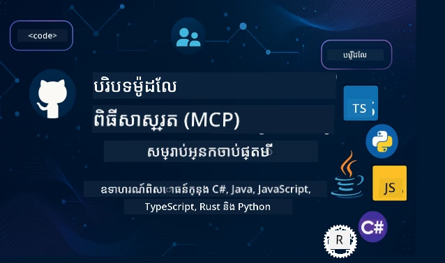

 

[](https://GitHub.com/microsoft/mcp-for-beginners/graphs/contributors)
[](https://GitHub.com/microsoft/mcp-for-beginners/issues)
[](https://GitHub.com/microsoft/mcp-for-beginners/pulls)
[](http://makeapullrequest.com)

[](https://GitHub.com/microsoft/mcp-for-beginners/watchers)
[](https://GitHub.com/microsoft/mcp-for-beginners/fork)
[](https://GitHub.com/microsoft/mcp-for-beginners/stargazers)


[](https://discord.gg/nTYy5BXMWG)

អនុវត្តតាមជំហានទាំងនេះដើម្បីចាប់ផ្ដើមប្រើប្រាស់ធនធានទាំងនេះ៖
1. **Fork the Repository**: ចុច [](https://GitHub.com/microsoft/mcp-for-beginners/fork)
2. **Clone the Repository**:   `git clone https://github.com/microsoft/mcp-for-beginners.git`
3. **Join The** [](https://discord.gg/nTYy5BXMWG)


### 🌐 ការគាំទ្រភាសាប្រព័ន្ធច្រើន

#### គាំទ្រដោយកម្មវិធី GitHub Action (ដោយ​ស្វ័យប្រវត្តិ និងជានិច្ចទាន់សម័យ)

<!-- CO-OP TRANSLATOR LANGUAGES TABLE START -->
[Arabic](../ar/README.md) | [Bengali](../bn/README.md) | [Bulgarian](../bg/README.md) | [Burmese (Myanmar)](../my/README.md) | [Chinese (Simplified)](../zh-CN/README.md) | [Chinese (Traditional, Hong Kong)](../zh-HK/README.md) | [Chinese (Traditional, Macau)](../zh-MO/README.md) | [Chinese (Traditional, Taiwan)](../zh-TW/README.md) | [Croatian](../hr/README.md) | [Czech](../cs/README.md) | [Danish](../da/README.md) | [Dutch](../nl/README.md) | [Estonian](../et/README.md) | [Finnish](../fi/README.md) | [French](../fr/README.md) | [German](../de/README.md) | [Greek](../el/README.md) | [Hebrew](../he/README.md) | [Hindi](../hi/README.md) | [Hungarian](../hu/README.md) | [Indonesian](../id/README.md) | [Italian](../it/README.md) | [Japanese](../ja/README.md) | [Kannada](../kn/README.md) | [Khmer](./README.md) | [Korean](../ko/README.md) | [Lithuanian](../lt/README.md) | [Malay](../ms/README.md) | [Malayalam](../ml/README.md) | [Marathi](../mr/README.md) | [Nepali](../ne/README.md) | [Nigerian Pidgin](../pcm/README.md) | [Norwegian](../no/README.md) | [Persian (Farsi)](../fa/README.md) | [Polish](../pl/README.md) | [Portuguese (Brazil)](../pt-BR/README.md) | [Portuguese (Portugal)](../pt-PT/README.md) | [Punjabi (Gurmukhi)](../pa/README.md) | [Romanian](../ro/README.md) | [Russian](../ru/README.md) | [Serbian (Cyrillic)](../sr/README.md) | [Slovak](../sk/README.md) | [Slovenian](../sl/README.md) | [Spanish](../es/README.md) | [Swahili](../sw/README.md) | [Swedish](../sv/README.md) | [Tagalog (Filipino)](../tl/README.md) | [Tamil](../ta/README.md) | [Telugu](../te/README.md) | [Thai](../th/README.md) | [Turkish](../tr/README.md) | [Ukrainian](../uk/README.md) | [Urdu](../ur/README.md) | [Vietnamese](../vi/README.md)

> **ចង់ Clone នៅក្នុងម៉ាស៊ីនផ្ទាល់ខ្លួន?**
>
> រន្ធនេះមានការបកប្រែជិត ៥០+ ភាសា ដែលបង្កើនទំហំទាញយកយ៉ាងខ្លាំង។ ដើម្បី clone ដោយមិនមានការបកប្រែ សូមប្រើការជ្រើសរើស sparse:
>
> **Bash / macOS / Linux:**
> ```bash
> git clone --filter=blob:none --sparse https://github.com/microsoft/mcp-for-beginners.git
> cd mcp-for-beginners
> git sparse-checkout set --no-cone '/*' '!translations' '!translated_images'
> ```
>
> **CMD (Windows):**
> ```cmd
> git clone --filter=blob:none --sparse https://github.com/microsoft/mcp-for-beginners.git
> cd mcp-for-beginners
> git sparse-checkout set --no-cone "/*" "!translations" "!translated_images"
> ```
>
> វានាំអោយអ្នកមានអ្វីៗគ្រប់យ៉ាងដែលត្រូវការ ដើម្បីបញ្ចប់វគ្គនេះជាមួយការទាញយកលឿនជាងមុន។
<!-- CO-OP TRANSLATOR LANGUAGES TABLE END -->

# 🚀 ថ្នាក់សិក្សា Model Context Protocol (MCP) សម្រាប់អ្នកចាប់ផ្ដើម

## **រៀន MCP ជាមួយ ឧទាហរណ៍កូដប្រាក់លើដៃជាភាសា C#, Java, JavaScript, Rust, Python, និង TypeScript**

## 🧠 ទិដ្ឋភាពទូទៅនៃថ្នាក់សិក្សា Model Context Protocol
សូមស្វាគមន៍មកកាន់ការធ្វើដំណើររបស់អ្នកទៅក្នុង Model Context Protocol! ប្រសិនបើអ្នកធ្លាប់ភ្ញាក់ផ្អើលពីរបៀបដែលកម្មវិធី AI ទំនាក់ទំនងជាមួយឧបករណ៍និងសេវាកម្មផ្សេងៗ អ្នកកំពុងត្រូវបានរកឃើញដំណោះស្រាយស្រស់ស្អាតមួយដែលកំពុងបំលែងរបៀបដែលអ្នកអភិវឌ្ឍកូដបង្កើតប្រព័ន្ធឆ្លាតវៃ។

គិតថា MCP គឺជាអ្នកបកប្រែទូទៅសម្រាប់កម្មវិធី AI - ដូចជារបៀបដែលថ្មៈ USB អនុញ្ញាតឱ្យអ្នកភ្ជាប់ឧបករណ៍ណាមួយទៅកាន់កុំព្យូទ័រ MCP អនុញ្ញាតឱ្យគំរូ AI ភ្ជាប់ទៅឧបករណ៍ឬសេវាកម្មណាមួយដោយវិធីស្តង់ដា។ មិនថាអ្នកកំពុងបង្កើត chatbot ដំបូងរបស់អ្នក ឬកំពុងធ្វើការ​លើដំណើរការងារប្រព័ន្ធ AI ស្មុគស្មាញ ការយល់ដឹងអំពី MCP នឹងផ្តល់ឱ្យអ្នកនូវថាមពលក្នុងការបង្កើតកម្មវិធីដែលមានសមត្ថភាព និងអាចបត់បែនបានច្រើន។

ថ្នាក់សិក្សានេះបានរចនាឡើងដោយមានភាពអត់ធំ និងការយកចិត្តទុកដាក់សម្រាប់ដំណើរការរៀនរបស់អ្នក។ យើងនឹងចាប់ផ្ដើមជាមួយមូលដ្ឋានមូលដ្ឋានដែលអ្នកបានយល់ហើយ ហើយដំណើរការគល់លម្អិតជំនាញរបស់អ្នកតាមរយៈការអនុវត្តដោយដៃក្នុងភាសាកម្មវិធីដែលអ្នកចូលចិត្ត។ រាល់ជំហានមានការពន្យល់ច្បាស់ មុខងារជាក់លាក់ និងការលើកទឹកចិត្តជាប្រចាំ។

នៅពេលដែលអ្នកបញ្ចប់ដំណើរការនេះ អ្នកនឹងមានទំនុកចិត្តក្នុងការបង្កើតម៉ាស៊ីនមេ MCP របស់អ្នក ផ្ទេរវាទៅជាមួយវេទិកា AI ដែលពេញនិយម និងយល់ថាតើបច្ចេកវិទ្យានេះកំពុងធ្វើឲ្យអភិវឌ្ឍន៍ AI មានទស្សនៈទូលំទូលាយយ៉ាងដូចម្តេច។ ចាប់ផ្ដើមដំណើរការផ្សងព្រេងដ៏ទាក់ទាញនេះរួមគ្នា!

### ឯកសារផ្លូវការនិងលក្ខណៈបច្ចេកទេស

ថ្នាក់សិក្សានេះស្របតាម **លក្ខណៈបច្ចេកទេស MCP 2025-11-25** (ជាបញ្ចេញជាផ្លូវការថ្មីបំផុត)។ លក្ខណៈបច្ចេកទេស MCP ប្រើការវើនផ្សេងទាក់ទងទៅតាមកាលបរិច្ឆេទ (ទ្រង់ទ្រាយ YYYY-MM-DD) ដើម្បីធានាបានពីការតាមដានកំណែប្រព័ន្ធសយបាល។

ធនធានទាំងនេះកាន់តែមានតម្លៃខណៈដែលការយល់ដឹងរបស់អ្នកកើនឡើង ប៉ុន្តែមិនត្រូវមានការបញ្ជាប់អោយអានរួមគ្នាៗ។ ចាប់ផ្ដើមជាមួយតំបន់ណាដែលអ្នកមានចំណាប់អារម្មណ៍ជាងគេ!
- 📘 [ឯកសារ MCP](https://modelcontextprotocol.io/) – នេះជាធនធានដែលអ្នកអាចប្រើធ្វើតាមជំហាននិងមគ្គុទេសក៍អ្នកប្រើប្រាស់។ ឯកសារនេះបានសរសេរជាមួយបំណងសម្រាប់អ្នកចាប់ផ្ដើម ដើម្បីផ្តល់ឧទាហរណ៍ច្បាស់លាស់ដែលអាចអនុវត្តបានផ្ទាល់ដោយចំរូងល្បឿនរបស់ខ្លួន។
- 📜 [លក្ខណៈបច្ចេកទេស MCP](https://modelcontextprotocol.io/specification/2025-11-25) – គិតថាវាជាមេរៀនយោងទូលំទូលាយរបស់អ្នក។ ខណៈអ្នកកំពុងធ្វើតាមថ្នាក់សិក្សា អ្នកនឹងត្រូវតែត្រឡប់មកមើលទីនេះ ដើម្បីស្វែងរកព័ត៌មានលំអិត និងស្វែងយល់អំពីមុខងារដែលលំអិតជាងនេះ។
- 📜 [ការវើនកំណែលក្ខណៈបច្ចេកទេស MCP](https://modelcontextprotocol.io/specification/versioning) – មានព័ត៌មានអំពីប្រវត្តិកំណែប្រព័ន្ធ និងរបៀប MCP ប្រើការវើនកំណែតាមកាលបរិច្ឆេទ (ទ្រង់ទ្រាយ YYYY-MM-DD)។
- 🧑‍💻 [ឃ្លាំង GitHub MCP](https://github.com/modelcontextprotocol) – នៅទីនេះអ្នកនឹងឃើញ SDKs ឧបករណ៍ និងឧទាហរណ៍កូដជាភាសាកម្មវិធីច្រើនជម្រើស។ វាដូចជារុក្ខជាតិធនធាននៃឧទាហរណ៍ប្រតិបត្តិការ និងសមាសភាគប្រើបានភ្លាមៗ។
- 🌐 [សហគមน์ MCP](https://github.com/orgs/modelcontextprotocol/discussions) – ចូលរួមជាមួយអ្នករៀន និងអ្នកអភិវឌ្ឍមានបទពិសោធន៍ ក្នុងការពិភាក្សាเกี่ยวกับ MCP។ វាជាសហគមន៍គាំទ្រដែលសំណួរត្រូវបានចាប់អារម្មណ៍ និងចែករំលែកចំណេះដឹងដោយចិត្តស្មោះ។

## គោលបំណងរៀន

នៅចុងបញ្ចប់ថ្នាក់សិក្សានេះ អ្នកនឹងមានទំនុកចិត្ត និងរំភើបចំពោះសមត្ថភាពថ្មីរបស់អ្នក។ នេះគឺជាអ្វីដែលអ្នកនឹងទទួលបាន៖

• **យល់ដឹងគ្រឹះអំពី MCP**: អ្នកនឹងយល់ថា Model Context Protocol ជាអ្វី និងអ្វីបានជាវាកំពុងបំលែងរបៀបដែលកម្មវិធី AI ប្រតិបត្តិការជារួមគ្នា ដោយប្រើប្រាស់អាណាឡូជី និងឧទាហរណ៍ដែលយល់បានងាយ។

• **បង្កើតម៉ាស៊ីនមេ MCP ដំបូងរបស់អ្នក**: អ្នកនឹងបង្កើតម៉ាស៊ីនមេ MCP យ៉ាង тиімді នៅក្នុងភាសាកម្មវិធីដែលអ្នកចូលចិត្ត ចាប់ផ្តើមពីឧទាហរណ៍សាមញ្ញ ហើយបន្តបង្កើតជំនាញជាជំហានៗ។

• **ភ្ជាប់គំរូ AI នឹងឧបករណ៍ពិតប្រាកដ**: អ្នកនឹងរៀនរបៀបភ្ជាប់ចន្លោះគំរូ AI និងសេវាកម្មពិត ដើម្បីផ្តល់សមត្ថភាពថ្មីដល់កម្មវិធីរបស់អ្នក។

• **អនុវត្តការអនុវត្តសុវត្ថិភាពល្អបំផុត**: អ្នកនឹងយល់ថាវិធីការពារ MCP របស់អ្នក និងរក្សាសុវត្ថិភាពទាំងកម្មវិធី និងអ្នកប្រើកិច្ច។

• **តម្លើងដោយទំនុកចិត្ត**: អ្នកនឹងដឹងពីរបៀបយកគម្រោង MCP របស់អ្នកពីដំណាក់កាលអភិវឌ្ឍន៍ទៅផលិតកម្ម ដោយយុទ្ធសាស្ត្រតម្លើងដែលមានប្រសិទ្ធិភាពនៅពិភពលោកពិត។

• **ចូលរួមសហគមน์ MCP**: អ្នកនឹងក្លាយជាផ្នែកមួយនៃសហគម៍អ្នកអភិវឌ្ឍន៍កំពុងតែធ្វើរូបរាងអនាគតនៃការអភិវឌ្ឍកម្មវិធី AI។

## ផ្ទាំងក្រោយមូលដ្ឋាន

មុនពេលយើងចូលទៅក្នុងលំអិត MCP ចូរធ្វើឲ្យប្រាកដថាអ្នកមានភាពស្រួលចិត្តជាមួយគំនិតមូលដ្ឋានខ្លះៗ។ កុំបារម្ភប្រសិនបើអ្នកមិនមែនជាអ្នកឯកទេសលើប្រធានបទទាំងនេះ - យើងនឹងពន្យល់អ្វីៗដែលអ្នកត្រូវដឹងចំពោះដំណើរការជាមួយ!

### ការយល់ដឹងអំពីប្រព័ន្ធសម្រាប់ (មូលដ្ឋាន)

គិតថាប្រព័ន្ធសម្រាប់ដូចជានិស្ស័យសម្រាប់ការសន្ទនា។ នៅពេលអ្នកហៅមិត្តភក្តិ អ្នកទាំងពីរដឹងថាត្រូវនិយាយ "សួស្តី" ពេលចាប់ផ្ដើម កាន់តែដល់វាលមាត់ និយាយប្រាប់លម្អិត ហើយនិយាយ "លាហើយ" នៅពេលបញ្ចប់។ កម្មវិធីកុំព្យូទ័ររួចត្រូវការវិធានការដូចនេះដើម្បីទំនាក់ទំនងបានយ៉ាងមានប្រសិទ្ធភាព។

MCP គឺជាប្រព័ន្ធសម្រាប់មួយ - ជាចំណុចនៃច្បាប់ដែលបានយល់ព្រមគ្នា ដើម្បីជួយឲ្យគំរូ AI និងកម្មវិធីទទួលបាន "សន្ទនា" ដែលមានប្រសិទ្ធភាពជាមួយឧបករណ៍និងសេវាកម្ម។ ដូចជាលក្ខណៈការសន្ទนារបស់មនុស្សធ្វើឲ្យការទំនាក់ទំនងស្រួលស្រួល ការមាន MCP ធ្វើឲ្យទំនាក់ទំនងកម្មវិធី AI មានភាពជឿទុកចិត្ត និងមានថាមពលបន្ថែម។

### ការទំនាក់ទំនងរវាង Client និង Server (របៀបកម្មវិធីធ្វើការជារួមគ្នា)

អ្នកបានប្រើទំនាក់ទំនង client-server រំលងថ្ងៃហើយ! នៅពេលអ្នកប្រើកម្មវិធីរុករកបណ្ដាញ (client) ដើម្បីចូលទៅកាន់គេហទំព័រ អ្នកកំពុងភ្ជាប់ទៅម៉ាស៊ីនមេវែប ដែលផ្ញើមាតិកាទំព័រឱ្យអ្នក។ កម្មវិធីរុករកដឹងរបៀបស្នើសុំព័ត៌មាន ហើយម៉ាស៊ីនមេដឹងរបៀបបង្ហាញចម្លើយ។

នៅក្នុង MCP យើងមានទំនាក់ទំនងដូចគ្នា៖ គំរូ AI ស្នើសុំព័ត៌មាន ឬសកម្មភាព ខណៈដែលម៉ាស៊ីនមេ MCP ផ្តល់សមត្ថភាពនោះ។ វាដូចជាមានជំនួយការដែលពេញចិត្ត (ម៉ាស៊ីនមេ) ដែល AI អាចស្នើរសុំអនុវត្តការងារពិសេសបាន។

### ហេតុអ្វីបានជា ស្តង់ដារមានសារៈសំខាន់ (ធ្វើឲ្យអ្វីៗធ្វើការជារួមគ្នា)

ស្រមៃថាប្រទេសផលិតឡាននីមួយៗប្រើសូត្រប្រភេទផ្សេងៗ - អ្នកនឹងត្រូវការលំនាំផ្សេងៗសម្រាប់ឡានមួយៗ! ស្តង់ដារមានន័យថាបានយល់ព្រមគ្នាលើវិធីសាស្រ្តរួម ដើម្បីឲ្យអ្វីៗធ្វើការជារួមបានយ៉ាងល្អ។

MCP ផ្តល់ស្តង់ដារនេះសម្រាប់កម្មវិធី AI។ មិនដូចជាគំរូ AI រាល់គំរូត្រូវការគូដប្តូរពិសេសសម្រាប់ក្រុមឧបករណ៍នានា MCP បង្កើតវិធីសម្រួលសកលសម្រាប់ពួកវាទំនាក់ទំនង។ នេះមានន័យថាអ្នកអភិវឌ្ឍចំណាយពេលបង្កើតឧបករណ៍ពេលមួយ ហើយវាធ្វើការជាមួយប្រព័ន្ធ AI ច្រើនផ្សេងៗបាន។

## 🧭 ទិដ្ឋភាពទូទៅនៃផ្លូវរៀនរបស់អ្នក

ដំណើរការរបស់អ្នក MCP ត្រូវបានរៀបចំយ៉ាងបានចិត្ត ថែមទាំងបង្កើតទំនុកចិត្តនិងជំនាញជាបន្តបន្ទាប់។ រៀងរាល់ដំណាក់កាលណែនាំមូលដ្ឋានថ្មីៗ ខណៈពង្រឹងអ្វីៗដែលអ្នកបានរៀនមកហើយ។

### 🌱 ដំណាក់កាលមូលដ្ឋាន៖ យល់ដឹងមូលដ្ឋាន (ម៉ូឌុល 0-2)

នេះជាកន្លែងដែលការផ្សងព្រេងរបស់អ្នកចាប់ផ្តើម! យើងនឹងណែនាំអ្នកអំពីគំនិត MCP ដោយប្រើប្រាស់អាណាឡូជីស្រដៀងគ្នា និងឧទាហរណ៍សាមញ្ញ។ អ្នកនឹងយល់ថា MCP ជាអ្វី, ហេតុអ្វីវាត្រូវបានបង្កើត ហើយវាដំណើរការយ៉ាងដូចម្តេចក្នុងលោកដ៏ធំទូលាយនៃការអភិវឌ្ឍ AI។

• **ម៉ូឌុល 0 - ការណែនាំអំពី MCP**: យើងនឹងចាប់ផ្តើមដោយស្វែងរកថា MCP ជាអ្វី និងហេតុអ្វីវាគឺសំខាន់សម្រាប់កម្មវិធី AI សម័យថ្មី។ អ្នកនឹងឃើញឧទាហរណ៍ពី MCP នៅក្នុងការប្រឹងប្រែងជាក់ស្តែង ហើយយល់ថាវាចៀសវាងបញ្ហាទូទៅដែលអ្នកអភិវឌ្ឍប្រឈម។

• **ម៉ូឌុល 1 - ពន្យល់មូលដ្ឋានគ្រឹះ**: នៅទីនេះ អ្នកនឹងរៀនពីគ្រឹះសម្បទ្ធិគ្រប់គ្រាន់នៃ MCP។ យើងប្រើប្រាស់អាណាឡូជី និងឧទាហរណ៍រូបភាពច្រើន ដើម្បីធ្វើអោយគំនិតទាំងនេះមានភាពសាមញ្ញងាយយល់។

• **ម៉ូឌុល 2 - សុវត្ថិភាពក្នុង MCP**: សុវត្ថិភាពអាចលឺដូចជារឿងគួរឱ្យក្រអូប ប៉ុន្តាយើងនឹងបង្ហាញអ្នកថា MCP រួមបញ្ចូលមុខងារសុវត្ថិភាពចូលក្នុង និងបង្រៀនអ្នកនូវអនុវត្តិល្អបំផុត ដើម្បីការពារកម្មវិធីរបស់អ្នកពីដំបូង។

### 🔨 ដំណាក់កាលបង្កើត៖ បង្កើតការអនុវត្តដំបូងរបស់អ្នក (ម៉ូឌុល 3)
ឥឡូវនេះការកម្សាន្តពិតប្រាកដចាប់ផ្តើមហើយ! អ្នកនឹងទទួលបានបទពិសោធន៍ជាក់ស្តែងក្នុងការកសាងម៉ាស៊ីនមេ និងក្រាអ៊ិន MCP ពិតប្រាកដ។ កុំបារម្ភទេ - យើងនឹងចាប់ផ្តើមពីសាមញ្ញ ហើយណែនាំអ្នកតាមរាល់ជំហាន។

ម៉ូឌុលនេះរួមបញ្ចូល សៀវភៅណែនាំអនុវត្តជាមួយដៃជាច្រើន ដែលអនុញ្ញាតឱ្យអ្នកអនុវត្តនៅភាសាកម្មវិធីដែលអ្នកចូលចិត្ត។ អ្នកនឹងបង្កើតម៉ាស៊ីនមែនៅដំបូង បង្កើតក្រាអ៊ិនដើម្បីភ្ជាប់ទៅវា ហើយមិនត្រឹមតែប៉ុណ្ណោះ ក៏រួមបញ្ចូលជាមួយឧបករណ៍អភិវឌ្ឍន៍ពេញនិយមដូចជា VS Code ផងដែរ។

រៀងរាល់សៀវភៅណែនាំត្រូវបានរួមបញ្ចូលឧទាហរណ៍កូដពេញលេញ គន្លឹះដោះស្រាយបញ្ហា និងការពន្យល់ពីហេតុផលដែលយើងធ្វើជម្រើសរចនាផ្សេងៗ។ នៅចុងបញ្ចប់របស់ដំណាក់កាលនេះ អ្នកនឹងមានអនុវត្ត MCP ដែលដំណើរការបាន ហើយអ្នកអាចមានមោទនភាព!

### 🚀 ដំណាក់កាលកើនឡើង: គំនិតដ៏ឈ្លាត់ និងការអនុវត្តពិតប្រាកដ (ម៉ូឌុល ៤-៥)

ជាមួយចំណេះដឹងមូលដ្ឋានបានច្បាស់លាស់ អ្នកបានត្រៀមខ្លួនសម្រាប់ស្វែងយល់អំពីមុខងារ MCP ដែលស្ទាត់ជាងមុន។ យើងនឹងគ្របដណ្តប់យុទ្ធសាស្រ្តអនុវត្តជាក់ស្តែង កម្មវិធីបង្ហោះកំហុស និងប្រធានបទដ៏ឈ្លាសវៃដូចជាការលាយបញ្ចូល AI ច្រើនប្រភេទ។

អ្នកនឹងរៀនរបៀបបង្រួមអនុវត្ត MCP បង្កើនទំហំសំរាប់ការប្រើប្រាស់ផលិតកម្ម និងរួមបញ្ចូលជាមួយវេទិកាពពកដូចជា Azure។ ម៉ូឌុលទាំងនេះរៀបចំអ្នកឲ្យកសាងដំណោះស្រាយ MCP ដែលអាចទប់ទល់នឹងតម្រូវការពិតប្រាកដ។

### 🌟 ដំណាក់កាលឯកទេស: សហគមន៍ និងការបញ្ជាក់ជំនាញ (ម៉ូឌុល ៦-១១)

ដំណាក់កាលចុងក្រោយផ្តោតលើការចូលរួមសហគមន៍ MCP និងជំនាញក្នុងដែនដែលអ្នកមានចំណាប់អារម្មណ៍ជាចម្បង។ អ្នកនឹងរៀនរបៀបចូលរួមក្នុងគម្រោង MCP សហប្រភពខូដចំហ និងអនុវត្តលំនាំសុវត្ថិភាពនានា ដូចជាការបង្កើតដំណោះស្រាយបញ្ចូលមូលដ្ឋានទិន្នន័យពេញលេញ។

ម៉ូឌុល ១១ គួរឲ្យបានចំណាំពិសេស - វាជាតំបន់រៀនដៃ ១៣-មន្ទីរពេញលេញ ដែលបង្រៀនអ្នកក្នុងការកសាងម៉ាស៊ីនមេ MCP សម្រួលសម្រាប់ផលិតកម្មដោយរួមបញ្ចូល PostgreSQL។ វាច្រើនដូចជាគម្រោងចុងក្រោយ ដែលបញ្ចូលគ្នាទាំងអស់នៃអ្វីដែលអ្នកបានសិក្សា!

### 📚 រចនាសម្ព័ន្ធរៀនគូលំទូលាយ

| ម៉ូឌុល | ប្រធានបទ | ពិពណ៌នា | តំណភ្ជាប់ |
|--------|-------|-------------|------|
| **ម៉ូឌុល ០-៣៖ មូលដ្ឋាន** | | | |
| ០០ | ការណែនាំអំពី MCP | សង្ខេបពិពណ៌នាអំពី Model Context Protocol និងសារៈសំខាន់របស់វា ក្នុងបណ្តាស្ពាយ AI | [អានបន្ថែម](./00-Introduction/README.md) |
| ០១ | ពន្យល់គំនិតគោល | ស្វែងយល់ជ្រាលជ្រៅអំពីគំនិតគោល MCP | [អានបន្ថែម](./01-CoreConcepts/README.md) |
| ០២ | សុវត្ថិភាពក្នុង MCP | គ្រោះថ្នាក់សុវត្ថិភាព និងអនុវត្តន៍ល្អបំផុត | [អានបន្ថែម](./02-Security/README.md) |
| ០៣ | ចាប់ផ្តើមជាមួយ MCP | ការតំឡើងបរិយាកាស ម៉ាស៊ីនមេ/ក្រាអ៊ិនមូលដ្ឋាន រួមបញ្ចូលគ្នា | [អានបន្ថែម](./03-GettingStarted/README.md) |
| **ម៉ូឌុល ៣៖ កសាងម៉ាស៊ីនមេ និងក្រាអ៊ិនដំបូងរបស់អ្នក** | | | |
| ៣.១ | ម៉ាស៊ីនមេដំបូង | បង្កើតម៉ាស៊ីនមេ MCP ដំបូងរបស់អ្នក | [ណែនាំ](./03-GettingStarted/01-first-server/README.md) |
| ៣.២ | ក្រាអ៊ិនដំបូង | អភិវឌ្ឍក្រាអ៊ិន MCP មូលដ្ឋាន | [ណែនាំ](./03-GettingStarted/02-client/README.md) |
| ៣.៣ | ក្រាអ៊ិនជាមួយ LLM | បញ្ចូលម៉ូដែលភាសាធំ | [ណែនាំ](./03-GettingStarted/03-llm-client/README.md) |
| ៣.៤ | បញ្ចូលជាមួយ VS Code | ប្រើម៉ាស៊ីនមេ MCP ក្នុង VS Code | [ណែនាំ](./03-GettingStarted/04-vscode/README.md) |
| ៣.៥ | ម៉ាស៊ីនមេ stdio | បង្កើតម៉ាស៊ីនមេដោយប្រើការដឹកជញ្ជូន stdio | [ណែនាំ](./03-GettingStarted/05-stdio-server/README.md) |
| ៣.៦ | ចាក់ផ្សាយ HTTP | អនុវត្តចាក់ផ្សាយ HTTP ក្នុង MCP | [ណែនាំ](./03-GettingStarted/06-http-streaming/README.md) |
| ៣.៧ | ឧបករណ៍ AI | ប្រើឧបករណ៍ AI ជាមួយ MCP | [ណែនាំ](./03-GettingStarted/07-aitk/README.md) |
| ៣.៨ | សាកល្បង | សាកល្បងការអនុវត្តម៉ាស៊ីនមេ MCP របស់អ្នក | [ណែនាំ](./03-GettingStarted/08-testing/README.md) |
| ៣.៩ | បង្ហោះ | បង្ហោះម៉ាស៊ីនមេ MCP ទៅផលិតកម្ម | [ណែនាំ](./03-GettingStarted/09-deployment/README.md) |
| ៣.១០ | ការប្រើប្រាស់ម៉ាស៊ីនមេកម្រិតខ្ពស់ | ប្រើម៉ាស៊ីនមេកម្រិតខ្ពស់សម្រាប់មុខងារខ្ពស់ និងរចនាសម្ព័ន្ធល្អ | [ណែនាំ](./03-GettingStarted/10-advanced/README.md) |
| ៣.១១ | អនុញ្ញាតិមូលដ្ឋាន | ជំពូកបង្ហាញពីសុវត្ថិភាពចាប់ពីដំបូង និង RBAC | [ណែនាំ](./03-GettingStarted/11-simple-auth/README.md) |
| ៣.១២ | ម៉ាស៊ីនម៉ាស MCP | កំណត់រចនាសម្ព័ន្ធ Claude Desktop, Cursor, Cline និងម៉ាស៊ីនម៉ាស MCP ផ្សេងទៀត | [ណែនាំ](./03-GettingStarted/12-mcp-hosts/README.md) |
| ៣.១៣ | ឧបករណ៍ពិនិត្យ MCP | ពិនិត្យកំហុស និងសាកល្បងម៉ាស៊ីនមេ MCP ជាមួយឧបករណ៍ Inspector | [ណែនាំ](./03-GettingStarted/13-mcp-inspector/README.md) |
| ៣.១៤ | ការត្រួតពិនិត្យ | ប្រើការត្រួតពិនិត្យសម្រាប់សហការជាមួយក្រាអ៊ិន | [ណែនាំ](./03-GettingStarted/14-sampling/README.md) |
| ៣.១៥ | កម្មវិធី MCP | សាងសង់កម្មវិធី MCP | [ណែនាំ](./03-GettingStarted/15-mcp-apps/README.md) |
| **ម៉ូឌុល ៤-៥៖ អនុវត្តជាក់ស្តែង និងកម្រិតខ្ពស់** | | | |
| ០៤ | អនុវត្តជាក់ស្តែង | SDKs, បង្ហោះកំហុស, សាកល្បង, គំរូពាក្យបញ្ជាប្រើប្រាស់ឡើងវិញ | [អានបន្ថែម](./04-PracticalImplementation/README.md) |
| ៤.១ | ការបំបែកទំព័រ | ដោះស្រាយលទ្ធផលធំជាមួយ pagination ប្រើ cursor | [ណែនាំ](./04-PracticalImplementation/pagination/README.md) |
| ០៥ | ប្រធានបទកម្រិតខ្ពស់ MCP | AI ច្រើនប្រភេទ, ការវាស់វែង, ការប្រើប្រាស់ក្រុមហ៊ុន | [អានបន្ថែម](./05-AdvancedTopics/README.md) |
| ៥.១ | បញ្ចូលជាមួយ Azure | បញ្ចូល MCP ជាមួយ Azure | [ណែនាំ](./05-AdvancedTopics/mcp-integration/README.md) |
| ៥.២ | មុខងារច្រើន | ធ្វើការជាមួយមុខងារច្រើនប្រភេទ | [ណែនាំ](./05-AdvancedTopics/mcp-multi-modality/README.md) |
| ៥.៣ | សាកល្បង OAuth2 | អនុវត្តសុវត្ថិភាព OAuth2 | [ណែនាំ](./05-AdvancedTopics/mcp-oauth2-demo/README.md) |
| ៥.៤ | ប្រទេសបឋម | យល់ដឹង និងអនុវត្តប្រទេសបឋម | [ណែនាំ](./05-AdvancedTopics/mcp-root-contexts/README.md) |
| ៥.៥ | ការបញ្ជូន | យុទ្ធសាស្រ្តចេញផ្លូវ MCP | [ណែនាំ](./05-AdvancedTopics/mcp-routing/README.md) |
| ៥.៦ | ការត្រួតពិនិត្យ | បច្ចេកទេសកំណត់តម្លៃនៅ MCP | [ណែនាំ](./05-AdvancedTopics/mcp-sampling/README.md) |
| ៥.៧ | ការវាស់វែង | វាស់វែងអនុវត្ត MCP | [ណែនាំ](./05-AdvancedTopics/mcp-scaling/README.md) |
| ៥.៨ | សុវត្ថិភាព | ការពិចារណាសុវត្ថិភាពកម្រិតខ្ពស់ | [ណែនាំ](./05-AdvancedTopics/mcp-security/README.md) |
| ៥.៩ | ស្វែងរកតាមអ៊ិនធឺរណិត | អនុវត្តស្វែងរកតាមអ៊ីនធឺរណិត | [ណែនាំ](./05-AdvancedTopics/web-search-mcp/README.md) |
| ៥.១០ | ចាក់ផ្សាយពេលវេលាពិត | បង្កើតមុខងារចាក់ផ្សាយពេលវេលាពិត | [ណែនាំ](./05-AdvancedTopics/mcp-realtimestreaming/README.md) |
| ៥.១១ | ស្វែងរកពេលវេលាពិត | អនុវត្តស្វែងរកពេលវេលាពិត | [ណែនាំ](./05-AdvancedTopics/mcp-realtimesearch/README.md) |
| ៥.១២ | សុវត្ថិភាព Entra ID | សុវត្ថិភាពជាមួយ Microsoft Entra ID | [ណែនាំ](./05-AdvancedTopics/mcp-security-entra/README.md) |
| ៥.១៣ | បញ្ចូល Foundry | រួមបញ្ចូលជាមួយ Azure AI Foundry | [ណែនាំ](./05-AdvancedTopics/mcp-foundry-agent-integration/README.md) |
| ៥.១៤ | វិស្វកម្មបរិបទ | បច្ចេកទេសសម្រាប់កែលម្អបរិបទ | [ណែនាំ](./05-AdvancedTopics/mcp-contextengineering/README.md) |
| ៥.១៥ | ការដឹកជញ្ជូនផ្ទាល់ខ្លួន MCP | អនុវត្តការដឹកជញ្ជូនផ្ទាល់ខ្លួន | [ណែនាំ](./05-AdvancedTopics/mcp-transport/README.md) |
| ៥.១៦ | មុខងារប្រូតូកុល | ការជូនដំណឹងវឌ្ឍនភាព ការលុបបំបាត់ គំរូធនធាន | [ណែនាំ](./05-AdvancedTopics/mcp-protocol-features/README.md) |
| ៥.១៧ | ការយល់ឃ្លាំងឆ្អែតរបស់ភ្នាក់ងារច្រើន | ភ្នាក់ងារចំនួនពីរប្រកួតប្រជែងដោយប្រើឧបករណ៍ MCP ចែករំលែក ហើយវាយតម្លៃដោយភ្នាក់ងារវិជ្ជាជីវៈ | [ណែនាំ](./05-AdvancedTopics/mcp-adversarial-agents/README.md) |
| **ម៉ូឌុល ៦-១០៖ សហគមន៍ និងអនុវត្តល្អៗ** | | | |
| ០៦ | ការចូលរួមសហគមន៍ | របៀបចូលរួមក្នុងប្រព័ន្ធបរិស្ថាន MCP | [ណែនាំ](./06-CommunityContributions/README.md) |
| ០៧ | បទពិសោធន៍ពីអ្នកទទួលយកដំបូង | រឿងពិតនៃការអនុវត្ត | [ណែនាំ](./07-LessonsfromEarlyAdoption/README.md) |
| ០៨ | អនុវត្តល្អៗសម្រាប់ MCP | ការប្រតិបត្តិ ការធន់ទ្រាំ មរណភាព | [ណែនាំ](./08-BestPractices/README.md) |
| ០៩ | ករណីសិក្សា MCP | ឧទាហរណ៍អនុវត្តជាក់ស្តែង | [ណែនាំ](./09-CaseStudy/README.md) |
| ១០ | បាញ់វគ្គដៃ | កសាងម៉ាស៊ីនមេ MCP ជាមួយឧបករណ៍ AI | [មន្ទីរពិសោធន៏](./10-StreamliningAIWorkflowsBuildingAnMCPServerWithAIToolkit/README.md) |
| **ម៉ូឌុល ១១៖ មន្ទីរពិសោធន៏ដៃម៉ាស៊ីនមេ MCP** | | | |
| ១១ | ការបញ្ចូលមូលដ្ឋានទិន្នន័យ MCP Server | ផ្លូវរៀនដៃ ១៣-មន្ទីរពិសោធន៍ពេញលេញសម្រាប់ការបញ្ចូល PostgreSQL | [មន្ទីរពិសោធន៍](./11-MCPServerHandsOnLabs/README.md) |
| ១១.១ | ការណែនាំ | សង្ខេបពី MCP ជាមួយការបញ្ចូលមូលដ្ឋានទិន្នន័យ និងករណីប្រើប្រាស់វិភាគលក់រាយ | [មន្ទីរពិសោធន៍ ០០](./11-MCPServerHandsOnLabs/00-Introduction/README.md) |
| ១១.២ | រចនាសម្ព័ន្ធគោល | យល់ដឹងអំពីរចនាសម្ព័ន្ធម៉ាស៊ីនមេ MCP ស្រទាប់មូលដ្ឋានទិន្នន័យ និងលំនាំសុវត្ថិភាព | [មន្ទីរពិសោធន៍ ០១](./11-MCPServerHandsOnLabs/01-Architecture/README.md) |
| ១១.៣ | សុវត្ថិភាព និងការចែកចាយទិន្នន័យ | សុវត្ថិភាពកម្រិតជួរ, សុវត្ថិភាព ត្រឹមត្រូវចូលប្រើ និងចែកចាយទិន្នន័យច្រើនអ្នកជួល | [មន្ទីរពិសោធន៍ ០២](./11-MCPServerHandsOnLabs/02-Security/README.md) |
| ១១.៤ | ការតំឡើងបរិយាកាស | ការតំឡើងបរិយាកាសអភិវឌ្ឍន៍, Docker, ឧបករណ៍ Azure | [មន្ទីរពិសោធន៍ ០៣](./11-MCPServerHandsOnLabs/03-Setup/README.md) |
| ១១.៥ | គំរូមូលដ្ឋានទិន្នន័យ | ការតំឡើង PostgreSQL, រចនាសម្ព័ន្ធលក់រាយ និងទិន្នន័យគំរូ | [មន្ទីរពិសោធន៍ ០៤](./11-MCPServerHandsOnLabs/04-Database/README.md) |
| ១១.៦ | អនុវត្តម៉ាស៊ីនមេ MCP | កសាងម៉ាស៊ីនមេ FastMCP ជាមួយការបញ្ចូលមូលដ្ឋានទិន្នន័យ | [មន្ទីរពិសោធន៍ ០៥](./11-MCPServerHandsOnLabs/05-MCP-Server/README.md) |
| ១១.៧ | ការអភិវឌ្ឍឧបករណ៍ | បង្កើតឧបករណ៍ស្វែងរកទិន្នន័យ និងការពិនិត្យរចនាសម្ព័ន្ធ | [មន្ទីរពិសោធន៍ ០៦](./11-MCPServerHandsOnLabs/06-Tools/README.md) |
| ១១.៨ | ស្វែងរកអត្ថន័យ | អនុវត្តវេខ្ទ័ដោយប្រើ Azure OpenAI និង pgvector | [មន្ទីរពិសោធន៍ ០៧](./11-MCPServerHandsOnLabs/07-Semantic-Search/README.md) |
| ១១.៩ | សាកល្បង និងដោះស្រាយកំហុស | យុទ្ធសាស្រ្តសាកល្បង ឧបករណ៍ដោះស្រាយកំហុស និងវិធីសាស្រ្តផ្ទៀងផ្ទាត់ | [មន្ទីរពិសោធន៍ ០៨](./11-MCPServerHandsOnLabs/08-Testing/README.md) |
| ១១.១០ | បញ្ចូលជាមួយ VS Code | កំណត់រចនាសម្ព័ន្ធ VS Code MCP និងប្រើ AI Chat | [មន្ទីរពិសោធន៍ ០៩](./11-MCPServerHandsOnLabs/09-VS-Code/README.md) |
| ១១.១១ | យុទ្ធសាស្រ្តបង្ហោះ | បង្ហោះដោយ Docker, Azure Container Apps និងការពិគ្រោះកំណត់ទំហំ | [មន្ទីរពិសោធន៍ ១០](./11-MCPServerHandsOnLabs/10-Deployment/README.md) |
| ១១.១២ | ការត្រួតពិនិត្យ | Application Insights សញ្ញាសម្គាល់ ការត្រួតពិនិត្យសមត្ថភាព | [មន្ទីរពិសោធន៍ ១១](./11-MCPServerHandsOnLabs/11-Monitoring/README.md) |
| ១១.១៣ | អនុវត្តល្អបំផុត | ការពង្រឹងសមត្ថភាព ការកែលម្អសុវត្ថិភាព និងគន្លឹះផលិតកម្ម | [មន្ទីរពិសោធន៍ ១២](./11-MCPServerHandsOnLabs/12-Best-Practices/README.md) |

### 💻 គំរូគម្រោងកូដ

មួយក្នុងចំណោមផ្នែករីករាយបំផុតនៃការរៀន MCP គឺមើលឃើញជំនាញកូដរបស់អ្នកបណ្តុះបណ្តាលមានវឌ្ឍនភាពបន្តបន្ទាប់។ យើងបានរចនាឧទាហរណ៍កូដយ៉ាងហោចណាស់អោយចាប់ផ្តើមពីសាមញ្ញ ហើយកើនឡើងទៅកម្រិតខ្ពស់បន្តបន្ទាប់ ដើម្បីជួយឲ្យអ្នកយល់ដឹងច្បាស់។ នេះគឺជារបៀបដែលយើងណែនាំគំនិត - ជាមួយកូដដែលងាយយល់ ប៉ុន្តែនឹងបង្ហាញគោលការណ៍ MCP ពិតប្រាកដ អ្នកនឹងយល់មិនត្រឹមតែអ្វីដែលកូដធ្វើ ប៉ុន្តែថាតើហេតុអ្វីក៏ដូចជាវាត្រូវបានរៀបចំបែបនេះ និងវាសម្របសម្រួលទៅក្នុងកម្មវិធី MCP ធំនៅលើវិសាល។

#### គំរូគណនេយ្យ MCP ងាយៗ

| ភាសា | ពិពណ៌នា | តំណភ្ជាប់ |
|----------|-------------|------|
| C# | គំរូម៉ាស៊ីនមេ MCP | [មើលកូដ](./03-GettingStarted/samples/csharp/README.md) |
| Java | គណនេយ្យ MCP | [មើលកូដ](./03-GettingStarted/samples/java/calculator/README.md) |
| JavaScript | ដេម៉ូ MCP | [មើលកូដ](./03-GettingStarted/samples/javascript/README.md) |
| Python | ម៉ាស៊ីនមេ MCP | [មើលកូដ](../../03-GettingStarted/samples/python/mcp_calculator_server.py) |
| TypeScript | គំរូ MCP | [មើលកូដ](./03-GettingStarted/samples/typescript/README.md) |
| Rust | គំរូ MCP | [មើលកូដ](./03-GettingStarted/samples/rust/README.md) |

#### អនុវត្ត MCP កម្រិតខ្ពស់

| ភាសា | ពិពណ៌នា | តំណភ្ជាប់ |
|----------|-------------|------|
| C# | គំរូកម្រិតខ្ពស់ | [មើលកូដ](./04-PracticalImplementation/samples/csharp/README.md) |
| Java ជាមួយ Spring | គំរូកម្មវិធី Container App | [មើលកូដ](./04-PracticalImplementation/samples/java/containerapp/README.md) |
| JavaScript | គំរូកម្រិតខ្ពស់ | [មើលកូដ](./04-PracticalImplementation/samples/javascript/README.md) |
| Python | អនុវត្តស្មុគស្មាញ | [មើលកូដ](./04-PracticalImplementation/samples/python/README.md) |
| TypeScript | គំរូ Container | [View Code](./04-PracticalImplementation/samples/typescript/README.md) |


## 🎯 លក្ខណៈមុនសម្រាប់ការសិក្សា MCP

ដើម្បីទទួលបានអត្ថប្រយោជន៍ល្អបំផុតពីមេរៀននេះ អ្នកគួរតែមាន៖

- ចំណេះដឹងមូលដ្ឋាននៃកម្មវិធីនៅយ៉ាងហោចណាស់មួយក្នុងភាសាដូចជា C#, Java, JavaScript, Python, ឬ TypeScript
- ការយល់ដឹងអំពីម៉ូទែល client-server និង APIs
- មានភាពស្គាល់ជាមួយ REST និងមូលដ្ឋាន HTTP
- (ជាជម្រើស) ផ្ទៃหลังនៅក្នុងយន្តការជំនាញ AI/ML

- ចូលរួមក្នុងការពិភាក្សាសហគមន៍របស់យើងសម្រាប់ការគាំទ្រ

## 📚 មេរៀនណែនាំ និងធនធាន

Repository នេះមានធនធានជាច្រើនដើម្បីជួយអ្នកចុះបញ្ជី និងរៀនបានមានប្រសិទ្ធភាព៖

### មេរៀនណែនាំ

មាន [មេរៀនណែនាំ](./study_guide.md) ដ៏ទូលំទូលាយ ដែលជួយអ្នករៀបចំការសិក្សារបស់អ្នកយ៉ាងមានប្រសិទ្ធភាព។ ផែនទីមេរៀននេះបង្ហាញពីរបៀបដែលប្រធានបទទាំងអស់ត្រូវបានភ្ជាប់គ្នា និងផ្ដល់ការណែនាំអំពីរបៀបប្រើគំរូគម្រោងបានយ៉ាងមានប្រសិទ្ធភាព។ វាជំនួយដែលល្អបំផុតសម្រាប់អ្នករៀនដែលចូលចិត្តមើលរូបភាពទូលំទូលាយ។

មេរៀននេះរួមមាន៖  
- ផែនទីមេរៀនដែលបង្ហាញប្រធានបទទាំងអស់ដែលបានគ្របដណ្តប់  
- ការបំបែកលម្អិតនៃផ្នែកនីមួយៗក្នុង repository  
- ការណែនាំពីរបៀបប្រើគំរូគម្រោង  
- ផ្លូវការសិក្សាដែលត្រូវបានផ្តល់អនុសាសន៍សម្រាប់ជំនាញខុសៗគ្នា  
- ធនធានបន្ថែមសម្រាប់បន្ថែមការរៀនរបស់អ្នក  

### បញ្ជីបំលាស់បំរួល

យើងរក្សាទុក [បញ្ជីបំលាស់បំរួល](./changelog.md) ដែលតាមដានការផ្លាស់ប្ដូរដ៏មានសារៈសំខាន់ទាំងអស់ក្នុងវត្ថុធាតុសម្រាប់ពិធីការរៀននេះ ដូច្នេះអ្នកអាចគោរពទាន់ពេលនឹងការកែប្រែទាន់សម័យ និងការបន្ថែមថ្មីៗ។  
- ការបន្ថែមខ្លឹមសារថ្មី  
- ផ្លាស់ប្តូររចនាសម្ព័ន្ធ  
- ការកែលម្អមុខងារ  
- ការអាប់ដេតឯកសារ  

## 🛠️ របៀបប្រើវគ្គសិក្សានេះយ៉ាងមានប្រសិទ្ធភាព

មេរៀននីមួយៗក្នុងមេរៀននេះមាន៖

1. ការពន្យល់ច្បាស់លាស់អំពីគំនិត MCP  
2. ឧទាហរណ៍កូដផ្ទាល់ក្នុងភាសាច្រើន  
3. ការហាត់ប្រាណសម្រាប់កសាងកម្មវិធី MCP ជាក់ស្តែង  
4. ធនធានបន្ថែមសម្រាប់អ្នករៀនកម្រិតខ្ពស់  

### រួមរៀន MCP ជាមួយ C# - ស៊េរីមេរៀន  
រួមរៀនអំពី Model Context Protocol (MCP) ដែលជាស៊ុមភាគថ្មីបង្កើតឡើងដើម្បីរក្សាមាត្រដ្ឋានផ្ទៃទំនាក់ទំនងរវាងម៉ូដែល AI និងកម្មវិធីនៃអតិថិជន។ តាមរយៈវគ្គសិក្សាសមរម្យសម្រាប់អ្នកចាប់ផ្ដើមនេះ យើងនឹងណែនាំអ្នកអំពី MCP និងណែនាំអ្នកក្នុងការបង្កើតម៉ាស៊ីនមេ MCP ដំបូងរបស់អ្នក។  
#### C#: [https://aka.ms/letslearnmcp-csharp](https://aka.ms/letslearnmcp-csharp)  
#### Java: [https://aka.ms/letslearnmcp-java](https://aka.ms/letslearnmcp-java)  
#### JavaScript: [https://aka.ms/letslearnmcp-javascript](https://aka.ms/letslearnmcp-javascript)  
#### Python: [https://aka.ms/letslearnmcp-python](https://aka.ms/letslearnmcp-python)  

## 🎓 ដំណើររបស់អ្នកចាប់ផ្ដើម MCP

សូមអបអរសាទរ! អ្នកភ្លាមៗបានចាប់ផ្ដើមជំហានដំបូងក្នុងដំណើរកម្សាន្តដ៏គួរឱ្យរំភើបដែលនឹងពង្រឹងកម្លាំងកម្មវិធីរបស់អ្នក និងភ្ជាប់អ្នកទៅនឹងចុងក្រោយនៃការអភិវឌ្ឍ AI។

### អ្វីដែលអ្នកបានសម្រេចរួចហើយ

តាមរយៈការអានការណែនាំនេះ អ្នកបានចាប់ផ្ដើមកសាងមូលដ្ឋានចំណេះដឹងនៃ MCP រួចហើយ។ អ្នកយល់មូលដ្ឋានពីអ្វីដែល MCP គឺជាអ្វីហើយហេតុអ្វីវាសំខាន់ និងរបៀបដែលវគ្គសិក្សានេះនឹងគាំទ្រដំណើររៀនរបស់អ្នក។ នេះជាជោគជ័យដ៏សំខាន់ និងជាចំណុចចាប់ផ្ដើមក្នុងជំនាញរបស់អ្នកក្នុងបច្ចេកវិទ្យាសំខាន់នេះ។  

### ការផ្សងព្រេងនៅមុខមាត់

នៅពេលអ្នកឆ្ពោះទៅមើលវគ្គផ្សេងៗ ចូរចងចាំថាអ្នកជំនាញទាំងអស់ធ្លាប់ជាអ្នកចាប់ផ្ដើម។ គំនិតដែលអាចហាក់ដូចជាស្មុគស្មាញក្នុងពេលនេះនឹងក្លាយទៅជារឿងធម្មតា នៅពេលដែលអ្នកហាត់ប្រាណ និងអនុវត្តវា។ ជំហានតិចៗនីមួយៗនឹងកសាងទៅរកជំនាញសមត្ថភាពដ៏មានអំណាច ដែលនឹងមានប្រយោជន៍ក្នុងអាជីពអភិវឌ្ឍន៍របស់អ្នករហូតទៅ។  

### បណ្តាញគាំទ្ររបស់អ្នក

អ្នកកំពុងរួមចំណែកជាមួយសហគមន៍អ្នករៀន និងអ្នកជំនាញ ដែលមានចំណង់ចំណូលចិត្តចំពោះ MCP និងប្រាថ្នាជួយអ្នកដទៃឲ្យទទួលបានជោគជ័យ។ បើអ្នកប្រឈមមុខនឹងបញ្ហាកូដ ឬរីករាយចែករំលែកការរកឃើញថ្មីៗ សហគមន៍នេះនៅទីនេះដើម្បីគាំទ្រដំណើររបស់អ្នក។  

បើអ្នកមានការលំបាក ឬមានសំណួរអំពីការបង្កើតកម្មវិធី AI សូមចូលរួមជាមួយអ្នករៀនផ្សេងទៀត និងអ្នកអភិវឌ្ឍមានបទពិសោធន៍ក្នុងការពិភាក្សាពាក់ពន្ធ័នឹង MCP។ វាជាសហគមន៍ដែលគាំទ្រដើម្បីទទួលសំណួរ និងបញ្ចេញចំណេះដឹងបានដោយសេរី។  

[](https://discord.gg/nTYy5BXMWG)

បើអ្នកមានមតិយោបល់អំពីផលិតផល ឬមានកំហុសបច្ចេកទេសពេលបង្កើត សូមចូលទៅហ្វូរ៉ប់៖

[](https://aka.ms/foundry/forum)

### តើអ្នករួចរាល់ចាប់ផ្តើមរួច?

ដំណើររបស់អ្នកក្នុង MCP ចាប់ផ្តើមឥឡូវនេះ! ចាប់ផ្តើមជាមួយ Module 0 ដើម្បីចូលទៅក្នុងបទពិសោធន៍ MCP ជាមួយដៃរបស់អ្នកដំបូង ឬស្វែងយល់គំរូគម្រោង ដើម្បីមើលអ្វីដែលអ្នកនឹងកសាង។ ចូរចងចាំថា អ្នកជំនាញទាំងអស់បានចាប់ផ្តើមនៅចំណុចដែលអ្នកកំពុងនៅ ហើយជាមួយភាពអត់ធ្មត់ និងការហាត់ប្រាណ អ្នកនឹងរួចរាល់សន្ដិសុខនៅលើអ្វីដែលអ្នកអាចសម្រេចបាន។  

សូមស្វាគមន៍មកកាន់ពិភពការអភិវឌ្ឍ Model Context Protocol។ យើងមកព្រមគ្នាកសាងអ្វីមួយដ៏អស្ចារ្យ!

## 🤝 រួមចំណែកក្នុងសហគមន៍ការរៀន

វគ្គសិក្សានេះកើនឡើងកាន់តែមានកម្លាំងដោយការរួមចំណែកពីអ្នករៀនដូចជាអ្នក! មិនថាអ្នកកំពុងកែលំអរជំហរសរសេរ កំពុងស្នើរប្រកាសបកស្រាយត្រូវឲ្យច្បាស់កាន់តែ ឬកំពុងបន្ថែមឧទាហរណ៍ថ្មីៗ ការរួមចំណែករបស់អ្នកជួយឲ្យអ្នកចាប់ផ្ដើមដទៃទទួលបានជោគជ័យ។  

អរគុណ Microsoft Valued Professional [Shivam Goyal](https://www.linkedin.com/in/shivam2003/) សម្រាប់ការរួមចំណែកឧទាហរណ៍កូដ។  

ដំណើរការរួមចំណែកត្រូវបានរចនាឡើងឱ្យមានភាពស្វាគមន៍ និងគាំទ្រ។ ការរួមចំណែកភាគច្រើនត្រូវការសំណុំបែបបទ Contributor License Agreement (CLA) ប៉ុន្តែឧបករណ៍ស្វ័យប្រវត្តិនឹងណែនាំអ្នកតាមដំណើរការនេះដោយរលូន។  

## 📜 ការសិក្សាផ្ទាល់ពីប្រភពបើកចំហ

វគ្គសិក្សាទាំងមូលនេះមាននៅក្រោមអាជ្ញាប័ណ្ណ MIT [LICENSE](../../LICENSE) ដែលមានន័យថាអ្នកអាចប្រើប្រាស់ បំលែង និងចែករំលែកវាដោយសេរី។ នេះគាំទ្រការបេសកកម្មរបស់យើងក្នុងការធ្វើឲ្យចំណេះដឹង MCP អាចចូលដល់អ្នកអភិវឌ្ឍន៍គ្រប់ទីកន្លែងបាន។  
## 🤝 លក្ខខណ្ឌការរួមចំណែក

គម្រោងនេះស្វាគមន៍ការរួមចំណែក និងការផ្ដល់យោបល់។ ការរួមចំណែកភាគច្រើនតម្រូវឲ្យអ្នកយល់ព្រមជាមួយ  
Contributor License Agreement (CLA) ដែលបញ្ជាក់ថាអ្នកមានសិទ្ធិ និងពិតជាផ្ដល់សិទ្ធិដល់យើង  
ក្នុងការប្រើប្រាស់ការរួមចំណែករបស់អ្នក។ សម្រាប់ព័ត៌មានលម្អិត សូមទៅកាន់ <https://cla.opensource.microsoft.com>។  

នៅពេលអ្នកដាក់សំណើព្រមាន Pull Request ក្រុមហ៊ុន CLA bot នឹងកំណត់ជាស្វ័យប្រវត្តថាតើអ្នកត្រូវអោយ  
ស្នើសុំ CLA និងបង្កើតទំព័រព្រមាន PR ឲ្យសមរម្យ (ឧ. ការត្រួតពិនិត្យស្ថានភាព ឬមតិយោបល់)។ គ្រាន់តែអនុវត្តណែនាំដែល  
bot ផ្ដល់។ អ្នកត្រូវធ្វើតែម្ដងតែមួយ នឹងគ្រប់ repository ដែលប្រើ CLA របស់យើង។  

គម្រោងនេះបានអនុម័ត [Microsoft Open Source Code of Conduct](https://opensource.microsoft.com/codeofconduct/)។  
សម្រាប់ព័ត៌មានបន្ថែម សូមមើល [Code of Conduct FAQ](https://opensource.microsoft.com/codeofconduct/faq/) ឬ  
ទាក់ទង [opencode@microsoft.com](mailto:opencode@microsoft.com) ដើម្បីសួរព័ត៌មានឬមតិយោបល់បន្ថែម។  

---

*តើអ្នកបានរៀបចំហើយឬនៅចាប់ផ្តើមដំណើររបស់អ្នក MCP? ចាប់ផ្តើមជាមួយ [Module 00 - ការណែនាំអំពី MCP](./00-Introduction/README.md) និងធ្វើជំហានដំបូងរបស់អ្នកក្នុងពិភព Model Context Protocol ដដែល!*


## 🎒 វគ្គសិក្សាផ្សេងទៀត  
ក្រុមការងារយើងភ្ជាប់វគ្គផ្សេងទៀត! សូមពិនិត្យមើល៖

<!-- CO-OP TRANSLATOR OTHER COURSES START -->
### LangChain  
[](https://aka.ms/langchain4j-for-beginners)  
[](https://aka.ms/langchainjs-for-beginners?WT.mc_id=m365-94501-dwahlin)  
[](https://github.com/microsoft/langchain-for-beginners?WT.mc_id=m365-94501-dwahlin)  
---

### Azure / Edge / MCP / Agents  
[](https://github.com/microsoft/AZD-for-beginners?WT.mc_id=academic-105485-koreyst)  
[](https://github.com/microsoft/edgeai-for-beginners?WT.mc_id=academic-105485-koreyst)  
[](https://github.com/microsoft/mcp-for-beginners?WT.mc_id=academic-105485-koreyst)  
[](https://github.com/microsoft/ai-agents-for-beginners?WT.mc_id=academic-105485-koreyst)  

---  
 
### Generative AI Series  
[](https://github.com/microsoft/generative-ai-for-beginners?WT.mc_id=academic-105485-koreyst)  
[-9333EA?style=for-the-badge&labelColor=E5E7EB&color=9333EA)](https://github.com/microsoft/Generative-AI-for-beginners-dotnet?WT.mc_id=academic-105485-koreyst)  
[-C084FC?style=for-the-badge&labelColor=E5E7EB&color=C084FC)](https://github.com/microsoft/generative-ai-for-beginners-java?WT.mc_id=academic-105485-koreyst)  
[-E879F9?style=for-the-badge&labelColor=E5E7EB&color=E879F9)](https://github.com/microsoft/generative-ai-with-javascript?WT.mc_id=academic-105485-koreyst)  

---  
 
### Core Learning  
[](https://aka.ms/ml-beginners?WT.mc_id=academic-105485-koreyst)  
[](https://aka.ms/datascience-beginners?WT.mc_id=academic-105485-koreyst)  
[](https://aka.ms/ai-beginners?WT.mc_id=academic-105485-koreyst)  
[](https://github.com/microsoft/Security-101?WT.mc_id=academic-96948-sayoung)  
[](https://aka.ms/webdev-beginners?WT.mc_id=academic-105485-koreyst)  
[](https://aka.ms/iot-beginners?WT.mc_id=academic-105485-koreyst)  
[](https://github.com/microsoft/xr-development-for-beginners?WT.mc_id=academic-105485-koreyst)

---
 
### ស៊េរី Copilot
[](https://aka.ms/GitHubCopilotAI?WT.mc_id=academic-105485-koreyst)
[](https://github.com/microsoft/mastering-github-copilot-for-dotnet-csharp-developers?WT.mc_id=academic-105485-koreyst)
[](https://github.com/microsoft/CopilotAdventures?WT.mc_id=academic-105485-koreyst)
<!-- CO-OP TRANSLATOR OTHER COURSES END -->

---

<!-- CO-OP TRANSLATOR DISCLAIMER START -->
**ការបដិសេធ**៖  
ឯកសារនេះត្រូវបានបកប្រែជាភាសាខ្មែរដោយប្រើសេវាបកប្រែ AI [Co-op Translator](https://github.com/Azure/co-op-translator) ។ ខណៈពេលដែលយើងខិតខំអោយបានភាពត្រឹមត្រូវ សូមកត់សម្គាល់ថាការបកប្រែដោយម៉ាស៊ីនអាចមានកំហុស ឬភាពមិនត្រឹមត្រូវ។ ឯកសារដើមនៅក្នុងភាសាមាតុភាគគួរត្រូវបានពិចារណាថាជាប្រភពផ្លូវការនៃព័ត៌មាន។ សម្រាប់ព័ត៌មានសំខាន់ៗ យើងផ្ដល់អនុសាសន៍ឱ្យប្រើការបកប្រែដោយអ្នកជំនាញមនុស្ស។ យើងមិនទទួលខុសត្រូវចំពោះការយល់ច្រឡំ ឬការពន្យល់ខុសដែលកើតឡើងពីការប្រើប្រាស់ការបកប្រែមួយនេះទេ។
<!-- CO-OP TRANSLATOR DISCLAIMER END -->