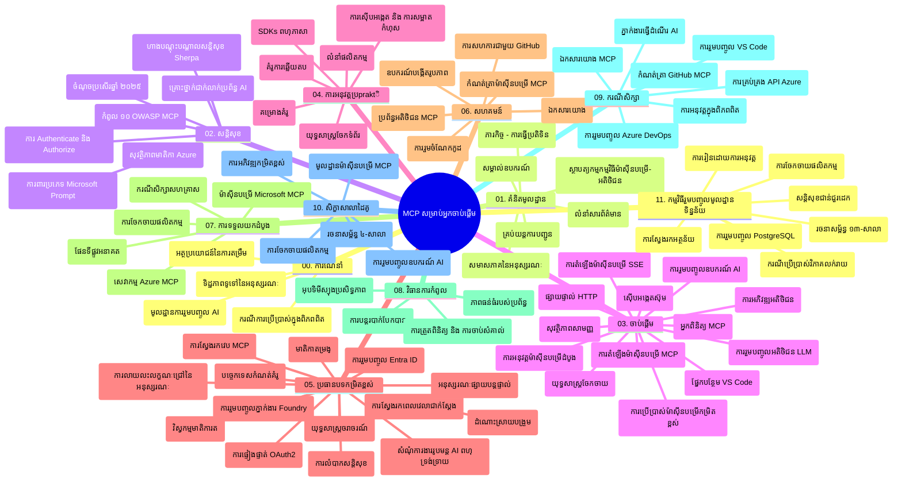

# ឯកសារណែនាំសិក្សា Model Context Protocol (MCP) សម្រាប់អ្នកចាប់ផ្តើម

ឯកសារណែនាំសិក្សានេះផ្ដល់ទិដ្ឋភាពទូទៅអំពីរចនាសម្ព័ន្ធនិងមាតិកានៃ仓储សម្រាប់កម្មវិធីសិក្សា "Model Context Protocol (MCP) សម្រាប់អ្នកចាប់ផ្តើម"។ ប្រើឯកសារណែនាំនេះដើម្បីរុករក仓储ដោយប្រសិទ្ធភាពនិងប្រើប្រាស់ធនធានដែលមានដោយពេញលេញ។

## ទិដ្ឋភាព仓储

Model Context Protocol (MCP) គឺជាគ្រប់គ្រងស្តង់ដារសម្រាប់ការប្រាស្រ័យរវាងម៉ូដែល AI និងកម្មវិធីអតិថិជន។ ដំបូងគឺបង្កើតដោយ Anthropic បច្ចុប្បន្ន MCP ត្រូវបានថែរក្សាដោយសហគមន៍ MCP សកលតាមរយៈអង្គភាព GitHub ផ្លូវការមួយ។仓储នេះផ្ដល់កម្មវិធីសិក្សាទូលំទូលាយជាមួយកូដឧទាហរណ៍កាន់តែអាចអនុវត្តបានក្នុងភាសា C#, Java, JavaScript, Python និង TypeScript ដែលចង់បង្កើតសម្រាប់អ្នកអភិវឌ្ឍ AI, ស្ថាបត្យករប្រព័ន្ធ និងវិស្វករផ្នែកទន់។

## ផែនទីយល់ដឹងមេរៀន

## រចនាសម្ព័ន្ធ仓储

仓储ត្រូវបានរៀបចំជាប្រធានបទដ៏សំខាន់ ១១ ដុំ ដោយផ្ដោតទៅលើទាំងជ្រុងផ្សេងៗនៃ MCP ។

1. **ការណែនាំ (00-Introduction/)**
   - ទិដ្ឋភាពទូទៅនៃ Model Context Protocol
   - ហេតុអ្វីបានជាស្តង់ដារមានសារៈសំខាន់នៅក្នុងផ្លូវបញ្ចូន AI
   - ករណីប្រើប្រាស់អនុវត្តន៍ និងអត្ថប្រយោជន៍

2. **មូលដ្ឋានគំនិត (01-CoreConcepts/)**
   - រចនាសម្ព័ន្ធអតិថិជន-ម៉ាស៊ីនបម្រើ
   - ឧបករណ៍សំខាន់ក្នុងប្រព័ន្ធ
   - គំរូសារនៅក្នុង MCP

3. **សុវត្ថិភាព (02-Security/)**
   - គំរាមកំហែងសុវត្ថិភាពនៅក្នុងប្រព័ន្ធដែលផ្អែកលើ MCP
   - ល្បងល្អបំផុតសម្រាប់ការពារការអនុវត្ត
   - ល្បងសម្រាប់ការផ្ទៀងផ្ទាត់ និងអនុញ្ញាត
   - **ឯកសារ​សុវត្ថិភាព​យ៉ាងពេញលេញ**៖
     - វិធីសាស្រ្តសុវត្ថិភាព MCP ល្អបំផុត ឆ្នាំ ២០២៥
     - សៀវភៅណែនាំអំពីការអនុវត្តខ្សែភាពយន្ត Azure Content Safety
     - ការគ្រប់គ្រង និងបច្ចេកទេសសុវត្ថិភាព MCP
     - ចំណាំល្បងល្អបំផុត MCP
   - **ប្រធានបទសុវត្ថិភាពសំខាន់ៗ**៖
     - ការបញ្ចូលពាក្យជាយនិងការរំខានឧបករណ៍
     - ការជាប់បំណុលសេស្យុន និងបញ្ហាអ្នកជំនួសច្រឡំ
     - ការជ្រោះចូល token
     - អាជ្ញាបណ្ណ និងការត្រួតពិនិត្យការចូល
     - សុវត្ថិភាពខ្សែផ្គត់ផ្គង់សម្រាប់ធាតុ AI
     - សមាហរណកម្ម Microsoft Prompt Shields

4. **ចាប់ផ្តើម (03-GettingStarted/)**
   - ការត្រៀមបរិយាកាសនិងកំណត់រចនាសម្ព័ន្ធ
   - បង្កើតម៉ាស៊ីនបម្រើ MCP និងអតិថិជនដំបូង
   - សមិទ្ធផលជាមួយកម្មវិធីដែលមានស្រាប់
   - មានផ្នែកបានផ្តល់សម្រាប់៖
     - ការអនុវត្តម៉ាស៊ីនបម្រើដំបូង
     - ការអភិវឌ្ឍអតិថិជន
     - សមាហរណកម្ម LLM អតិថិជន
     - សមាហរណកម្ម VS Code
     - ម៉ាស៊ីនបម្រើ Server-Sent Events (SSE)
     - ការប្រើប្រាស់ម៉ាស៊ីនបម្រើកម្រិតខ្ពស់
     - ចំហេះ HTTP
     - សមាហរណកម្មប្រអប់ឧបករណ៍ AI
     - វិធីសាស្រ្តសាកល្បង
     - មគ្គុទេសក៍ផ្សព្វផ្សាយ

5. **អនុវត្តន៍ជាក់ស្តែង (04-PracticalImplementation/)**
   - ប្រើ SDKs ជាភាសាកម្មវិធីផ្សេងៗ
   - ដោះស្រាយកំហុស, សាកល្បង និងផ្ទៀងផ្ទាត់
   - បង្កើតគំរូបញ្ជា និងលំនាំធ្វើការ ដែលអាចប្រើឡើងវិញបាន
   - គំរូគម្រោងជាមួយឧទាហរណ៍អនុវត្ត

6. **ប្រធានបទកម្រិតខ្ពស់ (05-AdvancedTopics/)**
   - បច្ចេកទេសវិស្វកម្មបរិបទ
   - សមាហរណកម្ម Foundry agent
   - វិធីសាស្រ្ត AI មាតិកាចម្រុះមុខងារ
   - បង្ហាញការផ្ទៀងផ្ទាត់ OAuth2
   - សមត្ថភាពស្វែងរកពេលពិត
   - បង្ហោះពេលពិត
   - អនុវត្តបរិបទដើម
   - យុទ្ធសាស្ត្របញ្ជូន
   - វិធីសាស្រ្តជំរុញការជ្រើសរើស
   - វិធីសាស្រ្តកំណត់កម្រិត
   - គិតពីសុវត្ថិភាព
   - សមាហរណកម្មសុវត្ថិភាព Entra ID
   - សមាហរណកម្មស្វែងរកបណ្តាញ

7. **ការរួមចំណែកសហគមន៍ (06-CommunityContributions/)**
   - របៀបចូលរួមកូដ និងឯកសារ
   - ធ្វើការជាមួយ GitHub
   - ការកែលម្អ និងមតិពីសហគមន៍
   - ប្រើអតិថិជន MCP ផ្សេងៗ (Claude Desktop, Cline, VSCode)
   - ធ្វើការជាមួយម៉ាស៊ីនបម្រើ MCP ពេញនិយម រួមមានការបង្កើតរូបភាព

8. **មេរៀនពីការប្រើប្រាស់ដំបូង (07-LessonsfromEarlyAdoption/)**
   - ការអនុវត្តន៍ពិតប្រាកដ និងរឿងជោគជ័យ
   - ការបង្កើតនិងផ្សព្វផ្សាយដំណោះស្រាយដែលផ្អែកលើ MCP
   - របៀបនៃអនាគតនិងផែនទីផ្លូវ
   - **មគ្គុទេសក៍ម៉ាស៊ីនបម្រើ Microsoft MCP**៖ មគ្គុទេសក៍ពេញលេញសម្រាប់ម៉ាស៊ីនបម្រើ MCP Microsoft ១០ ឯកសារ ដែលរួមមាន:
     - Microsoft Learn Docs MCP Server
     - Azure MCP Server (អ្នកភ្ជាប់ជាច្រើនជាង ១៥)
     - GitHub MCP Server
     - Azure DevOps MCP Server
     - MarkItDown MCP Server
     - SQL Server MCP Server
     - Playwright MCP Server
     - Dev Box MCP Server
     - Azure AI Foundry MCP Server
     - Microsoft 365 Agents Toolkit MCP Server

9. **ល្បងល្បីល្អបំផុត (08-BestPractices/)**
   - ការសំរុងសំរួល និងតម្លើង
   - ការរចនាប្រព័ន្ធ MCP ដែលអាចរក្សាទុកកំហុសបាន
   - វិធីសាស្រ្តសាកល្បង និងធន់ធ្ងន់

10. **ករណីសិក្សា (09-CaseStudy/)**
    - **ករណីសិក្សាជាច្រើន** បង្ហាញពីភាពចម្រុះរបស់ MCP ក្នុងស្ថានการณ์ផ្សេងៗ៖
    - **ភ្នាក់ងារធ្វើដំណើរ Azure AI**៖ ការរត់ប្រព័ន្ធច្រើនភ្នាក់ងារជាមួយ Azure OpenAI និងស្វែងរក AI
    - **សមាហរណកម្ម Azure DevOps**៖ ស្វ័យប្រវត្តិប្រតិបត្តិការលំហូរកម្មវិធីជាមួយទិន្នន័យ YouTube
    - **ទទួលយកឯកសារពេលពិត**៖ អតិថិជន Python console ជាមួយ HTTP streaming
    - **កម្មវិធីបង្កើតផែនការសិក្សាមានអន្តរកម្ម**៖ កម្មវិធីវេប Chainlit ជាមួយ AI របៀបជជែក
    - **ឯកសារក្នុងកម្មវិធីភាសាកូដ**៖ សមាហរណកម្ម VS Code ជាមួយ GitHub Copilot workflow
    - **ការគ្រប់គ្រង Azure API**៖ សមាហរណកម្ម API សហគ្រាសជាមួយការបង្កើតម៉ាស៊ីនបម្រើ MCP
    - **បញ្ជីរ៉េស៊ីស្ទ្រី MCP GitHub**៖ ការអភិវឌ្ឍអេកូស៊ីស្តឹម និងការសមាហរណកម្មភ្នាក់ងារ
    - ឧទាហរណ៍អនុវត្តគ្រប់បែបយ៉ាង រួមមានការសមាហរណកម្មសហគ្រាស, ប្រសិទ្ធភាពអ្នកអភិវឌ្ឍ និងអភិវឌ្ឍអេកូស៊ីស្តឹម

11. **វគ្គហាត់ព្វើដំណើរផ្ទាល់ (10-StreamliningAIWorkflowsBuildingAnMCPServerWithAIToolkit/)**
    - វគ្គហាត់ព្រៃធន់យ៉ាងពេញលេញជាមួយ MCP និង AI Toolkit
    - សាងសង់កម្មវិធីឆ្លាតវៃដែលភ្ជាប់ម៉ូដែល AI ជាមួយឧបករណ៍ពិភពជាក់ស្តែង
    - ម៉ូឌុលអនុវត្តជាក់ស្តែងគ្រប់ដំណាក់កាល រួមមាន មូលដ្ឋាន, ការអភិវឌ្ឍម៉ាស៊ីនបម្រើផ្ទាល់ខ្លួន និងយុទ្ធសាស្ត្រផ្សព្វផ្សាយ
    - **រចនាសម្ព័ន្ធមន្ទីរសិក្សា**៖
      - មន្ទីរ ១៖ មូលដ្ឋានម៉ាស៊ីនបម្រើ MCP
      - មន្ទីរ ២៖ ការអភិវឌ្ឍម៉ាស៊ីនបម្រើ MCP ខ្ពស់
      - មន្ទីរ ៣៖ សមាហរណកម្ម AI Toolkit
      - មន្ទីរ ៤៖ ផ្សព្វផ្សាយ និងកំណត់កម្រិតផលិតផល
    - វិធីសាស្រ្តសិក្សាម៉ោងតាមមន្ទីរជាមួយការណែនាំជំហានៗ

12. **មន្ទីរសិក្សាសមាហរណកម្មមូលដ្ឋានទិន្នន័យម៉ាស៊ីនបម្រើ MCP (11-MCPServerHandsOnLabs/)**
    - **ផ្លូវសិក្សា ១៣ មន្ទីរ** សម្រាប់សាងសង់ម៉ាស៊ីនបម្រើ MCP រួចរាល់ជាមួយចូលរួម PostgreSQL
    - **ការអនុវត្តវិភាគលក់ចេញពិភពជាក់ស្តែង** ជាមួយករណីប្រើប្រាស់ Zava Retail
    - **គំរូសហគ្រាស** រួមមាន Row Level Security (RLS), ស្វែងរកហត្ថពិភាក្សា និងចូលដំណើរការទិន្នន័យច្រើនអ្នកជួល
    - **រចនាសម្ព័ន្ធមន្ទីរពេញលេញ**៖
      - មន្ទីរ ០០-០៣៖ មូលដ្ឋាន, រចនាសម្ព័ន្ធ, សុវត្ថិភាព, ត្រៀមបរិយាកាស
      - មន្ទីរ ០៤-០៦៖ ការសាងសង់ម៉ាស៊ីនបម្រើ MCP - រចនាផ្ទៃក្នុង, អនុវត្តម៉ាស៊ីនបម្រើ, ការអភិវឌ្ឍឧបករណ៍
      - មន្ទីរ ០៧-០៩៖ មុខងារខ្ពស់ - ស្វែងរករបៀបវោហារ, សាកល្បង និងដោះស្រាយកំហុស, សមាហរណកម្ម VS Code
      - មន្ទីរ ១០-១២៖ ផលិតកម្ម និងល្បងល្អបំផុត - ផ្សព្វផ្សាយ, ត្រួតពិនិត្យ, បង្កើតប្រសិទ្ធភាព
    - **បច្ចេកវិទ្យាដែលគ្របដណ្តប់**៖ FastMCP framework, PostgreSQL, Azure OpenAI, Azure Container Apps, Application Insights
    - **លទ្ធផលសិក្សា**៖ ម៉ាស៊ីនបម្រើ MCP រួចរាល់, គំរូសមាហរណកម្មមូលដ្ឋានទិន្នន័យ, វិភាគផ្អែក AI, សុវត្ថិភាពសហគ្រាស

## ធនធានបន្ថែម

仓储រួមបញ្ចូលធនធានគាំទ្រ៖

- **ថតរូប**៖ រូបភាពនិងគំនូរដែលប្រើក្នុងម៉េរៀន
- **ការប្រែសម្រួល**៖ ដំណឹងពីភាសាជាច្រើនជាមួយការប្រែសម្រួលឯកសារដោយស្វ័យប្រវត្តិ
- **ធនធាន MCP ផ្លូវការ**៖
  - [ឯកសារសម្រាប់ MCP](https://modelcontextprotocol.io/)
  - [លក្ខណៈសម្បត្តិ MCP](https://spec.modelcontextprotocol.io/)
  - [仓储 MCP GitHub](https://github.com/modelcontextprotocol)

## របៀបប្រើ仓储នេះ

1. **សិក្សាតាមលំដាប់**៖ តាមដានជំពូកចាប់ពី ០០ ដល់ ១១ សម្រាប់បទពិសោធន៍សិក្សាសុទ្ធ
2. **ផ្តោតលើភាសាជាក់លាក់**៖ ប្រសិនបើអ្នកចាប់អារម្មណ៍ក្នុងភាសាដូចមួយណា សូមស្វែងរកថតគំរូសម្រាប់ភាសាដែលអ្នកចូលចិត្ត
3. **អនុវត្តជាក់ស្តែង**៖ ចាប់ផ្តើមពីផ្នែក "ចាប់ផ្តើម" ដើម្បីត្រៀមបរិយាកាស និងបង្កើតម៉ាស៊ីនបម្រើ MCP និងអតិថិជនដំបូងរបស់អ្នក
4. **ស្វែងយល់កម្រិតខ្ពស់**៖ បន្ទាប់ពីបានយល់ព្រមល្អ ត្រូវបញ្ចូលទៅកាន់ប្រធានបទកម្រិតខ្ពស់ដើម្បីពង្រីកចំណេះដឹង
5. **ចូលរួមសហគមន៍**៖ ចូលរួមជាមួយសហគមន៍ MCP តាមប្រព័ន្ធពិភាក្សា GitHub និង Discord ដើម្បីតភ្ជាប់ជាមួយជំនាញ និងអ្នកអភិវឌ្ឍផ្សេងទៀត

## អតិថិជន MCP និងឧបករណ៍

កម្មវិធីសិក្សាអនុវត្តគ្រប់អតិថិជន MCP និងឧបករណ៍៖

1. **អតិថិជនផ្លូវការ**៖
   - Visual Studio Code
   - MCP ក្នុង Visual Studio Code
   - Claude Desktop
   - Claude ក្នុង VSCode
   - Claude API

2. **អតិថិជនសហគមន៍**៖
   - Cline (បញ្ជាររង)
   - Cursor (កម្មវិធីកែសម្រួលកូដ)
   - ChatMCP
   - Windsurf

3. **ឧបករណ៍គ្រប់គ្រង MCP**៖
   - MCP CLI
   - MCP Manager
   - MCP Linker
   - MCP Router

## ម៉ាស៊ីនបម្រើ MCP ដ៏ពេញនិយម

仓储ណែនាំម៉ាស៊ីនបម្រើ MCP ផ្សេងៗ រួមមាន៖

1. **ម៉ាស៊ីនបម្រើ Microsoft MCP ផ្លូវការ**៖
   - Microsoft Learn Docs MCP Server
   - Azure MCP Server (អ្នកភ្ជាប់ជាច្រើនជាង ១៥)
   - GitHub MCP Server
   - Azure DevOps MCP Server
   - MarkItDown MCP Server
   - SQL Server MCP Server
   - Playwright MCP Server
   - Dev Box MCP Server
   - Azure AI Foundry MCP Server
   - Microsoft 365 Agents Toolkit MCP Server

2. **ម៉ាស៊ីនបម្រើយោងផ្លូវការ**៖
   - Filesystem
   - Fetch
   - Memory
   - Sequential Thinking

3. **បង្កើតរូបភាព**៖
   - Azure OpenAI DALL-E 3
   - Stable Diffusion WebUI
   - Replicate

4. **ឧបករណ៍អភិវឌ្ឍន៍**៖
   - Git MCP
   - Terminal Control
   - Code Assistant

5. **ម៉ាស៊ីនបម្រើជាក់លាក់**៖
   - Salesforce
   - Microsoft Teams
   - Jira & Confluence

## ការរួមចំណែក

仓储នេះស្វាគមន៍ការរួមចំណែកពីសហគមន៍។ សូមមើលផ្នែក Community Contributions សម្រាប់ការណែនាំរបៀបរួមចំណែកយ៉ាងមានប្រសិទ្ធភាពក្នុងអេកូស៊ីស្តឹម MCP ។

----

*ឯកសារណែនាំសិក្សានេះបានបន្តបច្ចុប្បន្នភាពចុងក្រោយថ្ងៃទី ៥ ខែកុម្ភៈ ឆ្នាំ ២០២៦ ដែលបង្ហាញពីលក្ខណៈសម្បត្តិ MCP ថ្មី ២០២៥-១១-២៥ និងផ្ដល់ទិដ្ឋភាពទូទៅនៃ仓储តាំងពីថ្ងៃនោះ។ មាតិកា仓储អាចមានការបន្ទាន់បន្ថែមបន្ទាប់ពីថ្ងៃនោះ។*

---

<!-- CO-OP TRANSLATOR DISCLAIMER START -->
**ការបដិសេធ**៖  
ឯកសារនេះត្រូវបានបកប្រែដោយប្រើសេវាកម្មបកប្រែ AI [Co-op Translator](https://github.com/Azure/co-op-translator)។ ខណៈពេលដែលយើងព្យាយាមឱ្យមានភាពត្រឹមត្រូវ សូមចំណាំថាការបកប្រែដោយស្វ័យប្រវត្តិអាចមានកំហុស ឬចំអិនខុស។ ឯកសារដើមនៅក្នុងភាសាដើមគួរត្រូវបានយកទៅពិចារណាជាគោលដៅឯកភាព។ សម្រាប់ព័ត៌មានសំខាន់ សូមប្រើការបកប្រែដោយមនុស្សជំនាញវិជ្ជាជីវៈ។ យើងមិនទទួលខុសត្រូវចំពោះការយល់ច្រឡំ ឬការបកស្រាយខុសដែលកើតឡើងពីការប្រើប្រាស់ការបកប្រែនេះទេ។
<!-- CO-OP TRANSLATOR DISCLAIMER END -->