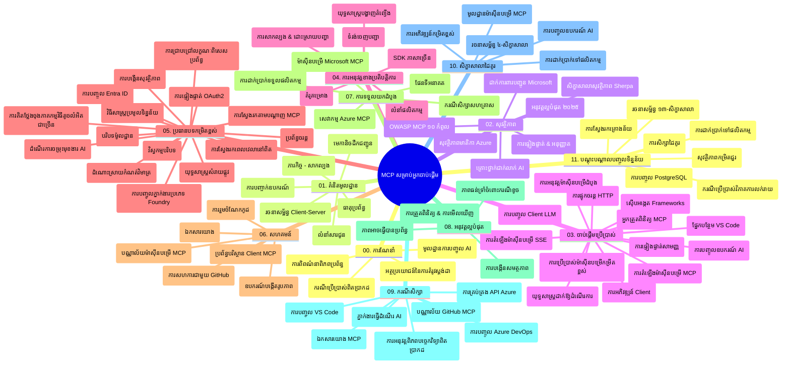

# Model Context Protocol (MCP) សម្រាប់អ្នកចាប់ផ្តើម - មគ្គុទេសក៍សិក្សា

មគ្គុទេសក៍សិក្សានេះផ្តល់នូវការពិភាក្សាអំពីរចនាសម្ព័ន្ធ និងមាតិកានៃឃ្លាំងទិន្នន័យសម្រាប់វគ្គសិក្សា "Model Context Protocol (MCP) សម្រាប់អ្នកចាប់ផ្តើម"។ ប្រើមគ្គុទេសក៍នេះដើម្បីរុករកឃ្លាំងទិន្នន័យដោយមានប្រសិទ្ធភាព និងទទួលបានអត្ថប្រយោជន៍ពីធនធានដែលមាន។

## ពិពណ៌នាឃ្លាំងទិន្នន័យ

Model Context Protocol (MCP) គឺជាវិធីសាស្ត្រតម្រង់តាមស្តង់ដារសម្រាប់អន្តរកម្មរវាងម៉ូឌែល AI និងកម្មវិធីអតិថិជន។ ដែលបានបង្កើតដំបូងដោយ Anthropic, MCP បច្ចុប្បន្នត្រូវបានថែទាំដោយសហគមន៍ MCP វិតថសម្រាប់តាមរយៈអង្គការផ្លូវការលើ GitHub។ ឃ្លាំងទិន្នន័យនេះផ្តល់នូវវគ្គសិក្សារួមជាមួយគំរូកូដអនុវត្តជាក់លាក់ជាភាសា C#, Java, JavaScript, Python, និង TypeScript ដែលមានគោលបំណងសម្រាប់អ្នកអភិវឌ្ឍ AI, អ្នករចនាបទបម្លែងប្រព័ន្ធ និងវិស្វករថ្នាំបង្កេីត។

## ផែនទីវគ្គសិក្សា

## រចនាសម្ព័ន្ធឃ្លាំងទិន្នន័យ

ឃ្លាំងទិន្នន័យត្រូវបានរៀបចំទៅជាផ្នែកចម្បង ១១ ផ្នែក ដែលនិចម្តងមួយផ្ដោតលើប្រធានបទផ្សេងៗនៃ MCP៖

1. **ការណែនាំ (00-Introduction/)**
   - ទិដ្ឋភាពទូទៅអំពី Model Context Protocol
   - ហេតុអ្វីបានជាស្តង់ដារសំខាន់ក្នុងបណ្ដាញ AI
   - ករណីប្រើប្រាស់ជាក់ស្តែង និងអត្ថប្រយោជន៍

2. **គំនិតមូលដ្ឋាន (01-CoreConcepts/)**
   - រៀបចំរចនាសម្ព័ន្ធម៉ាស៊ីនផ្នែកអតិថិជន-ម៉ាស៊ីនផ្នែកម៉ាស៊ីនបម្រើ
   - សមាសធាតុសំខាន់ៗនៃពិធីការណ៍
   - ប្រភេទសារ​នៅក្នុង MCP

3. **សន្តិសុខ (02-Security/)**
   - គំរាមកំហែងសន្តិសុខក្នុងប្រព័ន្ធផ្អែកលើ MCP
   - ជំនាញល្អបំផុតសម្រាប់ការការពារអនុវត្តន៍
   - យុទ្ធសាស្ត្រផ្ទៀងផ្ទាត់ និងអោយសិទ្ធិ
   - **ឯកសារសន្តិសុខទូលំទូលាយ**៖
     - MCP Security Best Practices 2025
     - Azure Content Safety Implementation Guide
     - MCP Security Controls and Techniques
     - MCP Best Practices Quick Reference
   - **ប្រធានបទសន្តិសុខសំខាន់ៗ**៖
     - ការបញ្ចូលសម្រង់ និងការបំពុលឧបករណ៍
     - ការចាប់យកសម័យ និងបញ្ហាអ្នកតំណាងច្របូកច្របល់
     - ការ​កែប្រែ​សម្ភារៈ​ទិន្នន័យ​ក្នុង token
     - សិទ្ធិច្រើនពេក និងការគ្រប់គ្រងការចូលដំណើរការ
     - សន្តិសុខខ្សែផ្គត់ផ្គង់សម្រាប់ជង្គង់ AI
     - ការរួមបញ្ចូល Microsoft Prompt Shields

4. **ការចាប់ផ្តើម (03-GettingStarted/)**
   - ការតំឡើងបរិយាកាស និងការកំណត់រចនាសម្ព័ន្ធ
   - ការបង្កើតម៉ាស៊ីនបម្រើ MCP និងអតិថិជនមូលដ្ឋាន
   - ការរួមបញ្ចូលជាមួយកម្មវិធីមានស្រាប់
   - រួមមានផ្នែក៖
     - ការអនុវត្តម៉ាស៊ីនបម្រើដំបូង
     - ការអភិវឌ្ឍអតិថិជន
     - រួមបញ្ចូលអតិថិជន LLM
     - រួមបញ្ចូល VS Code
     - ម៉ាស៊ីនបម្រើ Server-Sent Events (SSE)
     - ការប្រើប្រាស់ម៉ាស៊ីនបម្រើកម្រិតខ្ពស់
     - ស្ទ្រីមមីង HTTP
     - រួមបញ្ចូល AI Toolkit
     - យុទ្ធសាស្ត្រផ្ទៀងផ្ទាត់
     - គោលការណ៍ចែកចាយ

5. **អនុវត្តន៍ជាក់ស្តែង (04-PracticalImplementation/)**
   - ការប្រើ SDK ជាទូទៅនៅក្នុងភាសាកម្មវិធីផ្សេងៗ
   - ការបញ្ចេញកំហុស, ការធ្វើតេស្ត និងវិធានការផ្ទៀងផ្ទាត់
   - បង្កើតប្លង់បញ្ចូលជារយៈទូទៅ និងដំណើរការសម្រាប់មុខងារ
   - គំរូគម្រោងជាមួយឧទាហរណ៍អនុវត្ត

6. **ប្រធានបទជីវិតខ្ពស់ (05-AdvancedTopics/)**
   - បច្ចេកទេសវិស្វកម្មបរិបទ
   - រួមបញ្ចូលភ្នាក់ងារ Foundry
   - ដំណើរការជាផ្លូវមួយច្រើនលក្ខណៈ AI 
   - បង្ហាញ OAuth2 ផ្ទៀងផ្ទាត់
   - សមត្ថភាពស្វែងរកពេលតែម្តង
   - ស្ទ្រីមពេលតែម្តង
   - អនុវត្តបរិបទមូលដ្ឋាន
   - វិធីវិញជាតិ
   - បច្ចេកទេសសម្គាល់
   - វិធីសាស្ត្រលាយឡំ
   - ការពិចារណាសន្តិសុខ
   - រួមបញ្ចូលសន្តិសុខ Entra ID
   - រួមបញ្ចូលស្វែងរកវេបសាយ
   - ការគិតដោយភ្នាក់ងារច្រើនប្រឆាំងគ្នា (លំនាំវាយប្រហារ)

7. **ការរួមចំណែកសហគមន៍ (06-CommunityContributions/)**
   - របៀបរួមចំណែកកូដ និងឯកសារ
   - ការសហការតាម GitHub
   - ការកែលម្អដោយសហគមន៍ និងមតិយោបល់
   - ការប្រើប្រាស់អតិថិជន MCP តាមរយៈ Claude Desktop, Cline, VSCode
   - ការធ្វើការជាមួយម៉ាស៊ីនបម្រើ MCP ពេញនិយម រួមមានបង្កើតរូបភាព

8. **មេរៀនពីការទទួលយកដំបូង (07-LessonsfromEarlyAdoption/)**
   - ការអនុវត្តន៍ពិតប្រាកដ និងរឿងជោគជ័យ
   - ការបង្កើតនិងចែកចាយដំណោះស្រាយផ្អែកលើ MCP
   - និន្នាការនិងផែនទីផ្លូវអនាគត
   - **មគ្គុទេសក៍ម៉ាស៊ីនបម្រើ Microsoft MCP**៖ មគ្គុទេសក៍ទូលំទូលាយសម្រាប់ម៉ាស៊ីនបម្រើ Microsoft MCP ១០ គ្រឿងរួមមាន៖
     - Microsoft Learn Docs MCP Server
     - Azure MCP Server (កម្មវិធីភ្ជាប់ជាង ១៥)
     - GitHub MCP Server
     - Azure DevOps MCP Server
     - MarkItDown MCP Server
     - SQL Server MCP Server
     - Playwright MCP Server
     - Dev Box MCP Server
     - Azure AI Foundry MCP Server
     - Microsoft 365 Agents Toolkit MCP Server

9. **ការអនុវត្តល្អបំផុត (08-BestPractices/)**
   - ការតំឡើងកម្រិតកម្រិត និងបន្ថែមប្រសិទ្ធភាព
   - ការរចនាប្រព័ន្ធ MCP អោយអាចធន់ទ្រាំបរាជ័យ
   - យុទ្ធសាស្ត្រធ្វើតេស្ត និងកំណត់ភាពទន់ខ្សោយ

10. **ករណីសិក្សា (09-CaseStudy/)**
    - **ករណីសិក្សា៧ករណីទូលំទូលាយ**បង្ហាញពីភាពចម្រុះរបស់ MCP ក្នុងស្ថានការណ៍ផ្សេងៗ៖
    - **ភ្នាក់ងារសេស្សា AI Azure**៖ ការអុតចង្អុលភ្នាក់ងារច្រើនជាមួយ Azure OpenAI និង AI Search
    - **រួមបញ្ចូល Azure DevOps**៖ ស្វ័យប្រវត្តិដំណើរការផ្លូវការជាមួយទិន្នន័យ YouTube
    - **ការទាញយកឯកសារពេលតាមពិត**៖ អតិថិជនប្រេកង់ Python ជាមួយស្ទ្រីម HTTP
    - **កម្មវិធីបង្កើតផែនការសិក្សាគន្លងមានការសន្ទនា**៖ វេបសាយ Chainlit ជាមួយ AI សន្ទនា
    - **ឯកសារនៅក្នុងកម្មរិយលើតជួរខាងក្នុង**៖ រួមបញ្ចូល VS Code ជាមួយ GitHub Copilot
    - **ការគ្រប់គ្រង API Azure**៖ រួមបញ្ចូល API សហគ្រាសជាមួយការបង្កើតម៉ាស៊ីនបម្រើ MCP
    - **បញ្ជី MCP របស់ GitHub**៖ វេទិកាបង្កើតប្រព័ន្ធ និងរួមបញ្ចូលភ្នាក់ងារចម្រុះ
    - ឧទាហរណ៍អនុវត្តផ្អែកលើការរួមបញ្ចូលអាជីវកម្ម, ផលិតភាពអ្នកអភិវឌ្ឍន៍ និងការរីកចម្រើនប្រព័ន្ធអេកូស៊ីស្ទឹម

11. **សិក្ខាាល័យប្រែប្រួលដំណើរការ AI និងបង្កើតម៉ាស៊ីនបម្រើ MCP ជាមួយ AI Toolkit (10-StreamliningAIWorkflowsBuildingAnMCPServerWithAIToolkit/)**
    - សិក្ខាាល័យប្រែប្រួលដំបូងចូលរួម MCP ជាមួយ AI Toolkit
    - បង្កើតកម្មវិធីឆ្លាតវៃស្វែងយល់រវាងម៉ូឌែល AI និងឧបករណ៍ពិតប្រាកដ
    - ម៉ូឌុលជាក់លាក់គ្របដណ្ដប់មូលដ្ឋាន, អភិវឌ្ឍម៉ាស៊ីនបម្រើផ្ទាល់ខ្លួន និងយុទ្ធសាស្ត្រចែកចាយផលិតផល
    - **រចនាសម្ព័ន្ធសិក្ខាាល័យ**៖
      - សិក្ខាាល័យទី ១៖ មូលដ្ឋានម៉ាស៊ីនបម្រើ MCP
      - សិក្ខាាល័យទី ២៖ អភិវឌ្ឍម៉ាស៊ីនបម្រើ MCP កម្រិតខ្ពស់
      - សិក្ខាាល័យទី ៣៖ រួមបញ្ចូល AI Toolkit
      - សិក្ខាាល័យទី ៤៖ ចែកចាយផលិតផល និងលាយឡំ
    - វិធីសាស្ត្រសិក្សាដោយសិក្ខាាល័យជាមួយនៃការណែនាំជាលំដាប់ជំហាន

12. **សិក្ខាាល័យរួមបញ្ចូលមូលដ្ឋានទិន្នន័យម៉ាស៊ីនបម្រើ MCP (11-MCPServerHandsOnLabs/)**
    - **ផ្លូវការសិក្សាចំនួន ១៣ សិក្ខាាល័យ** សម្រាប់បង្កើតម៉ាស៊ីនបម្រើ MCP ត្រៀមសម្រាប់ផលិតកម្មជាមួយការរួមបញ្ចូល PostgreSQL
    - **អនុវត្តវិភាគលក់រាយពិតប្រាកដ**ដោយប្រើករណីប្រើ Zava Retail
    - **លំនាំដែលមានគុណភាពសម្រាប់សហគ្រាស** រួមមាន Row Level Security (RLS), ស្វែងរកហេតុផល និងការចូលដំណើរការទិន្នន័យលើភ្ញៀវច្រើន
    - **រចនាសម្ព័ន្ធសិក្ខាាល័យពេញលេញ**៖
      - **សិក្ខាាល័យ ០០-០៣៖ មូលដ្ឋាន** - ការណែនាំ, រៀបចំ, សន្តិសុខ, ការតំឡើងបរិយាកាស
      - **សិក្ខាាល័យ ០៤-០៦៖ បង្កើតម៉ាស៊ីនបម្រើ MCP** - ការរចនាមូលដ្ឋានទិន្នន័យ, អនុវត្តម៉ាស៊ីនបម្រើ MCP, ការអភិវឌ្ឍឧបករណ៍
      - **សិក្ខាាល័យ ០៧-០៩៖ លក្ខណៈខ្ពស់** - ស្វែងរកហេតុផល, ការធ្វើតេស្ត និងដោះស្រាយកំហុស, រួមបញ្ចូល VS Code
      - **សិក្ខាាល័យ ១០-១២៖ ផលិតកម្ម និងការអនុវត្តល្អបំផុត** - ចែកចាយ, ត្រួតពិនិត្យ, បន្ថែមប្រសិទ្ធភាព
    - **បច្ចេកវិទ្យាដែលគ្របដណ្តប់**៖ FastMCP framework, PostgreSQL, Azure OpenAI, Azure Container Apps, Application Insights
    - **លទ្ធផលការសិក្សា**៖ ម៉ាស៊ីនបម្រើ MCP ត្រៀមផលិតកម្ម, លំនាំរួមបញ្ចូលទិន្នន័យ, វិភាគដោយ AI, សន្តិសុខសហគ្រាស

## ធនធានបន្ថែម

ឃ្លាំងទិន្នន័យរួមបញ្ចូលធនធានគាំទ្រ៖

- **ថតរូប**៖ រួមមាន គំនូរ និងរូបភាពដែលបានប្រើនៅក្នុងវគ្គសិក្សា
- **ការប្រែប្រែ**៖ គាំទ្រភាសាច្រើនជាមួយការប្រែសេចក្ដីអតូម៉ាទិកនៃឯកសារ
- **ធនធាន MCP ផ្លូវការ**៖
  - [MCP Documentation](https://modelcontextprotocol.io/)
  - [MCP Specification](https://spec.modelcontextprotocol.io/)
  - [MCP GitHub Repository](https://github.com/modelcontextprotocol)

## របៀបប្រើប្រាស់ឃ្លាំងទិន្នន័យនេះ

1. **ការសិក្សាដោយលំដាប់**៖ តាមដានជំពូកតែមួយមុខ (00 ដល់ 11) ដើម្បីទទួលបានបទពិសោធន៍សិក្សាដែលមានរចនាសម្ព័ន្ធ។
2. **ផ្ដោតលើភាសាកម្មវិធីជាក់លាក់**៖ ប្រសិនបើអ្នកចាប់អារម្មណ៍ក្នុងភាសាកម្មវិធីណាមួយ, ស្វែងរកថតឯកសារគំរូសម្រាប់ការអនុវត្តន៍ជាភាសាដែលចំណូលចិត្ត។
3. **អនុវត្តជាក់ស្តែង**៖ ចាប់ផ្តើមពីផ្នែក "Getting Started" ដើម្បីតំឡើងបរិយាកាស និងបង្កើតម៉ាស៊ីនបម្រើ MCP និងអតិថិជនដំបូង។
4. **ស្វែងយល់កម្រិតខ្ពស់**៖ នៅពេលមានជំនាញគ្រឹះច្បាស់លាស់ ដង្ហើមទៅប្រធានបទកម្រិតខ្ពស់ដើម្បីពង្រីកចំណេះដឹង។
5. **រួមចំណែកជាមួយសហគមន៍**៖ ចូលរួមសហគមន៍ MCP តាមរយៈការពិភាក្សា និងឆានែល Discord របស់ GitHub ដើម្បីភ្ជាប់ជាមួយអ្នកជំនាញ និងអ្នកអភិវឌ្ឍផ្សេងទៀត។

## អតិថិជន MCP និងឧបករណ៍

វគ្គសិក្សាគ្របដណ្តប់អតិថិជន MCP និងឧបករណ៍ជាច្រើន៖

1. **អតិថិជនផ្លូវការចម្បង**៖
   - Visual Studio Code
   - MCP នៅក្នុង Visual Studio Code
   - Claude Desktop
   - Claude នៅ VSCode
   - Claude API

2. **អតិថិជនសហគមន៍**៖
   - Cline (ផ្ទាំងបញ្ជាការ)
   - Cursor (កម្មវិធីកាត់កូដ)
   - ChatMCP
   - Windsurf

3. **ឧបករណ៍គ្រប់គ្រង MCP**៖
   - MCP CLI
   - MCP Manager
   - MCP Linker
   - MCP Router

## ម៉ាស៊ីនបម្រើ MCP ពេញនិយម

ឃ្លាំងទិន្នន័យណែនាំម៉ាស៊ីនបម្រើ MCP ជាច្រើន, រួមមាន៖

1. **ម៉ាស៊ីនបម្រើ Microsoft MCP ផ្លូវការ**៖
   - Microsoft Learn Docs MCP Server
   - Azure MCP Server (កម្មវិធីភ្ជាប់ជាង ១៥)
   - GitHub MCP Server
   - Azure DevOps MCP Server
   - MarkItDown MCP Server
   - SQL Server MCP Server
   - Playwright MCP Server
   - Dev Box MCP Server
   - Azure AI Foundry MCP Server
   - Microsoft 365 Agents Toolkit MCP Server

2. **ម៉ាស៊ីនបម្រើយោងផ្លូវការ**៖
   - Filesystem
   - Fetch
   - Memory
   - Sequential Thinking

3. **បង្កើតរូបភាព**៖
   - Azure OpenAI DALL-E 3
   - Stable Diffusion WebUI
   - Replicate

4. **ឧបករណ៍អភិវឌ្ឍ**៖
   - Git MCP
   - Terminal Control
   - Code Assistant

5. **ម៉ាស៊ីនបម្រើជាក់លាក់**៖
   - Salesforce
   - Microsoft Teams
   - Jira & Confluence

## ការរួមចំណែក

ឃ្លាំងទិន្នន័យនេះស្វាគមន៍ការរួមចំណែកពីសហគមន៍។ មើលផ្នែក Community Contributions សម្រាប់ការណែនាំពីរបៀបទទួលបានការរួមចំណែកយ៉ាងមានប្រសិទ្ធភាពចំពោះប្រព័ន្ធ MCP។

----

*មគ្គុទេសក៍សិក្សានេះបច្ចុប្បន្នភាពចុងក្រោយនៅថ្ងៃទី ៥ ខែកុម្ភៈ ឆ្នាំ ២០២៦ ដោយបង្ហាញពី MCP Specification 2025-11-25 និងផ្តល់ទិដ្ឋភាពទូទៅនៃឃ្លាំងទិន្នន័យចុងក្រោយ។ ខ្លឹមសារវិញអាចត្រូវបានបន្ទាន់សម័យបន្ទាប់ពីថ្ងៃនេះ។*

---

<!-- CO-OP TRANSLATOR DISCLAIMER START -->
**ការបដិសេធ**៖
ឯកសារនេះត្រូវបានបកប្រែក្នុងរយៈពេលដោយប្រើសេវាបកប្រែ AI [Co-op Translator](https://github.com/Azure/co-op-translator)។ ខណៈពេលដែលយើងខិតខំសំរាប់ភាពត្រឹមត្រូវ សូមយល់ដឹងថាការបកប្រែដោយស្វ័យប្រវត្តិក៏អាចមានកំហុស ឬភាពមិនត្រឹមត្រូវ។ ឯកសារដើមក្នុងភាសាមនុស្សជាតិគួរត្រូវបានពិចារណាជាមូលដ្ឋានផ្លូវការជាតិ។ សម្រាប់ព័ត៌មានសំខាន់ៗ ការបកប្រែដោយអ្នកជំនាញមនុស្សត្រូវបានណែនាំ។ យើងមិនទទួលខុសត្រូវចំពោះការយល់ច្រឡំ ឬការបកប្រែខុសឆ្គងអ្វីៗដែលកើតឡើងពីការប្រើប្រាស់បកប្រែនេះទេ។
<!-- CO-OP TRANSLATOR DISCLAIMER END -->