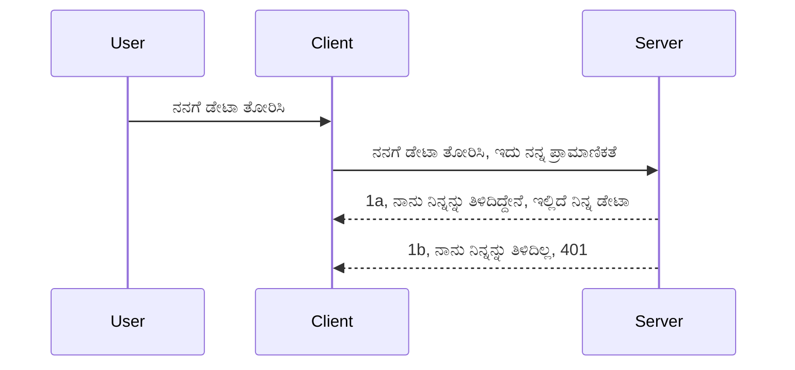

# ಸಿಂಪಲ್ ಅತ್

MCP SDKs ಗಳು OAuth 2.1 ಬಳಕೆಯನ್ನು ಬೆಂಬಲಿಸುತ್ತವೆ, ಇದು ನ್ಯಾಯವಾಗಿ ಹೇಳಿದರೆ ಸಾಂಕೀರ‍್ಣ ಪ್ರಕ್ರಿಯೆಯಾಗಿದ್ದು, ಇದರಲ್ಲಿ auth ಸರ್ವರ್, ರಿಸೋರ್ಸ್ ಸರ್ವರ್, ಸನದಿ ಪೋಷಣೆ (posting credentials), ಕೋಡ್ ಪಡೆಯುವುದು, ಕೋಡ್ ಅನ್ನು ಬೆಅರ್ ಟೋಕನ್ ಗೆ ವಿನಿಮಯ ಮಾಡಿಕೊಳ್ಳುವುದು, ಇತ್ಯಾದಿ ಅಂಶಗಳು ಸೇರಿವೆ, ಕೊನೆಯಲ್ಲಿ ನೀವು ನಿಮ್ಮ ರಿಸೋರ್ಸ್ ಡೇಟಾವನ್ನು ಪಡೆಯಬಹುದು. ನೀವು OAuthಗೆ ಪಠ್ಯಪೂರ್ವಕವಾಗಿ ಪರಿಚಿತರಾಗಿರದಿದ್ದರೆ, ಇದು ಜಾರಿಗೆ ತರುವ ಎಲ್ಲಾ ಪ್ರಕ್ರಿಯೆಗಳನ್ನೂ ತಿಳಿದುಕೊಳ್ಳುವುದು ಉತ್ತಮ. ಆದ್ದರಿಂದ, ಮೊದಲ ಹಂತದಲ್ಲಿ ಕೆಲವು ಬೇಸಿಕ್ ಲೆವೆಲ್ ಅತ್ (auth) ಆಧರಿಸಿ, ನಂತರ ಹೆಚ್ಚು ಸುರಕ್ಷಿತದ ಕಡೆಗೆ ವೃದ್ಧಿಪಡಿಸುವುದು ಒಳ್ಳೆಯದಾಗಿದೆ. ಇಲ್ಲಿ ಈ ಅಧ್ಯಾಯದ ಉದ್ದೇಶ ಅದನ್ನು ನಿಮಗೆ ತರಬೇತುಗೊಳಿಸುವುದೇ.

## ಅತ್, ನಾವು ಅರ್ಥಮಾಡಿಕೊಳ್ಳುವುದು ಏನು?

ಅತ್ ಎಂದರೆ authentication ಮತ್ತು authorization ರ ಹಬ್ಬುಗೊಂಡಿರುವ ಸಂಕ್ಷಿಪ್ತ ಪದ. ಉದ್ದೇಶವೆಂದರೆ ನಾವು ಎರಡು ಕೆಲಸಗಳನ್ನು ಮಾಡಬೇಕು:

- **Authentication** ಎಂದರೆ ಒಬ್ಬ ವ್ಯಕ್ತಿಯನ್ನು ನಮ್ಮ ಮನೆಯಲ್ಲಿ ಪ್ರವೇಶಿಸಲು ಅನುಮತಿಸುವ ಪ್ರಕ್ರಿಯೆ, ಅಂದರೆ ಅವರು "ಇಲ್ಲಿ" ಇರಲು অধিকার ಹೊಂದಿರಬೇಕು, ಅಂದರೆ ನಮ್ಮ MCP ಸರ್ವರ್ ವೈಶಿಷ್ಟ್ಯಗಳು ಕಾರ್ಯನಿರ್ವಹಿಸುತ್ತಿರುವ resource server ಗೆ ಪ್ರವೇಶ ಇರುವುದಾಗಿದೆ.
- **Authorization** ಎಂದರೆ ಬಳಕೆದಾರರು ಕೇಳುತ್ತಿರುವ ಈ ನಿಖರ resource ಗಳಿಗೆ ಪ್ರವೇಶ ಹೊಂದಬೇಕೆಂದು ಖಚಿತಪಡಿಸಿಕೊಂಡು, ಉದಾಹರಣೆಗೆ ಈ orders ಅಥವಾ ಈ ಉತ್ಪನ್ನಗಳಿಗೆ ಅಥವಾ ಅವರು ವಿಷಯವನ್ನು ಓದಲು ಅನುಮತಿದೆ ಆದರೆ ಅಳಿಸಲು ಇಲ್ಲದಂತಹ ನಿಯಮಗಳನ್ನು ಕಂಡುಹಿಡಿಯುವುದು.

## ಪ್ರಮಾಣಪತ್ರಗಳು: ನಾವು ವ್ಯವಸ್ಥೆಗೆ ನಾವು ಯಾರು ಎಂದು ಹೇಳುವ ವಿಧಾನ

ಬಹಳಷ್ಟು ವೆಬ್ ಡೆವಲಪರ್ ಗಳು ಸರ್ವರ್ ಗೆ ನಂಬಿಕೆಯಾಗುವಂತೆ ಅನುಮతి ನೀಡುವುದಕ್ಕೆ ಒಂದು ರಹಸ್ಯ (secret) ಒದಗಿಸುವ ಕುರಿತು ಯೋಚಿಸುತ್ತಾರೆ, ಇದು ಇದ್ದರೆ ಅವರಿರುವ ಜಾಗದಲ್ಲಿ "Authentication" ಆಗಬಹುದು ಎಂದು ಹೇಳುತ್ತದೆ. ಸಾಮಾನ್ಯವಾಗಿ ಇದು ಯುಸರ್‌ನೆಮ್ ಮತ್ತು ಪಾಸ್‌ವರ್ಡ್ ಅನ್ನು base64 ಎನ್ಕೋಡ್ ಮಾಡಲಾದ ಆಕಾರ ಅಥವಾ API ಕೀ ಆಗಿರುತ್ತದೆ, ಅದು ಯುನಿಕ್ ಆಗಿ ವಿಶೇಷ ಬಳಕೆದಾರರನ್ನು ಗುರುತಿಸುತ್ತದೆ.

ಇದನ್ನು "Authorization" ಎಂಬ ಹೆಡರ್ ಮೂಲಕ ಹೀಗೆ ಕಳುಹಿಸಲಾಗುತ್ತದೆ:

```json
{ "Authorization": "secret123" }
```

ಇದು ಸಾಮಾನ್ಯವಾಗಿ ಬೇಸಿಕ್ authentication ಎಂದು ಕರೆಯಲಾಗುತ್ತದೆ. ಇದರ ಒಟ್ಟು ಕಾರ್ಯप्रವಾಹ ಹೀಗೆ ಕೆಲಸ ಮಾಡುತ್ತದೆ:


ನಮ್ಮನ್ನು ತಿಳಿದುಕೊಂಡ ನಂತರ, ನಾವು ಇದನ್ನು ಹೇಗೆ ಅನುಷ್ಠಾನಗೊಳಿಸಬಹುದು? ಬಹುಪಾಲು ವೆಬ್ ಸರ್ವರ್ ಗಳಲ್ಲಿ middleware ಎಂಬ ಕಲ್ಪನೆ ಇರುತ್ತದೆ, ಇದು ಪ್ರಶ್ನೆಯ ಭಾಗವಾಗಿ ಚಾಲನೆಯಲ್ಲಿರುತ್ತದೆ ಮತ್ತು ಪ್ರಮಾಣಪತ್ರಗಳನ್ನು ಪರಿಶೀಲಿಸುತ್ತದೆ, ಪ್ರಮಾಣಪತ್ರಗಳು ಮಾನ್ಯವಾಗಿದ್ದರೆ ಅರ್ಜಿಯನ್ನು ಮುಂದುವರಿಸಲು ಅನುಮತಿಸುತ್ತದೆ. ಪ್ರಮಾಣಪತ್ರಗಳು ಮಾನ್ಯವಾಗದಿದ್ದರೆ auth ದೋಷ ಈರುತ್ತದೆ. ಇದನ್ನು ಹೇಗೆ ಮಾಡಬಹುದು ನೋಡೋಣ:

**Python**

```python
class AuthMiddleware(BaseHTTPMiddleware):
    async def dispatch(self, request, call_next):

        has_header = request.headers.get("Authorization")
        if not has_header:
            print("-> Missing Authorization header!")
            return Response(status_code=401, content="Unauthorized")

        if not valid_token(has_header):
            print("-> Invalid token!")
            return Response(status_code=403, content="Forbidden")

        print("Valid token, proceeding...")
       
        response = await call_next(request)
        # ಯಾವುದೇ ಗ್ರಾಹಕ ಹೆಡರ್‌ಗಳನ್ನು ಸೇರಿಸಿ ಅಥವಾ ಪ್ರತಿಕ್ರಿಯೆಯಲ್ಲಿ ಕೆಲವು ರೀತಿಯಲ್ಲಿ ಬದಲಾವಣೆ ಮಾಡಿ
        return response


starlette_app.add_middleware(CustomHeaderMiddleware)
```

ಇಲ್ಲಿ ನಾವು:

- `AuthMiddleware` ಎಂಬ middleware ಅನ್ನು ಸೃಷ್ಟಿಸಿದ್ದೇವೆ, ಇದರ `dispatch` ವಿಧಾನವನ್ನು ವೆಬ್ ಸರ್ವರ್ ಕರೆಸುತ್ತಿದೆ.
- middleware ಅನ್ನು ವೆಬ್ ಸರ್ವರ್ ಗೆ ಸೇರಿಸಲಾಗಿದೆ:

    ```python
    starlette_app.add_middleware(AuthMiddleware)
    ```

- Authorization ಹೆಡರ್ ಇದ್ದಾನೆಯೇ ಎಂಬುದು ಮತ್ತು ಕಳುಹಿಸಿರುವ ರಹಸ್ಯ ಮಾನ್ಯವೋ ಇಲ್ಲವೋ ಎಂದು ಪರಿಶೀಲಿಸುವ ಲಾಜಿಕ್ಸ್ ಬರೆಯಲಾಗಿದೆ:

    ```python
    has_header = request.headers.get("Authorization")
    if not has_header:
        print("-> Missing Authorization header!")
        return Response(status_code=401, content="Unauthorized")

    if not valid_token(has_header):
        print("-> Invalid token!")
        return Response(status_code=403, content="Forbidden")
    ```

    ರಹಸ್ಯ ಇದ್ದು ಮಾನ್ಯವಾಗಿದ್ದರೆ `call_next` ಅನ್ನು ಕರೆಸಿ ಅನುಮತಿಸಿ, ಪ್ರತಿಕ್ರಿಯೆಯನ್ನು ಹಿಂತಿರುಗಿಸಲಾಗುತ್ತದೆ.

    ```python
    response = await call_next(request)
    # ಯಾವುದೇ ಗ್ರಾಹಕ ಶೀರ್ಷಿಕೆಗಳನ್ನು ಸೇರಿಸಿ ಅಥವಾ ಪ್ರತಿಕ್ರಿಯಾಗೆ ಏನಾದರೂ ಬದಲಾವಣೆ ಮಾಡಿ
    return response
    ```

ವೇಗವು ಇದಾಗಿದೆ: ವೆಬ್ ಅರ್ಜಿಯನ್ನು ಸರ್ವರ್ ಗೆ ಕಳುಹಿಸಿದಾಗ middleware ಚಾಲನೆಯಲ್ಲಿರುತ್ತದೆ ಮತ್ತು ಅದರ ಅನುಷ್ಠಾನದ ಅಡಿಯಲ್ಲಿ ಅರ್ಜಿಯನ್ನು ಮುಂದುವರಿಸಿ ಅಲ್ಪಕಾಲದ ದೋಷ್ಟವನ್ನೂ ತಿರಸ್ಕರಿಸುವಂತೆ ಮಾಡುತ್ತದೆ.

**TypeScript**

ಇಲ್ಲಿ ನಾವು ಪ್ರಸಿದ್ಧ framework Express ಬಳಸಿ middleware ಅನ್ನು ರಚಿಸಿ, MCP ಸರ್ವರ್ ಗೆ ಅರ್ಜಿಯು ತಲುಪದ ಮೊದಲೇ ಅದನ್ನು ತಡಕಾಡುತ್ತೇವೆ. ಕೋಡ್ ಇಲ್ಲಿ ಇದೆ:

```typescript
function isValid(secret) {
    return secret === "secret123";
}

app.use((req, res, next) => {
    // 1. ನಿರ್ಧಾರ ಹೆಡರ್ ಇದ್ದದೆಯೇ?
    if(!req.headers["Authorization"]) {
        res.status(401).send('Unauthorized');
    }
    
    let token = req.headers["Authorization"];

    // 2. ಮಾನ್ಯತೆಯನ್ನು ಪರಿಶೀಲಿಸಿ.
    if(!isValid(token)) {
        res.status(403).send('Forbidden');
    }

   
    console.log('Middleware executed');
    // 3. ವಿನಂತಿಯನ್ನು ವಿನಂತಿ ಪೈಪ್‌ಲೈನ್‌ನ ಮುಂದಿನ ಹಂತಕ್ಕೆ ಕಳುಹಿಸುತ್ತದೆ.
    next();
});
```

ಈ ಕೋಡ್ ನಲ್ಲಿ ನಾವು:

1. ಮೊದಲು Authorization ಹೆಡರ್ ಇದೆ ಎಂಬುದನ್ನು ಪರಿಶೀಲನೆ ಮಾಡುತ್ತೇವೆ, ಇಲ್ಲದಿದ್ದರೆ 401 ದೋಷ ಕಳುಹಿಸುತ್ತೇವೆ.
2. ಪ್ರಮಾಣಪತ್ರ/ಟೋಕನ್ ಮಾನ್ಯವೋ ಇಲ್ಲವೋ ಎಂದು ದೃಢಪಡಿಸುವುದು, ಇಲ್ಲದಿದ್ದರೆ 403 ದೋಷ ಕಳುಹಿಸಲಾಗುತ್ತದೆ.
3. ಕೊನೆಗೆ ಅರ್ಜಿಯನ್ನು ಮುಂದುವರಿಸಿ ಕೇಳಿದ resource ಅನ್ನು ಹಿಂತಿರುಗಿಸುವುದು.

## ಅಭ್ಯಾಸ: authentication ಅನ್ನು ಜಾರಿಗೆ ತರುವುದಕ್ಕೆ ಪ್ರಯತ್ನಿಸೋಣ

ನಮ್ಮ ತಿಳಿವಳಿಕೆಯನ್ನು ತೆಗೆದುಕೊಂಡು ಅದನ್ನು ಅನುಷ್ಠಾನಗೊಳಿಸೋಣ. ಯೋಜನೆ ಹೀಗಿದೆ:

ಸರ್ವರ್

- ವೆಬ್ ಸರ್ವರ್ ಮತ್ತು MCP ಇನ್ಸ್‌ಟಾನ್ಸ್‌ ಅನ್ನು ರಚಿಸುವುದು.
- ಸರ್ವರ್ ಗಾಗಿ middleware ಅನ್ನು ಅನುಷ್ಠಾನಗೊಳಿಸುವುದು.

ಗ್ರಾಹಕ (Client)

- ಹೆಡರ್ ಮೂಲಕ ನಂಬಿಕೆ (credential) ಜೊತೆಗೆ ವೆಬ್ ಅರ್ಜಿಯನ್ನು ಕಳುಹಿಸುವುದು.

### -1- ವೆಬ್ ಸರ್ವರ್ ಮತ್ತು MCP ಇನ್ಸ್‌ಟಾನ್ಸ್ ನಿರ್ಮಿಸುವುದು

ಮೊದಲ ಹಂತದಲ್ಲಿ, ನಾವು ವೆಬ್ ಸರ್ವರ್ ಇನ್ಸ್‌ಟಾನ್ಸ್ ಮತ್ತು MCP ಸರ್ವರ್ ಅನ್ನು ನಿರ್ಮಿಸಬೇಕು.

**Python**

ഇಲ್ಲಿ ನಾವು MCP ಸರ್ವರ್ ಇನ್ಸ್‌ಟಾನ್ಸ್ ರಚಿಸಿ starlette ವೆಬ್ ಅಪ್ಲಿಕೇಶನ್ ಸೃಷ್ಟಿಸಿ, ಅದನ್ನು uvicorn ಬಳಸಿ ಹೊಂದಾಣಿಕೆ (host) ಮಾಡುತ್ತೇವೆ.

```python
# MCP ಸರ್ವರ್ ಸೃಷ್ಟಿಸಲಾಗುತ್ತಿದೆ

app = FastMCP(
    name="MCP Resource Server",
    instructions="Resource Server that validates tokens via Authorization Server introspection",
    host=settings["host"],
    port=settings["port"],
    debug=True
)

# ಸ್ಟಾರ್ಲೆಟ್ ವೆಬ್ ಅಪ್ಲಿಕೇಶನ್ ಸೃಷ್ಟಿಸಲಾಗುತ್ತಿದೆ
starlette_app = app.streamable_http_app()

# ಅಪ್ಲಿಕೇಶನ್ ಅನ್ನು ಉವಿಕಾರ್ನ್ ಮೂಲಕ ಸೇವೆ ಮಾಡಲಾಗುತ್ತಿದೆ
async def run(starlette_app):
    import uvicorn
    config = uvicorn.Config(
            starlette_app,
            host=app.settings.host,
            port=app.settings.port,
            log_level=app.settings.log_level.lower(),
        )
    server = uvicorn.Server(config)
    await server.serve()

run(starlette_app)
```

ಈ ಕೋಡ್ ನಲ್ಲಿ:

- MCP ಸರ್ವರ್ ರಚಿಸಲಾಗಿದೆ.
- MCP ಸರ್ವರ್‌ನಿಂದ starlette ವೆಬ್ ಅಪ್ಲಿಕೇಶನ್ `app.streamable_http_app()` ರಚಿಸಲಾಗಿದೆ.
- uvicorn ಬಳಸಿ ವೆಬ್ ಅಪ್ಲಿಕೇಶನ್ ಅನ್ನು ಹೊಂದಾಣಿಕೆ ಮಾಡುವ ಕಾರ್ಯವನ್ನು `server.serve()` ಆಗಿ ಕರೆಯಲಾಗಿದೆ.

**TypeScript**

ಇಲ್ಲಿ MCP ಸರ್ವರ್ ಇನ್ಸ್‌ಟಾನ್ಸ್ ರಚಿಸುತ್ತೇವೆ.

```typescript
const server = new McpServer({
      name: "example-server",
      version: "1.0.0"
    });

    // ... ಸರ್ವರ್ ಸಂಪನ್ಮೂಲಗಳು, ಉಪಕರಣಗಳು ಮತ್ತು ಪ್ರಾಂಪ್ಟ್‌ಗಳನ್ನು ಸೆಟ್ ಅಪ್ ಮಾಡಿ ...
```

ಈ MCP ಸರ್ವರ್ ರಚನೆ POST /mcp ಮಾರ್ಗ ನಿರೂಪಣೆಯೊಳಗೆ ನಡೆಯಬೇಕು, ಹೀಗಾಗಿ ಮೇಲೆ ನೀಡಿದ ಕೋಡ್ ಅನ್ನು ಹೀಗೆ ಸ್ಥಳಾಂತರಿಸೋಣ:

```typescript
import express from "express";
import { randomUUID } from "node:crypto";
import { McpServer } from "@modelcontextprotocol/sdk/server/mcp.js";
import { StreamableHTTPServerTransport } from "@modelcontextprotocol/sdk/server/streamableHttp.js";
import { isInitializeRequest } from "@modelcontextprotocol/sdk/types.js"

const app = express();
app.use(express.json());

// ಸೆಷನ್ ಐಡಿ ಮೂಲಕ ಸಂಚಾರಗಳನ್ನು ಸಂಗ್ರಹಿಸಲು ನಕ್ಷೆ
const transports: { [sessionId: string]: StreamableHTTPServerTransport } = {};

// ಕ್ಲೈಂಟ್-ಟು-ಸರ್ವರ್ ಸಂವಹನಕ್ಕಾಗಿ POST ವಿನಂತಿಗಳನ್ನು ನಿರ್ವಹಿಸಿ
app.post('/mcp', async (req, res) => {
  // ಇತ್ತೀಚಿನ ಸೆಷನ್ ಐಡಿ ಸದೃಢತೆ ಪರಿಶೀಲಿಸಿ
  const sessionId = req.headers['mcp-session-id'] as string | undefined;
  let transport: StreamableHTTPServerTransport;

  if (sessionId && transports[sessionId]) {
    // ಇರುವ ಸಂಚಾರವನ್ನು ಮರುಬಳಕೆ ಮಾಡಿ
    transport = transports[sessionId];
  } else if (!sessionId && isInitializeRequest(req.body)) {
    // ಹೊಸ ಪ್ರಾರಂಭಿಕ ವಿನಂತಿ
    transport = new StreamableHTTPServerTransport({
      sessionIdGenerator: () => randomUUID(),
      onsessioninitialized: (sessionId) => {
        // ಸೆಷನ್ ಐಡಿ ಮೂಲಕ ಸಂಚಾರವನ್ನು ಸಂಗ್ರಹಿಸಿ
        transports[sessionId] = transport;
      },
      // ಹಿಂದಿನ ಹೊಂದಾಣಿಕೆಯಿಗಾಗಿ DNS ಮರುಬಂಧನ ರಕ್ಷಣೆ ಡಿಫಾಲ್ಟ್ ಮೂಲಕ ನಿಷ್ಕ್ರಿಯಗೊಂಡಿದೆ. ನೀವು ಈ ಸರ್ವರ್ ಅನ್ನು
      // ಸ್ಥಳೀಯವಾಗಿ ಒದಗಿಸುತ್ತಿದ್ದರೆ, ಖಚಿತಪಡಿಸಿಕೊಳ್ಳಿ:
      // enableDnsRebindingProtection: true,
      // allowedHosts: ['127.0.0.1'],
    });

    // ಮುಚ್ಚಿದಾಗ ಸಂಚಾರವನ್ನು ಸ್ವಚ್ಛಗೊಳಿಸಿ
    transport.onclose = () => {
      if (transport.sessionId) {
        delete transports[transport.sessionId];
      }
    };
    const server = new McpServer({
      name: "example-server",
      version: "1.0.0"
    });

    // ... ಸರ್ವರ್ ಸಂಪನ್ಮೂಲಗಳು, ಉಪಕರಣಗಳು ಮತ್ತು ಪ್ರಾಂಪ್ಟ್‌ಗಳನ್ನು ಹೊಂದಿಸಿ ...

    // MCP ಸರ್ವರ್‌ಗೆ ಸಂಪರ್ಕಿಸು
    await server.connect(transport);
  } else {
    // ಅಮಾನ್ಯ ವಿನಂತಿ
    res.status(400).json({
      jsonrpc: '2.0',
      error: {
        code: -32000,
        message: 'Bad Request: No valid session ID provided',
      },
      id: null,
    });
    return;
  }

  // ವಿನಂತಿಯನ್ನು ನಿರ್ವಹಿಸಿ
  await transport.handleRequest(req, res, req.body);
});

// GET ಮತ್ತು DELETE ವಿನಂತಿಗಳಿಗಾಗಿ ಮರುಬಳಕೆ ಮಾಡಬಹುದಾದ ಹ್ಯಾಂಡ್ಲರ್
const handleSessionRequest = async (req: express.Request, res: express.Response) => {
  const sessionId = req.headers['mcp-session-id'] as string | undefined;
  if (!sessionId || !transports[sessionId]) {
    res.status(400).send('Invalid or missing session ID');
    return;
  }
  
  const transport = transports[sessionId];
  await transport.handleRequest(req, res);
};

// SSE ಮೂಲಕ ಸರ್ವರ್-ಟು-ಕ್ಲೈಂಟ್ ಅಧಿಸೂಚನೆಗಳಿಗೆ GET ವಿನಂತಿಗಳನ್ನು ನಿರ್ವಹಿಸಿ
app.get('/mcp', handleSessionRequest);

// ಸೆಷನ್ ನಿರ್ಗಮನಕ್ಕಾಗಿ DELETE ವಿನಂತಿಗಳನ್ನು ನಿರ್ವಹಿಸಿ
app.delete('/mcp', handleSessionRequest);

app.listen(3000);
```

ಈಗ ನೀವು ನೋಡಿ MCP ಸರ್ವರ್ ರಚನೆ `app.post("/mcp")` ಒಳಗೆ ಸ್ಥಳಾಂತರಿಸಲಾಗಿದೆ.

ಮುಂದಿನ ಹಂತ middleware ರಚನೆಯತ್ತ ಮುಂದುವರಿಯೋಣ, ಇದರಿಂದ ನಾವು ಹೋದ ಪ್ರಮಾಣಪತ್ರವನ್ನು ಪರಿಶೀಲಿಸಬಹುದು.

### -2- ಸರ್ವರ್ ಗಾಗಿ middleware ಅನ್ನು ಅನುಷ್ಠಾನಗೊಳಿಸುವುದು

ಮುಂದೆ middleware ಭಾಗಕ್ಕೆ ಹೋಗೋಣ. ಇಲ್ಲಿ ನಾವು `Authorization` ಹೆಡರ್‌ನಲ್ಲಿ ಪ್ರಮಾಣಪತ್ರವನ್ನು ಹುಡುಕುವ ಮತ್ತು ಪರಿಶೀಲಿಸುವ middleware ಅನ್ನು ರಚಿಸುವೆವು. ಅದು ಸಮರ್ಥವಿದ್ದರೆ ಅರ್ಜಿಯನ್ನು ಮುಂದುವರಿಸಲು ಬಿಡಲಾಗುತ್ತದೆ (ಉದಾಹರಣೆಗೆ, ಉಪಕರಣಗಳನ್ನು ಪಟ್ಟಿ ಮಾಡುವುದು,	resource ಓದುವುದು ಅಥವಾ ಗ್ರಾಹಕ ಕೇಳಿದ್ದ MCP ಸೌಲಭ್ಯಗಳನ್ನು ಒದಗಿಸುವುದು).

**Python**

middleware ರಚಿಸಲು `BaseHTTPMiddleware` ರಿಂದ ಈವರೆಗೆ ಪರಂಪರೆಯಾದ ಒಂದು ಕ್ಲಾಸ್ ರಚಿಸಬೇಕು. ಎರಡು ಸಲ್ಲಹಿತ ಅಂಶಗಳಿವೆ:

- `request` : ನಾವು ಹೆಡರ್ ಮಾಹಿತಿಯನ್ನು ಓದುವ ಅರ್ಜಿ.
- `call_next` : ಗ್ರಾಹಕ ಒಪ್ಪಿಕೊಂಡ ಪ್ರಮಾಣಪತ್ರ ಕೊಂಡಿದ್ದರೆ ಕರೆಯಬೇಕಾದ ಕಾಲ್ಬ್ಯಾಕ್.

ಮೊದಲು `Authorization` ಹೆಡರ್ ಇಲ್ಲದಿರುವ ಸಂದರ್ಭ ನೋಡೋಣ:

```python
has_header = request.headers.get("Authorization")

# ಯಾವುದೇ ಹೆಡರ್ ಇಲ್ಲ, 401 ಯೊಂದಿಗೆ ವಿಫಲವಾಗಿ, ಇಲ್ಲದಿದ್ದರೆ ಮುಂದುವರಿಯಿರಿ.
if not has_header:
    print("-> Missing Authorization header!")
    return Response(status_code=401, content="Unauthorized")
```

ಇಲ್ಲಿ 401 ಕಳುಹಿಸುವುದು ಏಕೆಂದರೆ ಗ್ರಾಹಕ ಮುಖಾಂತರ authentication ವಿಫಲವಾಗಿದೆ.

ಮುಂದೆ, ಪ್ರಮಾಣಪತ್ರ ಬಂದಿದ್ದರೆ ಅದರ ಮಾನ್ಯತೆ ಈ ಕೆಳಗೆ ಪರಿಶೀಲಿಸುತ್ತೇವೆ:

```python
 if not valid_token(has_header):
    print("-> Invalid token!")
    return Response(status_code=403, content="Forbidden")
```

ಮೇಲೆ 403 ನಿಷೇಧಿತ ಸಂದೇಶ ಕಳುಹಿಸಲಾಗುತ್ತದೆ. ಕೆಳಗೆ ಪೂರ್ಣ middleware ಕೊಡಲಾಗಿದೆ:

```python
class AuthMiddleware(BaseHTTPMiddleware):
    async def dispatch(self, request, call_next):

        has_header = request.headers.get("Authorization")
        if not has_header:
            print("-> Missing Authorization header!")
            return Response(status_code=401, content="Unauthorized")

        if not valid_token(has_header):
            print("-> Invalid token!")
            return Response(status_code=403, content="Forbidden")

        print("Valid token, proceeding...")
        print(f"-> Received {request.method} {request.url}")
        response = await call_next(request)
        response.headers['Custom'] = 'Example'
        return response

```

ಚೆನ್ನಾಗಿದೆ, ಆದರೆ `valid_token` ಫಂಕ್ಷನ್ ಹೇಗೆ? ಕೆಳಗೆ ಇದೆ:

```python
# ಉತ್ಪಾದನೆಗಾಗಿ ಬಳಸಬೇಡಿ - ಇದನ್ನು ಸುಧಾರಿಸಿ !!
def valid_token(token: str) -> bool:
    # "Bearer " ಪೂರ್ವಪ್ರತ್ಯಯವನ್ನು ಮೇಲೆಳೆಯಿರಿ
    if token.startswith("Bearer "):
        token = token[7:]
        return token == "secret-token"
    return False
```

ಇದು ನಿಶ್ಚಿತವಾಗಿ ಸುಧಾರಣೆಯ ಅಗತ್ಯವಿದೆ.

[!IMPORTANT] ನೀವು ಕೇವಲ ಕೋಡ್‌ನಲ್ಲಿ ರಹಸ್ಯಗಳನ್ನು ಇರಿಸಬಾರದು. ನೀವು ಚಿ ಹೋಲಿಕೆಗೆ ಅಥವಾ IDP (identity service provider) ಅಥವಾ ಇನ್ನಿನ್ನ ವಿವಿಧ ಮೂಲಗಳಿಂದ ಮೌಲ್ಯವನ್ನು ಪಡೆದುಕೊಳ್ಳಬೇಕು ಮತ್ತು validation ಅನ್ನು IDP ಗೆ ಬಿಡಬೇಕು.

**TypeScript**

Express ನೊಂದಿಗೆ middleware ಅನುಷ್ಠಾನಗೊಳಿಸಲು, `use` ವಿಧಾನದ ಮೂಲಕ middleware ಫಂಕ್ಷನ್ಗಳನ್ನು ಬಳಸಿಕೊಳ್ಳಬೇಕು.

ನಾವು:

- ಅರ್ಜಿಯ `Authorization` ಪ್ರಾಪರ್ಟಿಯಲ್ಲಿ ಸಿಗುವ ಪ್ರಮಾಣಪತ್ರ ಪರಿಶೀಲಿಸಬೇಕಾಗಿದೆ.
- ಪ್ರಮಾಣಪತ್ರವನ್ನು ಮಾನ್ಯವೋ ಇಲ್ಲವೋ ಪರೀಕ್ಷಿಸಿ, ಮಾನ್ಯವಾದರೆ ಅರ್ಜಿಯನ್ನು ಮೂಲಕ ಹಿಂತಿರುಗಿಸಲು ಬಿಡಬೇಕು ಮತ್ತು ಗ್ರಾಹಕ MCP ಅರ್ಜಿ ನಿರ್ವಹಿಸುವುದಾಗಿದೆ (ಉದಾ: ಉಪಕರಣಗಳನ್ನು ಪಟ್ಟಿ ಮಾಡುವುದು, resource ಓದುವುದು ಅಥವಾ ಇನ್ನಾವುದೇ MCP ಸಂಬಂಧಿತ ಕಾರ್ಯ).

ಇಲ್ಲಿ, `Authorization` ಹೆಡರ್ ಇಲ್ಲದಿದ್ದರೆ 401 ಕಳುಹಿಸಲಾಗುತ್ತದೆ:

```typescript
if(!req.headers["authorization"]) {
    res.status(401).send('Unauthorized');
    return;
}
```

ಹೆಡರ್ ಕಳುಹಿಸಲು ವಿಫಲವಾದರೆ, 401 ಸಿಗುತ್ತದೆ.

ಮುಂದೆ ಪ್ರಮಾಣಪತ್ರ ಮಾನ್ಯವಿಲ್ಲದಿದ್ದರೆ 403 ಕಳುಹಿಸಲಾಗುತ್ತದೆ:

```typescript
if(!isValid(token)) {
    res.status(403).send('Forbidden');
    return;
} 
```

ನೀವು ಈಗ 403 ದೋಷವನ್ನು ಪಡೆಯುತ್ತೀರಿ.

ಪೂರ್ಣ ಕೋಡ್ ಇಲ್ಲಿದೆ:

```typescript
app.use((req, res, next) => {
    console.log('Request received:', req.method, req.url, req.headers);
    console.log('Headers:', req.headers["authorization"]);
    if(!req.headers["authorization"]) {
        res.status(401).send('Unauthorized');
        return;
    }
    
    let token = req.headers["authorization"];

    if(!isValid(token)) {
        res.status(403).send('Forbidden');
        return;
    }  

    console.log('Middleware executed');
    next();
});
```

ನಾವು ವೆಬ್ ಸರ್ವರ್ ಇಂಥ middleware ನ್ನು ಒಪ್ಪಿಸಲು ಹೊಂದಿಸಿದ್ದೇವೆ, ಇದು ಗ್ರಾಹಕ ಕಳುಹಿಸುವ ಪ್ರಮಾಣಪತ್ರವನ್ನು ಪರಿಶೀಲಿಸುತ್ತದೆ. ಈಗ ಗ್ರಾಹಕ (client) ಬಗ್ಗೆ ಏನು ಮಾಡಬೇಕು?

### -3- ಹೆಡರ್ ಮೂಲಕ ಪ್ರಮಾಣಪತ್ರ ಸಹಿತ ವೆಬ್ ಅರ್ಜಿಯನ್ನು ಕಳುಹಿಸುವುದು

ಗ್ರಾಹಕನು ಹೆಡರ್ ಮೂಲಕ ಪ್ರಮಾಣಪತ್ರ ಕಳುಹಿಸುತ್ತಿದ್ದಾನೆ ಎಂಬುದನ್ನು ಖಚಿತಪಡಿಸಿಕೊಳ್ಳಬೇಕು. MCP client ಅನ್ನು ಬಳಸುತ್ತಿರುವ ಕಾರಣ, ಅದು ಹೇಗೆ ಮಾಡಬಹುದು ನೋಡೋಣ.

**Python**

ಗ್ರಾಹಕನಾಗಿ, ನಾವು ನಮ್ಮ ಪ್ರಮಾಣಪತ್ರವನ್ನು ಹೆಡರ್ ಮೂಲಕ ಹೀಗೆ ಕಳುಹಿಸಬೇಕು:

```python
# ಮೌಲ್ಯವನ್ನು ಹಾರ್ಡ್‌ಕೋಡ್ ಮಾಡಬೇಡಿ, ಅದನ್ನು ಕನಿಷ್ಠ ಪರಿಸರ ಚರದಲ್ಲಿ ಅಥವಾ ಇನ್ನಷ್ಟು ಸುರಕ್ಷಿತ ಸಂಗ್ರಹ الأماكنದಲ್ಲಿ ಇರಿಸಿ
token = "secret-token"

async with streamablehttp_client(
        url = f"http://localhost:{port}/mcp",
        headers = {"Authorization": f"Bearer {token}"}
    ) as (
        read_stream,
        write_stream,
        session_callback,
    ):
        async with ClientSession(
            read_stream,
            write_stream
        ) as session:
            await session.initialize()
      
            # TODO, ಕ್ಲೈಂಟ್‌ನಲ್ಲಿ ನೀವು ಏನು ಮಾಡಿಸಬೇಕೆಂದು ಇಚ್ಛಿಸುತ್ತೀರಿ, ಉದಾಹರಣೆಗೆ ಟೂಲ್ಸ್ ಪಟ್ಟಿ ಮಾಡುವುದು, ಟೂಲ್ಸ್ ಕಾಲ್ ಮಾಡುವುದು ಮುಂತಾದವು.
```

ಹೆಡರ್ಸ್ ಅನ್ನು ಹೀಗೆ ಭರ್ತಿ ಮಾಡಲಾಗಿದೆ `headers = {"Authorization": f"Bearer {token}"}`.

**TypeScript**

ಇದನ್ನು ಎರಡು ಹಂತಗಳಲ್ಲಿ ಬಗೆಹರಿಸಬಹುದು:

1. ನಮ್ಮ ಪ್ರಸಕ್ತ ಪ್ರಮಾಣಪತ್ರವನ್ನು ಹೊಂದಿರುವ configuration ಆಬ್ಜೆಕ್ಟ್ ಅನ್ನು ಭರ್ತಿ ಮಾಡಬೇಕು.
2. ಆ configuration ಆಬ್ಜೆಕ್ಟ್ ಅನ್ನು transportation ಯಿಂದ MCP ಗೆ ಕಳುಹಿಸಬೇಕು.

```typescript

// ಇಲ್ಲಿ ತೋರಿಸಿರುವಂತೆ ಮೌಲ್ಯವನ್ನು ಹಾರ್ಡ್‌ಕೋಡ್ ಮಾಡಬೇಡಿ. ಕನಿಷ್ಠವಾಗಿ ಅದನ್ನು ಪರಿಸರ ಚರರೂಪವಾಗಿ ಹೊಂದಿಸಿ ಮತ್ತು ಡೆವ್ ಮೋಡ್‌ನಲ್ಲಿ dotenv ಅನ್ನು ಬಳಸಿರಿ.
let token = "secret123"

// ક્લાયಂಟ್ ಸಾರಿಗೆ ಆಯ್ಕೆ விருப்பம் ವಸ್ತುವನ್ನು ವ್ಯಾಖ್ಯಾನಿಸಿ
let options: StreamableHTTPClientTransportOptions = {
  sessionId: sessionId,
  requestInit: {
    headers: {
      "Authorization": "secret123"
    }
  }
};

// ಸಾರಿಗೆಗೆ ಆಯ್ಕೆ ವಸ್ತುವನ್ನು ಒದಗಿಸಿ
async function main() {
   const transport = new StreamableHTTPClientTransport(
      new URL(serverUrl),
      options
   );
```

ಈ ಕೋಡ್ ನಲ್ಲಿ `options` ಆಬ್ಜೆಕ್ಟ್ ರಚಿಸಿ, `requestInit` ಪ್ರಾಪರ್ಟಿಯೊಳಗೆ ಹೆಡರ್ಸ್ ಇಲ್ಲಿವೆ ಎಂದು ನೋಡಬಹುದು.

[!IMPORTANT] ಇದನ್ನು ಹೇಗೆ ಸುಧಾರಿಸಬೇಕು? ಪ್ರಸ್ತುತ ಜಾರಿಗೆ ಕೆಲವು ಸಮಸ್ಯೆಗಳಿವೆ. ಮೊದಲನೆಯದಾಗಿ, ಪ್ರಮಾಣಪತ್ರವನ್ನು ಹೀಗೆ ಕಳುಹಿಸುವುದು ಅಪಾಯಕಾರಿಯಾಗಿದೆ, ಕನಿಷ್ಠ ನೀವು HTTPS ಬಳಸಲೇಬೇಕು. ಆದಾಗ್ಯೂ, ಪ್ರಮಾಣಪತ್ರ ಕಳವು ಆಗಬಹುದು; ಆದ್ದರಿಂದ ನೀವು ಸುಲಭವಾಗಿ ಟೋಕನ್ ರದ್ದು ಮಾಡಲು ಹಾಗೂ ಮತ್ತಷ್ಟು ಪರಿಶೀಲನೆಗಳನ್ನು ಸೇರಿಸಲು ಸಾಧ್ಯವಾಗಬೇಕು (ಎಲ್ಲಿ ಚಿತ್ರಿತವಾಗಿದೆ, ಭಾರತದಿಂದ ಬಂದಿದೆ ಎಂದು, ಬಳಸುವ ಅವಧಿ ಇನ್ನುತರು ಹೀಗೆ). 

ಆದರೂ, ಬಹಳ ಸರಳ APIs ಗಾಗಿ ಇಲ್ಲಿ ಪ್ರಾರಂಭಿಕ ಪದವಿ ಉತ್ತಮವಾಗಿದೆ, ಯಾರೂ ಇಲ್ಲದೆ authenticate ಆಗದೆ API ಅನ್ನು ಕರೆ ಮಾಡದಂತೆ.

ಇದರಿಂದ, ನಾವು JSON ವೆಬ್ ಟೋಕನ್ (JWT), ಅಥವಾ "ಜಾಟ್" ಟೋಕನ್ ಅನ್ನು ಬಳಸಿ ಭದ್ರತೆಯನ್ನು ಕುಶಲಗೊಳಿಸೋಣ.

## JSON ವೆಬ್ ಟೋಕನ್ಸ್ (JWT)

ಹೀಗಾಗಿ, ನಾವು ತುಂಬಾ ಸರಳ ಪ್ರಮಾಣಪತ್ರಗಳ ಬದಲು JWT ಅನ್ನು ಅನುಸರಿಸುವ ಪರಿಣಾಮವೇನು?

- **ಭದ್ರತೆ ಸುಧಾರಣೆಗಳು**. ಬೇಸಿಕ್ auth ನಲ್ಲಿ ನೀವು ಯುಸರ್‌ನೆಮ್ ಹಾಗೂ ಪಾಸ್‌ವರ್ಡ್ ಅನ್ನು base64 ಟೋಕನಿನಲ್ಲಿ ಕಳುಹಿಸುತ್ತೀರಿ (ಅಥವಾ API ಕೀ), ಇದು ಅಪಾಯಕಾರಿ. JWT ನಲ್ಲಿ ನೀವು ಒಮ್ಮೆ ಯುಸರ್‌ನೆಮ್ ಇಡ್ತೀರಿ, ಟೋಕನನ್ನು ಪಡೆಯುತ್ತೀರಿ ಮತ್ತು ಅದು ಕಾಲಕಾಲಕ್ಕೆ ಅವಧಿ ಮುಗಿಯುತ್ತೆ. JWT ರೋಲ್, ಸ್ಕೋಪ್ ಮತ್ತು ಅನುಮತಿಗಳ ಬಳಕೆ ಮೂಲಕ λεπurada access control ಅನುಮತಿಸುತ್ತದೆ.
- **ಸ್ಥಿರವಲ್ಲದ ಮತ್ತು ಮಾತ್ರಿತ್ವ**. JWT ಸ್ವಯಂ ಪೂರಿತವಾಗಿದೆ, ಅದು ಎಲ್ಲಾ ಬಳಕೆದಾರ ಮಾಹಿತಿಯನ್ನು ಹೊರುತ್ತದೆ ಮತ್ತು ಸರ್ವರ್-ಮೇಲಿನ ಸೆಶನ್ ಸಂಗ್ರಹಣೆಯ ಅಗತ್ಯವಿಲ್ಲ. ಟೋಕನ್ ಅನ್ನು ಸ್ಥಳೀಯವಾಗಿ ಪರಿಶೀಲಿಸಬಹುದು.
- **ಇಂಟರ್‌ಒಪರೇಬಿಲಿಟಿ ಮತ್ತು ಫೆಡರೇಶನ್**. JWT open ID connect ನ ಕೇಂದ್ರ ಭಾಗವಾಗಿದೆ ಮತ್ತು ಇಂಟರ್‌ಪ್ರಜಾವಾಣಿ ವಿದ್ಯಾರ್ಥಿಗಳು Entra ID, Google Identity, Auth0 ಮುಂತಾದ ಖ್ಯಾತ ಐಡೆಂಟಿಟಿ ಪ್ರೊವೈಡರ್ ಗಳು ಬಳಸುತ್ತಾರೆ. ಅವು ಸಿಂಗಲ್ ಸೈನ್ ಆನ್ (SSO) ಸೇರಿದಂತೆ ವ್ಯಾಪಾರದ ಮಟ್ಟದ ಅನೇಕ ಸಾಧಾರಣಗಳನ್ನು ಮಾಡುತ್ತದೆ.
- **ಮಂತ್ರಗಳು ಮತ್ತು ಲવಚಿಕ್**. JWT ಗಳು Azure API Management, NGINX ಮುಂತಾದ API ಗೇಟ್ವೇ ಗಳೊಂದಿಗೆ ಸಹ ಉಪಯೋಗವಾಗುತ್ತವೆ. ಇದು authentication ಸನ್ನಿವೇಶಗಳು ಮತ್ತು ಸರ್ವರ್-ಟು-ಸರ್ವೀಸ್ ಸಂಪರ್ಕ ಸೇರಿದಂತೆ ಇಂಪರ್ಸೊನೇಷನ್ ಹಾಗೂ ಡೆಲಿಗೇಷನ್ (delegation) ಸನ್ನಿವೇಶಗಳನ್ನು ಬೆಂಬಲಿಸುತ್ತದೆ.
- **ಕಾರ್ಯಕ್ಷಮತೆ ಮತ್ತು ಕ್ಯಾಶಿಂಗ್**. ಡೀಕೋಡ್ ಆದ ನಂತರ JWT ಗಳನ್ನು ಕ್ಯಾಶ್ ಮಾಡಬಹುದು, ಇದರಿಂದ ಪಾರ್ಸಿಂಗ್ ಕಮ್ಮಿಯಾಗುತ್ತದೆ ಮತ್ತು ಹೆಚ್ಚು ಟ್ರಾಫಿಕ್ ಅಪ್ಲಿಕೇಶನ್ ಗಳಿಗೆ throughput ಹೆಚ್ಚಿಸುವುದಲ್ಲದೆ ಇನ್ಫ್ರಾಸ್ಟ್ರಕ್ಚರ್‍ ಮೇಲೆ ಬಾರು ಕಡಿಮೆ ಮಾಡುತ್ತದೆ.
- **ಮುಂದಿನ ಮಟ್ಟದ ವೈಶಿಷ್ಟ್ಯಗಳು**. ಇದರಲ್ಲಿ ಇಂಟ್ರೋಸ್ಪೆಕ್ಷನ್ (server ನಲ್ಲಿ ಮಾನ್ಯತೆ ಪರಿಶೀಲನೆ) ಮತ್ತು ರಿವೋಕೇಶನ್ (ಟೋಕನ್ ಅಮಾನ್ಯಗೊಳಿಸುವಿಕೆ) ಸಹ ಇದೆ.

ಇವೆಲ್ಲಾ ಲಾಭಗಳೊಂದಿಗೆ, ನಮ್ಮ ಅನುಷ್ಠಾನವನ್ನು ಮುಂದಿನ ಮಟ್ಟಕ್ಕೆ ಹೇಗೆ ತರುವುದೋ ನೋಡೋಣ.

## ಬೇಸಿಕ್ auth ಅನ್ನು JWT ಗೆ ಪರಿವರ್ತಿಸುವುದು

ಮೇಲು ಸಾರ್ತಿರುವ ಬದಲಾವಣೆಗಳು ಹೀಗೆ:

- **JWT ಟೋಕನ್ ರಚಿಸುವ ವಿಧಾನ ಅಭ್ಯಾಸ ಮಾಡುವುದು** ಮತ್ತು ಅದನ್ನು ಕ್ಲೈಂಟ್ ನಿಂದ ಸರ್ವರ್ ಗೆ ಕಳುಹಿಸಲು ಸಿದ್ಧವಾಗಿಸಲು.
- **JWT ಟೋಕನ್ ಪರಿಶೀಲಿಸುವುದು**, ಮತ್ತು ಮಾನ್ಯವಾದರೆ ಗ್ರಾಹಕನಿಗೆ ನಮ್ಮ ಸಂಪನ್ಮೂಲಗಳನ್ನು ಒದಗಿಸಲು.
- **ಟೋಕನ್ ಸಂಗ್ರಹಣೆಯ ಭದ್ರತೆ**. ಈ ಟೋಕನನ್ನು ಹೇಗೆ ಸುರಕ್ಷಿತವಾಗಿ ಸಂಗ್ರಹಿಸಬೇಕೆಂದು.
- **ಮಾರ್ಗಗಳನ್ನು ರಕ್ಷಿಸುವುದು**. ನಮ್ಮ ಪ್ರಕರಣದಲ್ಲಿ, ಮಾರ್ಗಗಳನ್ನು ಮತ್ತು MCP ವೈಶಿಷ್ಟ್ಯಗಳನ್ನು ರಕ್ಷಿಸಬೇಕು.
- **ರಿಫ್ರೆಶ್ ಟೋಕನ್ ಗಳನ್ನು ಸೇರಿಸುವುದು**. ತುಂಟ-ಕಾಲಿಕ ಟೋಕನ್ಗಳನ್ನು ಮತ್ತು ದೀರ್ಘ-ಕಾಲಿಕ ರಿಫ್ರೆಶ್ ಟೋಕನ್ಗಳನ್ನು ರಚಿಸಬೇಕು. ಅವು ಅವಧಿ ಮುಗಿದಾಗ ಹೊಸ ಟೋಕನ್ಗಳನ್ನು ಪಡೆಯಲು ಸೌಲಭ್ಯ ನೀಡಬೇಕು. ಹಾಗೂ ರಿಫ್ರೆಶ್ ಎಂಡ್ಪಾಯಿಂಟ್ ಮತ್ತು ರೋಟೇಶನ್ (rotation) ತಂತ್ರಗಳನ್ನು ಖಚಿತಗೊಳಿಸಬೇಕು.

### -1- JWT ಟೋಕನ್ ರಚಿಸುವುದು

ಮೊದಲು JWT ಟೋಕನ್ಗಳ ಭಾಗಗಳು ಹೀಗೆ:

- **ಹೆಡರ್**: ಉಪಯೋಗಿಸಿದ ಅಲ್ಗೋರಿದಮ್ ಮತ್ತು ಟೋಕನ್ ಪ್ರಕಾರ.
- **ಪೇಲೋಡ್**: ಕ್ಲೇಮ್ಸ್, ಉದಾ. sub (ಬಳಕೆದಾರ ಅಥವಾ ಟೋಕನ್ ಪ್ರತಿನಿಧಿಸುವ ಏಕಕ), exp (ಎಪ್ಪiração), role (ಪಾತ್ರ).
- **ಸಿಗ್ನೇಚರ್**: ರಹಸ್ಯ ಅಥವಾ ಖಾಸಗಿ ಕೀಲಿಯಿಂದ ಸಹಿ ಮಾಡಲಾಗಿದೆ.

ಇದಕ್ಕಾಗಿ ಹೆಡರ್, ಪೇಲೋಡ್ ಮತ್ತು ಎನ್ಕೋಡ್ ಮಾಡಿದ ಟೋಕನನ್ನು ರಚಿಸಬೇಕು.

**Python**

```python

import jwt
import jwt
from jwt.exceptions import ExpiredSignatureError, InvalidTokenError
import datetime

# JWT ಅನ್ನು ಸಹಿ ಮಾಡಲು ಬಳಸಿದ ರಹಸ್ಯ ಕೀಲಿ
secret_key = 'your-secret-key'

header = {
    "alg": "HS256",
    "typ": "JWT"
}

# ಬಳಕೆದಾರ ಮಾಹಿತಿ ಮತ್ತು ಅದರ ಹಕ್ಕುಗಳು ಮತ್ತು ಅವಧಿ ಸಮಯ
payload = {
    "sub": "1234567890",               # ವಿಷಯ (ಬಳಕೆದಾರ ID)
    "name": "User Userson",                # ಕಸ್ಟಮ್ ಹಕ್ಕು
    "admin": True,                     # ಕಸ್ಟಮ್ ಹಕ್ಕು
    "iat": datetime.datetime.utcnow(),# ನೀಡಲಾದ ಸಮಯ
    "exp": datetime.datetime.utcnow() + datetime.timedelta(hours=1)  # ಅವಧಿ ಮುಕ್ತಾಯ
}

# ಅದನ್ನು ಸಂಕೇತ ಮಾಡು
encoded_jwt = jwt.encode(payload, secret_key, algorithm="HS256", headers=header)
```

ಇಲ್ಲಿ:

- HS256 ಅಲ್ಗೋರಿತಮ ಹಾಗು JWT ಟೈಪ್ ಬಳಸಿದ ಹೆಡರ್ ನಿರ್ವಹಿಸಲಾಗಿದೆ.
- ಸಬ್ಜೆಕ್ಟ್ ಅಥವಾ ಬಳಕೆದಾರ ಐಡಿ, ಯುಸರ್‌ನಾಮ್, ಪಾತ್ರ, ಸಲ್ಲಿಕೆಯ ಸಮಯ ಮತ್ತು ಅಧಿಕಾರದ ಸಮಯ ಹೊಂದಿರುವ ಪೇಲೋಡ್ ರಚಿಸಲಾಗಿದೆ.

**TypeScript**

ಇಲ್ಲಿ JWT ಟೋಕನ್ ರಚಿಸಲು ಸಹಾಯ ಮಾಡುವ ಡಿಪೆಂಡೆನ್ಸಿಗಳು ಬೇಕಾಗಿವೆ.

ಡಿಪೆಂಡೆನ್ಸಿಗಳು

```sh

npm install jsonwebtoken
npm install --save-dev @types/jsonwebtoken
```

ಇದನ್ನು ಹೊಂದಿಸಿದ ಮೇಲೆ, ಹೆಡರ್, ಪೇಲೋಡ್ ರಚಿಸಿ ಎನ್ಕೋಡ್ ಮಾಡಿದ ಟೋಕನ್ ಸೃಷ್ಟಿಸೋಣ.

```typescript
import jwt from 'jsonwebtoken';

const secretKey = 'your-secret-key'; // ಉತ್ಪಾದನೆಯಲ್ಲಿ ಪರಿಸರ ಚರಗಳನ್ನು ಬಳಸು

// ಪೇಲೋಡ್ ಅನ್ನು ವ್ಯಾಖ್ಯಾನಿಸು
const payload = {
  sub: '1234567890',
  name: 'User usersson',
  admin: true,
  iat: Math.floor(Date.now() / 1000), // ಪ್ರಮಾಣಿತ
  exp: Math.floor(Date.now() / 1000) + 60 * 60 // 1 ಗಂಟೆಯಲ್ಲಿ ಅವಧಿ ಮುಗಿಯುತ್ತದೆ
};

// ಶೀರ್ಷಿಕೆವನ್ನು ವ್ಯಾಖ್ಯಾನಿಸು (ಐಚ್ಛಿಕ, jsonwebtoken ಡೀಫಾಲ್ಟ್‌ಗಳನ್ನು ಹೊಂದಿಸುತ್ತದೆ)
const header = {
  alg: 'HS256',
  typ: 'JWT'
};

// ಟೋಕನ್ ರಚಿಸಿ
const token = jwt.sign(payload, secretKey, {
  algorithm: 'HS256',
  header: header
});

console.log('JWT:', token);
```

ಈ ಟೋಕನ್:

HS256 ಸಹಿ ಬಳಸಿ
1 ಗಂಟೆಗಾಗಿ ಮಾನ್ಯ
sub, name, admin, iat, ಮತ್ತು exp ಕ್ಲೇಮ್ಸ್ನು ಒಳಗೊಂಡಿದೆ.

### -2- ಟೋಕನ್ ಪರಿಶೀಲನೆ

ಟೋಕನ್ ಸರ್ವರ್ ನಲ್ಲಿ ಮಾನ್ಯವಾಗಿರುವುದನ್ನು ಖಚಿತಪಡಿಸುವುದಕ್ಕೆ ನಮಗೆ ಪರಿಶೀಲನೆ ಮಾಡಬೇಕಾಗಿದೆ. ಇದರಲ್ಲಿ ಟೋಕನಿನ ಸಂರಚನೆ ಮತ್ತು ಮಾನ್ಯತೆ ಪರಿಶೀಲನೆ ಸೇರಿದಂತೆ ಹಲವಾರು ತಪಾಸಣೆಗಳು ಇರುತ್ತವೆ. ನೀವು ಇತರ ಪರಿಶೀಲನೆಗಳನ್ನು ಸಹ ಸೇರಿಸಬಹುದು, ಉದಾ: ಈ ಬಳಕೆದಾರ ನಮ್ಮ ವ್ಯವಸ್ಥೆಯಲ್ಲಿ ಇದಾನೆಂದ್ರು ಖಚಿತಪಡಿಸುವುದು ಮತ್ತು ಇತರ ಹಕ್ಕುಗಳನ್ನು ಪರಿಶೀಲಿಸುವುದು.

ಟೋಕನ್ ಪರಿಶೀಲನೆಗೆ, ಅದನ್ನು ಡಿಕೋಡ್ ಮಾಡಬೇಕು ಮತ್ತು ಪರಿಶೀಲನೆ ಪ್ರಾರಂಭಿಸಬೇಕು:

**Python**

```python

# JWTನ್ನು ಮೂರುಮಾಡಿ ಮತ್ತು ಪರಿಶೀಲಿಸಿ
try:
    decoded = jwt.decode(token, secret_key, algorithms=["HS256"])
    print("✅ Token is valid.")
    print("Decoded claims:")
    for key, value in decoded.items():
        print(f"  {key}: {value}")
except ExpiredSignatureError:
    print("❌ Token has expired.")
except InvalidTokenError as e:
    print(f"❌ Invalid token: {e}")

```

ಈ ಕೋಡ್‌ನಲ್ಲಿ `jwt.decode` ಅನ್ನು ಟೋಕನ್, ರಹಸ್ಯ ಕೀ ಮತ್ತು ಅಲ್ಗೋರಿದಮ್ ಜೊತೆ ಕರೆಸಲಾಗುತ್ತದೆ. gagal ವಿಜೃಂಭಣೆಯಿಂದ ತಪ್ಪಿಸಲು try-catch ವಿನ್ಯಾಸ ಬಳಸಲಾಗಿದೆ.

**TypeScript**

ಇಲ್ಲಿ `jwt.verify` ಕರೆ ಮಾಡಿ ಡಿಕೋಡ್ ಆದ ಟೋಕನ್ ಪಡೆಯಲಾಗುತ್ತದೆ; ವಿಫಲವಾದರೆ ಟೋಕನಿನ ಸಂರಚನೆ ತಪ್ಪಾಗಿರುವುದು ಅಥವಾ ಕಾಲಹರಣವಾಗಿದೆ ಎಂದು ಅರ್ಥ.

```typescript

try {
  const decoded = jwt.verify(token, secretKey);
  console.log('Decoded Payload:', decoded);
} catch (err) {
  console.error('Token verification failed:', err);
}
```

[!NOTE] ಮುಂದೆ, ಈ ಟೋಕನ್ ನಮ್ಮ ವ್ಯವಸ್ಥೆಯಲ್ಲಿನ ಬಳಕೆದಾರನನ್ನು ಸೂಚಿಸುತ್ತದೆ ಎಂಬುದು ಮತ್ತು ಅವನು ಆ ಹಕ್ಕುಗಳನ್ನು ಹೊಂದಿದನೋ ಎಂಬುದು ಪರಿಶೀಲನೆ ಮಾಡಬೇಕು.

ಮುಂದೆ, ಪಾತ್ರ ಆಧಾರಿತ ಪ್ರವೇಶ ನಿಯಂತ್ರಣ (RBAC) ಕುರಿತು ನೋಡೋಣ.
## ಪಾತ್ರ ಆಧಾರಿತ ಪ್ರವೇಶ ನಿಯಂತ್ರಣ ಸೇರಿಸಲಾಗುತ್ತಿದೆ

ವಿಚಾರಧಾರೆ ಏನೆಂದರೆ ನಾವು ವಿಭಿನ್ನ ಪಾತ್ರಗಳಿಗೆ ವಿಭಿನ್ನ ಅನುಮತಿಗಳು ಇರುತ್ತವೆ ಎಂದು ವ್ಯಕ್ತಪಡಿಸಲು ಬಯಸುತ್ತೇವೆ. ಉದಾಹರಣೆಗೆ, ನಾವು ಒಂದು ಆಡಳಿತಗಾರರು ಎಲ್ಲವನ್ನೂ ಮಾಡಬಹುದು ಎಂದು ನಿರೀಕ್ಷಿಸುತ್ತೇವೆ ಮತ್ತು ಸಾಮಾನ್ಯ ಬಳಕೆದಾರರು ಓದು/ಬರೆದು ಮಾಡಬಹುದು ಮತ್ತು ಅತಿಥಿಗಳು ಕೇವಲ ಓದುಮಾಡಬಹುದು ಎಂದು ತಿಳಿದುಕೊಳ್ಳುತ್ತೇವೆ. ಆದ್ದರಿಂದ, ಇಲ್ಲಿವೆ ಕೆಲವು ಸಾಧ್ಯ ಅನುಮತಿ ಮಟ್ಟಗಳು:

- Admin.Write  
- User.Read  
- Guest.Read  

ನಾವು ಇಂತಹ ನಿಯಂತ್ರಣವನ್ನು ಮಧ್ಯಸ್ಥಿಕೆ (middleware) ಮೂಲಕ ಹೇಗೆ ಜಾರಿಗೊಳಿಸಬಹುದು ಎಂದು ನೋಡೋಣ. ಮಧ್ಯಸ್ಥಿಕೆಗಳನ್ನು ದಾರಿಗಳನ್ನು ಪ್ರತಿ, ಹಾಗು ಎಲ್ಲಾ ದಾರಿಗಳಿಗೂ ಸೇರಿಸಬಹುದು.

**Python**

```python
from starlette.middleware.base import BaseHTTPMiddleware
from starlette.responses import JSONResponse
import jwt

# ರಹಸ್ಯವನ್ನು ಇಂತಹ ಕೋಡ್‌ನಲ್ಲಿ ಇರಿಸಬೇಡಿ, ಇದು ಕೇವಲ ಪ್ರದರ್ಶನಕ್ಕಾಗಿ ಮಾತ್ರ. ಸುರಕ್ಷಿತ ಸ್ಥಳದಿಂದ ಓದಿ.
SECRET_KEY = "your-secret-key" # ಇದನ್ನು ಪರಿಸರ ಚರವನ್ನು (env variable) ಇಡಿ.
REQUIRED_PERMISSION = "User.Read"

class JWTPermissionMiddleware(BaseHTTPMiddleware):
    async def dispatch(self, request, call_next):
        auth_header = request.headers.get("Authorization")
        if not auth_header or not auth_header.startswith("Bearer "):
            return JSONResponse({"error": "Missing or invalid Authorization header"}, status_code=401)

        token = auth_header.split(" ")[1]
        try:
            decoded = jwt.decode(token, SECRET_KEY, algorithms=["HS256"])
        except jwt.ExpiredSignatureError:
            return JSONResponse({"error": "Token expired"}, status_code=401)
        except jwt.InvalidTokenError:
            return JSONResponse({"error": "Invalid token"}, status_code=401)

        permissions = decoded.get("permissions", [])
        if REQUIRED_PERMISSION not in permissions:
            return JSONResponse({"error": "Permission denied"}, status_code=403)

        request.state.user = decoded
        return await call_next(request)


```
  
ಕೆಳಗಿನಂತೆ ಮಧ್ಯಸ್ಥಿಕೆಯನ್ನು ಸೇರಿಸುವ ಕೆಲವೊಂದು ವಿಧಾನಗಳಿವೆ:

```python

# Alt 1: ಸ್ಟಾರ್ಲೆಟ್ ಅಪ್ ರಚಿಸುವಾಗ ಮಧ್ಯವರ್ತಿಯನ್ನು ಸೇರಿಸಿ
middleware = [
    Middleware(JWTPermissionMiddleware)
]

app = Starlette(routes=routes, middleware=middleware)

# Alt 2: ಸ್ಟಾರ್ಲೆಟ್ ಅಪ್ ಈಗಾಗಲೇ ರಚಿಸಲಾದ ನಂತರ ಮಧ್ಯವರ್ತಿಯನ್ನು ಸೇರಿಸಿ
starlette_app.add_middleware(JWTPermissionMiddleware)

# Alt 3: ಪ್ರತಿ ಮಾರ್ಗಕ್ಕೆ ಮಧ್ಯವರ್ತಿಯನ್ನು ಸೇರಿಸಿ
routes = [
    Route(
        "/mcp",
        endpoint=..., # ಹ್ಯಾಂಡ್ಲರ್
        middleware=[Middleware(JWTPermissionMiddleware)]
    )
]
```
  
**TypeScript**

ನಾವು `app.use` ಮತ್ತು ಎಲ್ಲ ವಿನಂತಿಗಳಾಗಲಿ ಓಡಿಸುವ ಮಧ್ಯಸ್ಥಿಕೆಯನ್ನು ಬಳಸಬಹುದು.

```typescript
app.use((req, res, next) => {
    console.log('Request received:', req.method, req.url, req.headers);
    console.log('Headers:', req.headers["authorization"]);

    // 1. ಪ್ರಾಧಿಕಾರ ಶೀರ್ಷಿಕೆ ಕಳುಹಿಸಲ್ಪಟ್ಟಿದೆಯೇ ಎಂದು ಪರಿಶೀಲಿಸಿ

    if(!req.headers["authorization"]) {
        res.status(401).send('Unauthorized');
        return;
    }
    
    let token = req.headers["authorization"];

    // 2. ಟೋಕನ್ ಮಾನ್ಯವೇ ಎಂದು ಪರಿಶೀಲಿಸಿ
    if(!isValid(token)) {
        res.status(403).send('Forbidden');
        return;
    }  

    // 3. ಟೋಕನ್ ಬಳಕೆದಾರನ 우리의 ವ್ಯವಸ್ಥೆಯಲ್ಲಿ ಇರುವುದು ಎಂದು ಪರಿಶೀಲಿಸಿ
    if(!isExistingUser(token)) {
        res.status(403).send('Forbidden');
        console.log("User does not exist");
        return;
    }
    console.log("User exists");

    // 4. ಟೋಕನ್ ಸರಿ ಪ್ರಾಧಿಕಾರಗಳನ್ನು ಹೊಂದಿದೆಯೇ ಎಂದು ಪರಿಶೀಲಿಸಿ
    if(!hasScopes(token, ["User.Read"])){
        res.status(403).send('Forbidden - insufficient scopes');
    }

    console.log("User has required scopes");

    console.log('Middleware executed');
    next();
});

```
  
ನಮ್ಮ middlewareಗೆ ಕೆಲವೊಂದು ಕಾರ್ಯಗಳನ್ನು ಮಾಡಲು ಮತ್ತು ನಮ್ಮ middleware ಮಾಡಬೇಕಾದವುಗಳು ಇವೆ, ಅವುಗಳಾಗಿದ್ದು:

1. ಅನುಮತಿ ತಲೆಯು ಲಭ್ಯವಿದೆಯೇ ಎಂದು ಪರೀಕ್ಷಿಸುವುದು  
2. ಟೋಕನ್ ಮಾನ್ಯವಿದೆಯೇ ಎಂದು ಪರೀಕ್ಷಿಸುವುದು, ಇದು ನಾವು ಬರೆದ `isValid` ಎಂಬ ಮೆಥಡ್ ಆಗಿದ್ದು JWT ಟೋಕನ್‌ನ ಆಖಂಡತೆ ಮತ್ತು ಮಾನ್ಯತೆ ಪರಿಶೀಲಿಸುತ್ತದೆ.  
3. ಬಳಕೆದಾರನು ನಮ್ಮ ವ್ಯವಸ್ಥೆಯಲ್ಲಿ ಇದ್ದಾರೆ ಎಂದು ಪರಿಶೀಲಿಸುವುದು, ಇದನ್ನು ನಾವು ಪರೀಕ್ಷಿಸಬೇಕು.

   ```typescript
    // ಡಿಬಿಯಲ್ಲಿ ಬಳಕೆದಾರರು
   const users = [
     "user1",
     "User usersson",
   ]

   function isExistingUser(token) {
     let decodedToken = verifyToken(token);

     // ಮಾಡಬೇಕಿದೆ, ಬಳಕೆದಾರ ಡಿಬಿಯಲ್ಲಿ ಇದ್ದಾನೇ ಎಂದು ಪರಿಶೀಲಿಸಿ
     return users.includes(decodedToken?.name || "");
   }
   ```
  
ಮೇಲಿನಲ್ಲಿ, ನಾವು ತುಂಬಾ ಸರಳವಾದ `users` ಪಟ್ಟಿಯನ್ನು ರಚಿಸಿದ್ದೇವೆ, ಇದು ಆತ ಖಚಿತವಾಗಿ ಡೇಟಾಬೇಸ್ನಲ್ಲಿ ಇರಬೇಕು.

4. ಹೆಚ್ಚುವರಿಯಾಗಿ, ಟೋಕನ್ ಹೊಂದಿರುವ ಅನುಮತಿಗಳನ್ನು ಸರಿಯಾಗಿ ಪರಿಶೀಲಿಸಬೇಕು.

   ```typescript
   if(!hasScopes(token, ["User.Read"])){
        res.status(403).send('Forbidden - insufficient scopes');
   }
   ```
  
ಮಧ್ಯಸ್ಥಿಕೆಯಲ್ಲಿನ ಮೇಲಿನ ಕೋಡ್‌ನಲ್ಲಿ, ನಾವು ಟೋಕನ್‌ನಲ್ಲಿ User.Read ಅನುಮತಿ ಇದೆಯೇ ಎಂದು ಪರಿಶೀಲಿಸುತ್ತೇವೆ, ಇಲ್ಲದಿದ್ದರೆ 403 ದೋಷ ಕಳುಹಿಸುತ್ತೇವೆ. ಕೆಳಗಿನದು `hasScopes` ಸಹಾಯಕರ ವಿಧಾನವಾಗಿದೆ.

   ```typescript
   function hasScopes(scope: string, requiredScopes: string[]) {
     let decodedToken = verifyToken(scope);
    return requiredScopes.every(scope => decodedToken?.scopes.includes(scope));
  }  
   ```

Have a think which additional checks you should be doing, but these are the absolute minimum of checks you should be doing.

Using Express as a web framework is a common choice. There are helpers library when you use JWT so you can write less code.

- `express-jwt`, helper library that provides a middleware that helps decode your token.
- `express-jwt-permissions`, this provides a middleware `guard` that helps check if a certain permission is on the token.

Here's what these libraries can look like when used:

```typescript
const express = require('express');
const jwt = require('express-jwt');
const guard = require('express-jwt-permissions')();

const app = express();
const secretKey = 'your-secret-key'; // put this in env variable

// Decode JWT and attach to req.user
app.use(jwt({ secret: secretKey, algorithms: ['HS256'] }));

// Check for User.Read permission
app.use(guard.check('User.Read'));

// multiple permissions
// app.use(guard.check(['User.Read', 'Admin.Access']));

app.get('/protected', (req, res) => {
  res.json({ message: `Welcome ${req.user.name}` });
});

// Error handler
app.use((err, req, res, next) => {
  if (err.code === 'permission_denied') {
    return res.status(403).send('Forbidden');
  }
  next(err);
});

```
  
ನೀವು ಈಗ ಮಧ್ಯಸ್ಥಿಕೆಯನ್ನು(Authentication ಮತ್ತು Authorization ಎರಡಕ್ಕೂ) ಹೇಗೆ ಬಳಸಬಹುದು ಎಂದು ನೋಡಿದಿರಿ, ಮಿನಿ MCP ಬಗ್ಗೆ ಏನು? ಅದು ನಮ್ಮ ಪ್ರಾಮಾಣೀಕರಣವನ್ನು ಹೇಗೆ ಬದಲಾಯಿಸುತ್ತದೆ? ಮುಂದಿನ ವಿಭಾಗದಲ್ಲಿ ತಿಳಿಯೋಣ.

### -3- MCP ಗೆ RBAC ಸೇರಿಸಿ

ನೀವು ಈಗಾಗಲೇ ಹೇಗೆ middleware ಮೂಲಕ RBAC ಸೇರಿಸಬಹುದು ನೋಡಿದ್ದೀರಿ, ಆದರೆ MCP ಗೆ ಪ್ರತಿ MCP ಲಕ್ಷಣಕ್ಕೆ RBAC ಸೇರಿಸುವ ಸುಲಭ ಮಾರ್ಗ ಇಲ್ಲ, ಆದ್ದರಿಂದ ನಾವು ಏನು ಮಾಡೋಣ? ನಾವು ಕೆಳಗಿನಂತೆಯೇ ಒಂದು ಕೋಡ್ ಸೇರಿಸಬೇಕು ಅದು ಈ ಪ್ರಕರಣದಲ್ಲಿ ಗ್ರಾಹಕರಿಗೆ 특정 ಸರಂಜಾಮು ಅಥವಾ ಉಪಕರಣವನ್ನು ಕರೆ ಮಾಡಲು ಹಕ್ಕುಗಳಿದೆಯೇ ಎಂದು ಪರಿಶೀಲಿಸುತ್ತದೆ:

ಮಿನಿ ಪ್ರತಿ ಲಕ್ಷಣಕ್ಕೆ RBAC ಸಾಧಿಸಲು ಹಲವಾರು ಆಯ್ಕೆಗಳು ಇವೆ, ಇಲ್ಲಿವೆ ಕೆಲವು:

- ಪ್ರತಿ ಉಪಕರಣ, ಸಂಪನ್ಮೂಲ, ಪ್ರಾಂಪ್ಟ್ ಗಾಗಿ ಅನುಮತಿ ಮಟ್ಟ ಪರಿಶೀಲಿಸುವ ತಪಾಸಣೆಯನ್ನು ಸೇರಿಸಿ.

   **python**

   ```python
   @tool()
   def delete_product(id: int):
      try:
          check_permissions(role="Admin.Write", request)
      catch:
        pass # ಕ್ಲೈಯಂಟ್ ಅನುಮತಿಪತ್ರ ತಪ್ಪಿಹೋಯಿತು, ಅನುಮತಿಪತ್ರ ದೋಷವನ್ನು ಎಬ್ಬಿಸಿ
   ```
  
   **typescript**

   ```typescript
   server.registerTool(
    "delete-product",
    {
      title: Delete a product",
      description: "Deletes a product",
      inputSchema: { id: z.number() }
    },
    async ({ id }) => {
      
      try {
        checkPermissions("Admin.Write", request);
        // ಮಾಡಲು, id ಅನ್ನು productService ಮತ್ತು remote entry ಗೆ ಕಳುಹಿಸಿ
      } catch(Exception e) {
        console.log("Authorization error, you're not allowed");  
      }

      return {
        content: [{ type: "text", text: `Deletected product with id ${id}` }]
      };
    }
   );
   ```
  

- ಇನ್ನಷ್ಟು ಸುಧಾರಿತ ಸರ್ವರ್ ಧೋರಣೆ ಮತ್ತು ವಿನಂತಿ ಹ್ಯಾಂಡ್ಲರ್ಸ್ ಬಳಸಿ, ನೀವು ಎಷ್ಟು ಸ್ಥಳಗಳಲ್ಲಿ ಪರಿಶೀಲನೆ ಮಾಡಬೇಕೋ ಅದನ್ನು ಕಡಿಮೆ ಮಾಡಬಹುದು.

   **Python**

   ```python
   
   tool_permission = {
      "create_product": ["User.Write", "Admin.Write"],
      "delete_product": ["Admin.Write"]
   }

   def has_permission(user_permissions, required_permissions) -> bool:
      # user_permissions: ಬಳಕೆದಾರನಿಗೆ ಇರುವ ಅನುಮತಿಗಳ жагತಿಯನ್ನು
      # required_permissions: ಸಾಧನಕ್ಕೆ ಅಗತ್ಯವಾದ ಅನುಮತಿಗಳ жагತಿಯನ್ನು
      return any(perm in user_permissions for perm in required_permissions)

   @server.call_tool()
   async def handle_call_tool(
     name: str, arguments: dict[str, str] | None
   ) -> list[types.TextContent]:
    # request.user.permissions ಅನ್ನು ಬಳಕೆದಾರನ ಅನುಮತಿಗಳ жагತಿಯಾಗಿ ಊಹಿಸಿ
     user_permissions = request.user.permissions
     required_permissions = tool_permission.get(name, [])
     if not has_permission(user_permissions, required_permissions):
        # ಶಬ್ದದೋಷವನ್ನು ಎತ್ತಿ "ನೀವು ಸಾಧನ {name} ಅನ್ನು ಕರೆ ಹಾಕಲು ಅನುಮತಿ ಹೊಂದಿಲ್ಲ"
        raise Exception(f"You don't have permission to call tool {name}")
     # ಮುಂದುವರಿದು ಸಾಧನವನ್ನು ಕರೆಮಾಡಿ
     # ...
   ```   
    

   **TypeScript**

   ```typescript
   function hasPermission(userPermissions: string[], requiredPermissions: string[]): boolean {
       if (!Array.isArray(userPermissions) || !Array.isArray(requiredPermissions)) return false;
       // ಬಳಕೆದಾರರಿಗೆ ಕನಿಷ್ಠ ಒಂದು ಅಗತ್ಯ ಅನುಮತಿ ಇದ್ದರೆ ಸತ್ಯವನ್ನೆ 반환ಿಸಿ
       
       return requiredPermissions.some(perm => userPermissions.includes(perm));
   }
  
   server.setRequestHandler(CallToolRequestSchema, async (request) => {
      const { params: { name } } = request;
  
      let permissions = request.user.permissions;
  
      if (!hasPermission(permissions, toolPermissions[name])) {
         return new Error(`You don't have permission to call ${name}`);
      }
  
      // ಮುಂದುವರಿಸಿ..
   });
   ```
  
   ಗಮನಿಸಿ, ಮೇಲಿನ ಕೋಡ್ ಸರಳವಾಗುವಂತೆ ನಿಮ್ಮ middleware ವಿನಂತಿಯ user ಅಂಶಕ್ಕೆ ಡಿಕೋಡ್ ಮಾಡಿದ ಟೋಕನನ್ನು ನಿಯೋಜಿಸಬೇಕು.

### ಸಾರಾಂಶ

ನಮ್ಮಲ್ಲಿ RBAC ಹೆಚ್ಚಿಸಲು ಮತ್ತು ವಿಶಿಷ್ಟವಾಗಿ MCP ನಲ್ಲಿ ಹೇಗೆ ಸೇರಿಸಬಲ್ಲದು ಎಂಬುದನ್ನು ಚರ್ಚಿಸಿದ ನಂತರ, ತಮಗೆ ಮುಂಚಿನ ಅಂಶಗಳನ್ನು ಅರ್ಥಮಾಡಿಕೊಂಡಿದ್ದೀರಿ ಎಂಬುದನ್ನು ಖಚಿತಪಡಿಸಿಕೊಳ್ಳಲು ಪ್ರತ್ಯಕ್ಷವಾಗಿ ಭದ್ರತೆ ಜಾರಿಗೊಳಿಸುವ ಪ್ರಯತ್ನ ಮಾಡಿರಿ.

## ನಿಯೋಜನೆ 1: ಮೂಲ ಪ್ರಮಾಣೀಕರಣ ಬಳಸಿ mcp ಸರ್ವರ್ ಮತ್ತು mcp ಕ್ಲೈಂಟ್ ರಚಿಸಿ

ಈ ಭಾಗದಲ್ಲಿ ನೀವು ಹेडರ್‌ಗಳ ಮೂಲಕ ಕ್ರೆಡೆನ್ಷಿಯಲ್‌ಗಳನ್ನು ಕಳುಹಿಸುವ ಬಗ್ಗೆ ಕಲಿತಿದ್ದೀರಿ.

## ಪರಿಹಾರ 1

[ಪರಿಹಾರ 1](./code/basic/README.md)

## ನಿಯೋಜನೆ 2: ನಿಯೋಜನೆ 1 ನ ಪರಿಹಾರವನ್ನು JWT ಬಳಸಿ ನವೀಕರಿಸಿ

ಮೊದಲ ಪರಿಹಾರವನ್ನು ತೆಗೆದುಕೊಂಡು ಇನ್ನಷ್ಟು ಸುಧಾರಣೆ ಮಾಡೋಣ.

ಮೂಲಭೂತ ಪ್ರಾಮಾಣೀಕರಣ ಬದಲು JWT ಬಳಸಿ.

## ಪರಿಹಾರ 2

[ಪರಿಹಾರ 2](./solution/jwt-solution/README.md)

## ಸವಾಲು

"Add RBAC to MCP" ವಿಭಾಗದಲ್ಲಿ ನಾವು ವಿವರಣೆಯಾದ ಪ್ರತಿ ಉಪಕರಣಕ್ಕೆ RBAC ಸೇರಿಸಿ.

## ಸಾರಾಂಶ

ನೀವು ಈ ಅಧ್ಯಾಯದಲ್ಲಿ ಬಹಳ ವಿಷಯವನ್ನು ಕಲಿತಿದ್ದೀರಿ, ಯಾವುದೇ ಭದ್ರತೆ ಇಲ್ಲದ ಸ್ಥಿತಿಯಿಂದ, ಮೂಲಭೂತ ಭದ್ರತೆ, JWT ಹಾಗೂ ಅದನ್ನು MCP ಗೆ ಹೇಗೆ ಸೇರಿಸಬಹುದು ಎಂದು.

ನಾವು ಕಸ್ಟಮ್ JWTಗಳ ಮೂಲಕ ಮજબুত್ ನೆಲೆ ಹಾಕಿದ್ದೇವೆ, ಆದರೆ ಪ್ರಮಾಣೀಕರಣ ಮಾದರಿಯನ್ನು ಮಾನಕ ಆಧಾರಿತದಾಗಿ ವಿಸ್ತರಿಸುತ್ತಿದ್ದೇವೆ. Entra ಅಥವಾ Keycloak 같은 IdP ಗಳನ್ನು ಅಳವಡಿಸುವುದರಿಂದ ಟೋಕೆನ್ ಇಶ್ಯೂ, ಮಾನ್ಯತೆ ಮತ್ತು ಜೀವನಚರಿತ್ರೆ ನಿರ್ವಹಿಸುವುದನ್ನು ವಿಶ್ವಾಸಾರ್ಹ ವೇದಿಕೆಗೆ ஒப்படைத்து, ನಾವು ಅಪ್ಲಿಕೇಶನ್ ಲಾಜಿಕ್ ಮತ್ತು ಬಳಕೆದಾರ ಅನುಭವಕ್ಕೆ ಗಮನ ಹರಿಸಬಹುದು.

ಅದಕ್ಕಾಗಿ ನಮ್ಮ ಬಳಿ ಇನ್ನಷ್ಟು [ಉನ್ನತ ಅಧ್ಯಾಯ Entra ಮೇಲೆ](../../05-AdvancedTopics/mcp-security-entra/README.md) ಇದೆ

## ಮುಂದೇನು

- ಮುಂದಿನದು: [MCP ಹೋಸ್ಟ್‌ಗಳ ಸ್ಥಾಪನೆ](../12-mcp-hosts/README.md)

---

<!-- CO-OP TRANSLATOR DISCLAIMER START -->
**ಬಾಧ್ಯತೆ ನಿರಾಕರಣೆ**:  
ಈ ದಸ್ತಾವೇಜನ್ನು AI ಭಾಷಾಂತರ ಸೇವೆ [Co-op Translator](https://github.com/Azure/co-op-translator) ಉಪಯೋಗಿಸಿ ಭಾಷಾಂತರಿಸಲಾಗಿದೆ. ನಾವು ನಿಖರತೆಯನ್ನು ಪ್ರಯತ್ನಿಸುವುದಾದರೂ, ಸ್ವಯಂಚಾಲಿತ ಭಾಷಾಂತರಗಳಲ್ಲಿ ತಪ್ಪುಗಳು ಅಥವಾ ಅಸತ್ಯತೆಗಳು ಇರಬಹುದು ಎಂದು ದಯವಿಟ್ಟು ತಿಳಿದುಕೊಳ್ಳಿ. ಮೂಲ ಭಾಷೆಯಲ್ಲಿನ ಪ್ರಾರಂಭಿಕ ದಸ್ತಾವೇಜನ್ನು ಅಧಿಕೃತ ಮೂಲವೆಂದು ಪರಿಗಣಿಸಬೇಕು. ಗಂಭೀರ ಮಾಹಿತಿಗಾಗಿ, ವೃತ್ತಿಪರ ಮಾನವರಿಂದ ಭಾಷಾಂತರ ಮಾಡಿಸುವುದು ಶಿಫಾರಸು ಮಾಡಲಾಗುತ್ತದೆ. ಈ ಭಾಷಾಂತರದ ಬಳಕೆಯಿಂದ ಉಂಟಾಗುವ ಯಾವುದೇ ತಪ್ಪುಅರ್ಥಮಾಡಿಕೊಳ್ಳುವಿಕೆ ಅಥವಾ ತಪ್ಪು ವ್ಯಾಖ್ಯಾನದ ಹೊಣೆಗಾರಿಕೆಯನ್ನು ನಾವು ಸ್ವೀಕರಿಸುವುದಿಲ್ಲ.
<!-- CO-OP TRANSLATOR DISCLAIMER END -->