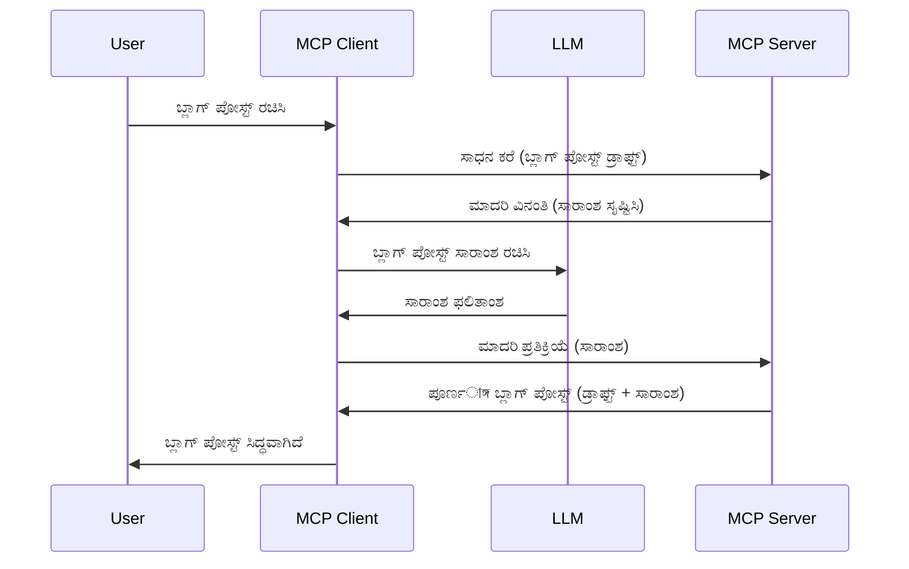

# ನೊಂದಣಿ - ಕ್ಲೈಂಟ್‌ಗೆ ವೈಶಿಷ್ಟ್ಯಗಳನ್ನು ನಿಯೋಜಿಸುವುದು

ಕೆಲ್ಸಮಯಗಳಲ್ಲಿ, ಸಾಮಾನ್ಯ ಗುರಿಯನ್ನು ಸಾಧಿಸಲು MCP ಕ್ಲೈಂಟ್ ಮತ್ತು MCP ಸರ್ವರ್ ಸಹಕಾರ ಮಾಡಬೇಕಾಗುತ್ತದೆ. ಸರ್ವರ್‌ಗೆ ಕ್ಲೈಂಟ್ ಮೇಲಿರುವ LLM ಸಹಾಯ ಬೇಕಾದ ಪರಿಸ್ಥಿತಿಯೂ ಇರಬಹುದು. ಈ ಪರಿಸ್ಥಿತಿಗೆ, ನೊಂದಣಿಯನ್ನು ನೀವು ಬಳಸಬೇಕು.

ನನೋಡೋಣ ಕೆಲವು ಉಪಯೋಗಗಳು ಮತ್ತು ನೊಂದಣಿ ಒಳಗೊಂಡ ಪರಿಹಾರವನ್ನು ಹೇಗೆ ನಿರ್ಮಿಸುವುದು ಎಂಬುದನ್ನು.

## ವಿಮರ್ಶೆ

ಈ ಪಾಠದಲ್ಲಿ, ನಾವು ನೊಂದಣಿ ಯಾವಾಗ ಮತ್ತು ಎಲ್ಲಿಗೆ ಬಳಸಬೇಕು ಮತ್ತು ಅದನ್ನು ಯಾವುದೇ ರೀತಿಯಿಂದಾಗಿ ಹೇಗೆ ಹೊಂದಿಸುವುದು ತಿಳಿಸುವುದರಲ್ಲಿ ಕೇಂದ್ರೀಕರಿಸುತ್ತೇವೆ.

## ಕಲಿಕೆಯ ಗುರಿಗಳು

ಈ ಅಧ್ಯಾಯದಲ್ಲಿ, ನಾವು:

- ನೊಂದಣಿ ಎಂದರೇನು ಮತ್ತು ಅದನ್ನು ಯಾವಾಗ ಬಳಸಬೇಕು ಅರ್ಥಮಾಡಿಕೊಳ್ಳೋಣ.
- MCP ನಲ್ಲಿ ನೊಂದಣಿ ಹೇಗೆ ಹೊಂದಿಸುವುದನ್ನು ತೋರಿಸೋಣ.
- ನೊಂದಣಿಯ ನುಡಿದೃಶ್ಯಗಳನ್ನು ನೀಡೋಣ.

## ನೊಂದಣಿ ಎಂದೇನು ಮತ್ತು ಅದನ್ನು ಯಾಕೆ ಬಳಸಬೇಕು?

ನೊಂದಣಿ ಒಂದು ಸುಧಾರಿತ ವೈಶಿಷ್ಟ್ಯವಾಗಿದೆ, ಅದು ಈ ಕೆಳಗಿನ ರೀತಿಯಲ್ಲಿ ಕಾರ್ಯನಿರ್ವಹಿಸುತ್ತದೆ:


### ನೊಂದಣಿ ವಿನಂತಿ

ಸರಿಯಾಗಿದೆ, ಈಗ ನಮ್ಮ ಬಳಿ ನಂಬಿಗಸ್ತ ಪರಿಸ್ಥಿತಿಯ ಒಂದು ಮೈಲ್ ಎತ್ತರದ ದೃಷ್ಟಿ ಇದೆ, ಈಗ ಸರ್ವರ್ ಕ್ಲೈಂಟ್ ಗೆ ಕಳುಹಿಸುವ ನೊಂದಣಿ ವಿನಂತಿ ಬಗ್ಗೆ ಮಾತಾಡೋಣ. JSON-RPC ರೂಪದಲ್ಲಿ ಇಂತಹ ವಿನಂತಿಯೇ ಹೇಗಿರಬಹುದು ಎಂಬುದನ್ನು ಈತನು:

```json
{
  "jsonrpc": "2.0",
  "id": 1,
  "method": "sampling/createMessage",
  "params": {
    "messages": [
      {
        "role": "user",
        "content": {
          "type": "text",
          "text": "Create a blog post summary of the following blog post: <BLOG POST>"
        }
      }
    ],
    "modelPreferences": {
      "hints": [
        {
          "name": "claude-3-sonnet"
        }
      ],
      "intelligencePriority": 0.8,
      "speedPriority": 0.5
    },
    "systemPrompt": "You are a helpful assistant.",
    "maxTokens": 100
  }
}
```

ಇಲ್ಲಿ ಕೆಲವು ಸಂಗತಿಗಳು ಗಮನದಲ್ಲಿರಿಸಿಕೊಳ್ಳಲು ಇವೆ:

- Prompt, content -> text ಅಡಿಯಲ್ಲಿ, ನಮ್ಮ ಪ್ರಾಂಪ್ಟ್ ಆಗಿದ್ದು, LLM ಗೆ ಬ್ಲಾಗ್ ಪೋಸ್ಟ್ ವಿಷಯ ಸಂಕ್ಷೇಪಿಸುವ ಸೂಚನೆ.

- **modelPreferences**. ಈ ವಿಭಾಗವು ಅದು, ಉಪಯೋಗಿಸುವ ಸಂರಚನೆಯ ಶಿಫಾರಸು, LLM ಜೊತೆ ಯಾವ ಕಾನ್ಫಿಗರೇಶನ್ ಬಳಸಬೇಕೆಂದು ಸೂಚಿಸುವುದು. ಬಳಕೆದಾರ ಈ ಶಿಫಾರಸುಗಳನ್ನು ಅಳವಡಿಸಬಹುದು ಅಥವಾ ಬದಲಾಯಿಸಬಹುದು. ಈ ಸಂದರ್ಭದಲ್ಲಿ ಬಳಕೆ ಮಾಡಲು ಯಾವ ಮಾದರಿಯನ್ನು ಆಯ್ಕೆಮಾಡಬೇಕೆಂದು ಮತ್ತು ವೇಗ ಮತ್ತು ಬುದ್ಧಿಮತ್ತೆ ಆದ್ಯತೆಯನ್ನು ಸೂಚಿಸುವ ಶಿಫಾರಸುಗಳಿವು.
- **systemPrompt**, ಇದು ನಿಮ್ಮ ಸಾಮಾನ್ಯ ಸಿಸ್ಟಂ ಪ್ರಾಂಪ್ಟ್ ಆಗಿದ್ದು LLM ಗೆ ವ್ಯಕ್ತಿತ್ವ ನೀಡುತ್ತದೆ ಮತ್ತು ಮಾರ್ಗದರ್ಶನ ಸೂಚನೆಗಳನ್ನು ಒಳಗೊಂಡಿದೆ.
- **maxTokens**, ಈ ಮತ್ತೊಂದು ಗುಣ ಸಾಕ್ಷ್ಯವಾಗಿದೆ ಇದನ್ನು ಈ ಕಾರ್ಯಕ್ಕೆ ಎಷ್ಟು ಟೋಕನ್ ಗಳು ಉಪಯೋಗಿಸಬೇಕೆಂದು ಸೂಚಿಸಲು ಬಳಸಲಾಗುತ್ತದೆ.

### ನೊಂದಣಿ ಪ್ರತಿಕ್ರಿಯೆ

ಈ ಪ್ರತಿಕ್ರಿಯೆ MCP ಕ್ಲೈಂಟ್ ಕೊನೆಗೂ MCP ಸರ್ವರ್ ಗೆ ಕಳುಹಿಸುವದು ಮತ್ತು ಇದು ಕ್ಲೈಂಟ್ LLM ಗೆ ಕರೆಮಾಡಿ, ಪ್ರತಿಕ್ರಿಯೆಗೆ ಕಾಯುವ ನಂತರ ಈ ಸಂದೇಶವನ್ನು ರಚಿಸುವ ಫಲಿತಾಂಶವಾಗಿದೆ. JSON-RPC ರೂಪದಲ್ಲಿ ಇದು ಹೇಗಿರಬಹುದು ಎಂಬುದನ್ನು ನೋಡಿ:

```json
{
  "jsonrpc": "2.0",
  "id": 1,
  "result": {
    "role": "assistant",
    "content": {
      "type": "text",
      "text": "Here's your abstract <ABSTRACT>"
    },
    "model": "gpt-5",
    "stopReason": "endTurn"
  }
}
```

ನೀವಂತ ವಿಶಿಷ್ಟವಾಗಿ ಕೇಳಿದಂತೆ ಬ್ಲಾಗ್ ಪೋಸ್ಟ್ ಸಂಕ್ಷೇಪಣೆ ಪ್ರತಿಕ್ರಿಯೆ ಎಂದು ನೋಡಿಯಿರಿ. ಕೂಡಲೇ ಉಪಯೋಗಿಸಿದ `model` ನಮಗೆ ಕೇಳಿದ ಮಾದರಿ ಅಲ್ಲ, ಆದರೆ "gpt-5" "claude-3-sonnet" ಮೇಲೆ ಉಪಯೋಗಿಸಿದೆ. ಇದು ಬಳಕೆದಾರ ತಮ್ಮ ಆಯ್ಕೆ ಬದಲಾಯಿಸಬಹುದು ಎಂಬುದನ್ನು ತಿಳಿಸಲು ಮತ್ತು ನಿಮ್ಮ ನೊಂದಣಿ ವಿನಂತಿ ಶಿಫಾರಸು ಎಂಬುದನ್ನು ತೋರಿಸಲು.

ಸರಿಯಾಗಿದೆ, ಈಗ ನಾವು ಮುಖ್ಯ ವಿಭಾಗವನ್ನು ಅರ್ಥಮಾಡಿಕೊಳ್ಳೋಣ ಮತ್ತು "ಬ್ಲಾಗ್ ಪೋಸ್ಟ್ ರಚನೆ + ಸಂಕ್ಷೇಪ" ಕಾರ್ಯಕ್ಕೆ ಇದು ಹೇಗೆ ಉಪಯೋಗಿಸಬೇಕು ಎಂಬುದನ್ನು ನೋಡೋಣ.

### ಸಂದೇಶದ ಪ್ರಕಾರಗಳು

ನೊಂದಣಿ ಸಂದೇಶಗಳು ಕೇವಲ ಪಠ್ಯಕ್ಕೆ ಸೀಮಿತವಾಗಿಲ್ಲ, ಚಿತ್ರಗಳು ಮತ್ತು ಧ್ವನಿಯನ್ನು ಸಹ ಕಳುಹಿಸಬಹುದು. JSON-RPC ಹೇಗೆ ವಿಭಿನ್ನವಾಗಿ ಕಾಣುತ್ತದೆ ತೋರಿಸುತ್ತೇವೆ:

**ಪಠ್ಯ**

```json
{
  "type": "text",
  "text": "The message content"
}
```

**ಚಿತ್ರ ವಸ್ತು**

```json
{
  "type": "image",
  "data": "base64-encoded-image-data",
  "mimeType": "image/jpeg"
}
```

**ಧ್ವನಿ ವಸ್ತು**

```json
{
  "type": "audio",
  "data": "base64-encoded-audio-data",
  "mimeType": "audio/wav"
}
```

> NOTE: ನೊಂದಣಿ ಕುರಿತಾಗಿ ಹೆಚ್ಚಿನ ವಿವರಗಳಿಗೆ, [ಅಧಿಕೃತ ಡಾಕ್ಯುಮೆಂಟೇಶನ್](https://modelcontextprotocol.io/specification/2025-06-18/client/sampling) ನೋಡಿ

## ಕ್ಲೈಂಟ್‌ನಲ್ಲಿ ನೊಂದಣಿ ಹೇಗೆ ಹೊಂದಿಸುವುದು

> ಗಮನಿಸಿ: ನೀವು ಕೆವಲ ಸರ್ವರ್ ಕಟ್ಟುತ್ತಿರುವಿರಿ ಎಂದಾದರೆ ಇಲ್ಲಿ ಹೆಚ್ಚು ಮಾಡಲು ಅಗತ್ಯವಿಲ್ಲ.

ಕ್ಲೈಂಟ್‌ನಲ್ಲಿ, ನೀವು ಕೆಳಗಿನಂತೆ ವೈಶಿಷ್ಟ್ಯವನ್ನು ನಿರ್ದಿಷ್ಟಪಡಿಸಬೇಕು:

```json
{
  "capabilities": {
    "sampling": {}
  }
}
```

ನಂತರ ನಿಮ್ಮ ಆಯ್ದ ಕ್ಲೈಂಟ್ ಸರ್ವರ್ ಜೊತೆಗೆ ಆರಂಭಿಸಿದಾಗ ಇದನ್ನು ಉತ್ಪ್ರೇಕ್ಷಿಸುತ್ತಾರೆ.

## ನೊಂದಣಿಯ ನುಡಿದೃಶ್ಯ - ಬ್ಲಾಗ್ ಪೋಸ್ಟ್ ರಚನೆ

ನೋಡೋಣ ಸೇರಿ ನೊಂದಣಿ ಸರ್ವರ್ ರಚನೆಯನ್ನು, ನಾವು ಈ ಕೆಳಗಿನುದನ್ನು ಮಾಡಬೇಕಾಗುತ್ತದೆ:

1. ಸರ್ವರ್ ನಲ್ಲಿ ಉಪಕರಣವನ್ನು ರಚಿಸು.
2. ಆ ಉಪಕರಣವು ನೊಂದಣಿ ವಿನಂತಿ ರಚಿಸಬೇಕು.
3. ಉಪಕರಣವು ಕ್ಲೈಂಟ್ ನ ನೊಂದಣಿ ವಿನಂತಿಗೆ ಉತ್ತರ ಬರುವುದು ಕಾಯಬೇಕು.
4. ನಂತರ ಉಪಕರಣ ಫಲಿತಾಂಶವನ್ನು ಉತ್ಪತ್ತಿ ಮಾಡಬೇಕು.

ಹಂತ ಹantu ಹಂತವಾಗಿ ಕೋಡ್ ನೋಡೋಣ:

### -1- ಉಪಕರಣ ರಚಿಸು

**python**

```python
@mcp.tool()
async def create_blog(title: str, content: str, ctx: Context[ServerSession, None]) -> str:
    """Create a blog post and generate a summary"""

```

### -2- ನೊಂದಣಿ ವಿನಂತಿ ರಚಿಸು

ನಿಮ್ಮ ಉಪಕರಣವನ್ನು ಕೆಳಗಿನ ಕೋಡ್ ಜೊತೆಗೆ ವಿಸ್ತರಿಸು:

**python**

```python
post = BlogPost(
        id=len(posts) + 1,
        title=title,
        content=content,
        abstract=""
    )

prompt = f"Create an abstract of the following blog post: title: {title} and draft: {content} "

result = await ctx.session.create_message(
        messages=[
            SamplingMessage(
                role="user",
                content=TextContent(type="text", text=prompt),
            )
        ],
        max_tokens=100,
)

```

### -3- ಪ್ರತಿಕ್ರಿಯೆಗಾಗಿ ಕಾಯಿರಿ ಮತ್ತು ಉತ್ತರ ಹಿಂತಿರುಗಿಸಿ

**python**

```python
post.abstract = result.content.text

posts.append(post)

# ಸಂಪೂರ್ಣ ಉತ್ಪನ್ನವನ್ನು ಹಿಂತಿರುಗಿಸಿ
return json.dumps({
    "id": post.title,
    "abstract": post.abstract
})
```

### -4- ಸಂಪೂರ್ಣ ಕೋಡ್

**python**

```python
from starlette.applications import Starlette
from starlette.routing import Mount, Host

from mcp.server.fastmcp import Context, FastMCP

from mcp.server.session import ServerSession
from mcp.types import SamplingMessage, TextContent

import json


from uuid import uuid4
from typing import List
from pydantic import BaseModel


mcp = FastMCP("Blog post generator")

# app = FastAPI()

posts = []

class BlogPost(BaseModel):
    id: int
    title: str
    content: str
    abstract: str

posts: List[BlogPost] = []

@mcp.tool()
async def create_blog(title: str, content: str, ctx: Context[ServerSession, None]) -> str:
    """Create a blog post and generate a summary"""

    post = BlogPost(
        id=len(posts) + 1,
        title=title,
        content=content,
        abstract=""
    )

    prompt = f"Create an abstract of the following blog post: title: {title} and draft: {content} "

    result = await ctx.session.create_message(
        messages=[
            SamplingMessage(
                role="user",
                content=TextContent(type="text", text=prompt),
            )
        ],
        max_tokens=100,
    )

    post.abstract = result.content.text

    posts.append(post)

    # ಸಂಪೂರ್ಣ ಬ್ಲಾಗ್ ಪೋಸ್ಟ್ ಅನ್ನು ಹಿಂತಿರುಗಿಸಿ
    return json.dumps({
        "id": post.title,
        "abstract": post.abstract
    })

if __name__ == "__main__":
    print("Starting server...")
    # mcp.run()
    mcp.run(transport="streamable-http")

# ಈ app ಅನ್ನು ನಡೆಸಿ: python server.py
```

### -5- Visual Studio Code ನಲ್ಲಿ ಪರೀಕ್ಷೆ

Visual Studio Code ನಲ್ಲಿ ಇದನ್ನು ಪರೀಕ್ಷಿಸಲು, ಈ ಕೆಳಗಿನಂತೆ ಮಾಡಿ:

1. ಟರ್ಮಿನಲ್ ನಲ್ಲಿ ಸರ್ವರ್ ಪ್ರಾರಂಭಿಸಿ
1. ಅದನ್ನು *mcp.json* ನಲ್ಲಿ ಸೇರಿಸಿ (ಮತ್ತು ಇದು ಸ್ಟಾರ್ಟ್ ಆಗಿದ್ದು ಖಚಿತಪಡಿಸಿ) ಉದಾಹರಣೆಗೆ:

   ```json
   "servers": {
      "blog-server": {
        "type": "http",
        "url": "http://localhost:8000/mcp"
      }
   }
   ```

1. ಪ್ರಾಂಪ್ಟ್ ಟೈಪ್ ಮಾಡಿ:

   ```text
   create a blog post named "Where Python comes from", the content is "Python is actually named after Monty Python Flying Circus"
   ```

1. ನೊಂದಣಿ ನಡೆಯಲು ಅನುಮತಿಸಿ. ಮೊದಲ ವೇಳೆ ನೀವು ಇದನ್ನು ಪರೀಕ್ಷಿಸುತ್ತಿದ್ದೀರಾ, ಹೆಚ್ಚುವರಿ ಸಂವಾದವು ನಿಮ್ಮಿಗೆ ತೋರಿಸಲಾಗುತ್ತದೆ ಅದನ್ನು ಒಪ್ಪಬೇಕಾಗುತ್ತದೆ, ನಂತರ ನೀವು ಉಪಕರಣವನ್ನು ಚಾಲನೆ ಮಾಡಲು ಇದ್ದ ಸಾಮಾನ್ಯ ಸಂವಾದವನ್ನು ನೀವು ನೋಡುತ್ತೀರಿ

1. ಫಲಿತಾಂಶಗಳನ್ನು ಪರಿಶೀಲಿಸಿ. ನೀವು ಫಲಿತಾಂಶಗಳನ್ನು GitHub Copilot Chat ನಲ್ಲಿ ಸೊಗಸಾಗಿ ಪ್ರದರ್ಶಿತವಾಗಿರುವುದನ್ನೂ raw JSON ಪ್ರತಿಕ್ರಿಯೆಯನ್ನು ಕೂಡ ಪರಿಶೀಲಿಸಬಹುದು.

**ಬೋನಸ್**. Visual Studio Code ಉಪಕರಣಗಳು ನೊಂದಣಿಗೆ ಉತ್ತಮ ಬೆಂಬಲವನ್ನು ಹೊಂದಿವೆ. ನೀವು ನಿಮ್ಮ ಸ್ಥಾಪಿತ ಸರ್ವರ್ ಕ್ಕೆ ಹೋಗಿ ಮಾದರಿ ಪ್ರವೇಶವನ್ನು ಹೇಗೆ ಹೊಂದಿಸುವುದು ಎಂಬುದನ್ನು ಕನ್‌ಫಿಗರ್ ಮಾಡಬಹುದು:

1. ವಿಸ್ತರಣಾ ವಿಭಾಗಕ್ಕೆ ಹೋಗಿ.
1. "MCP SERVERS - INSTALLED" ವಿಭಾಗದಲ್ಲಿ ನಿಮ್ಮ ಸ್ಥಾಪಿತ ಸರ್ವರ್ ಗಾಗಿ ಗಿಯರ್ ಐಕಾನ್ ಆಯ್ಕೆಮಾಡಿ.
1. "Configure Model Access" ಆಯ್ಕೆಮಾಡಿ, ಇಲ್ಲಿ GitHub Copilot ನೊಂದಿಗೆ ಯಾವ ಮಾದರಿಗಳನ್ನು ನೊಂದಣೆಯ ಸಂದರ್ಭ ಬಳಸಬಹುದು ಅಂದುಕೊಳ್ಳಬಹುದು. "Show Sampling requests" ಆಯ್ಕೆಮಾಡಿ ಇತ್ತೀಚೆಗೆ ನಡೆದ ಎಲ್ಲಾ ನೊಂದಣಿ ವಿನಂತಿಗಳನ್ನೂ ವೀಕ್ಷಿಸಬಹುದು.

## ಕರ್ತವ್ಯ

ಈ ಕೃತಿಯಲ್ಲಿ, ನೀವು ಸ್ವಲ್ಪ ವ್ಯತ್ಯಾಸವಿರುವ ನೊಂದಣಿ ನಿರ್ಮಿಸುವಿರಿ, ಅದರಂತೆ ನಿರ್ಮಾಣವಾಗಿರುವ ಒಂದು ನೊಂದಣಿ ಸಂಯೋಜನೆ ಇದಾಗಿದೆ ಇದಕ್ಕೆ ಉತ್ಪನ್ನ ವಿವರಣೆ ರಚನೆಯನ್ನು ಬೆಂಬಲ ನೀಡುತ್ತದೆ. ನಿಮ್ಮ ಪರಿಸ್ಥಿತಿ ಇಲ್ಲಿ ಇದೆ:

**ಪರಿಸ್ಥಿತಿ**: ಇ-ಕಾಮರ್ಸ್ ಬ್ಯಾಕ್ ಆಫೀಸ್ ಕೆಲಸಗಾರರಿಗೆ ನೆರವಾಗಬೇಕು, ಉತ್ಪನ್ನ ವಿವರಣೆಗಳನ್ನು ರಚಿಸುವುದಕ್ಕೆ ಬಹಳ ಸಮಯ ಬೇಕಾಗುತ್ತದೆ. ಆದ್ದರಿಂದ, ನೀವು "create_product" ಎಂಬ ಉಪಕರಣವನ್ನು "title" ಮತ್ತು "keywords" ಅರ್ಗ್ಯುಮೆಂಟ್‌ಗಳೊಂದಿಗೆ ಕರೆಮಾಡುವ ಪರಿಹಾರವನ್ನು ನಿರ್ಮಿಸಬೇಕು ಮತ್ತು ಅದು ಸಂಪೂರ್ಣ ಉತ್ಪನ್ನವನ್ನು ಉತ್ಪಾದಿಸಬೇಕು, ಜೊತೆಗೆ "description" ಕ್ಷೇತ್ರವು ಕ್ಲೈಂಟ್ LLM ಮೂಲಕ ತುಂಬಿಸಿಕೊಂಡಿರಬೇಕು.

TIP: ನೀವು ಹಿಂತಡೆಯಿಂದ ಕಲಿತದ್ದನ್ನು ಉಪಯೋಗಿಸಿ ಈ ಸರ್ವರ್ ಮತ್ತು ಅದರ ಉಪಕರಣವನ್ನು ನೊಂದಣಿ ವಿನಂತಿಯಿಂದ ರಚಿಸಿ.

## ಪರಿಹಾರ

[ಪರಿಹಾರ](./solution/README.md)

## ಮುಖ್ಯ ಪಾಠಗಳು

ನೊಂದಣಿ ಒಂದು ಶಕ್ತಿಶಾಲಿ ವೈಶಿಷ್ಟ್ಯವಾಗಿದ್ದು, ಸರ್ವರ್ LLM ಸಹಾಯ ಬೇಕಾದಾಗ ಕೆಲಸಗಳನ್ನು ಕ್ಲೈಂಟ್ ಗೆ ನಿಯೋಜಿಸಲು ಸಹಾಯ ಮಾಡುತ್ತದೆ.

## ಮುಂದಿನದೇನು

- [ಅಧ್ಯಾಯ 4 - ಪ್ರಾಯೋಗಿಕ ಅನುಷ್ಠಾನ](../../04-PracticalImplementation/README.md)

---

<!-- CO-OP TRANSLATOR DISCLAIMER START -->
**ನಿರಾಕರಣೆ**:  
ಈ დಾಕ್ಯುಮೆಂಟ್ [Co-op Translator](https://github.com/Azure/co-op-translator) ಎಂಬ AI ಭಾಷಾಂತರ ಸೇವೆಯನ್ನು ಬಳಸಿಕೊಂಡು ಅನುವಾದಿಸಲಾಗಿದೆ. ನಾವು ಶುದ್ಧತೆಯನ್ನು ಸಾಧಿಸಲು ಯತ್ನಿಸುತ್ತಿದ್ದರೂ, ಸ್ವಯಂಚಾಲಿತ ಅನುವಾದಗಳಲ್ಲಿ ಹಿಂಸೆಗಳೇ ಅಥವಾ ತಪ್ಪುಗಳು ಇರಬಹುದು ಎಂಬುದನ್ನು ಜ್ಞಾಪಿಸಿಕೊಳ್ಳಿ. ಮೂಲ ಭಾಷೆಯ ದಸ್ತಾವೇಜು ಪ್ರಾಮಾಣಿಕ ಮೂಲವೆಂದು ಪರಿಗಣಿಸಬೇಕು. ಪ್ರಮುಖ ಮಾಹಿತಿಗಾಗಿ ವೃತ್ತಿಪರ ಮಾನವ ಭಾಷಾಂತರವನ್ನು ಶಿಫಾರಸು ಮಾಡಲಾಗುತ್ತದೆ. ಈ ಅನುವಾದ ಬಳಕೆಯಿಂದ ಉಂಟಾಗುವ ಯಾವುದೇ ತಪ್ಪು ಅರ್ಥಮಾಡಿಕೆ ಅಥವಾ ವ್ಯಾಖ್ಯಾನಗಳಿಗೆ ನಾವು ಜವಾಬ್ದಾರಿಯಾಗಿರಲಾರೆವು.
<!-- CO-OP TRANSLATOR DISCLAIMER END -->