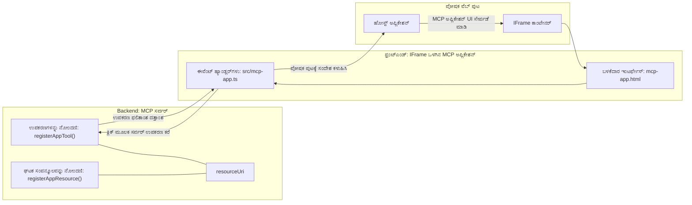

# MCP ಅಪ್ಲಿಕೇಶನ್ಗಳು

MCP ಅಪ್ಲಿಕೇಶನ್ಗಳು MCP ಯಲ್ಲಿ ಹೊಸ ಪರಿಕಲ್ಪನೆಯಾಗಿದೆ. ನಿಮಗೆ ಕೇವಲ ಟೂಲ್ ಕರೆನಿಂದ ಡೇಟಾವನ್ನು ಪ್ರತಿಕ್ರಿಯಿಸುತ್ತೇವೆ ಎಂದು ಮಾತ್ರವಲ್ಲ, ಈ ಮಾಹಿತಿಯನ್ನು ಏನು ಬಗೆಯಾಗಿ ಸಂವಹನ ಮಾಡಬೇಕು ಎಂಬುದರ ಕುರಿತು ಮಾಹಿತಿಯನ್ನೂ ಒದಗಿಸುತ್ತೇವೆ ಎಂಬುದು ಈ ಆಲೋಚನೆಯಾಗಿದೆ. ಅಂದರೆ, ಈಗ ಟೂಲ್ ಫಲಿತಾಂಶಗಳು UI ಮಾಹಿತಿಯನ್ನು ಒಳಗೊಂಡಿರಬಹುದು. ಆದರೆ ನಿಜಕ್ಕೂ ಅದನ್ನು ನಮಗೆ ಏಕೆ ಬೇಕಾಗುತ್ತದೆ? ಇಂದು ನೀವು ಹೇಗೆ ಕೆಲಸ ಮಾಡುತ್ತೀರೋ ಅದನ್ನು ಪರಿಗಣಿಸಿ. ನಿಮ್ಮ ಮುಂದಿದ್ದು MCP ಸರ್ವರ್‌ನ ಫಲಿತಾಂಶಗಳನ್ನು ನೀವು ಬಹುಶಃ ಮುಂದೆ ಇರುವ ಯಾವುದೋ ಫ್ರಂಟ್‌ಎಂಡ್ ಮೂಲಕ ಉಪಯೋಗಿಸುತ್ತೀರಿ, ಅದು ನೀವು ಬರೆಯಬೇಕಾದ ಮತ್ತು ನಿರ್ವಹಿಸಬೇಕಾದ ಕೋಡ್ ಆಗಿದೆ. ಕೆಲವೊಮ್ಮೆ ಅದೇ ನಿಮಗೆ ಬೇಕಾಗುತ್ತದೆ, ಆದರೆ ಕೆಲವೊಮ್ಮೆ ನೀವು ಡೇಟಾದಿಂದ ಯೂಸರ್ ಇಂಟರ್ಫೇಸ್ ಸಹಿತ ಸ್ವತಂತ್ರ/snippet ರೂಪದಲ್ಲಿ ಮಾಹಿತಿಯನ್ನು ತರಬಹುದು ಎಂದಾದರೆ ಅದ್ಭುತವಾಗುತ್ತದೆ.

## ಅವಲೋಕನ

ಈ ಪಾಠದಲ್ಲಿ MCP ಅಪ್ಲಿಕೇಶನ್ಗಳ ಬಗ್ಗೆ ಪ್ರಾಯೋಗಿಕ ಮಾರ್ಗದರ್ಶನ ನೀಡಲಾಗುತ್ತದೆ, ಅದನ್ನು ಹೇಗೆ ಪ್ರಾರಂಭಿಸಬೇಕು ಮತ್ತು ನಿಮ್ಮ ಇರುವ ವೆಬ್ ಆಪ್ಸ್‍ನಲ್ಲಿ ಅದನ್ನು ಹೇಗೆ ಸಂಯೋಜಿಸಬೇಕು ಎಂಬುದರ ಕುರಿತು ತಿಳಿಯ خواهید. MCP ಅಪ್ಲಿಕೇಶನ್ಗಳು MCP ಸ್ಟಾಂಡರ್ಡ್‌ಗೆ ಹೊಸ ಸರಣಿಯ ಸೇರಿಕೆ ಆಗಿದೆ.

## ಕಲಿಕೆಯ ಉದ್ದೇಶಗಳು

ಈ ಪಾಠದ ಕೊನೆಯಲ್ಲಿ, ನೀವು ಕುಶಲರಾಗಿರುತ್ತೀರಿ:

- MCP ಅಪ್ಲಿಕೇಶನ್ಗಳು ಏನೆಂದರೆ ಏನೋ ತಿಳಿಸಲು.
- MCP ಅಪ್ಲಿಕೇಶನ್ಗಳನ್ನು ಯಾವಾಗ ಉಪಯೋಗಿಸಬೇಕು.
- ನಿಮ್ಮ ಸ್ವಂತ MCP ಅಪ್ಲಿಕೇಶನ್ಗಳನ್ನು ನಿರ್ಮಿಸಲು ಮತ್ತು ಸಂಯೋಜಿಸಲು.

## MCP ಅಪ್ಲಿಕೇಶನ್ಗಳು - ಅದು ಹೇಗೆ ಕೆಲಸ ಮಾಡುತ್ತದೆ

MCP ಅಪ್ಲಿಕೇಶನ್ಗಳಲ್ಲಿ ಆಲೋಚನೆ ಒಂದು ಪ್ರತಿಕ್ರಿಯೆಯನ್ನು ಕಂಪೋನೆಂಟ್ ಆಗಿ ರೆಂಡರ್ ಮಾಡಲು ಒದಗಿಸುವುದು. ಇಂತಹ ಕಂಪೋನೆಂಟ್‌ಗೆ ದೃಶ್ಯ ಕಡತಗಳು ಮತ್ತು ಸಂವಹನ ಸಾಮರ್ಥ್ಯಗಳೂ ಇರಬಹುದು, ಉದಾಹರಣೆಗೆ, ಬಟನ್ ಕ್ಲಿಕ್ಸ್, ಬಳಕೆದಾರರ ಇನ್‌ಪುಟ್ ಇತ್ಯಾದಿ. ನಾವು ಸರ್ವರ್ ಬದಿಗೆ ಮತ್ತು ನಮ್ಮ MCP ಸರ್ವರ್‌ಗೆ ಹೋಗೋಣ. MCP ಅಪ್ಲಿಕೇಶನ್ ಕಂಪೋನೆಂಟ್ ರಚಿಸಲು ನೀವು ಒಂದು ಟೂಲ್ ಮತ್ತು ಅಪ್ಲಿಕೇಶನ್ ಸಂಸಾಧನವನ್ನು ರಚಿಸಬೇಕಾಗುತ್ತದೆ. ಈ ಎರಡೂ ಭಾಗಗಳನ್ನು resourceUri ಮೂಲಕ ಸಂಪರ್ಕಿಸುತ್ತಾರೆ.

ಇಲ್ಲಿ ಒಂದು ಉದಾಹರಣೆ ಇದೆ. ನಾವು ವೀಕ್ಷಿಸೋಣ, ಯಾವ ಭಾಗವೇನು ಕೆಲಸ ಮಾಡುತ್ತದೆ ಎಂದು ಹೇಗೆ:

```text
server.ts -- responsible for registering tools and the component as a UI component
src/
  mcp-app.ts -- wiring up event handlers
mcp-app.html -- the user interface
```

ಈ ದೃಶ್ಯವು ಕಂಪೋನೆಂಟ್ ಮತ್ತು ಅದರ ಲಾಜಿಕ್ ರಚನೆಗೆ ವಾಸ್ತುಶಿಲ್ಪವನ್ನು ವಿವರಿಸುತ್ತದೆ.


ನಾವು ಮುಂದುವರೆದು ಬ್ಯಾಕ್‌ಎಂಡಿಗೂ ಫ್ರಂಟ್‌ಎಂಡಿಗೂ ಉತ್ತುಮ್ವಾರಿಗಳನ್ನು ವಿವರಣೆ ಮಾಡೋಣ.

### ಬ್ಯಾಕ್‌ಎಂಡ್

ನಾವು ಇಲ್ಲಿ ಎರಡು ಕೆಲಸಗಳನ್ನು ನೆರವೇರಿಸಬೇಕಾಗುತ್ತದೆ:

- ಪರಸ್ಪರ ಕ್ರಿಯಾ ಮಾಡಲು ಬಯಸುವ ಟೂಲ್‌ಗಳನ್ನು ನೋಂದಣಿ ಮಾಡುವುದು.
- ಕಂಪೋನೆಂಟ್ ಅನ್ನು ವ್ಯಾಖ್ಯಾನಿಸುವುದು.

**ಟೂಲ್ ನೋಂದಣಿ**

```typescript
registerAppTool(
    server,
    "get-time",
    {
      title: "Get Time",
      description: "Returns the current server time.",
      inputSchema: {},
      _meta: { ui: { resourceUri } }, // ಈ ಸಾಧನವನ್ನು ಅದರ UI ಸಂಪನ್ಮೂಲಕ್ಕೆ ಲಿಂಕ್ ಮಾಡುತ್ತದೆ
    },
    async () => {
      const time = new Date().toISOString();
      return { content: [{ type: "text", text: time }] };
    },
  );

```

ಮೇಲ್ನೋಟ ಕೋಡ್ ಒಂದು `get-time` ಎಂಬ ಟೂಲ್ ಅನ್ನು ಅನಾವರಣ ಮಾಡುತ್ತದೆ, ಇದು ಯಾವುದೇ ಇನ್‌ಪುಟ್ ತೆಗೆದುಕೊಳ್ಳದೆ ಪ್ರಸ್ತುತ ಸಮಯವನ್ನು ಒದಗಿಸುತ್ತದೆ. ಬಳಕೆದಾರರ ಇನ್‌ಪುಟ್ ಸ್ವೀಕರಿಸುವ ಅಗತ್ಯ ಇದ್ದಾಗ ನಾವು ಟೂಲ್‌ಗಳಿಗೆ `inputSchema` ಅನ್ನು ವ್ಯಾಖ್ಯಾನಿಸಬಹುದು.

**ಕಂಪೋನೆಂಟ್ ನೋಂದಣಿ**

ಅದೇ ಕಡತದಲ್ಲಿ, ನಾವು ಕಂಪೋನೆಂಟ್ ನೊಂದಣಿ ಮಾಡಬೇಕಾಗುತ್ತದೆ:

```typescript
const resourceUri = "ui://get-time/mcp-app.html";

// ಯುಐಗೆ ಬಂಡಲ್ ಮಾಡಿದ HTML/JavaScript ಅನ್ನು ಹಿಂತಿರುಗಿಸುವಾಗ ಸಂಪನ್ಮೂಲವನ್ನು ನೋಂದಣಿ ಮಾಡಿಕೊಳ್ಳಿ.
registerAppResource(
  server,
  resourceUri,
  resourceUri,
  { mimeType: RESOURCE_MIME_TYPE },
  async () => {
    const html = await fs.readFile(path.join(DIST_DIR, "mcp-app.html"), "utf-8");

    return {
    contents: [
        { uri: resourceUri, mimeType: RESOURCE_MIME_TYPE, text: html },
    ],
    };
  },
);
```

ನಾವು ಕಂಪೋನೆಂಟ್‌ನ್ನು ಅದರ ಟೂಲ್‌ಗಳೊಂದಿಗೆ ಸಂಪರ್ಕಿಸಲು `resourceUri` ಅನ್ನು ಹೇಗೋ ಉದಾಹರಿಸುತ್ತೇವೆ. ವಿಶೇಷವಾಗಿ, UI ಫೈಲ್ ಅನ್ನು ಲೋಡ್ ಮಾಡಿ ಕಂಪೋನೆಂಟ್ ಅನ್ನು ಹಿಂತಿರುಗಿಸುವ ಕಾಲ್ಬ್ಯಾಕ್ ನಮಗೆ ಆಸಕ್ತಿಯಾಗಿದೆ.

### ಕಂಪೋನೆಂಟ್ ಫ್ರಂಟ್‌ಎಂಡ್

ಬ್ಯಾಕ್‌ಎಂಡ್ ಬೆಳೆದಂತೆ, ಇಲ್ಲಿ ಎರಡು ಪಾದಗಳಿವೆ:

- ಶುದ್ಧ HTML ನಲ್ಲಿ ಬರೆದುಕೊಂಡಿರುವ ಫ್ರಂಟ್‌ಎಂಡ್.
- ಘಟನೆಗಳನ್ನು ನಿರ್ವಹಿಸುವ ಮತ್ತು ಏನು ಮಾಡಬೇಕೆಂದು ನಿರ್ಧರಿಸುವ ಕೋಡ್, ಉದಾಹರಣೆಗೆ ಟೂಲ್‌ಗಳನ್ನು ಕರೆ ಅಥವಾ ಪ್ಯಾರೆಂಟ್ ವಿಂಡೋನಿಗೆ ಸಂದೇಶ ಕಳುಹಿಸುವುದು.

**ಬಳಕೆದಾರ ಇಂಟರ್ಫೇಸ್**

ಬಳಕೆದಾರ ಇಂಟರ್ಫೇಸ್ ಅನ್ನು ವೀಕ್ಷೋಣ.

```html
<!-- mcp-app.html -->
<!DOCTYPE html>
<html lang="en">
  <head>
    <meta charset="UTF-8" />
    <title>Get Time App</title>
  </head>
  <body>
    <p>
      <strong>Server Time:</strong> <code id="server-time">Loading...</code>
    </p>
    <button id="get-time-btn">Get Server Time</button>
    <script type="module" src="/src/mcp-app.ts"></script>
  </body>
</html>
```

**ಘಟನಾ ಜೋಡಣೆ**

ಕೊನೆಯ ಭಾಗ ಇದು, ಎಂದರೆ ಯುಐಯಲ್ಲಿ ಯಾವ ಭಾಗಕ್ಕೆ ಘಟನಾ ಹ್ಯಾಂಡ್ಲರ್ಸ್ ಬೇಕು ಮತ್ತು ಘಟನಾಸ್ಥಿತಿಗಳಾಗಿದ್ದಾಗ ಏನು ಮಾಡಬೇಕು ಎಂದು ಗುರುತಿಸುವುದು:

```typescript
// mcp-app.ts

import { App } from "@modelcontextprotocol/ext-apps";

// ಘಟಕ ಮೌಲ್ಯಗಳನ್ನು ಪಡೆಯಿರಿ
const serverTimeEl = document.getElementById("server-time")!;
const getTimeBtn = document.getElementById("get-time-btn")!;

// ಆಪ್ ಉದಾಹರಣೆಯನ್ನು ರಚಿಸಿ
const app = new App({ name: "Get Time App", version: "1.0.0" });

// ಸರ್ವರ್‌ನಿಂದ ಟೂಲ್ ಫಲಿತಾಂಶಗಳನ್ನು ನಿರ್ವಹಿಸಿ. ಪ್ರಾರಂಭಿಕ ಟೂಲ್ ಫಲಿತಾಂಶ ತಪ್ಪಿಸಿಕೊಳ್ಳದಂತೆ `app.connect()` ಹಿಂದೆ ಸೆಟ್ ಮಾಡಿ
// ಪ್ರಾರಂಭಿಕ ಟೂಲ್ ಫಲಿತಾಂಶ ತಪ್ಪಿಸಿಕೊಳ್ಳದಂತೆ
app.ontoolresult = (result) => {
  const time = result.content?.find((c) => c.type === "text")?.text;
  serverTimeEl.textContent = time ?? "[ERROR]";
};

// ಬಟನ್ ಕ್ಲಿಕ್ ಅನ್ನು ಜೋಡಿಸಿ
getTimeBtn.addEventListener("click", async () => {
  // `app.callServerTool()` ಯು UI ಗೆ ಸರ್ವರ್‌ನಿಂದ ತಾಜಾ ಡೇಟಾವನ್ನು ಕೇಳಿಕೊಳ್ಳಲು ಅವಕಾಶ ಕೊಡುತ್ತದೆ
  const result = await app.callServerTool({ name: "get-time", arguments: {} });
  const time = result.content?.find((c) => c.type === "text")?.text;
  serverTimeEl.textContent = time ?? "[ERROR]";
});

// ಹೋಸ್ಟ್‌ಗೆ ಸಂಪರ್ಕಿಸಿ
app.connect();
```

ಮೇಲಿನುದಾಹರಣೆಯಿಂದ ಕಾಣುವುದೇಂದರೆ, DOM ಅಂಶಗಳನ್ನು ಘಟನಗಳಿಗೆ ಸಂಧಿಸುವ ಸಾಮಾನ್ಯ ಕೋಡ್ ಇದು. ಕರೆಯುವ `callServerTool` ಫಂಕ್ಷನ್ ಬ್ಯಾಕ್‌ಎಂಡ್‌ನಲ್ಲಿ ಒಂದು ಟೂಲ್ ಅನ್ನು ಕರೆಸುವುದನ್ನು ಸೂಚಿಸುತ್ತದೆ.

## ಬಳಕೆದಾರರ ಇನ್‌ಪುಟ್ ಹ್ಯಾಂಡಲ್ ಮಾಡುವುದರಲ್ಲಿ

ಈವರೆಗೆ, ನಾವು ಒಂದು ಬಟನ್ ಹೊಂದಿರುವ ಕಂಪೋನೆಂಟ್ ನೋಡಿದ್ದೇವೆ, ಅದು ಕ್ಲಿಕ್ ಆಗುವಾಗ ಟೂಲ್ ಅನ್ನು ಕಾಲ್ ಮಾಡುತ್ತದೆ. ಇದೀಗ ನಾವು ಇನ್ಪುಟ್ ಫೀಲ್ಡ್ ಕೂಡ ಸೇರಿಸಿ, ಟೂಲ್‌ಗೆ ಆರ್ಗ್ಯೂಮೆಂಟ್‌ಗಳನ್ನು ಕಳುಹಿಸಬಹುದು ಎಂದು ನೋಡೋಣ. ನಾವು FAQ ಕಾರ್ಯಕ್ಷಮತೆ ('Frequently Asked Questions') ಅನ್ನು ಅನುಷ್ಠಾನಗೊಳಿಸೋಣ. ಇದೊಂದು ವರ್ಣನೆ:

- ಬಳಕೆದಾರ ಕೈಬರುವ ಕೀವರ್ಡ್ ಅನ್ನು ಟೈಪ್ ಮಾಡುವ ಬಟನ್ ಮತ್ತು ಇನ್ಪುಟ್ ಎಲಿಮೆಂಟ್ ಇರಬೇಕು, ಉದಾಹರಣೆಗೆ "Shipping". ಇದು ಬ್ಯಾಕ್‌ಎಂಡ್‌ನಲ್ಲಿ FAQ ಡೇಟಾದಲ್ಲಿ ಹುಡುಕುವ ಟೂಲ್ ಅನ್ನು ಕರೆಸಬೇಕು.
- ಈ ಎಫ್‌ಕ್ಯೂ ಹುಡುಕುವ ಕಾರ್ಯವನ್ನು ಬೆಂಬಲಿಸುವ ಟೂಲ್.

ಮೊದಲು ಬ್ಯಾಕ್‌ಎಂಡ್‌ಗೆ ಅಗತ್ಯ ಬೆಂಬಲ ಸೇರಿಸೋಣ:

```typescript
const faq: { [key: string]: string } = {
    "shipping": "Our standard shipping time is 3-5 business days.",
    "return policy": "You can return any item within 30 days of purchase.",
    "warranty": "All products come with a 1-year warranty covering manufacturing defects.",
  }

registerAppTool(
    server,
    "get-faq",
    {
      title: "Search FAQ",
      description: "Searches the FAQ for relevant answers.",
      inputSchema: zod.object({
        query: zod.string().default("shipping"),
      }),
      _meta: { ui: { resourceUri: faqResourceUri } }, // ಈ ಸಾಧನವನ್ನು ಅದರ UI ಸಂಪನ್ಮೂಲಕ್ಕೆ ಲಿಂಕ್ ಮಾಡುತ್ತದೆ
    },
    async ({ query }) => {
      const answer: string = faq[query.toLowerCase()] || "Sorry, I don't have an answer for that.";
      return { content: [{ type: "text", text: answer }] };
    },
  );
```

ನಾವು ಇಲ್ಲಿ `inputSchema` ಅನ್ನು ಹೇಗೆ ಪೂರೈಸುತ್ತೇವೆ ಮತ್ತು ಅದರೊಂದಿಗೆ `zod` ಸ್ಕೆಮಾ ನೀಡುತ್ತೇವೆ ಎಂದು ಕಾಣಬಹುದು:

```typescript
inputSchema: zod.object({
  query: zod.string().default("shipping"),
})
```

ಮೇಲಿನ ಸ್ಕೆಮಾ‌ನಲ್ಲಿ, ನಾವು ಒಂದು ಇನ್‌ಪುಟ್ ಪ್ಯಾರಾಮೀಟರ್ `query` ಇದೆ ಎಂದಿದ್ದು ಅದನ್ನು ಐಚ್ಛಿಕ ಮತ್ತು ಡೀಫಾಲ್ಟ್ ಮೌಲ್ಯ "shipping" ಕೂಡ ಸಲ್ಲುತ್ತದೆ ಎಂದು ಘೋಷಿಸುತ್ತೇವೆ.

ಚೆನ್ನಾಗಿದೆ, ಈಗ *mcp-app.html* ಗೆ ಹೋಗಿ ನಮಗೆ ಬೇಕಾದ ಯುಐ ಏನು ತಯಾರಿಸಬೇಕು ಎಂದು ನೋಡೋಣ:

```html
<div class="faq">
    <h1>FAQ response</h1>
    <p>FAQ Response: <code id="faq-response">Loading...</code></p>
    <input type="text" id="faq-query" placeholder="Enter FAQ query" />
    <button id="get-faq-btn">Get FAQ Response</button>
  </div>
```

ಚೆನ್ನಾಗಿದೆ, ಈಗ ನಮ್ಮ ಬಳಿ ಇನ್ಪುಟ್ ಎಲಿಮೆಂಟ್ ಮತ್ತು ಬಟನ್ ಇದೆ. ಮುಂದಕ್ಕೆ *mcp-app.ts* ಗೆ ಹೋಗಿ ಈ ಘಟನೆಗಳನ್ನು ಜೋಡಿಸೋಣ:

```typescript
const getFaqBtn = document.getElementById("get-faq-btn")!;
const faqQueryInput = document.getElementById("faq-query") as HTMLInputElement;

getFaqBtn.addEventListener("click", async () => {
  const query = faqQueryInput.value;
  const result = await app.callServerTool({ name: "get-faq", arguments: { query } });
  const faq = result.content?.find((c) => c.type === "text")?.text;
  faqResponseEl.textContent = faq ?? "[ERROR]";
});
```

ಮೇಲಿನ ಕೋಡ್‌ನಲ್ಲಿ ನಾವು:

- ಸಂವಹನ ಯುಐ ಅಂಶಗಳಿಗೆ ಸೂಚನೆಗಳನ್ನು ರಚಿಸೋಣ.
- ಬಟನ್ ಕ್ಲಿಕ್ ಹ್ಯಾಂಡಲಿಂಗ್ ಮಾಡೋಣ, ಇನ್ಪುಟ್ ಎಲಿಮೆಂಟ್ ಮೌಲ್ಯವನ್ನು ಓದಿ `app.callServerTool()` ಅನ್ನು `name` ಮತ್ತು `arguments` (ಅಲ್ಲಿ `query` ಮೌಲ್ಯವನ್ನು ಕಳುಹಿಸಿದ)ೊಂದಿಗೆ ಕರೆಸೋಣ.

ನೀವು `callServerTool` ಅನ್ನು ಕರೆಸುವಾಗ, ಪ್ಯಾರೆಂಟ್ ವಿಂಡೋಗೆ ಸಂದೇಶ ಕಳುಹಿಸುತ್ತದೆ ಮತ್ತು ಆ ವಿಂಡೋ MCP ಸರ್ವರ್ ಅನ್ನು ಕರೆಸುತ್ತದೆ.

### ಪ್ರಯತ್ನಿಸಿ

ಈಗ ಪ್ರಯತ್ನಿಸಿದರೆ ನೀವು ಕೆಳಗಿನವುಗಳನ್ನು ಕಾಣುತ್ತೀರಿ:


ಮತ್ತು "warranty" ಎಂಬ ಇನ್‌ಪುಟ್ ಮೂಲಕ ಪ್ರಯತ್ನಿಸಿದಾಗ:


ಈ ಕೋಡ್ ಅನ್ನು ಚಾಲನೆ ಮಾಡಲು, [ಕೋಡ್ ವಿಭಾಗ](./code/README.md) ಗೆ ತೆರಳಿರಿ

## Visual Studio Code ನಲ್ಲಿ ಪರೀಕ್ಷೆ

Visual Studio Code MCP ಅಪ್ಲಿಕೇಶನ್ಗಳಿಗೆ ಉತ್ತಮ ಬೆಂಬಲವನ್ನು ನೀಡುತ್ತದೆ ಮತ್ತು ನಿಮ್ಮ MCP ಅಪ್ಲಿಕೇಶನ್ಗಳನ್ನು ಪರೀಕ್ಷಿಸಲು ಇದೊಂದು ಸುಲಭ ಮಾರ್ಗವಾಗಿದೆ. Visual Studio Code ಉಪಯೋಗಿಸಲು, *mcp.json* ನಲ್ಲಿ ಸರ್ವರ್ ಎಂಟ್ರಿ ಸೇರಿಸಿ, ಹಾಗೆಯೇ:

```json
"my-mcp-server-7178eca7": {
    "url": "http://localhost:3001/mcp",
    "type": "http"
  }
```

ನಂತರ ಸರ್ವರ್ ಪ್ರಾರಂಭಿಸಿ, ನೀವು GitHub Copilot ಇನ್‌ಸ್ಟಾಲ್ ಮಾಡಿದ್ದರೆ ಚಾಟ್ ವಿಂಡೋ ಮೂಲಕ ನಿಮ್ಮ MCP ಅಪ್ಲಿಕೇಶನ್ಗಳೊಂದಿಗೆ ಸಂವಹನ ಮಾಡಬಹುದು.

ನೀವು "#get-faq" ಎಂಬ ಪ್ರಾಂಪ್ಟ್ ಮೂಲಕ ಅದನ್ನು ಚಾಲನೆ ಮಾಡಬಹುದು:


ಮತ್ತು ಜ್ಞಾಪಿಸಿಕೊಳ್ಳಿ ವೆಬ್ ಬ್ರೌಸರ್ ಮೂಲಕ ಹೋಲಿಸುವಂತೆ ಅದು ಅದೇ ರೀತಿ ರೆಂಡರ್ ಆಗುತ್ತದೆ:


## ಹಬ್ಬಿಸು

ಏಕ ಕಾಗದ ಕತ್ತರಿಸುವ ಆಟವನ್ನು ರಚಿಸಿ. ಅದು ಕೆಳಕಂಡವುಗಳನ್ನು ಹೊಂದಿರಬಹುದು:

UI:

- ಆಯ್ಕೆಗಳು ಇರುವ ಡ್ರಾಪ್ ಡೌನ್ ಲಿಸ್ಟ್
- ಆಯ್ಕೆ ಸಲ್ಲಿಸಲು ಬಟನ್
- ಯಾರು ಯಾವನನ್ನು ಆಯ್ಕೆಮಾಡಿದರೂ ಮತ್ತು ಯಾರು ಗೆದ್ದಿದಾನ್ನು ತೋರಿಸುವ ಲೇಬಲ್

ಸರ್ವರ್:

- "choice" ಅನ್ನು ಇನ್‌ಪುಟ್ ಆಗಿ ತೆಗೆದುಕೊಳ್ಳುವ ರಾಕ್ ಪೇಪರ್ ಸಿಸ್ಸರ್ ಟೂಲ್ ಇರಬೇಕು. ಜೊತೆಗೆ ಕಂಪ್ಯೂಟರ್ ಆಯ್ಕೆಯನ್ನು ರೆಂಡರ್ ಮಾಡಿ ಗೆದ್ದವರನ್ನು ನಿರ್ಧರಿಸಬೇಕು.

## ಪರಿಹಾರ

[ಪರಿಹಾರ](./assignment/README.md)

## ಸಾರಾಂಶ

ನಾವು MCP ಅಪ್ಲಿಕೇಶನ್ಗಳ ಈ ಹೊಸ ಪರಿಕಲ್ಪನೆಯನ್ನು ಕಲಿತೇವೆ. ಇದು ಹೊಸ ವಿಧಾನ, ಇದರಿಂದ MCP ಸರ್ವರ್ ಡೇಟಾವನ್ನು ಮಾತ್ರವಲ್ಲದೆ ಈ ಡೇಟಾವನ್ನು ಹೇಗೆ ಪ್ರದರ್ಶಿಸಬೇಕು ಎಂಬುದರ ಮೇಲೂ ಅಭಿಪ್ರಾಯ ಹೊಂದಿರಬಹುದು.

ಮತ್ತಷ್ಟು, ನಾವು ಕಲಿತೇವೆ MCP ಅಪ್ಲಿಕೇಶನ್ಗಳು IFrameನಲ್ಲಿ ಇರಿಸಲಾಗುತ್ತವೆ ಮತ್ತು MCP ಸರ್ವರ್‌ಗಳಿಗೆ ಸಂವಹನ ಮಾಡಲು ಪ್ಯಾರೆಂಟ್ ವೆಬ್ ಅಪ್ಲಿಕೇಶನ್‌ಗೆ ಸಂದೇಶಗಳನ್ನು ಕಳುಹಿಸಬೇಕಾಗುತ್ತದೆ. ಸರಳ ಜಾವಾಸ್ಕ್ರಿಪ್ಟ್ ಮತ್ತು ರಿಯಾಕ್ಟ್ ಸೇರಿದಂತೆ ಅನೇಕ ಗ್ರಂಥಾಲಯಗಳು ಈ ಸಂವಹನವನ್ನು ಸುಲಭಗೊಳಿಸುತ್ತವೆ.

## ಮುಖ್ಯ ಮಾಹಿತಿಗಳು

ನೀವು ಕಲಿತಿದ್ದು:

- MCP ಅಪ್ಲಿಕೇಶನ್ಗಳು ಒಂದು ಹೊಸ ಸ್ಟಾಂಡರ್ಡ್, ಡೇಟಾ ಮತ್ತು UI ವಿಚಾರಗಳನ್ನು ಒಟ್ಟುಗೂಡಿಸುವಲ್ಲಿ ಉಪಯುಕ್ತ.
- ಸುರಕ್ಷತೆಗಾಗಿ ಇವು IFrameನಲ್ಲಿ ಚಲಿಸುತ್ತವೆ.

## ಮುಂದಿನ ಹಂತ

- [ ಅಧ್ಯಾಯ 4](../../04-PracticalImplementation/README.md)

---

<!-- CO-OP TRANSLATOR DISCLAIMER START -->
**ನಿರಾಕರಣೆ**:
ಈ ಡಾಕ್ಯುಮೆಂಟ್ ಅನ್ನು AI ಅನುವಾದ ಸೇವೆ [Co-op Translator](https://github.com/Azure/co-op-translator) ಬಳಸಿ ಅನುವಾದಿಸಲಾಗಿದೆ. ನಾವು ಶುದ್ಧತೆಯಿಗಾಗಿ ಪ್ರಯತ್ನಿಸುತ್ತಿದ್ದರೂ, ಸ್ವಯಂಚಾಲಿತ ಅನುವಾದಗಳಲ್ಲಿ ತಪ್ಪುಗಳು ಅಥವಾ ಅಸ್ಪಷ್ಟತೆಗಳು ಇರಬಹುದು ಎಂದು ದಯವಿಟ್ಟು ಗಮನಿಸಿ. ಮೂಲ ಭಾಷೆಯಲ್ಲಿರುವ ಮೂಲ ಡಾಕ್ಯುಮೆಂಟ್ ಅಧಿಕೃತ ಮೂಲವಾಗಿರಬೇಕು. ಮಹತ್ವದ ಮಾಹಿತಿಗಳಿಗಾಗಿ, ವೃಂದಮಾನವನ ಅನುವಾದವನ್ನು ಶಿಫಾರಸು ಮಾಡಲಾಗುತ್ತದೆ. ಈ ಅನುವಾದದ ಉಪಯೋಗದಿಂದ ಉಂಟಾಗುವ ಯಾವುದೇ ತಪ್ಪು ಗ್ರಹಿಕೆಗಳು ಅಥವಾ ತಪ್ಪು ಅರ್ಥಮಾಡಿಕೆৰಿಕೆಗಳಿಗೆ ನಾವು ಜವಾಬ್ದಾರರಾಗಿರುವುದಿಲ್ಲ.
<!-- CO-OP TRANSLATOR DISCLAIMER END -->