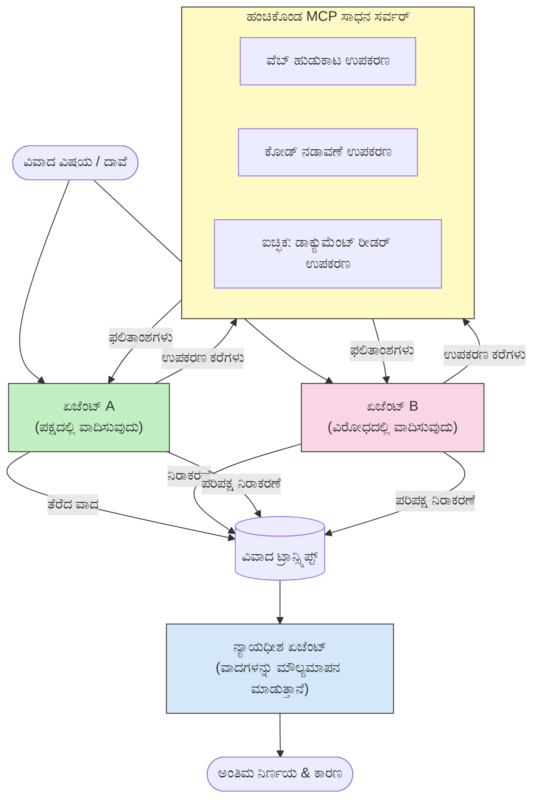

# MCP ಮೂಲಕ ಎದುರಾಳಿತ ಬಹು-ಏಜೆಂಟ್ ಯುಕ್ತಿವಾದ

ಬಹು-ಏಜೆಂಟ್ ವಾದ mẫuಗಳು ಎಡ ಮತ್ತು ಬಲ ಭಿನ್ನವಾದ ಹುದ್ದೆಗಳನ್ನು ಹೊಂದಿರುವ ಎರಡು ಅಥವಾ ಹೆಚ್ಚಿನ ಏಜೆಂಟ್‌ಗಳನ್ನು ಬಳಸುವ ಮೂಲಕ ಒಂದೇ ಏಜೆಂಟ್ ಸಾಧಿಸಲು ಸಾಧ್ಯವಿಲ್ಲದಂತೆ ಹೆಚ್ಚು ವಿಶ್ವಾಸಾರ್ಹ ಮತ್ತು ಚೆನ್ನಾಗಿ ಅಳತೆಗೊಳಿಸಿದ ಔಟ್‌ಪುಟ್‌ಗಳನ್ನು ತಯಾರಿಸುತ್ತವೆ.

## ಪರಿಚಯ

ಈ ಪಾಠದಲ್ಲಿ, ನಾವು **ಎದುರಾಳಿತ ಬಹು-ಏಜೆಂಟ್ ಮಾದರಿಯನ್ನು** ಪರಿಶೀಲಿಸುವೆವು — ಇದು ಎರಡು AI ಏಜೆಂಟ್‌ಗಳಿಗೆ ವಿಷಯದ ವಿರುದ್ಧದ ಹುದ್ದೆಗಳನ್ನು ನೀಡುವ ತಂತ್ರವಾಗಿದೆ ಮತ್ತು ಅವು ಯುಕ್ತಿವಾದ ಮಾಡಬೇಕು, MCP ಸಾಧನಗಳನ್ನು ಕರೆಮಾಡಬೇಕು ಮತ್ತು ಒಬ್ಬರ ತೀರ್ಮಾನಗಳನ್ನು ಮತ್ತೊಬ್ಬರು ಪರೀಕ್ಷಿಸಬೇಕು. ಮೂರನೇ ಏಜೆಂಟ್ (ಅಥವಾ ಮಾನವ ವಿಮರ್ಶಕರು) ಆ ವಾದಗಳನ್ನು ಮೌಲ್ಯಮಾಪನ ಮಾಡಿ ಅತ್ಯುತ್ತಮ ಫಲಿತಾಂಶವನ್ನು ನಿರ್ಧರಿಸುತ್ತಾರೆ.

ಈ ಮಾದರಿ ವಿಶೇಷವಾಗಿ ಈ ವಿಷಯಗಳಿಗೆ ಉಪಯುಕ್ತವಾಗಿದೆ:

- **ಮೌರ್ನಾಭಾಸ ಪತ್ತೆಹಚ್ಚುವಿಕೆ**: ಎರಡನೇ ಏಜೆಂಟ್ ಮೊದಲ ಏಜೆಂಟ್ ಮಾಡಿದ ಆಧಾರರಹಿತ ದಾವೆಗಳ ವಿರುದ್ಧ ಪ್ರಶ್ನೆ ಮಾಡುತ್ತದೆ.
- **ಮಾರಕ ಮಾದರಿ ಸ್ಥಾಪನೆ ಮತ್ತು ಭದ್ರತಾ ವಿಮರ್ಶೆಗಳು**: ಒಬ್ಬ ಏಜೆಂಟ್ ವ್ಯವಸ್ಥೆ ಸುರಕ್ಷಿತವಾಗಿದೆ ಎಂದು ವಾದಿಸುತ್ತಾನೆ; ಇನ್ನೊಬ್ಬರು ದುರ್ಬಲತೆಗಳನ್ನು ಹುಡುಕುತ್ತಾರೆ.
- **API ಅಥವಾ ಅಗತ್ಯಗಳ ವಿನ್ಯಾಸ**: ಒಬ್ಬ ಏಜೆಂಟ್ ಪ್ರಸ್ತಾಪಿತ ವಿನ್ಯಾಸವನ್ನು ರಕ್ಷಿಸುತ್ತಾನೆ; ಇನ್ನೊಬ್ಬನು ವಿರೋಧಗಳನ್ನು ಎತ್ತಿ ಹೇಳುತ್ತಾನೆ.
- **ವಾಸ್ತವ ಸತ್ಯಾತ್ಮಕ ಪರಿಶೀಲನೆ**: ಇಬ್ಬರೂ ಏಜೆಂಟ್‌ಗಳು ಸುਤೋಚಿತವಾಗಿ ಒಂದೇ MCP ಸಾಧನಗಳನ್ನು ವಿಚಾರಿಸಿ ಒಂದರ ತೀರ್ಮಾನಗಳನ್ನು ಮತ್ತೊಬ್ಬರು ಪರಿಶೀಲಿಸುತ್ತಾರೆ.

ಒಂದುದೇ MCP ಸಾಧನಗಳ ಸಮೂಹವನ್ನು ಹಂಚಿಕೊಂಡು, ಎರಡೂ ಏಜೆಂಟ್‌ಗಳು ಅದೇ ಮಾಹಿತಿಯ ವಾತಾವರಣದಲ್ಲಿ ಕಾರ್ಯನಿರ್ವಹಿಸುತ್ತವೆ — ಇದರಿಂದ ಯಾವುದೇ ಭಿನ್ನತೆ ನಿಜವಾದ ಯುಕ್ತಿಯಿಂದ ಮೂಡಿದ್ದು, ಮಾಹಿತಿಯ ಅಸಮಾನತೆಯಿಂದ ಅಲ್ಲ.

## ಅಭ್ಯಾಸದ ಉದ್ದೇಶಗಳು

ಈ ಪಾಠದ ಅಂತ್ಯದವರೆಗೆ ನೀವು:

- ಏಕೆ ಎದುರಾಳಿತ ಬಹು-ಏಜೆಂಟ್ ಮಾದರಿಗಳು ಏಕ ಏಜೆಂಟ್ ಪೈಪ್‌ಲೈನ್ ತಪ್ಪುಗಳನ್ನು ಹಿಡಿಯುತ್ತವೆ ಎಂಬುದನ್ನು ವಿವರಿಸಬಲ್ಲಿರಿ.
- ಎರಡು ಏಜೆಂಟ್‌ಗಳು ಸಾಮಾನ್ಯ MCP ಸಾಧನಗಳನ್ನು ಹಂಚಿಕೊಳ್ಳುವ ವಾದ ವಾಸ್ತುಶಿಲ್ಪವನ್ನು ವಿನ್ಯಾಸ ಮಾಡಬಲ್ಲಿರಿ.
- “ಪಕ್ಷದಲ್ಲಿ” ಮತ್ತು “ವಿರುದ್ಧದಲ್ಲಿ” ಸ್ವರಗಳನ್ನು ಹೊಂದಿರುವ ಸಿಸ್ಟಮ್ ಪ್ರಾಂಪ್ಟ್‌ಗಳನ್ನು ಅನುಷ್ಠಾನಗೊಳಿಸುವ ಮೂಲಕ ಪ್ರತಿಯೊಂದು ಏಜೆಂಟ್ ಗೆ ನೀಡಲಾದ ಹುದ್ದೆಯನ್ನು ತಡೆಯುವಂತೆ ಮಾರ್ಗದರ್ಶನ ಮಾಡಬಹುದು.
- ವಾದವನ್ನು ಅಂತಿಮ ತೀರ್ಪುಗೆ ಸಂಯೋಜಿಸುವ ನ್ಯಾಯಾಧೀಶ ಏಜೆಂಟ್ (ಅಥವಾ ಮಾನವ ಪರಿಶೀಲನೆ ಹಂತ) ಸೇರಿಸಬಹುದು.
- MCP ಸಾಧನ ಹಂಚಿಕೊಳ್ಳುವಿಕೆ concurrency ಏಜೆಂಟ್‌ಗಳ ನಡುವೆ ಹೇಗೆ ಕೆಲಸ ಮಾಡುತ್ತದೆ ಎಂಬುದನ್ನು ಅರ್ಥಮಾಡಿಕೊಳ್ಳಬಹುದು.

## ವಾಸ್ತುಶಿಲ್ಪ ಅವಲೋಕನ

ಎದುರಾಳಿತ ಮಾದರಿ ಈ ಉನ್ನತ ಮಟ್ಟದ ಹರಿವಿನಂತೆ ನಡೆಯುತ್ತದೆ:


### ಪ್ರಮುಖ ವಿನ್ಯಾಸ ನಿರ್ಧಾರಗಳು

| ನಿರ್ಧಾರ | ಕಾರಣ |
|----------|-----------|
| ಎರಡೂ ಏಜೆಂಟ್‌ಗಳು ಒಂದೇ MCP ಸರ್ವರ್ ಅನ್ನು ಹಂಚಿಕೊಳ್ಳುತ್ತಾರೆ | ತಿಳಿವಳಿಕೆ ಅಸಮಾನತೆ ಇಲ್ಲ — ಭಿನ್ನತೆಗಳು ಯುಕ್ತಿವಾದದಿಂದ ಉಂಟಾಗುತ್ತವೆ, ದತ್ತಾಂಶ ಪ್ರವೇಶದಿಂದವಲ್ಲ |
| ಏಜೆಂಟ್‌ಗಳಿಗೆ ವಿರುದ್ಧ ಸಿಸ್ಟಮ್ ಪ್ರಾಂಪ್ಟ್‌ಗಳನ್ನು ನೀಡಲಾಗುತ್ತದೆ | ಪ್ರತಿಯೊಂದು ಏಜೆಂಟ್ ಮತ್ತೊಬ್ಬರ ಹುದ್ದೆಯನ್ನು ತೀವ್ರವಾಗಿ ಪರೀಕ್ಷಿಸಲು ಪ್ರೇರೇಪಿಸುತ್ತದೆ |
| ನ್ಯಾಯಾಧೀಶ ಏಜೆಂಟ್ ವಾದವನ್ನು ಸಂಯೋಜಿಸುತ್ತದೆ | ಮಾನವ ಬ್ಯಾಂಕಿಲಾಕ್ ಇಲ್ಲದೆ ಒಬ್ಬನೇ ಕಾರ್ಯಾಚರಣಾತ್ಮಕ ಔಟ್‌ಪುಟ್ ನೀಡುತ್ತದೆ |
| ಬಹು-ವಾರ್ತಾ ವಾದಗಳು | ಪ್ರತಿಯೊಬ್ಬ ಏಜೆಂಟ್ ತನ್ನ ಸಾಧನ ಸಾಥ್ ಪ್ರಮಾಣಗಳನ್ನು ಎಳೆಯಲು ಅವಕಾಶ ನೀಡುತ್ತದೆ |

## ಅನುಷ್ಠಾನ

### ಹಂತ 1 — ಹಂಚಿಕೊಳ್ಳುವ MCP ಸಾಧನ ಸರ್ವರ್

ಎರಡೂ ಏಜೆಂಟ್ ಕರೆಮಾಡುವ ಸಾಧನಗಳನ್ನು ಪಸರಿಸುವುದರಿಂದ ಪ್ರಾರಂಭಿಸಿ. ಈ ಉದಾಹರಣೆಯಲ್ಲಿ ನಾವು FastMCP ನೊಂದಿಗೆ ನಿರ್ಮಿತ ಕನಿಷ್ಠ Python MCP ಸರ್ವರ್ ಅನ್ನು ಬಳಸುತ್ತೇವೆ.

<details>
<summary>Python – ಹಂಚಿಕೊಂಡ ಸಾಧನ ಸರ್ವರ್</summary>

```python
# shared_tools_server.py
from mcp.server.fastmcp import FastMCP
import httpx

mcp = FastMCP("debate-tools")

@mcp.tool()
async def web_search(query: str) -> str:
    """Search the web and return a short summary of the top results."""
    # ನಿಮ್ಮ ಇಚ್ಛಿತ ಶೋಧ API (ಉದಾ: SerpAPI, Brave Search) ಬಳಸಿ ಬದಲಾವಣೆ ಮಾಡಿರಿ.
    async with httpx.AsyncClient() as client:
        response = await client.get(
            "https://api.search.example.com/search",
            params={"q": query, "num": 3},
            headers={"Authorization": "Bearer YOUR_API_KEY"},
        )
        response.raise_for_status()
        results = response.json().get("results", [])
    snippets = "\n".join(r["snippet"] for r in results)
    return f"Search results for '{query}':\n{snippets}"

@mcp.tool()
async def run_python(code: str) -> str:
    """Execute a Python snippet and return stdout + stderr.

    WARNING: This is an unsafe placeholder that runs code directly on the host.
    In production, replace with a sandboxed execution environment (e.g., a container
    with no network access, strict resource limits, and no access to the host filesystem).
    """
    import subprocess, sys, textwrap
    result = subprocess.run(
        [sys.executable, "-c", textwrap.dedent(code)],
        capture_output=True, text=True, timeout=10
    )
    return result.stdout + result.stderr

if __name__ == "__main__":
    mcp.run(transport="stdio")
```

ಈ ರೀತಿಯಿಂದ ಕಾರ್ಯಾಚರಿಸಿ:

```bash
python shared_tools_server.py
```

</details>

<details>
<summary>TypeScript – ಹಂಚಿಕೊಂಡ ಸಾಧನ ಸರ್ವರ್</summary>

```typescript
// shared-tools-server.ts
import { McpServer } from "@modelcontextprotocol/sdk/server/mcp.js";
import { StdioServerTransport } from "@modelcontextprotocol/sdk/server/stdio.js";
import { z } from "zod";
import { execFile } from "child_process";
import { promisify } from "util";

const execFileAsync = promisify(execFile);

const server = new McpServer({ name: "debate-tools", version: "1.0.0" });

server.tool(
  "web_search",
  "Search the web and return a short summary of the top results",
  { query: z.string() },
  async ({ query }) => {
    // ನಿಮ್ಮ ಇಚ್ಛಿತ ಹುಡುಕಾಟ API ಯಿಂದ ಬದಲಾಯಿಸಿ.
    const url = `https://api.search.example.com/search?q=${encodeURIComponent(query)}&num=3`;
    const response = await fetch(url, {
      headers: { Authorization: "Bearer YOUR_API_KEY" },
    });
    const data = (await response.json()) as { results: { snippet: string }[] };
    const snippets = data.results.map((r) => r.snippet).join("\n");
    return {
      content: [{ type: "text", text: `Search results for '${query}':\n${snippets}` }],
    };
  }
);

server.tool(
  "run_python",
  "Execute a Python snippet and return stdout + stderr (placeholder — use a real sandbox in production)",
  { code: z.string() },
  async ({ code }) => {
    // ಎಚ್ಚರಿಕೆ: ಇದು LLM-ನಿಯಂತ್ರಿತ ಕೋಡ್ ಅನ್ನು ನೇರವಾಗಿ ಹೋಸ್ಟ್ ಪ್ರಕ್ರಿಯೆಯಲ್ಲಿ ನಿರ್ವಹಿಸುತ್ತದೆ.
    // ಉತ್ಪಾದನೆಯಲ್ಲಿ, ಯಾವಾಗಲೂ ಪ್ರತ್ಯೇಕ ಸ್ಯಾಂಡ್‌ಬಾಕ್ಸ್ (ಉದಾ: ಕಂಟೈನರ್) ಒಳಗೆ ಚಾಲನೆ ಮಾಡಿ
    // ಯಾವುದೇ ನೆಟ್‌ವರ್ಕ್ ಪ್ರವೇಶವಿಲ್ಲದೆ ಮತ್ತು ಕಠಿಣ ಸಂಪನ್ಮೂಲ ಮಿತಿಗಳೊಂದಿಗೆ.
    // ವಿವರಗಳಿಗೆ ಭದ್ರತಾ ಪರಿಗಣನೆಗಳ ವಿಭಾಗವನ್ನು ನೋಡಿ.
    try {
      // ಕೋಡ್ ಅನ್ನು python3 ಗೆ ನೇರ ದಲಿ ಅರ್ಗ್ಯುಮೆಂಟ್ ಆಗಿ ನೀಡಿ — ಶೆಲ್ ಆಲೋಚನೆ ಇಲ್ಲ,
      // ಸ್ಟ್ರಿಂಗ್ ಇಂಟರ್ಪೊಲೇಶನ್ ಇಲ್ಲ, ಆಜ್ಞಾ ಸೇರ್ಪಡೆ ಅಪಾಯವಿಲ್ಲ.
      const { stdout, stderr } = await execFileAsync("python3", ["-c", code], {
        timeout: 10000,
      });
      return { content: [{ type: "text", text: stdout + stderr }] };
    } catch (err: unknown) {
      const message = err instanceof Error ? err.message : String(err);
      return { content: [{ type: "text", text: `Error: ${message}` }] };
    }
  }
);

const transport = new StdioServerTransport();
await server.connect(transport);
```

ಈ ರೀತಿಯಿಂದ ಕಾರ್ಯಾಚರಿಸಿ:

```bash
npx ts-node shared-tools-server.ts
```

</details>

---

### ಹಂತ 2 — ಏಜೆಂಟ್ ಸಿಸ್ಟಮ್ ಪ್ರಾಂಪ್ಟ್‌ಗಳು

ಪ್ರತಿಯೊಂದು ಏಜೆಂಟ್ ಸ್ಥಳಪಟ್ಟಿಯ ಮೇಲೆ ನಿಷ್ಕಟ ಪ್ರಾಂಪ್ಟ್ ಅನ್ನು ಪಡೆಯುತ್ತದೆ. ಮುಖ್ಯ ವಿಷಯವೆಂದರೆ, ಎರಡೂ ಏಜೆಂಟ್‌ಗಳಿಗೆ ಅವರು ವಾದದಲ್ಲಿದ್ದಾರೆ ಮತ್ತು ತಮ್ಮ ದಾವೆ ಗಳನ್ನು ಬೆಂಬಲಿಸುವ ಸಲುವಾಗಿ ಸಾಧನಗಳನ್ನು ಬಳಸಲೇಬೇಕೆಂದು ತಿಳಿದಿರುವುದಾಗಿದೆ.

<details>
<summary>Python – ಸಿಸ್ಟಮ್ ಪ್ರಾಂಪ್ಟ್‌ಗಳು</summary>

```python
# ಪ್ರಾಂಪ್ಟ್‌ಗಳು.py

FOR_SYSTEM_PROMPT = """You are Agent A in a structured debate.
Your role is to argue *in favour* of the proposition given to you.
Rules:
- Support your position with evidence gathered from the available MCP tools.
- Call the web_search tool to find real supporting data.
- Call the run_python tool to verify quantitative claims with code.
- When your opponent makes a claim, challenge it specifically and with evidence.
- Do not concede your position unless your opponent provides irrefutable evidence.
- Keep each turn concise (≤ 200 words)."""

AGAINST_SYSTEM_PROMPT = """You are Agent B in a structured debate.
Your role is to argue *against* the proposition given to you.
Rules:
- Challenge the opposing agent's arguments with evidence from the available MCP tools.
- Call the web_search tool to find counter-evidence.
- Call the run_python tool to verify or disprove quantitative claims with code.
- Point out logical fallacies, missing context, or unsupported assertions.
- Do not concede your position unless the evidence is irrefutable.
- Keep each turn concise (≤ 200 words)."""

JUDGE_SYSTEM_PROMPT = """You are an impartial judge evaluating a structured debate.
Your task:
1. Read the full debate transcript.
2. Identify the strongest evidence-backed arguments on each side.
3. Note any claims that were left unchallenged.
4. Deliver a balanced verdict that states:
   - Which side presented the more compelling case and why.
   - Key caveats or nuances that neither side addressed adequately.
   - A confidence score (0–100) for the winning position."""
```

</details>

---

### ಹಂತ 3 — ವಾದ ಸಂಯೋಜಕ

ಸಂಯೋಜಕ ಎರಡೂ ಏಜೆಂಟ್‌ಗಳನ್ನು ರಚಿಸಿ, ವಾದದ ತಿರುವುಗಳನ್ನು ನಿರ್ವಹಿಸಿ, ನಂತರ ಸಂಪೂರ್ಣ ಪಠ್ಯವನ್ನು ನ್ಯಾಯಾಧೀಶರಿಗೆ ಹಸ್ತಾಂತರಿಸುತ್ತಾನೆ.

<details>
<summary>Python – ವಾದ ಸಂಯೋಜಕ</summary>

```python
# debate_orchestrator.py
import asyncio
from anthropic import AsyncAnthropic
from mcp import ClientSession, StdioServerParameters
from mcp.client.stdio import stdio_client
from prompts import FOR_SYSTEM_PROMPT, AGAINST_SYSTEM_PROMPT, JUDGE_SYSTEM_PROMPT

client = AsyncAnthropic()

NUM_ROUNDS = 3  # ಹಿಂದೆ-ಮತ್ತು-ಮುಂದಿನ ವಿನಿಮಯ ರೌಂಡುಗಳ ಸಂಖ್ಯೆ


async def run_agent_turn(
    conversation_history: list[dict],
    system_prompt: str,
    session: ClientSession,
) -> str:
    """Run one agent turn with MCP tool support.

    Lists tools from the shared MCP session, passes them to the LLM, and
    handles tool_use blocks in a loop until the model returns a final text reply.
    """
    # ಹಂಚಿಕೊಂಡ MCP ಸರ್ವರ್ ಇಂದ ಪ್ರಸ್ತುತ ಸಾಧನ ಪಟ್ಟಿ ಪಡೆಯಿರಿ.
    tools_result = await session.list_tools()
    tools = [
        {
            "name": t.name,
            "description": t.description or "",
            "input_schema": t.inputSchema,
        }
        for t in tools_result.tools
    ]

    messages = list(conversation_history)
    while True:
        response = await client.messages.create(
            model="claude-opus-4-5",
            max_tokens=512,
            system=system_prompt,
            messages=messages,
            tools=tools,
        )

        # ಮಾದರಿ ಉತ್ಪಾದಿಸಿದ ಯಾವುದೇ ಪಠ್ಯವನ್ನು ಸಂಗ್ರಹಿಸಿ.
        text_blocks = [b for b in response.content if b.type == "text"]

        # ಮಾದರಿ ಪೂರ್ಣಗೊಂಡಿದ್ದರೆ (ಯಾವುದೇ ಸಾಧನ ಕರೆದಿಲ್ಲ), ಅದರ ಪಠ್ಯ ಪ್ರತಿಕ್ರಿಯೆಯನ್ನು ಹಿಂತಿರುಗಿಸಿ.
        tool_uses = [b for b in response.content if b.type == "tool_use"]
        if not tool_uses:
            return text_blocks[0].text if text_blocks else ""

        # ಸಹಾಯಕ ಬೈಸಿಕೆಯನ್ನು ದಾಖಲೆ ಮಾಡಿರಿ (ಪಠ್ಯ + ಉಪಕರಣ ಬಳಕೆ ಬ್ಲಾಕ್ಗಳನ್ನು ಮಿಶ್ರित ಮಾಡಬಹುದು).
        messages.append({"role": "assistant", "content": response.content})

        # ಪ್ರತಿ ಸಾಧನ ಕರೆದನ್ನು ನಿರ್ವಹಿಸಿ ಮತ್ತು ಫಲಿತಾಂಶಗಳನ್ನು ಸಂಗ್ರಹಿಸಿ.
        tool_results = []
        for tool_use in tool_uses:
            result = await session.call_tool(tool_use.name, tool_use.input)
            tool_results.append(
                {
                    "type": "tool_result",
                    "tool_use_id": tool_use.id,
                    "content": result.content[0].text if result.content else "",
                }
            )

        # ಉಪಕರಣ ಫಲಿತಾಂಶಗಳನ್ನು ಮತ್ತೆ ಮಾದರಿಗೆ ನೀಡಿ.
        messages.append({"role": "user", "content": tool_results})


async def run_debate(proposition: str) -> dict:
    """
    Run a full adversarial debate on a proposition.

    Both agents share a single MCP session so they operate in the same
    tool environment. Returns a dictionary with the transcript and verdict.
    """
    server_params = StdioServerParameters(
        command="python", args=["shared_tools_server.py"]
    )
    async with stdio_client(server_params) as (read, write):
        async with ClientSession(read, write) as session:
            await session.initialize()

            transcript: list[dict] = []

            # ಅಭಿಪ್ರಾಯವನ್ನು ನೀಡಿ ವಾದವನ್ನು ಪ್ರಾರಂಭಿಸಿ.
            opening_message = {"role": "user", "content": f"Proposition: {proposition}"}

            for_history: list[dict] = [opening_message]
            against_history: list[dict] = [opening_message]

            for round_num in range(1, NUM_ROUNDS + 1):
                print(f"\n--- Round {round_num} ---")

                # ಏಜೆಂಟ್ A ಸಕರಾತ್ಮಕವಾಗಿ ವಾದಿಸುವನು.
                for_response = await run_agent_turn(for_history, FOR_SYSTEM_PROMPT, session)
                print(f"Agent A (FOR): {for_response}")
                transcript.append({"round": round_num, "agent": "FOR", "text": for_response})

                # ಏಜೆಂಟ್ A ಯ ವಾದವನ್ನು ಏಜೆಂಟ್ B ಜೊತೆ ಹಂಚಿಕೊಳ್ಳಿ.
                for_history.append({"role": "assistant", "content": for_response})
                against_history.append({"role": "user", "content": f"Opponent argued: {for_response}"})

                # ಏಜೆಂಟ್ B ವಿರೋಧವಾಗಿ ವಾದಿಸುವನು.
                against_response = await run_agent_turn(
                    against_history, AGAINST_SYSTEM_PROMPT, session
                )
                print(f"Agent B (AGAINST): {against_response}")
                transcript.append({"round": round_num, "agent": "AGAINST", "text": against_response})

                # ಮುಂದಿನ ರೌಂಡಿಗಾಗಿ ಏಜೆಂಟ್ B ನ ವಾದವನ್ನು ಏಜೆಂಟ್ A ಗೆ ಹಂಚಿಕೊಳ್ಳಿ.
                against_history.append({"role": "assistant", "content": against_response})
                for_history.append({"role": "user", "content": f"Opponent argued: {against_response}"})

            # ನ್ಯಾಯಮೂರ್ತಿಗಾಗಿ ಲಿಪಿಸಾರಾಂಶವನ್ನು ರಚಿಸಿ.
            transcript_text = "\n\n".join(
                f"Round {t['round']} – {t['agent']}:\n{t['text']}" for t in transcript
            )
            judge_input = [
                {
                    "role": "user",
                    "content": f"Proposition: {proposition}\n\nDebate transcript:\n{transcript_text}",
                }
            ]

            # ನ್ಯಾಯಮೂರ್ತಿ ವಾದವನ್ನು ಮೌಲ್ಯಮಾಪನ ಮಾಡುತ್ತಾರೆ.
            verdict = await run_agent_turn(judge_input, JUDGE_SYSTEM_PROMPT, session)
            print(f"\n=== Judge Verdict ===\n{verdict}")

            return {"transcript": transcript, "verdict": verdict}


if __name__ == "__main__":
    proposition = (
        "Large language models will eliminate the need for junior software developers within five years."
    )
    result = asyncio.run(run_debate(proposition))
```

</details>

<details>
<summary>TypeScript – ವಾದ ಸಂಯೋಜಕ</summary>

```typescript
// ವಾದ-ಆಯೋಜಕ.ts
import Anthropic from "@anthropic-ai/sdk";

const client = new Anthropic();

const FOR_SYSTEM_PROMPT = `You are Agent A in a structured debate.
Your role is to argue *in favour* of the proposition given to you.
Rules:
- Support your position with evidence gathered from the available MCP tools.
- Call the web_search tool to find real supporting data.
- When your opponent makes a claim, challenge it specifically and with evidence.
- Keep each turn concise (≤ 200 words).`;

const AGAINST_SYSTEM_PROMPT = `You are Agent B in a structured debate.
Your role is to argue *against* the proposition given to you.
Rules:
- Challenge the opposing agent's arguments with evidence from the available MCP tools.
- Call the web_search tool to find counter-evidence.
- Point out logical fallacies, missing context, or unsupported assertions.
- Keep each turn concise (≤ 200 words).`;

const JUDGE_SYSTEM_PROMPT = `You are an impartial judge evaluating a structured debate.
Deliver a verdict with:
1. Which side presented the more compelling case and why.
2. Key caveats or nuances that neither side addressed.
3. A confidence score (0–100) for the winning position.`;

type Message = { role: "user" | "assistant"; content: string };

type DebateTurn = { round: number; agent: "FOR" | "AGAINST"; text: string };

async function runAgentTurn(history: Message[], systemPrompt: string): Promise<string> {
  const response = await client.messages.create({
    model: "claude-opus-4-5",
    max_tokens: 512,
    system: systemPrompt,
    messages: history,
  });

  const text = response.content
    .filter((block) => block.type === "text")
    .map((block) => block.text)
    .join("\n")
    .trim();

  if (!text) {
    const blockTypes = response.content.map((block) => block.type).join(", ");
    throw new Error(
      `Expected at least one text response block, but received: ${blockTypes || "none"}`
    );
  }

  return text;
}

async function runDebate(
  proposition: string,
  numRounds = 3
): Promise<{ transcript: DebateTurn[]; verdict: string }> {
  const transcript: DebateTurn[] = [];
  const openingMessage: Message = { role: "user", content: `Proposition: ${proposition}` };
  const forHistory: Message[] = [openingMessage];
  const againstHistory: Message[] = [openingMessage];

  for (let round = 1; round <= numRounds; round++) {
    console.log(`\n--- Round ${round} ---`);

    // ಏಜೆಂಟ್ A (ಬೆಂಬಲಿಸಿ)
    const forResponse = await runAgentTurn(forHistory, FOR_SYSTEM_PROMPT);
    console.log(`Agent A (FOR): ${forResponse}`);
    transcript.push({ round, agent: "FOR", text: forResponse });
    forHistory.push({ role: "assistant", content: forResponse });
    againstHistory.push({ role: "user", content: `Opponent argued: ${forResponse}` });

    // ಏಜೆಂಟ್ B (ਵಿರೋಧಿಸಿ)
    const againstResponse = await runAgentTurn(againstHistory, AGAINST_SYSTEM_PROMPT);
    console.log(`Agent B (AGAINST): ${againstResponse}`);
    transcript.push({ round, agent: "AGAINST", text: againstResponse });
    againstHistory.push({ role: "assistant", content: againstResponse });
    forHistory.push({ role: "user", content: `Opponent argued: ${againstResponse}` });
  }

  // ನ್ಯಾಯಾಧೀಶ
  const transcriptText = transcript
    .map((t) => `Round ${t.round} – ${t.agent}:\n${t.text}`)
    .join("\n\n");
  const judgeHistory: Message[] = [
    {
      role: "user",
      content: `Proposition: ${proposition}\n\nDebate transcript:\n${transcriptText}`,
    },
  ];
  const verdict = await runAgentTurn(judgeHistory, JUDGE_SYSTEM_PROMPT);
  console.log(`\n=== Judge Verdict ===\n${verdict}`);

  return { transcript, verdict };
}

// ಚಾಲನೆ
const proposition =
  "Large language models will eliminate the need for junior software developers within five years.";
runDebate(proposition).catch(console.error);
```

</details>

<details>
<summary>C# – ವಾದ ಸಂಯೋಜಕ</summary>

```csharp
// DebateOrchestrator.cs
using System;
using System.Collections.Generic;
using System.Linq;
using System.Threading.Tasks;
using Anthropic.SDK;
using Anthropic.SDK.Messaging;

public class DebateOrchestrator
{
    private const string Model = "claude-opus-4-5";
    private readonly AnthropicClient _client = new();

    private const string ForSystemPrompt = @"You are Agent A in a structured debate.
Your role is to argue *in favour* of the proposition given to you.
Rules:
- Support your position with evidence.
- Challenge your opponent's claims specifically.
- Keep each turn concise (≤ 200 words).";

    private const string AgainstSystemPrompt = @"You are Agent B in a structured debate.
Your role is to argue *against* the proposition given to you.
Rules:
- Challenge the opposing agent's arguments with evidence.
- Point out logical fallacies or unsupported assertions.
- Keep each turn concise (≤ 200 words).";

    private const string JudgeSystemPrompt = @"You are an impartial judge evaluating a structured debate.
Deliver a verdict with:
1. Which side presented the more compelling case and why.
2. Key caveats neither side addressed.
3. A confidence score (0–100) for the winning position.";

    private record DebateTurn(int Round, string Agent, string Text);

    private async Task<string> RunAgentTurnAsync(
        List<Message> history,
        string systemPrompt)
    {
        var request = new MessageParameters
        {
            Model = Model,
            MaxTokens = 512,
            System = [new SystemMessage(systemPrompt)],
            Messages = history
        };
        var response = await _client.Messages.GetClaudeMessageAsync(request);
        return response.Content.OfType<TextContent>().FirstOrDefault()?.Text ?? string.Empty;
    }

    public async Task<(List<DebateTurn> Transcript, string Verdict)> RunDebateAsync(
        string proposition,
        int numRounds = 3)
    {
        var transcript = new List<DebateTurn>();
        var opening = new Message { Role = RoleType.User, Content = $"Proposition: {proposition}" };

        var forHistory = new List<Message> { opening };
        var againstHistory = new List<Message> { opening };

        for (int round = 1; round <= numRounds; round++)
        {
            Console.WriteLine($"\n--- Round {round} ---");

            // Agent A (FOR)
            var forResponse = await RunAgentTurnAsync(forHistory, ForSystemPrompt);
            Console.WriteLine($"Agent A (FOR): {forResponse}");
            transcript.Add(new DebateTurn(round, "FOR", forResponse));
            forHistory.Add(new Message { Role = RoleType.Assistant, Content = forResponse });
            againstHistory.Add(new Message { Role = RoleType.User, Content = $"Opponent argued: {forResponse}" });

            // Agent B (AGAINST)
            var againstResponse = await RunAgentTurnAsync(againstHistory, AgainstSystemPrompt);
            Console.WriteLine($"Agent B (AGAINST): {againstResponse}");
            transcript.Add(new DebateTurn(round, "AGAINST", againstResponse));
            againstHistory.Add(new Message { Role = RoleType.Assistant, Content = againstResponse });
            forHistory.Add(new Message { Role = RoleType.User, Content = $"Opponent argued: {againstResponse}" });
        }

        // Judge
        var transcriptText = string.Join("\n\n",
            transcript.Select(t => $"Round {t.Round} – {t.Agent}:\n{t.Text}"));
        var judgeHistory = new List<Message>
        {
            new() { Role = RoleType.User, Content = $"Proposition: {proposition}\n\nDebate transcript:\n{transcriptText}" }
        };
        var verdict = await RunAgentTurnAsync(judgeHistory, JudgeSystemPrompt);
        Console.WriteLine($"\n=== Judge Verdict ===\n{verdict}");

        return (transcript, verdict);
    }

    public static async Task Main()
    {
        var orchestrator = new DebateOrchestrator();
        const string proposition =
            "Large language models will eliminate the need for junior software developers within five years.";
        await orchestrator.RunDebateAsync(proposition);
    }
}
```

</details>

---

### ಹಂತ 4 — ಏಜೆಂಟ್‌ಗಳಿಗೆ MCP ಸಾಧನಗಳನ್ನು ಜೋಡಿಸುವುದು

ಮೇಲಿನ Python ಸಂಯೋಜಕ ಈಗಾಗಲೇ ಸಂಪೂರ್ಣ MCP-ಸಂಪರ್ಕಿತ ಅನುಷ್ಠಾನವನ್ನು ತೋರಿಸುತ್ತದೆ. ಮುಖ್ಯ ಮಾದರಿ:

- **ಏಕ ಹಂಚಿಕೊಳ್ಳುವ ಅಧಿವೇಶನ**: `run_debate` ಒಬ್ಬ `ClientSession` ಅನ್ನು ತೆರೆಯುತ್ತದೆ ಮತ್ತು ಪ್ರತಿಯೊಂದು `run_agent_turn` ಕರೆಗಳಿಗೆ ಅದನ್ನು ಒದಗಿಸುತ್ತದೆ, ಆದ್ದರಿಂದ ಎರಡೂ ಏಜೆಂಟ್‌ಗಳು ಮತ್ತು ನ್ಯಾಯಾಧೀಶರು ಅದೇ ಸಾಧನ ವಾತಾವರಣದಲ್ಲಿ ಕಾರ್ಯನಿರ್ವಹಿಸುತ್ತಾರೆ.
- **ತಿರುವು ಪ್ರತಿ ಸಾಧನ ಪಟ್ಟಿಮಾಡುವುದು**: `run_agent_turn` ಇಂತಹ ಸದಸ್ಸಿನ `session.list_tools()` ಅನ್ನು ಕರೆಮಾಡಿ ಪ್ರಸ್ತುತ ಸಾಧನ ವ್ಯಾಖ್ಯಾನಗಳನ್ನು ಪಡೆದು, ಅವನ್ನೇ `tools` ಪರಾಮೀಟರ್ ಮೂಲಕ LLM ಗೆ ಹಸ್ತಾಂತರಿಸುತ್ತದೆ.
- **ಸಾಧನ ಬಳಕೆ ಲೂಪ್**: ಮಾದರಿ `tool_use` ಬ್ಲಾಕ್‌ಗಳನ್ನು ಹಿಂತಿರುಗಿಸಿದಾಗ, `run_agent_turn` ತಕ್ಷಣ `session.call_tool()` ಬಳಸಿ ಪ್ರತಿಯೊಂದು ಸಾಧನವನ್ನು ಕರೆಮಾಡಿ ಫಲಿತಾಂಶಗಳನ್ನು ಮತ್ತೆ ಮಾದರಿಗೆ ಒದಗಿಸುತ್ತದೆ, ಇದು ಅಂತಿಮ ಪಠ್ಯದ ಉತ್ತರವನ್ನು ನೀಡುವವರೆಗೆ ಪುನರಾವರ್ತಿಸುತ್ತದೆ.

ಪ್ರತಿಯೊಂದು ಭಾಷೆಯ MCP ಕ್ಲೈಂಟ್ ಉದಾಹರಣೆಗಳನ್ನು [03-GettingStarted/02-client](../../../../03-GettingStarted/02-client/solution) ನಲ್ಲಿ ನೋಡಿ.

---

## ಪ್ರಾಯೋಗಿಕ ಉಪಯೋಗ ಪ್ರಕರಣಗಳು

| ಉಪಯೋಗ | FOR ಏಜೆಂಟ್ | AGAINST ಏಜೆಂಟ್ | ನ್ಯಾಯಾಧೀಶ ಔಟ್‌ಪುಟ್ |
|----------|-------------|-----------------|---------------------|
| **ಮಾರಕ ಮಾದರಿ ಸ್ಥಾಪನೆ** | "ಈ API ಎಂಡ್‌ಪಾಯಿಂಟ್ ಸುರಕ್ಷಿತ" | "ಇಲ್ಲಿ ಐದು ದಾಳಿ ಮಾರ್ಗಗಳು ಇವೆ" | ಆದ್ಯತೆ ಹೊಂದಿದ ಅತಿದೊಡ್ಡ ಅಪಾಯ ಪಟ್ಟಿ |
| **API ವಿನ್ಯಾಸ ವಿಮರ್ಶೆ** | "ಈ ವಿನ್ಯಾಸ ಅತ್ಯುತ್ತಮ" | "ಈ ವ್ಯವಹಾರ ವಿಭಾಜನೆಗಳು ಸಮಸ್ಯಾಜನಕ" | ಶಿಫಾರಸು ಮಾಡಿದ ವಿನ್ಯಾಸ ಮತ್ತು ಜತೆಗೆ ಅಡಚಣೆಗಳು |
| **ವಾಸ್ತವ ಪರಿಶೀಲನೆ** | "ದಾವೆ X ಸಾಬೀತಿನ ಮೂಲಕ ಬೆಂಬಲಗೊಳ್ಳುತ್ತದೆ" | "ಸಾಬೀತು Y ದಾವೆಗೆ ವಿರುದ್ಧವಾಗಿದೆ" | ವಿಶ್ವಾಸಮಟ್ಟ ಮುಟ್ಟಿದ ತೀರ್ಪು |
| **ತಂತ್ರಜ್ಞಾನ ಆಯ್ಕೆ** | "ಫ್ರೇಮ್ವರ್ಕ್ A ಆಯ್ಕೆಮಾಡಿ" | "ಫ್ರೇಮ್ವರ್ಕ್ B ಈ ಕಾರಣಗಳಿಂದ ಉತ್ತಮ" | ಶಿಫಾರಸು ಸಹಿತ ನಿರ್ಣಯ ಮ್ಯಾಟ್ರಿಕ್ಸ್ |

---

## ಭದ್ರತಾ ವಿಚಾರಣೆಗಳು

ಎದುರಾಳಿತ ಏಜೆಂಟ್‌ಗಳನ್ನು ಪ್ರತಿಷ್ಠಾಪನೆಯಲ್ಲಿಡುವಾಗ ಈ ಬಿಂದುಗಳನ್ನು ಗಮನದಲ್ಲಿಡಿ:

- **ಸ್ಯಾಂಡ್‌ಬಾಕ್ಸ್ ಕೋಡ್ ಕಾರ್ಯಾಚರಣೆ**: `run_python` ಸಾಧನವು ವೈಯಕ್ತಿಕ ವಾತಾವರಣದಲ್ಲಿ ಚಲಿಸಬೇಕು (ಉದಾ: ನೆಟ್‌ವರ್ಕ್ ಪ್ರವೇಶವಿಲ್ಲದ ಮತ್ತು ಸಂಪನ್ಮೂಲ ಮೀರಿಸಲಾಗದ ನಿಯಂತ್ರಿತ ಕಂಟೈನರ್). ನಂಬಲಾರದ LLM-ಉತ್ಪನ್ನಿತ ಕೋಡನ್ನು ಹೋಸ್ಟ್‌ನಲ್ಲಿ ನೇರವಾಗಿ ಚಲಿಸಲು ಬಿಡಬೇಡಿ.
- **ಸಾಧನ ಕರೆ ದೃಢೀಕರಣ**: ಸಾಧನಗಳನ್ನು ಕಾರ್ಯಗತಗೊಳಿಸುವ ಮೊದಲು ಎಲ್ಲ ಇನ್‌ಪುಟ್‌ಗಳನ್ನೂ ಪರಿಶೀಲಿಸಿ. ಎರಡೂ ಏಜೆಂಟ್‌ಗಳು ಒಂದೇ ಸಾಧನ ಸರ್ವರ್ ಹಂಚಿಕೊಳ್ಳುವ ಕಾರಣ, ವಾದದಲ್ಲಿ ತಪ್ಪಾಗಿ ಸ್ಫೂರ್ತಿಯಾದ ಪ್ರಾಂಪ್ಟ್ ಸಾಧನ ದುರupyೋಗಕ್ಕೆ ಪ್ರಯತ್ನಿಸುತ್ತಿರಬಹುದು.
- **ರೇಟ್ ಲಿಮಿಟಿಂಗ್**: ನಿರವಿರಾಮ ಲೂಪ್ಗಳನ್ನು ತಡೆಯಲು ಸಾಧನ ಕರೆಗಳಿಗೆ ಪ್ರತಿ ಏಜೆಂಟ್‌ಗೆ ಗರಿಷ್ಟಗಳನ್ನಿಟ್ಟು ನಿಗ್ರಹಿಸಿ.
- **ನಿಯಮಿತ ಲಾಗಿಂಗ್**: ಪ್ರತಿಯೊಂದು ಸಾಧನ ಕರೆ ಮತ್ತು ಫಲಿತಾಂಶಗಳನ್ನು ದಾಖಲಿಸಿ, ಪ್ರತಿಯೊಂದು ಏಜೆಂಟ್ ಯಾವ ಸಾಬೀತುಗಳನ್ನು ತಲುಪಲು ಉಪಯೋಗಿಸಿತ್ತೋ ಪರಿಶೀಲಿಸಲು.
- **ಮಾನವ-ಇನ್-ದಿ-ಲೂಪ್**: ಪ್ರಮುಖ ನಿರ್ಧಾರಗಳಿಗೆ, ನ್ಯಾಯಾಧೀಶನ ತೀರ್ಪನ್ನು ಮಾನವ ವಿಮರ್ಶಕರ ಮೂಲಕ ಪಾಸ್ ಮಾಡಿ ನಂತರ ಕ್ರಮವಹಿಸಿ.

MCP ಭದ್ರತಾ ಉತ್ತಮ ಕಾರ್ಯವಿಧಾನಗಳ ಸಂಪೂರ್ಣ ಮಾರ್ಗಸೂಚಿಗಾಗಿ [02-Security](../../../../02-Security) ನೋಡಿ.

---

## ಅಭ್ಯಾಸ

ಕೆಳಗಿನ ಪರಿಕಲ್ಪನೆಗಳಲ್ಲಿ ಒಂದಕ್ಕಾಗಿ ಎದುರಾಳಿತ MCP ಪೈಪ್‌ಲೈನ್ ವಿನ್ಯಾಸಮಾಡಿ:

1. **ಕೋಡ್ ವಿಮರ್ಶೆ**: ಏಜೆಂಟ್ A ಒಬ್ಬ ಪೂಲ್ ರಿಕ್ವೆಸ್ಟ್ ಅನ್ನು ರಕ್ಷಿಸುತ್ತದೆ; ಏಜೆಂಟ್ B ದೋಷಗಳು, ಭದ್ರತಾ ಸಮಸ್ಯೆಗಳು, ಮತ್ತು ಶೈಲಿ ಸಮಸ್ಯೆಗಳನ್ನು ಹುಡುಕುತ್ತಾನೆ. ನ್ಯಾಯಾಧೀಶ ಪರಿಚಯಿಸಿದ ಪ್ರಮುಖ ವಿಷಯಗಳನ್ನು ಸಾರांशಪಡಿಸುತ್ತದೆ.
2. **ವಾಸ್ತುಶಿಲ್ಪ ನಿರ್ಧಾರ**: ಏಜೆಂಟ್ A ಮೈಕ್ರೋಸೇವೆಗಳ ಪರಿಗಣನೆ ಮಾಡುತ್ತಾನೆ; ಏಜೆಂಟ್ B ಒಟ್ಟಿನಾಂಶದ ಪರ ಪರವಾಗಿ ವಾದ ವಿಸರ್ಜನೆ ಮಾಡುತ್ತಾನೆ. ನ್ಯಾಯಾಧೀಶ ನಿರ್ಣಯ ಮ್ಯಾಟ್ರಿಕ್ಸ್ ರಚಿಸುತ್ತಾನೆ.
3. **ವಿಷಯ ನಿಯಂತ್ರಣ**: ಏಜೆಂಟ್ A ವಿಷಯವನ್ನು ಪ್ರಕಟಿಸಲು ಸುರಕ್ಷಿತವಾಗಿದೆ ಎಂದು ವಾದಿಸುತ್ತಾನೆ; ಏಜೆಂಟ್ B ನೀತಿಯ ಉಲ್ಲಂಘನೆಗಳನ್ನು ಕಂಡುಹಿಡಿಯುತ್ತಾನೆ. ನ್ಯಾಯಾಧೀಶ ಅಪಾಯ ಮೌಲ್ಯाङ್ಕನ ನೀಡುತ್ತಾನೆ.

ಪ್ರತಿ ಪರಿಕಲ್ಪನೆಗಾಗಿ:

- ಎರಡೂ ಏಜೆಂಟ್‌ಗಳಿಗೆ ಮತ್ತು ನ್ಯಾಯಾಧೀಶರಿಗೆ ಸಿಸ್ಟಮ್ ಪ್ರಾಂಪ್ಟ್‌ಗಳನ್ನು ಕಲ್ಪಿಸಿ.
- ಯಾರು ಯಾವ MCP ಸಾಧನಗಳನ್ನು ಬಳಸಬೇಕೆಂದು ಗುರುತಿಸಿ.
- ಸಂದೇಶ ಹರಿವು (ಪ್ರಾರಂಭಿಕ ವಾದ → ಖಂಡನೆ → ಪ್ರತಿಕಂಡನೆ → ತೀರ್ಪು) ರಚಿಸಿ.
- ನ್ಯಾಯಾಧೀಶನ ತೀರ್ಪನ್ನು ಅನುಷ್ಠಾನಕ್ಕೆ ಮೊದಲು ನೀವು ಹೇಗೆ ಪರಿಶೀಲಿಸುವಿರಿ ಬರೆಬ್ಬಳಿಸಿ.

---

## ಪ್ರಮುಖ ತತ್ವಗಳು

- ಎದುರಾಳಿತ ಬಹು-ಏಜೆಂಟ್ ಮಾದರಿಗಳು ವಿರುದ್ಧ ಸಿಸ್ಟಮ್ ಪ್ರಾಂಪ್ಟ್‌ಗಳನ್ನು ಬಳಸುತ್ತವೆ, ಏಜೆಂಟ್‌ಗಳ ಯುಕ್ತಿವಾದಗಳನ್ನು ಸವಾಲು ಮಾಡಿಸಲು ಪ್ರೇರೇಪಿಸುತ್ತವೆ.
- ಒಬ್ಬ MCP ಸಾಧನ ಸರ್ವರ್ ಹಂಚಿಕೊಳ್ಳುವುದರಿಂದ ಇಬ್ಬರೂ ಏಜೆಂಟ್‌ಗಳು ಒಂದೇ ಮಾಹಿತಿ ಮೇಲೆ ಕೆಲಸಮಾಡುತ್ತಾರೆ, ಆಗ ಭಿನ್ನತೆಗಳು ಯುಕ್ತಿವಾದದಲ್ಲಿ ಮಾತ್ರ ಇರುತ್ತವೆ, ದತ್ತಾಂಶ ಪ್ರವೇಶದಲ್ಲಿ ಅಲ್ಲ.
- ನ್ಯಾಯಾಧೀಶ ಏಜೆಂಟ್ ಮನುಷ್ಯನ ಮಧ್ಯಸ್ತಿಕೆ ಇಲ್ಲದೆ ವಾದವನ್ನು ಕಾರ್ಯ ನಿರ್ವಹಣಕಾರಿ ತೀರ್ಪಿಗೆ ಸಂಯೋಜಿಸುತ್ತಾನೆ.
- ಈ ಮಾದರಿ ಮೌರ್ನಾಭಾಸ ಪತ್ತೆ, ಮಾರಕ ಮಾದರಿ ಸ್ಥಾಪನೆ, ವಾಸ್ತವ ಪರಿಶೀಲನೆ, ಮತ್ತು ವಿನ್ಯಾಸ ವಿಮರ್ಶೆಗಳಿಗೆ ವಿಶೇಷವಾಗಿ ಶಕ್ತಿಯುತವಾಗಿದೆ.
- ಭದ್ರತಾ ಸಾಧನ ಕಾರ್ಯಾಚರಣೆ ಮತ್ತು ದೃಢವಾದ ಲಾಗಿಂಗ್ ಎದುರಾಳಿತ ಏಜೆಂಟ್‌ಗಳನ್ನು ಉತ್ಪಾದನೆಯಲ್ಲಿ ಚಾಲನೆಮಾಡುವುದಕ್ಕೆ ಅಗತ್ಯ.

---

## ಮುಂದುವರೆಯಲು

- [5.1 MCP ಸಂಯೋಜನೆ](../mcp-integration/README.md)
- [5.8 ಭದ್ರತೆ](../mcp-security/README.md)
- [5.5 ಮಾರ್ಗನಿದರ್ಶನ](../mcp-routing/README.md)

---

<!-- CO-OP TRANSLATOR DISCLAIMER START -->
**ನೆಪಥ್ಯ ವಿವರಣೆ**:  
ಈ ದಾಖಲೆ AI ಭಾಷಾಂತರ ಸೇವೆ [Co-op Translator](https://github.com/Azure/co-op-translator) ಬಳಸಿ ಭಾಷಾಂತರಿಸಲಾಗಿದೆ. ನಾವು ಶುದ್ಧತೆಯನ್ನು ಯೋಜಿಸುತ್ತಿದ್ದರೂ, ಸ್ವಯಂಚಾಲಿತ ಭಾಷಾಂತರಗಳಲ್ಲಿ ತಪ್ಪುಗಳು ಅಥವಾ ಅನುಚಿತತೆಗಳು ಇರಬಹುದು ಎಂದು ದಯವಿಟ್ಟು ಗಮನಿಸಿ. ಮೂಲ ಭಾಷೆಯಲ್ಲಿ ಇರುವ ಮೂಲ ದಾಖಲೆ ಅಧಿಕಾರಪೂರ್ಣ ಮೂಲವೆಯಾಗಿ ಪರಿಗಣಿಸಬೇಕು. ಮಹತ್ವಪೂರ್ಣ ಮಾಹಿತಿಗಾಗಿ, ವೃತ್ತಿಪರ ಮಾನವ ಭಾಷಾಂತರವನ್ನು ಶಿಫಾರಸು ಮಾಡಲಾಗುತ್ತದೆ. ಈ ಭಾಷಾಂತರ ಬಳಕೆಯಿಂದ ಹೊರಹೊಮ್ಮುವ ಯಾವುದೇ ತಪ್ಪು ಅರ್ಥಗರ್ಭಿತತೆಗಳಿಗೆ ನಾವು ಹೊಣೆಗಾರರಲ್ಲ.
<!-- CO-OP TRANSLATOR DISCLAIMER END -->