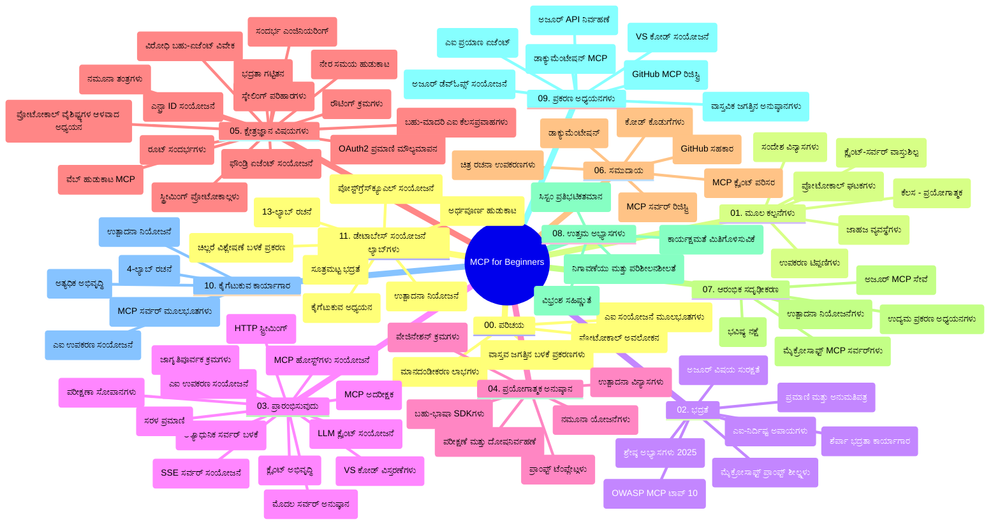

# ಆರಂಭಿಕರಿಗಾಗಿ ಮಾದರಿ ಸ೦ದರ್ಭ ಪ್ರೊಟೋಕಾಲ್ (MCP) - ಅಧ್ಯಯನ ಮಾರ್ಗದರ್ಶನ

ಈ ಅಧ್ಯಯನ ಮಾರ್ಗದರ್ಶನವು "ಆರಂಭಿಕರಿಗಾಗಿ ಮಾದರಿ ಸ೦ದರ್ಭ ಪ್ರೊಟೋಕಾಲ್ (MCP)" ಪಠ್ಯಕ್ರಮದ ರೆಪೊಸಿಟರಿ ರಚನೆ ಮತ್ತು ವಿಷಯದ ಅವಲೋಕನವನ್ನು ನೀಡುತ್ತದೆ. ಈ ಮಾರ್ಗದರ್ಶನವನ್ನು ಬಳಸಿ ರೆಪೊಸಿಟರಿಯನ್ನು ಪರಿಣಾಮಕಾರಿಯಾಗಿ ನ್ಯಾವಿಗೇಟ್ ಮಾಡಿ ಮತ್ತು ಲಭ್ಯವಿರುವ ಸಂಪನ್ಮೂಲಗಳನ್ನು ಅತ್ಯುತ್ತಮ ರೀತಿಯಲ್ಲಿ ಬಳಸಿಕೊಳ್ಳಿ.

## ರೆಪೊಸಿಟರಿ ಅವಲೋಕನ

ಮಾದರಿ ಸ೦ದರ್ಭ ಪ್ರೊಟೋಕಾಲ್ (MCP) ಎಐ ಮಾದರಿಗಳು ಮತ್ತು ಕ್ಲೈಂಟ್ ಅನ್ವಯಿಕೆಗಳ ನಡುವೆ ಸಂವಹನದ ಮಾನಕೀಕೃತ ಚೌಕಟ್ಟಾಗಿದೆ. ಆರಂಭದಲ್ಲಿ ಆಂಟ್ರೋಪಿಕ್‌ನಿಂದ ರಚಿಸಲ್ಪಟ್ಟ MCP ಈಗ ಅಧಿಕೃತ GitHub ಸಂಘಟನೆಯ ಮೂಲಕ MCP ಸಮುದಾಯದಿಂದ ನಿರ್ವಹಿಸಲಾಗುತ್ತಿದೆ. ಈ ರೆಪೊಸಿಟರಿ ಎಐ ಡೆವಲಪರ್‌ಗಳು, ಸಿಸ್ಟಂ ವಿನ್ಯಾಸಕಾರರು ಮತ್ತು ಸಾಫ್ಟ್‌ವೇರ್ ಎಂಜಿನಿಯರ್‌ಗಳಿಗೆ ವಿನ್ಯಾಸಗೊಳಿಸಿರುವ C#, Java, JavaScript, Python ಮತ್ತು TypeScript ನಲ್ಲಿ ಕೈಗೂಡಿ ಕೋಡ್ ಉದಾಹರಣೆಗಳೊಂದಿಗೆ ಸಂಪೂರ್ಣ ಪಠ್ಯಕ್ರಮವನ್ನು ಒದಗಿಸುತ್ತದೆ.

## ದೃಶ್ಯ ಪಠ್ಯಕ್ರಮ ನಕ್ಷೆ

## ರೆಪೊಸಿಟರಿ ರಚನೆ

ರೈಪೊಸಿಟರಿ ಹನ್ನೊಂದು ಪ್ರಮುಖ ವಿಭಾಗಗಳಿಗೆ ಜೋಡಿಸಲಾಗಿದೆ, ಪ್ರತಿ ವಿಭಾಗವೂ MCP ನ ವಿಭಿನ್ನ ಅಂಶಗಳಿಗೆ ಗಮನಹರಿಸಿದೆ:

1. **ಪರಿಚಯ (00-Introduction/)**
   - ಮಾದರಿ ಸ೦ದರ್ಭ ಪ್ರೊಟೋಕಾಲ್‌ ಗೆ ಪರಿಚಯ
   - ಎಐ ಪೈಪ್‌ಲೈನ್ಗಳಲ್ಲಿ ಮಾನಕೀಕೃತಿಕರಣದ ಮಹತ್ವ
   - ಪ್ರಾಯೋಗಿಕ ಉಪಯೋಗಗಳನ್ನು ಮತ್ತು ಲಾಭಗಳನ್ನು ವಿವರಿಸುವುದು

2. **ಮೂಲಭೂತ ಪರಿಕಲ್ಪನೆಗಳು (01-CoreConcepts/)**
   - ಕ್ಲೈಂಟ್-ಸರ್ವರ್ ರೂಪರೇಖೆ
   - ಪ್ರಮುಖ ಪ್ರೊಟೋಕಾಲ್ ಘಟಕಗಳು
   - MCP ನ ಸಂದೇಶ ವಿನ್ಯಾಸ ಮಾದರಿಗಳು

3. **ಭದ್ರತೆಯು (02-Security/)**
   - MCP ಆಧಾರಿತ ಸಿಸ್ಟಂಗಳಲ್ಲಿ ಭದ್ರತಾ ಬೆದರಿಕೆಗಳು
   - ಅನುಷ್ಠಾನಗಳನ್ನು ಭದ್ರಪಡಿಸುವ ಉತ್ತಮ ಅಭ್ಯಾಸಗಳು
   - ಪ್ರಾಮಾಣೀಕರಣ ಮತ್ತು ಅಧಿಕಾರ ನಿರ್ವಹಣಾ ತಂತ್ರಗಳು
   - **ಸಮಗ್ರ ಭದ್ರತಾ ಡಾಕ್ಯುಮೆಂಟೇಷನ್**:
     - MCP ಭದ್ರತಾ ಉತ್ತಮ ಅಭ್ಯಾಸಗಳು 2025
     - ಅಜೂರ್ ಕಂಟೆಂಟ್ ಸೆಫ್ಟಿ ಅನುಷ್ಠಾನ ಗುide
     - MCP ಭದ್ರತಾ ನಿಯಂತ್ರಣೆಗಳು ಮತ್ತು ತಂತ್ರಗಳು
     - MCP ಉತ್ತಮ ಅಭ್ಯಾಸಗಳು ಶೀಘ್ರ ಉಲ್ಲೇಖ
   - **ಮುಖ್ಯ ಭದ್ರತಾ ವಿಷಯಗಳು**:
     - ಪ್ರಾಂಪ್ಟ್ ಇಂಜಕ್ಷನ್ ಮತ್ತು ಟೂಲ್ ವಿಷ ಪರಿಣಾಮ ಮಾರಾಟಗಳು
     - ಸೆಷನ್ ಹಿಜಾಕಿಂಗ್ ಮತ್ತು ಗೊಂದಲದಲ್ಲಿ ಇರುವ ಡೆಪ್ಯೂ ಸಮಸ್ಯೆಗಳು
     - ಟೋಕನ್ ಪಾಸ್ಥ್ರೂ ದುರ್ಬಲತೆಗಳು
     - ಅತಿಯಾದ ಅನುಮತಿಗಳು ಮತ್ತು ಪ್ರವೇಶ ನಿಯಂತ್ರಣ
     - ಎಐ ಘಟಕಗಳ ಸರಬರಾಜು ಸರಪಳಿ ಭದ್ರತೆ
     - ಮೈಕ್ರೋಸಾಫ್ಟ್ ಪ್ರಾಂಪ್ಟ್ ಶೀಲ್ಡ್ಸ್ ಸಂಯೋಜನೆ

4. **ಪ್ರಾರಂಭಿಕ ಗೈಡ್ (03-GettingStarted/)**
   - ಪರಿಸರ ಸ್ಥಾಪನೆ ಮತ್ತು ಕಾನ್ಫಿಗರೇಶನ್
   - ಮೂಲ MCP ಸರ್ವರ್‌ಗಳು ಮತ್ತು ಕ್ಲೈಂಟ್‌ಗಳು ರಚನೆ
   - ಇವೆಲ್ಲಾ ಅನ್ವಯಿಕೆಗಳೊಂದಿಗೆ ಏಕೀಕರಣ
   - ಒಳಗೊಂಡ ವಿಭಾಗಗಳು:
     - ಮೊದಲ ಸರ್ವರ್ ಅನುಷ್ಠಾನ
     - ಕ್ಲೈಂಟ್ ಅಭಿವೃದ್ಧಿ
     - LLM ಕ್ಲೈಂಟ್ ಏಕೀಕರಣ
     - VS ಕೋಡ್ ಏಕೀಕರಣ
     - ಸರ್ವರ್-ಸಲಿಸಿದ ಘಟನೆಗಳು (SSE) ಸರ್ವರ್
     - ಸುಧಾರಿತ ಸರ್ವರ್ ಬಳಕೆ
     - HTTP ಸ್ಟ್ರೀಮಿಂಗ್
     - ಎಐ ಟೂಲ್ಕಿಟ್ ಏಕೀಕರಣ
     - ಪರೀಕ್ಷಾ ತಂತ್ರಗಳು
     - ನಿಯೋಜನೆ ಮಾರ್ಗದರ್ಶನ

5. **ಪ್ರಾಯೋಗಿಕ ಅನುಷ್ಠಾನ (04-PracticalImplementation/)**
   - ವಿವಿಧ ಪ್ರೋಗ್ರಾಮಿಂಗ್ ಭಾಷೆಗಳಲ್ಲಿ SDK ಬಳಕೆ
   - ಡಿಬಗ್ಗಿಂಗ್, ಪರೀಕ್ಷೆ ಮತ್ತು ಪ್ರಮಾಣೀಕರಣ ತಂತ್ರಗಳು
   - ಪುನರ್ನಿರ್ಮಾಣ ಗೊಳ್ಳಬಹುದಾದ ಪ್ರಾಂಪ್ಟ್ ಟೆಂಪ್ಲೇಟುಗಳು ಮತ್ತು ಕಾರ್ಯಪ್ರವಾಹಗಳು
   - ಅನುಷ್ಠಾನ ಉದಾಹರಣೆಗಳೊಂದಿಗೆ ಮಾದರಿ ಯೋಜನೆಗಳು

6. **ಮುನ್ನಡೆಯ ವಿಷಯಗಳು (05-AdvancedTopics/)**
   - ಸ೦ದರ್ಭ ಇಂಜಿನಿಯರಿಂಗ್ ತಂತ್ರಗಳು
   - ಫೌಂಡ್ರಿ ಏಜೆಂಟ್ ಏಕೀಕರಣ
   - ಬಹುಮಾದರಿ ಎಐ ಕಾರ್ಯಪ್ರವಾಹಗಳು
   - OAuth2 ಪ್ರಮಾಣೀಕರಣ ಪ್ರದರ್ಶನಗಳು
   -实时 ಹುಡುಕಾಟ ಸಾಮರ್ಥ್ಯಗಳು
   -实时 ಸ್ಟ്രീಮಿಂಗ್
   - ರೂಟ್ ಸ೦ದರ್ಭಗಳ ಅನುಷ್ಠಾನ
   - ಮಾರ್ಗದರ್ಶನ ತಂತ್ರಗಳು
   - ಮಾದರಿ ಆರಗಣೆ ತಂತ್ರಗಳು
   - ವಿಸ್ತರಣೆ ಪ್ರಕ್ರಿಯೆಗಳು
   - ಭದ್ರತಾ ಪರಿಗಣನೆಗಳು
   - ಎಂಟ್ರಾ ID ಭದ್ರತಾ ಏಕೀಕರಣ
   - ವೆಬ್ ಹುಡುಕಾಟ ಏಕೀಕರಣ
   - ವಿರುದ್ಧ ಬಹು-ಏಜೆಂಟ್ ತರ್ಕ (ಚರ್ಚೆ ಮಾದರಿಗಳು)

7. **ಸಮುದಾಯ ದೇಣಿಗೆಗಳು (06-CommunityContributions/)**
   - ಕೋಡ್ ಮತ್ತು ಡಾಕ್ಯುಮೆಂಟೇಶನ್ ನೀಡಬಹುದು ಹೇಗೆ
   - GitHub ಮೂಲಕ ಸಹಯೋಗ
   - ಸಮುದಾಯ ಚಾಲಿತ ಸುಧಾರಣೆಗಳು ಮತ್ತು ಪ್ರತಿಕ್ರಿಯೆಗಳು
   - ವಿವಿಧ MCP ಕ್ಲೈಂಟ್‌ಗಳ ಬಳಕೆ (Claude ಡೆಸ್ಕ್‌ಟಾಪ್, ಕ್ಲೈನ್, VSCode)
   - ಚಿತ್ರೀಕರಣ ಸೇರಿದಂತೆ ಜನಪ್ರಿಯ MCP ಸರ್ವರ್‌ಗಳೊಂದಿಗೆ ಕೆಲಸ

8. **ಪ್ರಾರಂಭಿಕ ಜೋಪಾನದಿಂದ ಪಾಠ (07-LessonsfromEarlyAdoption/)**
   - ವಾಸ್ತವಿಕ ಅನುಷ್ಠಾನಗಳು ಮತ್ತು ಯಶಸ್ಸಿನ ಕಥೆಗಳು
   - MCP ಆಧಾರಿತ ಪರಿಹಾರಗಳ ನಿರ್ಮಾಣ ಮತ್ತು ನಿಯೋಜನೆ
   - ಪ್ರವರ್ತನೆಗಳು ಮತ್ತು ಭವಿಷ್ಯದ ಯೋಚನೆ
   - **ಮೈಕ್ರೋಸಾಫ್ಟ್ MCP ಸರ್ವರ್ ಮಾರ್ಗದರ್ಶನ**: 10 ಉತ್ಪಾದನೆ-ತಯಾರ MCP ಸರ್ವರ್‌ಗಳ ಸಮಗ್ರ ಮಾರ್ಗದರ್ಶನ:
     - Microsoft Learn Docs MCP Server
     - ಅಜೂರ್ MCP ಸರ್ವರ್ (15+ ವೈಶಿಷ್ಟ್ಯಪೂರ್ವಕ ಸಂಪರ್ಕಕಗಳು)
     - GitHub MCP ಸರ್ವರ್
     - ಅಜೂರ್ ಡೆವ್ಓಪ್ಸ್ MCP ಸರ್ವರ್
     - MarkItDown MCP ಸರ್ವರ್
     - SQL ಸರ್ವರ್ MCP ಸರ್ವರ್
     - ಪ್ಲೇ ರೈಟರ್ MCP ಸರ್ವರ್
     - ಡೆವ್ ಬಾಕ್ಸ್ MCP ಸರ್ವರ್
     - ಅಜೂರ್ AI ಫೌಂಡ್ರಿ MCP ಸರ್ವರ್
     - Microsoft 365 ಏಜೆಂಟ್ ಟೂಲ್ಕಿಟ್ MCP ಸರ್ವರ್

9. **ಉತ್ತಮ ಅಭ್ಯಾಸಗಳು (08-BestPractices/)**
   - ಕಾರ್ಯಕ್ಷಮತೆ ಪರಿಷ್ಕರಣೆ ಮತ್ತು ಆಪ್ಟಿಮೈಜೆಷನ್
   - ದೋಷ-ನಿರೋಧಕ MCP ಸಿಸ್ಟಮ್‌ಗಳ ವಿನ್ಯಾಸ
   - ಪರೀಕ್ಷೆ ಮತ್ತು ಸ್ಥೈರ್ಯತ ಸಂರಕ್ಷಣಾ ಕ್ರಮಗಳು

10. **ಪ್ರಕರಣ ಅಧ್ಯಯನಗಳು (09-CaseStudy/)**
    - MCP ವಿವಿಧ ಪರಿಸ್ಥಿತಿಗಳಲ್ಲಿ ಬಲವರ್ಧನೆ ತೋರಿಸುವ ಏಳು ಸಮಗ್ರ ಪ್ರಕರಣ ಅಧ್ಯಯನಗಳು:
    - **ಅಜೂರ್ AI ಪ್ರಯಾಣ ಏಜೆಂಟ್‌ಗಳು**: ಅಜೂರ್ ಓಪನ್‌ಎಐ ಮತ್ತು AI ಹುಡುಕಾಟದೊಂದಿಗೆ ಬಹು ಏಜೆಂಟ್ ಸಂಘಟನ
    - **ಅಜೂರ್ ಡೆವ್ಓಪ್ಸ್ ಏಕೀಕರಣ**: YouTube ಡೇಟಾ ನವೀಕರಣಗಳೊಂದಿಗೆ ಕಾರ್ಯಪ್ರವಾಹ ಸ್ವಯಂಕರಣ
    - **实时 ಡಾಕ್ಯುಮೆಂಟ್ ರಿಟ್ರೀವಲ್**: Python ಕন್ಸೋಲ್ ಕ್ಲೈಂಟ್‌ ಜೊತೆ HTTP ಸ್ಟ್ರೀಮಿಂಗ್
    - **ಸಂವಾದಾತ್ಮಕ ಅಧ್ಯಯನ ಯೋಜನೆ ಜನಕ**: Chainlit ವೆಬ್ ಅಪ್ಲಿಕೇಶನ್ ಸಂವಾದ AI ಸಹಿತ
    - **ಎಡಿಟರ್ ಒಳಗಿನ ಡಾಕ್ಯುಮೆಂಟೇಶನ್**: VS ಕೋಡ್ ಪ್ರಕರಣ GitHub Copilot ಕಾರ್ಯಪ್ರವಾಹಗಳೊಂದಿಗೆ
    - **ಅಜೂರ್ API ನಿರ್ವಹಣೆ**: MCP ಸರ್ವರ್ ನಿರ್ಮಾಣದೊಂದಿಗೆ ಎಂಟರ್‌ಪ್ರೈಸ್ API ಏಕೀಕರಣ
    - **GitHub MCP ರೆಜಿಸ್ಟ್ರಿ**: ಪರಿಸರ ವ್ಯವಸ್ಥೆ ಅಭಿವೃದ್ಧಿ ಮತ್ತು ಏಜೆಂಟಿಕ್ ಏಕೀಕರಣ ವೇದಿಕೆ
    - ಉದ್ಯಮ ಏಕೀಕರಣ, ಡೆವಲಪರ್ ಉತ್ಪಾದಕತೆ ಮತ್ತು ಪರಿಸರ ವ್ಯವಸ್ಥೆ ವಿಕಾಸದಲ್ಲಿ ಅನುಷ್ಠಾನ ಉದಾಹರಣೆಗಳು

11. ** ಕೈಗೂಡಿ ಕಾರ್ಯಾಗಾರ (10-StreamliningAIWorkflowsBuildingAnMCPServerWithAIToolkit/)**
    - MCP ಮತ್ತು AI ಟೂಲ್ಕಿಟ್ ಸಂಯೋಜನೆಯೊಂದಿಗೆ ಸಮಗ್ರ ಕೈಗೂಡಿ ಕಾರ್ಯಾಗಾರ
    - ಎಐ ಮಾದರಿಗಳ ಮತ್ತು ವಾಸ್ತವ ಜಗತ್ತಿನ ಟೂಲ್ಸ್ ನಡುವೆ ಬುದ್ದಿವಂತ ಅನ್ವಯಿಕೆಗಳ ನಿರ್ಮಾಣ
    - ಮೂಲಭೂತ, ಕಸ್ಟಮ್ ಸರ್ವರ್ ಅಭಿವೃದ್ಧಿ ಮತ್ತು ಉತ್ಪಾದನೆ ನಿಯೋಜನೆ ತಂತ್ರಗತಿಗಳು ಒಳಗೊಂಡ ಪ್ರಾಯೋಗಿಕ ಘಟಕಗಳು
    - **ಲ್ಯಾಬ್ ರಚನೆ**:
      - ಲ್ಯಾಬ್ 1: MCP ಸರ್ವರ್ ಮೂಲಭೂತಗಳು
      - ಲ್ಯಾಬ್ 2: ಸುಧಾರಿತ MCP ಸರ್ವರ್ ಅಭಿವೃದ್ಧಿ
      - ಲ್ಯಾಬ್ 3: AI ಟೂಲ್ಕಿಟ್ ಏಕೀಕರಣ
      - ಲ್ಯಾಬ್ 4: ಉತ್ಪಾದನೆ ನಿಯೋಜನೆ ಮತ್ತು ವಿಸ್ತರಣೆ
    - ಹಂತ ಹಂತದ ಸೂಚನೆಗಳೊಂದಿಗೆ ಲ್ಯಾಬ್ ಆಧಾರಿತ ಅಧ್ಯಯನ ವಿಧಾನ

12. **MCP ಸರ್ವರ್ ಡೇಟಾಬೇಸ್ ಏಕೀಕರಣ ಲ್ಯಾಬ್‌ಗಳು (11-MCPServerHandsOnLabs/)**
    - ಉತ್ಪಾದನೆ-ತಯಾರ MCP ಸರ್ವರ್‌ಗಳನ್ನು PostgreSQL ಏಕೀಕರಣದೊಂದಿಗೆ ನಿರ್ಮಿಸಲು 13-ಲ್ಯಾಬ್ ಸಂಪೂರ್ಣ ಅಧ್ಯಯನ ಪಥ
    - ವಾಸ್ತವಿಕ ಚಿಲ್ಲರೆ ವಿಶ್ಲೇಷಣಾ ಅನುಷ್ಠಾನ Zava ಚಿಲ್ಲರೆ ಉಪಯೋಗಕೇಸನ್ನು ಬಳಸಿ
    - ಎಂಟರ್ಪ್ರೈಸ್ ಮಟ್ಟದ ಮಾದರಿಗಳು (Row Level Security - RLS, ಅರ್ಥಾನುಸಂಧಾನ ಹುಡುಕಾಟ, ಬಹು-ತಡೆಹಿಡಿದ ಡೇಟಾ ಪ್ರವೇಶ)
    - **ಲ್ಯಾಬ್ ರಚನೆ**:
      - **ಲ್ಯಾಬ್‌ಗಳು 00-03: ಅಡಿಪಾಯಗಳು** - ಪರಿಚಯ, ವಾಸ್ತುಶಿಲ್ಪ, ಭದ್ರತೆ, ಪರಿಸರ ಸ್ಥಾಪನೆ
      - **ಲ್ಯಾಬ್‌ಗಳು 04-06: MCP ಸರ್ವರ್ ನಿರ್ಮಾಣ** - ಡೇಟಾಬೇಸ್ ವಿನ್ಯಾಸ, MCP ಸರ್ವರ್ ಅನುಷ್ಠಾನ, ಸಾಧನ ಅಭಿವೃದ್ಧಿ
      - **ಲ್ಯಾಬ್‌ಗಳು 07-09: ಸುಧಾರಿತ ವೈಶಿಷ್ಟ್ಯಗಳು** - ಅರ್ಥಾನುಸಂಧಾನ ಹುಡುಕಾಟ, ಪರೀಕ್ಷೆ ಮತ್ತು ಡಿಬಗ್ಗಿಂಗ್, VS ಕೋಡ್ ಏಕೀಕರಣ
      - **ಲ್ಯಾಬ್‌ಗಳು 10-12: ಉತ್ಪಾದನೆ ಮತ್ತು ಉತ್ತಮ ಅಭ್ಯಾಸಗಳು** - ನಿಯೋಜನೆ, ಮೇಲ್ವಿಚಾರಣೆ, ಆಪ್ಟಿಮೈಜೆಷನ್
    - **ತಂತ್ರಜ್ಞಾನಗಳು**: FastMCP ಚಟುವಟಿಕೆ, PostgreSQL, ಅಜೂರ್ ಓಪನ್‌ಎಐ, ಅಜೂರ್ ಕಂಟೈನರ್ ಅಪ್ಲಿಕೇಶನ್ಗಳು, ಅಪ್ಲಿಕೇಶನ್ ಇನ್ಸೈಟ್ಸ್
    - **ಅಧ್ಯಯನ ಫಲಿತಾಂಶಗಳು**: ಉತ್ಪಾದನೆ-ತಯಾರ MCP ಸರ್ವರ್‌ಗಳು, ಡೇಟಾಬೇಸ್ ಏಕೀಕರಣ ಮಾದರಿಗಳು, ಎಐ ಚಾಲಿತ ವಿಶ್ಲೇಷಣೆ, ಎಂಟರ್ಪ್ರೈಸ್ ಭದ್ರತೆ

## ಹೆಚ್ಚುವರಿ ಸಂಪನ್ಮೂಲಗಳು

ರೆಪೊಸಿಟರಿ ಸಹಾಯಕ ಸಂಪನ್ಮೂಲಗಳನ್ನು ಒಳಗೊಂಡಿದೆ:

- **ಚಿತ್ರಗಳ ಫೋಲ್ಡರ್**: ಪಠ್ಯಕ್ರಮದಲ್ಲಿ ಬಳಸಲಾದ ಚಿತ್ರಗಳು ಮತ್ತು ಚಿತ್ರಣಗಳು
- **ಅನುವಾದಗಳು**: ಬಹುಭಾಷೆ ಬೆಂಬಲ ಸಹಿತ ಡಾಕ್ಯುಮೆಂಟೇಶನ್ ಸ್ವಯಂಚಾಲಿತ ಅನುವಾದಗಳು
- **ಅಧಿಕೃತ MCP ಸಂಪನ್ಮೂಲಗಳು**:
  - [MCP ಡಾಕ್ಯುಮೆಂಟೇಷನ್](https://modelcontextprotocol.io/)
  - [MCP ವಿಶೇಷಣ](https://spec.modelcontextprotocol.io/)
  - [MCP GitHub ರೆಪೊಸಿಟರಿ](https://github.com/modelcontextprotocol)

## ಈ ರೆಪೊಸಿಟರಿ ಬಳಕೆ ಹೇಗೆ

1. **ಕ್ರಮಾನುಕ್ರಮ ಕಲಿಕೆ**: ಅಧ್ಯಾಯಗಳನ್ನು ಕ್ರಮವಾಗಿ (00 ರಿಂದ 11) ಅನುಸರಿಸಿ ಸಂಘಟಿತ ಅಧ್ಯಯನ ಅನುಭವಕ್ಕಾಗಿ.
2. **ಭಾಷಾ ವಿಶೇಷ ಗಮನ**: ನಿಮ್ಮ ಆಸಕ್ತ ಭಾಷೆಯಲ್ಲಿನ ಅನುಷ್ಠಾನಗಳಿಗಾಗಿ ಮಾದರಿ ಡೈರೆಕ್ಟರಿಗಳನ್ನು ಅನ್ವೇಷಿಸಿ.
3. **ಪ್ರಾಯೋಗಿಕ ಅನುಷ್ಠಾನ**: "Getting Started" ವಿಭಾಗದಿಂದ ಪ್ರಾರಂಭಿಸಿ ನಿಮ್ಮ ಪರಿಸರವನ್ನು ಅಳವಡಿಸಿ ಮತ್ತು ನಿಮ್ಮ ಮೊದಲು MCP ಸರ್ವರ್ ಮತ್ತು ಕ್ಲೈಂಟ್ ರಚಿಸಿ.
4. **ಮುನ್ನಡೆಯ ಅನ್ವೇಷಣೆ**: ಮೂಲಭೂತಗಳನ್ನು ಹಿಡಿದಿಟ್ಟುಕೊಂಡು ನಿಪುಣತೆ ಗಳಿಸಲು ಮುನ್ನಡೆಯ ವಿಷಯಗಳನ್ನು ಆಳವಾಗಿ ಅಧ್ಯಯನ ಮಾಡಿ.
5. **ಸಮುದಾಯ ಜೋಡಣೆ**: MCP ಸಮುದಾಯಕ್ಕೆ GitHub ಚರ್ಚೆಗಳು ಮತ್ತು ಡಿಸ್ಕಾರ್ಡ್ ಚಾನೆಲ್‌ಗಳ ಮೂಲಕ ಸೇರಿ ತಜ್ಞರು ಮತ್ತು ಸಹಯೋಗಿಗಳ ಜೊತೆಗೆ ಸಂಪರ್ಕ ಸಾಧಿಸಿ.

## MCP ಕ್ಲೈಂಟ್‌ಗಳು ಮತ್ತು ಟೂಲ್ಗಳು

ಪಠ್ಯಕ್ರಮವು ವಿವಿಧ MCP ಕ್ಲೈಂಟ್‌ಗಳು ಮತ್ತು ಉಪಕರಣಗಳನ್ನು ಒಳಗೊಂಡಿದೆ:

1. **ಅಧಿಕೃತ ಕ್ಲೈಂಟ್‌ಗಳು**:
   - Visual Studio Code
   - MCP Visual Studio Code ನಲ್ಲಿ
   - Claude ಡೆಸ್ಕ್‌ಟಾಪ್
   - VSCode ನಲ್ಲಿ Claude
   - Claude API

2. **ಸಮುದಾಯ ಕ್ಲೈಂಟ್‌ಗಳು**:
   - Cline (ಟರ್ಮಿನಲ್ ಆಧಾರಿತ)
   - Cursor (ಕೋಡ್ ಸಂಪಾದಕ)
   - ChatMCP
   - Windsurf

3. **MCP ನಿರ್ವಹಣಾ ಉಪಕರಣಗಳು**:
   - MCP CLI
   - MCP ನಿರ್ವಹಕ
   - MCP ಲಿಂಕರ್
   - MCP ಮಾರ್ಗದರ್ಶಕ

## ಜನಪ್ರಿಯ MCP ಸರ್ವರ್‌ಗಳು

ರೆಪೊಸಿಟರಿ ವಿವಿಧ MCP ಸರ್ವರ್‌ಗಳನ್ನು ಪರಿಚಯಿಸುತ್ತದೆ, ಅವುಗಳಲ್ಲಿ:

1. **ಅಧಿಕೃತ ಮೈಕ್ರೋಸಾಫ್ಟ್ MCP ಸರ್ವರ್‌ಗಳು**:
   - Microsoft Learn Docs MCP Server
   - ಅಜೂರ್ MCP Server (15+ ವಿಶೇಷ ಜೋಡಣ)
   - GitHub MCP Server
   - ಅಜೂರ್ ಡೆವ್ಓಪ್ಸ್ MCP Server
   - MarkItDown MCP Server
   - SQL Server MCP Server
   - Playwright MCP Server
   - ಡೆವ್ ಬಾಕ್ಸ್ MCP Server
   - ಅಜೂರ್ AI Foundry MCP Server
   - Microsoft 365 Agents Toolkit MCP Server

2. **ಅಧಿಕೃತ ಉಲ್ಲೇಖ ಸರ್ವರ್‌ಗಳು**:
   - ಫೈಲ್‌ಸಿಸ್ಟಮ್
   - ಫೆಚ್
   - ಮೆಮೊರಿ
   - ಕ್ರಮವಾಗಿದ ಚಿಂತನೆ

3. **ಚಿತ್ರ ತಯಾರಿಕೆ**:
   - ಅಜೂರ್ ಓಪನ್‌ಎಐ DALL-E 3
   - ಸ್ಟೇಬಲ್ ಡಿಫ್ಯೂಷನ್ ವೆಬ್UI
   - ರೆಪ್ಲಿಕೇಟ್

4. **ಅಭಿವೃದ್ಧಿ ಉಪಕರಣಗಳು**:
   - Git MCP
   - ಟರ್ಮಿನಲ್ ನಿಯಂತ್ರಣ
   - ಕೋಡ್ ಸಹಾಯಕ

5. **ವಿಶೇಷ ಸರ್ವರ್‌ಗಳು**:
   - ಸೆಲ್ಸ್‌ಫೋರ್ಸ್
   - ಮೈಕ್ರೋಸಾಫ್ಟ್ ಟೀಮ್ಸ್
   - ಜಿರಾ ಮತ್ತು ಕೊನ್ಫ್ಲುಯೆನ್ಸ್

## ದೇಣಿಗೆ ನೀಡುವುದು

ಈ ರೆಪೊಸಿಟರಿಗೆ ಸಮುದಾಯದಿಂದ ದೇಣಿಗೆಗಳನ್ನು ಸ್ವಾಗತಿಸಲಾಗಿದೆ. MCP ಪರಿಸರಕ್ಕೆ ಪರಿಣಾಮಕಾರಿಯಾಗಿ ದೇಣಿಗೆ ನೀಡಲು ಸಮುದಾಯ ದೇಣಿಗೆಗಳು ವಿಭಾಗವನ್ನು ನೋಡಿ ಮಾರ್ಗದರ್ಶನ ಪಡೆಯಿರಿ.

----

*ಈ ಅಧ್ಯಯನ ಮಾರ್ಗದರ್ಶನವು ಫೆಬ್ರವರಿ 5, 2026 ರಂದು ಕೊನೆಯದಾಗಿ ನವೀಕರಿಸಲಾಗಿದೆ, ಅದು MCP ವಿಶೇಷಣ 2025-11-25 ನ ಬಗ್ಗೆ ಪ್ರತಿಬಿಂಬಿತವಾಗಿದ್ದು, ಆ ದಿನಾಂಕದ ರೆಪೊಸಿಟರಿ ಅವಲೋಕನವನ್ನು ನೀಡುತ್ತದೆ. ಈ ದಿನಾಂಕದ ನಂತರ ರೆಪೊಸಿಟರಿ ವಿಷಯವನ್ನು ನವೀಕರಿಸಬಹುದು.*

---

<!-- CO-OP TRANSLATOR DISCLAIMER START -->
**ನಿರಾಕರಣೆ**:  
ಈ ದಾಖಲೆ AI ಭಾಷಾಂತರ ಸೇವೆ [Co-op Translator](https://github.com/Azure/co-op-translator) ಬಳಸಿ ಭಾಷಾಂತರಿಸಲಾಗಿದೆ. ನಾವು ನಿಖರತೆಯಿಗಾಗಿ ಪ್ರಯತ್ನಿಸುತ್ತಿದ್ದರೂ, ಸ್ವಯಂಚಾಲಿತ ಭಾಷಾಂತರಗಳಲ್ಲಿ ತಪ್ಪುಗಳು ಅಥವಾ ಅಸಂಗತತೆಗಳಿರುವ ಸಾಧ್ಯತೆ ಇದೆ ಎಂದು ದಯವಿಟ್ಟು ಗಮನಿಸಿ. ಮೂಲ ಭಾಷೆಯ ಪ್ರಾರಂಭಿಕ ದಾಖಲೆ ಅಧಿಕೃತ ಮೂಲವಾಗಿದೆ ಎಂದು ಪರಿಗಣಿಸಬೇಕು. ಸಾಧ್ಯವಾದರೆ ಪ್ರಮುಖ ಮಾಹಿತಿಗಾಗಿ ವೃತ್ತಿಪರ ಮಾನವ ಭಾಷಾಂತರವನ್ನು ಶಿಫಾರಸು ಮಾಡುತ್ತಾರೆ. ಈ ಭಾಷಾಂತರ ಬಳಕೆಯಿಂದ ಉಂಟಾಗುವ ಯಾವುದೇ ಮನಃಪೂರ್ವಕ ಅಥವಾ ತಪ್ಪು ಅರ್ಥಮಾಡಿಕೆಗರಿಗಾಗಿ ನಾವು ಹೊಣೆಗಾರರಾಗಿಲ್ಲ.
<!-- CO-OP TRANSLATOR DISCLAIMER END -->