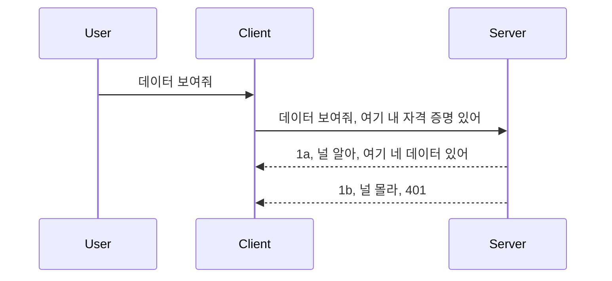

# Simple auth

MCP SDKs는 OAuth 2.1 사용을 지원합니다. 솔직히 말하면 인증 서버, 리소스 서버, 자격 증명 게시, 코드 수신, 코드를 베어러 토큰으로 교환하여 최종적으로 리소스 데이터를 얻는 등의 개념이 포함된 꽤 복잡한 프로세스입니다. OAuth는 구현하기에 훌륭한 방식이지만 익숙하지 않은 경우, 기본적인 인증 수준부터 시작하여 더 나은 보안으로 점차 구축하는 것이 좋습니다. 이 장이 존재하는 이유가 바로 더 발전된 인증으로 넘어갈 수 있도록 도와주기 위함입니다.

## 인증, 우리가 의미하는 바는?

인증은 authentication과 authorization의 줄임말입니다. 즉, 우리는 두 가지 작업을 해야 합니다:

- **인증(Authentication)**: 사용자가 우리 집에 들어올 수 있는지, 즉 MCP 서버 기능이 있는 리소스 서버에 접근할 권한이 있는지 확인하는 과정입니다.
- **인가(Authorization)**: 사용자가 요청하는 특정 리소스에 접근할 수 있는지 여부를 확인하는 과정입니다. 예를 들어, 주문이나 상품에 접근 가능한지, 또는 읽기만 가능하고 삭제는 불가능한 예시처럼 말이죠.

## 자격 증명: 시스템에 우리가 누구인지 알리는 방법

대부분의 웹 개발자들은 서버에 자격 증명을 제공하는 방식을 먼저 생각합니다. 일반적으로는 "여기 들어올 권한이 있다"는 비밀이죠. 이 자격 증명은 보통 사용자 이름과 비밀번호를 base64로 인코딩한 버전이나, 특정 사용자를 고유하게 식별하는 API 키입니다.

이 자격 증명은 보통 다음과 같이 "Authorization"이라는 헤더를 통해 전송됩니다:

```json
{ "Authorization": "secret123" }
```

이를 기본 인증(basic authentication)이라고 부릅니다. 전체 흐름은 다음과 같습니다:


흐름을 이해했으니, 어떻게 구현할까요? 대부분의 웹 서버는 미들웨어(middleware) 개념이 있습니다. 요청의 일부로 실행되는 코드로, 자격 증명을 검증하고 인증이 성공하면 요청을 통과시킵니다. 유효하지 않은 자격 증명이면 인증 오류가 발생합니다. 구현 방법은 다음과 같습니다:

**Python**

```python
class AuthMiddleware(BaseHTTPMiddleware):
    async def dispatch(self, request, call_next):

        has_header = request.headers.get("Authorization")
        if not has_header:
            print("-> Missing Authorization header!")
            return Response(status_code=401, content="Unauthorized")

        if not valid_token(has_header):
            print("-> Invalid token!")
            return Response(status_code=403, content="Forbidden")

        print("Valid token, proceeding...")
       
        response = await call_next(request)
        # 고객 헤더를 추가하거나 응답을 어떤 식으로든 변경하십시오
        return response


starlette_app.add_middleware(CustomHeaderMiddleware)
```

여기서는:

- `AuthMiddleware`라는 미들웨어를 만들었으며, 웹 서버가 `dispatch` 메서드를 호출합니다.
- 웹 서버에 미들웨어를 추가했습니다:

    ```python
    starlette_app.add_middleware(AuthMiddleware)
    ```

- Authorization 헤더 존재 여부와 전송된 비밀이 유효한지 확인하는 검증 로직을 작성했습니다:

    ```python
    has_header = request.headers.get("Authorization")
    if not has_header:
        print("-> Missing Authorization header!")
        return Response(status_code=401, content="Unauthorized")

    if not valid_token(has_header):
        print("-> Invalid token!")
        return Response(status_code=403, content="Forbidden")
    ```

비밀이 존재하고 유효하다면 `call_next`를 호출하여 요청을 통과시키고 응답을 반환합니다.

    ```python
    response = await call_next(request)
    # 고객 헤더를 추가하거나 응답을 어떤 방식으로든 변경하십시오
    return response
    ```

동작 방식은 웹 요청이 서버로 오면 미들웨어가 호출되고, 구현에 따라 요청을 통과시키거나 클라이언트가 진행할 수 없음을 나타내는 오류를 반환합니다.

**TypeScript**

여기서는 인기 프레임워크 Express를 사용해 미들웨어를 만들고 MCP 서버에 도달하기 전에 요청을 가로챕니다. 코드는 다음과 같습니다:

```typescript
function isValid(secret) {
    return secret === "secret123";
}

app.use((req, res, next) => {
    // 1. 권한 부여 헤더가 존재합니까?
    if(!req.headers["Authorization"]) {
        res.status(401).send('Unauthorized');
    }
    
    let token = req.headers["Authorization"];

    // 2. 유효성 검사.
    if(!isValid(token)) {
        res.status(403).send('Forbidden');
    }

   
    console.log('Middleware executed');
    // 3. 요청을 요청 파이프라인의 다음 단계로 전달합니다.
    next();
});
```

이 코드에서는:

1. 처음에 Authorization 헤더가 있는지 확인합니다. 없으면 401 오류를 보냅니다.
2. 자격 증명/토큰이 유효한지 검증합니다. 유효하지 않으면 403 오류를 보냅니다.
3. 마지막으로 요청 파이프라인에 요청을 전달하여 요청한 리소스를 반환합니다.

## 연습: 인증 구현하기

지식을 적용해 구현해 봅시다. 계획은 다음과 같습니다:

서버

- 웹 서버와 MCP 인스턴스 생성
- 서버용 미들웨어 구현

클라이언트

- 헤더를 통해 자격 증명과 함께 웹 요청 전송

### -1- 웹 서버와 MCP 인스턴스 생성

첫 단계에서 웹 서버 인스턴스와 MCP 서버를 생성해야 합니다.

**Python**

MCP 서버 인스턴스를 생성하고 starlette 웹 앱을 만들며 uvicorn으로 호스팅합니다.

```python
# MCP 서버 생성

app = FastMCP(
    name="MCP Resource Server",
    instructions="Resource Server that validates tokens via Authorization Server introspection",
    host=settings["host"],
    port=settings["port"],
    debug=True
)

# starlette 웹 앱 생성
starlette_app = app.streamable_http_app()

# uvicorn을 통해 앱 제공
async def run(starlette_app):
    import uvicorn
    config = uvicorn.Config(
            starlette_app,
            host=app.settings.host,
            port=app.settings.port,
            log_level=app.settings.log_level.lower(),
        )
    server = uvicorn.Server(config)
    await server.serve()

run(starlette_app)
```

이 코드는:

- MCP 서버를 생성하고,
- MCP 서버에서 starlette 웹 앱 `app.streamable_http_app()`을 생성하며,
- uvicorn으로 웹 앱을 호스팅(`server.serve()`)합니다.

**TypeScript**

여기서는 MCP 서버 인스턴스를 생성합니다.

```typescript
const server = new McpServer({
      name: "example-server",
      version: "1.0.0"
    });

    // ... 서버 리소스, 도구 및 프롬프트 설정 ...
```

이 MCP 서버 생성은 POST /mcp 경로 정의 내에서 이루어져야 하므로 위 코드를 다음과 같이 이동합니다:

```typescript
import express from "express";
import { randomUUID } from "node:crypto";
import { McpServer } from "@modelcontextprotocol/sdk/server/mcp.js";
import { StreamableHTTPServerTransport } from "@modelcontextprotocol/sdk/server/streamableHttp.js";
import { isInitializeRequest } from "@modelcontextprotocol/sdk/types.js"

const app = express();
app.use(express.json());

// 세션 ID별 전송 수단을 저장하는 맵
const transports: { [sessionId: string]: StreamableHTTPServerTransport } = {};

// 클라이언트에서 서버로의 통신을 위한 POST 요청 처리
app.post('/mcp', async (req, res) => {
  // 기존 세션 ID 확인
  const sessionId = req.headers['mcp-session-id'] as string | undefined;
  let transport: StreamableHTTPServerTransport;

  if (sessionId && transports[sessionId]) {
    // 기존 전송 수단 재사용
    transport = transports[sessionId];
  } else if (!sessionId && isInitializeRequest(req.body)) {
    // 새로운 초기화 요청
    transport = new StreamableHTTPServerTransport({
      sessionIdGenerator: () => randomUUID(),
      onsessioninitialized: (sessionId) => {
        // 세션 ID별 전송 수단 저장
        transports[sessionId] = transport;
      },
      // DNS 리바인딩 보호는 이전 버전과의 호환성을 위해 기본적으로 비활성화되어 있습니다. 서버를
      // 로컬에서 실행하는 경우 다음을 설정해야 합니다:
      // enableDnsRebindingProtection: true,
      // allowedHosts: ['127.0.0.1'],
    });

    // 닫힐 때 전송 수단 정리
    transport.onclose = () => {
      if (transport.sessionId) {
        delete transports[transport.sessionId];
      }
    };
    const server = new McpServer({
      name: "example-server",
      version: "1.0.0"
    });

    // ... 서버 자원, 도구 및 프롬프트 설정 ...

    // MCP 서버에 연결
    await server.connect(transport);
  } else {
    // 잘못된 요청
    res.status(400).json({
      jsonrpc: '2.0',
      error: {
        code: -32000,
        message: 'Bad Request: No valid session ID provided',
      },
      id: null,
    });
    return;
  }

  // 요청 처리
  await transport.handleRequest(req, res, req.body);
});

// GET 및 DELETE 요청을 위한 재사용 가능 핸들러
const handleSessionRequest = async (req: express.Request, res: express.Response) => {
  const sessionId = req.headers['mcp-session-id'] as string | undefined;
  if (!sessionId || !transports[sessionId]) {
    res.status(400).send('Invalid or missing session ID');
    return;
  }
  
  const transport = transports[sessionId];
  await transport.handleRequest(req, res);
};

// SSE를 통한 서버에서 클라이언트로 알림을 위한 GET 요청 처리
app.get('/mcp', handleSessionRequest);

// 세션 종료를 위한 DELETE 요청 처리
app.delete('/mcp', handleSessionRequest);

app.listen(3000);
```

보시다시피 MCP 서버 생성이 `app.post("/mcp")` 내로 이동했습니다.

다음 단계인 미들웨어 작성으로 넘어가 자격 증명을 검증할 수 있도록 합니다.

### -2- 서버용 미들웨어 구현

이제 미들웨어 부분입니다. `Authorization` 헤더에서 자격 증명을 확인하고 검증하는 미들웨어를 만듭니다. 자격 증명이 적절하면 요청은 필요한 작업(도구 목록 요청, 리소스 읽기 또는 MCP 기능 수행 등)을 진행합니다.

**Python**

미들웨어를 만들려면 `BaseHTTPMiddleware`에서 상속받은 클래스를 만들어야 합니다. 관심 있는 부분은:

- 요청 객체 `request`, 여기서 헤더 정보를 읽습니다.
- `call_next`, 클라이언트가 올바른 자격 증명을 가져왔을 때 호출하는 콜백입니다.

먼저 `Authorization` 헤더가 없으면 처리하는 부분입니다:

```python
has_header = request.headers.get("Authorization")

# 헤더가 없으면 401 오류로 실패하고, 그렇지 않으면 계속 진행합니다.
if not has_header:
    print("-> Missing Authorization header!")
    return Response(status_code=401, content="Unauthorized")
```

클라이언트 인증 실패로 401 Unauthorized 메시지를 보냅니다.

자격 증명이 제출됐다면 유효성 검사를 합니다:

```python
 if not valid_token(has_header):
    print("-> Invalid token!")
    return Response(status_code=403, content="Forbidden")
```

위에서 403 Forbidden 메시지를 보내는 부분을 확인하세요. 모든 내용을 포함한 미들웨어 전체 코드는 다음과 같습니다:

```python
class AuthMiddleware(BaseHTTPMiddleware):
    async def dispatch(self, request, call_next):

        has_header = request.headers.get("Authorization")
        if not has_header:
            print("-> Missing Authorization header!")
            return Response(status_code=401, content="Unauthorized")

        if not valid_token(has_header):
            print("-> Invalid token!")
            return Response(status_code=403, content="Forbidden")

        print("Valid token, proceeding...")
        print(f"-> Received {request.method} {request.url}")
        response = await call_next(request)
        response.headers['Custom'] = 'Example'
        return response

```

좋지만 `valid_token` 함수는 무엇일까요? 아래에 있습니다:

```python
# 프로덕션에서는 사용하지 마세요 - 개선하세요 !!
def valid_token(token: str) -> bool:
    # "Bearer " 접두사를 제거하세요
    if token.startswith("Bearer "):
        token = token[7:]
        return token == "secret-token"
    return False
```

물론 개선이 필요합니다.

중요: 이런 비밀 코드를 절대 하드코딩해서는 안 됩니다. 이상적으로는 비교할 값을 데이터 소스나 IDP(아이덴티티 서비스 제공자)에서 가져오거나, 심지어는 IDP가 검증을 직접 하도록 해야 합니다.

**TypeScript**

Express에서는 미들웨어 함수를 처리하는 `use` 메서드를 호출해야 합니다.

해야 할 일은:

- 요청 객체에서 `Authorization` 속성에 담긴 자격 증명을 확인하고,
- 자격 증명 검증 후 요청을 계속 진행시키고 클라이언트 MCP 요청이 정상 동작하도록 허용합니다(도구 목록 요청, 리소스 읽기 또는 기타 MCP 관련 작업).

헤더가 없으면 요청 진행을 차단합니다:

```typescript
if(!req.headers["authorization"]) {
    res.status(401).send('Unauthorized');
    return;
}
```

헤더가 없으면 401 오류가 발생합니다.

자격 증명이 유효하지 않으면 요청을 또 차단하며 다른 메시지를 보냅니다:

```typescript
if(!isValid(token)) {
    res.status(403).send('Forbidden');
    return;
} 
```

403 오류가 발생하는 것을 확인하세요.

전체 코드는 다음과 같습니다:

```typescript
app.use((req, res, next) => {
    console.log('Request received:', req.method, req.url, req.headers);
    console.log('Headers:', req.headers["authorization"]);
    if(!req.headers["authorization"]) {
        res.status(401).send('Unauthorized');
        return;
    }
    
    let token = req.headers["authorization"];

    if(!isValid(token)) {
        res.status(403).send('Forbidden');
        return;
    }  

    console.log('Middleware executed');
    next();
});
```

클라이언트가 보내는 자격 증명을 확인하는 미들웨어를 웹 서버에 설정했습니다. 그렇다면 클라이언트는 어떻게 해야 할까요?

### -3- 헤더를 통한 자격 증명과 함께 웹 요청 보내기

클라이언트가 자격 증명을 헤더에 포함해 보내도록 해야 합니다. MCP 클라이언트를 사용할 것이므로 이를 어떻게 하는지 살펴봅니다.

**Python**

클라이언트에서는 다음과 같이 자격 증명 헤더를 전달해야 합니다:

```python
# 값을 하드코딩하지 말고 최소한 환경 변수나 더 안전한 저장소에 보관하세요
token = "secret-token"

async with streamablehttp_client(
        url = f"http://localhost:{port}/mcp",
        headers = {"Authorization": f"Bearer {token}"}
    ) as (
        read_stream,
        write_stream,
        session_callback,
    ):
        async with ClientSession(
            read_stream,
            write_stream
        ) as session:
            await session.initialize()
      
            # TODO, 클라이언트에서 수행할 작업 예: 도구 목록 표시, 도구 호출 등
```

`headers` 속성을 `headers = {"Authorization": f"Bearer {token}"}`처럼 채운 것을 확인하세요.

**TypeScript**

두 단계로 해결할 수 있습니다:

1. 구성 객체에 자격 증명을 채웁니다.
2. 구성 객체를 전송 계층에 넘깁니다.

```typescript

// 여기와 같이 값을 하드코딩하지 마세요. 최소한 환경 변수로 두고 개발 모드에서는 dotenv와 같은 것을 사용하세요.
let token = "secret123"

// 클라이언트 전송 옵션 객체를 정의하세요
let options: StreamableHTTPClientTransportOptions = {
  sessionId: sessionId,
  requestInit: {
    headers: {
      "Authorization": "secret123"
    }
  }
};

// 옵션 객체를 전송에 전달하세요
async function main() {
   const transport = new StreamableHTTPClientTransport(
      new URL(serverUrl),
      options
   );
```

위 코드에서 `options` 객체를 만들고 헤더를 `requestInit` 속성 아래에 넣은 방법을 보실 수 있습니다.

중요: 여기서 어떻게 개선할 수 있을까요? 현재 구현에는 몇 가지 문제가 있습니다. 첫째, 최소한 HTTPS가 없다면 자격 증명을 이렇게 전송하는 것은 꽤 위험합니다. 그나마 HTTPS가 있어도 자격 증명이 도난당할 수 있으므로, 토큰 취소가 쉬운 시스템과 어디서 요청하는지(지리적 위치 등), 요청 빈도가 너무 잦은지(봇 행동 등) 추가 검사 기능이 필요합니다. 요약하면 다양한 보안 문제가 존재합니다.

그런데 아무나 인증 없이 API를 호출하지 못하도록 하는 아주 간단한 API에는 이 방법도 좋은 출발점입니다.

그래서 JSON Web Token(JWT, JOT 토큰이라고도 함) 같은 표준화된 형식을 사용해 보안을 강화해 봅시다.

## JSON Web Tokens, JWT

매우 단순한 자격 증명에서 개선하려고 할 때 JWT를 채택하면 어떤 즉각적인 이점이 있을까요?

- **보안 개선**: 기본 인증에서는 사용자 이름과 비밀번호를 base64 인코딩한 토큰(또는 API 키)을 계속 반복해서 전송하는데, 이로 인해 위험이 커집니다. JWT는 사용자 이름과 비밀번호를 보내면 토큰이 발급되고, 이 토큰은 만료 시간이 정해져 있어 기간 제한이 있습니다. 또한 역할, 범위, 권한을 사용해 세밀한 접근 제어가 가능합니다.
- **무상태성(stateless)과 확장성**: JWT는 자체 포함(self-contained)되어 사용자 정보를 모두 담으며 서버 측 세션 저장소가 필요 없어집니다. 토큰은 로컬에서 검증할 수도 있습니다.
- **상호운용성과 연합**: JWT는 Open ID Connect의 핵심이며 Entra ID, Google Identity, Auth0 같은 잘 알려진 아이덴티티 제공자와 함께 사용됩니다. 싱글 사인온 및 그 이상의 기업급 기능을 가능하게 합니다.
- **모듈성 및 유연성**: JWT는 Azure API Management, NGINX 등 API 게이트웨이와도 사용할 수 있으며 인증 시나리오, 서버 대 서비스 통신, 대리 및 위임 시나리오도 지원합니다.
- **성능 및 캐싱**: JWT는 디코딩 후 캐시할 수 있어 파싱 필요성을 줄이며, 특히 트래픽이 많은 애플리케이션에서 처리량을 높이고 인프라 부하를 낮춥니다.
- **고급 기능**: 인트로스펙션(서버에서 유효성 검사)과 토큰 무효화(리보크) 기능도 지원합니다.

이 모든 이점을 바탕으로 구현을 한 단계 업그레이드해봅니다.

## 기본 인증을 JWT로 전환하기

고수준에서 바꿔야 할 사항은 다음과 같습니다:

- **JWT 토큰 구성** 방법을 배우고 클라이언트에서 서버로 전송 준비를 합니다.
- <strong>JWT 토큰 검증</strong>을 하여 유효하면 클라이언트에게 자원 접근 권한을 제공합니다.
- <strong>토큰을 안전하게 저장</strong>하는 방법을 익힙니다.
- **경로 보호**: MCP 기능 및 경로를 보호합니다.
- **리프레시 토큰 추가**: 짧은 수명의 액세스 토큰과 만료 시 새 토큰을 받을 수 있는 긴 수명의 리프레시 토큰을 만듭니다. 리프레시 엔드포인트와 토큰 회전 전략도 포함합니다.

### -1- JWT 토큰 구성

우선 JWT 토큰은 다음 세 부분으로 구성됩니다:

- **헤더(header)**: 사용된 알고리즘과 토큰 유형
- **페이로드(payload)**: 클레임, 예를 들어 sub(토큰이 나타내는 사용자 또는 엔터티, 보통 userid), exp(만료 시간), role(역할)
- **서명(signature)**: 비밀키 또는 개인키로 서명

헤더, 페이로드, 인코딩된 토큰을 구성해야 합니다.

**Python**

```python

import jwt
import jwt
from jwt.exceptions import ExpiredSignatureError, InvalidTokenError
import datetime

# JWT에 서명하는 데 사용되는 비밀 키
secret_key = 'your-secret-key'

header = {
    "alg": "HS256",
    "typ": "JWT"
}

# 사용자 정보와 해당 클레임 및 만료 시간
payload = {
    "sub": "1234567890",               # 주제 (사용자 ID)
    "name": "User Userson",                # 사용자 정의 클레임
    "admin": True,                     # 사용자 정의 클레임
    "iat": datetime.datetime.utcnow(),# 발행 시간
    "exp": datetime.datetime.utcnow() + datetime.timedelta(hours=1)  # 만료 시간
}

# 인코딩하기
encoded_jwt = jwt.encode(payload, secret_key, algorithm="HS256", headers=header)
```

이 코드에서는:

- HS256 알고리즘과 JWT 타입을 가진 헤더를 정의하였고,
- sub(주체 또는 사용자 ID), 사용자명, 역할, 발행 시간과 만료 시간을 포함하는 페이로드를 만들어 시간 제한 기능을 구현했습니다.

**TypeScript**

JWT 토큰 구성을 도와줄 라이브러리들이 필요합니다.

필요한 라이브러리:

```sh

npm install jsonwebtoken
npm install --save-dev @types/jsonwebtoken
```

준비가 되었으니 헤더와 페이로드를 만들고 인코딩된 토큰을 생성합니다.

```typescript
import jwt from 'jsonwebtoken';

const secretKey = 'your-secret-key'; // 프로덕션에서 환경 변수를 사용하세요

// 페이로드 정의
const payload = {
  sub: '1234567890',
  name: 'User usersson',
  admin: true,
  iat: Math.floor(Date.now() / 1000), // 발행 시간
  exp: Math.floor(Date.now() / 1000) + 60 * 60 // 1시간 후 만료
};

// 헤더 정의 (선택 사항, jsonwebtoken이 기본값 설정)
const header = {
  alg: 'HS256',
  typ: 'JWT'
};

// 토큰 생성
const token = jwt.sign(payload, secretKey, {
  algorithm: 'HS256',
  header: header
});

console.log('JWT:', token);
```

이 토큰은:

HS256으로 서명됨
1시간 동안 유효
sub, name, admin, iat, exp 등의 클레임 포함

### -2- 토큰 검증

토큰을 검증하는 기능도 필요합니다. 서버에서 클라이언트가 보내는 토큰이 실제로 유효한지 확인해야 합니다. 구조 검증부터 유효성 검사까지 다양한 체크를 해야 합니다. 사용자 존재 여부 및 권한 추가 확인도 권장됩니다.

토큰을 검증하려면 먼저 디코딩하여 읽을 수 있어야 합니다.

**Python**

```python

# JWT를 디코딩하고 검증합니다
try:
    decoded = jwt.decode(token, secret_key, algorithms=["HS256"])
    print("✅ Token is valid.")
    print("Decoded claims:")
    for key, value in decoded.items():
        print(f"  {key}: {value}")
except ExpiredSignatureError:
    print("❌ Token has expired.")
except InvalidTokenError as e:
    print(f"❌ Invalid token: {e}")

```

여기서는 `jwt.decode`를 호출하는데, 토큰, 비밀 키, 알고리즘을 인자로 사용합니다. 실패하면 예외가 발생하므로 try-catch 문으로 감쌉니다.

**TypeScript**

`jwt.verify`를 호출해 디코딩된 토큰을 얻고, 더 분석할 수 있습니다. 호출 실패 시 토큰 구조가 잘못되었거나 더 이상 유효하지 않음을 의미합니다.

```typescript

try {
  const decoded = jwt.verify(token, secretKey);
  console.log('Decoded Payload:', decoded);
} catch (err) {
  console.error('Token verification failed:', err);
}
```

참고: 앞서 말했듯, 이 토큰의 사용자가 시스템에 존재하는지, 그리고 권한이 적절한지도 추가 점검해야 합니다.

다음으로 역할 기반 접근 제어(RBAC)를 살펴봅시다.
## 역할 기반 접근 제어 추가하기

다양한 역할이 각각 다른 권한을 가진다는 것을 표현하고자 합니다. 예를 들어, 관리자는 모든 작업을 할 수 있고, 일반 사용자는 읽기/쓰기를 할 수 있으며, 손님은 읽기만 할 수 있다고 가정합니다. 따라서 가능한 권한 수준은 다음과 같습니다:

- Admin.Write 
- User.Read
- Guest.Read

이제 미들웨어로 이러한 제어를 어떻게 구현할 수 있는지 살펴보겠습니다. 미들웨어는 개별 라우트별로 그리고 전체 라우트에 대해 추가할 수 있습니다.

**Python**

```python
from starlette.middleware.base import BaseHTTPMiddleware
from starlette.responses import JSONResponse
import jwt

# 비밀 정보를 코드에 두지 마세요, 이것은 시연 목적일 뿐입니다. 안전한 곳에서 읽으세요.
SECRET_KEY = "your-secret-key" # 이 값을 환경 변수에 넣으세요
REQUIRED_PERMISSION = "User.Read"

class JWTPermissionMiddleware(BaseHTTPMiddleware):
    async def dispatch(self, request, call_next):
        auth_header = request.headers.get("Authorization")
        if not auth_header or not auth_header.startswith("Bearer "):
            return JSONResponse({"error": "Missing or invalid Authorization header"}, status_code=401)

        token = auth_header.split(" ")[1]
        try:
            decoded = jwt.decode(token, SECRET_KEY, algorithms=["HS256"])
        except jwt.ExpiredSignatureError:
            return JSONResponse({"error": "Token expired"}, status_code=401)
        except jwt.InvalidTokenError:
            return JSONResponse({"error": "Invalid token"}, status_code=401)

        permissions = decoded.get("permissions", [])
        if REQUIRED_PERMISSION not in permissions:
            return JSONResponse({"error": "Permission denied"}, status_code=403)

        request.state.user = decoded
        return await call_next(request)


```

아래와 같이 미들웨어를 추가하는 몇 가지 방법이 있습니다:

```python

# 대안 1: 스타렛 앱을 구성하는 동안 미들웨어 추가
middleware = [
    Middleware(JWTPermissionMiddleware)
]

app = Starlette(routes=routes, middleware=middleware)

# 대안 2: 스타렛 앱이 이미 구성된 후 미들웨어 추가
starlette_app.add_middleware(JWTPermissionMiddleware)

# 대안 3: 라우트별 미들웨어 추가
routes = [
    Route(
        "/mcp",
        endpoint=..., # 핸들러
        middleware=[Middleware(JWTPermissionMiddleware)]
    )
]
```

**TypeScript**

`app.use`와 모든 요청에 대해 실행되는 미들웨어를 사용할 수 있습니다.

```typescript
app.use((req, res, next) => {
    console.log('Request received:', req.method, req.url, req.headers);
    console.log('Headers:', req.headers["authorization"]);

    // 1. 인증 헤더가 전송되었는지 확인하십시오

    if(!req.headers["authorization"]) {
        res.status(401).send('Unauthorized');
        return;
    }
    
    let token = req.headers["authorization"];

    // 2. 토큰이 유효한지 확인하십시오
    if(!isValid(token)) {
        res.status(403).send('Forbidden');
        return;
    }  

    // 3. 토큰 사용자가 우리 시스템에 존재하는지 확인하십시오
    if(!isExistingUser(token)) {
        res.status(403).send('Forbidden');
        console.log("User does not exist");
        return;
    }
    console.log("User exists");

    // 4. 토큰이 올바른 권한을 가지고 있는지 검증하십시오
    if(!hasScopes(token, ["User.Read"])){
        res.status(403).send('Forbidden - insufficient scopes');
    }

    console.log("User has required scopes");

    console.log('Middleware executed');
    next();
});

```

미들웨어가 해야 하며 미들웨어가 할 수 있는 일들이 꽤 많습니다:

1. 권한 부여 헤더가 있는지 확인하기
2. 토큰이 유효한지 확인하기, 우리는 `isValid`라는 메서드를 호출하는데, 이 메서드는 JWT 토큰의 무결성과 유효성을 검사합니다.
3. 사용자가 시스템에 존재하는지 확인하기, 이것도 검사를 해야 합니다.

   ```typescript
    // DB의 사용자
   const users = [
     "user1",
     "User usersson",
   ]

   function isExistingUser(token) {
     let decodedToken = verifyToken(token);

     // TODO, DB에 사용자가 있는지 확인하기
     return users.includes(decodedToken?.name || "");
   }
   ```

   위에서 우리는 아주 단순한 `users` 리스트를 만들었는데, 실제로는 데이터베이스에 있어야 합니다.

4. 추가로, 토큰이 올바른 권한을 갖고 있는지도 확인해야 합니다.

   ```typescript
   if(!hasScopes(token, ["User.Read"])){
        res.status(403).send('Forbidden - insufficient scopes');
   }
   ```

   위 미들웨어 코드에서는 토큰에 User.Read 권한이 포함되어 있는지 검사하며, 없으면 403 오류를 전송합니다. 아래는 `hasScopes` 도우미 메서드입니다.

   ```typescript
   function hasScopes(scope: string, requiredScopes: string[]) {
     let decodedToken = verifyToken(scope);
    return requiredScopes.every(scope => decodedToken?.scopes.includes(scope));
  }
   ```

Have a think which additional checks you should be doing, but these are the absolute minimum of checks you should be doing.

Using Express as a web framework is a common choice. There are helpers library when you use JWT so you can write less code.

- `express-jwt`, helper library that provides a middleware that helps decode your token.
- `express-jwt-permissions`, this provides a middleware `guard` that helps check if a certain permission is on the token.

Here's what these libraries can look like when used:

```typescript
const express = require('express');
const jwt = require('express-jwt');
const guard = require('express-jwt-permissions')();

const app = express();
const secretKey = 'your-secret-key'; // put this in env variable

// Decode JWT and attach to req.user
app.use(jwt({ secret: secretKey, algorithms: ['HS256'] }));

// Check for User.Read permission
app.use(guard.check('User.Read'));

// multiple permissions
// app.use(guard.check(['User.Read', 'Admin.Access']));

app.get('/protected', (req, res) => {
  res.json({ message: `Welcome ${req.user.name}` });
});

// Error handler
app.use((err, req, res, next) => {
  if (err.code === 'permission_denied') {
    return res.status(403).send('Forbidden');
  }
  next(err);
});

```

이제 미들웨어가 인증과 권한 부여 모두에 어떻게 사용될 수 있는지 보았습니다. 그렇다면 MCP는 어떻게 할까요? MCP가 인증 방식을 바꾸나요? 다음 섹션에서 알아보겠습니다.

### -3- MCP에 RBAC 추가하기

지금까지 미들웨어를 통해 RBAC를 추가하는 방법을 보았습니다. 하지만 MCP에 대해선 기능별 RBAC를 쉽게 추가할 방법이 없습니다. 그렇다면 어떻게 할까요? 이 경우에는 클라이언트가 특정 도구를 호출할 권한이 있는지 확인하는 코드를 추가해야 합니다.

기능별 RBAC를 달성하는 방법은 여러 가지가 있습니다:

- 권한 수준을 확인해야 하는 각 도구, 리소스, 프롬프트에 대해 검사 추가.

   **python**

   ```python
   @tool()
   def delete_product(id: int):
      try:
          check_permissions(role="Admin.Write", request)
      catch:
        pass # 클라이언트가 인증에 실패했습니다, 인증 오류를 발생시킵니다
   ```

   **typescript**

   ```typescript
   server.registerTool(
    "delete-product",
    {
      title: Delete a product",
      description: "Deletes a product",
      inputSchema: { id: z.number() }
    },
    async ({ id }) => {
      
      try {
        checkPermissions("Admin.Write", request);
        // 할 일, id를 productService 및 원격 엔트리로 전송
      } catch(Exception e) {
        console.log("Authorization error, you're not allowed");  
      }

      return {
        content: [{ type: "text", text: `Deletected product with id ${id}` }]
      };
    }
   );
   ```


- 고급 서버 방식을 사용하고 요청 핸들러에 집중하여 검사해야 할 위치를 최소화합니다.

   **Python**

   ```python
   
   tool_permission = {
      "create_product": ["User.Write", "Admin.Write"],
      "delete_product": ["Admin.Write"]
   }

   def has_permission(user_permissions, required_permissions) -> bool:
      # user_permissions: 사용자가 가진 권한 목록
      # required_permissions: 도구에 필요한 권한 목록
      return any(perm in user_permissions for perm in required_permissions)

   @server.call_tool()
   async def handle_call_tool(
     name: str, arguments: dict[str, str] | None
   ) -> list[types.TextContent]:
    # request.user.permissions는 사용자의 권한 목록이라고 가정합니다
     user_permissions = request.user.permissions
     required_permissions = tool_permission.get(name, [])
     if not has_permission(user_permissions, required_permissions):
        # "도구 {name}을(를 호출할 권한이 없습니다"라는 오류를 발생시킵니다
        raise Exception(f"You don't have permission to call tool {name}")
     # 계속 진행하고 도구를 호출합니다
     # ...
   ```   
   

   **TypeScript**

   ```typescript
   function hasPermission(userPermissions: string[], requiredPermissions: string[]): boolean {
       if (!Array.isArray(userPermissions) || !Array.isArray(requiredPermissions)) return false;
       // 사용자가 최소 하나의 필요한 권한을 가지고 있으면 true를 반환합니다
       
       return requiredPermissions.some(perm => userPermissions.includes(perm));
   }
  
   server.setRequestHandler(CallToolRequestSchema, async (request) => {
      const { params: { name } } = request;
  
      let permissions = request.user.permissions;
  
      if (!hasPermission(permissions, toolPermissions[name])) {
         return new Error(`You don't have permission to call ${name}`);
      }
  
      // 계속 진행하세요..
   });
   ```

   참고로, 위 코드를 간단하게 하려면 미들웨어가 요청의 user 속성에 디코드된 토큰을 할당하도록 해야 합니다.

### 요약

이제 일반적으로 그리고 MCP에 대해 RBAC를 추가하는 방법을 논의했으니, 개념을 이해했는지 확인하기 위해 직접 보안을 구현해 볼 차례입니다.

## 과제 1: 기본 인증을 사용하여 mcp 서버와 mcp 클라이언트 구축하기

여기서는 헤더를 통해 자격 증명을 전송하는 방법을 배울 것입니다.

## 솔루션 1

[Solution 1](./code/basic/README.md)

## 과제 2: 과제 1의 솔루션을 JWT 사용으로 업그레이드하기

첫 번째 솔루션을 바탕으로 개선해 봅시다.

기본 인증 대신 JWT를 사용합니다.

## 솔루션 2

[Solution 2](./solution/jwt-solution/README.md)

## 도전과제

"Add RBAC to MCP" 섹션에서 설명한 도구별 RBAC를 추가하세요.

## 요약

이번 장을 통해 보안이 전혀 없는 상태에서 기본 보안, JWT 그리고 MCP에 추가하는 방법까지 많은 것을 배우셨길 바랍니다.

우리는 맞춤형 JWT로 탄탄한 기초를 쌓았지만, 확장하면서 표준 기반의 아이덴티티 모델로 옮겨가고 있습니다. Entra나 Keycloak 같은 IdP를 도입하면 토큰 발급, 검증, 생명주기 관리를 신뢰받는 플랫폼에 위임할 수 있어, 앱 로직과 사용자 경험에 집중할 수 있게 됩니다.

이를 위해 더 [고급 Entra 챕터](../../05-AdvancedTopics/mcp-security-entra/README.md)가 준비되어 있습니다.

## 다음 단계

- 다음: [MCP 호스트 설정](../12-mcp-hosts/README.md)

---

<!-- CO-OP TRANSLATOR DISCLAIMER START -->
**면책 조항**:  
이 문서는 AI 번역 서비스 [Co-op Translator](https://github.com/Azure/co-op-translator)를 사용하여 번역되었습니다. 정확성을 위해 노력하고 있으나, 자동 번역은 오류나 부정확함을 포함할 수 있음을 유의하시기 바랍니다. 원문이 해당 언어로 된 문서가 권위 있는 출처로 간주되어야 합니다. 중요한 정보의 경우, 전문 인간 번역을 권장합니다. 본 번역 사용으로 인한 오해나 잘못된 해석에 대해 당사는 책임을 지지 않습니다.
<!-- CO-OP TRANSLATOR DISCLAIMER END -->