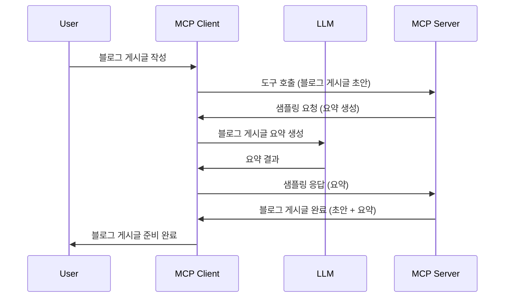

# 샘플링 - 클라이언트에 기능 위임하기

때때로 MCP 클라이언트와 MCP 서버가 공동의 목표를 달성하기 위해 협력해야 할 때가 있습니다. 서버가 클라이언트에 있는 LLM의 도움이 필요한 경우가 있을 수 있습니다. 이런 상황에서는 샘플링을 사용해야 합니다.

샘플링을 포함하는 몇 가지 사용 사례와 솔루션 구축 방법을 살펴보겠습니다.

## 개요

이번 강의에서는 샘플링을 언제, 어디서 사용해야 하는지와 샘플링 구성 방법에 대해 중점적으로 설명합니다.

## 학습 목표

이번 장에서는 다음을 다룹니다:

- 샘플링이 무엇이며 언제 사용하는지 설명합니다.
- MCP에서 샘플링을 구성하는 방법을 안내합니다.
- 샘플링의 실제 예제를 제공합니다.

## 샘플링이란 무엇이며 왜 사용하는가?

샘플링은 다음과 같은 방식으로 작동하는 고급 기능입니다:


### 샘플링 요청

좋습니다, 이제 믿을 만한 시나리오에 대한 큰 그림을 살펴봤으니 서버가 클라이언트로 보내는 샘플링 요청에 대해 이야기해봅시다. 다음은 JSON-RPC 형식의 요청 예시입니다:

```json
{
  "jsonrpc": "2.0",
  "id": 1,
  "method": "sampling/createMessage",
  "params": {
    "messages": [
      {
        "role": "user",
        "content": {
          "type": "text",
          "text": "Create a blog post summary of the following blog post: <BLOG POST>"
        }
      }
    ],
    "modelPreferences": {
      "hints": [
        {
          "name": "claude-3-sonnet"
        }
      ],
      "intelligencePriority": 0.8,
      "speedPriority": 0.5
    },
    "systemPrompt": "You are a helpful assistant.",
    "maxTokens": 100
  }
}
```

여기서 주목할 만한 점은 다음과 같습니다:

- content -> text 아래의 Prompt는 LLM에게 블로그 게시물 내용을 요약하라는 지시문입니다.

- **modelPreferences**. 이 섹션은 이름 그대로 선호 사항이며, LLM과 함께 사용할 구성을 추천합니다. 사용자는 이 추천대로 하거나 변경할 수 있습니다. 여기서는 사용할 모델, 속도, 지능 우선순위에 대한 추천이 포함되어 있습니다.
- <strong>systemPrompt</strong>는 LLM에 성격을 부여하고 안내 지침이 포함된 일반적인 시스템 프롬프트입니다.
- <strong>maxTokens</strong>는 이 작업에 권장되는 토큰 수를 나타내는 속성입니다.

### 샘플링 응답

이 응답은 MCP 클라이언트가 LLM을 호출하여 응답을 기다린 후 서버에 다시 보내는 결과 메시지입니다. JSON-RPC 형식 예시는 다음과 같습니다:

```json
{
  "jsonrpc": "2.0",
  "id": 1,
  "result": {
    "role": "assistant",
    "content": {
      "type": "text",
      "text": "Here's your abstract <ABSTRACT>"
    },
    "model": "gpt-5",
    "stopReason": "endTurn"
  }
}
```

응답이 요청한 것처럼 블로그 게시물의 요약임을 확인하세요. 또한 사용된 `model`이 요청한 것과 다르게 "claude-3-sonnet" 대신 "gpt-5"인 점에 주의하세요. 이는 사용자가 어떤 모델을 사용할지 마음을 바꿀 수 있음을 보여주며, 샘플링 요청은 하나의 권고 사항임을 뜻합니다.

이제 주요 흐름과 "블로그 게시물 생성 + 요약"이라는 유용한 작업을 이해했으니, 작동시키기 위해 해야 할 일을 살펴봅시다.

### 메시지 유형

샘플링 메시지는 텍스트뿐 아니라 이미지와 오디오도 보낼 수 있습니다. JSON-RPC 형식이 어떻게 다른지 살펴봅시다:

<strong>텍스트</strong>

```json
{
  "type": "text",
  "text": "The message content"
}
```

**이미지 콘텐츠**

```json
{
  "type": "image",
  "data": "base64-encoded-image-data",
  "mimeType": "image/jpeg"
}
```

**오디오 콘텐츠**

```json
{
  "type": "audio",
  "data": "base64-encoded-audio-data",
  "mimeType": "audio/wav"
}
```

> 참고: 샘플링에 대한 자세한 정보는 [공식 문서](https://modelcontextprotocol.io/specification/2025-06-18/client/sampling)를 확인하세요.

## 클라이언트에서 샘플링 구성 방법

> 참고: 서버만 구축하는 경우 여기서는 크게 할 일이 없습니다.

클라이언트에서 다음 기능을 다음과 같이 지정해야 합니다:

```json
{
  "capabilities": {
    "sampling": {}
  }
}
```

이렇게 하면 선택한 클라이언트가 서버와 초기화할 때 이 설정을 자동으로 인식합니다.

## 샘플링 실전 예제 – 블로그 게시물 생성하기

함께 샘플링 서버를 코딩해 봅시다. 다음 작업이 필요합니다:

1. 서버에서 툴 생성.
1. 툴이 샘플링 요청 생성.
1. 툴이 클라이언트의 샘플링 요청 응답을 대기.
1. 툴 결과 생성.

코드를 단계별로 살펴봅시다:

### -1- 툴 생성

**python**

```python
@mcp.tool()
async def create_blog(title: str, content: str, ctx: Context[ServerSession, None]) -> str:
    """Create a blog post and generate a summary"""

```

### -2- 샘플링 요청 생성

툴에 다음 코드를 추가하세요:

**python**

```python
post = BlogPost(
        id=len(posts) + 1,
        title=title,
        content=content,
        abstract=""
    )

prompt = f"Create an abstract of the following blog post: title: {title} and draft: {content} "

result = await ctx.session.create_message(
        messages=[
            SamplingMessage(
                role="user",
                content=TextContent(type="text", text=prompt),
            )
        ],
        max_tokens=100,
)

```

### -3- 응답 대기 후 반환

**python**

```python
post.abstract = result.content.text

posts.append(post)

# 전체 제품을 반환합니다
return json.dumps({
    "id": post.title,
    "abstract": post.abstract
})
```

### -4- 전체 코드

**python**

```python
from starlette.applications import Starlette
from starlette.routing import Mount, Host

from mcp.server.fastmcp import Context, FastMCP

from mcp.server.session import ServerSession
from mcp.types import SamplingMessage, TextContent

import json


from uuid import uuid4
from typing import List
from pydantic import BaseModel


mcp = FastMCP("Blog post generator")

# app = FastAPI()

posts = []

class BlogPost(BaseModel):
    id: int
    title: str
    content: str
    abstract: str

posts: List[BlogPost] = []

@mcp.tool()
async def create_blog(title: str, content: str, ctx: Context[ServerSession, None]) -> str:
    """Create a blog post and generate a summary"""

    post = BlogPost(
        id=len(posts) + 1,
        title=title,
        content=content,
        abstract=""
    )

    prompt = f"Create an abstract of the following blog post: title: {title} and draft: {content} "

    result = await ctx.session.create_message(
        messages=[
            SamplingMessage(
                role="user",
                content=TextContent(type="text", text=prompt),
            )
        ],
        max_tokens=100,
    )

    post.abstract = result.content.text

    posts.append(post)

    # 전체 블로그 게시물을 반환합니다
    return json.dumps({
        "id": post.title,
        "abstract": post.abstract
    })

if __name__ == "__main__":
    print("Starting server...")
    # mcp.run()
    mcp.run(transport="streamable-http")

# 다음 명령어로 앱 실행: python server.py
```

### -5- Visual Studio Code에서 테스트하기

Visual Studio Code에서 테스트하려면 다음을 수행하세요:

1. 터미널에서 서버 시작
1. <em>mcp.json</em>에 추가하고 서버가 실행 중인지 확인, 예:

   ```json
   "servers": {
      "blog-server": {
        "type": "http",
        "url": "http://localhost:8000/mcp"
      }
   }
   ```

1. 프롬프트 입력:

   ```text
   create a blog post named "Where Python comes from", the content is "Python is actually named after Monty Python Flying Circus"
   ```

1. 샘플링 허용. 처음 테스트 시 추가 대화상자가 표시되며 승인해야 합니다. 이후 도구 실행 여부를 묻는 일반 대화상자가 나옵니다.

1. 결과 확인. GitHub Copilot Chat에서 멋지게 렌더링된 결과를 볼 수 있고, 원본 JSON 응답도 검사할 수 있습니다.

<strong>보너스</strong>. Visual Studio Code 도구는 샘플링을 뛰어나게 지원합니다. 설치한 서버에 대해 샘플링 접근 권한을 설정하려면 다음을 따르세요:

1. 확장 기능 섹션으로 이동
1. "MCP SERVERS - INSTALLED" 섹션에서 설치한 서버의 톱니바퀴 아이콘 선택
1 "Configure Model Access" 선택, 여기서 GitHub Copilot이 샘플링 수행 시 사용할 수 있는 모델을 선택할 수 있습니다. 최근 샘플링 요청은 "Show Sampling requests"를 선택해 확인할 수 있습니다.

## 과제

이번 과제에서는 약간 다른 샘플링, 즉 제품 설명 생성을 지원하는 샘플링 통합을 개발합니다. 시나리오는 다음과 같습니다:

<strong>시나리오</strong>: 전자상거래 백오피스 직원이 제품 설명 생성에 너무 많은 시간을 소모합니다. 따라서 "title"과 "keywords"를 매개변수로 받고, 클라이언트의 LLM이 채운 "description" 필드가 포함된 완전한 제품 정보를 생성하는 "create_product"라는 도구를 호출할 수 있는 솔루션을 만들어야 합니다.

TIP: 앞서 배운 내용을 활용해 샘플링 요청을 사용하여 이 서버와 도구를 구성하세요.

## 솔루션

[Solution](./solution/README.md)

## 주요 내용 정리

샘플링은 서버가 LLM의 도움이 필요할 때 작업을 클라이언트에 위임할 수 있게 하는 강력한 기능입니다.

## 다음에 배울 내용

- [4장 - 실용적 구현](../../04-PracticalImplementation/README.md)

---

<!-- CO-OP TRANSLATOR DISCLAIMER START -->
**면책 조항**:  
이 문서는 AI 번역 서비스 [Co-op Translator](https://github.com/Azure/co-op-translator)를 사용하여 번역되었습니다. 정확성을 위해 노력하고 있으나 자동 번역에는 오류나 부정확함이 있을 수 있음을 유의해 주시기 바랍니다. 원문은 해당 언어의 원본 문서가 권위 있는 출처로 간주되어야 합니다. 중요한 정보의 경우 전문 인간 번역을 권장합니다. 본 번역 사용으로 인해 발생하는 오해나 잘못된 해석에 대해 당사는 책임지지 않습니다.
<!-- CO-OP TRANSLATOR DISCLAIMER END -->