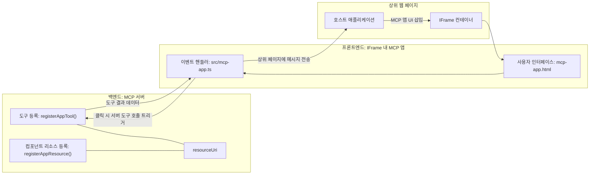

# MCP 앱

MCP 앱은 MCP의 새로운 패러다임입니다. 아이디어는 도구 호출에서 데이터를 반환하는 것뿐만 아니라 이 정보와 상호작용하는 방법에 대한 정보를 제공하는 것입니다. 즉, 도구 결과에 이제 UI 정보가 포함될 수 있다는 뜻입니다. 하지만 왜 그런 것이 필요할까요? 오늘날 여러분이 하는 방식을 생각해 보세요. MCP 서버의 결과를 소비하기 위해 프런트엔드를 만들어야 하며, 이는 여러분이 작성하고 유지해야 하는 코드입니다. 때로는 그것이 필요한 경우도 있지만, 때로는 데이터부터 사용자 인터페이스까지 모두 포함하는 독립적인 정보 조각을 가져올 수 있다면 좋을 것입니다.

## 개요

이 수업에서는 MCP 앱에 대한 실용적인 가이드, 시작 방법 및 기존 웹 앱에 통합하는 방법을 제공합니다. MCP 앱은 MCP 표준에 아주 새롭게 추가된 기능입니다.

## 학습 목표

이 수업이 끝나면 다음을 할 수 있습니다:

- MCP 앱이 무엇인지 설명할 수 있다.
- MCP 앱을 언제 사용할지 알 수 있다.
- 자신만의 MCP 앱을 빌드하고 통합할 수 있다.

## MCP 앱 - 어떻게 작동하는가

MCP 앱의 아이디어는 렌더링할 구성요소를 본질적으로 응답으로 제공하는 것입니다. 이러한 구성요소는 시각적 요소와 상호작용성, 예를 들어 버튼 클릭, 사용자 입력 등을 가질 수 있습니다. 먼저 서버 측과 MCP 서버부터 시작해 봅시다. MCP 앱 구성요소를 만들려면 도구와 애플리케이션 리소스를 모두 만들어야 합니다. 이 두 부분은 resourceUri로 연결됩니다. 

예를 들어 보겠습니다. 관련된 내용을 시각화하고 어떤 부분이 어떤 역할을 하는지 봅니다:

```text
server.ts -- responsible for registering tools and the component as a UI component
src/
  mcp-app.ts -- wiring up event handlers
mcp-app.html -- the user interface
```

이 시각은 구성요소와 그 로직을 만드는 아키텍처를 설명합니다.


이제 백엔드와 프런트엔드 각각의 책임을 설명해 봅시다.

### 백엔드

여기서 해야 할 두 가지가 있습니다:

- 상호작용할 도구 등록하기.
- 구성요소 정의하기. 

**도구 등록**

```typescript
registerAppTool(
    server,
    "get-time",
    {
      title: "Get Time",
      description: "Returns the current server time.",
      inputSchema: {},
      _meta: { ui: { resourceUri } }, // 이 도구를 UI 리소스에 연결합니다
    },
    async () => {
      const time = new Date().toISOString();
      return { content: [{ type: "text", text: time }] };
    },
  );

```

위 코드는 `get-time`이라는 도구를 노출하는 동작을 설명합니다. 입력은 없지만 현재 시간을 생성합니다. 사용자 입력을 받아야 하는 도구에 대해선 `inputSchema`를 정의할 수 있습니다. 

**구성요소 등록**

같은 파일에서 구성요소도 등록해야 합니다:

```typescript
const resourceUri = "ui://get-time/mcp-app.html";

// UI를 위한 번들된 HTML/JavaScript를 반환하는 리소스를 등록합니다.
registerAppResource(
  server,
  resourceUri,
  resourceUri,
  { mimeType: RESOURCE_MIME_TYPE },
  async () => {
    const html = await fs.readFile(path.join(DIST_DIR, "mcp-app.html"), "utf-8");

    return {
    contents: [
        { uri: resourceUri, mimeType: RESOURCE_MIME_TYPE, text: html },
    ],
    };
  },
);
```

`resourceUri`를 언급하여 구성요소를 도구와 연결하는 부분에 주목하세요. 또한 UI 파일을 로드하고 구성요소를 반환하는 콜백도 흥미롭습니다.

### 구성요소 프런트엔드

백엔드와 마찬가지로 두 부분이 있습니다:

- 순수 HTML로 작성된 프런트엔드.
- 이벤트 처리 및 도구 호출 또는 부모 창에 메시지 보내기 등을 담당하는 코드.

**사용자 인터페이스**

UI를 살펴봅시다.

```html
<!-- mcp-app.html -->
<!DOCTYPE html>
<html lang="en">
  <head>
    <meta charset="UTF-8" />
    <title>Get Time App</title>
  </head>
  <body>
    <p>
      <strong>Server Time:</strong> <code id="server-time">Loading...</code>
    </p>
    <button id="get-time-btn">Get Server Time</button>
    <script type="module" src="/src/mcp-app.ts"></script>
  </body>
</html>
```

**이벤트 연결**

마지막 부분은 이벤트 연결입니다. 즉, UI 내에서 이벤트 핸들러가 필요한 부분을 식별하고 이벤트가 발생했을 때 무엇을 할지 결정합니다:

```typescript
// mcp-app.ts

import { App } from "@modelcontextprotocol/ext-apps";

// 요소 참조 가져오기
const serverTimeEl = document.getElementById("server-time")!;
const getTimeBtn = document.getElementById("get-time-btn")!;

// 앱 인스턴스 생성
const app = new App({ name: "Get Time App", version: "1.0.0" });

// 서버로부터 도구 결과 처리. 초기 도구 결과 누락을 방지하기 위해 `app.connect()` 전에 설정
// 초기 도구 결과 누락 방지
app.ontoolresult = (result) => {
  const time = result.content?.find((c) => c.type === "text")?.text;
  serverTimeEl.textContent = time ?? "[ERROR]";
};

// 버튼 클릭 연결
getTimeBtn.addEventListener("click", async () => {
  // `app.callServerTool()`은 UI가 서버로부터 새로운 데이터를 요청하도록 함
  const result = await app.callServerTool({ name: "get-time", arguments: {} });
  const time = result.content?.find((c) => c.type === "text")?.text;
  serverTimeEl.textContent = time ?? "[ERROR]";
});

// 호스트에 연결
app.connect();
```

위에서 보듯이, DOM 요소를 이벤트에 연결하는 일반적인 코드입니다. `callServerTool` 호출은 백엔드의 도구를 호출하는 부분임을 주목할 만합니다.

## 사용자 입력 처리

지금까지 본 구성요소는 버튼을 클릭하면 도구를 호출하는 기능이 있었습니다. 이제 입력 필드 같은 UI 요소를 추가하고 도구에 인수를 보낼 수 있는지 봅시다. FAQ 기능을 구현해 보겠습니다. 작동 방식은 다음과 같습니다:

- 버튼과 사용자가 검색 키워드(예: "Shipping")를 입력할 수 있는 입력 요소가 있어야 합니다. 이것은 백엔드에서 FAQ 데이터를 검색하는 도구를 호출합니다.
- 앞서 설명한 FAQ 검색을 지원하는 도구.

먼저 백엔드에 필요한 지원을 추가해 봅시다:

```typescript
const faq: { [key: string]: string } = {
    "shipping": "Our standard shipping time is 3-5 business days.",
    "return policy": "You can return any item within 30 days of purchase.",
    "warranty": "All products come with a 1-year warranty covering manufacturing defects.",
  }

registerAppTool(
    server,
    "get-faq",
    {
      title: "Search FAQ",
      description: "Searches the FAQ for relevant answers.",
      inputSchema: zod.object({
        query: zod.string().default("shipping"),
      }),
      _meta: { ui: { resourceUri: faqResourceUri } }, // 이 도구를 UI 리소스에 연결합니다
    },
    async ({ query }) => {
      const answer: string = faq[query.toLowerCase()] || "Sorry, I don't have an answer for that.";
      return { content: [{ type: "text", text: answer }] };
    },
  );
```

여기서는 `inputSchema`를 채우는 방법과 `zod` 스키마를 정의하는 방식을 봅니다:

```typescript
inputSchema: zod.object({
  query: zod.string().default("shipping"),
})
```

위 스키마에서 `query`라는 입력 매개변수가 있고, 선택적이며 기본값이 "shipping"임을 선언합니다.

좋습니다. 이제 <em>mcp-app.html</em>로 가서 어떤 UI를 만들어야 하는지 봅시다:

```html
<div class="faq">
    <h1>FAQ response</h1>
    <p>FAQ Response: <code id="faq-response">Loading...</code></p>
    <input type="text" id="faq-query" placeholder="Enter FAQ query" />
    <button id="get-faq-btn">Get FAQ Response</button>
  </div>
```

이제 입력 요소와 버튼이 생겼습니다. 다음은 <em>mcp-app.ts</em>로 가서 이벤트를 연결합시다:

```typescript
const getFaqBtn = document.getElementById("get-faq-btn")!;
const faqQueryInput = document.getElementById("faq-query") as HTMLInputElement;

getFaqBtn.addEventListener("click", async () => {
  const query = faqQueryInput.value;
  const result = await app.callServerTool({ name: "get-faq", arguments: { query } });
  const faq = result.content?.find((c) => c.type === "text")?.text;
  faqResponseEl.textContent = faq ?? "[ERROR]";
});
```

위 코드에서 우리는:

- 상호작용 UI 요소에 대한 참조를 만듭니다.
- 버튼 클릭 시 입력 요소 값을 구문 분석하고 `app.callServerTool()`을 호출하는데, 여기서 `name`과 `arguments`를 넘기며, `arguments`에는 `query` 값을 전달합니다.

`callServerTool` 호출 시 실제로는 부모 창에 메시지를 보내고 부모 창이 MCP 서버를 호출하게 됩니다.

### 직접 해보기

이 기능을 시도하면 다음과 같은 결과를 볼 수 있습니다:


그리고 입력을 "warranty"로 바꾸어 시도한 화면입니다:


이 코드를 실행하려면 [코드 섹션](./code/README.md)으로 이동하세요.

## Visual Studio Code에서 테스트하기

Visual Studio Code는 MCP 앱을 훌륭히 지원하며 MCP 앱을 테스트하기에 아마도 가장 쉬운 방법 중 하나입니다. Visual Studio Code를 사용하려면 <em>mcp.json</em>에 다음과 같이 서버 항목을 추가하세요:

```json
"my-mcp-server-7178eca7": {
    "url": "http://localhost:3001/mcp",
    "type": "http"
  }
```

그런 다음 서버를 시작하면 GitHub Copilot이 설치되어 있을 경우 채팅 창을 통해 MCP 앱과 통신할 수 있습니다.

예를 들어 "#get-faq" 프롬프트로 호출할 수 있습니다:


웹 브라우저에서 실행했을 때와 마찬가지로 동일하게 렌더링됩니다:


## 과제

가위바위보 게임을 만들어 보세요. 다음과 같이 구성해야 합니다:

UI:

- 옵션이 있는 드롭다운 리스트
- 선택을 제출하는 버튼
- 누가 무엇을 선택했고 누가 이겼는지를 보여 주는 라벨

서버:

- 입력으로 "choice"를 받는 가위바위보 도구를 가져야 합니다. 컴퓨터 선택을 렌더링하고 승자를 결정합니다.

## 해답

[해답](./assignment/README.md)

## 요약

우리는 MCP 앱이라는 새로운 패러다임에 대해 배웠습니다. 이는 MCP 서버가 데이터뿐 아니라 이 데이터를 어떻게 표현할지도 의견을 가질 수 있는 새로운 패러다임입니다.

또한, MCP 앱은 보안을 위해 IFrame에 호스팅되며 MCP 서버와 소통하려면 부모 웹 앱에 메시지를 보내야 한다는 점도 배웠습니다. 순수 자바스크립트, React 등 다양한 라이브러리가 이 통신을 쉽게 만듭니다.

## 주요 내용 정리

배운 내용은 다음과 같습니다:

- MCP 앱은 데이터와 UI 기능을 함께 제공하려 할 때 유용한 새로운 표준입니다.
- 이런 유형의 앱은 보안상 이유로 IFrame에서 실행됩니다.

## 다음 단계

- [4장](../../04-PracticalImplementation/README.md)

---

<!-- CO-OP TRANSLATOR DISCLAIMER START -->
**면책 조항**:  
이 문서는 AI 번역 서비스 [Co-op Translator](https://github.com/Azure/co-op-translator)를 사용하여 번역되었습니다. 정확성을 위해 최선을 다하고 있으나, 자동 번역에는 오류나 부정확성이 포함될 수 있음을 양지하시기 바랍니다. 원문 문서는 해당 언어의 공식 자료로 간주되어야 합니다. 중요한 정보에 대해서는 전문적인 인간 번역을 권장합니다. 이 번역의 사용으로 발생하는 오해나 잘못된 해석에 대해 당사는 책임을 지지 않습니다.
<!-- CO-OP TRANSLATOR DISCLAIMER END -->