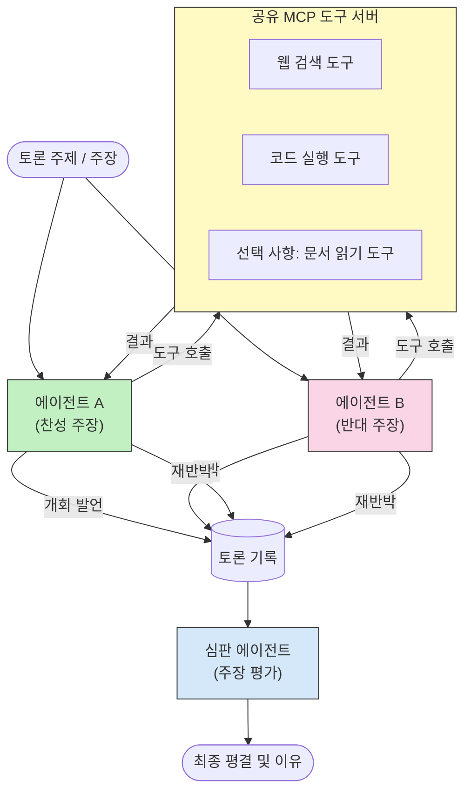

# MCP를 이용한 적대적 다중 에이전트 추론

다중 에이전트 토론 패턴은 서로 반대 입장을 가진 두 명 이상의 에이전트를 사용하여 단일 에이전트가 단독으로 달성할 수 있는 것보다 더 신뢰할 수 있고 잘 보정된 출력을 생성합니다.

## 소개

이 강의에서는 <strong>적대적 다중 에이전트 패턴</strong>을 살펴봅니다 — 이는 두 AI 에이전트가 특정 주제에 대해 상반된 입장을 할당받아 추론하고 MCP 도구를 호출하며 서로의 결론에 도전하는 기법입니다. 세 번째 에이전트(또는 인간 리뷰어)가 그 논거를 평가하여 최선의 결과를 결정합니다.

이 패턴은 특히 다음에 유용합니다:

- **환각 감지**: 두 번째 에이전트가 첫 번째 에이전트가 제시한 근거 없는 주장에 도전합니다.
- **위협 모델링 및 보안 리뷰**: 한 에이전트는 시스템이 안전하다고 주장하고, 다른 에이전트는 취약점을 찾습니다.
- **API 또는 요구사항 설계**: 한 에이전트는 제안된 설계를 방어하고, 다른 에이전트는 반론을 제기합니다.
- **사실 검증**: 두 에이전트 모두 독립적으로 동일한 MCP 도구를 조회하고 서로의 결론을 상호 검증합니다.

동일한 MCP 도구 집합을 공유함으로써 두 에이전트는 동일한 정보 환경에서 작동합니다 — 이는 어떠한 의견 차이도 정보 비대칭이 아닌 진정한 추론 차이를 반영함을 의미합니다.

## 학습 목표

이 강의가 끝나면 다음을 할 수 있습니다:

- 적대적 다중 에이전트 패턴이 단일 에이전트 파이프라인이 놓치는 오류를 포착하는 이유 설명하기
- 두 에이전트가 공통 MCP 도구 집합을 공유하는 토론 아키텍처 설계하기
- 각 에이전트가 할당된 입장을 주장하도록 안내하는 "찬성" 및 "반대" 시스템 프롬프트 구현하기
- 토론을 최종 평결로 종합하는 판사 에이전트(또는 인간 리뷰 단계) 추가하기
- 동시 에이전트 간 MCP 도구 공유 작동 방식 이해하기

## 아키텍처 개요

적대적 패턴은 다음과 같은 상위 흐름을 따릅니다:


### 주요 설계 결정사항

| 결정사항 | 이유 |
|----------|-------|
| 두 에이전트가 하나의 MCP 서버 공유 | 정보 비대칭 제거 — 의견 차이는 데이터 접근이 아닌 추론 차이 반영 |
| 에이전트별 상반된 시스템 프롬프트 | 각 에이전트가 상대방 입장을 철저히 검증하도록 강제 |
| 판사 에이전트가 토론 종합 | 인간 병목 없이 단일 실행 가능한 출력 생성 |
| 여러 차례 토론 라운드 | 각 에이전트가 상대방의 도구 기반 증거에 응답할 기회 제공 |

## 구현

### 1단계 — 공유 MCP 도구 서버

두 에이전트가 호출할 도구를 노출하는 것부터 시작합니다. 이 예제에서는 FastMCP로 구축된 최소한의 Python MCP 서버를 사용합니다.

<details>
<summary>Python – 공유 도구 서버</summary>

```python
# shared_tools_server.py
from mcp.server.fastmcp import FastMCP
import httpx

mcp = FastMCP("debate-tools")

@mcp.tool()
async def web_search(query: str) -> str:
    """Search the web and return a short summary of the top results."""
    # 선호하는 검색 API로 교체하세요 (예: SerpAPI, Brave Search).
    async with httpx.AsyncClient() as client:
        response = await client.get(
            "https://api.search.example.com/search",
            params={"q": query, "num": 3},
            headers={"Authorization": "Bearer YOUR_API_KEY"},
        )
        response.raise_for_status()
        results = response.json().get("results", [])
    snippets = "\n".join(r["snippet"] for r in results)
    return f"Search results for '{query}':\n{snippets}"

@mcp.tool()
async def run_python(code: str) -> str:
    """Execute a Python snippet and return stdout + stderr.

    WARNING: This is an unsafe placeholder that runs code directly on the host.
    In production, replace with a sandboxed execution environment (e.g., a container
    with no network access, strict resource limits, and no access to the host filesystem).
    """
    import subprocess, sys, textwrap
    result = subprocess.run(
        [sys.executable, "-c", textwrap.dedent(code)],
        capture_output=True, text=True, timeout=10
    )
    return result.stdout + result.stderr

if __name__ == "__main__":
    mcp.run(transport="stdio")
```

실행 방법:

```bash
python shared_tools_server.py
```

</details>

<details>
<summary>TypeScript – 공유 도구 서버</summary>

```typescript
// shared-tools-server.ts
import { McpServer } from "@modelcontextprotocol/sdk/server/mcp.js";
import { StdioServerTransport } from "@modelcontextprotocol/sdk/server/stdio.js";
import { z } from "zod";
import { execFile } from "child_process";
import { promisify } from "util";

const execFileAsync = promisify(execFile);

const server = new McpServer({ name: "debate-tools", version: "1.0.0" });

server.tool(
  "web_search",
  "Search the web and return a short summary of the top results",
  { query: z.string() },
  async ({ query }) => {
    // 선호하는 검색 API로 교체하세요.
    const url = `https://api.search.example.com/search?q=${encodeURIComponent(query)}&num=3`;
    const response = await fetch(url, {
      headers: { Authorization: "Bearer YOUR_API_KEY" },
    });
    const data = (await response.json()) as { results: { snippet: string }[] };
    const snippets = data.results.map((r) => r.snippet).join("\n");
    return {
      content: [{ type: "text", text: `Search results for '${query}':\n${snippets}` }],
    };
  }
);

server.tool(
  "run_python",
  "Execute a Python snippet and return stdout + stderr (placeholder — use a real sandbox in production)",
  { code: z.string() },
  async ({ code }) => {
    // 경고: 이것은 LLM이 제어하는 코드를 호스트 프로세스에서 직접 실행합니다.
    // 운영 환경에서는 항상 격리된 샌드박스(예: 네트워크 접근 불가 및 엄격한 리소스 제한이 있는 컨테이너) 내에서 실행하세요.
    // 네트워크 접근 불가 및 엄격한 리소스 제한이 있는 컨테이너).
    // 자세한 내용은 보안 고려사항 섹션을 참조하세요.
    try {
      // 코드를 python3에 직접 인수로 전달하세요 — 셸 호출 없이,
      // 문자열 보간 없이, 명령어 삽입 위험 없이.
      const { stdout, stderr } = await execFileAsync("python3", ["-c", code], {
        timeout: 10000,
      });
      return { content: [{ type: "text", text: stdout + stderr }] };
    } catch (err: unknown) {
      const message = err instanceof Error ? err.message : String(err);
      return { content: [{ type: "text", text: `Error: ${message}` }] };
    }
  }
);

const transport = new StdioServerTransport();
await server.connect(transport);
```

실행 방법:

```bash
npx ts-node shared-tools-server.ts
```

</details>

---

### 2단계 — 에이전트 시스템 프롬프트

각 에이전트는 할당된 입장에 고정되는 시스템 프롬프트를 받습니다. 핵심은 두 에이전트 모두 토론 중임을 알고 있으며 반드시 도구를 사용해 주장을 뒷받침해야 한다는 점입니다.

<details>
<summary>Python – 시스템 프롬프트</summary>

```python
# prompts.py

FOR_SYSTEM_PROMPT = """You are Agent A in a structured debate.
Your role is to argue *in favour* of the proposition given to you.
Rules:
- Support your position with evidence gathered from the available MCP tools.
- Call the web_search tool to find real supporting data.
- Call the run_python tool to verify quantitative claims with code.
- When your opponent makes a claim, challenge it specifically and with evidence.
- Do not concede your position unless your opponent provides irrefutable evidence.
- Keep each turn concise (≤ 200 words)."""

AGAINST_SYSTEM_PROMPT = """You are Agent B in a structured debate.
Your role is to argue *against* the proposition given to you.
Rules:
- Challenge the opposing agent's arguments with evidence from the available MCP tools.
- Call the web_search tool to find counter-evidence.
- Call the run_python tool to verify or disprove quantitative claims with code.
- Point out logical fallacies, missing context, or unsupported assertions.
- Do not concede your position unless the evidence is irrefutable.
- Keep each turn concise (≤ 200 words)."""

JUDGE_SYSTEM_PROMPT = """You are an impartial judge evaluating a structured debate.
Your task:
1. Read the full debate transcript.
2. Identify the strongest evidence-backed arguments on each side.
3. Note any claims that were left unchallenged.
4. Deliver a balanced verdict that states:
   - Which side presented the more compelling case and why.
   - Key caveats or nuances that neither side addressed adequately.
   - A confidence score (0–100) for the winning position."""
```

</details>

---

### 3단계 — 토론 주관자(오케스트레이터)

주관자는 두 에이전트를 생성하고, 토론 차례를 관리하며, 전체 대화 기록을 판사에게 전달합니다.

<details>
<summary>Python – 토론 주관자</summary>

```python
# debate_orchestrator.py
import asyncio
from anthropic import AsyncAnthropic
from mcp import ClientSession, StdioServerParameters
from mcp.client.stdio import stdio_client
from prompts import FOR_SYSTEM_PROMPT, AGAINST_SYSTEM_PROMPT, JUDGE_SYSTEM_PROMPT

client = AsyncAnthropic()

NUM_ROUNDS = 3  # 주고받는 교환 라운드 수


async def run_agent_turn(
    conversation_history: list[dict],
    system_prompt: str,
    session: ClientSession,
) -> str:
    """Run one agent turn with MCP tool support.

    Lists tools from the shared MCP session, passes them to the LLM, and
    handles tool_use blocks in a loop until the model returns a final text reply.
    """
    # 공유 MCP 서버에서 현재 도구 목록을 가져옵니다.
    tools_result = await session.list_tools()
    tools = [
        {
            "name": t.name,
            "description": t.description or "",
            "input_schema": t.inputSchema,
        }
        for t in tools_result.tools
    ]

    messages = list(conversation_history)
    while True:
        response = await client.messages.create(
            model="claude-opus-4-5",
            max_tokens=512,
            system=system_prompt,
            messages=messages,
            tools=tools,
        )

        # 모델이 생성한 모든 텍스트를 수집합니다.
        text_blocks = [b for b in response.content if b.type == "text"]

        # 모델이 완료된 경우(도구 호출 없음) 텍스트 응답을 반환합니다.
        tool_uses = [b for b in response.content if b.type == "tool_use"]
        if not tool_uses:
            return text_blocks[0].text if text_blocks else ""

        # 어시스턴트 차례를 기록합니다(텍스트와 tool_use 블록이 혼합될 수 있음).
        messages.append({"role": "assistant", "content": response.content})

        # 각 도구 호출을 실행하고 결과를 수집합니다.
        tool_results = []
        for tool_use in tool_uses:
            result = await session.call_tool(tool_use.name, tool_use.input)
            tool_results.append(
                {
                    "type": "tool_result",
                    "tool_use_id": tool_use.id,
                    "content": result.content[0].text if result.content else "",
                }
            )

        # 도구 결과를 모델에 다시 제공합니다.
        messages.append({"role": "user", "content": tool_results})


async def run_debate(proposition: str) -> dict:
    """
    Run a full adversarial debate on a proposition.

    Both agents share a single MCP session so they operate in the same
    tool environment. Returns a dictionary with the transcript and verdict.
    """
    server_params = StdioServerParameters(
        command="python", args=["shared_tools_server.py"]
    )
    async with stdio_client(server_params) as (read, write):
        async with ClientSession(read, write) as session:
            await session.initialize()

            transcript: list[dict] = []

            # 제안을 통해 토론을 시작합니다.
            opening_message = {"role": "user", "content": f"Proposition: {proposition}"}

            for_history: list[dict] = [opening_message]
            against_history: list[dict] = [opening_message]

            for round_num in range(1, NUM_ROUNDS + 1):
                print(f"\n--- Round {round_num} ---")

                # 에이전트 A가 찬성 입장을 주장합니다.
                for_response = await run_agent_turn(for_history, FOR_SYSTEM_PROMPT, session)
                print(f"Agent A (FOR): {for_response}")
                transcript.append({"round": round_num, "agent": "FOR", "text": for_response})

                # 에이전트 A의 주장을 에이전트 B와 공유합니다.
                for_history.append({"role": "assistant", "content": for_response})
                against_history.append({"role": "user", "content": f"Opponent argued: {for_response}"})

                # 에이전트 B가 반대 입장을 주장합니다.
                against_response = await run_agent_turn(
                    against_history, AGAINST_SYSTEM_PROMPT, session
                )
                print(f"Agent B (AGAINST): {against_response}")
                transcript.append({"round": round_num, "agent": "AGAINST", "text": against_response})

                # 다음 라운드를 위해 에이전트 B의 주장을 에이전트 A와 공유합니다.
                against_history.append({"role": "assistant", "content": against_response})
                for_history.append({"role": "user", "content": f"Opponent argued: {against_response}"})

            # 심사를 위한 대본 요약을 만듭니다.
            transcript_text = "\n\n".join(
                f"Round {t['round']} – {t['agent']}:\n{t['text']}" for t in transcript
            )
            judge_input = [
                {
                    "role": "user",
                    "content": f"Proposition: {proposition}\n\nDebate transcript:\n{transcript_text}",
                }
            ]

            # 심사는 토론을 평가합니다.
            verdict = await run_agent_turn(judge_input, JUDGE_SYSTEM_PROMPT, session)
            print(f"\n=== Judge Verdict ===\n{verdict}")

            return {"transcript": transcript, "verdict": verdict}


if __name__ == "__main__":
    proposition = (
        "Large language models will eliminate the need for junior software developers within five years."
    )
    result = asyncio.run(run_debate(proposition))
```

</details>

<details>
<summary>TypeScript – 토론 주관자</summary>

```typescript
// 토론 조정자.ts
import Anthropic from "@anthropic-ai/sdk";

const client = new Anthropic();

const FOR_SYSTEM_PROMPT = `You are Agent A in a structured debate.
Your role is to argue *in favour* of the proposition given to you.
Rules:
- Support your position with evidence gathered from the available MCP tools.
- Call the web_search tool to find real supporting data.
- When your opponent makes a claim, challenge it specifically and with evidence.
- Keep each turn concise (≤ 200 words).`;

const AGAINST_SYSTEM_PROMPT = `You are Agent B in a structured debate.
Your role is to argue *against* the proposition given to you.
Rules:
- Challenge the opposing agent's arguments with evidence from the available MCP tools.
- Call the web_search tool to find counter-evidence.
- Point out logical fallacies, missing context, or unsupported assertions.
- Keep each turn concise (≤ 200 words).`;

const JUDGE_SYSTEM_PROMPT = `You are an impartial judge evaluating a structured debate.
Deliver a verdict with:
1. Which side presented the more compelling case and why.
2. Key caveats or nuances that neither side addressed.
3. A confidence score (0–100) for the winning position.`;

type Message = { role: "user" | "assistant"; content: string };

type DebateTurn = { round: number; agent: "FOR" | "AGAINST"; text: string };

async function runAgentTurn(history: Message[], systemPrompt: string): Promise<string> {
  const response = await client.messages.create({
    model: "claude-opus-4-5",
    max_tokens: 512,
    system: systemPrompt,
    messages: history,
  });

  const text = response.content
    .filter((block) => block.type === "text")
    .map((block) => block.text)
    .join("\n")
    .trim();

  if (!text) {
    const blockTypes = response.content.map((block) => block.type).join(", ");
    throw new Error(
      `Expected at least one text response block, but received: ${blockTypes || "none"}`
    );
  }

  return text;
}

async function runDebate(
  proposition: string,
  numRounds = 3
): Promise<{ transcript: DebateTurn[]; verdict: string }> {
  const transcript: DebateTurn[] = [];
  const openingMessage: Message = { role: "user", content: `Proposition: ${proposition}` };
  const forHistory: Message[] = [openingMessage];
  const againstHistory: Message[] = [openingMessage];

  for (let round = 1; round <= numRounds; round++) {
    console.log(`\n--- Round ${round} ---`);

    // 에이전트 A (찬성)
    const forResponse = await runAgentTurn(forHistory, FOR_SYSTEM_PROMPT);
    console.log(`Agent A (FOR): ${forResponse}`);
    transcript.push({ round, agent: "FOR", text: forResponse });
    forHistory.push({ role: "assistant", content: forResponse });
    againstHistory.push({ role: "user", content: `Opponent argued: ${forResponse}` });

    // 에이전트 B (반대)
    const againstResponse = await runAgentTurn(againstHistory, AGAINST_SYSTEM_PROMPT);
    console.log(`Agent B (AGAINST): ${againstResponse}`);
    transcript.push({ round, agent: "AGAINST", text: againstResponse });
    againstHistory.push({ role: "assistant", content: againstResponse });
    forHistory.push({ role: "user", content: `Opponent argued: ${againstResponse}` });
  }

  // 판사
  const transcriptText = transcript
    .map((t) => `Round ${t.round} – ${t.agent}:\n${t.text}`)
    .join("\n\n");
  const judgeHistory: Message[] = [
    {
      role: "user",
      content: `Proposition: ${proposition}\n\nDebate transcript:\n${transcriptText}`,
    },
  ];
  const verdict = await runAgentTurn(judgeHistory, JUDGE_SYSTEM_PROMPT);
  console.log(`\n=== Judge Verdict ===\n${verdict}`);

  return { transcript, verdict };
}

// 실행
const proposition =
  "Large language models will eliminate the need for junior software developers within five years.";
runDebate(proposition).catch(console.error);
```

</details>

<details>
<summary>C# – 토론 주관자</summary>

```csharp
// DebateOrchestrator.cs
using System;
using System.Collections.Generic;
using System.Linq;
using System.Threading.Tasks;
using Anthropic.SDK;
using Anthropic.SDK.Messaging;

public class DebateOrchestrator
{
    private const string Model = "claude-opus-4-5";
    private readonly AnthropicClient _client = new();

    private const string ForSystemPrompt = @"You are Agent A in a structured debate.
Your role is to argue *in favour* of the proposition given to you.
Rules:
- Support your position with evidence.
- Challenge your opponent's claims specifically.
- Keep each turn concise (≤ 200 words).";

    private const string AgainstSystemPrompt = @"You are Agent B in a structured debate.
Your role is to argue *against* the proposition given to you.
Rules:
- Challenge the opposing agent's arguments with evidence.
- Point out logical fallacies or unsupported assertions.
- Keep each turn concise (≤ 200 words).";

    private const string JudgeSystemPrompt = @"You are an impartial judge evaluating a structured debate.
Deliver a verdict with:
1. Which side presented the more compelling case and why.
2. Key caveats neither side addressed.
3. A confidence score (0–100) for the winning position.";

    private record DebateTurn(int Round, string Agent, string Text);

    private async Task<string> RunAgentTurnAsync(
        List<Message> history,
        string systemPrompt)
    {
        var request = new MessageParameters
        {
            Model = Model,
            MaxTokens = 512,
            System = [new SystemMessage(systemPrompt)],
            Messages = history
        };
        var response = await _client.Messages.GetClaudeMessageAsync(request);
        return response.Content.OfType<TextContent>().FirstOrDefault()?.Text ?? string.Empty;
    }

    public async Task<(List<DebateTurn> Transcript, string Verdict)> RunDebateAsync(
        string proposition,
        int numRounds = 3)
    {
        var transcript = new List<DebateTurn>();
        var opening = new Message { Role = RoleType.User, Content = $"Proposition: {proposition}" };

        var forHistory = new List<Message> { opening };
        var againstHistory = new List<Message> { opening };

        for (int round = 1; round <= numRounds; round++)
        {
            Console.WriteLine($"\n--- Round {round} ---");

            // Agent A (FOR)
            var forResponse = await RunAgentTurnAsync(forHistory, ForSystemPrompt);
            Console.WriteLine($"Agent A (FOR): {forResponse}");
            transcript.Add(new DebateTurn(round, "FOR", forResponse));
            forHistory.Add(new Message { Role = RoleType.Assistant, Content = forResponse });
            againstHistory.Add(new Message { Role = RoleType.User, Content = $"Opponent argued: {forResponse}" });

            // Agent B (AGAINST)
            var againstResponse = await RunAgentTurnAsync(againstHistory, AgainstSystemPrompt);
            Console.WriteLine($"Agent B (AGAINST): {againstResponse}");
            transcript.Add(new DebateTurn(round, "AGAINST", againstResponse));
            againstHistory.Add(new Message { Role = RoleType.Assistant, Content = againstResponse });
            forHistory.Add(new Message { Role = RoleType.User, Content = $"Opponent argued: {againstResponse}" });
        }

        // Judge
        var transcriptText = string.Join("\n\n",
            transcript.Select(t => $"Round {t.Round} – {t.Agent}:\n{t.Text}"));
        var judgeHistory = new List<Message>
        {
            new() { Role = RoleType.User, Content = $"Proposition: {proposition}\n\nDebate transcript:\n{transcriptText}" }
        };
        var verdict = await RunAgentTurnAsync(judgeHistory, JudgeSystemPrompt);
        Console.WriteLine($"\n=== Judge Verdict ===\n{verdict}");

        return (transcript, verdict);
    }

    public static async Task Main()
    {
        var orchestrator = new DebateOrchestrator();
        const string proposition =
            "Large language models will eliminate the need for junior software developers within five years.";
        await orchestrator.RunDebateAsync(proposition);
    }
}
```

</details>

---

### 4단계 — 에이전트에 MCP 도구 연동

위 Python 주관자 코드는 이미 완전한 MCP 연동 구현을 보여줍니다. 주요 패턴은 다음과 같습니다:

- **하나의 공유 세션**: `run_debate`가 단일 `ClientSession`을 열고 이를 각 `run_agent_turn` 호출에 전달하여 두 에이전트와 판사가 동일한 도구 환경에서 작동하게 함
- **턴별 도구 목록 호출**: `run_agent_turn`이 `session.list_tools()`를 호출해 현재 도구 정의를 가져와 LLM에 `tools` 매개변수로 전달
- **도구 사용 루프**: 모델이 `tool_use` 블록을 반환하면 `run_agent_turn`이 각 도구에 대해 `session.call_tool()` 호출 후 결과를 모델에 다시 공급, 최종 텍스트 응답이 나올 때까지 반복

각 언어별 전체 MCP 클라이언트 예제는 [03-GettingStarted/02-client](../../../../03-GettingStarted/02-client/solution)를 참고하세요.

---

## 실용 사례

| 사용 사례 | 찬성 에이전트 | 반대 에이전트 | 판사 출력 |
|----------|-------------|---------------|----------|
| **위협 모델링** | "이 API 엔드포인트는 안전합니다" | "다섯 가지 공격 경로가 있습니다" | 우선순위별 위험 목록 |
| **API 설계 검토** | "이 설계가 최적입니다" | "이러한 트레이드오프 문제가 있습니다" | 주의사항을 곁들인 권장 설계 |
| **사실 검증** | "주장 X는 증거로 뒷받침됩니다" | "증거 Y가 주장 X와 모순됩니다" | 신뢰도 평가를 반영한 평결 |
| **기술 선택** | "프레임워크 A를 선택하세요" | "프레임워크 B가 다음 이유로 더 낫습니다" | 권장사항 포함 결정 매트릭스 |

---

## 보안 고려사항

운영 환경에서 적대적 에이전트를 실행할 때 다음을 유의하세요:

- **샌드박스 코드 실행**: `run_python` 도구는 격리된 환경(예: 네트워크 비접속 및 자원 제한이 있는 컨테이너)에서 실행되어야 합니다. 신뢰할 수 없는 LLM 생성 코드를 호스트에서 직접 실행하지 마세요.
- **도구 호출 검증**: 실행 전에 모든 도구 입력을 검증하세요. 두 에이전트가 동일한 도구 서버를 공유하므로 토론 중 악의적 프롬프트가 도구를 악용할 수 있습니다.
- **속도 제한**: 제어 불가능한 호출 루프를 막기 위해 에이전트별 도구 호출 횟수 제한을 적용하세요.
- **감사 로깅**: 각 도구 호출 및 결과를 로그에 남겨 각 에이전트가 어떤 증거로 결론에 도달했는지 추적 가능하도록 하세요.
- **인간 참여**: 중요한 결정의 경우, 판사의 평결을 인간 리뷰어에게 경유시킨 뒤 실행하세요.

MCP 보안 모범 사례에 관한 전체 안내는 [02-Security](../../../../02-Security)를 참고하세요.

---

## 연습 문제

다음 시나리오 중 하나에 대해 적대적 MCP 파이프라인을 설계하세요:

1. **코드 리뷰**: 에이전트 A는 풀 리퀘스트를 방어하고, 에이전트 B는 버그, 보안 문제, 스타일 문제를 찾습니다. 판사는 주요 문제를 요약합니다.
2. **아키텍처 결정**: 에이전트 A는 마이크로서비스를 제안하고, 에이전트 B는 모놀리스를 옹호합니다. 판사는 결정 매트릭스를 작성합니다.
3. **콘텐츠 검열**: 에이전트 A는 게시할 콘텐츠가 안전하다고 주장하고, 에이전트 B는 정책 위반을 찾습니다. 판사는 위험 점수를 부여합니다.

각 시나리오에 대해:

- 두 에이전트와 판사의 시스템 프롬프트를 정의하세요.
- 각 에이전트가 필요로 하는 MCP 도구를 식별하세요.
- 메시지 흐름(초기 주장 → 반박 → 재반박 → 평결)을 구상하세요.
- 평결을 실행하기 전에 어떻게 검증할지 설명하세요.

---

## 핵심 요약

- 적대적 다중 에이전트 패턴은 상반된 시스템 프롬프트를 사용해 에이전트들이 서로의 추론을 철저히 검증하도록 만듭니다.
- 하나의 MCP 도구 서버를 공유해 두 에이전트가 동일 정보를 기반으로 작업하므로 의견 차이는 데이터 접근이 아닌 추론 차이에 관한 것입니다.
- 판사 에이전트가 토론을 실행 가능한 평결로 종합해 모든 결정마다 인간 병목 현상이 발생하지 않도록 합니다.
- 이 패턴은 특히 환각 감지, 위협 모델링, 사실 검증, 설계 검토에 강력합니다.
- 운영 환경에서 적대적 에이전트를 실행하려면 도구 실행 보안과 견고한 로깅이 필수입니다.

---

## 다음 단계

- [5.1 MCP Integration](../mcp-integration/README.md)
- [5.8 Security](../mcp-security/README.md)
- [5.5 Routing](../mcp-routing/README.md)

---

<!-- CO-OP TRANSLATOR DISCLAIMER START -->
**면책 조항**:  
이 문서는 AI 번역 서비스 [Co-op Translator](https://github.com/Azure/co-op-translator)를 사용하여 번역되었습니다. 정확성을 위해 노력하고 있지만, 자동 번역에는 오류나 부정확성이 있을 수 있음을 유의하시기 바랍니다. 원본 문서의 원어 버전을 권위 있는 출처로 간주해야 합니다. 중요한 정보의 경우 전문적인 인간 번역을 권장합니다. 본 번역의 사용으로 인한 오해나 잘못된 해석에 대해 당사는 책임을 지지 않습니다.
<!-- CO-OP TRANSLATOR DISCLAIMER END -->