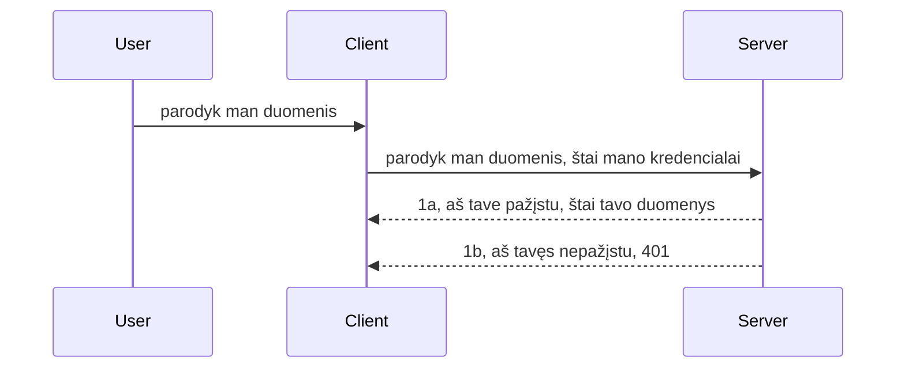

# Paprasta autentifikacija

MCP SDK palaiko OAuth 2.1 naudojimą, kuris, tiesą sakant, yra gana sudėtingas procesas, apimantis tokias sąvokas kaip autorizacijos serveris, išteklių serveris, duomenų siuntimas, kodo gavimas, kodo keitimas į prieigos tokeną, kol galiausiai galite gauti savo išteklių duomenis. Jei nesate įpratę prie OAuth, kuris yra puikus dalykas įgyvendinti, pravartu pradėti nuo paprastesnio autentifikavimo lygio ir toliau tobulinti saugumą. Štai kodėl egzistuoja ši skiltis – kad paruoštų jus sudėtingesnei autentifikacijai.

## Autentifikacija, ką turime omenyje?

Autentifikacija yra sutrumpinimas nuo autentifikacijos ir autorizacijos. Idėja yra, kad turime atlikti du veiksmus:

- **Autentifikacija**, tai procesas, kurio metu nustatome, ar leidžiame žmogui įeiti į mūsų namus, ar jis turi teisę būti „čia“ – turi prieigą prie mūsų išteklių serverio, kuriame veikia MCP serverio funkcijos.
- **Autorizacija** yra procesas, kurio metu nustatoma, ar vartotojas turėtų turėti prieigą prie konkrečių išteklių, kurių jis prašo, pvz., užsakymų ar produktų, arba ar jam leidžiama skaityti turinį, bet ne trinti, kaip kitas pavyzdys.

## Kredencialai: kaip mes sakome sistemai, kas mes esame

Dauguma interneto programuotojų pradeda galvoti apie tai, kaip pateikti serveriui kredencialą, dažniausiai slaptą raktą, kuris sako, ar leidžiama būti čia („Autentifikacija“). Šis kredencialas dažniausiai yra pagrindinė 64 koduota vartotojo vardo ir slaptažodžio versija arba API raktas, kuris unikaliai identifikuoja konkretų vartotoją.

Tai apima jo siuntimą per antraštę pavadinimu „Authorization“, pavyzdžiui:

```json
{ "Authorization": "secret123" }
```
  
Tai dažniausiai vadinama paprasta autentifikacija. Bendras veikimo srautas atrodo taip:


Dabar, kai suprantame, kaip tai veikia iš srauto pusės, kaip mes tai įgyvendiname? Dauguma interneto serverių turi sąvoką vidurinės programinės įrangos (middleware) komponentas, kuris paleidžiamas kaip užklausos dalis, gali patikrinti kredencialus ir jei jie yra galiojantys, leidžia prašymui praeiti. Jei užklausa neturi galiojančių kredencialų, gaunate autentifikacijos klaidą. Pažiūrėkime, kaip tai galima įgyvendinti:

**Python**

```python
class AuthMiddleware(BaseHTTPMiddleware):
    async def dispatch(self, request, call_next):

        has_header = request.headers.get("Authorization")
        if not has_header:
            print("-> Missing Authorization header!")
            return Response(status_code=401, content="Unauthorized")

        if not valid_token(has_header):
            print("-> Invalid token!")
            return Response(status_code=403, content="Forbidden")

        print("Valid token, proceeding...")
       
        response = await call_next(request)
        # pridėti bet kokius kliento antraštes arba kitaip pakeisti atsakymą
        return response


starlette_app.add_middleware(CustomHeaderMiddleware)
```
  
Čia mes:

- Sukūrėme middleware, vadinamą `AuthMiddleware`, kurio `dispatch` metodas kviečiamas interneto serverio.
- Pridėjome middleware į interneto serverį:

    ```python
    starlette_app.add_middleware(AuthMiddleware)
    ```
  
- Parašėme patikrinimo logiką, kuri tikrina, ar yra Authorization antraštė ir ar siunčiamas slaptažodis yra galiojantis:

    ```python
    has_header = request.headers.get("Authorization")
    if not has_header:
        print("-> Missing Authorization header!")
        return Response(status_code=401, content="Unauthorized")

    if not valid_token(has_header):
        print("-> Invalid token!")
        return Response(status_code=403, content="Forbidden")
    ```
  
    jei slaptažodis yra pateiktas ir galiojantis, leidžiame užklausai praeiti kviesdami `call_next` ir grąžiname atsakymą.

    ```python
    response = await call_next(request)
    # pridėti bet kokius kliento antraštes arba kitaip pakeisti atsakymą
    return response
    ```
  
Veikimo principas yra toks, kad jei atliekama užklausa serveriui, middleware bus iškviesta ir pagal įgyvendinimą ji arba leis užklausai praeiti, arba grąžins klaidą, nurodančią, kad klientas neturi teisės tęsti.

**TypeScript**

Čia sukuriame middleware su populiaria Express karkasu ir perimame užklausą prieš jai pasiekiant MCP Serverį. Štai kodas:

```typescript
function isValid(secret) {
    return secret === "secret123";
}

app.use((req, res, next) => {
    // 1. Ar yra autorizacijos antraštė?
    if(!req.headers["Authorization"]) {
        res.status(401).send('Unauthorized');
    }
    
    let token = req.headers["Authorization"];

    // 2. Patikrinkite galiojimą.
    if(!isValid(token)) {
        res.status(403).send('Forbidden');
    }

   
    console.log('Middleware executed');
    // 3. Perduoda užklausą kitam užklausos apdorojimo žingsniui.
    next();
});
```
  
Šiame kode mes:

1. Patikriname, ar pirmiausia yra Authorization antraštė, jei ne, siunčiame 401 klaidą.
2. Patikriname, ar kredencialas/tokenas yra galiojantis, jei ne, siunčiame 403 klaidą.
3. Galiausiai užklausa perduodama toliau ir grąžinamas paprašytas išteklius.

## Užduotis: įgyvendinti autentifikaciją

Išbandykime savo žinias praktiškai. Planas:

Serveris

- Sukurti interneto serverį ir MCP egzempliorių.
- Įgyvendinti middleware serveriui.

Klientas

- Siųsti interneto užklausą su kredencialais per antraštę.

### -1- Sukurti interneto serverį ir MCP egzempliorių

Pirmajame žingsnyje turi būti sukurtas interneto serverio egzempliorius ir MCP serveris.

**Python**

Čia sukuriamas MCP serverio egzempliorius, starlette interneto aplikacija ir hostinamas su uvicorn.

```python
# kuriamas MCP serveris

app = FastMCP(
    name="MCP Resource Server",
    instructions="Resource Server that validates tokens via Authorization Server introspection",
    host=settings["host"],
    port=settings["port"],
    debug=True
)

# kuriama starlette žiniatinklio programa
starlette_app = app.streamable_http_app()

# programa tarnaus per uvicorn
async def run(starlette_app):
    import uvicorn
    config = uvicorn.Config(
            starlette_app,
            host=app.settings.host,
            port=app.settings.port,
            log_level=app.settings.log_level.lower(),
        )
    server = uvicorn.Server(config)
    await server.serve()

run(starlette_app)
```
  
Šiame kode mes:

- Sukuriame MCP Serverį.
- Sukuriame starlette interneto aplikaciją iš MCP Serverio `app.streamable_http_app()`.
- Hostiname ir aptarnaujame interneto aplikaciją naudojant uvicorn `server.serve()`.

**TypeScript**

Čia sukuriame MCP serverio egzempliorių.

```typescript
const server = new McpServer({
      name: "example-server",
      version: "1.0.0"
    });

    // ... paruošia serverio išteklius, įrankius ir užklausas ...
```
  
Šis MCP Serverio sukūrimas turi vykti POST /mcp maršruto apibrėžime, tad perkelkime aukščiau pateiktą kodą taip:

```typescript
import express from "express";
import { randomUUID } from "node:crypto";
import { McpServer } from "@modelcontextprotocol/sdk/server/mcp.js";
import { StreamableHTTPServerTransport } from "@modelcontextprotocol/sdk/server/streamableHttp.js";
import { isInitializeRequest } from "@modelcontextprotocol/sdk/types.js"

const app = express();
app.use(express.json());

// Žemėlapis transportams saugoti pagal sesijos ID
const transports: { [sessionId: string]: StreamableHTTPServerTransport } = {};

// Tvarkyti POST užklausas klientas-serveris komunikacijai
app.post('/mcp', async (req, res) => {
  // Patikrinti esamą sesijos ID
  const sessionId = req.headers['mcp-session-id'] as string | undefined;
  let transport: StreamableHTTPServerTransport;

  if (sessionId && transports[sessionId]) {
    // Pakartotinai naudoti esamą transportą
    transport = transports[sessionId];
  } else if (!sessionId && isInitializeRequest(req.body)) {
    // Naujas inicializacijos užklausimas
    transport = new StreamableHTTPServerTransport({
      sessionIdGenerator: () => randomUUID(),
      onsessioninitialized: (sessionId) => {
        // Saugo transportą pagal sesijos ID
        transports[sessionId] = transport;
      },
      // DNS perpildymo apsauga pagal numatytuosius nustatymus išjungta dėl suderinamumo su senesnėmis versijomis. Jei vykdote šį serverį
      // vietoje, būtinai nustatykite:
      // enableDnsRebindingProtection: true,
      // allowedHosts: ['127.0.0.1'],
    });

    // Išvalyti transportą uždarius
    transport.onclose = () => {
      if (transport.sessionId) {
        delete transports[transport.sessionId];
      }
    };
    const server = new McpServer({
      name: "example-server",
      version: "1.0.0"
    });

    // ... nustatyti serverio išteklius, įrankius ir raginimus ...

    // Prisijungti prie MCP serverio
    await server.connect(transport);
  } else {
    // Neteisinga užklausa
    res.status(400).json({
      jsonrpc: '2.0',
      error: {
        code: -32000,
        message: 'Bad Request: No valid session ID provided',
      },
      id: null,
    });
    return;
  }

  // Tvarkyti užklausą
  await transport.handleRequest(req, res, req.body);
});

// Pakartotinai naudojamas tvarkytojas GET ir DELETE užklausoms
const handleSessionRequest = async (req: express.Request, res: express.Response) => {
  const sessionId = req.headers['mcp-session-id'] as string | undefined;
  if (!sessionId || !transports[sessionId]) {
    res.status(400).send('Invalid or missing session ID');
    return;
  }
  
  const transport = transports[sessionId];
  await transport.handleRequest(req, res);
};

// Tvarkyti GET užklausas serverio-kliento pranešimams per SSE
app.get('/mcp', handleSessionRequest);

// Tvarkyti DELETE užklausas sesijos užbaigimui
app.delete('/mcp', handleSessionRequest);

app.listen(3000);
```
  
Dabar matote, kaip MCP Serverio kūrimas perkeltas į `app.post("/mcp")`.

Judėkime prie kito žingsnio – middleware kūrimo, kad galėtume patikrinti gaunamus kredencialus.

### -2- Įgyvendinti middleware serveriui

Toliau pereikime prie middleware dalies. Čia sukursime middleware, kuris tikrins „Authorization“ antraštėje pateiktą kredencialą ir jį validuos. Jei priimtinas, užklausa tęsis, norėdama atlikti reikalingus veiksmus (pvz., įrašyti įrankius, nuskaityti išteklius ar tinkamas MCP funkcijas).

**Python**

Kuriant middleware, turime sukurti klasę, paveldinčią `BaseHTTPMiddleware`. Yra du svarbūs dalykai:

- Užklausa `request`, iš kurios skaitome antraštės informaciją.
- `call_next`, funkcija, kurią reikia iškviesti, jei klientas pateikė priimtiną kredencialą.

Pirmiausia turime apdoroti atvejį, kai nėra `Authorization` antraštės:

```python
has_header = request.headers.get("Authorization")

# nėra antraštės, grąžinti 401 klaidą, kitu atveju tęsti.
if not has_header:
    print("-> Missing Authorization header!")
    return Response(status_code=401, content="Unauthorized")
```
  
Čia siunčiame 401 neautorizuoto pranešimą, nes klientas nepraeina autentifikacijos.

Tada, jei pateiktas kredencialas, turime patikrinti jo galiojimą taip:

```python
 if not valid_token(has_header):
    print("-> Invalid token!")
    return Response(status_code=403, content="Forbidden")
```
  
Atkreipkite dėmesį, kad siunčiame 403 uždraustą pranešimą. Pažiūrėkime pilną middleware kodą, kuris įgyvendina viską, ką minėjome aukščiau:

```python
class AuthMiddleware(BaseHTTPMiddleware):
    async def dispatch(self, request, call_next):

        has_header = request.headers.get("Authorization")
        if not has_header:
            print("-> Missing Authorization header!")
            return Response(status_code=401, content="Unauthorized")

        if not valid_token(has_header):
            print("-> Invalid token!")
            return Response(status_code=403, content="Forbidden")

        print("Valid token, proceeding...")
        print(f"-> Received {request.method} {request.url}")
        response = await call_next(request)
        response.headers['Custom'] = 'Example'
        return response

```
  
Puiku, o kaip su `valid_token` funkcija? Štai ji:

```python
# NESINAUDOKITE gamyboje - patobulinkite tai !!
def valid_token(token: str) -> bool:
    # pašalinti prefiksą „Bearer “
    if token.startswith("Bearer "):
        token = token[7:]
        return token == "secret-token"
    return False
```
  
Tai tikrai turėtų būti patobulinta.

SVARBU: jokiu būdu neturėtumėte turėti tokių slaptažodžių tiesiog programos kode. Geriausia reikšmes palyginimui gauti iš duomenų šaltinio arba IDP (tapatybės paslaugų teikėjo), arba dar geriau – leisti IDP atlikti patvirtinimą.

**TypeScript**

Įgyvendinant Express, reikia iškviesti `use` metodą, kuris priima middleware funkcijas.

Reikia:

- Dirbti su užklausa, tikrinti kredencialą `Authorization` savybėje.
- Validuoti kredencialą, jei jis teisingas, leisti užklausai tęstis ir leisti kliento MCP užklausai atlikti reikiamus veiksmus.

Čia tikriname, ar yra `Authorization` antraštė ir jei jos nėra, sustabdome užklausos vykdymą:

```typescript
if(!req.headers["authorization"]) {
    res.status(401).send('Unauthorized');
    return;
}
```
  
Jei antraštė nepateikta, gaunate 401 klaidą.

Tada tikriname, ar kredencialas galiojantis, jei ne – vėl stabdome užklausą, bet su kita klaida:

```typescript
if(!isValid(token)) {
    res.status(403).send('Forbidden');
    return;
} 
```
  
Dabar gaunate 403 klaidą.

Pilnas kodas:

```typescript
app.use((req, res, next) => {
    console.log('Request received:', req.method, req.url, req.headers);
    console.log('Headers:', req.headers["authorization"]);
    if(!req.headers["authorization"]) {
        res.status(401).send('Unauthorized');
        return;
    }
    
    let token = req.headers["authorization"];

    if(!isValid(token)) {
        res.status(403).send('Forbidden');
        return;
    }  

    console.log('Middleware executed');
    next();
});
```
  
Nustatėme interneto serverį priimti middleware, kuris tikrina kliento siunčiamą kredencialą. O kaip pats klientas?

### -3- Siųsti interneto užklausą su kredencialu per antraštę

Turime įsitikinti, kad klientas perduoda kredencialą per antraštę. Kadangi naudosime MCP klientą, reikia išsiaiškinti, kaip tai daroma.

**Python**

Klientui reikia perduoti antraštę su kredencialais taip:

```python
# NĖRAU koduoti reikšmės tiesiogiai, turėkite ją bent jau aplinkos kintamajame arba saugesnėje saugykloje
token = "secret-token"

async with streamablehttp_client(
        url = f"http://localhost:{port}/mcp",
        headers = {"Authorization": f"Bearer {token}"}
    ) as (
        read_stream,
        write_stream,
        session_callback,
    ):
        async with ClientSession(
            read_stream,
            write_stream
        ) as session:
            await session.initialize()
      
            # DAROMA, ką norite atlikti kliente, pvz., įrankių sąrašas, įrankių iškvietimas ir pan.
```
  
Atkreipkite dėmesį, kaip užpildome `headers` savybę: `headers = {"Authorization": f"Bearer {token}"}`.

**TypeScript**

Tai galime padaryti dviem žingsniais:

1. Užpildyti konfigūracijos objektą kredencialais.
2. Perduoti konfiguracijos objektą transportui.

```typescript

// NENUSTATYKITE reikšmės tiesiogiai kaip parodyta čia. Bent jau naudokite kaip aplinkos kintamąjį ir kažką panašaus į dotenv (plėtros režimu).
let token = "secret123"

// apibrėžkite kliento transporto pasirinkčių objektą
let options: StreamableHTTPClientTransportOptions = {
  sessionId: sessionId,
  requestInit: {
    headers: {
      "Authorization": "secret123"
    }
  }
};

// perduokite pasirinkčių objektą transportui
async function main() {
   const transport = new StreamableHTTPClientTransport(
      new URL(serverUrl),
      options
   );
```
  
Čia matote, kaip sukūrėme `options` objektą ir įdėjome antraštes į `requestInit` lauką.

SVARBU: kaip patobulinti šią situaciją? Dabar esama kelių trūkumų. Pirma, tokį kredencialų pateikimą yra gana rizikinga daryti, jei bent jau nenaudojate HTTPS. Net HTTPS atveju kredencialai gali būti pavogti, todėl reikia sistemos, leidžiančios lengvai atšaukti tokenus ir pridėti papildomus tikrinimus, pvz., iš kurios vietos pasaulyje siunčiama užklausa, ar užklausa nevyksta pernelyg dažnai (robotų elgesys) ir t.t. Iš esmės yra daug įvairių klausimų.

Vis dėlto, labai paprastoms API, kur nenorite, kad kas nors galėtų naudoti jūsų API be autentifikacijos, tai yra geras pradinis taškas.

Tad pabandykime paįvairinti saugumą naudojant standartizuotą formatą – JSON Web Token, dar žinomą kaip JWT arba „JOT“ tokenus.

## JSON Web Tokenai, JWT

Bandome patobulinti paprastų kredencialų siuntimą. Kokie yra pagrindiniai patobulinimai, įvedus JWT?

- **Saugumo patobulinimai**. Naudojant paprastą autentifikaciją, siuntinėjate vartotojo vardą ir slaptažodį kaip base64 koduotą tokeną (arba API raktą) nuolat, kas padidina riziką. Su JWT jūs siunčiate vartotojo vardą ir slaptažodį, gaunate tokeną, kuris taip pat yra laike ribotas – jis gali pasibaigti. JWT leidžia lengvai naudoti detalesnę prieigos kontrolę pagal roles, aprėptis ir leidimus.
- **Bevalstystė ir mastelio keitimas**. JWT yra savarankiški, juose yra visa vartotojo informacija, tad nėra reikalo laikyti sesijų serverio pusėje. Tokeną galima patvirtinti vietoje.
- **Suderinamumas ir federacija**. JWT yra Open ID Connect širdyje ir naudojamas su žinomais tapatybės teikėjais kaip Entra ID, Google Identity ir Auth0. Tai leidžia naudoti vieno prisijungimo (SSO) funkcijas ir kitas pažangias galimybes, todėl tai yra įmonių lygmens sprendimas.
- **Moduliarumas ir lankstumas**. JWT gali būti naudojami su API vartais (API Gateway) kaip Azure API Management, NGINX ir kt. Taip pat palaiko naudotojų autentifikacijos scenarijus ir serverių tarpusavio komunikaciją įskaitant įgaliojimų suteikimą ir delegavimą.
- **Veikimas ir talpinimas**. JWT gali būti kešuojami po dekodavimo, taip sumažinant poreikį analizuoti juos kiekvieną kartą. Tai ypač naudinga aplikacijoms, turinčioms daug srauto, nes pagerina pralaidumą ir sumažina apkrovą infrastruktūrai.
- **Pažangios funkcijos**. Taip pat palaiko introspekciją (patikrinimą serveryje) ir tokenų atšaukimą (tokenų invalidavimą).

Turint tiek daug privalumų, pažiūrėkime, kaip galime pakelti savo įgyvendinimą į aukštesnį lygį.

## Paverčiame paprastą autentifikaciją į JWT

Aukštų lygių pakeitimai, kuriuos turime padaryti, yra:

- **Išmokti konstruoti JWT tokeną** ir paruošti jį siuntimui iš kliento į serverį.
- **Validuoti JWT tokeną** ir jei galioja, leisti klientui prieiti prie išteklių.
- **Saugiai laikyti tokeną**. Kaip saugiai jį saugoti.
- **Apsaugoti maršrutus**. Turime apsaugoti maršrutus, mūsų atveju – apsaugoti maršrutus ir konkrečias MCP funkcijas.
- **Pridėti atnaujinimo tokenus**. Užtikrinti, kad kuriame trumpalaikius tokenus ir ilgesnio galiojimo atnaujinimo tokenus, kurie leidžia gauti naujus tokenus jų pasibaigus. Taip pat sukurti atnaujinimo endpointą ir rotacijos strategiją.

### -1- Sukurti JWT tokeną

JWT tokenas turi šias dalis:

- **Antraštė** – naudojamas algoritmas ir tokeno tipas.
- **Našta (payload)** – teiginiai (claims), pvz., sub (naudotojas ar subjektas, kurį tokenas atstovauja, paprastai vartotojo ID), exp (pasibaigimo laikas), role (vartotojo rolė).
- **Parašas** – pasirašomas slaptažodžiu arba privačiu raktu.

Reikės sukonstruoti antraštę, našlą ir užkoduotą tokeną.

**Python**

```python

import jwt
import jwt
from jwt.exceptions import ExpiredSignatureError, InvalidTokenError
import datetime

# Slaptas raktas, naudojamas JWT pasirašymui
secret_key = 'your-secret-key'

header = {
    "alg": "HS256",
    "typ": "JWT"
}

# vartotojo informacija, jo teiginiai ir galiojimo laikas
payload = {
    "sub": "1234567890",               # Tema (vartotojo ID)
    "name": "User Userson",                # Pasirinktinis teiginys
    "admin": True,                     # Pasirinktinis teiginys
    "iat": datetime.datetime.utcnow(),# Išduota laiku
    "exp": datetime.datetime.utcnow() + datetime.timedelta(hours=1)  # Galiojimo pabaiga
}

# užkoduokite tai
encoded_jwt = jwt.encode(payload, secret_key, algorithm="HS256", headers=header)
```
  
Aukščiau:

- Apibrėžėme antraštę, naudojančią HS256 algoritmą ir tipą JWT.
- Sukūrėme naštą su subjektu arba vartotojo ID, vartotojo vardu, role, išleidimo laiku ir galiojimo pabaigos laiku, įgyvendindami laiko ribotumo aspektą.

**TypeScript**

Čia reikės priklausomybių, kurios padės konstruoti JWT tokeną.

Priklausomybės

```sh

npm install jsonwebtoken
npm install --save-dev @types/jsonwebtoken
```
  
Dabar, kai tai yra, sukurkime antraštę, našlą ir per juos sugeneruokime užkoduotą tokeną.

```typescript
import jwt from 'jsonwebtoken';

const secretKey = 'your-secret-key'; // Naudokite aplinkos kintamuosius gamyboje

// Apibrėžkite užklausos duomenis
const payload = {
  sub: '1234567890',
  name: 'User usersson',
  admin: true,
  iat: Math.floor(Date.now() / 1000), // Išduota
  exp: Math.floor(Date.now() / 1000) + 60 * 60 // Galioja 1 valandą
};

// Apibrėžkite antraštę (pasirinktinai, jsonwebtoken nustato numatytuosius)
const header = {
  alg: 'HS256',
  typ: 'JWT'
};

// Sukurkite žetoną
const token = jwt.sign(payload, secretKey, {
  algorithm: 'HS256',
  header: header
});

console.log('JWT:', token);
```
  
Šis tokenas:

Naudoja HS256 pasirašymą  
Galioja 1 valandą  
Įtraukia teiginius sub, name, admin, iat ir exp.

### -2- Validuoti tokeną

Taip pat reikės validuoti tokeną, tai turėtume daryti serveryje, kad patikrintume, ar klientas siunčia tinkamą informaciją. Čia atliekami įvairūs patikrinimai nuo struktūros patikrinimo iki galiojimo. Taip pat rekomenduojama daryti papildomus patikrinimus, ar vartotojas yra mūsų sistemoje ir ar jis turi reikiamas teises.

Kad validuotume tokeną, turime jį išdekoduoti, kad galėtume perskaityti ir patikrinti galiojimą:

**Python**

```python

# Iššifruoti ir patikrinti JWT
try:
    decoded = jwt.decode(token, secret_key, algorithms=["HS256"])
    print("✅ Token is valid.")
    print("Decoded claims:")
    for key, value in decoded.items():
        print(f"  {key}: {value}")
except ExpiredSignatureError:
    print("❌ Token has expired.")
except InvalidTokenError as e:
    print(f"❌ Invalid token: {e}")

```
  
Šiame kode kviečiame `jwt.decode` su tokenu, slaptu raktu ir pasirinktu algoritmu. Naudojame try-catch bloką, nes patikrinimas gali nepavykti ir grąžinti klaidą.

**TypeScript**

Čia kviečiame `jwt.verify`, kad gautume išdekuotą tokeną, kurį galime toliau analizuoti. Jei kvietimas nepavyksta, tokeno struktūra yra neteisinga arba tokenas nebegalioja.

```typescript

try {
  const decoded = jwt.verify(token, secretKey);
  console.log('Decoded Payload:', decoded);
} catch (err) {
  console.error('Token verification failed:', err);
}
```
  
PASTABA: kaip minėta anksčiau, rekomenduojame atlikti papildomus patikrinimus, kad tokenas atitiktų mūsų sistemos vartotoją ir šis vartotojas turėtų teises, kurias tokenas deklaruoja.

Dabar pažvelkime į vaidmenimis pagrįstą prieigos kontrolę, dar žinomą kaip RBAC.
## Pridedant vaidmenimis pagrįstą prieigos valdymą

Idėja yra ta, kad norime išreikšti, jog skirtingi vaidmenys turi skirtingas teises. Pavyzdžiui, laikome, kad administratorius gali daryti viską, o paprastas vartotojas gali tik skaityti/rašyti, o svečias gali tik skaityti. Todėl čia pateikiami kai kurie galimi leidimų lygiai:

- Admin.Write 
- User.Read
- Guest.Read

Pažiūrėkime, kaip galime įgyvendinti tokią kontrolę naudojant tarpinį programinį sluoksnį (middleware). Tarpinius sluoksnius galima pridėti atskiram keliui, taip pat ir visiems keliams.

**Python**

```python
from starlette.middleware.base import BaseHTTPMiddleware
from starlette.responses import JSONResponse
import jwt

# NEĮDĖKITE slaptumo tiesiai į kodą, tai tik demonstraciniais tikslais. Skaitykite jį iš saugios vietos.
SECRET_KEY = "your-secret-key" # įdėkite tai į aplinkos kintamąjį
REQUIRED_PERMISSION = "User.Read"

class JWTPermissionMiddleware(BaseHTTPMiddleware):
    async def dispatch(self, request, call_next):
        auth_header = request.headers.get("Authorization")
        if not auth_header or not auth_header.startswith("Bearer "):
            return JSONResponse({"error": "Missing or invalid Authorization header"}, status_code=401)

        token = auth_header.split(" ")[1]
        try:
            decoded = jwt.decode(token, SECRET_KEY, algorithms=["HS256"])
        except jwt.ExpiredSignatureError:
            return JSONResponse({"error": "Token expired"}, status_code=401)
        except jwt.InvalidTokenError:
            return JSONResponse({"error": "Invalid token"}, status_code=401)

        permissions = decoded.get("permissions", [])
        if REQUIRED_PERMISSION not in permissions:
            return JSONResponse({"error": "Permission denied"}, status_code=403)

        request.state.user = decoded
        return await call_next(request)


```

Yra keletas skirtingų būdų, kaip pridėti tarpinį programinį sluoksnį, kaip parodyta žemiau:

```python

# Alt 1: pridėti tarpinį programinį sluoksnį statant starlette programėlę
middleware = [
    Middleware(JWTPermissionMiddleware)
]

app = Starlette(routes=routes, middleware=middleware)

# Alt 2: pridėti tarpinį programinį sluoksnį, kai starlette programėlė jau sukurta
starlette_app.add_middleware(JWTPermissionMiddleware)

# Alt 3: pridėti tarpinį programinį sluoksnį kiekvienam maršrutui
routes = [
    Route(
        "/mcp",
        endpoint=..., # tvarkytojas
        middleware=[Middleware(JWTPermissionMiddleware)]
    )
]
```

**TypeScript**

Galime naudoti `app.use` ir tarpinį programinį sluoksnį, kuris vykdomas visiems užklausoms.

```typescript
app.use((req, res, next) => {
    console.log('Request received:', req.method, req.url, req.headers);
    console.log('Headers:', req.headers["authorization"]);

    // 1. Patikrinkite, ar buvo išsiųstas autorizacijos antraštė

    if(!req.headers["authorization"]) {
        res.status(401).send('Unauthorized');
        return;
    }
    
    let token = req.headers["authorization"];

    // 2. Patikrinkite, ar žetonas yra galiojantis
    if(!isValid(token)) {
        res.status(403).send('Forbidden');
        return;
    }  

    // 3. Patikrinkite, ar žetono naudotojas egzistuoja mūsų sistemoje
    if(!isExistingUser(token)) {
        res.status(403).send('Forbidden');
        console.log("User does not exist");
        return;
    }
    console.log("User exists");

    // 4. Patvirtinkite, ar žetonas turi teisingas teises
    if(!hasScopes(token, ["User.Read"])){
        res.status(403).send('Forbidden - insufficient scopes');
    }

    console.log("User has required scopes");

    console.log('Middleware executed');
    next();
});

```

Yra nemažai dalykų, kuriuos galime leisti mūsų tarpinis programinis sluoksnis ir kuriuos JIS TURĖTŲ daryti, būtent:

1. Patikrinti, ar yra autorizacijos antraštė
2. Patikrinti, ar žetonas galiojantis, mes kviečiame `isValid` metodą, kurį parašėme, tikrinantį JWT žetono integralumą ir galiojimą.
3. Patvirtinti, kad vartotojas egzistuoja mūsų sistemoje, tai turėtume patikrinti.

   ```typescript
    // vartotojai duomenų bazėje
   const users = [
     "user1",
     "User usersson",
   ]

   function isExistingUser(token) {
     let decodedToken = verifyToken(token);

     // TODO, patikrinti ar vartotojas egzistuoja duomenų bazėje
     return users.includes(decodedToken?.name || "");
   }
   ```

   Aukščiau sukūrėme labai paprastą `users` sąrašą, kuris, aišku, turėtų būti duomenų bazėje.

4. Be to, turėtume patikrinti, ar žetonas turi tinkamas teises.

   ```typescript
   if(!hasScopes(token, ["User.Read"])){
        res.status(403).send('Forbidden - insufficient scopes');
   }
   ```

   Aukščiau esančiame tarpinio programinio sluoksnio kode tikriname, ar žetone yra User.Read teisė, jei ne, siunčiame 403 klaidą. Žemiau pateiktas `hasScopes` pagalbinis metodas.

   ```typescript
   function hasScopes(scope: string, requiredScopes: string[]) {
     let decodedToken = verifyToken(scope);
    return requiredScopes.every(scope => decodedToken?.scopes.includes(scope));
  }
   ```

Have a think which additional checks you should be doing, but these are the absolute minimum of checks you should be doing.

Using Express as a web framework is a common choice. There are helpers library when you use JWT so you can write less code.

- `express-jwt`, helper library that provides a middleware that helps decode your token.
- `express-jwt-permissions`, this provides a middleware `guard` that helps check if a certain permission is on the token.

Here's what these libraries can look like when used:

```typescript
const express = require('express');
const jwt = require('express-jwt');
const guard = require('express-jwt-permissions')();

const app = express();
const secretKey = 'your-secret-key'; // put this in env variable

// Decode JWT and attach to req.user
app.use(jwt({ secret: secretKey, algorithms: ['HS256'] }));

// Check for User.Read permission
app.use(guard.check('User.Read'));

// multiple permissions
// app.use(guard.check(['User.Read', 'Admin.Access']));

app.get('/protected', (req, res) => {
  res.json({ message: `Welcome ${req.user.name}` });
});

// Error handler
app.use((err, req, res, next) => {
  if (err.code === 'permission_denied') {
    return res.status(403).send('Forbidden');
  }
  next(err);
});

```

Dabar, kai pamatėte, kaip tarpinis programinis sluoksnis gali būti naudojamas tiek autentifikacijai, tiek autorizacijai, o kaip dėl MCP? Ar tai keičia, kaip mes darome autentifikaciją? Sužinokime kitame skyriuje.

### -3- Pridėti RBAC prie MCP

Iki šiol matėte, kaip galima pridėti RBAC per tarpinį programinį sluoksnį, tačiau MCP atveju nėra paprasto būdo pridėti RBAC kiekvienai MCP funkcijai, tai ką daryti? Tiesiog turime pridėti tokį kodą, kuris tikrina, ar klientas turi teisę iškviesti tam tikrą įrankį:

Turite kelis skirtingus pasirinkimus, kaip atlikti RBAC pagal funkcijas, pateikiame keletą:

- Pridėti patikrą kiekvienam įrankiui, resursui, užklausai, kur reikia tikrinti leidimų lygį.

   **python**

   ```python
   @tool()
   def delete_product(id: int):
      try:
          check_permissions(role="Admin.Write", request)
      catch:
        pass # klientas nepavyko autorizuoti, iškelkite autorizacijos klaidą
   ```

   **typescript**

   ```typescript
   server.registerTool(
    "delete-product",
    {
      title: Delete a product",
      description: "Deletes a product",
      inputSchema: { id: z.number() }
    },
    async ({ id }) => {
      
      try {
        checkPermissions("Admin.Write", request);
        // padaryti, siųsti ID į productService ir nuotolinę įrašą
      } catch(Exception e) {
        console.log("Authorization error, you're not allowed");  
      }

      return {
        content: [{ type: "text", text: `Deletected product with id ${id}` }]
      };
    }
   );
   ```


- Naudoti pažangų serverio požiūrį ir užklausų tvarkytuvus, kad sumažintumėte vietų, kur reikia atlikti patikrą, skaičių.

   **Python**

   ```python
   
   tool_permission = {
      "create_product": ["User.Write", "Admin.Write"],
      "delete_product": ["Admin.Write"]
   }

   def has_permission(user_permissions, required_permissions) -> bool:
      # user_permissions: vartotojo turimų leidimų sąrašas
      # required_permissions: įrankiui reikalingų leidimų sąrašas
      return any(perm in user_permissions for perm in required_permissions)

   @server.call_tool()
   async def handle_call_tool(
     name: str, arguments: dict[str, str] | None
   ) -> list[types.TextContent]:
    # Laikykite, kad request.user.permissions yra vartotojo leidimų sąrašas
     user_permissions = request.user.permissions
     required_permissions = tool_permission.get(name, [])
     if not has_permission(user_permissions, required_permissions):
        # Išmetkite klaidą „Neturite leidimo naudoti įrankį {name}“
        raise Exception(f"You don't have permission to call tool {name}")
     # tęskite ir iškvieskite įrankį
     # ...
   ```   
   

   **TypeScript**

   ```typescript
   function hasPermission(userPermissions: string[], requiredPermissions: string[]): boolean {
       if (!Array.isArray(userPermissions) || !Array.isArray(requiredPermissions)) return false;
       // Grąžinkite true, jei vartotojas turi bent vieną reikiamą leidimą
       
       return requiredPermissions.some(perm => userPermissions.includes(perm));
   }
  
   server.setRequestHandler(CallToolRequestSchema, async (request) => {
      const { params: { name } } = request;
  
      let permissions = request.user.permissions;
  
      if (!hasPermission(permissions, toolPermissions[name])) {
         return new Error(`You don't have permission to call ${name}`);
      }
  
      // tęskite toliau..
   });
   ```

   Atkreipkite dėmesį, kad turėsite užtikrinti, jog jūsų tarpinis programinis sluoksnis priskiria dekoduotą žetoną užklausos vartotojo savybei, kad aukščiau esantis kodas būtų paprastas.

### Apibendrinimas

Dabar, kai aptarėme, kaip pridėti RBAC paramą apskritai ir MCP konkrečiai, pats laikas pabandyti įgyvendinti saugumą patiems, kad įsitikintumėte, jog supratote jums pateiktas sąvokas.

## Užduotis 1: Sukurkite mcp serverį ir mcp klientą naudojant paprastą autentifikaciją

Čia panaudosite tai, ko išmokote, siųsdami kredencialus per antraštes.

## Sprendimas 1

[Sprendimas 1](./code/basic/README.md)

## Užduotis 2: Atnaujinkite sprendimą iš Užduoties 1, kad naudotumėte JWT

Paimkite pirmąjį sprendimą, tačiau šį kartą patobulinkime jį.

Vietoj Basic Auth naudokime JWT.

## Sprendimas 2

[Sprendimas 2](./solution/jwt-solution/README.md)

## Iššūkis

Pridėkite RBAC pagal įrankį, kaip aprašyta skyriuje "Pridėti RBAC prie MCP".

## Santrauka

Tikimės, kad šiame skyriuje išmokote daug – nuo visiškos saugumo nebuvimo iki pagrindinio saugumo, JWT ir kaip jį galima pridėti prie MCP.

Mes sukūrėme tvirtą pagrindą su suasmenintais JWT, tačiau didėjant mastui, judame link standartizuoto tapatybės modelio. Priėmus IdP kaip Entra ar Keycloak, galime perleisti žetonų išdavimą, tikrinimą ir gyvavimo ciklo valdymą patikimai platformai – tai leidžia mums sutelkti dėmesį į programos loginę dalį ir vartotojo patirtį.

Tam turime pažangesnį [Entra skyrių](../../05-AdvancedTopics/mcp-security-entra/README.md)

## Kas toliau

- Toliau: [MCP šeimininkų nustatymas](../12-mcp-hosts/README.md)

---

<!-- CO-OP TRANSLATOR DISCLAIMER START -->
**Atsakomybės apribojimas**:  
Šis dokumentas buvo išverstas naudojant automatinio vertimo paslaugą [Co-op Translator](https://github.com/Azure/co-op-translator). Nors siekiame tikslumo, prašome atkreipti dėmesį, kad automatiniai vertimai gali turėti klaidų arba netikslumų. Originalus dokumentas jo gimtąja kalba turėtų būti laikomas autoritetingu šaltiniu. Esant kritinei informacijai, rekomenduojama profesionali žmogaus atlikta vertimas. Mes neatsakome už jokius nesusipratimus ar klaidingus supratimus, kilusius naudojant šį vertimą.
<!-- CO-OP TRANSLATOR DISCLAIMER END -->