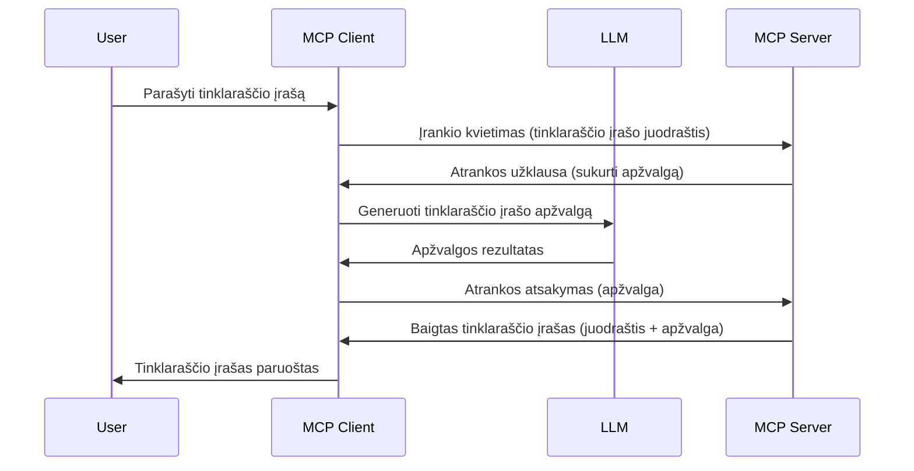

# Imties gavimas – funkcijų delegavimas klientui

Kartais reikia, kad MCP klientas ir MCP serveris bendradarbiautų siekdami bendro tikslo. Gali būti atvejis, kai serveriui reikia dirbtinio intelekto modelio, kuris yra kliente. Tokiu atveju imties gavimas yra tai, ką reikėtų naudoti.

Aptarkime keletą naudojimo atvejų ir kaip sukurti sprendimą, apimantį imties gavimą.

## Apžvalga

Šiame pamokoje sutelksime dėmesį į paaiškinimą, kada ir kur naudoti imties gavimą bei kaip jį konfigūruoti.

## Mokymosi tikslai

Šiame skyriuje mes:

- Paaiškinsime, kas yra imties gavimas ir kada jį naudoti.
- Parodysime, kaip konfigūruoti imties gavimą MCP.
- Pateiksime pavyzdžių, kaip veikia imties gavimas.

## Kas yra imties gavimas ir kodėl jį naudoti?

Imties gavimas yra pažangi funkcija, kuri veikia taip:


### Imties gavimo užklausa

Gerai, dabar turime plačią patikimo scenarijaus apžvalgą, pakalbėkime apie imties gavimo užklausą, kurią serveris siunčia klientui. Štai kaip tokia užklausa gali atrodyti JSON-RPC formatu:

```json
{
  "jsonrpc": "2.0",
  "id": 1,
  "method": "sampling/createMessage",
  "params": {
    "messages": [
      {
        "role": "user",
        "content": {
          "type": "text",
          "text": "Create a blog post summary of the following blog post: <BLOG POST>"
        }
      }
    ],
    "modelPreferences": {
      "hints": [
        {
          "name": "claude-3-sonnet"
        }
      ],
      "intelligencePriority": 0.8,
      "speedPriority": 0.5
    },
    "systemPrompt": "You are a helpful assistant.",
    "maxTokens": 100
  }
}
```

Čia verta atkreipti dėmesį į keletą dalykų:

- Promptas, esančioje content -> text, yra mūsų prašymas, instrukcija LLM suvesti tinklaraščio įrašo turinį.
- **modelPreferences**. Ši dalis yra tiesiog pageidavimas, rekomendacija dėl to, kokią LLM konfigūraciją naudoti. Vartotojas gali pasirinkti laikytis šių rekomendacijų arba jas keisti. Šiuo atveju yra rekomendacijos dėl modelio, greičio ir intelekto prioritetų.
- **systemPrompt**, tai jūsų įprastas sisteminis promptas, suteikiantis LLM asmenybę ir apimantis vadovavimo instrukcijas.
- **maxTokens**, tai dar viena savybė, nurodanti, kiek žetonų rekomenduojama naudoti šiai užduočiai.

### Imties gavimo atsakymas

Šį atsakymą MCP klientas siunčia atgal MCP serveriui – tai kliento kvietimo LLM rezultatas, palaukęs atsakymo ir sudaręs šį pranešimą. Štai kaip jis gali atrodyti JSON-RPC formatu:

```json
{
  "jsonrpc": "2.0",
  "id": 1,
  "result": {
    "role": "assistant",
    "content": {
      "type": "text",
      "text": "Here's your abstract <ABSTRACT>"
    },
    "model": "gpt-5",
    "stopReason": "endTurn"
  }
}
```

Atkreipkite dėmesį, kad atsakymas yra tinklaraščio įrašo santrauka, kaip ir prašėme. Taip pat pastebėkite, kad naudotas modelis nėra tas, kurį prašėme, o „gpt-5“ vietoje „claude-3-sonnet“. Tai iliustruoja, kad vartotojas gali pakeisti nuomonę dėl naudojamo modelio, o jūsų imties užklausa yra rekomendacija.

Gerai, dabar, kai suprantame pagrindinį procesą ir naudingą užduotį „tinklaraščio įrašo kūrimas + santrauka“, pažvelkime, ką reikia padaryti, kad tai veiktų.

### Pranešimų tipai

Imties gavimo pranešimai nėra apriboti tik tekstu; taip pat galite siųsti vaizdus ir garsą. Štai kaip JSON-RPC atrodo skirtingai:

**Teksto**

```json
{
  "type": "text",
  "text": "The message content"
}
```

**Vaizdo turinys**

```json
{
  "type": "image",
  "data": "base64-encoded-image-data",
  "mimeType": "image/jpeg"
}
```

**Garso turinys**

```json
{
  "type": "audio",
  "data": "base64-encoded-audio-data",
  "mimeType": "audio/wav"
}
```

> NOTE: daugiau informacijos apie Imties gavimą rasite [oficialiuose dokumentuose](https://modelcontextprotocol.io/specification/2025-06-18/client/sampling)

## Kaip konfigūruoti imties gavimą kliente

> Pastaba: jei kuriate tik serverį, čia daug ko daryti nereikia.

Kliente reikia nurodyti tokią funkciją taip:

```json
{
  "capabilities": {
    "sampling": {}
  }
}
```

Tai bus naudojama, når pasirinktas klientas jungiasi prie serverio.

## Pavyzdys: imties gavimas veiksme – kurkite tinklaraščio įrašą

Parašykime kartu imties gavimo serverį, turi būti:

1. Sukurti įrankį serveryje.
2. Šis įrankis turi sukurti imties gavimo užklausą.
3. Įrankis turi laukti, kol klientas atsakys į užklausą.
4. Tada turi būti pateiktas įrankio rezultatas.

Pažiūrėkime kodą žingsnis po žingsnio:

### -1- Sukurkite įrankį

**python**

```python
@mcp.tool()
async def create_blog(title: str, content: str, ctx: Context[ServerSession, None]) -> str:
    """Create a blog post and generate a summary"""

```

### -2- Sukurkite imties gavimo užklausą

Išplėskite įrankį tokiu kodu:

**python**

```python
post = BlogPost(
        id=len(posts) + 1,
        title=title,
        content=content,
        abstract=""
    )

prompt = f"Create an abstract of the following blog post: title: {title} and draft: {content} "

result = await ctx.session.create_message(
        messages=[
            SamplingMessage(
                role="user",
                content=TextContent(type="text", text=prompt),
            )
        ],
        max_tokens=100,
)

```

### -3- Palaukite atsakymo ir grąžinkite jį

**python**

```python
post.abstract = result.content.text

posts.append(post)

# grąžina visą produktą
return json.dumps({
    "id": post.title,
    "abstract": post.abstract
})
```

### -4- Pilnas kodas

**python**

```python
from starlette.applications import Starlette
from starlette.routing import Mount, Host

from mcp.server.fastmcp import Context, FastMCP

from mcp.server.session import ServerSession
from mcp.types import SamplingMessage, TextContent

import json


from uuid import uuid4
from typing import List
from pydantic import BaseModel


mcp = FastMCP("Blog post generator")

# app = FastAPI()

posts = []

class BlogPost(BaseModel):
    id: int
    title: str
    content: str
    abstract: str

posts: List[BlogPost] = []

@mcp.tool()
async def create_blog(title: str, content: str, ctx: Context[ServerSession, None]) -> str:
    """Create a blog post and generate a summary"""

    post = BlogPost(
        id=len(posts) + 1,
        title=title,
        content=content,
        abstract=""
    )

    prompt = f"Create an abstract of the following blog post: title: {title} and draft: {content} "

    result = await ctx.session.create_message(
        messages=[
            SamplingMessage(
                role="user",
                content=TextContent(type="text", text=prompt),
            )
        ],
        max_tokens=100,
    )

    post.abstract = result.content.text

    posts.append(post)

    # grąžina pilną tinklaraščio įrašą
    return json.dumps({
        "id": post.title,
        "abstract": post.abstract
    })

if __name__ == "__main__":
    print("Starting server...")
    # mcp.run()
    mcp.run(transport="streamable-http")

# paleiskite programą su: python server.py
```

### -5- Testavimas Visual Studio Code aplinkoje

Norėdami tai išbandyti Visual Studio Code, atlikite šiuos veiksmus:

1. Paleiskite serverį terminale
1. Pridėkite jį į *mcp.json* (ir įsitikinkite, kad serveris veikia), pvz., taip:

   ```json
   "servers": {
      "blog-server": {
        "type": "http",
        "url": "http://localhost:8000/mcp"
      }
   }
   ```

1. Įveskite promptą:

   ```text
   create a blog post named "Where Python comes from", the content is "Python is actually named after Monty Python Flying Circus"
   ```

1. Leiskite vykti imties gavimui. Pirmą kartą išbandydami pamatysite papildomą dialogą, kurį turėsite patvirtinti, tuomet matysite įprastą dialogą, prašantį paleisti įrankį.

1. Patikrinkite rezultatus. Matysite rezultatus gražiai pateiktus GitHub Copilot Chat lange, bet taip pat galėsite peržiūrėti žalią JSON atsakymą.

**Papildymas**. Visual Studio Code įrankiai puikiai palaiko imties gavimą. Galite konfigūruoti imties gavimo prieigą jūsų įdiegtiems serveriams taip:

1. Eikite į plėtinių skyrių.
1. Pasirinkite krumpliaratį prie savo įdiegto serverio „MCP SERVERS - INSTALLED“ skiltyje.
1. Pasirinkite „Configure Model Access“, čia galite pasirinkti, kokiais modeliais GitHub Copilot gali naudotis atliekant imties gavimą. Taip pat galite matyti visus neseniai įvykusius imties užklausimus pasirinkę „Show Sampling requests“.

## Užduotis

Šioje užduotyje jums reikės sukurti kiek kitokį imties gavimą – integraciją, kuri generuoja produkto aprašymą. Štai jūsų scenarijus:

**Scenarijus**: Elektroninės prekybos darbuotojui labai užtrunka kurti produktų aprašymus. Todėl turite sukurti sprendimą, kuriame galite iškviesti įrankį „create_product“ su argumentais „title“ ir „keywords“, ir jis turi sugeneruoti visą produktą, įskaitant lauką „description“, kuris užpildomas kliento LLM.

Patarimas: naudokite ankstesnėje dalyje įgytas žinias kuriant šį serverį ir jo įrankį, naudodami imties gavimo užklausą.

## Sprendimas

[Sprendimas](./solution/README.md)

## Svarbiausios įžvalgos

Imties gavimas yra galinga funkcija, leidžianti serveriui deleguoti užduotis klientui, kai reikalinga LLM pagalba.

## Kas toliau

- [4 skyrius – praktinė realizacija](../../04-PracticalImplementation/README.md)

---

<!-- CO-OP TRANSLATOR DISCLAIMER START -->
**Atsakomybės apribojimas**:  
Šis dokumentas buvo išverstas naudojant AI vertimo paslaugą [Co-op Translator](https://github.com/Azure/co-op-translator). Stengiamės užtikrinti tikslumą, tačiau atkreipkite dėmesį, kad automatiniai vertimai gali turėti klaidų arba netikslumų. Originalus dokumentas jo gimtąja kalba turi būti laikomas autoritetingu šaltiniu. Svarbiai informacijai rekomenduojamas profesionalus žmogaus vertimas. Mes neatsakome už jokius nesusipratimus ar klaidingą interpretavimą, kilusį naudojant šį vertimą.
<!-- CO-OP TRANSLATOR DISCLAIMER END -->