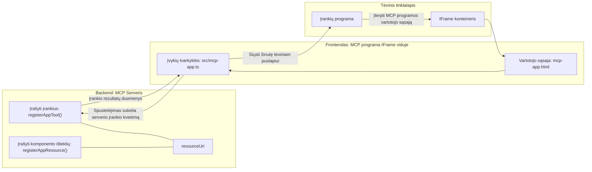

# MCP Programėlės

MCP Programėlės yra naujas MCP požiūris. Idėja ta, kad ne tik grąžini duomenis iš įrankio kvietimo, bet ir pateiki informaciją, kaip su šia informacija turėtų būti sąveikaujama. Tai reiškia, kad įrankių rezultatai dabar gali turėti naudotojo sąsajos informaciją. Kodėl to norėtume? Na, pažiūrėkime, kaip tu tai darai šiandien. Tikriausiai naudoji kažkokį priekį, kad vartotum MCP Serverio rezultatus – tai kodas, kurį turi rašyti ir prižiūrėti. Kartais tai yra norima, bet kartais būtų puiku tik atsivežti savarankišką informacijos fragmentą, kuriame būtų viskas nuo duomenų iki naudotojo sąsajos.

## Apžvalga

Ši pamoka suteikia praktinių nurodymų apie MCP Programėles, kaip pradėti su jomis dirbti ir kaip integruoti jas į esamas internetines programas. MCP Programėlės yra labai naujas MCP Standarto papildymas.

## Mokymosi tikslai

Pamokos pabaigoje tu galėsi:

- Paaiškinti, kas yra MCP Programėlės.
- Kada naudoti MCP Programėles.
- Kurti ir integruoti savo MCP Programėles.

## MCP Programėlės – kaip tai veikia

Idėja su MCP Programėlėmis yra pateikti atsakymą, kuris iš esmės yra komponentas, skirtas renderinti. Toks komponentas gali turėti tiek vizualizacijas, tiek interaktyvumą, pavyzdžiui, mygtukų paspaudimus, vartotojo įvestį ir daugiau. Pradėkime nuo serverio pusės ir mūsų MCP Serverio. Norėdamas sukurti MCP Programėlės komponentą, turi sukurti įrankį, bet ir programėlės resursą. Šios dvi dalys sujungiamos per resourceUri.

Štai pavyzdys. Pabandykime vizualizuoti, kas įeina ir ką atlieka kurios dalys:

```text
server.ts -- responsible for registering tools and the component as a UI component
src/
  mcp-app.ts -- wiring up event handlers
mcp-app.html -- the user interface
```

Šis vaizdas aprašo komponento kūrimo architektūrą ir jo logiką.


Pabandykime aprašyti atsakomybes atitinkamai backend ir frontend pusėse.

### Backend'as

Čia turime įvykdyti dvi užduotis:

- Užregistruoti įrankius, su kuriais norime sąveikauti.
- Apibrėžti komponentą.

**Įrankio registravimas**

```typescript
registerAppTool(
    server,
    "get-time",
    {
      title: "Get Time",
      description: "Returns the current server time.",
      inputSchema: {},
      _meta: { ui: { resourceUri } }, // Susieja šį įrankį su jo UI resursu
    },
    async () => {
      const time = new Date().toISOString();
      return { content: [{ type: "text", text: time }] };
    },
  );

```

Aukščiau pateiktas kodas aprašo elgesį, kai atskleidžiamas įrankis pavadinimu `get-time`. Jis neturi įvesties, bet grąžina esamą laiką. Turime galimybę apibrėžti `inputSchema` įrankiams, kur reikia priimti vartotojo įvestį.

**Komponento registravimas**

Ta pati faile, taip pat turime užregistruoti komponentą:

```typescript
const resourceUri = "ui://get-time/mcp-app.html";

// Užregistruokite resursą, kuris grąžina sujungtą HTML/JavaScript vartotojo sąsajai.
registerAppResource(
  server,
  resourceUri,
  resourceUri,
  { mimeType: RESOURCE_MIME_TYPE },
  async () => {
    const html = await fs.readFile(path.join(DIST_DIR, "mcp-app.html"), "utf-8");

    return {
    contents: [
        { uri: resourceUri, mimeType: RESOURCE_MIME_TYPE, text: html },
    ],
    };
  },
);
```

Atkreipk dėmesį į `resourceUri`, kuri sujungia komponentą su jo įrankiais. Įdomu yra ir callback funkcija, kur įkeliame UI failą ir grąžiname komponentą.

### Komponento frontend'as

Kaip ir backend'e, yra dvi dalys:

- Frontend'as parašytas grynai HTML kalba.
- Kodas, kuris apdoroja įvykius ir sprendžia, ką daryti - pavyzdžiui, kviesti įrankius ar siųsti žinutes tėvinio lango atžvilgiu.

**Naudotojo sąsaja**

Pažiūrėkime į naudotojo sąsają.

```html
<!-- mcp-app.html -->
<!DOCTYPE html>
<html lang="en">
  <head>
    <meta charset="UTF-8" />
    <title>Get Time App</title>
  </head>
  <body>
    <p>
      <strong>Server Time:</strong> <code id="server-time">Loading...</code>
    </p>
    <button id="get-time-btn">Get Server Time</button>
    <script type="module" src="/src/mcp-app.ts"></script>
  </body>
</html>
```

**Įvykių prijungimas**

Paskutinė dalis yra įvykių prijungimas. Tai reiškia, kad identifikuojame, kuri naudotojo sąsajos dalis privalo turėti įvykių apdorojimą ir ką daryti, kai įvykiai kyla:

```typescript
// mcp-app.ts

import { App } from "@modelcontextprotocol/ext-apps";

// Gauti elemento nuorodas
const serverTimeEl = document.getElementById("server-time")!;
const getTimeBtn = document.getElementById("get-time-btn")!;

// Sukurti programos egzempliorių
const app = new App({ name: "Get Time App", version: "1.0.0" });

// Apdoroti įrankio rezultatus iš serverio. Nustatykite prieš `app.connect()`, kad būtų išvengta
// pradinio įrankio rezultato praleidimo.
app.ontoolresult = (result) => {
  const time = result.content?.find((c) => c.type === "text")?.text;
  serverTimeEl.textContent = time ?? "[ERROR]";
};

// Prijungti mygtuko paspaudimą
getTimeBtn.addEventListener("click", async () => {
  // `app.callServerTool()` leidžia vartotojo sąsajai prašyti naujų duomenų iš serverio
  const result = await app.callServerTool({ name: "get-time", arguments: {} });
  const time = result.content?.find((c) => c.type === "text")?.text;
  serverTimeEl.textContent = time ?? "[ERROR]";
});

// Prisijungti prie šeimininko
app.connect();
```

Kaip matyti iš aukščiau pateikto kodo, tai yra įprasta DOM elementų prijungimo prie įvykių tvarka. Verta paminėti kvietimą `callServerTool`, kuris galiausiai kviečia įrankį backend'e.

## Darbas su vartotojo įvestimi

Iki šiol matėme komponentą, kuriame mygtuko paspaudimas kviečia įrankį. Pažiūrėkime, ar galime pridėti daugiau naudotojo sąsajos elementų, pavyzdžiui, įvesties lauką, ir ar galime perduoti argumentus įrankiui. Įgyvendinkime DUK funkcionalumą. Štai kaip tai turėtų veikti:

- Turėtų būti mygtukas ir įvesties elementas, į kurį vartotojas įrašo raktažodį paieškai, pavyzdžiui, "Shipping". Tai turėtų kviesti įrankį backend'e, kuris atliktų paiešką DUK duomenyse.
- Įrankis, palaikantis minėtą DUK paiešką.

Pirmiausia pridėkime reikalingą palaikymą backend'e:

```typescript
const faq: { [key: string]: string } = {
    "shipping": "Our standard shipping time is 3-5 business days.",
    "return policy": "You can return any item within 30 days of purchase.",
    "warranty": "All products come with a 1-year warranty covering manufacturing defects.",
  }

registerAppTool(
    server,
    "get-faq",
    {
      title: "Search FAQ",
      description: "Searches the FAQ for relevant answers.",
      inputSchema: zod.object({
        query: zod.string().default("shipping"),
      }),
      _meta: { ui: { resourceUri: faqResourceUri } }, // Susieja šį įrankį su jo vartotojo sąsajos resursu
    },
    async ({ query }) => {
      const answer: string = faq[query.toLowerCase()] || "Sorry, I don't have an answer for that.";
      return { content: [{ type: "text", text: answer }] };
    },
  );
```

Čia matome, kaip užpildome `inputSchema` ir suteikiame jam `zod` schemą tokiu būdu:

```typescript
inputSchema: zod.object({
  query: zod.string().default("shipping"),
})
```

Aukščiau schemoje deklaruojame, kad turime įvesties parametrą pavadinimu `query`, kuris yra neprivalomas ir turi numatytą reikšmę "shipping".

Gerai, pereikime prie *mcp-app.html* ir pažiūrėkime, kokią sąsają turime sukurti:

```html
<div class="faq">
    <h1>FAQ response</h1>
    <p>FAQ Response: <code id="faq-response">Loading...</code></p>
    <input type="text" id="faq-query" placeholder="Enter FAQ query" />
    <button id="get-faq-btn">Get FAQ Response</button>
  </div>
```

Puiku, dabar turime įvesties elementą ir mygtuką. Eime prie *mcp-app.ts* prijungti šiuos įvykius:

```typescript
const getFaqBtn = document.getElementById("get-faq-btn")!;
const faqQueryInput = document.getElementById("faq-query") as HTMLInputElement;

getFaqBtn.addEventListener("click", async () => {
  const query = faqQueryInput.value;
  const result = await app.callServerTool({ name: "get-faq", arguments: { query } });
  const faq = result.content?.find((c) => c.type === "text")?.text;
  faqResponseEl.textContent = faq ?? "[ERROR]";
});
```

Aukščiau esančiame kode mes:

- Kuriame nuorodas į interaktyvius UI elementus.
- Apdorojame mygtuko paspaudimą: nuskaityti įvesties elementą ir kviečiame `app.callServerTool()` su `name` ir `arguments`, kuriuose argumentai perduoda `query` reikšmę.

Kas vyksta kai kviečiama `callServerTool` - tai siunčiama žinutė tėviniam langui, o tas langas galiausiai kviečia MCP Serverį.

### Išbandykite tai

Išbandę turėtume matyti kažką panašaus:


o štai pavyzdys su įvestimi kaip "warranty":


Norėdami paleisti šį kodą, eikite į [Kodo skyrių](./code/README.md)

## Testavimas Visual Studio Code

Visual Studio Code puikiai palaiko MCP Programėles ir yra vienas iš paprasčiausių būdų jas testuoti. Norėdami naudoti Visual Studio Code, pridėkite serverio įrašą į *mcp.json* tokiu būdu:

```json
"my-mcp-server-7178eca7": {
    "url": "http://localhost:3001/mcp",
    "type": "http"
  }
```

Tuomet paleiskite serverį, turėtumėte galėti bendrauti su savo MCP Programėle per Pokalbių Langą, jei turite įdiegę GitHub Copilot.

Jį galima iškviesti per užklausą, pavyzdžiui "#get-faq":


Ir, kaip kai paleidote per naršyklę, ji atvaizduojama taip pat:


## Užduotis

Sukurkite akmens, popieriaus, žirklių žaidimą. Jame turėtų būti:

UI:

- Išskleidžiamas sąrašas su pasirinkimais
- Mygtukas, skirtas pateikti pasirinkimą
- Žymė, rodanti, kas ką pasirinko ir kas laimėjo

Serverio pusė:

- Įrankis rock paper scissor, kuris priima "choice" kaip įvestį. Jis taip pat turėtų sugeneruoti kompiuterio pasirinkimą ir nustatyti laimėtoją

## Sprendimas

[Sprendimas](./assignment/README.md)

## Apibendrinimas

Sužinojome apie naują MCP Programėlių paradigmą. Tai naujas požiūris, leidžiantis MCP Serveriams turėti nuomonę ne tik apie duomenis, bet ir apie tai, kaip tie duomenys turi būti pateikiami.

Be to, sužinojome, kad šios MCP Programėlės yra talpinamos iFrame'e ir kad bendraudamos su MCP Serveriais jos turi siųsti žinutes tėviniam interneto programėlei. Yra keletas bibliotekų tiek grynam JavaScript, tiek React ir kitoms, kurios palengvina šią komunikaciją.

## Svarbiausios mintys

Štai ką išmokote:

- MCP Programėlės yra naujas standartas, naudingas, kai norite siųsti tiek duomenis, tiek naudotojo sąsajos funkcijas.
- Tokios programėlės dėl saugumo veikia iFrame'e.

## Kas toliau

- [4 skyrius](../../04-PracticalImplementation/README.md)

---

<!-- CO-OP TRANSLATOR DISCLAIMER START -->
**Atsakomybės apribojimas**:  
Šis dokumentas buvo išverstas naudojant dirbtinio intelekto vertimo paslaugą [Co-op Translator](https://github.com/Azure/co-op-translator). Nors stengiamės užtikrinti tikslumą, prašome atkreipti dėmesį, kad automatiniai vertimai gali turėti klaidų ar netikslumų. Pirminis dokumentas gimtąja kalba turi būti laikomas autoritetingu šaltiniu. Svarbiai informacijai rekomenduojamas profesionalus žmogaus vertimas. Mes neatskaitingi už bet kokius nesusipratimus ar neteisingus aiškinimus, kylančius naudojant šį vertimą.
<!-- CO-OP TRANSLATOR DISCLAIMER END -->