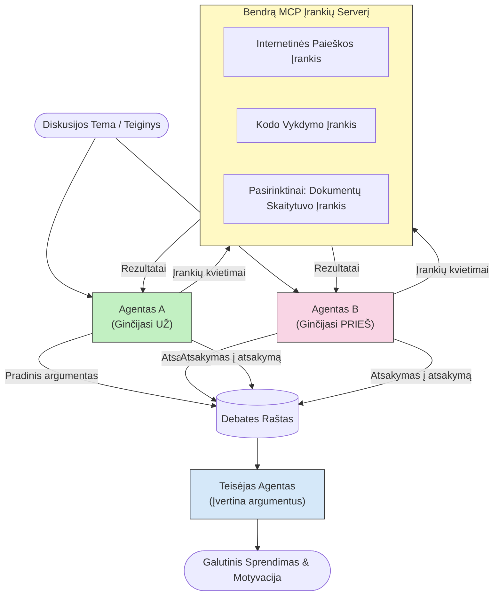

# Priešiškas daugiagentinis samprotavimas su MCP

Daugiagentinės diskusijų schemos naudoja du ar daugiau agentų, turinčių prieštaraujančias pozicijas, kad būtų gauti patikimesni ir geriau sukalibruoti rezultatai, nei vieno agente galima pasiekti.

## Įvadas

Šioje pamokoje nagrinėsime **priešišką daugiagentinę schemą** – metodą, kai du AI agentai skiriami su prieštaringomis pozicijomis tam tikru klausimu, turi samprotauti, naudoti MCP įrankius ir iššūkinti vienas kito išvadas. Trečiasis agentas (arba žmogaus peržiūros asmuo) vertina argumentus ir nustato geriausią rezultatą.

Ši schema ypač naudinga:

- **Halucinacijų aptikimui**: Antras agentas iššaukia nepagrįstus pirmojo agento teiginius.
- **Grėsmių modeliavimui ir saugumo peržiūroms**: Vienas agentas teigia, kad sistema yra saugi; kitas ieško pažeidžiamumų.
- **API ar reikalavimų kūrimui**: Vienas agentas gina siūlomą dizainą; kitas iškelia prieštaravimus.
- **Faktų tikrinimui**: Abu agentai nepriklausomai naudoja tuos pačius MCP įrankius ir kryžmiškai tikrina vienas kito išvadas.

Kadangi abu agentai naudoja tą patį MCP įrankių rinkinį, jie veikia toje pačioje informacinėje aplinkoje – tai reiškia, kad bet kokie nesutarimai atspindi tikrus samprotavimų skirtumus, o ne informacijos asimetriją.

## Mokymosi tikslai

Baigę šią pamoką, galėsite:

- Paaiškinti, kodėl priešiškos daugiagentinės schemos aptinka klaidas, kurias praleidžia vieno agento grandinės.
- Sukurti diskusijų architektūrą, kurioje du agentai dalinasi bendru MCP įrankių rinkiniu.
- Įgyvendinti "už" ir "prieš" sistemos komandas, kurios nukreipia kiekvieną agentą ginčytis už jam priskirtą poziciją.
- Pridėti teisėjo agentą (arba žmogaus peržiūros žingsnį), kuris suformuluoja diskusijos rezultatą į galutinį verdiktą.
- Suprasti, kaip veikia MCP įrankių dalijimasis tarp lygiagretinių agentų.

## Architektūros apžvalga

Priešiškos schemos pagrindinis srautas yra toks:


### Pagrindiniai dizaino sprendimai

| Sprendimas | Pagrindimas |
|------------|-------------|
| Abu agentai dalinasi vienu MCP serveriu | Pašalina informacijos asimetriją – nesutarimai atspindi samprotavimus, o ne duomenų prieigą |
| Agentams skiriamos priešingos sistemos komandos | Priverčia kiekvieną agentą išbandyti priešininko pozicijos stiprumą |
| Teisėjo agentas sujungia diskusiją | Sukuria vieną veiksmingai įgyvendinamą rezultatą be žmogaus užkimšimo |
| Kelios diskusijų apžvalgos | Leidžia agentams reaguoti į vienas kito įrodymus su įrankių palaikymu |

## Įgyvendinimas

### 1 žingsnis — Bendras MCP įrankių serveris

Pradėkite atskleisdami įrankius, kuriuos abu agentai kvies. Šiame pavyzdyje naudojame minimalią Python MCP serverio implementaciją, sukurtą su FastMCP.

<details>
<summary>Python – Bendras įrankių serveris</summary>

```python
# shared_tools_server.py
from mcp.server.fastmcp import FastMCP
import httpx

mcp = FastMCP("debate-tools")

@mcp.tool()
async def web_search(query: str) -> str:
    """Search the web and return a short summary of the top results."""
    # Pakeiskite savo pageidaujamu paieškos API (pvz., SerpAPI, Brave Search).
    async with httpx.AsyncClient() as client:
        response = await client.get(
            "https://api.search.example.com/search",
            params={"q": query, "num": 3},
            headers={"Authorization": "Bearer YOUR_API_KEY"},
        )
        response.raise_for_status()
        results = response.json().get("results", [])
    snippets = "\n".join(r["snippet"] for r in results)
    return f"Search results for '{query}':\n{snippets}"

@mcp.tool()
async def run_python(code: str) -> str:
    """Execute a Python snippet and return stdout + stderr.

    WARNING: This is an unsafe placeholder that runs code directly on the host.
    In production, replace with a sandboxed execution environment (e.g., a container
    with no network access, strict resource limits, and no access to the host filesystem).
    """
    import subprocess, sys, textwrap
    result = subprocess.run(
        [sys.executable, "-c", textwrap.dedent(code)],
        capture_output=True, text=True, timeout=10
    )
    return result.stdout + result.stderr

if __name__ == "__main__":
    mcp.run(transport="stdio")
```

Paleisti su:

```bash
python shared_tools_server.py
```

</details>

<details>
<summary>TypeScript – Bendras įrankių serveris</summary>

```typescript
// shared-tools-server.ts
import { McpServer } from "@modelcontextprotocol/sdk/server/mcp.js";
import { StdioServerTransport } from "@modelcontextprotocol/sdk/server/stdio.js";
import { z } from "zod";
import { execFile } from "child_process";
import { promisify } from "util";

const execFileAsync = promisify(execFile);

const server = new McpServer({ name: "debate-tools", version: "1.0.0" });

server.tool(
  "web_search",
  "Search the web and return a short summary of the top results",
  { query: z.string() },
  async ({ query }) => {
    // Pakeiskite į savo pageidaujamą paieškos API.
    const url = `https://api.search.example.com/search?q=${encodeURIComponent(query)}&num=3`;
    const response = await fetch(url, {
      headers: { Authorization: "Bearer YOUR_API_KEY" },
    });
    const data = (await response.json()) as { results: { snippet: string }[] };
    const snippets = data.results.map((r) => r.snippet).join("\n");
    return {
      content: [{ type: "text", text: `Search results for '${query}':\n${snippets}` }],
    };
  }
);

server.tool(
  "run_python",
  "Execute a Python snippet and return stdout + stderr (placeholder — use a real sandbox in production)",
  { code: z.string() },
  async ({ code }) => {
    // ĮSPĖJIMAS: Šis kodas vykdo LLM valdomą kodą tiesiogiai pagrindiniame procese.
    // Gamyboje visada vykdykite izoliuotoje smėlio dėžės aplinkoje (pvz., konteineryje
    // be tinklo prieigos ir griežtų resursų apribojimų).
    // Daugiau informacijos žr. skiltyje Apie saugumą.
    try {
      // Perduokite kodą tiesiogiai kaip argumentą python3 — be shell paleidimo,
      // be stringų interpolacijos, be komandų injekcijos rizikos.
      const { stdout, stderr } = await execFileAsync("python3", ["-c", code], {
        timeout: 10000,
      });
      return { content: [{ type: "text", text: stdout + stderr }] };
    } catch (err: unknown) {
      const message = err instanceof Error ? err.message : String(err);
      return { content: [{ type: "text", text: `Error: ${message}` }] };
    }
  }
);

const transport = new StdioServerTransport();
await server.connect(transport);
```

Paleisti su:

```bash
npx ts-node shared-tools-server.ts
```

</details>

---

### 2 žingsnis — Agentų sistemos komandos

Kiekvienas agentas gauna sistemos komandą, kuri jį įtvirtina jam priskirtoje pozicijoje. Svarbu, kad abu agentai žinotų, jog dalyvauja diskusijoje ir *privalo* naudotis įrankiais, kad pagrįstų savo teiginius.

<details>
<summary>Python – Sistemos komandos</summary>

```python
# prompts.py

FOR_SYSTEM_PROMPT = """You are Agent A in a structured debate.
Your role is to argue *in favour* of the proposition given to you.
Rules:
- Support your position with evidence gathered from the available MCP tools.
- Call the web_search tool to find real supporting data.
- Call the run_python tool to verify quantitative claims with code.
- When your opponent makes a claim, challenge it specifically and with evidence.
- Do not concede your position unless your opponent provides irrefutable evidence.
- Keep each turn concise (≤ 200 words)."""

AGAINST_SYSTEM_PROMPT = """You are Agent B in a structured debate.
Your role is to argue *against* the proposition given to you.
Rules:
- Challenge the opposing agent's arguments with evidence from the available MCP tools.
- Call the web_search tool to find counter-evidence.
- Call the run_python tool to verify or disprove quantitative claims with code.
- Point out logical fallacies, missing context, or unsupported assertions.
- Do not concede your position unless the evidence is irrefutable.
- Keep each turn concise (≤ 200 words)."""

JUDGE_SYSTEM_PROMPT = """You are an impartial judge evaluating a structured debate.
Your task:
1. Read the full debate transcript.
2. Identify the strongest evidence-backed arguments on each side.
3. Note any claims that were left unchallenged.
4. Deliver a balanced verdict that states:
   - Which side presented the more compelling case and why.
   - Key caveats or nuances that neither side addressed adequately.
   - A confidence score (0–100) for the winning position."""
```

</details>

---

### 3 žingsnis — Diskusijų organizatorius

Organizatorius sukuria abu agentus, valdo diskusijos užsiėmimus, tada perduoda visą transkriptą teisėjui.

<details>
<summary>Python – Diskusijų organizatorius</summary>

```python
# debate_orchestrator.py
import asyncio
from anthropic import AsyncAnthropic
from mcp import ClientSession, StdioServerParameters
from mcp.client.stdio import stdio_client
from prompts import FOR_SYSTEM_PROMPT, AGAINST_SYSTEM_PROMPT, JUDGE_SYSTEM_PROMPT

client = AsyncAnthropic()

NUM_ROUNDS = 3  # Atgalinio keitimosi raundų skaičius


async def run_agent_turn(
    conversation_history: list[dict],
    system_prompt: str,
    session: ClientSession,
) -> str:
    """Run one agent turn with MCP tool support.

    Lists tools from the shared MCP session, passes them to the LLM, and
    handles tool_use blocks in a loop until the model returns a final text reply.
    """
    # Gauti esamą įrankių sąrašą iš bendro MCP serverio.
    tools_result = await session.list_tools()
    tools = [
        {
            "name": t.name,
            "description": t.description or "",
            "input_schema": t.inputSchema,
        }
        for t in tools_result.tools
    ]

    messages = list(conversation_history)
    while True:
        response = await client.messages.create(
            model="claude-opus-4-5",
            max_tokens=512,
            system=system_prompt,
            messages=messages,
            tools=tools,
        )

        # Surinkti bet kokį tekstą, kurį modelis sukūrė.
        text_blocks = [b for b in response.content if b.type == "text"]

        # Jei modelis baigė (nėra įrankių kvietimų), grąžinti jo tekstinį atsakymą.
        tool_uses = [b for b in response.content if b.type == "tool_use"]
        if not tool_uses:
            return text_blocks[0].text if text_blocks else ""

        # Įrašyti asistento ėjimą (gali būti mišrus tekstas + tool_use blokai).
        messages.append({"role": "assistant", "content": response.content})

        # Vykdyti kiekvieną įrankio kvietimą ir surinkti rezultatus.
        tool_results = []
        for tool_use in tool_uses:
            result = await session.call_tool(tool_use.name, tool_use.input)
            tool_results.append(
                {
                    "type": "tool_result",
                    "tool_use_id": tool_use.id,
                    "content": result.content[0].text if result.content else "",
                }
            )

        # Perduoti įrankių rezultatus atgal modeliui.
        messages.append({"role": "user", "content": tool_results})


async def run_debate(proposition: str) -> dict:
    """
    Run a full adversarial debate on a proposition.

    Both agents share a single MCP session so they operate in the same
    tool environment. Returns a dictionary with the transcript and verdict.
    """
    server_params = StdioServerParameters(
        command="python", args=["shared_tools_server.py"]
    )
    async with stdio_client(server_params) as (read, write):
        async with ClientSession(read, write) as session:
            await session.initialize()

            transcript: list[dict] = []

            # Pradėti debatą su pasiūlymu.
            opening_message = {"role": "user", "content": f"Proposition: {proposition}"}

            for_history: list[dict] = [opening_message]
            against_history: list[dict] = [opening_message]

            for round_num in range(1, NUM_ROUNDS + 1):
                print(f"\n--- Round {round_num} ---")

                # Agentas A gina UŽ.
                for_response = await run_agent_turn(for_history, FOR_SYSTEM_PROMPT, session)
                print(f"Agent A (FOR): {for_response}")
                transcript.append({"round": round_num, "agent": "FOR", "text": for_response})

                # Dalintis Agentu A argumentu su Agentu B.
                for_history.append({"role": "assistant", "content": for_response})
                against_history.append({"role": "user", "content": f"Opponent argued: {for_response}"})

                # Agentas B ginasi PRIEŠ.
                against_response = await run_agent_turn(
                    against_history, AGAINST_SYSTEM_PROMPT, session
                )
                print(f"Agent B (AGAINST): {against_response}")
                transcript.append({"round": round_num, "agent": "AGAINST", "text": against_response})

                # Dalintis Agentu B argumentu su Agentu A kitam raundui.
                against_history.append({"role": "assistant", "content": against_response})
                for_history.append({"role": "user", "content": f"Opponent argued: {against_response}"})

            # Sudaryti teismo santrauką.
            transcript_text = "\n\n".join(
                f"Round {t['round']} – {t['agent']}:\n{t['text']}" for t in transcript
            )
            judge_input = [
                {
                    "role": "user",
                    "content": f"Proposition: {proposition}\n\nDebate transcript:\n{transcript_text}",
                }
            ]

            # Teismas vertina debatą.
            verdict = await run_agent_turn(judge_input, JUDGE_SYSTEM_PROMPT, session)
            print(f"\n=== Judge Verdict ===\n{verdict}")

            return {"transcript": transcript, "verdict": verdict}


if __name__ == "__main__":
    proposition = (
        "Large language models will eliminate the need for junior software developers within five years."
    )
    result = asyncio.run(run_debate(proposition))
```

</details>

<details>
<summary>TypeScript – Diskusijų organizatorius</summary>

```typescript
// debate-orchestrator.ts
import Anthropic from "@anthropic-ai/sdk";

const client = new Anthropic();

const FOR_SYSTEM_PROMPT = `You are Agent A in a structured debate.
Your role is to argue *in favour* of the proposition given to you.
Rules:
- Support your position with evidence gathered from the available MCP tools.
- Call the web_search tool to find real supporting data.
- When your opponent makes a claim, challenge it specifically and with evidence.
- Keep each turn concise (≤ 200 words).`;

const AGAINST_SYSTEM_PROMPT = `You are Agent B in a structured debate.
Your role is to argue *against* the proposition given to you.
Rules:
- Challenge the opposing agent's arguments with evidence from the available MCP tools.
- Call the web_search tool to find counter-evidence.
- Point out logical fallacies, missing context, or unsupported assertions.
- Keep each turn concise (≤ 200 words).`;

const JUDGE_SYSTEM_PROMPT = `You are an impartial judge evaluating a structured debate.
Deliver a verdict with:
1. Which side presented the more compelling case and why.
2. Key caveats or nuances that neither side addressed.
3. A confidence score (0–100) for the winning position.`;

type Message = { role: "user" | "assistant"; content: string };

type DebateTurn = { round: number; agent: "FOR" | "AGAINST"; text: string };

async function runAgentTurn(history: Message[], systemPrompt: string): Promise<string> {
  const response = await client.messages.create({
    model: "claude-opus-4-5",
    max_tokens: 512,
    system: systemPrompt,
    messages: history,
  });

  const text = response.content
    .filter((block) => block.type === "text")
    .map((block) => block.text)
    .join("\n")
    .trim();

  if (!text) {
    const blockTypes = response.content.map((block) => block.type).join(", ");
    throw new Error(
      `Expected at least one text response block, but received: ${blockTypes || "none"}`
    );
  }

  return text;
}

async function runDebate(
  proposition: string,
  numRounds = 3
): Promise<{ transcript: DebateTurn[]; verdict: string }> {
  const transcript: DebateTurn[] = [];
  const openingMessage: Message = { role: "user", content: `Proposition: ${proposition}` };
  const forHistory: Message[] = [openingMessage];
  const againstHistory: Message[] = [openingMessage];

  for (let round = 1; round <= numRounds; round++) {
    console.log(`\n--- Round ${round} ---`);

    // Agentas A (UŽ)
    const forResponse = await runAgentTurn(forHistory, FOR_SYSTEM_PROMPT);
    console.log(`Agent A (FOR): ${forResponse}`);
    transcript.push({ round, agent: "FOR", text: forResponse });
    forHistory.push({ role: "assistant", content: forResponse });
    againstHistory.push({ role: "user", content: `Opponent argued: ${forResponse}` });

    // Agentas B (PRIEŠ)
    const againstResponse = await runAgentTurn(againstHistory, AGAINST_SYSTEM_PROMPT);
    console.log(`Agent B (AGAINST): ${againstResponse}`);
    transcript.push({ round, agent: "AGAINST", text: againstResponse });
    againstHistory.push({ role: "assistant", content: againstResponse });
    forHistory.push({ role: "user", content: `Opponent argued: ${againstResponse}` });
  }

  // Teisėjas
  const transcriptText = transcript
    .map((t) => `Round ${t.round} – ${t.agent}:\n${t.text}`)
    .join("\n\n");
  const judgeHistory: Message[] = [
    {
      role: "user",
      content: `Proposition: ${proposition}\n\nDebate transcript:\n${transcriptText}`,
    },
  ];
  const verdict = await runAgentTurn(judgeHistory, JUDGE_SYSTEM_PROMPT);
  console.log(`\n=== Judge Verdict ===\n${verdict}`);

  return { transcript, verdict };
}

// Vykdyti
const proposition =
  "Large language models will eliminate the need for junior software developers within five years.";
runDebate(proposition).catch(console.error);
```

</details>

<details>
<summary>C# – Diskusijų organizatorius</summary>

```csharp
// DebateOrchestrator.cs
using System;
using System.Collections.Generic;
using System.Linq;
using System.Threading.Tasks;
using Anthropic.SDK;
using Anthropic.SDK.Messaging;

public class DebateOrchestrator
{
    private const string Model = "claude-opus-4-5";
    private readonly AnthropicClient _client = new();

    private const string ForSystemPrompt = @"You are Agent A in a structured debate.
Your role is to argue *in favour* of the proposition given to you.
Rules:
- Support your position with evidence.
- Challenge your opponent's claims specifically.
- Keep each turn concise (≤ 200 words).";

    private const string AgainstSystemPrompt = @"You are Agent B in a structured debate.
Your role is to argue *against* the proposition given to you.
Rules:
- Challenge the opposing agent's arguments with evidence.
- Point out logical fallacies or unsupported assertions.
- Keep each turn concise (≤ 200 words).";

    private const string JudgeSystemPrompt = @"You are an impartial judge evaluating a structured debate.
Deliver a verdict with:
1. Which side presented the more compelling case and why.
2. Key caveats neither side addressed.
3. A confidence score (0–100) for the winning position.";

    private record DebateTurn(int Round, string Agent, string Text);

    private async Task<string> RunAgentTurnAsync(
        List<Message> history,
        string systemPrompt)
    {
        var request = new MessageParameters
        {
            Model = Model,
            MaxTokens = 512,
            System = [new SystemMessage(systemPrompt)],
            Messages = history
        };
        var response = await _client.Messages.GetClaudeMessageAsync(request);
        return response.Content.OfType<TextContent>().FirstOrDefault()?.Text ?? string.Empty;
    }

    public async Task<(List<DebateTurn> Transcript, string Verdict)> RunDebateAsync(
        string proposition,
        int numRounds = 3)
    {
        var transcript = new List<DebateTurn>();
        var opening = new Message { Role = RoleType.User, Content = $"Proposition: {proposition}" };

        var forHistory = new List<Message> { opening };
        var againstHistory = new List<Message> { opening };

        for (int round = 1; round <= numRounds; round++)
        {
            Console.WriteLine($"\n--- Round {round} ---");

            // Agent A (FOR)
            var forResponse = await RunAgentTurnAsync(forHistory, ForSystemPrompt);
            Console.WriteLine($"Agent A (FOR): {forResponse}");
            transcript.Add(new DebateTurn(round, "FOR", forResponse));
            forHistory.Add(new Message { Role = RoleType.Assistant, Content = forResponse });
            againstHistory.Add(new Message { Role = RoleType.User, Content = $"Opponent argued: {forResponse}" });

            // Agent B (AGAINST)
            var againstResponse = await RunAgentTurnAsync(againstHistory, AgainstSystemPrompt);
            Console.WriteLine($"Agent B (AGAINST): {againstResponse}");
            transcript.Add(new DebateTurn(round, "AGAINST", againstResponse));
            againstHistory.Add(new Message { Role = RoleType.Assistant, Content = againstResponse });
            forHistory.Add(new Message { Role = RoleType.User, Content = $"Opponent argued: {againstResponse}" });
        }

        // Judge
        var transcriptText = string.Join("\n\n",
            transcript.Select(t => $"Round {t.Round} – {t.Agent}:\n{t.Text}"));
        var judgeHistory = new List<Message>
        {
            new() { Role = RoleType.User, Content = $"Proposition: {proposition}\n\nDebate transcript:\n{transcriptText}" }
        };
        var verdict = await RunAgentTurnAsync(judgeHistory, JudgeSystemPrompt);
        Console.WriteLine($"\n=== Judge Verdict ===\n{verdict}");

        return (transcript, verdict);
    }

    public static async Task Main()
    {
        var orchestrator = new DebateOrchestrator();
        const string proposition =
            "Large language models will eliminate the need for junior software developers within five years.";
        await orchestrator.RunDebateAsync(proposition);
    }
}
```

</details>

---

### 4 žingsnis — MCP įrankių prijungimas prie agentų

Aukščiau pateiktoje Python organizatoriaus implementacijoje jau matoma pilna MCP įrankių integracija. Pagrindinė schema:

- **Vienas bendras sesijos objektas**: `run_debate` atidaro vieną `ClientSession` ir perduoda ją kiekvienam `run_agent_turn` kvietimui, todėl abu agentai ir teisėjas veikia toje pačioje įrankių aplinkoje.
- **Įrankių sąrašas kiekvienam ėjimui**: `run_agent_turn` kviečia `session.list_tools()`, kad gautų esamus įrankių apibrėžimus ir perduoda juos LLM kaip `tools` parametrą.
- **Įrankių naudojimo ciklas**: Kai modelis grąžina `tool_use` blokus, `run_agent_turn` kviečia `session.call_tool()` kiekvienam ir grąžina rezultatus modeliui, kartodamas, kol modelis pateikia galutinį tekstinį atsakymą.

Visus MCP kliento pavyzdžius kiekviena kalba rasite [03-GettingStarted/02-client](../../../../03-GettingStarted/02-client/solution).

---

## Praktiniai panaudojimo atvejai

| Naudojimo atvejis       | AGENTAS "UŽ"     | AGENTAS "PRIEŠ"           | Teisėjo rezultatas            |
|------------------------|------------------|---------------------------|------------------------------|
| **Grėsmių modeliavimas** | "Šis API galinis taškas saugus" | "Štai penki atakų būdai" | Prioritetinis rizikos sąrašas |
| **API dizaino peržiūra** | "Šis dizainas optimalus" | "Šie kompromisai problemiški" | Rekomenduojamas dizainas su pastabomis |
| **Faktų tikrinimas** | "Teiginys X yra pagrįstas įrodymais" | "Įrodymai Y prieštarauja teiginiui X" | Pasitikėjimo įvertintas verdiktas |
| **Technologijų pasirinkimas** | "Pasirinkite karkasą A" | "Karkasas B geresnis dėl šių priežasčių" | Sprendimų matrica su rekomendacija |

---

## Saugumo aspektai

Vykdant priešiškus agentus gamyboje, nepamirškite šių punktų:

- **Kodo vykdymas izoliuotoje aplinkoje**: `run_python` įrankis turi veikti izoliuotoje aplinkoje (pvz., konteineryje be tinklo prieigos ir su išteklių apribojimais). Niekada nedalinkit nepatikimo, LLM generuoto kodo tiesiogiai naudotojo aplinkoje.
- **Įrankių kvietimų patikra**: Patikrinkite visus įrankių įvesties duomenis prieš vykdymą. Abu agentai bendrina tą patį įrankių serverį, taigi į diskusiją įterptas piktybinis sakinys galėtų bandyti netinkamai naudoti įrankius.
- **Kvietimų limitavimas**: Nustatykite agentui skirtus kvietimų įrankiams apribojimus, kad būtų išvengta nekontroliuojamų ciklų.
- **Auditavimo žurnalas**: Registruokite kiekvieną įrankio kvietimą ir rezultatą, kad galėtumėte peržiūrėti, kokius įrodymus kiekvienas agentas panaudojo išvadoms priimti.
- **Žmogaus įtraukimas**: Aukštos svarbos sprendimams, perveskite teisėjo sprendimą žmogaus peržiūrai prieš jį taikant.

Išsamią MCP saugumo geriausių praktikų apžvalgą rasite [02-Security](../../../../02-Security).

---

## Pratybos

Sukurkite priešišką MCP grandinę vienam iš šių scenarijų:

1. **Kodo apžvalga**: Agentas A gina pull request; Agentas B ieško klaidų, saugumo ir stiliaus problemų. Teisėjas apibendrina pagrindines problemas.
2. **Architektūros sprendimas**: Agentas A siūlo mikroservisus; Agentas B remia monolitą. Teisėjas parengia sprendimų matricą.
3. **Turinio moderavimas**: Agentas A teigia, kad turinys saugus publikuoti; Agentas B randa pažeidimų politikai. Teisėjas priskiria rizikos balą.

Kiekvienam scenarijui:

- Apibrėžkite sistemos komandas abiems agentams ir teisėjui.
- Nustatykite, kurių MCP įrankių reikia kiekvienam agentui.
- Nubrėžkite žinučių srautą (atidarymo argumentas → prieštaravimas → atsakas į prieštaravimą → verdiktas).
- Aprašykite, kaip patikrintumėte teisėjo verdiktą prieš jį taikant.

---

## Pagrindinės įžvalgos

- Priešiškos daugiagentinės schemos naudoja priešingas sistemos komandas, kad priverstų agentus testuoti vienas kito samprotavimų stiprumą.
- Vieno MCP įrankių serverio dalijimasis užtikrina, kad abu agentai veikia pagal tą pačią informaciją, todėl nesutarimai kyla dėl samprotavimų, o ne dėl duomenų prieigos.
- Teisėjo agentas sujungia diskusiją į veiksmingą sprendimą be žmogaus būtinybės prie kiekvieno sprendimo.
- Ši schema ypač naudinga halucinacijų aptikimui, grėsmių modeliui, faktų patikrinimui ir dizaino peržiūroms.
- Saugus įrankių vykdymas ir patikima žurnalo registracija yra būtini vykdant priešiškus agentus gamyboje.

---

## Kas toliau

- [5.1 MCP integracija](../mcp-integration/README.md)
- [5.8 Saugumas](../mcp-security/README.md)
- [5.5 Maršrutizavimas](../mcp-routing/README.md)

---

<!-- CO-OP TRANSLATOR DISCLAIMER START -->
**Atsakomybės apribojimas**:  
Šis dokumentas buvo išverstas naudojant dirbtinio intelekto vertimo paslaugą [Co-op Translator](https://github.com/Azure/co-op-translator). Nors stengiamės užtikrinti tikslumą, prašome atkreipti dėmesį, kad automatiniai vertimai gali turėti klaidų arba netikslumų. Pradinė dokumentų versija gimtąja kalba turėtų būti laikoma autoritetingu šaltiniu. Dėl svarbios informacijos rekomenduojama naudoti profesionalaus žmogiško vertimo paslaugas. Mes neriame atsakomybės už bet kokius nesusipratimus ar neteisingą interpretavimą, kylančius dėl šio vertimo naudojimo.
<!-- CO-OP TRANSLATOR DISCLAIMER END -->