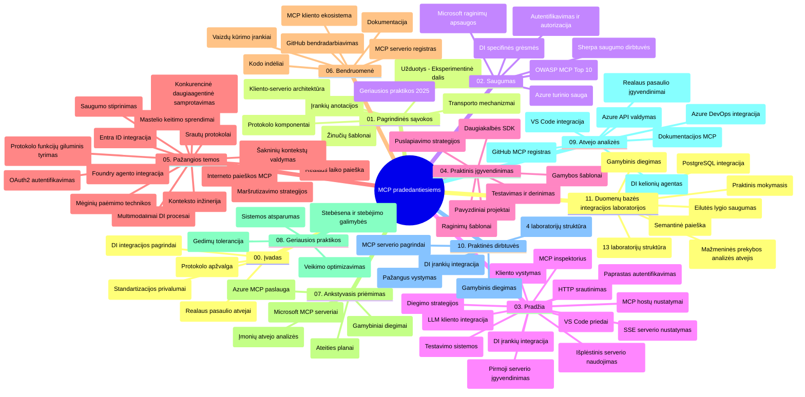

# Modelio konteksto protokolas (MCP) pradedantiesiems – studijų vadovas

Šis studijų vadovas pateikia apžvalgą apie saugyklos struktūrą ir turinį „Modelio konteksto protokolo (MCP) pradedantiesiems“ mokymo programai. Naudokite šį vadovą efektyviai naršyti saugykloje ir maksimaliai išnaudoti turimus išteklius.

## Saugyklos apžvalga

Modelio konteksto protokolas (MCP) yra standartizuota sistema AI modelių ir klientų programų sąveikai. Iš pradžių sukurtas Anthropic, MCP dabar prižiūrimas plačios MCP bendruomenės per oficialią GitHub organizaciją. Ši saugykla siūlo visapusišką mokymo programą su praktiškais kodų pavyzdžiais C#, Java, JavaScript, Python ir TypeScript kalbomis, skirtą AI kūrėjams, sistemų architektams ir programinės įrangos inžinieriams.

## Vizualus mokymo programos žemėlapis

## Saugyklos struktūra

Saugykla suskirstyta į vienuolika pagrindinių skyrių, iš kurių kiekvienas nagrinėja skirtingus MCP aspektus:

1. **Įvadas (00-Introduction/)**
   - Modelio konteksto protokolo apžvalga
   - Kodėl standartizacija svarbi AI procesuose
   - Praktiniai naudojimo atvejai ir nauda

2. **Pagrindinės sąvokos (01-CoreConcepts/)**
   - Klientų ir serverių architektūra
   - Pagrindiniai protokolo komponentai
   - Pranešimų modeliai MCP

3. **Saugumas (02-Security/)**
   - Grėsmės MCP pagrindu veikiančiose sistemose
   - Geriausios praktikos įgyvendinant saugumą
   - Autentifikavimo ir autorizacijos strategijos
   - **Išsami saugumo dokumentacija**:
     - MCP saugumo geriausios praktikos 2025
     - Azure turinio saugos įgyvendinimo vadovas
     - MCP saugumo valdymo priemonės ir technikos
     - MCP geriausių praktikų greitasis vadovas
   - **Pagrindinės saugumo temos**:
     - Užklausų injekcijos ir įrankių užnuodijimo atakos
     - Sesijų užgrobimo ir supainiotų įgaliotinių problemos
     - Tokenų praleidimo pažeidžiamumai
     - Per didelės teisės ir prieigos kontrolė
     - Tiekimo grandinės saugumas AI komponentams
     - Microsoft Prompt Shields integracija

4. **Pradžia (03-GettingStarted/)**
   - Aplinkos paruošimas ir konfigūracija
   - Pirmųjų MCP serverių ir klientų kūrimas
   - Integracija su esamomis programomis
   - Įtraukta sekcijų apie:
     - Pirmojo serverio įgyvendinimą
     - Klientų kūrimą
     - LLM klientų integraciją
     - VS Code integraciją
     - Server-Sent Events (SSE) serverį
     - Pažangų serverio naudojimą
     - HTTP srautinį perdavimą
     - AI įrankių rinkinio integraciją
     - Testavimo strategijas
     - Diegimo vadovą

5. **Praktinis įgyvendinimas (04-PracticalImplementation/)**
   - SDK naudojimas įvairiomis programavimo kalbomis
   - Derinimas, testavimas ir patikra
   - Pakartotinai naudojamų užklausų šablonų ir darbo eigos kūrimas
   - Pavyzdinės programos su įgyvendinimo pavyzdžiais

6. **Pažangios temos (05-AdvancedTopics/)**
   - Konteksto inžinerijos technikos
   - Foundry agentų integracija
   - Daugiaformės AI darbo eigos
   - OAuth2 autentifikavimo demonstracijos
   - Realiojo laiko paieškos galimybės
   - Realiojo laiko srautinimas
   - Šakninių kontekstų įgyvendinimas
   - Maršrutų valdymo strategijos
   - Imčių ėmimo technikos
   - Masto keitimo metodai
   - Saugumo aspektai
   - Entra ID saugumo integracija
   - Internetinės paieškos integracija
   - Priešiškas daugiaagentinis argumentavimas (debatai)

7. **Bendruomenės indėlis (06-CommunityContributions/)**
   - Kaip prisidėti prie kodo ir dokumentacijos
   - Bendradarbiavimas per GitHub
   - Bendruomenės iniciatyvos ir atsiliepimai
   - Įvairių MCP klientų naudojimas (Claude Desktop, Cline, VSCode)
   - Darbas su populiariais MCP serveriais, įskaitant paveikslėlių generavimą

8. **Patirtys iš ankstyvosios diegimo fazės (07-LessonsfromEarlyAdoption/)**
   - Realūs įgyvendinimai ir sėkmės istorijos
   - MCP pagrindu veikiančių sprendimų kūrimas ir diegimas
   - Tendencijos ir ateities planai
   - **Microsoft MCP serverių vadovas**: Išsamus 10 gamybai paruoštų Microsoft MCP serverių sąrašas, įskaitant:
     - Microsoft Learn Docs MCP serverį
     - Azure MCP serverį (15+ specializuotų jungčių)
     - GitHub MCP serverį
     - Azure DevOps MCP serverį
     - MarkItDown MCP serverį
     - SQL Server MCP serverį
     - Playwright MCP serverį
     - Dev Box MCP serverį
     - Azure AI Foundry MCP serverį
     - Microsoft 365 Agents Toolkit MCP serverį

9. **Geriausios praktikos (08-BestPractices/)**
   - Veikimo spartinimas ir optimizavimas
   - Atsparių MCP sistemų projektavimas
   - Testavimo ir patvarumo strategijos

10. **Atvejų analizės (09-CaseStudy/)**
    - **Septynios išsamios atvejų analizės** demonstruoja MCP universalumą įvairiose situacijose:
    - **Azure AI kelionių agentai**: Daugiaagentinė orkestracija su Azure OpenAI ir AI paieška
    - **Azure DevOps integracija**: Automatizuotos darbo eigos su YouTube duomenų atnaujinimais
    - **Realiojo laiko dokumentacijos gavimas**: Python konsolės klientas su HTTP srautinimu
    - **Interaktyvus studijų plano generatorius**: Chainlit žiniatinklio programa su pokalbių AI
    - **Dokumentacija redaktoriuje**: VS Code integracija su GitHub Copilot darbo eigomis
    - **Azure API valdymas**: Įmonių API integracija ir MCP serverio kūrimas
    - **GitHub MCP registras**: Ekosistemos kūrimas ir agentinė integracijos platforma
    - Įgyvendinimo pavyzdžiai apimantys įmonių integraciją, kūrėjų produktyvumą ir ekosistemos plėtrą

11. **Praktinis seminaras (10-StreamliningAIWorkflowsBuildingAnMCPServerWithAIToolkit/)**
    - Visapusiškas praktinis seminaras, derinantis MCP su AI įrankių rinkiniu
    - Intelektualių programų kūrimas, jungiančių AI modelius su realiais įrankiais
    - Praktiniai moduliai, apimantys pagrindus, pasirinktinių serverių kūrimą ir gamybos diegimo strategijas
    - **Laboratorijos struktūra**:
      - Laboratorija 1: MCP serverio pagrindai
      - Laboratorija 2: Pažangus MCP serverio vystymas
      - Laboratorija 3: AI įrankių rinkinio integracija
      - Laboratorija 4: Gamybos diegimas ir mastelio keitimas
    - Mokymasis per laboratorines užduotis su žingsnis po žingsnio instrukcijomis

12. **MCP serverio duomenų bazės integracijos laboratorijos (11-MCPServerHandsOnLabs/)**
    - **Išsamus 13 laboratorijų mokymosi kelias** kuriant gamybai paruoštus MCP serverius su PostgreSQL integracija
    - **Realus mažmeninės prekybos analizės įgyvendinimas** naudojant Zava Retail naudotojo atvejį
    - **Įmonių lygio modeliai**, įskaitant eilės lygmens saugumą (RLS), semantinę paiešką ir daugiaviti prieigą prie duomenų
    - **Kompleksinė laboratorijų struktūra**:
      - **Laboratorijos 00-03: Pagrindai** – įvadas, architektūra, saugumas, aplinkos paruošimas
      - **Laboratorijos 04-06: MCP serverio kūrimas** – duomenų bazės projektavimas, MCP serverio įgyvendinimas, įrankių vystymas
      - **Laboratorijos 07-09: Pažangios funkcijos** – semantinė paieška, testavimas ir derinimas, VS Code integracija
      - **Laboratorijos 10-12: Gamyba ir geriausios praktikos** – diegimas, stebėsena, optimizavimas
    - **Naudojamos technologijos**: FastMCP karkasas, PostgreSQL, Azure OpenAI, Azure Container Apps, Application Insights
    - **Mokymosi rezultatai**: gamybai paruošti MCP serveriai, duomenų bazės integracijos modeliai, AI pagrįsta analizė, įmonių saugumas

## Papildomi ištekliai

Saugykla apima papildomus išteklius:

- **Paveikslėlių aplankas**: Diagramos ir iliustracijos, naudojamos visoje mokymo programoje
- **Vertimai**: Daugiakalbė dokumentacijos parama su automatizuotais vertimais
- **Oficialūs MCP ištekliai**:
  - [MCP dokumentacija](https://modelcontextprotocol.io/)
  - [MCP specifikacija](https://spec.modelcontextprotocol.io/)
  - [MCP GitHub saugykla](https://github.com/modelcontextprotocol)

## Kaip naudotis šia saugykla

1. **Sekantis mokymasis**: Sekite skyrius tvarkingai (nuo 00 iki 11), kad gautumėte struktūruotą mokymosi patirtį.
2. **Kalbai skirti pavyzdžiai**: Jei domina konkreti programavimo kalba, išnagrinėkite atitinkamų pavyzdžių katalogus.
3. **Praktinis įgyvendinimas**: Pradėkite nuo „Pradžia“ skyriaus, kad pasiruoštumėte aplinką ir sukurtumėte pirmą MCP serverį ir klientą.
4. **Pažangesnė analizė**: Įsisavinę pagrindus, gilinkitės į pažangias temas.
5. **Bendruomenės įsitraukimas**: Prisijunkite prie MCP bendruomenės per GitHub diskusijas ir Discord kanalus, kad bendrautumėte su ekspertais ir kolegomis kūrėjais.

## MCP klientai ir įrankiai

Mokymo programa apima įvairius MCP klientus ir įrankius:

1. **Oficialūs klientai**:
   - Visual Studio Code
   - MCP Visual Studio Code aplinkoje
   - Claude Desktop
   - Claude VSCode
   - Claude API

2. **Bendruomenės klientai**:
   - Cline (komandinės eilutės pagrindu)
   - Cursor (kodo redaktorius)
   - ChatMCP
   - Windsurf

3. **MCP valdymo įrankiai**:
   - MCP CLI
   - MCP Manager
   - MCP Linker
   - MCP Router

## Populiarūs MCP serveriai

Saugykla pristato įvairius MCP serverius, įskaitant:

1. **Oficialūs Microsoft MCP serveriai**:
   - Microsoft Learn Docs MCP serveris
   - Azure MCP serveris (15+ specializuotų jungčių)
   - GitHub MCP serveris
   - Azure DevOps MCP serveris
   - MarkItDown MCP serveris
   - SQL Server MCP serveris
   - Playwright MCP serveris
   - Dev Box MCP serveris
   - Azure AI Foundry MCP serveris
   - Microsoft 365 Agents Toolkit MCP serveris

2. **Oficialūs pavyzdiniai serveriai**:
   - Failų sistema
   - Fetch
   - Atmintis
   - Sekvencinis mąstymas

3. **Paveikslėlių generavimas**:
   - Azure OpenAI DALL-E 3
   - Stable Diffusion WebUI
   - Replicate

4. **Vystymo įrankiai**:
   - Git MCP
   - Terminalo valdymas
   - Kodo asistentas

5. **Specializuoti serveriai**:
   - Salesforce
   - Microsoft Teams
   - Jira & Confluence

## Indėlis į projektą

Ši saugykla kviečia bendruomenę prisidėti. Peržiūrėkite skyrių „Bendruomenės indėlis“ dėl patarimų, kaip veiksmingai prisidėti prie MCP ekosistemos.

----

*Šis studijų vadovas paskutinį kartą atnaujintas 2026 m. vasario 5 d., atspindint naujausią MCP specifikaciją 2025-11-25 ir pateikia saugyklos apžvalgą būtent tuo laikotarpiu. Turinys gali būti atnaujintas po šios datos.*

---

<!-- CO-OP TRANSLATOR DISCLAIMER START -->
**Atsakomybės apribojimas**:  
Šis dokumentas buvo išverstas naudojant dirbtinio intelekto vertimo paslaugą [Co-op Translator](https://github.com/Azure/co-op-translator). Nors stengiamės užtikrinti tikslumą, prašome suprasti, kad automatizuoti vertimai gali turėti klaidų ar netikslumų. Originalus dokumentas jo gimtąja kalba turi būti laikomas autoritetingu šaltiniu. Esant svarbiai informacijai, rekomenduojama kreiptis į profesionalius vertėjus. Mes neprisiimame atsakomybės už bet kokius nesusipratimus ar neteisingas interpretacijas, kylančias dėl šio vertimo naudojimo.
<!-- CO-OP TRANSLATOR DISCLAIMER END -->