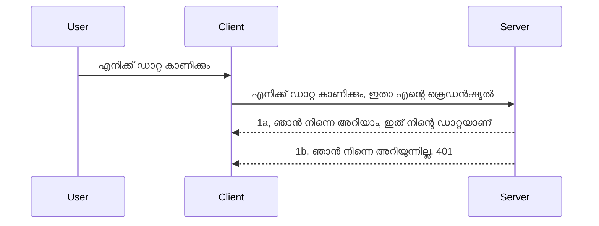

# ലളിതമായ അഥ്

MCP SDKകൾ OAuth 2.1 ഉപയോഗത്തെ പിന്തുണയ്ക്കുന്നു, ഇത് നീച് പറയണമെങ്കിൽ ഒരു 꽙യ在人线 പ്രക്രിയയാണ്, അതിൽ അഥ് സെർവർ, റിസോഴ്‌സ് സെർവർ, ക്രെഡൻഷ്യലുകൾ പോസ്റ്റ് ചെയ്യൽ, ഒരു കോഡ്െടുക്കൽ, കോഡ് ഒഴിവാക്കി ബെറർ ടോക്കൺ വരുത്തൽ തുടങ്ങി നിങ്ങളുടെ റിസോഴ്‌സ് ഡാറ്റയ്ക്ക് അവസരം ലഭിക്കുന്നതിനുള്ള ഘടകങ്ങൾ ഉൾപ്പെടുന്നു. നിങ്ങൾക്ക് OAuth ഉപയോഗിക്കാൻ പരിചയമല്ലെങ്കിൽ, നല്ല രീതിയിൽ ഞങ്ങളെ സുതാര്യമായ ചില അടിസ്ഥാന തലത്തിലുള്ള അഥ് മുതലാകെ തയാറെടുക്കുന്നത് നല്ല ആശയം ആണ്. അതിനാൽ ഈ അധ്യായം ഉണ്ടാകുന്നത് ഉയർന്ന തലത്തിലുള്ള അഥ് നൽകുന്നതിനുള്ള ഒരുക്കത്തിനാണ്.

## അഥ്, അതെന്ത് അർത്ഥം?

അഥ് എന്ന് പറയുന്നത് authentication and authorization-ന്റെ ചുരുക്കപ്പേര് ആണ്. തത്വം ഇതാണ്: ഞങ്ങൾ രണ്ട് കാര്യങ്ങൾ നിർവഹിക്കേണ്ടത്:

- **Authentication**, അതായത് ഒരു വ്യക്തിയെ ഞങ്ങളുടെ വീട്ടിലേക്ക് കയറ്റുമാറുള്ളതാണ്, "ഇവിടെയാണ്" എന്ന് അവർക്കുള്ള അവകാശം ഉള്ളതായി കണ്ടെത്തൽ, അതായത് MCP Server-ന്റെ ഫീച്ചറുകൾ ഉള്ള റിസോഴ്‌സ് സെർവറിൽ അവരുടെ പ്രവേശനം ഉറപ്പാക്കൽ.
- **Authorization**, ഒരു ഉപയോക്താവിന് അവർ അഭ്യർത്ഥിക്കുന്ന പ്രത്യേക റിസോഴ്‌സുകൾക്ക് (പറഞ്ഞാൽ വാങ്ങലുകൾ, ഉത്പന്നങ്ങൾ) അവകാശം കൊടുക്കണമോ എന്ന് കണ്ടറിയുക; ഉദാഹരണത്തിന്, അവർ ഉള്ളടക്കം വായിക്കാൻ ആഗ്രഹിക്കുന്നുവെങ്കിലും അകറ്റാൻ സാധിക്കില്ലാത്ത അവകാശമുണ്ടോ എന്ന് കണ്ടറിയൽ.

## ക്രെഡൻഷ്യലുകൾ: എന്താണെന്ന് സിസ്റ്റത്തെ അറിയിക്കുന്നത്

സാധാരണ വെബ് ഡെവലപ്പർമാർ സിസ്റ്റത്തിന് ഒരു ക്രെഡൻഷ്യല് നൽകണമെന്ന് കരുതുന്നു, സാധാരണയായി ഒരു രഹസ്യം, ഇത് അവർക്കു ഇവിടെ "Authentication" സാധ്യമാക്കുവാൻ അനുവാദംലഭിച്ചിരിക്കുന്നു എന്ന് പറയുന്നു. ഈ ക്രെഡൻഷ്യൽ സാധാരണയായി ഒരു ബേസ്64 എൻകോടഡ് ഉപയോക്തൃനാമവും പാസ്സ്‌വേഡും അല്ലെങ്കിൽ പ്രത്യേക ഉപയോക്താവിനെ തിരിച്ചറിയുന്ന API കീ ആണ്.

ഇത് "Authorization" എന്ന ഹെഡർ വഴി അയയ്ക്കുന്നു:

```json
{ "Authorization": "secret123" }
```

ഇത് സാധാരണയായി അടിസ്ഥാന അഥുമായി പരാമർശിക്കപ്പെടുന്നു. ആകെ പ്രക്രിയ ഇപ്രകാരം കാര്യക്ഷമമാണ്:


ഇപ്പോൾ ഇത് ഫ്ലോ ലെവലിൽ എങ്ങനെ പ്രവർത്തിക്കുന്നു എന്ന് മനസ്സിലാക്കി, നമ്മൾ ഇത് എങ്ങനെ നടപ്പിലാക്കും? വെബ് സെർവറുകൾക്ക് സാധാരണയായി മിഡിൽവെയർ എന്ന ആശയം ഉണ്ടാകും, റെക്വസ്റ്റ് ഭാഗമായിട്ടുള്ള കോഡ്, ക്രെഡൻഷ്യലുകൾ പരിശോദിച്ച് സാധുവെങ്കിൽ രെക്വസ്റ്റ് കടക്കാൻ അനുവദിക്കുന്നത്. സാധുവല്ലാത്തതിന് അഥ് തകരാറായൊരു പിശക് ലഭിക്കും. എങ്ങനെ നടപ്പിലാക്കാമെന്ന് നോക്കാം:

**Python**

```python
class AuthMiddleware(BaseHTTPMiddleware):
    async def dispatch(self, request, call_next):

        has_header = request.headers.get("Authorization")
        if not has_header:
            print("-> Missing Authorization header!")
            return Response(status_code=401, content="Unauthorized")

        if not valid_token(has_header):
            print("-> Invalid token!")
            return Response(status_code=403, content="Forbidden")

        print("Valid token, proceeding...")
       
        response = await call_next(request)
        # പ്രതികരണത്തിൽ ഏതെങ്കിലും ഉപഭോക്തൃ ഹെഡറുകൾ ചേർക്കുക അല്ലെങ്കിൽ എന്തെങ്കിലും മാറ്റങ്ങൾ വരുത്തുക
        return response


starlette_app.add_middleware(CustomHeaderMiddleware)
```

ഇവിടെ:

- `AuthMiddleware` എന്ന മിഡിൽവെയർ സൃഷ്ടിച്ചിരുന്നു ആഗോള `dispatch` മെത്തഡിൽ വെബ് സെർവർകൊണ്ട് വിളിക്കപ്പെടുന്നു.
- മിഡിൽവെയർ വെബ് സെർവറിലേക്ക് ചേർത്തു:

    ```python
    starlette_app.add_middleware(AuthMiddleware)
    ```

- Authorization ഹെഡർ ഉണ്ടായിരിക്കുന്നു എന്നുള്ളതിനും അയക്കുന്ന രഹസ്യം സാധുവാണെന്നും പരിശോധിക്കുന്ന വാലിഡേഷൻ ലജിക് എഴുതിയിട്ടുണ്ട്:

    ```python
    has_header = request.headers.get("Authorization")
    if not has_header:
        print("-> Missing Authorization header!")
        return Response(status_code=401, content="Unauthorized")

    if not valid_token(has_header):
        print("-> Invalid token!")
        return Response(status_code=403, content="Forbidden")
    ```

    രഹസ്യം ഉണ്ടും സാധുവായിരുന്നാൽ, `call_next` വിളിച്ച് രെക്വസ്റ്റ് കടക്കാൻ അനുവദിക്കുകയും റസ്പോൺസ് തിരികെ നൽകുകയും ചെയ്യും.

    ```python
    response = await call_next(request)
    # किसी भी ग्राहक हेडर एकत्रित करें या प्रतिक्रिया में किसी प्रकार का परिवर्तन करें
    return response
    ```

വേർപ്പെട്ടുവിളിച്ചു വെബ് റിക്വസ്റ്റ് വന്നാൽ, മിഡിൽവെയർ പ്രവർത്തിച്ച് രെക്വസ്റ്റ് കടക്കാൻ അനുവദിക്കുകയോ അല്ലെങ്കിൽ ക്ലയന്റ് മുന്നോട്ടുപോയാൽ അനുവദിക്കാത്ത പിശക് തിരികെ നൽകുകയോ ചെയ്യും.

**TypeScript**

Express എന്ന പ്രശസ്തമായ ഫ്രെയിംവർക്ക് ഉപയോഗിച്ച് മിഡിൽവെയർ സൃഷ്ടിക്കുന്നു, MCP Server-നെ എത്തുന്നതിനു മുന്‍പ് രെക്വസ്റ്റ് ഇടപെടുന്നു. അതിന്റെ കോഡ് ഇങ്ങനെയാണ്:

```typescript
function isValid(secret) {
    return secret === "secret123";
}

app.use((req, res, next) => {
    // 1. അധികാരമോരോ ഹെഡർ ഉണ്ടോ?
    if(!req.headers["Authorization"]) {
        res.status(401).send('Unauthorized');
    }
    
    let token = req.headers["Authorization"];

    // 2. സാധുത പരിശോധിക്കുക.
    if(!isValid(token)) {
        res.status(403).send('Forbidden');
    }

   
    console.log('Middleware executed');
    // 3. അഭ്യർഥന പൈപ്പ്ലൈൻ中的 അടുത്ത ഘട്ടത്തിലേക്ക് അഭ്യർഥന അയയ്ക്കുക.
    next();
});
```

ഈ കോഡിൽ:

1. ആദ്യം Authorization ഹെഡർ ഉണ്ടോ എന്ന് പരിശോധിക്കുന്നു; ഇല്ലെങ്കിൽ 401 പിശക് അയക്കുന്നു.
2. ക്രെഡൻഷ്യൽ/ടോക്കൺ സാധുവാണെന്ന് ഉറപ്പാക്കുന്നു; അല്ലെങ്കിൽ 403 പിശക് അയക്കുന്നു.
3. അവസാനം രെക്വസ്റ്റ് പൈപ്പലൈനിൽ കടക്കുന്നു, അഭ്യർത്ഥിച്ച റിസോഴ്‌സ് നൽകുന്നു.

## അഭ്യാസം: Authentication നടപ്പിലാക്കുക

നമ്മുടെ അറിവ് ഉപയോഗിച്ച് പ്രയോജനപ്പെടുത്താം. പദ്ധതി ഇങ്ങനെ:

സെർവർ

- വെബ് സെർവർ, MCP ഇൻസ്റ്റൻസ് സൃഷ്ടിക്കുക.
- സെർവറിന് ഒരു മിഡിൽവെയർ നടപ്പിലാക്കുക.

ക്ലയന്റ്

- ഹെഡർ മുഖേന ക്രെഡൻഷ്യൽ ഉൾപ്പെടെയുള്ള വെബ് റിക്വസ്റ്റ് അയയ്‌ക്കുക.

### -1- വെബ് സെർവർ, MCP ഇൻസ്റ്റൻസ് സൃഷ്ടിക്കുക

ആദ്യ ഘട്ടം, വെബ് സെർവർ ഇൻസ്റ്റൻസ്, MCP Server സൃഷ്ടിക്കുക.

**Python**

MCP Server ഇൻസ്റ്റൻസ് സൃഷ്ടിച്ച്, starlette വെബ് ആപ്പ് ഉണ്ടാക്കി uvicorn ഉപയോഗിച്ച് ഹോസ്റ്റ് ചെയ്യുന്നു.

```python
# MCP സെർവർ സൃഷ്ടിക്കുന്നു

app = FastMCP(
    name="MCP Resource Server",
    instructions="Resource Server that validates tokens via Authorization Server introspection",
    host=settings["host"],
    port=settings["port"],
    debug=True
)

# സ്റ്റാർലെറ്റ് വെബ് ആപ്പ് സൃഷ്ടിക്കുന്നു
starlette_app = app.streamable_http_app()

# uvicorn മുഖേന ആപ്പ് സേവനം നൽകുന്നു
async def run(starlette_app):
    import uvicorn
    config = uvicorn.Config(
            starlette_app,
            host=app.settings.host,
            port=app.settings.port,
            log_level=app.settings.log_level.lower(),
        )
    server = uvicorn.Server(config)
    await server.serve()

run(starlette_app)
```

ഈ കോഡിൽ:

- MCP Server സൃഷ്ടിക്കുന്നു.
- MCP Server-ൽ നിന്നുള്ള starlette വെബ് ആപ്പ് `app.streamable_http_app()` ഉണ്ടാക്കി.
- uvicorn-ന്റെ സഹായത്തോടെ വെബ് ആപ്പ് ഹോസ്റ്റ് ചെയ്യുന്നു `server.serve()`.

**TypeScript**

MCP Server ഇൻസ്റ്റൻസ് സൃഷ്ടിക്കാം.

```typescript
const server = new McpServer({
      name: "example-server",
      version: "1.0.0"
    });

    // ... സെർവർ വിഭവങ്ങൾ, ഉപകരണങ്ങൾ, പ്രൊംപ്റ്റുകൾ സജ്ജീകരിക്കുക ...
```

POST /mcp റൂട്ടിൽ ഈ MCP Server സൃഷ്ടി വേണം, അതിനാൽ മുകളിൽ നൽകിയ കോഡ് ഇപ്രകാരം മാറ്റാം:

```typescript
import express from "express";
import { randomUUID } from "node:crypto";
import { McpServer } from "@modelcontextprotocol/sdk/server/mcp.js";
import { StreamableHTTPServerTransport } from "@modelcontextprotocol/sdk/server/streamableHttp.js";
import { isInitializeRequest } from "@modelcontextprotocol/sdk/types.js"

const app = express();
app.use(express.json());

// സെഷന്‍ഐഡി പ്രകാരം ട്രാന്‍സ്‌പോര്‍ട് സൂക്ഷിക്കാന്‍ മാപ്പ്
const transports: { [sessionId: string]: StreamableHTTPServerTransport } = {};

// ക്ലയന്റ്-ടു-സര്‍വ്വര്‍ സംവാദത്തിനുള്ള POST അഭ്യര്‍ത്ഥനകള്‍ കൈകാര്യം ചെയ്‌തു്
app.post('/mcp', async (req, res) => {
  // നിലവിലുള്ള സെഷന്‍ഐഡി പരിശോധിക്കുക
  const sessionId = req.headers['mcp-session-id'] as string | undefined;
  let transport: StreamableHTTPServerTransport;

  if (sessionId && transports[sessionId]) {
    // നിലവിലുള്ള ട്രാന്‍സ്‌പോര്‍ട് പുനരുപയോഗം ചെയ്യുക
    transport = transports[sessionId];
  } else if (!sessionId && isInitializeRequest(req.body)) {
    // പുതിയ ആരംഭ അഭ്യര്‍ത്ഥന
    transport = new StreamableHTTPServerTransport({
      sessionIdGenerator: () => randomUUID(),
      onsessioninitialized: (sessionId) => {
        // സെഷന്‍ഐഡി പ്രകാരം ട്രാന്‍സ്‌പോര്‍ട് സൂക്ഷിക്കുക
        transports[sessionId] = transport;
      },
      // ഡിഎന്‍എസ് റിബൈന്‍ഡിംഗ് സംരക്ഷണം പിന്‍കാല അനുയോജ്യത‍ക്കായി ഡിഫോൾറ്റായി അപ്രാപ്തമാണ്. ഈ സര്‍വര്‍
      // പ്രാദേശികമായി നടത്തുകയാണെങ്കില്‍, ഉറപ്പാക്കുക:
      // enableDnsRebindingProtection: true,
      // allowedHosts: ['127.0.0.1'],
    });

    // ക്ലോസ് ചെയ്‌തപ്പോൾ ട്രാന്‍സ്‌പോര്‍ട് മായ്ക്കുക
    transport.onclose = () => {
      if (transport.sessionId) {
        delete transports[transport.sessionId];
      }
    };
    const server = new McpServer({
      name: "example-server",
      version: "1.0.0"
    });

    // ... സര്‍വര്‍ വിഭവങ്ങള്‍, ടൂളുകള്‍, പ്രോംപ്റ്റുകള്‍ സജ്ജമാക്കുക ...

    // MCP സര്‍വര്‍ക്ക് കണക്ട് ചെയ്യുക
    await server.connect(transport);
  } else {
    // അസാധുചെയ്ത അഭ്യര്‍ഥന
    res.status(400).json({
      jsonrpc: '2.0',
      error: {
        code: -32000,
        message: 'Bad Request: No valid session ID provided',
      },
      id: null,
    });
    return;
  }

  // അഭ്യര്‍ത്ഥന കൈകാര്യം ചെയ്യുക
  await transport.handleRequest(req, res, req.body);
});

// GET, DELETE അഭ്യര്‍ത്ഥനകള്‍ക്ക് പുനരുപയോഗയോഗ്യമായ ഹാന്‍ഡ്ലര്‍
const handleSessionRequest = async (req: express.Request, res: express.Response) => {
  const sessionId = req.headers['mcp-session-id'] as string | undefined;
  if (!sessionId || !transports[sessionId]) {
    res.status(400).send('Invalid or missing session ID');
    return;
  }
  
  const transport = transports[sessionId];
  await transport.handleRequest(req, res);
};

// സെര്‍വര്‍-ടു-ക്ലയന്റ് അറിയിപ്പുകള്‍ക്ക് SSE വഴി GET അഭ്യര്‍ത്ഥനകള്‍ കൈകാര്യം ചെയ്യുക
app.get('/mcp', handleSessionRequest);

// സെഷന്‍ അവസാനിപ്പിക്കാന്‍ DELETE അഭ്യര്‍ത്ഥനകളെ കൈകാര്യം ചെയ്യുക
app.delete('/mcp', handleSessionRequest);

app.listen(3000);
```

`app.post("/mcp")` ൽ MCP Server സൃഷ്ടി ചുവടെ മാറ്റിയതായി കാണാം.

അടുത്ത ഘട്ടം, ക്രെഡൻഷ്യൽ ശരിയെന്ന് സ്ഥിരീകരിക്കാൻ മിഡിൽവെയർ സൃഷ്ടിക്കാം.

### -2- സെർവറിന് ഒരു മിഡിൽവെയർ നടപ്പിലാക്കുക

മിഡിൽവെയർ ഭാഗത്ത് എത്താം. Authorization ഹെഡറിൽ ക്രെഡൻഷ്യൽ നോക്കി ശെരിയെന്ന് സ്ഥിരീകരിക്കുന്ന മിഡിൽവെയർ സൃഷ്ടിക്കും. ശരിയെങ്കിൽ റിക്വസ്റ്റ് MCP ഫംഗ്ഷനാലിറ്റി നടത്താൻ മുന്നോട്ട് പോകും (ഉദാ., ടൂൾസ് ലിസ്റ്റ് ചെയ്യുക, റിസോഴ്‌സ് വായിക്കുക).

**Python**

മിഡിൽവെയർ സൃഷ്ടിക്കാൻ `BaseHTTPMiddleware`-dən ഔദ്യോഗികമായി അവലംബിച്ച ക്ലാസ് ഉണ്ടാക്കണം. രണ്ട് പ്രധാന ഭാഗങ്ങൾ:

- `request` ഡ്ര മരണ, ഹെഡർ വിവരങ്ങൾ വായിക്കുന്നതു.
- `call_next`, ക്ലയന്റ് സത്യമായ ക്രെഡൻഷ്യൽ കൊണ്ടുവന്നുവെങ്കിൽ വിളിക്കേണ്ട കോൾബാക്ക്.

ആദ്യമായി, `Authorization` ഹെഡർ മിസ്സിംഗ് ആണെങ്കിൽ കൈകാര്യം ചെയ്യാം:

```python
has_header = request.headers.get("Authorization")

# ഹെഡർ ഇല്ല, 401-ൽ പരാജയപ്പെടുക, അല്ലെങ്കിൽ മുന്നോട്ട് പോവുക.
if not has_header:
    print("-> Missing Authorization header!")
    return Response(status_code=401, content="Unauthorized")
```

401 unauthorized സന്ദേശം അയക്കുന്നു, ക്ലൈന്റ് authentication പരാജയപ്പെട്ടു.

കൂടുതൽ, ക്രെഡൻഷ്യൽ നൽകിയിട്ടുണ്ടെങ്കിൽ, അതിന്റെ സാധുത പരിശോധിക്കുക:

```python
 if not valid_token(has_header):
    print("-> Invalid token!")
    return Response(status_code=403, content="Forbidden")
```

മുകളിൽ 403 forbidden സന്ദേശം അയക്കുന്നതായി കാണാം. താഴെ മുഴുവൻ മിഡിൽവെയർ നൽകുന്നു:

```python
class AuthMiddleware(BaseHTTPMiddleware):
    async def dispatch(self, request, call_next):

        has_header = request.headers.get("Authorization")
        if not has_header:
            print("-> Missing Authorization header!")
            return Response(status_code=401, content="Unauthorized")

        if not valid_token(has_header):
            print("-> Invalid token!")
            return Response(status_code=403, content="Forbidden")

        print("Valid token, proceeding...")
        print(f"-> Received {request.method} {request.url}")
        response = await call_next(request)
        response.headers['Custom'] = 'Example'
        return response

```

ശ്രേഷ്ഠം, പക്ഷേ `valid_token` ഫങ്ഷൻ എന്ത്? ഇത് ഇങ്ങനെ:

```python
# ഉത്പാദനത്തിനായി ഉപയോഗിക്കരുത് - ഇത് മെച്ചപ്പെടുത്തൂ !!
def valid_token(token: str) -> bool:
    # "Bearer " മുൻകൂർപദം നീക്കം ചെയ്യുക
    if token.startswith("Bearer "):
        token = token[7:]
        return token == "secret-token"
    return False
```

മേന്മപ്പെടുത്തേണ്ടതാണ്.

പ്രധാനമാണ്: കോഡിൽ ഇത്തരത്തിലുള്ള രഹസ്യങ്ങൾ ഉടനെക്കാൾ ഇരിക്കരുത്. സാധാരണയായി ഡാറ്റ ഉറവിടം അല്ലെങ്കിൽ IDP (Identity Service Provider) മുതലായവയിൽ നിന്നോ ശരിവെക്കണം.

**TypeScript**

Express ഉപയോഗിച്ച് നടപ്പിലാക്കാൻ `use` മെത്തഡ് മിഡിൽവെയർ ഫങ്ഷനുകൾ ഏറ്റെടുക്കുന്നു.

നമുക്ക് ചെയ്യേണ്ടത്:

- Authorization പ്രോപർട്ടിയിൽ ക്രെഡൻഷ്യൽ പരിശോധിക്കുക.
- ക്രെഡൻഷ്യൽ ശരിയായെങ്കിൽ രെക്വസ്റ്റ് അനുവദിക്കുക; ഇല്ലെങ്കിൽ തടയുക.

ഇവിടെ Authorization ഹെഡർ ഉണ്ടായിട്ടുണ്ടോ എന്ന് തീർച്ചാക്കുന്നു; ഇല്ലെങ്കിൽ റെക്വസ്റ്റ് തടയുന്നു:

```typescript
if(!req.headers["authorization"]) {
    res.status(401).send('Unauthorized');
    return;
}
```

ഹെഡർ ഇല്ലെങ്കിൽ 401 ലഭിക്കും.

പിന്നീട് ക്രെഡൻഷ്യൽ ശരിയാണോ പരിശോധിക്കുന്നു; ഇല്ലെങ്കിൽ 403 പിശക്:

```typescript
if(!isValid(token)) {
    res.status(403).send('Forbidden');
    return;
} 
```

ഇപ്പോൾ 403 പിശക് കാണാം.

പൂർണ്ണ കോഡ്:

```typescript
app.use((req, res, next) => {
    console.log('Request received:', req.method, req.url, req.headers);
    console.log('Headers:', req.headers["authorization"]);
    if(!req.headers["authorization"]) {
        res.status(401).send('Unauthorized');
        return;
    }
    
    let token = req.headers["authorization"];

    if(!isValid(token)) {
        res.status(403).send('Forbidden');
        return;
    }  

    console.log('Middleware executed');
    next();
});
```

വെബ് സെർവർ മിഡിൽവെയർ ആയി ക്രെഡൻഷ്യൽ പരിശോധിക്കാൻ സജ്ജമാക്കി. ക്ലയന്റ് താൻ എന്താണെന്ന് നോക്കാം.

### -3- ഹെഡറിലൂടെ ക്രെഡൻഷ്യലുള്ള വെബ് റിക്വസ്റ്റ് അയയ്‌ക്കുക

ക്ലയന്റ് ഹെഡറിൽ ക്രെഡൻഷ്യൽ അയക്കുന്നുണ്ടെന്ന് ഉറപ്പാക്കണം. MCP Client ഉപയോഗിച്ചുകൊണ്ട് ചെയ്‌യുന്ന വിധം കാണാം.

**Python**

ക്ലയന്റിന് ഹെഡറിൽ ക്രെഡൻഷ്യൽ ഇങ്ങനെ നൽകണം:

```python
# മൂല്യം ഹാർഡ്കോഡ് ചെയ്യരുത്, അതിനെ ഏറ്റവും കുറഞ്ഞത് ഒരു പരിസ്ഥിതി വേരിയബിളിലോ കൂടുതൽ സുരക്ഷിതമായ സംഭരണിലോ സൂക്ഷിക്കുക
token = "secret-token"

async with streamablehttp_client(
        url = f"http://localhost:{port}/mcp",
        headers = {"Authorization": f"Bearer {token}"}
    ) as (
        read_stream,
        write_stream,
        session_callback,
    ):
        async with ClientSession(
            read_stream,
            write_stream
        ) as session:
            await session.initialize()
      
            # ചെയ്യേണ്ടതായി TODO, ക്ലയന്റിൽ നിങ്ങൾ എന്ത് ചെയ്യാൻ ആഗ്രഹിക്കുന്നു, ഉദാ: ടൂളുകൾ പട്ടികപ്പിക്കുക, ടൂളുകൾ വിളിക്കുക തുടങ്ങിയവ.
```

`headers` പ്രോപ്പർട്ടിയിൽ `"Authorization": f"Bearer {token}"` പോലുള്ള വിധം പൂരിപ്പിക്കുന്നു.

**TypeScript**

ഇത് രണ്ടു ഘട്ടത്തിൽ ചെയ്യാം:

1. ക്രെഡൻഷ്യൽ ഉള്ള ഒരു കോൺഫിഗ് ഒബ്ജക്ട് പൂരിപ്പിക്കുക.
2. കോൺഫിഗ് ഒബ്ജക്ട് ട്രാൻസ്പോർട്ടിന് നൽകുക.

```typescript

// ഇവിടെ കാണിച്ചതുപോലെ മൂല്യം ഹാർഡ്കോഡ് ചെയ്യരുത്. കുറഞ്ഞത് അത് ഒരു എൻവയർമെന്റ് വേരിയബിളായി വച്ച് dev mode-ൽ dotenv പോലുള്ള എന്തെങ്കിലും ഉപയോഗിക്കുക.
let token = "secret123"

// ക്ലയന്റ് ട്രാൻസ്പോർട്ട് ഓപ്ഷൻ ഒബ്ജക്ട് നിർവചിക്കുക
let options: StreamableHTTPClientTransportOptions = {
  sessionId: sessionId,
  requestInit: {
    headers: {
      "Authorization": "secret123"
    }
  }
};

// ട്രാൻസ്പോർട്ടിലേക്കായി ഓപ്ഷൻസ് ഒബ്ജക്ട് പാസ്സ് ചെയ്യുക
async function main() {
   const transport = new StreamableHTTPClientTransport(
      new URL(serverUrl),
      options
   );
```

അവസാനമായി `options` ഒബ്ജക്ട് സൃഷ്ടിച്ച് `requestInit` കീ അടിയിൽ ഹെഡറുകൾ നൽകരുത്.

പ്രധാനമാണ്: ഈ നടപ്പിലാക്കൽ മിനിമം HTTPS ഉണ്ടെങ്കിൽ മാത്രം സുരക്ഷിതമാണ്. ക്രെഡൻഷ്യൽ തട്ടുമെന്ന് സാധ്യത ഉണ്ട്. അതുകൊണ്ട് ടോക്കൺ വെറും ഉപയോഗിക്കാൻ പകരം റിവോക്ക് ചെയ്യാനും മറ്റും ചുറ്റുമുള്ള ആധുനിക പരിശോധനകൾ വേണം.

അതേസമയം, വളരെ ലളിതമായ APIകൾക്ക് ഇത് നല്ല തുടക്കംയാണ്, ആ χωρίς authentication ആരും API വിളിക്കാതെ പോകുമ്പോൾ.

ഇപ്പോൾ സെക്യൂരിറ്റി മെച്ചപ്പെടുത്താൻ JSON Web Token (JWT) പോലുള്ള സ്റ്റാൻഡേർഡൈസ് ചെയ്ത ഫോർമാറ്റ് ഉപയോഗിക്കാം.

## JSON Web Tokens, JWT

ഡാറ്റ നെറ്റ്‌വർക്കിൽ സാധാരണ ക്രെഡൻഷ്യൽ അയക്കുന്ന ദോഷങ്ങൾ ഒഴിവാക്കുന്നതിന് മേന്മകൾ:

- **സുരക്ഷ മെച്ചപ്പെടുത്തൽ**: ബേസിക് അഥ് ൽ ബ്രെയറുടേയും പാസ്സ്വേഡിന്റെയും ആവൃത്തി കൂടുന്നതിനാൽ അപകടം വർദ്ധിക്കുന്നു. JWT-യിൽ ടോക്കൺ സമയബന്ധിതമായിരിക്കും, അതുകൊണ്ട് കാലഹരണപ്പെടും. റോളുകൾ, സ്കോപുകൾ, നിബന്ധനകൾ എന്നിവ ഉപയോഗിച്ച് ഫൈന്ഗ്രെയ്നഡ് ആക്സസ് നിയന്ത്രണം സൌകര്യമാകും.
- **സ്റ്റേറ്റ്ലസ്സ്, സ്‌കെയലബിലിറ്റി**: JWT സ്വയം ഉൾക്കൊള്ളുന്നവയാണ്, സെഷൻ സ്റ്റോറേജ് ആവശ്യമില്ല. ടോക്കൺ ലോക്കൽ ആയി വിലയിരുത്താം.
- **ഇന്ററോപ്പറബിലിറ്റി, ഫെഡറേഷൻ**: OpenID Connect-ന്റെ കേന്ദ്രം, Entra ID, Google Identity, Auth0 പോലുള്ള ഐഡന്റിറ്റി പ്രൊവൈഡർമാരുമായി ഉപയോഗിക്കുന്നു. സിംഗിൾ സൈൻ ഓൺ പോലുള്ള എന്റർപ്രൈസ് ഗ്രേഡ് സവിശേഷതകൾ ഉണ്ട്.
- **മാഡുലാരിറ്റി, ഫ്ലെക്സിബിലിറ്റി**: API ഗേറ്റ്വേകൾ (Azure API Management, NGINX) എന്നിവയിലും ഉപയോഗിക്കാം. സർവർ-ടു സർവീസ് കണക്റ്റിംഗിന് അനുയോജ്യം.
- **സാധനം, ക്യാഷിംഗ്**: ഡികോഡ് ചെയ്ത ശേഷം ടോക്കൺ ക്യാഷിംഗ് കൂടുന്നു, ഇത് ഉയർന്ന ലോഡിലുള്ള ആപ്പുകളിൽ പ്രകടനം മെച്ചപ്പെടുത്തുന്നു.
- **അധുനിക സവിശേഷതകൾ**: ഇൻട്രോസ്പെക്ഷൻ (സർവർ ചർച്ച), റീവൊക്കേഷൻ (വാലിഡിറ്റി ഇല്ലാതാക്കൽ) പിന്തുണയുണ്ട്.

ഇവയൊക്കെ കൊണ്ട് നമുക്ക് നടപ്പിലാക്കാം.

## ബേസിക് അഥ് JWT ആക്കൽ

വലിയ തലത്തിൽ ചെയ്യേണ്ടത്:

- **JWT ടോക്കൺ സംയോജിപ്പിക്കാൻ പഠിക്കുക**, ക്ലയന്റ് സെർവർക്ക് അയക്കാൻ പാകം ചെയ്യുക.
- **JWT ടോക്കൺ പരിശോധിക്കുക**, ശരിയാണെങ്കിൽ ക്ലയന്റ് റിസോഴ്‌സുകൾക്കുള്ള വഴി നൽകുക.
- **സുരക്ഷിത ടോക്കൺ സംഭരണം**.
- **മാർഗങ്ങൾ സംരക്ഷിക്കുക** - MCP ഫീച്ചറുകൾ ഉൾപ്പെടെ.
- **റിഫ്രഷ് ടോക്കൺ ചേർക്കുക**, ചെറിയ കാലാവധിയുള്ള ടോക്കണുകളും ദീർഘകാലം ഉപയോഗിക്കുന്ന റിഫ്രഷ് ടോക്കണുകളും ഉണ്ടാക്കുക, റിഫ്രഷ് എൻഡ്‌പോയിൽന്റ്, റൊട്ടേഷൻ സ്റ്റ്രാറ്റജിയും.

### -1- JWT ടോക്കൺ നിർമ്മിക്കുക

JWT ടോക്കൺ ഭാഗങ്ങൾ:

- **ഹെഡർ**: ആൽഗൊരിതം, ടോക്കൺ തരം.
- **പേലോഡ്**: ക്ളെയിംസുകൾ, sub (ഉപയോക്താവ്/എൻറിറ്റി), exp (കാലഹരണപ്പെടുന്നത്), role.
- **സിഗ്നേച്ചർ**: രഹസ്യമോ പ്രൈവറ്റ് കീ ഉപയോഗിച്ച് ഒപ്പിടുക.

ഹെഡർ, പേലോഡ് നിർമ്മിച്ച് എൻകോഡുചെയ്യാം.

**Python**

```python

import jwt
import jwt
from jwt.exceptions import ExpiredSignatureError, InvalidTokenError
import datetime

# JWT ഒപ്പിടാൻ ഉപയോഗിക്കുന്ന രഹസ്യ കീ
secret_key = 'your-secret-key'

header = {
    "alg": "HS256",
    "typ": "JWT"
}

# ഉപയോക്തൃ വിവരവും അവന്റെ അവകാശങ്ങളും കാലഹരണ സമയവും
payload = {
    "sub": "1234567890",               # വിഷയം (ഉപയോക്തൃ ഐഡി)
    "name": "User Userson",                # ഇഷ്ടാനുസൃത അവകാശം
    "admin": True,                     # ഇഷ്ടാനുസൃത അവകാശം
    "iat": datetime.datetime.utcnow(),# പുറത്ത് വന്നത്
    "exp": datetime.datetime.utcnow() + datetime.timedelta(hours=1)  # കാലഹരണം
}

# ഇത് എൻകോഡ് ചെയ്യുക
encoded_jwt = jwt.encode(payload, secret_key, algorithm="HS256", headers=header)
```

ഉപരോധം:

- HS256 ആൽഗോരിതം, ടൈപ്പ് JWT ഹെഡറിൽ നിർവചിച്ചു.
- ഉപയോക്തൃ ഐഡി, പേരും, റോൾ, പുറപ്പെടുന്ന സമയം, കാലഹരണ സമയം അടങ്ങിയ പേലോഡ്.
  
**TypeScript**

JWT ടോക്കൺ നിർമ്മിക്കാൻ വേണ്ട ഡിപ്പൻഡൻസികൾ:

```sh

npm install jsonwebtoken
npm install --save-dev @types/jsonwebtoken
```

ഇപ്പോൾ ഹേഡർ, പേലോഡ്, എൻകോഡുചെയ്ത ടോക്കൺ സൃഷ്ടിക്കുക.

```typescript
import jwt from 'jsonwebtoken';

const secretKey = 'your-secret-key'; // പ്രൊഡക്ഷനിൽ എൻവിയരൺമെന്റ് വേരിയബിളുകൾ ഉപയോഗിക്കുക

// പേലോഡ് നിർവചിക്കുക
const payload = {
  sub: '1234567890',
  name: 'User usersson',
  admin: true,
  iat: Math.floor(Date.now() / 1000), // പുറപ്പെടുവിച്ച സമയം
  exp: Math.floor(Date.now() / 1000) + 60 * 60 // 1 മണിക്കൂർ കഴിഞ്ഞ് കാലഹരണപ്പെടും
};

// ഹെഡർ നിർവചിക്കുക (ഐച്ഛികം, jsonwebtoken ഡീഫോൾട്ട് സജ്ജീകരിക്കുന്നു)
const header = {
  alg: 'HS256',
  typ: 'JWT'
};

// ടോക്കൺ സൃഷ്ടിക്കുക
const token = jwt.sign(payload, secretKey, {
  algorithm: 'HS256',
  header: header
});

console.log('JWT:', token);
```

ടോക്കൺ:

HS256 ഉപയോഗിച്ച് ഒപ്പിടുന്നു,
1 മണിക്കൂർ കാലതാമസം,
sub, name, admin, iat, exp തുടങ്ങിയ ക്ളെയിംസുകൾ ഉൾക്കൊള്ളുന്നു.

### -2- ടോക്കൺ ശരിയായതായി പരിശോധിക്കൽ

പരിശോധന സേർവറിൽ നടക്കണം:

ടോക്കൺ ഡികോഡ് ചെയ്ത് പലതും പരിശോധിക്കാം.

**Python**

```python

# JWT ഡീകോഡ് ചെയ്ത് പരിശോദിക്കുക
try:
    decoded = jwt.decode(token, secret_key, algorithms=["HS256"])
    print("✅ Token is valid.")
    print("Decoded claims:")
    for key, value in decoded.items():
        print(f"  {key}: {value}")
except ExpiredSignatureError:
    print("❌ Token has expired.")
except InvalidTokenError as e:
    print(f"❌ Invalid token: {e}")

```

`jwt.decode` ടോക്കൺ, രഹസ്യകീ, ആൽഗൊരിതം പാരാമീറ്ററുകളോടെ.

തകരാറുകൾ try-catch-ൽ ഗൃഹീകരിച്ച്.

**TypeScript**

`jwt.verify` വിളിച്ച് ഡികോഡുചെയ്യാം.

ഇതു പൊളിഞ്ഞാൽ ട്രെക്‌ചർ തെറ്റാണോ അല്ലെങ്കിൽ കാലഹരണപ്പെട്ടതോ.

```typescript

try {
  const decoded = jwt.verify(token, secretKey);
  console.log('Decoded Payload:', decoded);
} catch (err) {
  console.error('Token verification failed:', err);
}
```

കൂടുതൽ പരിശോധനകൾ ആവശ്യമാണ് ഉപയോക്താവ് സിസ്റ്റത്തിൽ ഉണ്ടോ അപകടം ഇല്ലെന്ന് ഉറപ്പാക്കാൻ.

അടുത്തത് റോളുകൾ ആധരിച്ച ആക്സസ് കൺട്രോൾ (RBAC)  നോക്കാം.
## റോളിനെ അടിസ്ഥാനമാക്കിയിലുളള ആക്‌സസ് നിയന്ത്രണം ചേർക്കൽ

വിവിധ റോളുകൾക്ക് വ്യത്യസ്ത അധികാരങ്ങൾ ഉണ്ടെന്ന് നമുക്ക് പ്രകടിപ്പിക്കാൻ ആഗ്രഹിക്കുന്നതാണ് ആശയം. ഉദാഹരണത്തിന്, ഒരാൾ അഡ്മിൻ ആയാൽ എല്ലാം ചെയ്യാൻ കഴിയുമെന്നാണ് നമുക്ക് കരുതുന്നത്, ഒറ്റ സാധാരണ ഉപയോക്താവിന് വായന/എഴുത്ത് ചെയ്യാം, ആമുഖ സന്ദർശകനായി മാത്രം വായനക്ക് അനുവാദമുണ്ട്. അതിനാൽ, ഇവിടെ ചില സാധ്യമായ അനുമതി നിലകൾ കാണാം:

- Admin.Write 
- User.Read
- Guest.Read

ഇപ്പോൾ ഈ തരത്തിലുള്ള ഒരു നിയന്ത്രണം മിഡിൽവെയർ ഉപയോഗിച്ച് എങ്ങനെ നടപ്പിലാക്കാമെന്ന് നോക്കാം. മിഡിൽവെയർ ഓരോ റൂട്ടിനും മാത്രമല്ല, എല്ലാ റൂട്ടുകൾക്കും ചേർക്കാവുന്നതാണ്.

**Python**

```python
from starlette.middleware.base import BaseHTTPMiddleware
from starlette.responses import JSONResponse
import jwt

# കോഡിൽ രഹസ്യം ഉൾക്കൊള്ളിക്കരുത്, ഇത് കാണിക്കുന്നതിനുള്ളതാണ് മാത്രം. അത് സുരക്ഷിതമായ സ്ഥലത്ത് നിന്നേ വായിക്കുക.
SECRET_KEY = "your-secret-key" # ഇത് env environment variable ലേക്ക് മാറ്റുക.
REQUIRED_PERMISSION = "User.Read"

class JWTPermissionMiddleware(BaseHTTPMiddleware):
    async def dispatch(self, request, call_next):
        auth_header = request.headers.get("Authorization")
        if not auth_header or not auth_header.startswith("Bearer "):
            return JSONResponse({"error": "Missing or invalid Authorization header"}, status_code=401)

        token = auth_header.split(" ")[1]
        try:
            decoded = jwt.decode(token, SECRET_KEY, algorithms=["HS256"])
        except jwt.ExpiredSignatureError:
            return JSONResponse({"error": "Token expired"}, status_code=401)
        except jwt.InvalidTokenError:
            return JSONResponse({"error": "Invalid token"}, status_code=401)

        permissions = decoded.get("permissions", [])
        if REQUIRED_PERMISSION not in permissions:
            return JSONResponse({"error": "Permission denied"}, status_code=403)

        request.state.user = decoded
        return await call_next(request)


```

മിഡിൽവെയർ താഴെ കാണുന്നവിധം ചേർക്കാൻ ചില വ്യത്യസ്ത മാർഗ്ഗങ്ങളുണ്ട്:

```python

# Alt 1: സ്റ്റാർലെറ്റ് അപ്ലിക്കേഷൻ നിർമിക്കുന്ന സമയത്ത് മിഡിൽവെയർ ചേർക്കുക
middleware = [
    Middleware(JWTPermissionMiddleware)
]

app = Starlette(routes=routes, middleware=middleware)

# Alt 2: സ്റ്റാർലെറ്റ് അപ്ലിക്കേഷൻ മുമ്പെ നിർമിച്ചതിന് ശേഷം മിഡിൽവെയർ ചേർക്കുക
starlette_app.add_middleware(JWTPermissionMiddleware)

# Alt 3: ഓരോ റൂട്ടിനും മിഡിൽവെയർ ചേർക്കുക
routes = [
    Route(
        "/mcp",
        endpoint=..., # ഹാൻഡ്ലർ
        middleware=[Middleware(JWTPermissionMiddleware)]
    )
]
```

**TypeScript**

`app.use` ഉപയോഗിച്ച് എല്ലാവിധ അഭ്യർത്ഥನೆക്കും പ്രവർത്തിക്കുന്ന ഒരു മിഡിൽവെയർ ഉപയോഗിക്കാം.

```typescript
app.use((req, res, next) => {
    console.log('Request received:', req.method, req.url, req.headers);
    console.log('Headers:', req.headers["authorization"]);

    // 1. അംഗീകാര ഹെഡർ അയച്ചിട്ടുണ്ടോ എന്ന് പരിശോധിക്കുക

    if(!req.headers["authorization"]) {
        res.status(401).send('Unauthorized');
        return;
    }
    
    let token = req.headers["authorization"];

    // 2. ടോക്കൺ സാധുവാണ് എങ്കിൽ പരിശോധിക്കുക
    if(!isValid(token)) {
        res.status(403).send('Forbidden');
        return;
    }  

    // 3. ടോക്കൺ ഉപയോഗിക്കുന്നവൻ നമ്മുടെ സിസ്റ്റത്തിൽ ഉണ്ടോ എന്ന് പരിശോധിക്കുക
    if(!isExistingUser(token)) {
        res.status(403).send('Forbidden');
        console.log("User does not exist");
        return;
    }
    console.log("User exists");

    // 4. ടോക്കണിന് ശരിയായ അനുമതികൾ ഉള്ളതാണോ എന്ന് സ്ഥിരീകരിക്കുക
    if(!hasScopes(token, ["User.Read"])){
        res.status(403).send('Forbidden - insufficient scopes');
    }

    console.log("User has required scopes");

    console.log('Middleware executed');
    next();
});

```

നമ്മുടെ മിഡിൽവെയർ ചെയ്യേണ്ടതും വേണമെന്നു കരുതുന്ന ചില കാര്യങ്ങൾ ഇതുൾപ്പെടുന്നു:

1. ഓതറൈസേഷൻ ഹെഡർ ഉള്ളതായി പരിശോധിക്കുക
2. ടോക്കൺ സാധുവാണോ എന്ന് പരിശോധിക്കുക, ഞങ്ങൾ എഴുതിയ isValid എന്ന മെത്തഡ് കോൺഫർമുചെയ്യുന്നു JWT ടോക്കണിന്റെ سار്വത്ത്‌വവും സാധുതയും.
3. ഉപയോക്താവ് നമ്മുടെ സിസ്റ്റത്തിൽ ഉണ്ടോ എന്ന് പരിശോധിക്കുക, ഇത് പരിശോധിക്കേണ്ടത് ആവശ്യമുണ്ട്.

   ```typescript
    // ഡാറ്റാബേസിലുള്ള ഉപയോക്താക്കൾ
   const users = [
     "user1",
     "User usersson",
   ]

   function isExistingUser(token) {
     let decodedToken = verifyToken(token);

     // ചെയ്യാനുള്ളത്, ഉപയോക്താവ് ഡാറ്റാബേസിൽ ഉണ്ടോ എന്ന് പരിശോധിക്കുക
     return users.includes(decodedToken?.name || "");
   }
   ```

   മുകളിലുള്ളത്, വളരെ ലളിതമായ `users` പട്ടികയാണ് സൃഷ്ടിച്ചത്, ഇത് ഒരു ഡാറ്റാബേസിൽ തന്നെയിരിക്കണം.

4. കൂടാതെ, ടോക്കണിന് ശരിയായ അനുമതികൾ ഉണ്ടെന്ന് പരിശോധിക്കേണ്ടതാണ്.

   ```typescript
   if(!hasScopes(token, ["User.Read"])){
        res.status(403).send('Forbidden - insufficient scopes');
   }
   ```

   മിഡിൽവെയറിൽ ഉള്ള ഈ കോഡിൽ, ടോക്കണിന് User.Read അനുമതി ഉണ്ടെന്ന് പരിശോധിക്കുന്നു, ഇല്ലെങ്കിൽ 403 പിശക് അയയ്ക്കുന്നു. താഴെ നൽകിയിരിക്കുന്നത് `hasScopes` സഹായികമായ മെത്തഡ് ആണ്.

   ```typescript
   function hasScopes(scope: string, requiredScopes: string[]) {
     let decodedToken = verifyToken(scope);
    return requiredScopes.every(scope => decodedToken?.scopes.includes(scope));
  }
   ```

Have a think which additional checks you should be doing, but these are the absolute minimum of checks you should be doing.

Using Express as a web framework is a common choice. There are helpers library when you use JWT so you can write less code.

- `express-jwt`, helper library that provides a middleware that helps decode your token.
- `express-jwt-permissions`, this provides a middleware `guard` that helps check if a certain permission is on the token.

Here's what these libraries can look like when used:

```typescript
const express = require('express');
const jwt = require('express-jwt');
const guard = require('express-jwt-permissions')();

const app = express();
const secretKey = 'your-secret-key'; // put this in env variable

// Decode JWT and attach to req.user
app.use(jwt({ secret: secretKey, algorithms: ['HS256'] }));

// Check for User.Read permission
app.use(guard.check('User.Read'));

// multiple permissions
// app.use(guard.check(['User.Read', 'Admin.Access']));

app.get('/protected', (req, res) => {
  res.json({ message: `Welcome ${req.user.name}` });
});

// Error handler
app.use((err, req, res, next) => {
  if (err.code === 'permission_denied') {
    return res.status(403).send('Forbidden');
  }
  next(err);
});

```

ഇപ്പോൾ നിങ്ങൾ മെഡിൽവെയർ ഉപയോഗിച്ച് authentication ഉം authorization ഉം എങ്ങനെ ചെയ്യാമെന്ന് കണ്ടു, MCP എന്താണ്, അത് auth ചെയ്യുന്നതിൽ മാറ്റം വരുത്തുമോ? അടുത്ത ഭാഗത്ത് നമുക്ക് അതറിയാം.

### -3- MCP-ലേക്ക് RBAC ചേർക്കുക

ഇതുവരെ middleware വഴി RBAC ചേർക്കുന്നത് നിങ്ങൾ കണ്ടിട്ടുണ്ട്, എന്നാൽ MCP-യിൽ ഓരോ MCP ഫീച്ചറിനും പ്രത്യേക RBAC ചേർക്കാൻ എളുപ്പമില്ല. എന്നാൽ എന്ത് ചെയ്യണം? ഈ കേസിൽ ഒരു സ്രോതസ്സിന് പ്രത്യേക ടൂൾ കോളിന്റെ അവകാശം ഉണ്ടോ എന്ന് പരിശോധിക്കുന്ന കോഡ് ചേർക്കണം:

ഒരു ഫീച്ചറിനുള്ള RBAC സാധ്യമാക്കാനുള്ള ചില മാർഗ്ഗങ്ങൾ ഉണ്ട്, അവ ഇടുക്കുന്നു:

- നിങ്ങളുടെ അനുമതി നില പരിശോധിക്കേണ്ട ടൂൾ, റിസോഴ്‌സ്, പ്രോംപ്റ്റ് ഓരോന്നിനും പരിശോധിക്കൽ ചേർക്കുക.

   **python**

   ```python
   @tool()
   def delete_product(id: int):
      try:
          check_permissions(role="Admin.Write", request)
      catch:
        pass # ക്ലയന്റ് അംഗീകാരത്തിൽ പരാജയപ്പെട്ടു, അംഗീകാരം സംബന്ധമായ പിശക് ഉയര്‍ത്തുക
   ```

   **typescript**

   ```typescript
   server.registerTool(
    "delete-product",
    {
      title: Delete a product",
      description: "Deletes a product",
      inputSchema: { id: z.number() }
    },
    async ({ id }) => {
      
      try {
        checkPermissions("Admin.Write", request);
        // ചെയ്യേണ്ടത്, id productService-ലും remote entry-ലും അയയ്ക്കുക
      } catch(Exception e) {
        console.log("Authorization error, you're not allowed");  
      }

      return {
        content: [{ type: "text", text: `Deletected product with id ${id}` }]
      };
    }
   );
   ```


- അസാധാരണ സേർവർ സമീപനം ഉപയോഗിക്കാനും അഭ്യർത്ഥന ഹാൻഡിലേഴ്സും ഉപയോഗിക്കാനുമുള്ള വഴി, ഇപ്രകാരം പരിശോധിക്കേണ്ട സ്ഥലങ്ങൾ കുറയ്ക്കാം.

   **Python**

   ```python
   
   tool_permission = {
      "create_product": ["User.Write", "Admin.Write"],
      "delete_product": ["Admin.Write"]
   }

   def has_permission(user_permissions, required_permissions) -> bool:
      # user_permissions: ഉപയോക്താവിന് ഉള്ള അനുവാദങ്ങളുടെ പട്ടിക
      # required_permissions: ടൂളിന് ആവശ്യമായ അനുവാദങ്ങളുടെ പട്ടിക
      return any(perm in user_permissions for perm in required_permissions)

   @server.call_tool()
   async def handle_call_tool(
     name: str, arguments: dict[str, str] | None
   ) -> list[types.TextContent]:
    # request.user.permissions ഉപയോക്താവിന് ഉള്ള അനുവാദങ്ങളുടെ പട്ടിക ആണെന്ന് കരുതുക
     user_permissions = request.user.permissions
     required_permissions = tool_permission.get(name, [])
     if not has_permission(user_permissions, required_permissions):
        # "നിങ്ങൾക്ക് ടൂൾ {name} വിളിക്കാനുള്ള അനുവാദം yoxdur" എന്ന പിഴവു ഉയർത്തുക
        raise Exception(f"You don't have permission to call tool {name}")
     # തുടരുക және ടൂൾ വിളിക്കുക
     # ...
   ```   
   

   **TypeScript**

   ```typescript
   function hasPermission(userPermissions: string[], requiredPermissions: string[]): boolean {
       if (!Array.isArray(userPermissions) || !Array.isArray(requiredPermissions)) return false;
       // ഉപയോക്താവിന് കുറഞ്ഞത് ഒരു ആവശ്യമായ അനുമതി ഉണ്ടായാൽ true മടക്കുക
       
       return requiredPermissions.some(perm => userPermissions.includes(perm));
   }
  
   server.setRequestHandler(CallToolRequestSchema, async (request) => {
      const { params: { name } } = request;
  
      let permissions = request.user.permissions;
  
      if (!hasPermission(permissions, toolPermissions[name])) {
         return new Error(`You don't have permission to call ${name}`);
      }
  
      // തുടരുക..
   });
   ```

   ശ്രദ്ധിക്കുക, മിഡിൽവെയർ അഭ്യർത്ഥനയുടെ user പ്രോപ്പർട്ടിക്ക് ഡികോഡുചെയ്‌ത ടോക്കൺ അനുവദിക്കുന്നുണ്ടെന്ന് ഉറപ്പാക്കേണ്ടതാണ്, അതിനാൽ മുകളിൽ ഉള്ള കോഡ് ലളിതമാകും.

### സംക്ഷേപം

ഇപ്പോൾ നാം പൊതു രീതിയിൽ RBAC ചെർക്കുന്നത് എങ്ങനെ എന്നതും MCP-യിൽ പ്രത്യേകിച്ചും എങ്ങനെ ചേർക്കാമെന്ന് ചർച്ച ചെയ്തപ്പോൾ, നിങ്ങൾക്കുള്ള ആശയങ്ങൾ മനസ്സിലായി എന്നു ഉറപ്പാക്കാൻ സ്വയം സുരക്ഷ നടപ്പിലാക്കാൻ ശ്രമിക്കുക.

## അസൈൻമെന്റ് 1: അടിസ്ഥാന authentication ഉപയോഗിച്ച് mcp സെർവർ, mcp ക്ലയന്റ് നിർമ്മിക്കുക

ഇവിടെ നിങ്ങൾ ഹെഡറുകളിലൂടെ രഹസ്യവിവരങ്ങൾ അയച്ചുകൊണ്ട് നിങ്ങൾ പഠിച്ചതുപയോഗിക്കും.

## പരിഹാരം 1

[Solution 1](./code/basic/README.md)

## അസൈൻമെന്റ് 2: അസൈൻമെന്റ് 1-ൽ നിന്നുള്ള പരിഹാരം JWT ഉപയോഗിച്ച് അപ്ഗ്രേഡ് ചെയ്യുക

ആദ്യ പരിഹാരമെടുക്കുക പക്ഷേ ഈ തവണ മെച്ചപ്പെടുത്തുക.

ബേസിക് ഓഥ് ഉപയോഗിക്കുന്നതിന് പകരം, JWT ഉപയോഗിക്കാം.

## പരിഹാരം 2

[Solution 2](./solution/jwt-solution/README.md)

## വെല്ലുവിളി

"Add RBAC to MCP" ബോധിപ്പിച്ചിരിക്കുന്ന പോലെ ഓരോ ടൂൾക്കും RBAC ചേർക്കുക.

## സംഗ്രഹം

ഈ അധ്യായത്തിൽ നിങ്ങൾ സെക്യൂരിറ്റി ഇല്ലാത്തതിൽ നിന്നും അടിസ്ഥാന സെക്യൂരിറ്റി വരെ, JWT വരെ, അത് MCP-യിലേക്കു എങ്ങനെ ചേർക്കാമെന്ന് ഉൾക്കൊണ്ടാണ് പഠിച്ചത്.

കസ്റ്റം JWT-കളിൽ ശക്തമായ അടിസ്ഥാനമിടിയിട്ടുണ്ട്, എന്നാൽ വലുതായി വളരുമ്പോൾ നാം സ്റ്റാൻഡേഡ്സ് അടിസ്ഥാനമായ ഐഡന്റിറ്റി മോഡലിലേക്ക് മാറുകയാണ്. Entra അല്ലെങ്കിൽ Keycloak പോലുള്ള IdP സ്വീകരിക്കുന്നത് ടോക്കൺ ഇഷ്യൂ, വാലിഡേഷൻ, ലൈഫ്‌സൈക്കിൾ മാനേജ്മെന്റ് എന്നവ വിശ്വാസമാർന്ന പ്ലാറ്റ്ഫോമിലേക്ക് ഒഴുക്കി നൽകുന്നു — ഇതിലൂടെ നാം ആപ്പ് ലജിക്ക്, ഉപയോക്തൃ അനുഭവം എന്നിവയിൽ കേന്ദ്രീകരിക്കാം.

അതിനായി, നമ്മുടെ അടുത്ത [ഏഡ്‌വാൻസ്ഡ് അധ്യായം: Entra](../../05-AdvancedTopics/mcp-security-entra/README.md) കാണുക.

## അടുത്തത്

- Next: [Setting Up MCP Hosts](../12-mcp-hosts/README.md)

---

<!-- CO-OP TRANSLATOR DISCLAIMER START -->
**ഡിസ്‌ക്ലെയിമർ**:  
ഈ ഡോക്യുമെന്റ് AI പരിഭാഷാ സേവനം [Co-op Translator](https://github.com/Azure/co-op-translator) ഉപയോഗിച്ച് പരിഭാഷപ്പെടുത്തിയതാണ്. ഞങ്ങൾ ശുദ്ധതയ്ക്കായി ശ്രമിച്ചെങ്കിലും, എസ്എംആറി പരിഭാഷകളിൽ പിശകുകൾ അല്ലെങ്കിൽ തെറ്റായ വിവരം ഉണ്ടായിരിക്കാം എന്ന് ശ്രദ്ധിക്കുക. പ്രാഥമികമായ ഭാഷയിലെ അസൽ ഡോക്യുമെന്റ് അവശ്യ വിവരങ്ങളുടെ ഔദ്യോഗിക ഉറവിടമായി പരിഗണിക്കണം. നിർണ്ണായക വിവരങ്ങൾക്ക്, പ്രൊഫഷണൽ മനുഷ്യ പരിഭാഷ നിർദ്ദേശിക്കപ്പെടുന്നു. ഈ പരിഭാഷ ഉപയോഗിക്കുന്നതില്‍ ഉള്ള ഏതെങ്കിലും തർക്കങ്ങളോ തെറ്റിദ്ധാരണകളോയ്ക്ക് ഞങ്ങൾ ഉത്തരവാദികളല്ല.
<!-- CO-OP TRANSLATOR DISCLAIMER END -->