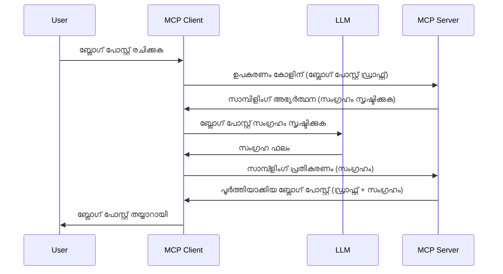

# സാമ്പിളിംഗ് - ക്ലയന്റിന് ഫീച്ചറുകൾ നിയോഗിക്കുക

കഴിഞ്ഞപ്പോൾ, നിങ്ങൾക്ക് MCP ക്ലയന്റും MCP സർവരും ഒരു പൊതു ലക്ഷ്യം കൈവരിക്കാൻ സഹകരിക്കേണ്ടി വരും. സർവർക്ക് ക്ലയന്റിന്റെ LLM സഹായം ആവശ്യമായ ഒരു സന്ദർഭം ഉണ്ടാകാം. ആ സാഹചര്യമെങ്കിൽ, നിങ്ങൾ应该 സാമ്പിളിംഗ് ഉപയോഗിക്കണം.

ചില ഉപയോഗ കേസുകളും സാമ്പിളിംഗ് ഉൾപ്പെടുത്തിയുള്ള പരിഹാരമൊരുക്കുന്നതെങ്ങനെ എന്ന് നോക്കാം.

## അവലോകനം

ഈ പാഠത്തിൽ, സാമ്പിളിംഗ് എപ്പോൾ എവിടെ ഉപയോഗിക്കാമെന്ന്, അത് എങ്ങനെ ക്രമീകരിക്കാമെന്നും വിശദീകരിക്കുകയാണ് ലക്ഷ്യം.

## പഠന ലക്ഷ്യങ്ങൾ

ഈ അധ്യായത്തിൽ, നാം:

- സാമ്പിളിംഗ് എന്താണെന്നും എപ്പോൾ istifadə ചെയ്യണമെന്നുമെ വിശദീകരിക്കും.
- MCP-യിൽ സാമ്പിളിംഗ് എങ്ങനെ ക്രമീകരിക്കാമെന്ന് കാണിക്കും.
- സാമ്പിളിന്റെ പ്രവർത്തന ഉദാഹരണങ്ങൾ നൽകും.

## സാമ്പിളിംഗ് എന്ത്, എന്തുകൊണ്ട് ഉപയോഗിക്കണം?

സാമ്പിളിംഗ് ഒരു പുരോഗമന ഫീച്ചറാണ്, അതിന്റെ പ്രവർത്തനം താഴെപറയുന്ന രീതിയിലാണ്:


### സാമ്പളിംഗ് അഭ്യർത്ഥന

ശരി, ഇപ്പോൾ നമുക്ക് ഒരു വിശ്വാസയോഗ്യമായ സാഹചര്യത്തിന്റെ ഉയരംമീറ്റിയ അവലോകനം കിട്ടിയിരിക്കുന്നു, ഇനി ക്ലയന്റിന് MCP സർവർ തിരികെ അയക്കുന്ന സാമ്പളിംഗ് അഭ്യർത്ഥനയെക്കുറിച്ച് സംസാരിക്കാം. JSON-RPC ഫോർമാറ്റിൽ ഒരു അഭ്യർത്ഥന ഇങ്ങനെ കാണപ്പെടും:

```json
{
  "jsonrpc": "2.0",
  "id": 1,
  "method": "sampling/createMessage",
  "params": {
    "messages": [
      {
        "role": "user",
        "content": {
          "type": "text",
          "text": "Create a blog post summary of the following blog post: <BLOG POST>"
        }
      }
    ],
    "modelPreferences": {
      "hints": [
        {
          "name": "claude-3-sonnet"
        }
      ],
      "intelligencePriority": 0.8,
      "speedPriority": 0.5
    },
    "systemPrompt": "You are a helpful assistant.",
    "maxTokens": 100
  }
}
```

ഇവിടെ ശ്രദ്ധിക്കേണ്ട ചില കാര്യങ്ങളുണ്ട്:

- Prompt, content -> textയുടെ കീഴിൽ, ബ്രോഗ് പോസ്റ്റ് ഉള്ളടക്കം സംക്ഷേപിക്കാൻ LLM-ന് നൽകുന്ന നിർദ്ദേശം ആണ്.

- **modelPreferences**. ഈ വിഭാഗം LLM-നൊപ്പം ഉപയോഗിക്കേണ്ട കോൺഫിഗറേഷനുകൾക്കുള്ള ഒരു അപേക്ഷകമാണ്. ഉപഭോക്താവ് ഈ നിർദ്ദേശങ്ങൾ സ്വീകരിക്കാമോ അല്ലെങ്കിൽ മാറ്റം വരുത്താമോ എന്നത് ഇഷ്ടാനുസൃതമാണ്. ഇവിടെ മോഡൽ, വേഗത, ബുദ്ധിമുട്ട് മുൻഗണന എന്നിവയെക്കുറിച്ച് നിർദ്ദേശങ്ങൾ ഉണ്ട്.
- **systemPrompt**, ഇത് നിങ്ങളുടെ സാധാരണ സിസ്റ്റം പ്രOmpt ആണ്, ഇത് LLM-ന് വ്യക്തിത്വം നൽകുകയും മാർഗ്ഗനിർദ്ദേശങ്ങൾ ഉൾപ്പെടുത്തുകയും ചെയ്യുന്നു.
- **maxTokens**, ഈ ഉടമസ്ഥത ഈ ടാസ്ക്കിന് എത്ര ടോക്കനുകൾ ഉപയോഗിക്കാം എന്ന് നിർദ്ദേശിക്കുന്നു.

### സാമ്പളിംഗ് മറുപടി

ഈ മറുപടി MCP ക്ലയന്റ് MCP സർവറിനു തിരിച്ചയക്കുന്ന മറുപടിയാണ്, ഇത് ക്ലയന്റ് LLM-ന് വിളിച്ചു മറുപടി കാത്ത് അതിനെ അടിസ്ഥാനമാക്കിയുള്ള സന്ദേശം റെഡ്മെട് ചെയ്യുന്ന ഫലം ആണ്. JSON-RPC-യിൽ ഇങ്ങനെ കാണാം:

```json
{
  "jsonrpc": "2.0",
  "id": 1,
  "result": {
    "role": "assistant",
    "content": {
      "type": "text",
      "text": "Here's your abstract <ABSTRACT>"
    },
    "model": "gpt-5",
    "stopReason": "endTurn"
  }
}
```

ബ്രോഗ് പോസ്റ്റ് സംക്ഷേപത്തിന്റെ ആധാരം പോലെ മറുപടി ഉണ്ടെന്നു ശ്രദ്ധിക്കുക. കൂടാതെ ഉപയോഗിച്ച മോഡൽ ഞങ്ങൾ അപേക്ഷിച്ചതു പോലെ അല്ല, "claude-3-sonnet" എന്നതിനു പകരം "gpt-5" ആയതിനും ശ്രദ്ധ വയ്ക്കുക. ഇത് ഉപയോക്താവ് എന്ത് ഉപയോഗിക്കണമെന്ന് തന്റെ അഭിപ്രായം മാറ്റാം എന്നതും നിങ്ങളുടെ സാമ്പളിംഗ് അഭ്യർത്ഥന ഒരു ശുപാർശ മാത്രമാണെന്നു തെളിയിക്കുന്നു.

ശരി, ഇപ്പോൾ നാം പ്രധാന പ്രവാഹം മനസ്സിലാക്കിയിട്ടുണ്ട്, ഉപയോഗപ്രദമായ ടാസ്ക് "ബ്രോഗ് പോസ്റ്റ് സൃഷ്ടിയും സംക്ഷേപവുമൊത്ത്" വരുത്തുമ്പോൾ ഇതിനെ എങ്ങനെ പ്രവർത്തിപ്പിക്കാമെന്ന് നോക്കാം.

### സന്ദേശ തരം

സാമ്പളിംഗ് സന്ദേശങ്ങൾ മാത്രം രചനാത്മക വാചകങ്ങളിലേയ്ക്കല്ല ചുരുങ്ങിയിരിക്കുന്നത്, ചിത്രങ്ങളും ഓഡിയോകളും അയക്കാനാകും. JSON-RPC വലിപ്പം ഇങ്ങനെ വ്യത്യസ്തമാണ്:

**വാചകം**

```json
{
  "type": "text",
  "text": "The message content"
}
```

**ചിത്ര ഉള്ളടക്കം**

```json
{
  "type": "image",
  "data": "base64-encoded-image-data",
  "mimeType": "image/jpeg"
}
```

**ഓഡിയോ ഉള്ളടക്കം**

```json
{
  "type": "audio",
  "data": "base64-encoded-audio-data",
  "mimeType": "audio/wav"
}
```

> NOTE: Sampling-നു കൂടുതൽ വിവരങ്ങൾക്കായി [അധികൃത ഡോക്യുമെന്റേഷൻ](https://modelcontextprotocol.io/specification/2025-06-18/client/sampling) കാണുക

## ക്ലയന്റിൽ സാമ്പൾ ക്രമീകരിക്കുന്നത് എങ്ങനെ

> Note: നിങ്ങൾ ഒരു സർവർ മാത്രമാണ് നിർമ്മിക്കുന്നുവെങ്കിൽ ഇവിടെ ഏറെ ചെയ്യേണ്ടതില്ല.

ഒരു ക്ലയന്റിൽ താഴെ പറയുന്ന ഫീച്ചർ ഇങ്ങനെ വ്യക്തമാക്കണം:

```json
{
  "capabilities": {
    "sampling": {}
  }
}
```

താങ്കൾ തിരഞ്ഞെടുക്കുന്ന ക്ലയന്റ് സർവറുമായി സംരംഭം ആരംഭിക്കുമ്പോൾ ഇത് സ്വയം സ്വീകരിക്കപ്പെടും.

## സാമ്പിളിംഗ് പ്രവർത്തന ഉദാഹരണം - ഒരു ബ്രോഗ് പോസ്റ്റ് സൃഷ്ടിക്കുക

നാം സംയുക്തമായി ഒരു സാമ്പളിംഗ് സർവർ കോഡുചെയ്യാം, വേണ്ടത് നോക്കാം:

1. സർവറിൽ ഒരു ടൂൾ സൃഷ്ടിക്കുക.
2. ആ ടൂൾ ഒരു സാമ്പളിംഗ് അഭ്യർത്ഥന സൃഷ്ടിക്കണം.
3. ക്ലയന്റിന്റെ സാമ്പളിംഗ് അഭ്യർത്ഥനയ്ക്ക് മറുപടി വരാൻ ടൂൾ കാത്തിരിക്കണം.
4. ശേഷം ടൂൾ ഫലം ഉൽപ്പാദിപ്പിക്കണം.

പടിപടിയായി കോഡ് നോക്കാം:

### -1- ടൂൾ സൃഷ്ടിക്കുക

**python**

```python
@mcp.tool()
async def create_blog(title: str, content: str, ctx: Context[ServerSession, None]) -> str:
    """Create a blog post and generate a summary"""

```

### -2- സാമ്പളിംഗ് അഭ്യർത്ഥന സൃഷ്ടിക്കുക

നിങ്ങളുടെ ടൂൾ താഴെ പറയുന്ന കോഡോടെ നീട്ടുക:

**python**

```python
post = BlogPost(
        id=len(posts) + 1,
        title=title,
        content=content,
        abstract=""
    )

prompt = f"Create an abstract of the following blog post: title: {title} and draft: {content} "

result = await ctx.session.create_message(
        messages=[
            SamplingMessage(
                role="user",
                content=TextContent(type="text", text=prompt),
            )
        ],
        max_tokens=100,
)

```

### -3- മറുപടി കാത്തിരിക്കാനും മറുപടി നൽകാനും

**python**

```python
post.abstract = result.content.text

posts.append(post)

# പൂർണ ഉൽപ്പന്നം മടക്കി നൽകുക
return json.dumps({
    "id": post.title,
    "abstract": post.abstract
})
```

### -4- മുഴുവൻ കോഡ്

**python**

```python
from starlette.applications import Starlette
from starlette.routing import Mount, Host

from mcp.server.fastmcp import Context, FastMCP

from mcp.server.session import ServerSession
from mcp.types import SamplingMessage, TextContent

import json


from uuid import uuid4
from typing import List
from pydantic import BaseModel


mcp = FastMCP("Blog post generator")

# app = FastAPI()

posts = []

class BlogPost(BaseModel):
    id: int
    title: str
    content: str
    abstract: str

posts: List[BlogPost] = []

@mcp.tool()
async def create_blog(title: str, content: str, ctx: Context[ServerSession, None]) -> str:
    """Create a blog post and generate a summary"""

    post = BlogPost(
        id=len(posts) + 1,
        title=title,
        content=content,
        abstract=""
    )

    prompt = f"Create an abstract of the following blog post: title: {title} and draft: {content} "

    result = await ctx.session.create_message(
        messages=[
            SamplingMessage(
                role="user",
                content=TextContent(type="text", text=prompt),
            )
        ],
        max_tokens=100,
    )

    post.abstract = result.content.text

    posts.append(post)

    # പൂര്‍ണ്ണമായ ബ്ലോഗ് പോസ്റ്റ് തിരിച്ച് നല്‍കുക
    return json.dumps({
        "id": post.title,
        "abstract": post.abstract
    })

if __name__ == "__main__":
    print("Starting server...")
    # mcp.run()
    mcp.run(transport="streamable-http")

# ആപ്പ് ചെറുക്കാന്‍: python server.py
```

### -5- Visual Studio Code-ൽ ടെസ്റ്റുചെയ്യുന്നത്

Visual Studio Code-ൽ ഇത് പരീക്ഷിക്കാൻ, ഇങ്ങനെ ചെയ്യുക:

1. ടർമിനലിൽ സർവർ ആരംഭിക്കുക
2. ഇത് *mcp.json* ൽ ചേർക്കുക (അങ്ങനെ സർവർ ആരംഭിച്ചിരിക്കണം), ഉദാ:

   ```json
   "servers": {
      "blog-server": {
        "type": "http",
        "url": "http://localhost:8000/mcp"
      }
   }
   ```

1. പ്രോമ്പ്റ്റ് ടൈപ്പ് ചെയ്യുക:

   ```text
   create a blog post named "Where Python comes from", the content is "Python is actually named after Monty Python Flying Circus"
   ```

1. സാമ്പളിംഗ് വന്നതിന് അനുമതി നൽകുക. ആദ്യമായി പരീക്ഷിക്കുമ്പോൾ നിങ്ങൾ ഒരു അധിക ഡയലോഗ് സ്വീകരിക്കേണ്ടിവരും, പിന്നീട് സാധാരണ ടൂൾ പ്രവൃത്തിയ്ക്കാനുള്ള ഡയലോഗ് കാണും

1. ഫലങ്ങൾ പരിശോധിക്കുക. ഫലങ്ങൾ GitHub Copilot Chat-ൽ മനോഹരമായി കാണാനാകും, കൂടാതെ الخام JSON മറുപടി പരിശോധിക്കാനും സാധിക്കും.

**ബോണസ്**. Visual Studio Code-ന്റെ ഉപകരണങ്ങൾ സാമ്പളിംഗിനുകൊണ്ട് മികച്ച പിന്തുണ നൽകുന്നു. സ്ഥാപന സർവറിൽ Sampling-ന്റെ ആക്‌സസ് ക്രമീകരിക്കാൻ:

1. എക്സ്റ്റൻഷൻ വിഭാഗത്തിൽ പോകുക.
1. "MCP SERVERS - INSTALLED" വിഭാഗത്തിൽ നിങ്ങളുടെ ഇൻസ്റ്റാൾ ചെയ്ത സർവറിനുള്ള കോഗ് ഐക്കണ് തിരഞ്ഞെടുക്കുക.
1 "Configure Model Access" തിരഞ്ഞെടുക്കുക, ഇവിടെ Sampling നടത്തുമ്പോൾ GitHub Copilot ഉപയോഗിക്കാൻ അനുവദിക്കുന്ന മോഡലുകൾ തിരഞ്ഞെടുക്കാം. അവസാനകാല Sampling അഭ്യർത്ഥനകൾ കാണാൻ "Show Sampling requests" തിരഞ്ഞെടുക്കാം.

## അസൈൻമെന്റ്

ഈ അസൈൻമെന്റിൽ, നിങ്ങൾ അനുഭവിച്ചുപോയ Sampling-നെപ്പോലെ അല്ലാത്ത ഒരു Sampling ഇന്റഗ്രേഷൻ നിർമ്മിക്കണം, അതായത് ഉത്പന്ന വിവരണം ജനറേറ്റ് ചെയ്യുന്നത് സഹായിക്കുന്ന Sampling სისტემമാണ്. ഇതാ നിങ്ങളുടെ സാഹചര്യങ്ങൾ:

**സന്ദർഭം**: ഒരു ഇ-കോമേഴ്‌സ് ബാക്ക് ഓഫീസിലെ പ്രവർത്തകനു ഉത്പന്ന വിവരണങ്ങൾ സൃഷ്ടിക്കാൻ വളരെ സമയം പോകുന്നു. അതുകൊണ്ട്, നിങ്ങൾ ഒരു ടൂൾ "create_product" "title"നും "keywords"നും ആർക്ക്യമാനമായി വിളിക്കുമ്പോൾ, ക്ലയന്റിന്റെ LLM വിനിയോഗിച്ച് ഒരു പൂർണ്ണമായ ഉത്പന്നം "description" ഫീല்டോടുകൂടി സൃഷ്ടിക്കണം.

TIP: പഠിച്ചിട്ടുള്ളത് ഉപയോഗിച്ച് ഈ സർവർവും ടൂളും സാമ്പളിംഗ് അഭ്യർത്ഥന ഉപയോഗിച്ച് നിർമ്മിക്കുക.

## പരിഹാരം

[പരിഹാരം](./solution/README.md)

## പ്രധാന താൽപ്പര്യങ്ങൾ

സാമ്പളിംഗ് ഒരു ശക്തമായ ഫീച്ചറാണ്, സർവർക്ക് LLM സഹായത്തിനായി ടാസ്കുകൾ ക്ലയന്റിന് നിയോഗിക്കാനും സാധിക്കുന്നു.

## അടുത്തത് കാനോ?

- [അധ്യായം 4 - പ്രായോഗിക നടപ്പാക്കൽ](../../04-PracticalImplementation/README.md)

---

<!-- CO-OP TRANSLATOR DISCLAIMER START -->
**ഡിസ്ക്ലെയ്ിമർ**:  
ഈ ഡോക്യുമെന്റ് AI വിവർത്തന സേവനമായ [Co-op Translator](https://github.com/Azure/co-op-translator) ഉപയോഗിച്ച് വിവർത്തനം ചെയ്തതാണ്. നമുക്ക് നിർവ്യാജമായതിനു ശ്രമിച്ചുയുള്ളതിനാൽ, ഓട്ടോമേറ്റഡ് വിവർത്തനങ്ങളിൽ പിശകുകളും അസൂയാസൂയകളും ഉണ്ടാകാമെന്ന് ദയവായി ശ്രദ്ധിക്കുക. ദയവായി മനസിലാകുക, തന്റേതായ ഭാഷയിലുള്ള യഥാർത്ഥ ഡോക്യുമെന്റ് ചരിത്രപരമായ സൂത്രവാക്യം ആകും. നിർണായകമായ വിവരങ്ങൾക്ക് പ്രൊഫഷണൽ മനുഷ്യ വിവർത്തനം നിർദ്ദേശിക്കുന്നു. ഈ വിവർത്തനം ഉപയോഗിക്കുന്നതിലുണ്ടാകുന്ന യാതൊരു തെറ്റിദ്ധാരണകൾക്കും അല്ലെങ്കിൽ തെറ്റായ വ്യാഖ്യാനങ്ങൾക്കും ഞങ്ങൾ ഉത്തരവാദിത്വം വ്യക്തമായില്ല.
<!-- CO-OP TRANSLATOR DISCLAIMER END -->