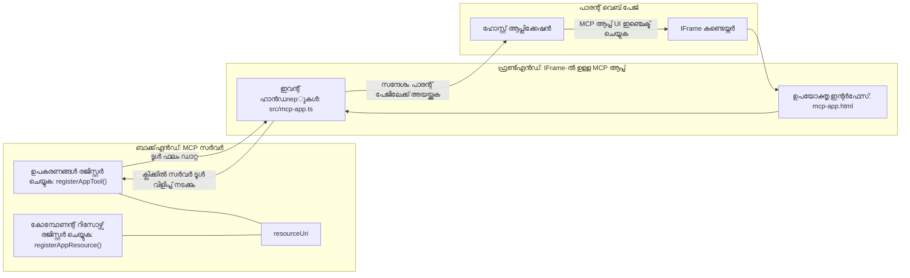

# MCP Apps

MCP Apps MCP ലെ ഒരു പുതിയ പാരഡൈമാണ്. ഒരു ടൂൾ കോൾ നിന്ന് ഡാറ്റ_resp¯ക ഒരുപോലെ നിങ്ങൾ ഈ വിവരത്തോടെ എങ്ങനെ ഇടപഴകേണ്ടതാണെന്ന് സംബന്ധിച്ച വിവരവും നൽകുന്നു. അതായത് ടൂൾ ഫലങ്ങൾ ഇപ്പോൾ UI വിവരങ്ങൾ ഉൾക്കൊള്ളാം. എന്നാൽ നാം അത് എന്തിന് വേണം? നിങ്ങൾ ഇന്ന് എങ്ങനെ കാര്യങ്ങൾ ചെയ്യുന്നു എന്നത് പരിഗണിച്ചാൽ. നിങ്ങൾ MCP സര്‍വ്വറിന്റെ ഫലങ്ങൾ ഉപയോഗിക്കുന്നത് ഏതെങ്കിലും ഫ്രണ്ട്‌എൻഡ് ടൈപ്പ് ഉപയോഗിച്ച് മുന്നിൽ വയ്ക്കുന്നതാണ്, അതു നിങ്ങൾക്ക് എഴുതാനും പരിപാലിക്കാനും വേണ്ടിയുള്ള കോഡാണ്. ചിലപ്പോൾ അതാണ് നിങ്ങൾക്കാവശ്യമുള്ളത്, പക്ഷേ ചിലപ്പോൾ നിങ്ങൾക്ക് ഡാറ്റ മുതൽ ഉപയോക്തൃ ഇന്റർഫേസ് വരെ എല്ലാം സ്വയം സമ്പൂർണമായ ചെറിയ ഒരു വിവരശ്രേഖരം മാത്രം കൊണ്ടുവരാനും കഴിയും എന്നതാണ് നല്ലത്.

## അവലോകനം

ഈ പാഠം MCP Apps-നെപ്പറ്റിയുള്ള പ്രായോഗിക മാർഗ്ഗനിർദ്ദേശങ്ങൾ, അതിൽ തുടങ്ങാൻ എങ്ങനെ, ഇപ്പോഴുള്ള വെബ് അപ്ലിക്കേഷനുകളിൽ എങ്ങനെ ഉൾപ്പെടുത്താമെന്നത് നൽകുന്നു. MCP Apps MCP സ്റ്റാൻഡേർഡിൽ വളരെ പുതിയ ഒരു ചേർക്കലാണ്.

## പഠന ലക്ഷ്യങ്ങൾ

ഈ പാഠം അവസാനിക്കുമ്പോൾ നിങ്ങൾക്ക് കഴിയും:

- MCP Apps എന്താണെന്ന് വിശദീകരിക്കുക.
- MCP Apps എപ്പോഴാണ് ഉപയോഗിക്കേണ്ടത്.
- നിങ്ങളുടെ സ്വന്തം MCP Apps നിർമ്മിച്ച് സംയോജിപ്പിക്കുക.

## MCP Apps - ഇത് എങ്ങനെ പ്രവർത്തിക്കുന്നു

MCP Apps-ന്റെ ആശയമാകുന്നത് എല്ലാ മലയാളത്തിൽ ഒരു ഘടകമെന്നരുതായിരിക്കും റ്റ്രൺസ്‌പോൺസ് നൽകുക എന്നതാണ്. അത്തരത്തിലുള്ള ഘടകത്തിൽ ദൃശ്യങ്ങളും ഇന്ററാക്ടിവിറ്റിയും ഉണ്ടാകാം, ഉദാഹരണത്തിന് ബട്ടൺ ക്ലിക്കുകൾ, ഉപയോക്തൃ ഇൻപുട്ടുകൾ മുതലായവ. മുകൾഭാഗത്ത് ഞങ്ങളുടെ MCP സർവറും ഉള്ള വിഭാഗവും തുടങ്ങാം. MCP App ഘടകം സൃഷ്ടിക്കാൻ നിങ്ങൾ ഒരു ടൂൾ സൃഷ്ടിക്കേണ്ടതാണ് കൂടാതെ ആpliകേേഷൻ റിസോഴ്‌സ് ഉം ഉണ്ടാകണം. ഈ രണ്ടു ഭാഗങ്ങളും resourceUri-വഴിയാണ് ബന്ധിപ്പിക്കുന്നത്.

ഇവിടെ ഒരു ഉദാഹരണം. ഇതിൽ ഏതു ഭാഗം എന്തു ചെയ്യുന്നു എന്നതിനെക്കുറിച്ച് ദൃശ്യമായി കാണാം:

```text
server.ts -- responsible for registering tools and the component as a UI component
src/
  mcp-app.ts -- wiring up event handlers
mcp-app.html -- the user interface
```
  
ഈ ദൃശ്യത്തിൽ ഘടകവും അതിന്റെ ലജിക്കും സൃഷ്ടിക്കുന്ന മൂല്യരൂപം വ്യക്തമാക്കുന്നു.


ഇനി ബാക്ക്എൻഡ്, ഫ്രണ്ട്‌എൻഡ് തത്സമയം ഉത്തരവാദിത്വങ്ങൾ വിവരിക്കാം.

### ബാക്ക്എൻഡ്

നമുക്ക് ഇവിടെ പൂർത്തീകരിക്കേണ്ട കാര്യങ്ങൾ രണ്ട്:

- ഇടപഴകേണ്ട ടൂളുകൾ രജിസ്റ്റർ ചെയ്യുക.
- ഘടകം നിർവചിക്കുക.

**ടൂൾ രജിസ്ട്രേഷൻ**

```typescript
registerAppTool(
    server,
    "get-time",
    {
      title: "Get Time",
      description: "Returns the current server time.",
      inputSchema: {},
      _meta: { ui: { resourceUri } }, // ഈ ഉപകരണത്തെ അതിന്റെ UI സ്രോതസുമായി ബന്ധിപ്പിക്കുന്നു
    },
    async () => {
      const time = new Date().toISOString();
      return { content: [{ type: "text", text: time }] };
    },
  );

```
  
മുന്‍പത്തെ കോഡ് `get-time` എന്ന ടൂൾ ഒരു യുക്തി വിവരിക്കുന്നു. ഇതിന് എൻപുട്ട് ഇല്ലാതെ നിലവിലെ സമയം ആവലാം. ഉപയോക്തൃ ഇൻപুটുകൾ സ്വീകരിക്കാൻ കഴിയുന്ന ടൂളുകൾക്ക് `inputSchema` നിർവചിക്കാൻ കഴിയും.

**ഘടക രജിസ്ട്രേഷൻ**

അതേ ഫയലിൽ ഘടകവും രജിസ്റ്റർ ചെയ്യണം:

```typescript
const resourceUri = "ui://get-time/mcp-app.html";

// UI യുടെ ബണ്ടിൽ ചെയ്ത HTML/JavaScript തിരികെ നൽകുന്ന റിസോഴ്‌സ് രജിസ്റ്റർ ചെയ്യുക.
registerAppResource(
  server,
  resourceUri,
  resourceUri,
  { mimeType: RESOURCE_MIME_TYPE },
  async () => {
    const html = await fs.readFile(path.join(DIST_DIR, "mcp-app.html"), "utf-8");

    return {
    contents: [
        { uri: resourceUri, mimeType: RESOURCE_MIME_TYPE, text: html },
    ],
    };
  },
);
```
  
`resourceUri` ഉപയോഗിച്ച് ഘടകവും ടൂളുകളും ബന്ധിപ്പിക്കുന്നതും, UI ഫയൽ ലോഡ് ചെയ്ത് ഘടകം റിട്ടേൺ ചെയ്യുന്ന callback ഉം ശ്രദ്ധിക്കുക.

### ഘടകത്തിന്റെ ഫ്രണ്ട്‌എൻഡ്

ബാക്ക്എൻഡിനൊപ്പം പോലെ ഇതിൽ രണ്ട് ഭാഗങ്ങൾ ഉണ്ട്:

- ശുദ്ധമായ HTML-ൽ എഴുതി കിടക്കുന്ന ഫ്രണ്ട്‌എൻഡ്.
- ഇവന്റ് കൈകാര്യം ചെയ്യുന്ന, എന്ത് ചെയ്യണമെന്നും നിർവഹിക്കുന്ന കോഡ്, ഉദാഹരണത്തിന് ടൂൾ കോൾ ചെയ്യുക അല്ലെങ്കിൽ മാതൃ വിൻഡോയെ സന്ദേശമയക്കുക.

**ഉപയോക്തൃ ഇന്റർഫേസ്**

ഉപയോക്തൃ ഇന്റർഫേസ് കാണാം:

```html
<!-- mcp-app.html -->
<!DOCTYPE html>
<html lang="en">
  <head>
    <meta charset="UTF-8" />
    <title>Get Time App</title>
  </head>
  <body>
    <p>
      <strong>Server Time:</strong> <code id="server-time">Loading...</code>
    </p>
    <button id="get-time-btn">Get Server Time</button>
    <script type="module" src="/src/mcp-app.ts"></script>
  </body>
</html>
```
  
**ഇവന്റ് വയർഅപ്പ്**

അവസാനഘടകം ഇവന്റ് വയർഅപ്പ്. UI-ലെ ഏത് ഭാഗം ഇവന്റ് ഹാൻഡിലറുകൾക്ക് ആവശ്യമുള്ളതും ഇവന്റ് ഉയർന്ന് വന്നാൽ എന്ത് ചെയ്യണമെന്ന് നിർവ്വചിക്കുന്നതും ഇതാണ്:

```typescript
// mcp-app.ts

import { App } from "@modelcontextprotocol/ext-apps";

// എലമെന്റ് റഫറൻസുകൾ നേടുക
const serverTimeEl = document.getElementById("server-time")!;
const getTimeBtn = document.getElementById("get-time-btn")!;

// ആപ്പ് ഇൻസ്റ്റൻസ് സൃഷ്ടിക്കുക
const app = new App({ name: "Get Time App", version: "1.0.0" });

// സെർവറിൽ നിന്നും ടൂൾ ഫലങ്ങൾ കൈകാര്യം ചെയ്യുക. ആദ്യ ടൂൾ ഫലം മിസ്സായി പോകാതിരിക്കാൻ `app.connect()` മുമ്പായി സജ്ജമാക്കുക
// പ്രാരംഭ ടൂൾ ഫലം നഷ്ടപ്പെടുന്നത് ഒഴിവാക്കുക.
app.ontoolresult = (result) => {
  const time = result.content?.find((c) => c.type === "text")?.text;
  serverTimeEl.textContent = time ?? "[ERROR]";
};

// ബട്ടൺ ക്ലിക്കുകൾ ബന്ധിപ്പിക്കുക
getTimeBtn.addEventListener("click", async () => {
  // `app.callServerTool()` UI യിട്ട് സെർവറിൽ നിന്നുള്ള പുതിയ ഡാറ്റ ചോദിക്കാൻ അനുവദിക്കുന്നു
  const result = await app.callServerTool({ name: "get-time", arguments: {} });
  const time = result.content?.find((c) => c.type === "text")?.text;
  serverTimeEl.textContent = time ?? "[ERROR]";
});

// ഹോസ്റ്റുമായി കണക്റ്റ് ചെയ്യുക
app.connect();
```
  
മുകളിൽ നിന്നും കാണുന്നത് പോലെ ഇത് DOM ഘടകങ്ങളെ ഇവന്റുകളുമായി ബന്ധപ്പെട്ടിരിക്കുന്ന സാധാരണ കോഡാണ്. `callServerTool` എന്ന കോൾ ബാക്ക്എൻഡിലെ ടൂൾ കോൾ ചെയ്യുക എന്നത് ശ്രദ്ധേയമാണ്.

## ഉപയോ​ക്ടൃ ഇൻപുട്ട് കൈകാര്യം ചെയ്യൽ

ഇപ്പോൾ വരെ, ഞങ്ങൾ ഉണ്ടാക്കിയ ഘടകത്തിൽ ബട്ടൺ ക്ലിക്കിംഗിലൂടെ ടൂൾ കോൾ ചെയ്യുന്നു. ഇനി ഇൻപുട്ട് ഫീൽഡ് പോലുള്ള UI ഘടകങ്ങൾ ചേർത്ത് ടൂളിലേക്ക് പാരാമീറ്ററുകൾ അയച്ചേക്കാമോ എന്ന് നോക്കാം. FAQ ഫംഗ്ഷണാലിറ്റി നടപ്പിലാക്കാം. ഇത് എങ്ങനെ പ്രവർത്തിക്കണം:

- ഒരു ബട്ടണും ഉപയോക്താവ് "Shipping" പോലുള്ള ഒരു കീവേഡ് ടൈപ്പുചെയ്യാനുള്ള ഇൻപുട്ട് എലമെന്റും വേണം. ഇത് ബാക്ക്എൻഡിലെ ഒരു ടൂൾ കോൾ ചെയ്യും, അത് FAQ ഡാറ്റയിൽ തിരയലാണ് നടത്തേണ്ടത്.
- മുകളിൽ പറഞ്ഞിരിക്കുന്ന FAQ തിരയലിനായി പിന്തുണയുള്ള ഒരു ടൂൾ വേണം.

ആദ്യമേ ബാക്ക്എൻഡ് പിന്തുണ ചേർക്കാം:

```typescript
const faq: { [key: string]: string } = {
    "shipping": "Our standard shipping time is 3-5 business days.",
    "return policy": "You can return any item within 30 days of purchase.",
    "warranty": "All products come with a 1-year warranty covering manufacturing defects.",
  }

registerAppTool(
    server,
    "get-faq",
    {
      title: "Search FAQ",
      description: "Searches the FAQ for relevant answers.",
      inputSchema: zod.object({
        query: zod.string().default("shipping"),
      }),
      _meta: { ui: { resourceUri: faqResourceUri } }, // ഈ ടൂളിനെ അതിന്റെ UI സ്രോതസുമായി ബന്ധിപ്പിക്കുന്നു
    },
    async ({ query }) => {
      const answer: string = faq[query.toLowerCase()] || "Sorry, I don't have an answer for that.";
      return { content: [{ type: "text", text: answer }] };
    },
  );
```
  
`inputSchema` എങ്ങനെ നല്കുന്നു എന്നും `zod` സ്കീമയുടെ ഉദാഹരണം കാണാം:

```typescript
inputSchema: zod.object({
  query: zod.string().default("shipping"),
})
```
  
മുകളിൽ സ്കീമയിൽ `query` എന്ന ഇൻപുട്ട് പരാമീറ്റർ ആണെന്ന് പ്രഖ്യാപിക്കുന്നു, ഇത് ഐച്ഛികമാണ്, ഡിഫോൾട്ട് വില "shipping" ആയി സജ്ജമാക്കിയിട്ടുണ്ട്.

ശരി, *mcp-app.html* എന്ന പേജിലേക്ക് പോകാം, ഇത് ഉണ്ടാക്കേണ്ട UI ഇങ്ങനെ കാണാം:

```html
<div class="faq">
    <h1>FAQ response</h1>
    <p>FAQ Response: <code id="faq-response">Loading...</code></p>
    <input type="text" id="faq-query" placeholder="Enter FAQ query" />
    <button id="get-faq-btn">Get FAQ Response</button>
  </div>
```
  
ഭംഗിയാ, ഇനി ഇൻപുട്ട് എലമെന്റ്, ബട്ടൺ എന്നിവ ഉപയോഗിക്കുന്നു. *mcp-app.ts* എന്ന കോഡ് പരിശോധിച്ച് ഇവന്റ് വയർഅപ്പ് ചെയ്യാം:

```typescript
const getFaqBtn = document.getElementById("get-faq-btn")!;
const faqQueryInput = document.getElementById("faq-query") as HTMLInputElement;

getFaqBtn.addEventListener("click", async () => {
  const query = faqQueryInput.value;
  const result = await app.callServerTool({ name: "get-faq", arguments: { query } });
  const faq = result.content?.find((c) => c.type === "text")?.text;
  faqResponseEl.textContent = faq ?? "[ERROR]";
});
```
  
മുകളിലുള്ള കോഡിൽ:

- ഇന്ററാക്ടീവ് UI എലമെന്റുകളുടെ റഫറൻസുകൾ സൃഷ്ടിക്കുന്നു.
- ബട്ടൺ ക്ലിക്കിൽ ഇൻപുട്ട് വാല്യു പാർസ് ചെയ്ത് `app.callServerTool()` വിളിക്കുന്നു, കൂടെ `name`യും `arguments`കളും നൽകുന്നു, ഇവിടെ `query` പാരാമീറ്ററായി പാസ് ചെയ്യുന്നു.

`callServerTool` വിളിക്കുന്നത് ഒരു മെസേജ് മാതൃ വിൻഡോയ്ക്ക് അയക്കുകയും അത് MCP സർവറെ വിളിക്കുകയും ചെയ്യുന്നു.

### പരീക്ഷിക്കു

ഇപ്പോൾ പരീക്ഷിച്ചു നോക്കുന്നതിൽ താഴെ കാണുന്നതുപോലെ ഫലങ്ങൾ ഉണ്ടാകും:


ഇനിയും "warranty" പോലുള്ള ഇൻപുട്ടോടുകൂടി പരീക്ഷിക്കുന്നതും:


ഈ കോഡ് പ്രവർത്തിപ്പിക്കാൻ, [Code section](./code/README.md) സന്ദർശിക്കുക

## Visual Studio Code ൽ ട്രോസ്റ്റിങ്ങ്

Visual Studio Code MCP Apps-നെക്കുറിച്ച് മികച്ച പിന്തുണ നൽകുന്നു, MCP Apps ടെസ്റ്റ് ചെയ്യേണ്ട ഏറ്റവും എളുപ്പമാർഗ്ഗങ്ങളിൽ ഒന്നാണ്. Visual Studio Code ഉപയോഗിക്കാൻ, *mcp.json* ൽ ഒരു സർവർ എൻട്രി ചേർക്കുക:

```json
"my-mcp-server-7178eca7": {
    "url": "http://localhost:3001/mcp",
    "type": "http"
  }
```
  
പിന്നീട് സർവർ ആരംഭിക്കുക, GitHub Copilot ഇൻസ്റ്റാൾ ചെയ്തിട്ടുണ്ടെങ്കിൽ ചാറ്റ് വിൻഡോ വഴി MCP App-നോട് ആശയവിനിമയം നടത്താനാകും.

ഇതു ഒരു പ്രോംപ്റ്റിലൂടെ തുടക്കമാകാം, ഉദാഹരണത്തിന് "#get-faq":


വെബ് ബ്രൗസർ വഴി നടത്തിയത് പോലെ തന്നെ റൻ ചെയ്യുന്നു, ഇങ്ങനെ:


## അസൈൻമെന്റ്

റോക്ക് പേപ്പർ സിസ്സർ ഗെയിം സൃഷ്ടിക്കുക. വിശദാംശങ്ങൾ:

UI:

- ഓപ്ഷൻ ഉള്ള ഡ്രോപ്പ് ഡൗൺ ലിസ്റ്റ്
- തെരഞ്ഞെടുക്കുന്നതിന് ബട്ടൺ
- ആരാണ് എന്തു തിരഞ്ഞെടുക്കിയത്, ആരാണ് ജയിച്ചത് എന്ന് കാണിക്കുന്ന ലേബൽ

സർവർ:

- "choice" എൻപുട്ടായി എടുത്തുകൊണ്ടുള്ള റോക്ക് പേപ്പർ സിസ്സർ ടൂൾ
- കമ്പ്യൂട്ടർ തെരഞ്ഞെടുപ്പും വിജയിയെ നിർണ്ണയിക്കുകയും ചെയ്യുക

## പരിഹാരം

[Solution](./assignment/README.md)

## ചുരുക്കം

MCP Apps എന്ന പുതിയ പാരഡൈം അറിയണം. MCP സർവർ ഡാറ്റയ്ക്ക് മാത്രമല്ല, ഈ ഡാറ്റ എങ്ങനെ പ്രദർശിപ്പിക്കണം എന്നും അഭിപ്രായം പറയാൻ സാധിക്കുന്ന പുതിയ രീതിയാണ്.

കൂടാതെ MCP Apps IFrame-ൽ ഹോസ്റ്റ് ചെയ്യപ്പെടുന്നു, MCP സർവറുമായി ആശയവിനിമയം നടത്താൻ മാതൃ വെബ് ആപ്പ് സന്ദേശങ്ങൾ അയയ്ക്കണം. ഇത് എളുപ്പമാക്കാൻ പല plain JavaScript-നും React-നും മറ്റു ലൈബ്രറികളും പരീക്ഷിച്ചിരിക്കുന്നു.

## പ്രധാന കണ്ടെത്തലുകൾ

നിങ്ങൾ പഠിച്ചത്:

- MCP Apps പുതിയ സ്റ്റാൻഡേർഡാണ്, ഡാറ്റയും UI ഫീച്ചറുകളും ഒരുമിച്ച് അയയ്‌ക്കാൻ സഹായിക്കുന്നു.
- ഈ ആപ്പുകൾ സുരക്ഷിതത്വത്തിന് IFrame-ൽ പ്രവർത്തിക്കുന്നു.

## മുന്നോട്ട് ചെയ്യേണ്ടത്

- [Chapter 4](../../04-PracticalImplementation/README.md)

---

<!-- CO-OP TRANSLATOR DISCLAIMER START -->
**അസ്വീകരണം**:  
ഈ രേഖ [Co-op Translator](https://github.com/Azure/co-op-translator) എന്ന എഐ ഭാഷാന്തര സേവനം ഉപയോഗിച്ച് വിവർത്തനം ചെയ്തതാണ്. ധാരാളം കൃത്യത നേടാനുള്ള ശ്രമം നടന്നിട്ടുള്ളതായിരുന്നാലും, സ്വയംഭരണ വിവർത്തനങ്ങളിൽ പിശകുകൾ അല്ലെങ്കിൽ അശുദ്ധതകൾ ഉണ്ടായിരിക്കാമെന്ന് ദയവായി ശ്രദ്ധിക്കുക. അതിവശപ്പെട്ട വിവരങ്ങൾക്കായി, തദ്ദേശീയ ഭാഷയിലെ യഥാർത്ഥ രേഖയാണ് പ്രാമാണികമായ ഉറവിടം എന്ന് പരിഗണിക്കണം. നിർണായക വിവരങ്ങൾക്ക് പ്രൊഫഷണൽ മാനവ വിവർത്തനം ശുപാർശചെയ്യപ്പെടുന്നു. ഈ വിവർത്തനത്തിന്റെ ഉപയോഗത്തിൽ നിന്നുണ്ടാവുന്ന ഏതൊരു തെറ്റ理解ലുകൾക്കോ തെറ്റായ വ്യാഖ്യാനങ്ങൾക്കോ ഞങ്ങൾ ബാധ്യത വഹിച്ചിട്ടില്ല.
<!-- CO-OP TRANSLATOR DISCLAIMER END -->