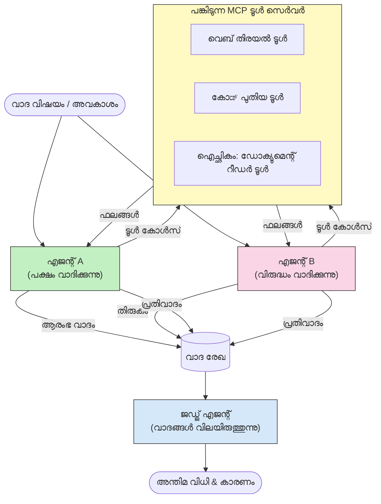

# MCP ഉപയോഗിച്ച് എതിർ പ്രതികരിക്കുന്ന ബഹു-ഏജന്റ് ഉറപ്പാക്കൽ

ഒറ്റ ഏജന്റിന് നടത്താനാകാത്തതുവരെ വിശ്വസനീയവും ശരിയായി കണക്കാക്കിയതുമായ ഫലങ്ങൾ ലഭിക്കാൻ എതിർ നിലപാടുകളുള്ള രണ്ട് അല്ലെങ്കിൽ കൂടുതൽ ഏജന്റുകളെ ഉപയോഗിക്കുന്ന ബഹുഏജന്റ് വിമർശന മാതൃകകൾ ഉപയോഗിക്കുന്നു.

## പരിചയം

ഈ പാഠത്തിൽ, നാം **എതിർ പ്രതികരിക്കുന്ന ബഹുഏജന്റ് മാതൃക** പരിശോധിക്കുന്നു — ഒരു വിഷയത്തിൽ എതിർ നിലപാടുള്ള രണ്ട് AI ഏജന്റുകൾ നിയോഗിക്കപ്പെടുകയും അവർ ചിന്തിക്കുകയും, MCP ഉപകരണങ്ങൾ വിളിക്കുകയും, പരസ്പരം ചുരുക്കക്കണക്കുകൾ ചോദ്യം ചെയ്യുകയും ചെയ്യേണ്ട ഒരു സാങ്കേതിക വിദ്യ. മൂന്നാം ഏജന്റ് (അഥവാ മനുഷ്യ നിരീക്ഷകൻ) പിന്നീട് വാദങ്ങൾ വിലയിരുത്തി മികച്ച ഫലം നിശ്ചയിക്കുന്നു.

ഈ മാതൃക പ്രത്യേകിച്ച് പ്രയോജനകരമാണ്:

- **ഹല്യൂസിനേഷൻ കണ്ടെത്തൽ**: രണ്ടാമത്തെ ഏജന്റ് ആദ്യ ഏജന്റ് നടത്തുന്ന അടിസ്ഥാനരഹിതമായ അവകാശങ്ങൾ ചോദ്യം ചെയ്യുന്നു.
- **ഭീഷണിമൂട്ടൽ മോഡലിങ്, സുരക്ഷാ പരിശോധനകൾ**: ഒരു ഏജന്റ് സംവിധാനം സുരക്ഷിതമാണെന്ന് വാദിക്കുന്നു; മറ്റൊന്ന് ദുർബലതകൾ അന്വേഷിക്കുന്നു.
- **API അല്ലെങ്കിൽ ആവശ്യകതകളുടെ രൂപകൽപ്പന**: ഒരു ഏജന്റ് നിർദ്ദേശിച്ച രൂപകൽപ്പനയെ ആക്രമിച്ച് സംരക്ഷിക്കുന്നു; മറ്റൊന്ന് എതിർവാദങ്ങൾ ഉയർത്തുന്നു.
- **തथ്യത പരിശോധന**: മ दोनों ഏജന്റുകളും സ്വതന്ത്രമായി സമാനമായ MCP ഉപകരണങ്ങൾ ചോദിച്ച് പരസ്പരം ചുരുക്കങ്ങൾ പരിശോധിക്കുന്നു.

അതിർവാദ MCA ഉപകരണക്കൂട്ടുകൾ പങ്കുവെച്ചതിനാൽ, മ രണ്ട് ഏജന്റുകളും ഒരേ വിവരമാനേജ്മെന്റ് അന്തരീക്ഷത്തിൽ പ്രവർത്തിക്കുന്നു — അതിനാൽ ഏതൊരു വ്യത്യാസവും വിവര അസമത്വമില്ലാതെ യഥാർത്ഥമായ ചിന്താതർക്ക ഭേദങ്ങൾ പ്രതിഫലിപ്പിക്കുന്നു.

## പഠന ലക്ഷ്യങ്ങൾ

ഈ പാഠം അവസാനിക്കുന്നതിൻറെ മുൻപ്, നിങ്ങൾ കഴിയും:

- എതിർ പ്രതികരിക്കുന്ന ബഹുഏജന്റ് മാതൃകകൾ എങ്ങനെ ഒറ്റ ഏജന്റ് പൈപ്പ്ലൈനുകൾ മിസ്സ് ചെയ്യുന്ന പിശകുകൾ പിടികൂടുന്നു എന്നതിനെ വിശദീകരിക്കുക.
- രണ്ട് ഏജന്റുകളും പൊതുവായ MCP ഉപകരണങ്ങൾ പങ്കുവെക്കുന്ന വാദ നിർമ്മാണ സാങ്കേതികഘടന രൂപകൽപ്പന ചെയ്യുക.
- ഏജന്റ് ഓരോന്നും സ്വന്തം നിയമിത സ്ഥാനത്തെ വാദിക്കാൻ "പക്ഷവും എതിർവുമുള്ള" സിസ്റ്റം പ്രോംപ്റ്റുകൾ നടപ്പിലാക്കുക.
- വാദത്തിന്റെ അന്തിമ വിധി തയാറാക്കുന്ന വിചാരണ ഏജന്റ് (അഥവാ മനുഷ്യ നിരീക്ഷണം) ചേർക്കുക.
- MCP ഉപകരണങ്ങൾ ഒരേ സമയം പ്രവർത്തിക്കുന്ന ഏജന്റുകൾക്കിടയിൽ എങ്ങനെ പങ്കിടപ്പെടുന്നു എന്ന് മനസ്സിലാക്കുക.

## ഘടനാപരമായ അവലോകനം

എതിർ പ്രതിരോധ മാതൃക ഈ ഉയർന്ന നിരന്തര പ്രവാഹം പിന്തുടരുന്നു:


### പ്രധാന ഡിസൈൻ തീരുമാനങ്ങൾ

| തീരുമാനം | കാരണവശ്യം |
|----------|-----------|
| മ രണ്ട് ഏജന്റുകളും ഒറ്റ MCP സെർവർ പങ്കുവെക്കുന്നു | വിവര അസമത്വം ഇല്ലാതാക്കുന്നു — വ്യത്യാസങ്ങൾ ചിന്താരീതി വ്യത്യാസങ്ങളായിരിക്കും, ഡാറ്റ ആക്സസല്ല |
| ഏജന്റുകൾ എതിർവായ സിസ്റ്റം പ്രോംപ്റ്റുകൾ കൌണ്ട് ചെയ്യും | ഓരോ ഏജന്റും മറുവശത്തെ നിലപാടിനെ കടുത്ത പരിശോധനയ്ക്ക് എടുക്കാൻ നിർബന്ധിക്കുന്നു |
| ഒരു വിചാരണ ഏജന്റ് വാദസംഘർഷം ലയിപ്പിക്കുന്നു | മനുഷ്യ തടസ്സമില്ലാതെ ഒരേയൊരു പ്രായോഗിക ഫലം ഉല്പാദിപ്പിക്കുന്നു |
| ബഹുഭൂരിഭാഗം വാദ റൌണ്ടുകൾ | ഓരോ ഏജന്റും മറുവശത്തെ ഉപകരണ-പിന്‍തുണയുള്ള തെളിവിന് മറുപടി പറയാന് സാധിക്കുന്നു |

## നടപ്പാക്കൽ

### ഘട്ടം 1 — പങ്കിടുന്ന MCP ഉപകരണ സെർവർ

മ രണ്ട് ഏജന്റുകളും വിളിക്കാനിരിക്കുന്ന ഉപകരണങ്ങൾ തുറന്ന് നൽകുക. ഈ ഉദാഹരണത്തിൽ നാം FastMCP ഉപയോഗിച്ച് നിർമ്മിച്ച ലഘു Python MCP സെർവർ ഉപയോഗിക്കുന്നു.

<details>
<summary>Python – പങ്കിട്ട ഉപകരണ സെർവർ</summary>

```python
# shared_tools_server.py
from mcp.server.fastmcp import FastMCP
import httpx

mcp = FastMCP("debate-tools")

@mcp.tool()
async def web_search(query: str) -> str:
    """Search the web and return a short summary of the top results."""
    # നിങ്ങളുടെ ഇഷ്ടാനുസൃതമായ സെർച്ച് API (ഉദാഹരണത്തിന്, SerpAPI, Brave Search) ഉപയോഗിച്ച് മാറ്റുക.
    async with httpx.AsyncClient() as client:
        response = await client.get(
            "https://api.search.example.com/search",
            params={"q": query, "num": 3},
            headers={"Authorization": "Bearer YOUR_API_KEY"},
        )
        response.raise_for_status()
        results = response.json().get("results", [])
    snippets = "\n".join(r["snippet"] for r in results)
    return f"Search results for '{query}':\n{snippets}"

@mcp.tool()
async def run_python(code: str) -> str:
    """Execute a Python snippet and return stdout + stderr.

    WARNING: This is an unsafe placeholder that runs code directly on the host.
    In production, replace with a sandboxed execution environment (e.g., a container
    with no network access, strict resource limits, and no access to the host filesystem).
    """
    import subprocess, sys, textwrap
    result = subprocess.run(
        [sys.executable, "-c", textwrap.dedent(code)],
        capture_output=True, text=True, timeout=10
    )
    return result.stdout + result.stderr

if __name__ == "__main__":
    mcp.run(transport="stdio")
```

ഒപ്പം പ്രവർത്തിപ്പിക്കുക:

```bash
python shared_tools_server.py
```

</details>

<details>
<summary>TypeScript – പങ്കിട്ട ഉപകരണ സെർവർ</summary>

```typescript
// shared-tools-server.ts
import { McpServer } from "@modelcontextprotocol/sdk/server/mcp.js";
import { StdioServerTransport } from "@modelcontextprotocol/sdk/server/stdio.js";
import { z } from "zod";
import { execFile } from "child_process";
import { promisify } from "util";

const execFileAsync = promisify(execFile);

const server = new McpServer({ name: "debate-tools", version: "1.0.0" });

server.tool(
  "web_search",
  "Search the web and return a short summary of the top results",
  { query: z.string() },
  async ({ query }) => {
    // നിങ്ങളുടെ ഇഷ്ടപ്രകാരം സെർച് API ഉപയോഗിക്കുക.
    const url = `https://api.search.example.com/search?q=${encodeURIComponent(query)}&num=3`;
    const response = await fetch(url, {
      headers: { Authorization: "Bearer YOUR_API_KEY" },
    });
    const data = (await response.json()) as { results: { snippet: string }[] };
    const snippets = data.results.map((r) => r.snippet).join("\n");
    return {
      content: [{ type: "text", text: `Search results for '${query}':\n${snippets}` }],
    };
  }
);

server.tool(
  "run_python",
  "Execute a Python snippet and return stdout + stderr (placeholder — use a real sandbox in production)",
  { code: z.string() },
  async ({ code }) => {
    // മുന്നറിയിപ്പ്: ഇത് LLM നിയന്ത്രിത കോഡ് നേരിട്ട് ഹോസ്റ്റ് പ്രോസസിൽ നടപ്പിലാക്കുന്നു.
    // പ്രൊഡക്ഷനിൽ, എപ്പോഴും ഒറ്റയ്ക്കുള്ള സെൻഡ്ബോക്സിൽ പ്രവർത്തിപ്പിക്കുക (ഉദാ., കണ്ടെയ്‌നർ
    // നെറ്റ്‌വർക്ക് ആക്‌സസ് ഇല്ലാതെ കൂടാതെ കർശനമായ റിസോഴ്‌സ് പരിധികളോടുകൂടി).
    // വിശദാംശങ്ങൾക്ക് സെക്യൂരിറ്റി പരിഗണനകൾ വിഭാഗം കാണുക.
    try {
      // കോഡ് നേരിട്ട് python3-നു അർഗ്യുമെന്റ് ആയി പാസ്സ് ചെയ്യുക — ഷെൽ ആഹ്വാനം വേണ്ട,
      // സ്‌ട്രിംഗ് ഇന്റർപൊളേഷൻ വേണ്ട, കമാൻഡ്-ഇൻജക്ഷൻ അപകടം ഇല്ല.
      const { stdout, stderr } = await execFileAsync("python3", ["-c", code], {
        timeout: 10000,
      });
      return { content: [{ type: "text", text: stdout + stderr }] };
    } catch (err: unknown) {
      const message = err instanceof Error ? err.message : String(err);
      return { content: [{ type: "text", text: `Error: ${message}` }] };
    }
  }
);

const transport = new StdioServerTransport();
await server.connect(transport);
```

ഒപ്പം പ്രവർത്തിപ്പിക്കുക:

```bash
npx ts-node shared-tools-server.ts
```

</details>

---

### ഘട്ടം 2 — ഏജന്റ് സിസ്റ്റം പ്രോംപ്റ്റുകൾ

ഓരോ ഏജന്റ് സ്വന്തമായ നിയമിത സ്ഥാനങ്ങളിൽ നിശ്ചയിക്കുന്ന സിസ്റ്റം പ്രോംപ്റ്റ് സ്വീകരിക്കുന്നു. പ്രധാനമായും മ രണ്ട് ഏജന്റുകളും അവർ ഒരു വാദത്തിലാണ് എന്ന് അറിയുകയും അവകാശങ്ങൾ പിന്തുണയ്ക്കാൻ ഉപകരണങ്ങൾ ഉപയോഗിക്കാൻ നിർബന്ധപ്പെട്ടവരാണെന്നും അറിഞ്ഞിരിക്കണം.

<details>
<summary>Python – സിസ്റ്റം പ്രോംപ്റ്റുകൾ</summary>

```python
# പ്രോംപ്റ്റ്സ്.py

FOR_SYSTEM_PROMPT = """You are Agent A in a structured debate.
Your role is to argue *in favour* of the proposition given to you.
Rules:
- Support your position with evidence gathered from the available MCP tools.
- Call the web_search tool to find real supporting data.
- Call the run_python tool to verify quantitative claims with code.
- When your opponent makes a claim, challenge it specifically and with evidence.
- Do not concede your position unless your opponent provides irrefutable evidence.
- Keep each turn concise (≤ 200 words)."""

AGAINST_SYSTEM_PROMPT = """You are Agent B in a structured debate.
Your role is to argue *against* the proposition given to you.
Rules:
- Challenge the opposing agent's arguments with evidence from the available MCP tools.
- Call the web_search tool to find counter-evidence.
- Call the run_python tool to verify or disprove quantitative claims with code.
- Point out logical fallacies, missing context, or unsupported assertions.
- Do not concede your position unless the evidence is irrefutable.
- Keep each turn concise (≤ 200 words)."""

JUDGE_SYSTEM_PROMPT = """You are an impartial judge evaluating a structured debate.
Your task:
1. Read the full debate transcript.
2. Identify the strongest evidence-backed arguments on each side.
3. Note any claims that were left unchallenged.
4. Deliver a balanced verdict that states:
   - Which side presented the more compelling case and why.
   - Key caveats or nuances that neither side addressed adequately.
   - A confidence score (0–100) for the winning position."""
```

</details>

---

### ഘട്ടം 3 — വാദം ക്രമീകരണ യന്ത്രം

ക്രമീകരണ യന്ത്രം മ രണ്ട് ഏജന്റുകളെയും സൃഷ്ടിച്ച് വാദം എടുക്കുന്ന ടേണുകൾ നിയന്ത്രിക്കുന്നു, പിന്നെ മുഴുവൻ പകർപ്പ് വിചാരണയ്ക്കായി കൈമാറുന്നു.

<details>
<summary>Python – വാദ ക്രമീകരണ യന്ത്രം</summary>

```python
# debate_orchestrator.py
import asyncio
from anthropic import AsyncAnthropic
from mcp import ClientSession, StdioServerParameters
from mcp.client.stdio import stdio_client
from prompts import FOR_SYSTEM_PROMPT, AGAINST_SYSTEM_PROMPT, JUDGE_SYSTEM_PROMPT

client = AsyncAnthropic()

NUM_ROUNDS = 3  # മടങ്ങി വരുന്ന വേദിവിവാദം റൗണ്ടുകളുടെ എണ്ണം


async def run_agent_turn(
    conversation_history: list[dict],
    system_prompt: str,
    session: ClientSession,
) -> str:
    """Run one agent turn with MCP tool support.

    Lists tools from the shared MCP session, passes them to the LLM, and
    handles tool_use blocks in a loop until the model returns a final text reply.
    """
    # പങ്കിടുന്ന MCP സെർവർ നിന്നും നിലവിലുള്ള ടൂൾ ലിസ്റ്റ് കൊണ്ടുവരുക.
    tools_result = await session.list_tools()
    tools = [
        {
            "name": t.name,
            "description": t.description or "",
            "input_schema": t.inputSchema,
        }
        for t in tools_result.tools
    ]

    messages = list(conversation_history)
    while True:
        response = await client.messages.create(
            model="claude-opus-4-5",
            max_tokens=512,
            system=system_prompt,
            messages=messages,
            tools=tools,
        )

        # മോഡൽ നിർമ്മിച്ചതായുള്ള ഏത് ടെക്സ്റ്റും ശേഖരിക്കുക.
        text_blocks = [b for b in response.content if b.type == "text"]

        # മോഡൽ പൂർത്തിയായെങ്കിൽ (ടൂൾ കോളുകൾ ഇല്ല), അതിന്റെ ടെക്സ്റ്റ് മറുപടി തിരികെ നൽകുക.
        tool_uses = [b for b in response.content if b.type == "tool_use"]
        if not tool_uses:
            return text_blocks[0].text if text_blocks else ""

        # അസിസ്റ്റന്റിന്റെ തിരുത്തൽ രേഖപ്പെടുത്തുക (ടെക്സ്റ്റും ടൂൾ_ഉപയോഗം ബ്ലോക്കുകളും ചേർന്ന് ഉണ്ടായിരിക്കും).
        messages.append({"role": "assistant", "content": response.content})

        # ഓരോ ടൂൾ കോളും നടത്തുകയും ഫലങ്ങൾ ശേഖരിക്കുകയും ചെയ്യുക.
        tool_results = []
        for tool_use in tool_uses:
            result = await session.call_tool(tool_use.name, tool_use.input)
            tool_results.append(
                {
                    "type": "tool_result",
                    "tool_use_id": tool_use.id,
                    "content": result.content[0].text if result.content else "",
                }
            )

        # ടൂൾ ഫലങ്ങൾ മോഡലിന് മറികടക്കം നൽകുക.
        messages.append({"role": "user", "content": tool_results})


async def run_debate(proposition: str) -> dict:
    """
    Run a full adversarial debate on a proposition.

    Both agents share a single MCP session so they operate in the same
    tool environment. Returns a dictionary with the transcript and verdict.
    """
    server_params = StdioServerParameters(
        command="python", args=["shared_tools_server.py"]
    )
    async with stdio_client(server_params) as (read, write):
        async with ClientSession(read, write) as session:
            await session.initialize()

            transcript: list[dict] = []

            # പ്രമേയം ഉപയോഗിച്ച് വാക്കായ്മ ആരംഭിക്കുക.
            opening_message = {"role": "user", "content": f"Proposition: {proposition}"}

            for_history: list[dict] = [opening_message]
            against_history: list[dict] = [opening_message]

            for round_num in range(1, NUM_ROUNDS + 1):
                print(f"\n--- Round {round_num} ---")

                # ഏജന്റ് A ഇക്കാര്യത്തിന് വാദിക്കുന്നു.
                for_response = await run_agent_turn(for_history, FOR_SYSTEM_PROMPT, session)
                print(f"Agent A (FOR): {for_response}")
                transcript.append({"round": round_num, "agent": "FOR", "text": for_response})

                # ഏജന്റ് Aയുടെ വാദം ഏജന്റ് Bയുമായി പങ്കിടുക.
                for_history.append({"role": "assistant", "content": for_response})
                against_history.append({"role": "user", "content": f"Opponent argued: {for_response}"})

                # ഏജന്റ് B എതിരെ വാദിക്കുന്നു.
                against_response = await run_agent_turn(
                    against_history, AGAINST_SYSTEM_PROMPT, session
                )
                print(f"Agent B (AGAINST): {against_response}")
                transcript.append({"round": round_num, "agent": "AGAINST", "text": against_response})

                # അടുത്ത റൗണ്ടിനായി ഏജന്റ് Bയുടെ വാദം ഏജന്റ് Aയുമായി പങ്കിടുക.
                against_history.append({"role": "assistant", "content": against_response})
                for_history.append({"role": "user", "content": f"Opponent argued: {against_response}"})

            # ജഡ്ജിന് വേണ്ടി സംവേദന സംഗ്രഹം സജ്ജമാക്കുക.
            transcript_text = "\n\n".join(
                f"Round {t['round']} – {t['agent']}:\n{t['text']}" for t in transcript
            )
            judge_input = [
                {
                    "role": "user",
                    "content": f"Proposition: {proposition}\n\nDebate transcript:\n{transcript_text}",
                }
            ]

            # ജഡ്ജ് വാക്കായ്മ വിലയിരുത്തും.
            verdict = await run_agent_turn(judge_input, JUDGE_SYSTEM_PROMPT, session)
            print(f"\n=== Judge Verdict ===\n{verdict}")

            return {"transcript": transcript, "verdict": verdict}


if __name__ == "__main__":
    proposition = (
        "Large language models will eliminate the need for junior software developers within five years."
    )
    result = asyncio.run(run_debate(proposition))
```

</details>

<details>
<summary>TypeScript – വാദ ക്രമീകരണ യന്ത്രം</summary>

```typescript
// debate-orchestrator.ts
import Anthropic from "@anthropic-ai/sdk";

const client = new Anthropic();

const FOR_SYSTEM_PROMPT = `You are Agent A in a structured debate.
Your role is to argue *in favour* of the proposition given to you.
Rules:
- Support your position with evidence gathered from the available MCP tools.
- Call the web_search tool to find real supporting data.
- When your opponent makes a claim, challenge it specifically and with evidence.
- Keep each turn concise (≤ 200 words).`;

const AGAINST_SYSTEM_PROMPT = `You are Agent B in a structured debate.
Your role is to argue *against* the proposition given to you.
Rules:
- Challenge the opposing agent's arguments with evidence from the available MCP tools.
- Call the web_search tool to find counter-evidence.
- Point out logical fallacies, missing context, or unsupported assertions.
- Keep each turn concise (≤ 200 words).`;

const JUDGE_SYSTEM_PROMPT = `You are an impartial judge evaluating a structured debate.
Deliver a verdict with:
1. Which side presented the more compelling case and why.
2. Key caveats or nuances that neither side addressed.
3. A confidence score (0–100) for the winning position.`;

type Message = { role: "user" | "assistant"; content: string };

type DebateTurn = { round: number; agent: "FOR" | "AGAINST"; text: string };

async function runAgentTurn(history: Message[], systemPrompt: string): Promise<string> {
  const response = await client.messages.create({
    model: "claude-opus-4-5",
    max_tokens: 512,
    system: systemPrompt,
    messages: history,
  });

  const text = response.content
    .filter((block) => block.type === "text")
    .map((block) => block.text)
    .join("\n")
    .trim();

  if (!text) {
    const blockTypes = response.content.map((block) => block.type).join(", ");
    throw new Error(
      `Expected at least one text response block, but received: ${blockTypes || "none"}`
    );
  }

  return text;
}

async function runDebate(
  proposition: string,
  numRounds = 3
): Promise<{ transcript: DebateTurn[]; verdict: string }> {
  const transcript: DebateTurn[] = [];
  const openingMessage: Message = { role: "user", content: `Proposition: ${proposition}` };
  const forHistory: Message[] = [openingMessage];
  const againstHistory: Message[] = [openingMessage];

  for (let round = 1; round <= numRounds; round++) {
    console.log(`\n--- Round ${round} ---`);

    // ഏജന്റ് A (കേരളം)
    const forResponse = await runAgentTurn(forHistory, FOR_SYSTEM_PROMPT);
    console.log(`Agent A (FOR): ${forResponse}`);
    transcript.push({ round, agent: "FOR", text: forResponse });
    forHistory.push({ role: "assistant", content: forResponse });
    againstHistory.push({ role: "user", content: `Opponent argued: ${forResponse}` });

    // ഏജന്റ് B (വൈറാഗ്യം)
    const againstResponse = await runAgentTurn(againstHistory, AGAINST_SYSTEM_PROMPT);
    console.log(`Agent B (AGAINST): ${againstResponse}`);
    transcript.push({ round, agent: "AGAINST", text: againstResponse });
    againstHistory.push({ role: "assistant", content: againstResponse });
    forHistory.push({ role: "user", content: `Opponent argued: ${againstResponse}` });
  }

  // ജഡ്ജി
  const transcriptText = transcript
    .map((t) => `Round ${t.round} – ${t.agent}:\n${t.text}`)
    .join("\n\n");
  const judgeHistory: Message[] = [
    {
      role: "user",
      content: `Proposition: ${proposition}\n\nDebate transcript:\n${transcriptText}`,
    },
  ];
  const verdict = await runAgentTurn(judgeHistory, JUDGE_SYSTEM_PROMPT);
  console.log(`\n=== Judge Verdict ===\n${verdict}`);

  return { transcript, verdict };
}

// ഓടിക്കുക
const proposition =
  "Large language models will eliminate the need for junior software developers within five years.";
runDebate(proposition).catch(console.error);
```

</details>

<details>
<summary>C# – വാദ ക്രമീകരണ യന്ത്രം</summary>

```csharp
// DebateOrchestrator.cs
using System;
using System.Collections.Generic;
using System.Linq;
using System.Threading.Tasks;
using Anthropic.SDK;
using Anthropic.SDK.Messaging;

public class DebateOrchestrator
{
    private const string Model = "claude-opus-4-5";
    private readonly AnthropicClient _client = new();

    private const string ForSystemPrompt = @"You are Agent A in a structured debate.
Your role is to argue *in favour* of the proposition given to you.
Rules:
- Support your position with evidence.
- Challenge your opponent's claims specifically.
- Keep each turn concise (≤ 200 words).";

    private const string AgainstSystemPrompt = @"You are Agent B in a structured debate.
Your role is to argue *against* the proposition given to you.
Rules:
- Challenge the opposing agent's arguments with evidence.
- Point out logical fallacies or unsupported assertions.
- Keep each turn concise (≤ 200 words).";

    private const string JudgeSystemPrompt = @"You are an impartial judge evaluating a structured debate.
Deliver a verdict with:
1. Which side presented the more compelling case and why.
2. Key caveats neither side addressed.
3. A confidence score (0–100) for the winning position.";

    private record DebateTurn(int Round, string Agent, string Text);

    private async Task<string> RunAgentTurnAsync(
        List<Message> history,
        string systemPrompt)
    {
        var request = new MessageParameters
        {
            Model = Model,
            MaxTokens = 512,
            System = [new SystemMessage(systemPrompt)],
            Messages = history
        };
        var response = await _client.Messages.GetClaudeMessageAsync(request);
        return response.Content.OfType<TextContent>().FirstOrDefault()?.Text ?? string.Empty;
    }

    public async Task<(List<DebateTurn> Transcript, string Verdict)> RunDebateAsync(
        string proposition,
        int numRounds = 3)
    {
        var transcript = new List<DebateTurn>();
        var opening = new Message { Role = RoleType.User, Content = $"Proposition: {proposition}" };

        var forHistory = new List<Message> { opening };
        var againstHistory = new List<Message> { opening };

        for (int round = 1; round <= numRounds; round++)
        {
            Console.WriteLine($"\n--- Round {round} ---");

            // Agent A (FOR)
            var forResponse = await RunAgentTurnAsync(forHistory, ForSystemPrompt);
            Console.WriteLine($"Agent A (FOR): {forResponse}");
            transcript.Add(new DebateTurn(round, "FOR", forResponse));
            forHistory.Add(new Message { Role = RoleType.Assistant, Content = forResponse });
            againstHistory.Add(new Message { Role = RoleType.User, Content = $"Opponent argued: {forResponse}" });

            // Agent B (AGAINST)
            var againstResponse = await RunAgentTurnAsync(againstHistory, AgainstSystemPrompt);
            Console.WriteLine($"Agent B (AGAINST): {againstResponse}");
            transcript.Add(new DebateTurn(round, "AGAINST", againstResponse));
            againstHistory.Add(new Message { Role = RoleType.Assistant, Content = againstResponse });
            forHistory.Add(new Message { Role = RoleType.User, Content = $"Opponent argued: {againstResponse}" });
        }

        // Judge
        var transcriptText = string.Join("\n\n",
            transcript.Select(t => $"Round {t.Round} – {t.Agent}:\n{t.Text}"));
        var judgeHistory = new List<Message>
        {
            new() { Role = RoleType.User, Content = $"Proposition: {proposition}\n\nDebate transcript:\n{transcriptText}" }
        };
        var verdict = await RunAgentTurnAsync(judgeHistory, JudgeSystemPrompt);
        Console.WriteLine($"\n=== Judge Verdict ===\n{verdict}");

        return (transcript, verdict);
    }

    public static async Task Main()
    {
        var orchestrator = new DebateOrchestrator();
        const string proposition =
            "Large language models will eliminate the need for junior software developers within five years.";
        await orchestrator.RunDebateAsync(proposition);
    }
}
```

</details>

---

### ഘട്ടം 4 — MCP ഉപകരണങ്ങൾ ഏജന്റുകളിൽ കണക്റ്റ് ചെയ്യുന്നു

മുകളിലെ Python ക്രമീകരണ യന്ത്രം MCP സമ്പൂർണ്ണമായി ബന്ധിപ്പിച്ച വിശദാംശങ്ങൾ കാണിക്കുന്നു. പ്രധാന മാതൃക:

- **ഒരു പൊതു സെഷൻ**: `run_debate` ഒറ്റ `ClientSession` തുറന്ന് അത് എല്ലാ `run_agent_turn` വിളിപ്പെടുന്നിടത്തും കൈമാറുന്നു, അതിനാൽ മ രണ്ട് ഏജന്റുകളും വിചാരണ ഏജന്റും ഒരേ ഉപകരണ പരിസരത്തിൽ പ്രവർത്തിക്കുന്നു.
- **ടേൺപ്രകാരമുള്ള ഉപകരണ പട്ടിക**: `run_agent_turn` ഇന്ന് ഉപയോഗിക്കാൻ കഴിയുന്ന ഉപകരണ നിർവചനങ്ങൾ ശ്രേണിയിലൂടെ `session.list_tools()` വിളിച്ച് LLM-നു `tools` പാരാമീറ്ററായി നൽകുന്നു.
- **ഉപകരണ ഉപയോഗ ലൂപ്പ്**: മോഡൽ `tool_use` ബ്ളോകുകൾ നൽകുമ്പോൾ, `run_agent_turn` ഓരോ ഉപകരണത്തിനും `session.call_tool()` വിളിച്ച് ഫലം മോഡലിൽ തിരിച്ച് നൽകുന്നു; മോഡൽ അന്തിമ ടെക്സ്റ്റ് പ്രതികരണം നൽകുന്നതുവരെ ഇത് ആവർത്തിക്കുന്നു.

മൊത്തമുള്ള MCP ക്ലയന്റ് ഉദാഹരണങ്ങൾക്കായി എല്ലാ ഭാഷകളിലും [03-GettingStarted/02-client](../../../../03-GettingStarted/02-client/solution) കാണുക.

---

## പ്രായോഗിക പ്രയോഗങ്ങൾ

| പ്രയോഗം | എതിർവായ ഏജന്റ് | പക്ഷവായ ഏജന്റ് | വിചാരണ ഫലം |
|----------|-----------|---------------|--------------|
| **ഭീഷണി മാതൃക** | "ഈ API എൻഡ്‌പോയിന്റ് സുരക്ഷിതമാണ്" | "ഇവിടെ അഞ്ചു ആക്രമണ മാർഗ്ഗങ്ങളുണ്ട്" | മുൻഗണനാപ്രാപ്തമായ അപകട തരംഗം |
| **API രൂപകൽപ്പനാ പരിശോധനം** | "ഈ രൂപകൽപ്പന ഉത്തമമാണ്" | "ഈ ബന്ധം പ്രശ്‌നങ്ങൾ ഉളവാക്കുന്നു" | സൂചനകളോടുകൂടിയ നിർദ്ദേശിച്ച രൂപകൽപ്പന |
| **തथ്യ പരിശോധന** | "X ആരോപണം തെളിവുകൾ പിന്തുണയ്ക്കുന്നു" | "Y തെളിവ് X ആവശ്യത്തിന് എതിര്" | വിശ്വാസമുണർത്തിയ വിധി |
| **സാങ്കേതിക തിരഞ്ഞെടുപ്പ്** | "ഫ്രെയിംവര്‍ക് A തിരഞ്ഞെടുക്കുക" | "ഫ്രെയിംവര്‍ക് B ഇതുകൊണ്ട് മികച്ചതാണ്" | നിർദ്ദേശങ്ങൾ ഉൾപ്പെടെയുള്ള തീരുമാന പദ്ധതി |

---

## സുരക്ഷാ പരിഗണനകൾ

ഉത്‌പാദനത്തിൽ എതിർവാദ ഏജന്റുകൾ പ്രവർത്തിക്കുമ്പോൾ പിന്വരഞ്ഞു കാണുക:

- **സാൻഡ്ബോക്സ് കോഡ് പ്രവർത്തനം**: `run_python` ഉപകരണം വേർതിരിച്ചിട്ടുള്ള പരിസരത്തിൽ (ഉദാ: നെറ്റ്വർക്ക് ആക്‌സസ് ഇല്ലാത്ത കംതിൻറർ, വിഭവ പരിമിതികളുള്ള) ഒഴുകണം. വിശ്വസനീയമല്ലാത്ത LLM നിർമ്മിത കോഡ് നേരിട്ട് ഹോസ്റ്റിൽ പ്രവർത്തിക്കരുത്.
- **ഉപകരണം വിളികൾ പിശക് പരിശോധന**: എല്ലാ ഉപകരണ ഇൻപുട്ടുകളും പ്രവർത്തിപ്പിക്കുന്നതിന് മുൻപായി പരിശോധിക്കുക. മ രണ്ട് ഏജന്റുകളും ഒരേ ഉപകരണ സെർവർ പങ്കുവെക്കുന്നതിനാൽ, വാദത്തിൽ മാലിന്യമായ പ്രോംപ്റ്റ് ചേർക്കൽ ഉപകരണങ്ങൾ തെറ്റായി ഉപയോഗപ്പെടുത്താൻ ഇടയാക്കാം.
- **റേറ്റ് പരിധി**: തെറ്റായ ലൂപ്പുകൾ തടയാൻ ഏജന്റ് പ്രത്യേക ഉപകരണ വിളികളുടെ നിരക്ക് നിയന്ത്രണം നടപ്പിലാക്കുക.
- **ഓഡിറ്റ് ലോഗിംഗ്**: ഏജന്റ് ഓരോതും തീരുമാനത്തിന് എത്തിയ തെളിവ് മാറ്റങ്ങൾ പരിശോധിക്കാൻ എല്ലാ ഉപകരണ വിളികളും ഫലങ്ങളും രേഖപ്പെടുത്തുക.
- **മനുഷ്യൻ കൂട്ടിൽ**: ഉയര്‍ന്ന സംഭവങ്ങളിൽ, വിചാരണയുടെ വിധി മനുഷ്യ നിരീക്ഷകന് വഴിതെളിച്ച്, നടപടി പ്രാപിക്കുന്നത് മുൻപായി പരിശോധിച്ച് നടത്തുക.

പൂർണ്ണ MCP സുരക്ഷാ മികച്ച പ്രവർത്തനങ്ങൾക്കായി [02-Security](../../../../02-Security) കാണുക.

---

## പ്രായോഗിക അഭ്യാസം

ചുവടെയുള്ള സാഹചര്യങ്ങളിൽ ഒരതിനു എതിർ പ്രതികരിക്കുന്ന MCP പൈപ്പ്‌ലൈൻ രൂപകൽപ്പന ചെയ്യുക:

1. **കോഡ് അവലോകനം**: ഏജന്റ് A ഒരു പുള്ള് റിക്വസ്റ്റ് സംരക്ഷിക്കും; ഏജന്റ് B ബഗുകൾ, സുരക്ഷാ പ്രശ്‌നങ്ങൾ, സ്റ്റൈൽ തെറ്റുകൾ അന്വേഷിക്കും. വിചാരണ തലസ്ഥാന പ്രശ്‌നങ്ങൾ സംഗ്രഹിക്കും.
2. **ഘടനാ തീരുമാനം**: ഏജന്റ് A മൈക്രോസർവീസുകൾ നിർദ്ദേശിക്കും; ഏജന്റ് B മോണൊലിത്തിന് പിന്തുണ നൽകും. വിചാരണ വിധി തീരുമാന പൂമ്പടിയും നൽകും.
3. **ഉള്ളടക്കം നിയന്ത്രണം**: ഏജന്റ് A ഒരു ഉള്ളടക്കം പ്രസിദ്ധീകരിക്കാൻ സുരക്ഷിതമാണെന്ന് വാദിക്കും; ഏജന്റ് B നയം ലംഘനങ്ങൾ കണ്ടെത്തും. വിചാരണ അപകടത്തിന്റെ സ്കോർ നൽകും.

ഓരോ സാഹചര്യത്തിനും:

- മ രണ്ട് ഏജന്റുകളുടെയും വിചാരണക്കാരനുടെയും സിസ്റ്റം പ്രോംപ്റ്റുകൾ നിർവചിക്കുക.
- ഏജന്റ് ഓരോതും ആവശ്യമായ MCP ഉപകരണങ്ങൾ തിരിച്ചറിയുക.
- സന്ദേശ പ്രവാഹം രൂപകല്പന ചെയ്യുക (തോന്നൽ വാദം → പുനർവാദം → തിരിച്ചടി → വിധി).
- വിചാരണ വിധി പ്രാപ്തമാക്കാൻ മുൻപായി എങ്ങനെ പരിശോധിക്കുമെന്നു വിശദീകരിക്കുക.

---

## പ്രധാന അടയാളങ്ങൾ

- എതിർവാദ ബഹുഏജന്റ് മാതൃകകൾ എതിർ സിസ്റ്റം പ്രോംപ്റ്റുകൾ ഉപയോഗിച്ച് ഏജന്റുകളെ പരസ്പര ചിന്തനത്തെ കടുത്ത പരിശോധനയ്ക്ക് നിർബന്ധിക്കുന്നു.
- ഒരേ MCP ഉപകരണ സെർവർ പങ്കുവെച്ചാൽ, രണ്ടു ഏജന്റുകളും ഒരേ വിവര ഘടനയിൽ പ്രവർത്തിക്കുന്നു; അതിനാൽ വൈരുദ്ധ്യങ്ങൾ ഡാറ്റ ആക്‌സസ് അല്ല ചിന്തന സങ്കൽപ്പമാണ്.
- ഒരു വിചാരണ ഏജന്റ് വിചാരവാദം പ്രായോഗിക വിധിയിലേക്ക് ലയിപ്പിക്കുന്നു, എല്ലാ തീരുമാനത്തിനും മനുഷ്യ തടസ്സം ഒഴിവാക്കുന്നു.
- ഹല്യൂസിനേഷൻ കണ്ടെത്തൽ, ഭീഷണി മാതൃക, തഥ്യത പരിശോധന, രൂപകൽപ്പനാ അവലോകനങ്ങൾക്കായി ഈ മാതൃക വളരെ ശക്തമാണ്.
- സുരക്ഷിതമായ ഉപകരണ പ്രവർത്തനം ശക്തം ആയ ലോഗിംഗും ഉത്‌പാദനത്തിലെ എതിർവാദ ഏജന്റുകൾക്ക് അനിവാര്യമാണ്.

---

## അടുത്തത്

- [5.1 MCP സംയോജനം](../mcp-integration/README.md)
- [5.8 സുരക്ഷ](../mcp-security/README.md)
- [5.5 റോൂട്ടിംഗ്](../mcp-routing/README.md)

---

<!-- CO-OP TRANSLATOR DISCLAIMER START -->
**അസംബന്ധമായ അറിയിപ്പ്**:  
ഈ രേഖ [Co-op Translator](https://github.com/Azure/co-op-translator) എന്ന എഐ ഭാഷാന്തര സേവനം ഉപയോഗിച്ച് ഭാഷാന്തരമാക്കിയതാണ്. ഞങ്ങൾ കൃത്യതക്ക് ശ്രമിക്കുന്നെങ്കിലും, ഓട്ടോമേറ്റഡ് വിവർത്തനങ്ങളിൽ പിശകുകൾ അല്ലെങ്കിൽ തെറ്റുകൾ ഉണ്ടായേക്കാമെന്ന് ദയവായി ശ്രദ്ധിക്കുക. അതിനാൽ, സോഴ്സ് ഭാഷയിലുള്ള യഥാർത്ഥ രേഖ അധികാരമുള്ള ശ്രോതസ്സായി കണക്കാക്കുകയും വേണം. നിർണായകമായ വിവരങ്ങൾക്ക്, പ്രൊഫഷണൽ മനുഷ്യ വിവർത്തനം നിർദേശിക്കുന്നു. ഈ വിവർത്തനം ഉപയോഗിച്ച് ഉണ്ടായേക്കാവുന്ന തെറ്റിദ്ധാരണകൾക്കോ വ്യാഖ്യാനപാരയത്വങ്ങളോ için ഞങ്ങൾ ഉത്തരവാദിയായിരിക്കില്ല.
<!-- CO-OP TRANSLATOR DISCLAIMER END -->