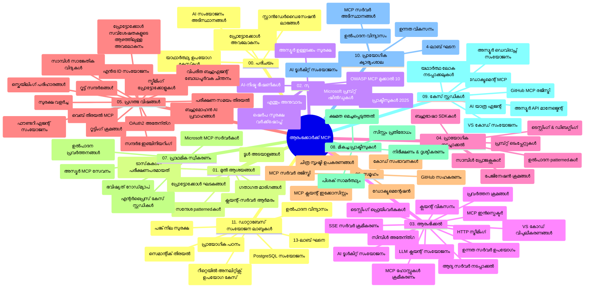

# മോഡൽ കോൺടെക്സ് പ്രോട്ടോക്കോൾ (MCP) തുടക്കക്കാർക്കുള്ള - പഠന ഗൈഡ്

ഈ പഠന ഗൈഡ് "മോഡൽ കോൺടെക്സ് പ്രോട്ടോക്കോൾ (MCP) തുടക്കക്കാർക്കായി" പഠനക്രമത്തിന് കരുതുന്ന റിപ്പോസിററി ഘടനയും ഉള്ളടക്കവും അവലോകനം നൽകുന്നു. റിപ്പോസിററി സുതാര്യമായി മനസിലാക്കി ലഭ്യമായ വിഭവങ്ങൾ ഏറ്റവും ഫലപ്രദമായി ഉപയോഗിക്കാനും ഈ ഗൈഡ് സഹായിക്കും.

## റിപ്പോസിററി അവലോകനം

മോഡൽ കോൺടെക്സ് പ്രോട്ടോക്കോൾ (MCP) AI മോഡലുകളുടെയും ക്ലയന്റ് ആപ്ലിക്കേഷനുകളുടെയും ഇടയിലുള്ള ക്രമരഹിത ഇടപാടുകൾക്കുള്ള ഒരു സ്റ്റാൻഡേർഡൈസ്ഡ് ഫ്രെയിംവർക്ക് ആണ്. ആദ്യം Anthropic ആണ് നിർമിക്കുന്നത്, ഇപ്പോൾ MCP സമൂഹം ഔദ്യോഗിക GitHub സംഘടനയുടെ മുഖേന ഇത് പരിപാലിക്കുന്നു. ഈ റിപ്പോസിററിയിൽ C#, Java, JavaScript, Python, TypeScript എന്നിവയിൽ ഹാൻഡ്‌സ്ഒൺ കോഡ് ഉദാഹരണങ്ങളോടുകൂടിയ സമഗ്രമായ കോഴ്സ് ലഭ്യമാണ്, AI ഡെവലപ്പർമാരായും സിസ്റ്റം ആർക്കിടെക്റ്റുകളായും സോഫ്റ്റ്‌വേർ എഞ്ചിനീയർമാരായും ഉള്ളവർക്കായി രൂപകൽപ്പന ചെയ്തിട്ടുണ്ട്.

## ദൃശ്യമധ്യസ്ഥ പഠന മാനচിത്രം

## റിപ്പോസിററി ഘടന

രിപോസിററി പതിനൊന്ന് പ്രധാന ഭാഗങ്ങളായി ക്രമീകരിച്ചിരിക്കുന്നു, MCP-യുടെ വിവിധ പ്രതിപാദ്യങ്ങളെമുൾക്കൊണ്ട്:

1. **പരിചയം (00-Introduction/)**
   - മോഡൽ കോൺടെക്സ് പ്രോട്ടോക്കോളിന്റെ അവലോകനം
   - AI പൈപ്‌ലൈൻകളിൽ സ്റ്റാൻഡേർഡൈസേഷൻ എന്തിനാണെന്ന്
   - പ്രായോഗിക ഉപയോഗമാനത്തിലും പ്രയോജനം

2. **പ്രധാന ആശയങ്ങൾ (01-CoreConcepts/)**
   - ക്ലയന്റ്-സർവർ ആർക്കിടെക്ചർ
   - പ്രോട്ടോക്കോൾ പ്രധാന ഘടകങ്ങൾ
   - MCP-യിലെ മെസേജിംഗ് മാതൃകകൾ

3. **സുരക്ഷ (02-Security/)**
   - MCP അടിസ്ഥാനമാക്കിയുള്ള സിസ്റ്റങ്ങളിലെ സുരക്ഷാ ഭീഷണികൾ
   - നടപ്പിലാക്കലുകൾ സുരക്ഷിതമാക്കാനുള്ള മികച്ച രീതികൾ
   - ഓതന്റിക്കേഷൻ, അഥോറൈസേഷൻ തന്ത്രങ്ങൾ
   - **വ്യാപകമായ സുരക്ഷാ ഡോക്യുമെന്റേഷൻ**:
     - MCP സുരക്ഷയ്ക്കുള്ള മികച്ച രീതികൾ 2025
     - അസ്യൂർ ഉള്ളടക്കം സുരക്ഷ സമ്പ്രദായം
     - MCP സുരക്ഷാ നിയന്ത്രണങ്ങളും സാങ്കേതിക വിദ്യകളും
     - MCP മികച്ച രീതികൾ വേഗവും പരാതി
   - **പ്രധാന സുരക്ഷാ വിഷയങ്ങൾ**:
     - പ്രോംപ്‌റ്റ് ഇഞ്ചക്ഷനും ടൂൾ വിഷബാധയും
     - സെഷൻ ഹൈജാക്കിങും ആശയക്കുഴപ്പം സൃഷ്ടിക്കുന്ന ഡ്യൂട്ടി പ്രശ്‌നങ്ങളും
     - ടോക്കൺ പാസ്സ്ഠ്രൂ ദുർബലം
     - അധികാരങ്ങൾ കൂടുതലായ നിയന്ത്രണങ്ങൾ
     - AI ഘടകങ്ങളുടെ സപ്ലൈ ചെയിൻ സുരക്ഷ
     - മൈക്രോസോഫ്റ്റ് പ്രോംപ്‌റ്റ് ഷീൽഡ്‌സ് സംയോജനം

4. **ആരംഭിക്കുന്നത് (03-GettingStarted/)**
   - പരിസ്ഥിതി ക്രമീകരണവും സജ്ജീകരണവും
   - അടിസ്ഥാന MCP സർവർ, ക്ലയന്റുകൾ സൃഷ്‌ടിക്കൽ
   - നിലവിലുള്ള ആപ്ലിക്കേഷനുകളിൽ സംയോജനം
   - ഉൾപ്പെടുന്ന വിഭാഗങ്ങൾ:
     - ആദ്യ സർവർ നിർമാണം
     - ക്ലയന്റ് വികസനം
     - LLM ക്ലയന്റ് സംയോജനം
     - VS കോഡ് സംയോജനം
     - സർവർ-സെന്റ് ഇവന്റ്‌സ് (SSE) സർവർ
     - മുൻനില സർവർ ഉപയോഗം
     - HTTP സ്ട്രീമിംഗ്
     - AI ടൂൾകിറ്റ് സംയോജനം
     - ടെസ്റ്റിംഗ് തന്ത്രങ്ങൾ
     - ഡിപ്ലോയ്മെന്റ് മാർഗ്ഗനിർദ്ദേശങ്ങൾ

5. **പ്രായോഗിക നടപ്പാക്കൽ (04-PracticalImplementation/)**
   - വിവിധ പ്രോഗ്രാമിംഗ് ഭാഷകളിലെ SDK ഉപയോഗം
   - ഡീബഗ്ജിംഗ്, ടെസ്റ്റിംഗ്, വാലിഡേഷൻ മാർഗ്ഗങ്ങൾ
   - പുനർവിനിയോഗയോഗ്യമായ പ്രോംപ്‌റ്റ് ടെംപ്ലേറ്റുകളും വർക്ക്‌ഫ്ലോകളും തയാറാക്കൽ
   - നടപ്പാക്കൽ ഉദാഹരണങ്ങളോടെ സാമ്പിൾ പ്രോജക്റ്റുകൾ

6. **ഉന്നത വിഷങ്ങൾ (05-AdvancedTopics/)**
   - കോൺടെക്റ്റ് എഞ്ചിനീയറിംഗ് സാങ്കേതിക വിദ്യകൾ
   - ഫൗൻട്രി ഏജന്റ് സംയോജനം
   - മൾട്ടി-മോഡൽ AI വർക്ക്‌ഫ്ലോകൾ
   - OAuth2 ഓതന്റിക്കേഷൻ ഡെമോകൾ
   - റിയൽ-ടൈം സെർച്ച് ശേഷികൾ
   - റിയൽ-ടൈം സ്ട്രീമിംഗ്
   - റൂട്ട് കോൺടെക്റ്റുകൾ നടപ്പാക്കൽ
   - റൂട്ടിംഗ് തന്ത്രങ്ങൾ
   - സാംപ്ലിംഗ് സാങ്കേതിക വിദ്യകൾ
   - സ്കെയിലിങ് സമീപനങ്ങൾ
   - സുരക്ഷാ കാര്യങ്ങൾ
   - എൻട്ര ID സുരക്ഷ സംയോജനം
   - വെബ് സെർച്ച് സംയോജനം
   - എടുക്കുന്നവരുടെ ഇടയിൽ സമരാധിഷ്ഠിത ബഹുസൂത്ര агентി ചർച്ചകൾ

7. **സമൂഹ സംഭാവനകൾ (06-CommunityContributions/)**
   - കോഡ്, ഡോക്യുമെന്റേഷൻ സംഭാവന ചെയ്യാനുള്ള മാർഗ്ഗങ്ങൾ
   - GitHub വഴി സഹകരണം
   - സമൂഹ അടിസ്ഥാന enhancement-കൾ, പ്രതികരണങ്ങൾ
   - വിവിധ MCP ക്ലയന്റുകൾ ചെലവെടുക്കൽ (Claude Desktop, Cline, VSCode)
   - ഇമേജ് ജനറേഷൻ ഉൾപെടുത്തിയ MCP സർവറുകളോട് പ്രവർത്തനം

8. **ആദിമ സ്വീകരണത്തിലെ പാഠങ്ങൾ (07-LessonsfromEarlyAdoption/)**
   - യാഥാർത്ഥ്യത്തിൽ നടപ്പാക്കിയ സംരംഭങ്ങളും വിജയം നേടുന്ന കഥകൾ
   - MCP അടിസ്ഥാനമാക്കിയുള്ള പരിഹാരങ്ങൾ നിർമ്മിച്ചു ഡിപ്ലോയ് ചെയ്യൽ
   - പ്രവണതകളും വരാനിരിക്കുന്ന റോഡ്‌മാപ്പും
   - **Microsoft MCP സർവർ ഗൈഡ്**: 10 പ്രൊഡക്ഷൻ-സജ്ജ Microsoft MCP സര്വറുകളുടെ സമഗ്ര മാർഗ്ഗനിർദേശങ്ങൾ:
     - Microsoft Learn Docs MCP സർവർ
     - അസ്യൂർ MCP സർവർ (15+ സ്പെഷ്യലൈസ്ഡ് കോൺനക്ടറുകൾ)
     - GitHub MCP സർവർ
     - അസ്യൂർ ഡെവ്ഓപ്സ് MCP സർവർ
     - MarkItDown MCP സർവർ
     - SQL സർവർ MCP സർവർ
     - പ്ലേയ്റൈറ്റ MCP സർവർ
     - ഡെവ് ബോക്‌സ് MCP സർവർ
     - അസ്യൂർ AI ഫൗണ്ടറി MCP സർവർ
     - Microsoft 365 ഏജന്റ് ടൂൾകിറ്റ് MCP സർവർ

9. **മികച്ച പ്രവർത്തനരീതികൾ (08-BestPractices/)**
   - പ്രകടന ട്യൂണിംഗ്, ഓപ്റ്റിമൈസേഷൻ
   - ഫാള്റ്റ്-ടൊറന്റ്നറ് MCP സിസ്റ്റം ഡിസൈൻ
   - ടെസ്റ്റിംഗ്, മുൻകൂട്ടി പ്രതിരോധ തന്ത്രങ്ങൾ

10. **കേസ് സ്റ്റഡികൾ (09-CaseStudy/)**
    - MCPയുടെ വൈവിധ്യമാർന്ന ഉപയോഗങ്ങൾ കാണിക്കുന്ന **ഏഴ് സമഗ്ര കേസുകൾ**:
    - **അസ്യൂറ AI ട്രവൽ ഏജന്റ്‌സ്**: അസ്യൂർ ഓപ്പൺ AI, AI സെർച്ച് ഉപയോഗിച്ച് മൾട്ടി-ഏജന്റ് ഓർക്കസ്ട്രേഷൻ
    - **അസ്യൂർ ഡെവ്ഓപ്സ് സംയോജനം**: YouTube ഡാറ്റ അപ്ഡേറ്റുകളുള്ള വർക്ക്‌ഫ്ലോ പ്രക്രിയകൾ സ്വચાલനം
    - **റിയൽ-ടൈം ഡോക്യുമെന്റേഷൻ റീട്രീവൽ**: പൈതൺ കോൺസോൾ ക്ലയന്റ് HTTP സ്ട്രീമിംഗ് ഉപയോഗിച്ച്
    - **ഇന്ററാക്ടീവ് സ്റ്റഡി പ്ലാൻ ജനറേറ്റർ**: ചൈന്ലിറ്റ് വെബ് ആപ്പ് സംവാദാത്മക AI ഉപയോഗിച്ച്
    - **എഡിറ്ററിനുള്ളിലെ ഡോക്യുമെന്റേഷൻ**: GitHub Copilot വർക്ക്‌ഫ്ലോകളുടെ VS കോഡ് സംയോജനം
    - **അസ്യൂർ API മാനേജ്മെന്റ്**: MCP സർവർ സൃഷ്‌ടിച്ച് എന്റർപ്രൈസ് API സംയോജനം
    - **GitHub MCP രജിസ്ട്രി**: ഇക്കോസിസ്റ്റം വികസനം, ഏജന്റിക് സംയോജനം പ്ലാറ്റ്‌ഫോം
    - സംരംഭ എന്റർപ്രൈസ് സമന്വയം, ഡെവലപ്പർ ഉൽപാദകത്വം, ഇക്കോസിസ്റ്റം വികസനം എന്നിവ നിറവേറ്റുന്ന നടപ്പാക്കൽ ഉദാഹരണങ്ങൾ

11. **ഹാൻഡ്‌സ്-ഓൺ വർക്ക്‌ഷോപ്പ് (10-StreamliningAIWorkflowsBuildingAnMCPServerWithAIToolkit/)**
    - MCP, AI ടൂൾകിറ്റ് സംയോജിപ്പിച്ച് സമഗ്ര ഹാൻഡ്‌സ്-ഓൺ വർക്ക്‌ഷോപ്പ്
    - AI മോഡലുകളും യഥാർത്ഥ ലോക ഉപകരണങ്ങളും ബന്ധിപ്പിച്ച ബുദ്ധിമുട്ടുള്ള ആപ്ലിക്കേഷനുകൾ നിർമ്മാണം
    - അടിസ്ഥാനങ്ങൾ, കസ്റ്റം സർവർ വികസനം, പ്രൊഡക്ഷൻ ഡിപ്ലോയ്മെന്റ് തന്ത്രങ്ങൾ ഉൾപ്പെടുന്ന പ്രായോഗിക ഘടകങ്ങൾ
    - **ലാബ് ഘടന**:
      - ലാബ് 1: MCP സർവർ അടിസ്ഥാനങ്ങൾ
      - ലാബ് 2: ഉയർന്ന തലമുള്ള MCP സർവർ വികസനം
      - ലാബ് 3: AI ടൂൾകിറ്റ് സംയോജനം
      - ലാബ് 4: പ്രൊഡക്ഷൻ ഡിപ്ലോയ്മെന്റ്, സ്കെയ്ലിങ്
    - ലാബ് അടിസ്ഥാന പഠന സമീപനം, ക്രമാതീതമായ നിർദ്ദേശങ്ങളോടെ

12. **MCP സർവർ ഡേറ്റാബേസ് ഇന്റഗ്രേഷൻ ലാബുകൾ (11-MCPServerHandsOnLabs/)**
    - പ്രൊഡക്ഷൻ-സജ്ജ MCP സർവറുകൾ PostgreSQL സംയോജിപ്പിച്ച് നിർമ്മിക്കാനുള്ള സമഗ്ര 13-ലാബ് പഠന പാത
    - റിയൽ വേൾഡ് റീട്ടെയിൽ അനലിറ്റിക്സ് നടപ്പാക്കൽ, Zava Retail ഉപയോഗിച്ച്
    - എന്റർപ്രൈസ് ക്ലാസ്സ് പാറ്റേണുകൾ ഉൾപ്പെടെ: റോ ലെവൽ സെക്യൂരിറ്റി (RLS), സെമാന്റിക് സെർച്ച്, മൾട്ടി-ടെനന്റ് ഡാറ്റ ആക്സസ്
    - **സമ്പൂർത്തിയായ ലാബ് ഘടന**:
      - **ലാബുകൾ 00-03: അടിസ്ഥാനങ്ങൾ** - പരിചയം, ആർക്കിടെക്ചർ, സുരക്ഷ, പരിസ്ഥിതി ക്രമീകരണങ്ങൾ
      - **ലാബുകൾ 04-06: MCP സർവർ നിർമാണം** - ഡേറ്റാബേസ് ഡിസൈൻ, MCP സർവർ നടപ്പാക്കൽ, ടൂൾ വികസനം
      - **ലാബുകൾ 07-09: ഉയർന്ന സവിശേഷതകൾ** - സെമാന്റിക് സെർച്ച്, ടെസ്റ്റിംഗ് & ഡീബഗ്ജിംഗ്, VS കോഡ് സംയോജനം
      - **ലാബുകൾ 10-12: പ്രൊഡക്ഷൻ & മികച്ച രീതികൾ** - ഡിപ്ലോയ്മെന്റ്, മോണിറ്ററിംഗ്, ഓപ്റ്റിമൈസേഷൻ
    - **സാങ്കേതികവിദ്യകൾ ഉൾപ്പെടുന്നു**: FastMCP ഫ്രെയിംവർക്ക്, PostgreSQL, അസ്യൂർ ഓപ്പൺ AI, അസ്യൂർ കൺറ്റെയ്നർ ആപ്സ്, ആപ്ലിക്കേഷൻ ഇൻസൈറ്റ്സ്
    - **പഠന ഫലങ്ങൾ**: പ്രൊഡക്ഷൻ സജ്ജ MCP സർവറുകൾ, ഡേറ്റാബേസ് ഇന്റഗ്രേഷൻ പാറ്റേണുകൾ, AI-ഓരോണഡ് അനലിറ്റിക്സ്, എന്റർപ്രൈസ് സുരക്ഷ

## അധിക വിഭവങ്ങൾ

രിപോസിററിയിൽ പിന്തുണയുള്ള വിഭവങ്ങൾ ഉൾപ്പെടുന്നു:

- **ഇമേജസ് ഫോൾഡർ**: കോഴ്സിൽ ഉപയോഗിക്കുന്ന ചിത്രംകളും വിശദീകരണ ചിത്രങ്ങളും
- **പരിഭാഷകൾ**: ഡോക്യുമെന്റേഷന്റെ ബഹുഭാഷാ പിന്തുണ, യാന്ത്രിക പരിഭാഷകൾ
- **ഔദ്യോഗിക MCP വിഭവങ്ങൾ**:
  - [MCP ഡോക്യുമെന്റേഷൻ](https://modelcontextprotocol.io/)
  - [MCP സവിശേഷത](https://spec.modelcontextprotocol.io/)
  - [MCP GitHub റിപ്പോസിററി](https://github.com/modelcontextprotocol)

## ഈ റിപ്പോസിററി എങ്ങനെ ഉപയോഗിക്കണം

1. **ക്രമബദ്ധമായ പഠനം**: പഠനക്രമം കൃത്യമായ അർഥത്തിൽ പിന്തുടരുക (00 മുതൽ 11 വരെ)
2. **ഭാഷ-നിര്ദിഷ്‌ട ശ്രദ്ധ**: നിങ്ങൾക്ക് ഇഷ്ടമുള്ള പ്രോഗ്രാമിംഗ് ഭാഷയിൽ നടപ്പാക്കലുകൾ കാണാൻ സാംപിൾ ഡയറക്ടറികൾ പരിശോധിക്കുക
3. **പ്രായോഗിക നടപ്പാക്കൽ**: "ആരംഭിക്കുന്നത്" വിഭാഗം ഉപയോഗിച്ച് പരിസ്ഥിതിയും MCP ആദിത്യ സർവർ, ക്ലയന്റ് സൃഷ്‌ടിച്ച് തുടങ്ങുക
4. **ഉന്നത ഗവേഷണം**: അടിസ്ഥാനങ്ങൾ മനസ്സിലാക്കിയ ശേഷം ഉയർന്ന തല വിഷയങ്ങളിൽ കടക്കുക
5. **സമൂഹ സജീവത**: MCP സമൂഹത്തിനൊപ്പം GitHub ചർച്ചകളും Discord ചാനലുകളും വഴി ചേർന്ന് അനുഭവം പങ്കിടുക

## MCP ക്ലയന്റുകളും സങ്കേതങ്ങളുമാണ്

പഠനക്രമം വിവിധ MCP ക്ലയന്റുകൾക്കും ടൂളുകൾക്കും ഉൾക്കൊള്ളുന്നു:

1. **ഔദ്യോഗിക ക്ലയന്റുകൾ**:
   - Visual Studio Code
   - Visual Studio Code-ൽ MCP
   - Claude Desktop
   - VSCode-ലുള്ള Claude
   - Claude API

2. **സമൂഹ ക്ലയന്റുകൾ**:
   - Cline (ടർമിനൽ അടിസ്ഥാനമാക്കി)
   - Cursor (കോഡ് എഡിറ്റർ)
   - ChatMCP
   - Windsurf

3. **MCP മാനേജുമെന്റ് ടൂൾസ്**:
   - MCP CLI
   - MCP മാനേജർ
   - MCP ലിങ്കർ
   - MCP റൂട്ടർ

## പ്രശസ്ത MCP സര്വറുകൾ

രിപോസിററി വിവിധ MCP സര്വറുകൾ പരിചയപ്പെടുത്തുന്നു:

1. **ഔദ്യോഗിക Microsoft MCP സര്വറുകൾ**:
   - Microsoft Learn Docs MCP Server
   - അസ്യൂർ MCP സർവർ (15+ സ്പെഷ്യലൈസ്ഡ് കോൺനക്ടറുകൾ)
   - GitHub MCP Server
   - അസ്യൂർ ഡെവ്ഓപ്സ് MCP Server
   - MarkItDown MCP Server
   - SQL Server MCP Server
   - Playwright MCP Server
   - Dev Box MCP Server
   - അസ്യൂർ AI Foundry MCP Server
   - Microsoft 365 Agents Toolkit MCP Server

2. **ഔദ്യോഗിക റഫറൻസ് സര്വറുകൾ**:
   - ഫയൽസിസ്റ്റം
   - ഫെച്ച്
   - മെമ്മറി
   - സീക്വൻഷ്യൽ തിങ്കിംഗ്

3. **ഇമേജ് ജനറേഷൻ**:
   - അസ്യൂർ ഓപ്പൺ AI DALL-E 3
   - സ്റ്റേബിൾ ഡിഫ്യൂഷൻ വെബ് UI
   - റെപ്ലിക്കേറ്റ്

4. **വികസന ടൂൾസ്**:
   - Git MCP
   - ടെർമിനൽ കൺട്രോൾ
   - കോഡ് അസിസ്റ്റന്റ്

5. **സ്പെഷ്യലൈസ്ഡ് സര്വറുകൾ**:
   - സെൽസ്‌ഫോഴ്സ്
   - Microsoft Teams
   - Jira & Confluence

## സംഭാവന ചെയ്യൽ

ഈ റിപ്പോസിററി സമൂഹത്തിന്റെ സംഭാവനകൾ സ്വാഗതം ചെയ്യുന്നു. MCP ഇക്കോസിസ്റ്റത്തിലേക്ക് ഫലപ്രദമായി സംഭാവന ചെയ്യാൻ സഹായിക്കുന്ന മാർഗ്ഗനിർദ്ദേശങ്ങൾക്ക് "സമൂഹ സംഭാവനകൾ" വിഭാഗം കാണുക.

----

*ഈ പഠന ഗൈഡ് 2026 ഫെബ്രുവരി 5-ന് അവസാനമായി അപ്ഡേറ്റ് ചെയ്തതാണ്, ഏറ്റവും പുതിയ MCP സവിശേഷത 2025-11-25 മുൻകൂട്ടി ഉൾപ്പെടുത്തി, ആ ദിവസം പക്ഷേ റിപ്പോസിററി അവസ്ഥയുടെ ഒരു അവലോകനം നൽകുന്നു. അപ്ഡേറ്റുകൾ ഈ തീയതിയ്ക്കു ശേഷം സംഭവിക്കാമെന്ന് ദയവായി ശ്രദ്ധിക്കുക.*

---

<!-- CO-OP TRANSLATOR DISCLAIMER START -->
**അസ്വీకാരം**:  
ഈ രേഖ AI പരിഭാഷ സേവനം [Co-op Translator](https://github.com/Azure/co-op-translator) ഉപയോഗിച്ച് പരിഭാഷ ചെയ്തത് ആണ്. നമുക്ക് ശരിയായ പരിഭാഷ നൽകാൻ ശ്രമിച്ചെങ്കിലും, താൻനിർമ്മിത പരിഭാഷകളിൽ പിശകുകൾ അല്ലെങ്കിൽ തെറ്റുകൾ ഉണ്ടാകാം എന്ന് ദയവായി മനസ്സിലാക്കുക. രൂപകൽപ്പനയിൽ ഉള്ള സ്വതന്ത്ര ഭാഷയിൽ ഉള്ള പ്രമാണം പ്രധാനമായ ശരിയായ ഉദ്ഭവപ്രമാണമായി കാണപ്പെടണം. നിർണായക വിവരങ്ങൾക്ക്, പ്രൊഫഷണൽ മനുഷ്യ പരിഭാഷ ശുപാർശ ചെയ്യുന്നു. ഈ പരിഭാഷ ഉപയോഗിക്കുന്നതിൽ നിന്നുണ്ടാകുന്ന ഏതെങ്കിലും തെറ്റുഅർത്ഥമാക്കലിനോ വ്യത്യാസത്തിനോ നാം ഉത്തരവാദികളല്ല.
<!-- CO-OP TRANSLATOR DISCLAIMER END -->