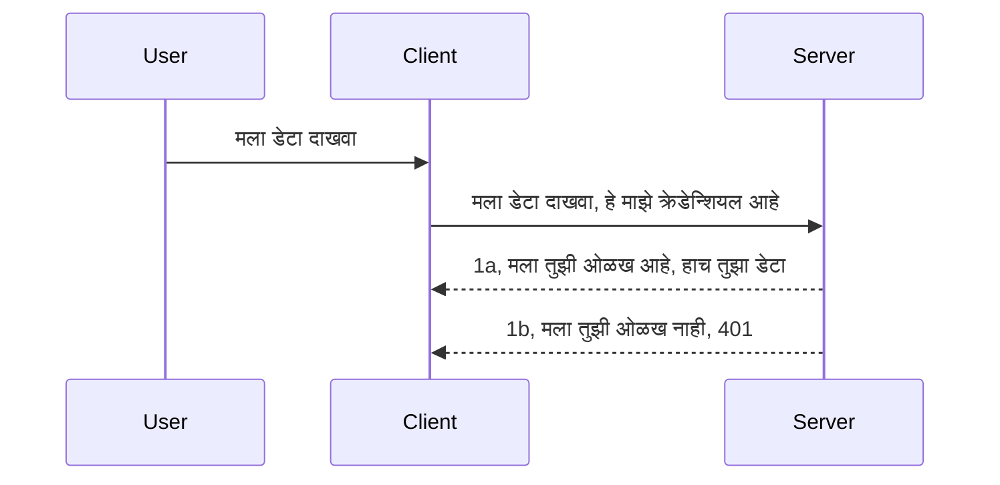

# सोपी प्रमाणीकरण

MCP SDKs OAuth 2.1 चा वापर करण्यास समर्थन देतात, जे प्रामाणिकपणे सांगायचे झाल्यास एक गुंतागुंतीची प्रक्रिया आहे ज्यामध्ये auth server, resource server, क्रेडेन्शियल्स पाठवणे, कोड मिळवणे, त्या कोडला bearer token मध्ये बदलणे अशा संकल्पना समाविष्ट आहेत, जोपर्यंत आपण शेवटी आपले resource data प्राप्त करू शकत नाही. जर आपण OAuth शी अपरिचित असाल, जी अंमलबजावणी करण्यासाठी छान गोष्ट आहे, तर काही मूलभूत स्तराची प्रमाणीकरणाने सुरू करणे आणि उत्तम आणि अधिक सुरक्षिततेकडे प्रगती करणे चांगले आहे. म्हणूनच या प्रकरणाचा उद्देश आपल्याला अधिक प्रगत प्रमाणीकरणाकडे तयार करणे आहे.

## प्रमाणीकरण, आपला अर्थ काय?

प्रमाणीकरण आणि अधिकार देणे या संक्षिप्त स्वरूपाला auth म्हणतात. विचार असा आहे की आपल्याला दोन गोष्टी कराव्या लागतात:

- **प्रमाणीकरण**, ही अशी प्रक्रिया आहे ज्याद्वारे आपण व्यक्तीला आपल्या घरात प्रवेश देतो की नाही हे ठरवतो, म्हणजे त्यांना "इथे" राहण्याचा हक्क आहे का, म्हणजेच त्यांना आपल्या resource server पर्यंत प्रवेश आहे जिथे आपले MCP Server वैशिष्ट्ये सापडतात.
- **अधिकार देणे**, ही अशी प्रक्रिया आहे ज्याद्वारे आपण मिळवतो की वापरकर्त्यास त्यांनी मागितलेले विशिष्ट resource, उदाहरणार्थ हे आदेश किंवा हे उत्पादन, वाचण्याचा अधिकार आहे का, पण हटवण्याचा नाही असा अधिकार किंवा इतर उदाहरणे.

## क्रेडेन्शियल्स: आपण सिस्टमला आम्ही कोण आहोत हे कसे सांगतो

बरेच वेब विकासक सर्वसाधारणपणे सर्व्हरला क्रेडेन्शियल प्रदान करण्याचा विचार करतात, जो सहसा एक गुपित असते जी म्हणते त्यांना "Authentication" मध्ये इथे असण्याची परवानगी आहे किंवा नाही. हे क्रेडेन्शियल सामान्यतः username आणि password चे base64 एन्कोडेड आवृत्ती किंवा API key असते जी विशिष्ट वापरकर्त्याला अद्वितीय ओळख देते.

हे "Authorization" नावाच्या हेडरद्वारे अशी पाठवले जाते:

```json
{ "Authorization": "secret123" }
```

हे सामान्यतः बेसिक Authentication असे म्हणतात. नंतर पूर्ण प्रवाह पुढीलप्रमाणे कार्य करतो:


आता आपण प्रवाहाच्या दृष्टीकोनातून हे कसे काम करते ते समजले, आपण ते कसे अंमलात आणू? बहुतांश वेब सर्व्हरमध्ये middleware हा संकल्पना असते, जो रिक्वेस्टचा भाग म्हणून चालणारा कोडचा तुकडा आहे जो क्रेडेन्शियल्स तपासू शकतो आणि जर ते वैध असतील तर रिक्वेस्टला पुढे जाण्यास सामर्थ्य देतो. जर वैध क्रेडेन्शियल्स नसतील तर आपल्याला प्रमाणीकरण त्रुटी मिळते. हे कसे अंमलात आणू शकतो ते पाहूया:

**Python**

```python
class AuthMiddleware(BaseHTTPMiddleware):
    async def dispatch(self, request, call_next):

        has_header = request.headers.get("Authorization")
        if not has_header:
            print("-> Missing Authorization header!")
            return Response(status_code=401, content="Unauthorized")

        if not valid_token(has_header):
            print("-> Invalid token!")
            return Response(status_code=403, content="Forbidden")

        print("Valid token, proceeding...")
       
        response = await call_next(request)
        # कोणतेही ग्राहक हेडर्स जोडा किंवा प्रतिसादामध्ये काहीतरी बदल करा
        return response


starlette_app.add_middleware(CustomHeaderMiddleware)
```

येथे आमच्याकडे आहे: 

- `AuthMiddleware` नावाचा middleware तयार केला आहे जिथे त्याचा `dispatch` पद्धत वेब सर्व्हरद्वारे कॉल केला जातो.
- वेब सर्व्हरमध्ये middleware जोडले:

    ```python
    starlette_app.add_middleware(AuthMiddleware)
    ```

- वैधता तपासणीचा लॉजिक लिहिला आहे जो तपासतो की Authorization हेडर आहे का आणि पाठवलेला गुपित चांगला आहे का:

    ```python
    has_header = request.headers.get("Authorization")
    if not has_header:
        print("-> Missing Authorization header!")
        return Response(status_code=401, content="Unauthorized")

    if not valid_token(has_header):
        print("-> Invalid token!")
        return Response(status_code=403, content="Forbidden")
    ```

    जर गुपित उपस्थित आणि योग्य असेल तर आम्ही `call_next` कॉल करून रिक्वेस्टला पुढे जाऊ देतो आणि प्रतिसाद परत करतो.

    ```python
    response = await call_next(request)
    # काहीही ग्राहक हेडर जोडा किंवा उत्तरात काहीतरी बदल करा
    return response
    ```

हे कार्य कसे करते तर जर वेब रिक्वेस्ट सर्व्हरकडे केली गेली तर middleware चालवले जाईल आणि त्याच्या अंमलबजावणीनुसार रिक्वेस्टला पुढे जाण्याची परवानगी देईल किंवा त्रुटी परत करेल जी सूचित करेल की क्लायंटला पुढे जाण्याची अनुमती नाही.

**TypeScript**

येथे आम्ही लोकप्रिय फ्रेमवर्क Express वापरून middleware तयार करतो आणि MCP Server पर्यंत पोहोचण्यापूर्वी रिक्वेस्टवर हस्तक्षेप करतो. त्याचा कोड असा आहे:

```typescript
function isValid(secret) {
    return secret === "secret123";
}

app.use((req, res, next) => {
    // 1. अधिकृतता हेडर उपस्थित आहे का?
    if(!req.headers["Authorization"]) {
        res.status(401).send('Unauthorized');
    }
    
    let token = req.headers["Authorization"];

    // 2. वैधता तपासा.
    if(!isValid(token)) {
        res.status(403).send('Forbidden');
    }

   
    console.log('Middleware executed');
    // 3. विनंती पाईपलाइनमधील पुढील टप्प्याकडे विनंती पाठवा.
    next();
});
```

या कोडमध्ये आम्ही:

1. तपासत आहोत की Authorization हेडर आहे का, नसेल तर 401 त्रुटी पाठवितो.
2. खात्री करतो की क्रेडेन्शियल/टोकन वैध आहे का, नाही तर 403 त्रुटी पाठवितो.
3. शेवटी रिक्वेस्ट पाईपलाइनमध्ये रिक्वेस्टला पुढे पाठवतो आणि मागितलेले resource परत करतो.

## व्यायाम: प्रमाणीकरण अंमलात आणा

आपले ज्ञान वापरून आपण ते अंमलात आणण्याचा प्रयत्न करूया. योजना अशी आहे:

सर्व्हर

- वेब सर्व्हर आणि MCP उदाहरण तयार करा.
- सर्व्हरसाठी middleware अंमलात आणा.

क्लायंट

- हेडरद्वारे क्रेडेन्शियलसह वेब रिक्वेस्ट पाठवा.

### -1- वेब सर्व्हर आणि MCP उदाहरण तयार करा

आमच्या पहिल्या टप्प्यात, वेब सर्व्हर उदाहरण आणि MCP Server तयार करणे आवश्यक आहे.

**Python**

येथे आम्ही MCP सर्व्हर उदाहरण तयार करतो, starlette वेब अप तयार करतो आणि uvicorn सह त्याचे होस्टिंग करतो.

```python
# MCP सर्व्हर तयार करत आहे

app = FastMCP(
    name="MCP Resource Server",
    instructions="Resource Server that validates tokens via Authorization Server introspection",
    host=settings["host"],
    port=settings["port"],
    debug=True
)

# starlette वेब अॅप तयार करत आहे
starlette_app = app.streamable_http_app()

# uvicorn द्वारे अॅप सेवा देत आहे
async def run(starlette_app):
    import uvicorn
    config = uvicorn.Config(
            starlette_app,
            host=app.settings.host,
            port=app.settings.port,
            log_level=app.settings.log_level.lower(),
        )
    server = uvicorn.Server(config)
    await server.serve()

run(starlette_app)
```

या कोडमध्ये आम्ही:

- MCP Server तयार केला.
- MCP Server पासून starlette वेब app, `app.streamable_http_app()`, तयार केले.
- वेब app ला uvicorn वापरून होस्ट व सर्व्ह करतो `server.serve()`.

**TypeScript**

येथे आम्ही MCP Server उदाहरण तयार करतो.

```typescript
const server = new McpServer({
      name: "example-server",
      version: "1.0.0"
    });

    // ... सर्व्हर संसाधने, साधने, आणि प्रॉम्प्ट सेट करा ...
```

ही MCP Server निर्मिती POST /mcp मार्ग व्याख्येत होणे आवश्यक आहे, म्हणून वर दिलेला कोड एका ठिकाणी हलवू या:

```typescript
import express from "express";
import { randomUUID } from "node:crypto";
import { McpServer } from "@modelcontextprotocol/sdk/server/mcp.js";
import { StreamableHTTPServerTransport } from "@modelcontextprotocol/sdk/server/streamableHttp.js";
import { isInitializeRequest } from "@modelcontextprotocol/sdk/types.js"

const app = express();
app.use(express.json());

// सत्र आयडीनुसार वाहतूक साठवण्यासाठी नकाशा
const transports: { [sessionId: string]: StreamableHTTPServerTransport } = {};

// क्लायंट-टू-सर्व्हर संवादासाठी POST विनंत्या हाताळा
app.post('/mcp', async (req, res) => {
  // विद्यमान सत्र आयडी तपासा
  const sessionId = req.headers['mcp-session-id'] as string | undefined;
  let transport: StreamableHTTPServerTransport;

  if (sessionId && transports[sessionId]) {
    // विद्यमान वाहतूक पुनर्वापर करा
    transport = transports[sessionId];
  } else if (!sessionId && isInitializeRequest(req.body)) {
    // नवीन आरंभिक विनंती
    transport = new StreamableHTTPServerTransport({
      sessionIdGenerator: () => randomUUID(),
      onsessioninitialized: (sessionId) => {
        // सत्र आयडीनुसार वाहतूक साठवा
        transports[sessionId] = transport;
      },
      // मागील सुसंगततेसाठी DNS रीबाइंडिंग संरक्षण डीफॉल्टने अक्षम आहे. जर आपण हा सर्व्हर
      // स्थानिकरित्या चालवत असल्यास, खालीलप्रमाणे निश्चित करा:
      // enableDnsRebindingProtection: true,
      // allowedHosts: ['127.0.0.1'],
    });

    // बंद करताना वाहतूक साफ करा
    transport.onclose = () => {
      if (transport.sessionId) {
        delete transports[transport.sessionId];
      }
    };
    const server = new McpServer({
      name: "example-server",
      version: "1.0.0"
    });

    // ... सर्व्हर स्रोत, साधने आणि प्रॉम्प्ट सेट करा ...

    // MCP सर्व्हरशी कनेक्ट करा
    await server.connect(transport);
  } else {
    // अवैध विनंती
    res.status(400).json({
      jsonrpc: '2.0',
      error: {
        code: -32000,
        message: 'Bad Request: No valid session ID provided',
      },
      id: null,
    });
    return;
  }

  // विनंती हाताळा
  await transport.handleRequest(req, res, req.body);
});

// GET आणि DELETE विनंत्यांसाठी पुनर्वापर करण्यायोग्य हँडलर
const handleSessionRequest = async (req: express.Request, res: express.Response) => {
  const sessionId = req.headers['mcp-session-id'] as string | undefined;
  if (!sessionId || !transports[sessionId]) {
    res.status(400).send('Invalid or missing session ID');
    return;
  }
  
  const transport = transports[sessionId];
  await transport.handleRequest(req, res);
};

// SSE द्वारे सर्व्हर-टू-क्लायंट सूचना साठी GET विनंत्या हाताळा
app.get('/mcp', handleSessionRequest);

// सत्र समाप्तीसाठी DELETE विनंत्या हाताळा
app.delete('/mcp', handleSessionRequest);

app.listen(3000);
```

आता आपण पाहू शकता की MCP Server निर्मिती `app.post("/mcp")` च्या आत हलवण्यात आली आहे.

आणखी पुढील Middleware तयार करण्याच्या टप्प्याकडे जाऊया जेणेकरून येणारे क्रेडेन्शियल तपासले जाऊ शकतील.

### -2- सर्व्हरसाठी middleware अंमलात आणा

आता middleware भागाकडे जाऊया. येथे आपण एक middleware तयार करू ज्याने `Authorization` हेडरमध्ये क्रेडेन्शियल शोधून त्याची वैधता तपासली जाईल. जर ती मान्य असेल तर रिक्वेस्ट आपल्याला आवश्यक असलेले कार्य करण्यास पुढे जाईल (उदा. उपकरणे यादी करणे, resource वाचणे किंवा क्लायंटच्या विनंतीतील इतर MCP वैशिष्ट्ये).

**Python**

Middleware तयार करण्यासाठी, आपल्याला `BaseHTTPMiddleware` वर्गातून वंशणारा एक वर्ग तयार करावा लागेल. दोन महत्त्वाचे भाग:

- `request`, जिथून आपण हेडरची माहिती वाचतो.
- `call_next`, कॅल्बॅक जो आम्हाला कॉल करावा लागतो जर क्लायंटने स्वीकारलेला क्रेडेन्शियल आणले असेल.

सर्वप्रथम, `Authorization` हेडर नसल्यास काय करायचे ते हाताळा:

```python
has_header = request.headers.get("Authorization")

# हेडर नाही, 401 ने अयशस्वी करा, अन्यथा पुढे जा.
if not has_header:
    print("-> Missing Authorization header!")
    return Response(status_code=401, content="Unauthorized")
```

येथे अतृप्त प्रमाणीकरण म्हणून 401 संदेश पाठविला जातो कारण क्लायंट प्रमाणीकरण अयशस्वी होत आहे.

नंतर, जर क्रेडेन्शियल सबमिट केला गेला असेल तर त्याची वैधता अशी तपासा:

```python
 if not valid_token(has_header):
    print("-> Invalid token!")
    return Response(status_code=403, content="Forbidden")
```

वरीलप्रमाणे 403 निषिद्ध संदेश कसा पाठविला जातो ते पहा. पुढे आम्ही पूर्ण middleware देत आहोत ज्याने वरील सर्व implement केले आहे:

```python
class AuthMiddleware(BaseHTTPMiddleware):
    async def dispatch(self, request, call_next):

        has_header = request.headers.get("Authorization")
        if not has_header:
            print("-> Missing Authorization header!")
            return Response(status_code=401, content="Unauthorized")

        if not valid_token(has_header):
            print("-> Invalid token!")
            return Response(status_code=403, content="Forbidden")

        print("Valid token, proceeding...")
        print(f"-> Received {request.method} {request.url}")
        response = await call_next(request)
        response.headers['Custom'] = 'Example'
        return response

```

उत्तम, पण `valid_token` फंक्शन काय आहे? ती खालीलप्रमाणे आहे:

```python
# उत्पादनासाठी वापरू नका - त्यात सुधारणा करा !!
def valid_token(token: str) -> bool:
    # "Bearer " हा उपसर्ग काढा
    if token.startswith("Bearer "):
        token = token[7:]
        return token == "secret-token"
    return False
```

हे नक्कीच सुधारावा.

महत्त्वाचे: आपल्याकडे कधीही अशा प्रकारचे गुपित कोडमध्ये नसावे. आपण ती तुलना करण्यासाठी मूल्य डेटासोर्स किंवा IDP (identity service provider) कडून मिळवू शकत नाहीतर चांगले म्हणजे IDP कडूनच वैधता तपासणी करावी.

**TypeScript**

Express सह हे अंमलात आणण्यासाठी, आपल्याला `use` पद्धत कॉल करावी लागते जी middleware फंक्शन्स स्वीकारते.

आपल्याला करायचे आहे:

- `Authorization` प्रॉपर्टीतून पाठवलेल्या क्रेडेन्शियल तपासण्यासाठी request व्हेरिएबलशी संवाद साधणे.
- क्रेडेन्शियल वैध असल्यास रिक्वेस्ट पुढे जाणे आणि क्लायंटचे MCP रिक्वेस्ट त्याला आवश्यक कार्य करण्याची परवानगी देणे (उदा. उपकरणे यादी करणे, resource वाचणे किंवा इतर MCP संबंधित काही).

येथे, आपण तपासत आहोत की `Authorization` हेडर आहे का, नसेल तर, आपण रिक्वेस्टला पुढे जाण्यापासून थांबवतो:

```typescript
if(!req.headers["authorization"]) {
    res.status(401).send('Unauthorized');
    return;
}
```

जर हेडर सुरुवातीला पाठवले नसेल तर 401 प्राप्त होतो.

नंतर, आपण पाहतो की क्रेडेन्शियल वैध आहे का, नाही तर आपण पुन्हा रिक्वेस्ट थांबवतो पण थोडकासा वेगळा संदेश पाठवून:

```typescript
if(!isValid(token)) {
    res.status(403).send('Forbidden');
    return;
} 
```

आता आपण 403 त्रुटी प्राप्त करतो.

पूरा कोड असा आहे:

```typescript
app.use((req, res, next) => {
    console.log('Request received:', req.method, req.url, req.headers);
    console.log('Headers:', req.headers["authorization"]);
    if(!req.headers["authorization"]) {
        res.status(401).send('Unauthorized');
        return;
    }
    
    let token = req.headers["authorization"];

    if(!isValid(token)) {
        res.status(403).send('Forbidden');
        return;
    }  

    console.log('Middleware executed');
    next();
});
```

आम्ही वेब सर्व्हरला middleware स्वीकारण्यासाठी सेट केले आहे जे तपासेल की क्लायंट आपल्याला क्रेडेन्शियल पाठवत आहे की नाही. तर क्लायंट स्वतःचे काय?

### -3- हेडरद्वारे क्रेडेन्शियलसह वेब रिक्वेस्ट पाठवा

आपल्याला खात्री करावी लागेल की क्लायंट क्रेडेन्शियल हेडरमध्ये पाठवत आहे. आपण MCP क्लायंट वापरणार असल्याने, आपण ते कसे करायचे ते शोधूया.

**Python**

क्लायंटसाठी, आपण अशा प्रकारे हेडरमध्ये क्रेडेन्शियल पाठवावे लागते:

```python
# मूल्य हार्डकोड करू नका, किमान ते वातावरण चलनीत किंवा अधिक सुरक्षित संचयनात ठेवा
token = "secret-token"

async with streamablehttp_client(
        url = f"http://localhost:{port}/mcp",
        headers = {"Authorization": f"Bearer {token}"}
    ) as (
        read_stream,
        write_stream,
        session_callback,
    ):
        async with ClientSession(
            read_stream,
            write_stream
        ) as session:
            await session.initialize()
      
            # TODO, क्लायंटमध्ये काय करायचे आहे ते, उदा. साधने सूचीबद्ध करा, साधने कॉल करा इ.
```

कसे `headers = {"Authorization": f"Bearer {token}"}` असे `headers` प्रॉपर्टी सेट करतो ते पहा.

**TypeScript**

हे दोन टप्प्यांत सोलवता येईल:

1. आपल्या क्रेडेन्शियलसह कॉन्फिगरेशन ऑब्जेक्ट भरा.
2. कॉन्फिगरेशन ऑब्जेक्ट ट्रान्सपोर्टला द्या.

```typescript

// येथे दाखवल्याप्रमाणे मूल्य हार्डकोड करू नका. किमान ते एक परिवेश चल म्हणून ठेवा आणि dev मोडमध्ये dotenv सारखे काही वापरा.
let token = "secret123"

// क्लायंट ट्रान्सपोर्ट पर्याय ऑब्जेक्ट निर्धारित करा
let options: StreamableHTTPClientTransportOptions = {
  sessionId: sessionId,
  requestInit: {
    headers: {
      "Authorization": "secret123"
    }
  }
};

// पर्याय ऑब्जेक्ट ट्रान्सपोर्टला द्या
async function main() {
   const transport = new StreamableHTTPClientTransport(
      new URL(serverUrl),
      options
   );
```

वरीलप्रमाणे आपण `options` ऑब्जेक्ट तयार केला आणि त्यात `requestInit` प्रॉपर्टीत हेडर ठेवल्या.

महत्त्वाचे: इथे सुधारणा कशी करावी? सध्याची अंमलबजावणी काही अडचणी आहे. प्रथम, क्रेडेन्शियल अशाप्रकारे पाठवणे शक्यतो जोखमीचे असते जोपर्यंत किमान HTTPS नसते. तरीसुद्धा, क्रेडेन्शियल चोरीस जाऊ शकते त्यामुळे आपल्याकडे अशी प्रणाली पाहिजे जिथे आपण टोकन रद्द करू शकता आणि अतिरिक्त तपासणी करू शकता जसे की ते जगात कुठून येत आहे, रिक्वेस्ट खूप वारंवार होत आहे का (बोटसारखे व्यवहार) इत्यादी, संक्षेपात अनेक विचारावल्या गोष्टी आहेत.

हे तरीही म्हणावे कि अतिशय सोप्या API साठी जेथे आपण कुणीही आपला API कॉल करू नये जोपर्यंत ते प्रमाणित नसते, ते सुरुवात करणे चांगले आहे.

आता, चल तर सुरक्षा काहीशी घट्ट करूया JSON Web Token (JWT) किंवा "JOT" टोकन सारख्या प्रमाणित स्वरूपाचा वापर करून.

## JSON वेब टोकन्स, JWT

तर, आपण सोप्या क्रेडेन्शियल पाठवण्यापासून सुधारणा करण्याचा प्रयत्न करत आहोत. JWT स्वीकारल्यावर काय त्वरित सुधारणां मिळतात?

- **सुरक्षा सुधारणा**. बेसिक auth मध्ये आपण वापरकर्तानाव आणि पासवर्ड base64 एन्कोडेड टोकन म्हणून (किंवा API key) वारंवार पाठवतो, ज्यामुळे धोका वाढतो. JWT सह, आपण आपले वापरकर्तानाव आणि पासवर्ड पाठवतो आणि त्याऐवजी टोकन मिळवतो आणि ते वेळेनुसार समाप्त होणारे असते. JWT सहजपणे रोल्स, स्कोप्स आणि परवान्यांद्वारे सूक्ष्म-अधिकार नियंत्रण वापरू देते.
- **स्थितीसंपन्नतेचा अभाव आणि स्केलेबिलिटी**. JWT स्वतः मध्ये सर्व वापरकर्ता माहिती घेऊन सर्व्हर साइड सेशन संग्रहणाची गरज कमी करतात. टोकन स्थानिकदृष्ट्या देखील वैधता तपासले जाऊ शकतात.
- **परस्परसंवादिता आणि फेडरेशन**. JWT Open ID Connect चा मूलभूत भाग आहे आणि Entra ID, Google Identity, Auth0 सारख्या प्रसिद्ध ओळख प्रदात्यांसह वापरले जाते. ते सिंगल साइन ऑन आणि बरेच काही वापर शक्य करतात ज्यामुळे ते एंटरप्राइझ-ग्रेड बनतात.
- **मॉड्युलरिटी आणि लवचिकता**. JWT API गेटवे जसे Azure API Management, NGINX आणि आणखी बऱ्याचसह वापरले जाऊ शकतात. हे वापरकर्त्याच्या प्रमाणीकरणाच्या परिस्थितींसाठी तसेच सर्व्हर-टू-सर्व्हिस संवादासाठी देखील समर्थन देते ज्यात impersonation व delegation देखील आहेत.
- **कार्यक्षमता आणि कॅशिंग**. JWT डीकोड केल्यानंतर कॅश केला जाऊ शकतो ज्यामुळे पार्सिंगची गरज कमी होते. हे विशेषतः उच्च-ट्रॅफिक अ‍ॅपसाठी उपयुक्त आहे कारण त्याचा थ्रूपुट सुधारतो आणि निवडलेल्या पायाभूत सुविधांवरील लोड कमी करतो.
- **प्रगत वैशिष्ट्ये**. हे introspection (सर्व्हरवर वैधता तपासणे) आणि revocation (टोकन अमान्य करणे) देखील समर्थन करते.

या सर्व फायद्यांसह, पाहूया आपण आपले अंमलबजावणी पुढील स्तरावर कसे नेऊ शकतो.

## बेसिक auth चे JWT मध्ये रूपांतरण

तर, आपण मुख्य स्तरावर जे बदल करायचे आहेत ते:

- **JWT टोकन तयार करणे** आणि ते क्लायंटकडून सर्व्हरकडे पाठवायला तयार करणे.
- **JWT टोकनची वैधता तपासणे** आणि जर ते वैध असेल तर क्लायंटला आपली संसाधने देणे.
- **टोकन सुरक्षित साठवण**. आपण हे टोकन कसे साठवणार.
- **मार्गांचे संरक्षण**. आपल्याला मार्ग आणि खास MCP वैशिष्ट्ये संरक्षित करावे लागतील.
- **रिफ्रेश टोकन्स जोडणे**. छोटे काळजीचे टोकन्स तयार करणे आणि ते संपल्यास नव्या टोकनसाठी वापरता येतील अशी लांब आयुष्यमान रिफ्रेश टोकन तयार करणे, तसेच रिफ्रेश पॉइंट आणि रोटेशन धोरण सुनिश्चित करणे.

### -1- JWT टोकन तयार करा

सर्वप्रथम, JWT टोकनचे खालील भाग असतात:

- **हेडर**, वापरलेला अल्गोरिदम आणि टोकन प्रकार.
- **पेलोड**, दावे, जसे sub (वापरकर्ता किंवा घटक ज्याचे टोकन प्रतिनिधित्व करते. प्रमाणीकरण संदर्भात सहसा userid), exp (संपल्याची वेळ), role (भूमिका).
- **सही (Signature)**, गुपित किंवा खाजगी कीने सह सही केलेले.

यासाठी, आपल्याला हेडर, पेलोड तयार करावेत आणि कोड केलेले टोकन बनवावे लागेल.

**Python**

```python

import jwt
import jwt
from jwt.exceptions import ExpiredSignatureError, InvalidTokenError
import datetime

# JWT ला सही करण्यासाठी वापरलेली गुप्त की
secret_key = 'your-secret-key'

header = {
    "alg": "HS256",
    "typ": "JWT"
}

# वापरकर्त्याची माहिती आणि त्याचे दावे आणि कालबाह्यता वेळ
payload = {
    "sub": "1234567890",               # विषय (वापरकर्ता आयडी)
    "name": "User Userson",                # सानुकूल दावा
    "admin": True,                     # सानुकूल दावा
    "iat": datetime.datetime.utcnow(),# जारी केलेले वेळ
    "exp": datetime.datetime.utcnow() + datetime.timedelta(hours=1)  # कालबाह्यता
}

# एन्कोड करा
encoded_jwt = jwt.encode(payload, secret_key, algorithm="HS256", headers=header)
```

वर दिलेल्या कोडमध्ये आपण:

- HS256 अल्गोरिदम आणि JWT म्हणून प्रकार वापरून हेडर परिभाषित केला आहे.
- पेलोड तयार केला आहे ज्यामध्ये user id, username, role, जारी केल्याची वेळ आणि संपण्याची वेळ आहे ज्यामुळे आपण पूर्वी उल्लेख केलेले वेळा-आधारित वैशिष्ट्य कार्यान्वित केले आहे.

**TypeScript**

येथे आपल्याला काही अवलंबित्वांची आवश्यकता असेल जी JWT टोकन तयार करण्यास मदत करतील.

अवलंबन

```sh

npm install jsonwebtoken
npm install --save-dev @types/jsonwebtoken
```

आता आपल्याकडे ते असताना, चला हेडर, पेलोड तयार करू आणि कोड केलेले टोकन निर्मिती करूया.

```typescript
import jwt from 'jsonwebtoken';

const secretKey = 'your-secret-key'; // उत्पादनात env व्हरिएबल्स वापरा

// पेलोड निश्चित करा
const payload = {
  sub: '1234567890',
  name: 'User usersson',
  admin: true,
  iat: Math.floor(Date.now() / 1000), // जारी केलेले वेळी
  exp: Math.floor(Date.now() / 1000) + 60 * 60 // 1 तासात काढून टाका
};

// हेडर निश्चित करा (पर्यायी, jsonwebtoken पूर्वनिश्चिते सेट करतो)
const header = {
  alg: 'HS256',
  typ: 'JWT'
};

// टोकन तयार करा
const token = jwt.sign(payload, secretKey, {
  algorithm: 'HS256',
  header: header
});

console.log('JWT:', token);
```

हे टोकन:

HS256 वापरून सही केलेले आहे
1 तासासाठी वैध आहे
sub, name, admin, iat आणि exp सारखे दावे समाविष्ट करतो.

### -2- टोकनची वैधता तपासा

आपल्याला टोकनची वैधता तपासणे आवश्यक आहे, हे सर्व्हरवर करणे आवश्यक आहे जेणेकरून तपासता येईल की क्लायंट जे पाठवत आहे ते खरंच वैध आहे. अनेक तपासण्या करणे आवश्यक आहे, जसे त्याची रचना आणि वैधता तपासणे. आपण यामध्ये वापरकर्त्याची उपस्थिती तपासणे आणि इतर तपासणे देखील जोडायला प्रोत्साहित केले जातात.

टोकन तपासण्यासाठी, आधी आपण डीकोड करू जेणेकरून आपण वाचू शकू आणि नंतर त्याची वैधता तपासण्यास सुरुवात करू:

**Python**

```python

# JWT डिकोड आणि सत्यापित करा
try:
    decoded = jwt.decode(token, secret_key, algorithms=["HS256"])
    print("✅ Token is valid.")
    print("Decoded claims:")
    for key, value in decoded.items():
        print(f"  {key}: {value}")
except ExpiredSignatureError:
    print("❌ Token has expired.")
except InvalidTokenError as e:
    print(f"❌ Invalid token: {e}")

```

या कोडमध्ये, आपण `jwt.decode` कॉल करतो ज्यात टोकन, गुपित की आणि निवडलेला अल्गोरिदम इनपुट म्हणून असतो. लक्षात घ्या की आम्ही try-catch संरचना वापरतो कारण वैधता अयशस्वी झाल्यास त्रुटी येते.

**TypeScript**

येथे आम्हाला `jwt.verify` कॉल करावा लागतो ज्यामुळे आपण टोकनचे डीकोडेड व्हर्जन मिळवू शकतो जे आपण पुढील तपासणीसाठी वापरू शकतो. जर कॉल अयशस्वी झाला, तर याचा अर्थ टोकनची रचना चुकीची आहे किंवा तो वैध नाही.

```typescript

try {
  const decoded = jwt.verify(token, secretKey);
  console.log('Decoded Payload:', decoded);
} catch (err) {
  console.error('Token verification failed:', err);
}
```

टीप: पूर्वी नमूद केल्याप्रमाणे, आपण अतिरिक्त तपासण्या करायला हवे की हा टोकन आपल्या सिस्टममधील वापरकर्त्याचे निर्देश करत आहे का आणि वापरकर्त्याला तो दावा केलेल्या अधिकार आहेत का.

आता, आपण रोल बेस्ड अ‍ॅक्सेस कंट्रोल कडे पाहू, ज्याला RBAC देखील म्हटले जाते.
## भूमिका आधारित प्रवेश नियंत्रण जोडणे

मूलत: आपण व्यक्त करायचे आहे की वेगवेगळ्या भूमिका विविध परवानग्या असतात. उदाहरणार्थ, आपण गृहित धरतो की एक प्रशासक सर्व काही करू शकतो आणि एक सामान्य वापरकर्ता फक्त वाचन/लेखन करू शकतो आणि एक पाहुणा केवळ वाचू शकतो. म्हणून, येथे काही शक्य परवानगी स्तर आहेत:

- Admin.Write  
- User.Read  
- Guest.Read  

चला पाहूया की कसे आपण अशा नियंत्रणासाठी मध्यवर्ती सॉफ्टवेअर (middleware) वापरून अंमलबजावणी करू शकतो. मध्यवर्ती सॉफ्टवेअर रूट नुसार तसेच सर्व रूटसाठी जोडले जाऊ शकतात.

**Python**

```python
from starlette.middleware.base import BaseHTTPMiddleware
from starlette.responses import JSONResponse
import jwt

# गुपित कोडमध्ये असू नये, हे फक्त प्रदर्शनासाठी आहे. ते सुरक्षित ठिकाणाहून वाचा.
SECRET_KEY = "your-secret-key" # हे env व्हेरिएबलमध्ये ठेवा
REQUIRED_PERMISSION = "User.Read"

class JWTPermissionMiddleware(BaseHTTPMiddleware):
    async def dispatch(self, request, call_next):
        auth_header = request.headers.get("Authorization")
        if not auth_header or not auth_header.startswith("Bearer "):
            return JSONResponse({"error": "Missing or invalid Authorization header"}, status_code=401)

        token = auth_header.split(" ")[1]
        try:
            decoded = jwt.decode(token, SECRET_KEY, algorithms=["HS256"])
        except jwt.ExpiredSignatureError:
            return JSONResponse({"error": "Token expired"}, status_code=401)
        except jwt.InvalidTokenError:
            return JSONResponse({"error": "Invalid token"}, status_code=401)

        permissions = decoded.get("permissions", [])
        if REQUIRED_PERMISSION not in permissions:
            return JSONResponse({"error": "Permission denied"}, status_code=403)

        request.state.user = decoded
        return await call_next(request)


```
  
मध्यवर्ती सॉफ्टवेअर जोडण्याचे काही विविध मार्ग खालीलप्रमाणे आहेत:

```python

# पर्याय 1: स्टारलेट अॅप तयार करताना मिडलवेयर जोडा
middleware = [
    Middleware(JWTPermissionMiddleware)
]

app = Starlette(routes=routes, middleware=middleware)

# पर्याय 2: स्टारलेट अॅप तयार झाल्यानंतर मिडलवेयर जोडा
starlette_app.add_middleware(JWTPermissionMiddleware)

# पर्याय 3: प्रत्येक मार्गासाठी मिडलवेयर जोडा
routes = [
    Route(
        "/mcp",
        endpoint=..., # हॅन्डलर
        middleware=[Middleware(JWTPermissionMiddleware)]
    )
]
```
  
**TypeScript**

आपण `app.use` आणि एक.middlewares वापरू शकतो जे सर्व विनंत्यांसाठी चालेल.

```typescript
app.use((req, res, next) => {
    console.log('Request received:', req.method, req.url, req.headers);
    console.log('Headers:', req.headers["authorization"]);

    // 1. तपासा की अधिकृतता हेडर पाठवले गेले आहे का

    if(!req.headers["authorization"]) {
        res.status(401).send('Unauthorized');
        return;
    }
    
    let token = req.headers["authorization"];

    // 2. तपासा की टोकन वैध आहे का
    if(!isValid(token)) {
        res.status(403).send('Forbidden');
        return;
    }  

    // 3. तपासा की टोकन वापरकर्ता आपल्या प्रणालीमध्ये अस्तित्वात आहे का
    if(!isExistingUser(token)) {
        res.status(403).send('Forbidden');
        console.log("User does not exist");
        return;
    }
    console.log("User exists");

    // 4. तपासा की टोकनला योग्य परवानग्या आहेत का
    if(!hasScopes(token, ["User.Read"])){
        res.status(403).send('Forbidden - insufficient scopes');
    }

    console.log("User has required scopes");

    console.log('Middleware executed');
    next();
});

```
  
मध्यवर्ती सॉफ्टवेअरने खालील काही गोष्टी करणे अपेक्षित आहे:

1. authorization header आहे का ते तपासा  
2. token वैध आहे का तपासा, आपण `isValid` कॉल करतो जे एक पद्धत आहे जी आपण लिहिली आहे आणि जी JWT टोकनची अखंडता आणि वैधता तपासते.  
3. वापरकर्ता आपल्या प्रणालीमध्ये अस्तित्वात आहे का ते तपासा.

   ```typescript
    // DB मधील वापरकर्ते
   const users = [
     "user1",
     "User usersson",
   ]

   function isExistingUser(token) {
     let decodedToken = verifyToken(token);

     // TODO, तपासा की वापरकर्ता DB मध्ये आहे का
     return users.includes(decodedToken?.name || "");
   }
   ```
  
वरील उदाहरणात, आपण एक अतिशय सोपी `users` यादी तयार केली आहे, जी स्पष्टपणे डेटाबेसमध्ये असावी.

4. याव्यतिरिक्त, आपण हेही तपासले पाहिजे की टोकनमध्ये योग्य परवानग्या आहेत का.

   ```typescript
   if(!hasScopes(token, ["User.Read"])){
        res.status(403).send('Forbidden - insufficient scopes');
   }
   ```
  
वरील मध्यवर्ती सॉफ्टवेअर कोडमध्ये, आपण तपासतो की टोकनमध्ये User.Read ही परवानगी आहे का, नसल्यास 403 त्रुटी पाठवतो. खाली `hasScopes` साहाय्यक पद्धत दिली आहे.

   ```typescript
   function hasScopes(scope: string, requiredScopes: string[]) {
     let decodedToken = verifyToken(scope);
    return requiredScopes.every(scope => decodedToken?.scopes.includes(scope));
  }  
   ```

Have a think which additional checks you should be doing, but these are the absolute minimum of checks you should be doing.

Using Express as a web framework is a common choice. There are helpers library when you use JWT so you can write less code.

- `express-jwt`, helper library that provides a middleware that helps decode your token.
- `express-jwt-permissions`, this provides a middleware `guard` that helps check if a certain permission is on the token.

Here's what these libraries can look like when used:

```typescript
const express = require('express');
const jwt = require('express-jwt');
const guard = require('express-jwt-permissions')();

const app = express();
const secretKey = 'your-secret-key'; // put this in env variable

// Decode JWT and attach to req.user
app.use(jwt({ secret: secretKey, algorithms: ['HS256'] }));

// Check for User.Read permission
app.use(guard.check('User.Read'));

// multiple permissions
// app.use(guard.check(['User.Read', 'Admin.Access']));

app.get('/protected', (req, res) => {
  res.json({ message: `Welcome ${req.user.name}` });
});

// Error handler
app.use((err, req, res, next) => {
  if (err.code === 'permission_denied') {
    return res.status(403).send('Forbidden');
  }
  next(err);
});

```
  
आता तुम्ही पाहिले की मध्यवर्ती सॉफ्टवेअर कसे प्रमाणीकरण आणि प्राधिकरण दोन्हीसाठी वापरले जाऊ शकते, तर MCP बाबत कसे आहे, ते प्राधिकरणाची पद्धत बदलते का? पुढील विभागात आपण ते शोधू.

### -3- MCP मध्ये RBAC जोडा

तुम्ही आतापर्यंत पहिलंय की कसे तुम्ही मध्यवर्ती सॉफ्टवेअर वापरून RBAC जोडू शकता, परंतु MCP साठी प्रत्येक MCP फिचरसाठी RBAC सहज जोडण्याचा कोणताही मार्ग नाही, तर काय कराल? तर, आपण अशा प्रकारे कोड जोडावा लागतो ज्याद्वारे तपासले जाते की क्लायंटला विशिष्ट साधन कॉल करण्याचा अधिकार आहे का:

तुमच्याकडे प्रत्येक फिचरसाठी RBAC साध्य करण्यासाठी काही पर्याय आहेत, काही उदाहरणे:

- प्रत्येक साधन, स्त्रोत, प्रॉम्प्टसाठी जिथे परवानगी स्तर तपासणे आवश्यक आहे तिथे तपासणी जोडा.

   **python**

   ```python
   @tool()
   def delete_product(id: int):
      try:
          check_permissions(role="Admin.Write", request)
      catch:
        pass # क्लायंट अधिकृत करण्यात अयशस्वी, अधिकृत त्रुटी उंचवा
   ```
  
   **typescript**

   ```typescript
   server.registerTool(
    "delete-product",
    {
      title: Delete a product",
      description: "Deletes a product",
      inputSchema: { id: z.number() }
    },
    async ({ id }) => {
      
      try {
        checkPermissions("Admin.Write", request);
        // करायचे, आयडी productService आणि remote entry कडे पाठवा
      } catch(Exception e) {
        console.log("Authorization error, you're not allowed");  
      }

      return {
        content: [{ type: "text", text: `Deletected product with id ${id}` }]
      };
    }
   );
   ```


- प्रगत सर्व्हर पद्धत आणि विनंती हाताळणारे वापरा, ज्यामुळे तुम्ही तपासणी किती ठिकाणी करावी लागते ते कमी करता.

   **Python**

   ```python
   
   tool_permission = {
      "create_product": ["User.Write", "Admin.Write"],
      "delete_product": ["Admin.Write"]
   }

   def has_permission(user_permissions, required_permissions) -> bool:
      # user_permissions: वापरकर्त्याकडे असलेल्या परवानग्यांची यादी
      # required_permissions: टुलसाठी आवश्यक परवानग्यांची यादी
      return any(perm in user_permissions for perm in required_permissions)

   @server.call_tool()
   async def handle_call_tool(
     name: str, arguments: dict[str, str] | None
   ) -> list[types.TextContent]:
    # मान्य करा की request.user.permissions हा वापरकर्त्यासाठी परवानग्यांची यादी आहे
     user_permissions = request.user.permissions
     required_permissions = tool_permission.get(name, [])
     if not has_permission(user_permissions, required_permissions):
        # त्रुटी उभारा "आपल्याला टूल {name} कॉल करण्याचा परवाना नाही"
        raise Exception(f"You don't have permission to call tool {name}")
     # पुढे जा आणि टूल कॉल करा
     # ...
   ```   
  

   **TypeScript**

   ```typescript
   function hasPermission(userPermissions: string[], requiredPermissions: string[]): boolean {
       if (!Array.isArray(userPermissions) || !Array.isArray(requiredPermissions)) return false;
       // वापरकर्ता कडे किमान एक आवश्यक परवानगी असल्यास खरे परत करा
       
       return requiredPermissions.some(perm => userPermissions.includes(perm));
   }
  
   server.setRequestHandler(CallToolRequestSchema, async (request) => {
      const { params: { name } } = request;
  
      let permissions = request.user.permissions;
  
      if (!hasPermission(permissions, toolPermissions[name])) {
         return new Error(`You don't have permission to call ${name}`);
      }
  
      // पुढे पुढे जा..
   });
   ```
  
   लक्षात ठेवा, तुम्हाला सुनिश्चित करणे आवश्यक आहे की तुमच्या मध्यवर्ती सॉफ्टवेअरने अनुवादित टोकन विनंतीच्या user प्रॉपर्टीला दिला आहे म्हणजे वरील कोड सोपा झाला आहे.

### सारांश

आता आपण RBAC सामान्यतः आणि MCP साठी कसा जोडावा हे चर्चा केली आहे, वेळ आली आहे तुम्ही स्वतः सुरक्षितता कशी अंमलात आणता ते पाहण्यासाठी आणि प्रस्तुत केलेल्या संकल्पना तुम्हाला समजल्या आहेत की नाही हे सुनिश्चित करण्यासाठी.

## असाइनमेंट 1: मूलभूत प्रमाणीकरण वापरून mcp सर्व्हर आणि mcp क्लायंट तयार करा

इथे तुम्ही हेडर्सद्वारे क्रेडेन्शियल्स पाठविण्याचा तुम्हाला जे शिकले आहे त्याचा वापर कराल.

## सोल्यूशन 1

[Solution 1](./code/basic/README.md)

## असाइनमेंट 2: असाइनमेंट 1 मधील सोल्यूशन सुधारून JWT वापरा

पहिले सोल्यूशन घ्या पण यावेळी त्यात सुधारणा करूया.

मूलभूत प्रमाणीकरणाच्या ऐवजी, चला JWT वापरूया.

## सोल्यूशन 2

[Solution 2](./solution/jwt-solution/README.md)

## आव्हान

"Add RBAC to MCP" विभागात आपण ज्या प्रमाणे टूलप्रमाणे RBAC जोडण्याचा वर्णन केले आहे त्या प्रमाणे RBAC प्रत्येक टूलसाठी जोडा.

## सारांश

तुम्ही या अध्यायात बरंचकाही शिकला आहात, सुरुवातीला कोणतीही सुरक्षितता नव्हती, मग मूलभूत सुरक्षितता, हे JWT काय आहे आणि ते MCP मध्ये कसे जोडता येते.

आपण सानुकूल JWTs सोबत एक मजबूत पाया तयार केला आहे, पण जसजशी वाढ होईल, तसतसा आपण मानक-आधारित ओळख मॉडेलकडे जात आहोत. Entra किंवा Keycloak सारखा IdP स्वीकारल्यास आम्हाला टोकन जारी करणे, पडताळणी आणि आयुष्यकाल व्यवस्थापन या सर्व विश्‍वसनीय प्लॅटफॉर्मवर सोपवता येतात — ज्यामुळे आम्ही अ‍ॅप लॉजिक आणि वापरकर्ता अनुभवावर लक्ष केंद्रित करू शकतो.

यासाठी आपल्याकडे अधिक [प्रगत अध्याय Entra वर](../../05-AdvancedTopics/mcp-security-entra/README.md) आहे.

## पुढे काय

- पुढे: [MCP होस्ट्स सेट करणे](../12-mcp-hosts/README.md)

---

<!-- CO-OP TRANSLATOR DISCLAIMER START -->
**अस्वीकरण**:  
हा दस्तऐवज AI भाषांतर सेवेचा वापर करून अनुवादित केला आहे [Co-op Translator](https://github.com/Azure/co-op-translator). आम्ही अचूकतेसाठी प्रयत्नशील आहोत, तरी कृपया लक्षात घ्या की स्वयंचलित अनुवादांमध्ये चुका किंवा अचूकतेत त्रुटी असू शकतात. मूळ दस्तऐवज त्याच्या स्थानिक भाषेत अधिकृत स्रोत समजावा. महत्त्वाच्या माहितीसाठी व्यावसायिक मानवी भाषांतर शिफारसीय आहे. या भाषांतराचा वापर केल्यामुळे कोणत्याही गैरसमज किंवा चुकीच्या अर्थाने आम्ही जबाबदार नाही.
<!-- CO-OP TRANSLATOR DISCLAIMER END -->