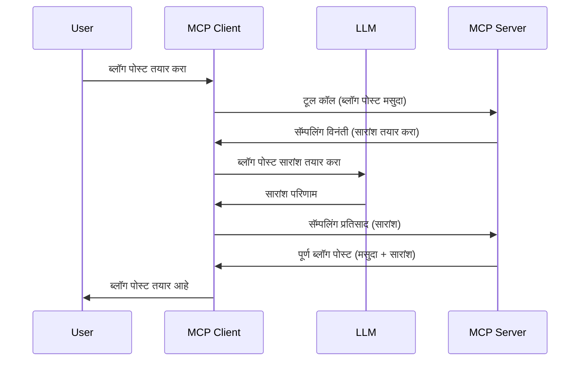

# नमुना घेणे - क्लायंटकडे वैशिष्ट्ये सोपविणे

कधीकधी, तुम्हाला MCP क्लायंट आणि MCP सर्व्हरला एकत्र काम करायचे असते जेणेकरून ते एकसंध उद्दिष्ट साध्य करू शकतील. तुमच्याकडे असा प्रसंग असू शकतो जिथे सर्व्हरला क्लायंटवर असलेल्या LLM ची मदत हवी असते. अशा परिस्थितीत, नमुनाकरण हे वापरले पाहिजे.

चला काही वापराच्या प्रकरणांचा अभ्यास करू आणि नमुनाकरण वापरून कसे उपाय तयार करता येईल हे पाहूया.

## आढावा

या धड्यात, आपण नमुनाकरण कधी आणि कुठे वापरायचे यावर लक्ष केंद्रित करू आणि त्याचे कॉन्फिगर कसे करावे हे शिकू.

## शिक्षण उद्दिष्टे

या प्रकरणात, आपण:

- नमुनाकरण म्हणजे काय आणि ते कधी वापरायचे ते समजावून सांगू.
- MCP मध्ये नमुनाकरण कसे कॉन्फिगर करावे ते दाखवू.
- नमूनाकरणाचे काही उदाहरणं देऊ.

## नमुनाकरण म्हणजे काय आणि ते का वापरायचे?

नमुनाकरण ही एक प्रगत वैशिष्ट्य आहे जी खालीलप्रमाणे कार्य करते:


### नमुनाकरण विनंती

चला आता एक सत्य आहे असे दृश्य घेऊया, मग सर्व्हर क्लायंटकडे पाठविलेल्या नमुनाकरण विनंतीबद्दल बोलूया. अशी विनंती JSON-RPC स्वरूपात कशी दिसू शकते:

```json
{
  "jsonrpc": "2.0",
  "id": 1,
  "method": "sampling/createMessage",
  "params": {
    "messages": [
      {
        "role": "user",
        "content": {
          "type": "text",
          "text": "Create a blog post summary of the following blog post: <BLOG POST>"
        }
      }
    ],
    "modelPreferences": {
      "hints": [
        {
          "name": "claude-3-sonnet"
        }
      ],
      "intelligencePriority": 0.8,
      "speedPriority": 0.5
    },
    "systemPrompt": "You are a helpful assistant.",
    "maxTokens": 100
  }
}
```

येथे काही महत्त्वाच्या बाबींकडे लक्ष देता येईल:

- Prompt, content -> text मध्ये असलेली, हा आमचा सुचना आहे ज्यामध्ये LLM ला ब्लॉग पोस्ट सामग्रीचे सार सांगण्याचे आदेश आहे.

- **modelPreferences**. हा विभाग फक्त एक प्राधान्य आहे, LLM शी कोणती कॉन्फिगरेशन वापरावी याची शिफारस आहे. वापरकर्ता या शिफारसी अनुसरू शकतो किंवा बदल करू शकतो. या प्रकरणात मॉडेल, गती आणि बुद्धिमत्तेची प्राधान्ये दिलेली आहेत.
- **systemPrompt**, हा तुमचा साधा सिस्टिम प्रॉम्प्ट आहे जो तुमच्या LLM ला व्यक्तिमत्त्व देतो आणि मार्गदर्शन सूचना समाविष्ट करतो.
- **maxTokens**, ही आणखी एक विशेषता आहे जी सांगते की या कामासाठी किती टोकन वापरण्याची शिफारस आहे.

### नमुनाकरण प्रतिसाद

हा प्रतिसाद MCP क्लायंटने MCP सर्व्हरला परत पाठवलेला संदेश आहे, जो क्लायंट द्वारा LLM कॉल करणे, प्रतिसादाची वाट पाहणे आणि मग हा संदेश तयार करणे याचा परिणाम आहे. JSON-RPC मध्ये ते कसे दिसू शकते हे खाली दिले आहे:

```json
{
  "jsonrpc": "2.0",
  "id": 1,
  "result": {
    "role": "assistant",
    "content": {
      "type": "text",
      "text": "Here's your abstract <ABSTRACT>"
    },
    "model": "gpt-5",
    "stopReason": "endTurn"
  }
}
```

लक्षात ठेवा की प्रतिसाद हा ब्लॉग पोस्टचा सारांश आहे जसे आपण मागणी केली होती. तसेच लक्षात घ्या की वापरलेले `model` आपण मागितलेले नाही तर "gpt-5" आहे, "claude-3-sonnet" च्या ऐवजी. हे दाखवण्यासाठी आहे की वापरकर्ता काय वापरायचे हे बदलू शकतो आणि तुमची नमुनाकरण विनंती ही शिफारस आहे.

ठीक आहे, आता आपण मुख्य प्रवाह समजतो, आणि उपयोगी काम म्हणजे "ब्लॉग पोस्ट तयार करणे + सारांश", तर ते कसे कार्यान्वित करायचे ते पाहूया.

### संदेश प्रकार

नमुनाकरण संदेश फक्त मजकूरापुरते मर्यादित नाहीत, तुम्ही प्रतिमा आणि ऑडिओ सुद्धा पाठवू शकता. JSON-RPC कसा वेगळा दिसतो ते पहा:

**मजकूर**

```json
{
  "type": "text",
  "text": "The message content"
}
```

**प्रतिमा सामग्री**

```json
{
  "type": "image",
  "data": "base64-encoded-image-data",
  "mimeType": "image/jpeg"
}
```

**ऑडिओ सामग्री**

```json
{
  "type": "audio",
  "data": "base64-encoded-audio-data",
  "mimeType": "audio/wav"
}
```

> NOTE: नमुनाकरण विषयी अधिक सखोल माहिती हवी असल्यास पाहा [more official docs](https://modelcontextprotocol.io/specification/2025-06-18/client/sampling)

## क्लायंटमध्ये नमुनाकरण कसे कॉन्फिगर करावे

> नोट: जर तुम्ही फक्त सर्व्हर तयार करत असाल तर येथे फार काही करण्याची गरज नाही.

क्लायंट मध्ये तुम्हाला खालील वैशिष्ट्य असे Specify करावे लागेल:

```json
{
  "capabilities": {
    "sampling": {}
  }
}
```

नंतर हे तुमच्या निवडलेल्या क्लायंटने सर्व्हरशी कनेक्ट करताना घेतले जाईल.

## नमुनाकरणच्या क्रियेत एक उदाहरण - ब्लॉग पोस्ट तयार करणे

चला एक नमुनाकरण सर्व्हर एकत्र कोड करूया, यासाठी आपल्याला हे करावे लागेल:

1. सर्व्हरवर एक टूल तयार करा.
2. तो टूल एक नमुनाकरण विनंती तयार करायला हवी.
3. टूल क्लायंटच्या नमुनाकरण विनंतीला उत्तर येईपर्यंत थांबले पाहिजे.
4. नंतर टूलचे निकाल तयार होणे पाहिजे.

कोड टप्प्याटप्प्याने पाहूया:

### -1- टूल तयार करा

**python**

```python
@mcp.tool()
async def create_blog(title: str, content: str, ctx: Context[ServerSession, None]) -> str:
    """Create a blog post and generate a summary"""

```

### -2- नमुनाकरण विनंती तयार करा

तुमच्या टूलमध्ये खालील कोड जोडा:

**python**

```python
post = BlogPost(
        id=len(posts) + 1,
        title=title,
        content=content,
        abstract=""
    )

prompt = f"Create an abstract of the following blog post: title: {title} and draft: {content} "

result = await ctx.session.create_message(
        messages=[
            SamplingMessage(
                role="user",
                content=TextContent(type="text", text=prompt),
            )
        ],
        max_tokens=100,
)

```

### -3- प्रतिसादाची वाट पाहा आणि प्रतिसाद परत करा

**python**

```python
post.abstract = result.content.text

posts.append(post)

# संपूर्ण उत्पादन परत करा
return json.dumps({
    "id": post.title,
    "abstract": post.abstract
})
```

### -4- पूर्ण कोड

**python**

```python
from starlette.applications import Starlette
from starlette.routing import Mount, Host

from mcp.server.fastmcp import Context, FastMCP

from mcp.server.session import ServerSession
from mcp.types import SamplingMessage, TextContent

import json


from uuid import uuid4
from typing import List
from pydantic import BaseModel


mcp = FastMCP("Blog post generator")

# app = FastAPI()

posts = []

class BlogPost(BaseModel):
    id: int
    title: str
    content: str
    abstract: str

posts: List[BlogPost] = []

@mcp.tool()
async def create_blog(title: str, content: str, ctx: Context[ServerSession, None]) -> str:
    """Create a blog post and generate a summary"""

    post = BlogPost(
        id=len(posts) + 1,
        title=title,
        content=content,
        abstract=""
    )

    prompt = f"Create an abstract of the following blog post: title: {title} and draft: {content} "

    result = await ctx.session.create_message(
        messages=[
            SamplingMessage(
                role="user",
                content=TextContent(type="text", text=prompt),
            )
        ],
        max_tokens=100,
    )

    post.abstract = result.content.text

    posts.append(post)

    # पूर्ण ब्लॉग पोस्ट परत करा
    return json.dumps({
        "id": post.title,
        "abstract": post.abstract
    })

if __name__ == "__main__":
    print("Starting server...")
    # mcp.run()
    mcp.run(transport="streamable-http")

# यासहीत अॅप चालवा: python server.py
```

### -5- Visual Studio Code मध्ये परीक्षण करणे

Visual Studio Code मध्ये याचा चाचणी करण्यासाठी, खालील करा:

1. टर्मिनलमध्ये सर्व्हर सुरू करा
2. ते *mcp.json* मध्ये जोडा (आणि ती सुरू आहे याची खात्री करा) उदाहरण म्हणून काहीसे असे करा:

   ```json
   "servers": {
      "blog-server": {
        "type": "http",
        "url": "http://localhost:8000/mcp"
      }
   }
   ```

3. एक Prómpt टाईप करा:

   ```text
   create a blog post named "Where Python comes from", the content is "Python is actually named after Monty Python Flying Circus"
   ```

4. नमुनाकरण होऊ द्या. ही पहिली वेळ नाही वापरल्यास एक अतिरिक्त संवाद दिसेल ज्याला तुम्हाला मान्यता द्यावी लागेल, नंतर सामान्य संवाद दिसेल ज्यामध्ये तुम्हाला टूल चालवण्याची विनंती होईल.

5. निकाल तपासा. तुम्हाला दोन्ही GitHub Copilot Chat मध्ये छान रेंडर केलेले आणि कच्च्या JSON प्रतिसादाचे निरीक्षण करता येईल.

**बोनस**. Visual Studio Code टूलिंग ला नमुनाकरणासाठी उत्तम समर्थन आहे. तुमच्या इंस्टॉल केलेल्या सर्व्हरवर Sampling प्रवेश कसा कॉन्फिगर करायचा हे खालीलप्रमाणे:

1. एक्स्टेंशन विभागात जा.
2. "MCP SERVERS - INSTALLED" विभागात तुमच्या इंस्टॉल केलेल्या सर्व्हरची cog आयकॉन निवडा.
3. "Configure Model Access" निवडा, येथे तुम्ही निवडू शकता कोणते मॉडेल GitHub Copilot ला नमुनाकरण करताना वापरता याची परवानगी द्यायची आहे. तुम्ही अलीकडील सर्व नमुनाकरण विनंत्याही "Show Sampling requests" निवडून पाहू शकता.

## कार्य

या कार्यात, तुम्हाला थोडे वेगळे नमुनाकरण तयार करायचे आहे म्हणजे एक नमुनाकरण इंटिग्रेशन जे उत्पादन वर्णन तयार करणे समर्थित करते. तुमचा प्रसंग असा आहे:

**परिस्थिती**: ई-कॉमर्समधील बॅक ऑफिस कर्मचाऱ्याला मदतीची गरज आहे, उत्पादन वर्णने तयार करण्यास खूप वेळ लागतो. म्हणून, तुम्ही असा उपाय तयार करणार आहात जिथे तुम्ही "create_product" नावाचे टूल "title" आणि "keywords" या आर्ग्युमेंट्ससह कॉल कराल आणि ते संपूर्ण उत्पादन तयार करेल ज्यामध्ये "description" क्षेत्र असेल जे क्लायंटच्या LLM कडून भरले जाईल.

TIP: आधी काय शिकलात ते वापरून हा सर्व्हर आणि त्याचे टूल नमुनाकरण विनंती वापरून तयार करा.

## उपाय

[Solution](./solution/README.md)

## मुख्य मुद्दे

नमुनाकरण ही एक पॉवरफुल वैशिष्ट्य आहे जी सर्व्हरला LLM मदतीसाठी क्लायंटकडे कामे सोपवायला परवानगी देते.

## पुढे काय

- [Chapter 4 - Practical implementation](../../04-PracticalImplementation/README.md)

---

<!-- CO-OP TRANSLATOR DISCLAIMER START -->
**अस्वीकरण**:
हा दस्तऐवज AI भाषांतर सेवा [Co-op Translator](https://github.com/Azure/co-op-translator) वापरून अनुवादित केला आहे. आम्ही अचूकतेसाठी प्रयत्न करतो, तरीकाही स्वयंचलित भाषांतरांमध्ये चुका किंवा अचूकतेत गफलत असू शकते हे कृपया लक्षात ठेवा. मूळ दस्तऐवज त्याच्या स्थानिक भाषेत अधिकृत स्रोत म्हणून मानला जावा. अत्यावश्यक माहितीकरिता, व्यावसायिक मानवी भाषांतर शिफारस केली जाते. या भाषांतराच्या वापरामुळे उद्भवणाऱ्या कोणत्याही गैरसमजुतीसाठी किंवा चुकीच्या अर्थनिर्देशासाठी आम्ही जबाबदार नाही.
<!-- CO-OP TRANSLATOR DISCLAIMER END -->