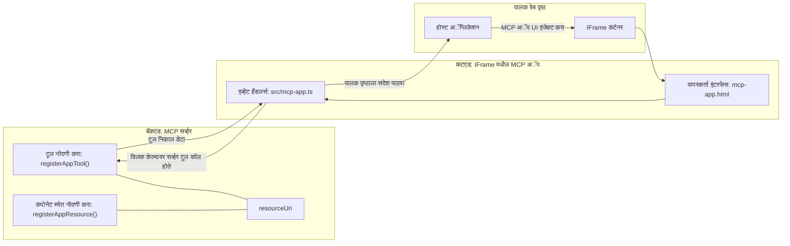

# MCP अ‍ॅप्स

MCP अ‍ॅप्स हे MCP मध्ये एक नवीन पॅराडाइम आहे. कल्पना अशी आहे की तुम्ही केवळ टूल कॉलमधून डेटा परत देत नाही, तर या माहितीसोबत कसे संवाद साधायचे याबाबतही माहिती देता. म्हणजेच टूलचे निकाल आता UI माहिती देखील समाविष्ट करू शकतात. मग आपल्याला हे का पाहिजे? तर, आज तुम्ही कसे करता ते पाहा. तुम्ही बहुधा MCP सर्व्हरचे निकाल काही प्रकारच्या फ्रंटएंडमध्ये ठेवून वापरत आहात, ते कोड तुम्हाला लिहावा आणि देखभाल करावी लागते. कधी कधी ते आवश्यक असते, परंतू कधी कधी माहितीचा एक स्व-समाविष्ट तुकडा घेणं चांगलं असतं ज्यात डेटा पासून युजर इंटरफेसपर्यंत सर्व असतो.

## अवलोकन

हा धडा MCP अ‍ॅप्सवर व्यावहारिक मार्गदर्शन देतो, त्यास सुरू करण्याबाबत आणि तुमच्या विद्यमान वेब अ‍ॅप्समध्ये त्याचे एकत्रीकरण कसे करायचे हे शिकवतो. MCP अ‍ॅप्स हे MCP स्टँडर्डमध्ये एक नवीन भर आहे.

## शिकण्याचे उद्दिष्टे

या धड्याच्या शेवटी, तुम्ही खालील गोष्टी करू शकाल:

- MCP अ‍ॅप्स म्हणजे काय हे स्पष्ट करा.
- MCP अ‍ॅप्स कधी वापरायचे ते जाणून घ्या.
- स्वतःचे MCP अ‍ॅप्स तयार करा आणि एकत्र करा.

## MCP अ‍ॅप्स - हे कसे काम करते

MCP अ‍ॅप्सची कल्पना असा प्रतिसाद देण्याची आहे जो मूलतः एक रेंडर करण्यायोग्य घटक आहे. असे घटक व्हिज्युअल्स आणि इंटरअॅक्टिव्हिटी, उदा., बटण क्लिक, वापरकर्ता इनपुट आणि इतर गोष्टी असू शकतात. चला सर्व्हर बाजूने आणि आमच्या MCP सर्व्हरकडून सुरू करू. MCP अ‍ॅप घटक तयार करण्यासाठी तुम्हाला एक टूल आणि त्याचप्रमाणे अ‍ॅप्लिकेशन रिसोर्स तयार करावी लागते. हे दोन भाग resourceUri द्वारे जोडले जातात.

उदाहरण पाहूया. काय समाविष्ट आहे आणि कोणता भाग काय करतो ते पाहूया:

```text
server.ts -- responsible for registering tools and the component as a UI component
src/
  mcp-app.ts -- wiring up event handlers
mcp-app.html -- the user interface
```
  
हे दृश्य घटक तयार करण्यासाठीची आर्किटेक्चर वर्णन करते.


आता बॅकएंड आणि फ्रंटएंडच्या जबाबदाऱ्या काय आहेत ते वर्णन करूया.

### बॅकएंड

आपल्याला येथे दोन गोष्टी साध्य कराव्या लागतील:

- ज्या टूल्ससोबत संवाद साधायचा आहे त्या नोंदणी करणे.
- घटक परिभाषित करणे.

**टूल नोंदणी**

```typescript
registerAppTool(
    server,
    "get-time",
    {
      title: "Get Time",
      description: "Returns the current server time.",
      inputSchema: {},
      _meta: { ui: { resourceUri } }, // या साधनाला त्याच्या UI संसाधनाशी लिंक करा
    },
    async () => {
      const time = new Date().toISOString();
      return { content: [{ type: "text", text: time }] };
    },
  );

```
  
वरील कोड "get-time" नावाचा एक टूल एक्स्पोज करतो जो कोणतीही इनपुट घेत नाही पण वर्तमान वेळ परत देतो. काही टूल्ससाठी वापरकर्ता इनपुट स्वीकारण्यासाठी `inputSchema` परिभाषित करण्याची क्षमता आहे.

**घटक नोंदणी**

त्याच फाईलमध्ये घटक देखील नोंदणी करावा लागतो:

```typescript
const resourceUri = "ui://get-time/mcp-app.html";

// संसाधन नोंदणी करा, जे UI साठी बांधलेले HTML/JavaScript परत करते.
registerAppResource(
  server,
  resourceUri,
  resourceUri,
  { mimeType: RESOURCE_MIME_TYPE },
  async () => {
    const html = await fs.readFile(path.join(DIST_DIR, "mcp-app.html"), "utf-8");

    return {
    contents: [
        { uri: resourceUri, mimeType: RESOURCE_MIME_TYPE, text: html },
    ],
    };
  },
);
```
  
इथे आपण `resourceUri` वापरून घटक आणि टूल्स जोडतो. इथेच प्रतिक्रीया कॉलबॅक आहे जिथे UI फाईल लोड करून घटक परत दिला जातो.

### घटक फ्रंटएंड

बॅकएंडप्रमाणे, येथेही दोन भाग आहेत:

- शुद्ध HTML मध्ये लिहिलेला फ्रंटएंड.
- घटना हाताळणारा कोड जो काय करायचे ते ठरवतो, उदा., टूल कॉल करणे किंवा पेरंट विंडोला संदेश पाठवणे.

**वापरकर्ता इंटरफेस**

आता वापरकर्ता इंटरफेस पाहूया.

```html
<!-- mcp-app.html -->
<!DOCTYPE html>
<html lang="en">
  <head>
    <meta charset="UTF-8" />
    <title>Get Time App</title>
  </head>
  <body>
    <p>
      <strong>Server Time:</strong> <code id="server-time">Loading...</code>
    </p>
    <button id="get-time-btn">Get Server Time</button>
    <script type="module" src="/src/mcp-app.ts"></script>
  </body>
</html>
```
  
**इव्हेंट वायरअप**

शेवटचा भाग म्हणजे इव्हेंट वायरअप. म्हणजेच आपल्याला UI मधील कोणत्या भागांना इव्हेंट हँडलर लागू करायचे आणि इव्हेंट्सवर काय करायचे हे निश्चित करणे:

```typescript
// mcp-app.ts

import { App } from "@modelcontextprotocol/ext-apps";

// घटक संदर्भ मिळवा
const serverTimeEl = document.getElementById("server-time")!;
const getTimeBtn = document.getElementById("get-time-btn")!;

// अॅप इंस्टन्स तयार करा
const app = new App({ name: "Get Time App", version: "1.0.0" });

// सर्व्हरवरून टूल परिणाम हाताळा. `app.connect()` च्या आधी सेट करा जेणेकरून
// सुरुवातीचा टूल परिणाम चुकवू नये.
app.ontoolresult = (result) => {
  const time = result.content?.find((c) => c.type === "text")?.text;
  serverTimeEl.textContent = time ?? "[ERROR]";
};

// बटण क्लिकशी कनेक्ट करा
getTimeBtn.addEventListener("click", async () => {
  // `app.callServerTool()` UI ला नवीन डेटा सर्व्हरवरून मागवू देते
  const result = await app.callServerTool({ name: "get-time", arguments: {} });
  const time = result.content?.find((c) => c.type === "text")?.text;
  serverTimeEl.textContent = time ?? "[ERROR]";
});

// होस्टशी कनेक्ट करा
app.connect();
```
  
वरीलप्रमाणे हे सामान्य DOM घटकांना इव्हेंट जोडण्याचा कोड आहे. विशेष म्हणजे `callServerTool` कॉल जो बॅकएंडवर टूल कॉल करतो.

## वापरकर्ता इनपुट हाताळणे

आत्तापर्यंत आपण असा घटक पाहिला ज्यात बटण आहे जे क्लिक केल्यास टूल कॉल होते. आता अधिक UI घटक जसे इनपुट फील्ड जोडूया आणि टूलला आर्ग्युमेंट पाठविण्याचा प्रयत्न करूया. एक FAQ फंक्शनॅलिटी तयार करूया. त्याचे काम असेल:

- एक बटण आणि इनपुट एलिमेंट असावी जिथे वापरकर्ता कीवर्ड टाइप करेल, उदा. "Shipping". हे बॅकएंडमधील टूलला कॉल करेल जे FAQ डेटामध्ये शोधेल.
- त्या FAQ शोधासाठी टूल असावे.

सर्वप्रथम बॅकएंडमध्ये आवश्यक समर्थन जोडा:

```typescript
const faq: { [key: string]: string } = {
    "shipping": "Our standard shipping time is 3-5 business days.",
    "return policy": "You can return any item within 30 days of purchase.",
    "warranty": "All products come with a 1-year warranty covering manufacturing defects.",
  }

registerAppTool(
    server,
    "get-faq",
    {
      title: "Search FAQ",
      description: "Searches the FAQ for relevant answers.",
      inputSchema: zod.object({
        query: zod.string().default("shipping"),
      }),
      _meta: { ui: { resourceUri: faqResourceUri } }, // हा साधन त्याच्या UI स्रोताशी जोडतो
    },
    async ({ query }) => {
      const answer: string = faq[query.toLowerCase()] || "Sorry, I don't have an answer for that.";
      return { content: [{ type: "text", text: answer }] };
    },
  );
```
  
आपण पाहतोय कसे `inputSchema` मध्ये `zod` स्कीमा जोडली जाते:

```typescript
inputSchema: zod.object({
  query: zod.string().default("shipping"),
})
```
  
वरील स्कीमामध्ये आपण `query` नावाचा इनपुट पर्याय जाहीर केला आहे जो ऐच्छिक असून त्याची डीफॉल्ट व्हॅल्यू "shipping" आहे.

आता *mcp-app.html* कडे चला आणि पाहूया UI काय तयार करायचा आहे:

```html
<div class="faq">
    <h1>FAQ response</h1>
    <p>FAQ Response: <code id="faq-response">Loading...</code></p>
    <input type="text" id="faq-query" placeholder="Enter FAQ query" />
    <button id="get-faq-btn">Get FAQ Response</button>
  </div>
```
  
चांगलं, आता आपल्याकडे इनपुट एलिमेंट आणि बटण आहे. नंतर *mcp-app.ts* कडे जाऊन इव्हेंट्स कसे जोडायचे ते पाहू:

```typescript
const getFaqBtn = document.getElementById("get-faq-btn")!;
const faqQueryInput = document.getElementById("faq-query") as HTMLInputElement;

getFaqBtn.addEventListener("click", async () => {
  const query = faqQueryInput.value;
  const result = await app.callServerTool({ name: "get-faq", arguments: { query } });
  const faq = result.content?.find((c) => c.type === "text")?.text;
  faqResponseEl.textContent = faq ?? "[ERROR]";
});
```
  
वरील कोडमध्ये आपण:

- इंटरअॅक्टिव्ह UI घटकांचे संदर्भ तयार केले आहेत.
- बटण क्लिक केले की इनपुट एलिमेंटमधून मूल्य वाचून `app.callServerTool()` कॉल केला, जिथे `name` आणि `arguments` दिले आहेत आणि `query` व्हॅल्यू म्हणून पाठवले आहे.

खरं तर `callServerTool` कॉल केल्यावर तो पॅरेंट विंडोला संदेश पाठवतो आणि ती विंडो तर MCP सर्व्हर कॉल करते.

### प्रयत्न करा

हे वापरून पुढील परिणाम दिसायला हवा:


आणि "warranty" सारखे इनपुट देऊन प्रयत्न करत आहोत:


हा कोड चालवायचा असल्यास, [Code section](./code/README.md) येथे जा.

## Visual Studio Code मध्ये टेस्टिंग

Visual Studio Code मध्ये MCP अ‍ॅप्ससाठी उत्कृष्ट समर्थन आहे आणि हे तुमचे MCP अ‍ॅप्स टेस्ट करण्यासाठी सोप्या मार्गांपैकी एक असू शकतो. Visual Studio Code वापरण्यासाठी, *mcp.json* मध्ये खालीलप्रमाणे सर्व्हर एंट्री जोडा:

```json
"my-mcp-server-7178eca7": {
    "url": "http://localhost:3001/mcp",
    "type": "http"
  }
```
  
त्यानंतर सर्व्हर सुरु करा, तुम्हाला Chat Window द्वारे तुमच्या MCP अ‍ॅपशी संवाद साधता येईल, जर GitHub Copilot इंस्टॉल केला असेल तर.

तुम्ही हे प्राँप्टने ट्रिगर करू शकता, उदा., "#get-faq":


आणि वेब ब्राउजरमध्ये चालवल्याप्रमाणे त्याच मार्गे युजर इंटरफेस दिसतो:


## असाइनमेंट

रॉक पेपर सिझर गेम तयार करा. यामध्ये खालील तत्वे असावीत:

UI:

- पर्यायांसह ड्रॉप डाऊन यादी
- निवड सादर करण्यासाठी बटण
- लेबल जे दर्शवेल कोण काय निवडलं आणि कोण जिंकला

सर्व्हर:

- एक रॉक पेपर सिझर टूल असावे जे "choice" इनपुट घेतो. तसेच संगणकाची निवड रेंडर करतो आणि विजेता ठरवतो.

## समाधान

[Solution](./assignment/README.md)

## सारांश

आपण या नवीन पॅराडाइम MCP अ‍ॅप्सबद्दल शिकलो. हा एक नवीन पॅराडाइम आहे जो MCP सर्व्हरना केवळ डेटा नव्हे तर हा डेटा कसा सादर केला पाहिजे याबाबतही मत व्यक्त करण्यास सक्षम करतो.

याशिवाय, आपण शिकलो की हे MCP अ‍ॅप्स IFrame मध्ये होस्ट केले जातात आणि MCP सर्व्हरशी संवाद साधण्यासाठी त्यांना पॅरेंट वेब अ‍ॅपला संदेश पाठवावे लागतात. साध्या JavaScript आणि React साठी अनेक लायब्ररी आहेत ज्या हा संवाद सोपा करतात.

## मुख्य गोष्टी लक्षात ठेवाव्यात

तुम्ही काय शिकलात ते खालीलप्रमाणे:

- MCP अ‍ॅप्स ही एक नवीन स्टँडर्ड आहे जी डेटा आणि UI फीचर्स एकत्र पाठवण्यासाठी उपयुक्त आहे.
- या प्रकारची अ‍ॅप्स सुरक्षा कारणांनी IFrame मध्ये चालतात.

## पुढे काय

- [Chapter 4](../../04-PracticalImplementation/README.md)

---

<!-- CO-OP TRANSLATOR DISCLAIMER START -->
**सूचना**:
हा दस्तऐवज AI भाषांतर सेवेद्वारे [Co-op Translator](https://github.com/Azure/co-op-translator) वापरून भाषांतरित केला आहे. आम्ही अचूकतेसाठी प्रयत्नशील असलो तरी, कृपया लक्ष्यात ठेवा की स्वयंचलित भाषांतरांमध्ये चूक किंवा अचूकतेचा अभाव असू शकतो. मूळ दस्तऐवज त्याच्या स्थानिक भाषेत अधिकृत स्रोत मानले पाहिजे. महत्त्वाची माहिती असल्यास, व्यावसायिक मानवी भाषांतर शिफारसीय आहे. या भाषांतराच्या वापरामुळे निर्माण झालेल्या कोणत्याही गैरसमजुती किंवा चुकीच्या अर्थांबद्दल आम्ही जबाबदार नाही.
<!-- CO-OP TRANSLATOR DISCLAIMER END -->