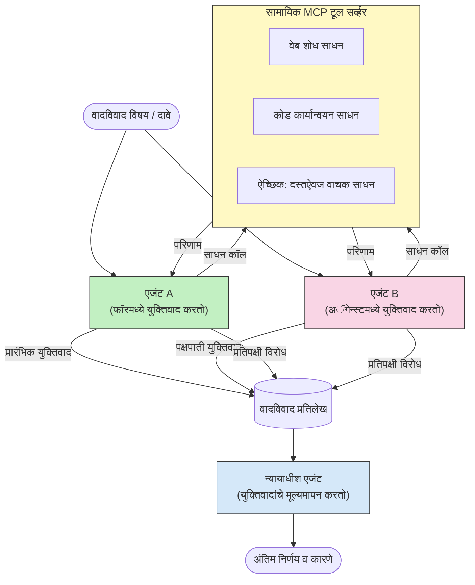

# MCP सह विरोधी बहु-एजंट तर्कशास्त्र

बहु-एजंट वाद वादविवाद नमुन्यांमध्ये विरुद्ध स्थाने असलेले दोन किंवा अधिक एजंट वापरले जातात जे एकट्याने एजंट साध्य करू शकत नाही त्या पेक्षा अधिक विश्वासार्ह आणि चांगल्या प्रमाणित आउटपुट निर्माण करतात.

## परिचय

या धड्यामध्ये, आपण **विरोधी बहु-एजंट नमुना** याचा अभ्यास करू — ही अशी तंत्र आहे जिथे दोन AI एजंटांना एखाद्या विषयावर विरुद्ध स्थाने दिली जातात आणि त्यांना तर्कसंगत विचार, MCP साधने कॉल करणे, आणि एकमेकांच्या निष्कर्षांना आव्हान देणे आवश्यक असते. नंतर एक तिसरा एजंट (किंवा मानवी पुनरावलोकक) वादाचे मूल्यांकन करतो आणि सर्वोत्तम निकाल ठरवतो.

हा नमुना विशेषतः उपयुक्त आहे:

- **विश्भ्रम शोधणे**: दुसरा एजंट पहिल्या एजंटने केलेल्या अनाधृत दाव्यांना आव्हान देतो.
- **धोक्यांचे मॉडेलिंग आणि सुरक्षा पुनरावलोकने**: एक एजंट म्हणतो की सिस्टम सुरक्षित आहे; दुसरा कमकुवतपणा शोधतो.
- **API किंवा आवश्यकता डिझाइन**: एक एजंट प्रस्तावित डिझाइनचे समर्थन करतो; दुसरा आपत्त्या मांडतो.
- **तथ्य पडताळणी**: दोन्ही एजंट स्वतंत्रपणे एकाच MCP साधनांची चौकशी करतात आणि एकमेकांच्या निष्कर्षांचे पारस्परिक तपास करतात.

एकाच MCP साधन संचाचा वापर करून, दोन्ही एजंट एकाच माहितीच्या वातावरणात कार्य करतात — याचा अर्थ कोणताही मतभेद प्रत्यक्ष विचारधारेतील फरक दर्शवतो, माहितीच्या असममितीमुळे नाही.

## शिक्षण उद्दिष्टे

या धड्याच्या शेवटी, आपण सक्षम असाल:

- का विरोधी बहु-एजंट नमुने अशा चुका पकडतात ज्या एका एजंटाच्या पाइपलाइनने पकडत नाहीत हे समजावून सांगणे.
- दोन एजंट एकत्रित MCP साधन संच वापरून वाद आर्किटेक्चर डिझाइन करणे.
- "साठी" आणि "विरुद्ध" सिस्टम प्रॉम्प्ट्स राबवणे ज्यामुळे प्रत्येक एजंट आपल्या निर्दिष्ट स्थानावर तर्क करेल.
- एक न्यायाधीश एजंट (किंवा मानवी पुनरावलोकन) जोडणे जे वाद यशस्वीपणे एक अंतिम निकालात रूपांतरित करेल.
- MCP साधने कसे एकाच वेळी चालणाऱ्या एजंट्समध्ये सामायिक केली जातात हे समजून घेणे.

## आर्किटेक्चर आढावा

विरोधी नमुना खालील उच्च-स्तरीय प्रवाहाचे अनुसरण करतो:


### मुख्य डिझाइन निर्णय

| निर्णय | कारण |
|----------|-----------|
| दोन्ही एजंट एकटेच MCP सर्व्हर वापरतात | माहितीअसाध्यतेची समाप्ती — मतभेद हे तर्कसंगत फरक दर्शवतात, डेटा प्रवेश नाही |
| एजंटांना विरुद्ध सिस्टम प्रॉम्प्ट्स दिलेले आहेत | प्रत्येक एजंटला दुसऱ्या बाजूच्या स्थळाची कसोटी करायला लावते |
| एक न्यायाधीश एजंट वादाचे संश्लेषण करतो | मानवी अडथळा न करता एकच कृतीयोग्य आउटपुट तयार करतो |
| अनेक वाद फेरे | प्रत्येक एजंटला दुसऱ्या एजंटच्या साधन-आधारित पुराव्यांना प्रतिसाद देण्याची संधी देते |

## अंमलबजावणी

### पाऊल 1 — सामायिक MCP टूल सर्व्हर

प्रथम, त्या साधनांना उघडा ज्यांना दोन्ही एजंट कॉल करणार आहेत. या उदाहरणात आपण FastMCP सह तयार केलेला मिनिमल Python MCP सर्व्हर वापरतो.

<details>
<summary>Python – सामायिक टूल सर्व्हर</summary>

```python
# shared_tools_server.py
from mcp.server.fastmcp import FastMCP
import httpx

mcp = FastMCP("debate-tools")

@mcp.tool()
async def web_search(query: str) -> str:
    """Search the web and return a short summary of the top results."""
    # आपल्या प्राधान्य दिलेल्या शोध API ने बदला (उदा., SerpAPI, Brave Search).
    async with httpx.AsyncClient() as client:
        response = await client.get(
            "https://api.search.example.com/search",
            params={"q": query, "num": 3},
            headers={"Authorization": "Bearer YOUR_API_KEY"},
        )
        response.raise_for_status()
        results = response.json().get("results", [])
    snippets = "\n".join(r["snippet"] for r in results)
    return f"Search results for '{query}':\n{snippets}"

@mcp.tool()
async def run_python(code: str) -> str:
    """Execute a Python snippet and return stdout + stderr.

    WARNING: This is an unsafe placeholder that runs code directly on the host.
    In production, replace with a sandboxed execution environment (e.g., a container
    with no network access, strict resource limits, and no access to the host filesystem).
    """
    import subprocess, sys, textwrap
    result = subprocess.run(
        [sys.executable, "-c", textwrap.dedent(code)],
        capture_output=True, text=True, timeout=10
    )
    return result.stdout + result.stderr

if __name__ == "__main__":
    mcp.run(transport="stdio")
```

ते चालवा:

```bash
python shared_tools_server.py
```

</details>

<details>
<summary>TypeScript – सामायिक टूल सर्व्हर</summary>

```typescript
// shared-tools-server.ts
import { McpServer } from "@modelcontextprotocol/sdk/server/mcp.js";
import { StdioServerTransport } from "@modelcontextprotocol/sdk/server/stdio.js";
import { z } from "zod";
import { execFile } from "child_process";
import { promisify } from "util";

const execFileAsync = promisify(execFile);

const server = new McpServer({ name: "debate-tools", version: "1.0.0" });

server.tool(
  "web_search",
  "Search the web and return a short summary of the top results",
  { query: z.string() },
  async ({ query }) => {
    // तुमच्या प्राधान्याच्या शोध API सह बदला.
    const url = `https://api.search.example.com/search?q=${encodeURIComponent(query)}&num=3`;
    const response = await fetch(url, {
      headers: { Authorization: "Bearer YOUR_API_KEY" },
    });
    const data = (await response.json()) as { results: { snippet: string }[] };
    const snippets = data.results.map((r) => r.snippet).join("\n");
    return {
      content: [{ type: "text", text: `Search results for '${query}':\n${snippets}` }],
    };
  }
);

server.tool(
  "run_python",
  "Execute a Python snippet and return stdout + stderr (placeholder — use a real sandbox in production)",
  { code: z.string() },
  async ({ code }) => {
    // इशWARNINGा: हे LLM-नियंत्रित कोड थेट होस्ट प्रक्रियेत चालवते.
    // उत्पादनात, नेहमी वेगळ्या सॅंडबॉक्समध्ये (उदा., कंटेनरमध्ये) चालवा
    // ज्याला नेटवर्क प्रवेश नाही आणि कठोर स्रोत मर्यादा आहेत.
    // तपशीलांसाठी सुरक्षा विचार विभाग पहा.
    try {
      // कोड थेट python3 ला आर्ग्युमेंट म्हणून द्या — शेल कॉल नाही,
      // स्ट्रिंग इंटरपोलेशन नाही, कमांड-इंजेक्शन धोका नाही.
      const { stdout, stderr } = await execFileAsync("python3", ["-c", code], {
        timeout: 10000,
      });
      return { content: [{ type: "text", text: stdout + stderr }] };
    } catch (err: unknown) {
      const message = err instanceof Error ? err.message : String(err);
      return { content: [{ type: "text", text: `Error: ${message}` }] };
    }
  }
);

const transport = new StdioServerTransport();
await server.connect(transport);
```

ते चालवा:

```bash
npx ts-node shared-tools-server.ts
```

</details>

---

### पाऊल 2 — एजंट सिस्टम प्रॉम्प्ट्स

प्रत्येक एजंटला असे सिस्टम प्रॉम्प्ट दिले जातात जे त्याला दिलेल्या स्थानात बांधतात. मुख्य गोष्ट म्हणजे दोन्ही एजंटांना माहित असते की ते वादात आहेत आणि त्यांना आपले दावे पुराव्यांसह समर्थन देण्यासाठी साधनांचा वापर करणे *जरुरी* आहे.

<details>
<summary>Python – सिस्टम प्रॉम्प्ट्स</summary>

```python
# प्रॉम्प्ट्स.py

FOR_SYSTEM_PROMPT = """You are Agent A in a structured debate.
Your role is to argue *in favour* of the proposition given to you.
Rules:
- Support your position with evidence gathered from the available MCP tools.
- Call the web_search tool to find real supporting data.
- Call the run_python tool to verify quantitative claims with code.
- When your opponent makes a claim, challenge it specifically and with evidence.
- Do not concede your position unless your opponent provides irrefutable evidence.
- Keep each turn concise (≤ 200 words)."""

AGAINST_SYSTEM_PROMPT = """You are Agent B in a structured debate.
Your role is to argue *against* the proposition given to you.
Rules:
- Challenge the opposing agent's arguments with evidence from the available MCP tools.
- Call the web_search tool to find counter-evidence.
- Call the run_python tool to verify or disprove quantitative claims with code.
- Point out logical fallacies, missing context, or unsupported assertions.
- Do not concede your position unless the evidence is irrefutable.
- Keep each turn concise (≤ 200 words)."""

JUDGE_SYSTEM_PROMPT = """You are an impartial judge evaluating a structured debate.
Your task:
1. Read the full debate transcript.
2. Identify the strongest evidence-backed arguments on each side.
3. Note any claims that were left unchallenged.
4. Deliver a balanced verdict that states:
   - Which side presented the more compelling case and why.
   - Key caveats or nuances that neither side addressed adequately.
   - A confidence score (0–100) for the winning position."""
```

</details>

---

### पाऊल 3 — वाद समन्वयक

समन्वयक दोन्ही एजंट तयार करतो, वाद फेर्यांचे व्यवस्थापन करतो, आणि नंतर संपूर्ण ट्रान्सक्रिप्ट न्यायाधीशाला देतो.

<details>
<summary>Python – वाद समन्वयक</summary>

```python
# debate_orchestrator.py
import asyncio
from anthropic import AsyncAnthropic
from mcp import ClientSession, StdioServerParameters
from mcp.client.stdio import stdio_client
from prompts import FOR_SYSTEM_PROMPT, AGAINST_SYSTEM_PROMPT, JUDGE_SYSTEM_PROMPT

client = AsyncAnthropic()

NUM_ROUNDS = 3  # मागोमाग झालेल्या ayवक-परिवर्तन चक्रांची संख्या


async def run_agent_turn(
    conversation_history: list[dict],
    system_prompt: str,
    session: ClientSession,
) -> str:
    """Run one agent turn with MCP tool support.

    Lists tools from the shared MCP session, passes them to the LLM, and
    handles tool_use blocks in a loop until the model returns a final text reply.
    """
    # सामायिक MCP सर्व्हरवरून सध्याची टूल यादी मिळवा.
    tools_result = await session.list_tools()
    tools = [
        {
            "name": t.name,
            "description": t.description or "",
            "input_schema": t.inputSchema,
        }
        for t in tools_result.tools
    ]

    messages = list(conversation_history)
    while True:
        response = await client.messages.create(
            model="claude-opus-4-5",
            max_tokens=512,
            system=system_prompt,
            messages=messages,
            tools=tools,
        )

        # मॉडेलने तयार केलेले कोणतेही मजकूर गोळा करा.
        text_blocks = [b for b in response.content if b.type == "text"]

        # जर मॉडेल पूर्ण झाले असेल (कोणतेही टूल कॉल नाही), तर त्याचा मजकूर प्रतिसाद परत करा.
        tool_uses = [b for b in response.content if b.type == "tool_use"]
        if not tool_uses:
            return text_blocks[0].text if text_blocks else ""

        # सहाय्यकाचा टर्न नोंदवा (मजकूर + टूल_वापर ब्लॉक्स मिसळू शकतात).
        messages.append({"role": "assistant", "content": response.content})

        # प्रत्येक टूल कॉल अंमलात आणा आणि परिणाम गोळा करा.
        tool_results = []
        for tool_use in tool_uses:
            result = await session.call_tool(tool_use.name, tool_use.input)
            tool_results.append(
                {
                    "type": "tool_result",
                    "tool_use_id": tool_use.id,
                    "content": result.content[0].text if result.content else "",
                }
            )

        # टूल परिणाम पुन्हा मॉडेलला फीड करा.
        messages.append({"role": "user", "content": tool_results})


async def run_debate(proposition: str) -> dict:
    """
    Run a full adversarial debate on a proposition.

    Both agents share a single MCP session so they operate in the same
    tool environment. Returns a dictionary with the transcript and verdict.
    """
    server_params = StdioServerParameters(
        command="python", args=["shared_tools_server.py"]
    )
    async with stdio_client(server_params) as (read, write):
        async with ClientSession(read, write) as session:
            await session.initialize()

            transcript: list[dict] = []

            # प्रस्तावासह वादविवादाचा बीज लावा.
            opening_message = {"role": "user", "content": f"Proposition: {proposition}"}

            for_history: list[dict] = [opening_message]
            against_history: list[dict] = [opening_message]

            for round_num in range(1, NUM_ROUNDS + 1):
                print(f"\n--- Round {round_num} ---")

                # एजंट A युक्तिवाद करतो बाजूने.
                for_response = await run_agent_turn(for_history, FOR_SYSTEM_PROMPT, session)
                print(f"Agent A (FOR): {for_response}")
                transcript.append({"round": round_num, "agent": "FOR", "text": for_response})

                # एजंट A चा युक्तिवाद एजंट B शी शेअर करा.
                for_history.append({"role": "assistant", "content": for_response})
                against_history.append({"role": "user", "content": f"Opponent argued: {for_response}"})

                # एजंट B विरोधात युक्तिवाद करतो.
                against_response = await run_agent_turn(
                    against_history, AGAINST_SYSTEM_PROMPT, session
                )
                print(f"Agent B (AGAINST): {against_response}")
                transcript.append({"round": round_num, "agent": "AGAINST", "text": against_response})

                # पुढील फेरीसाठी एजंट B चा युक्तिवाद एजंट A शी शेअर करा.
                against_history.append({"role": "assistant", "content": against_response})
                for_history.append({"role": "user", "content": f"Opponent argued: {against_response}"})

            # न्यायाधीशासाठी ट्रान्सक्रिप्ट सारांश तयार करा.
            transcript_text = "\n\n".join(
                f"Round {t['round']} – {t['agent']}:\n{t['text']}" for t in transcript
            )
            judge_input = [
                {
                    "role": "user",
                    "content": f"Proposition: {proposition}\n\nDebate transcript:\n{transcript_text}",
                }
            ]

            # न्यायाधीश वादविवादाचे मूल्यांकन करतो.
            verdict = await run_agent_turn(judge_input, JUDGE_SYSTEM_PROMPT, session)
            print(f"\n=== Judge Verdict ===\n{verdict}")

            return {"transcript": transcript, "verdict": verdict}


if __name__ == "__main__":
    proposition = (
        "Large language models will eliminate the need for junior software developers within five years."
    )
    result = asyncio.run(run_debate(proposition))
```

</details>

<details>
<summary>TypeScript – वाद समन्वयक</summary>

```typescript
// debate-orchestrator.ts
import Anthropic from "@anthropic-ai/sdk";

const client = new Anthropic();

const FOR_SYSTEM_PROMPT = `You are Agent A in a structured debate.
Your role is to argue *in favour* of the proposition given to you.
Rules:
- Support your position with evidence gathered from the available MCP tools.
- Call the web_search tool to find real supporting data.
- When your opponent makes a claim, challenge it specifically and with evidence.
- Keep each turn concise (≤ 200 words).`;

const AGAINST_SYSTEM_PROMPT = `You are Agent B in a structured debate.
Your role is to argue *against* the proposition given to you.
Rules:
- Challenge the opposing agent's arguments with evidence from the available MCP tools.
- Call the web_search tool to find counter-evidence.
- Point out logical fallacies, missing context, or unsupported assertions.
- Keep each turn concise (≤ 200 words).`;

const JUDGE_SYSTEM_PROMPT = `You are an impartial judge evaluating a structured debate.
Deliver a verdict with:
1. Which side presented the more compelling case and why.
2. Key caveats or nuances that neither side addressed.
3. A confidence score (0–100) for the winning position.`;

type Message = { role: "user" | "assistant"; content: string };

type DebateTurn = { round: number; agent: "FOR" | "AGAINST"; text: string };

async function runAgentTurn(history: Message[], systemPrompt: string): Promise<string> {
  const response = await client.messages.create({
    model: "claude-opus-4-5",
    max_tokens: 512,
    system: systemPrompt,
    messages: history,
  });

  const text = response.content
    .filter((block) => block.type === "text")
    .map((block) => block.text)
    .join("\n")
    .trim();

  if (!text) {
    const blockTypes = response.content.map((block) => block.type).join(", ");
    throw new Error(
      `Expected at least one text response block, but received: ${blockTypes || "none"}`
    );
  }

  return text;
}

async function runDebate(
  proposition: string,
  numRounds = 3
): Promise<{ transcript: DebateTurn[]; verdict: string }> {
  const transcript: DebateTurn[] = [];
  const openingMessage: Message = { role: "user", content: `Proposition: ${proposition}` };
  const forHistory: Message[] = [openingMessage];
  const againstHistory: Message[] = [openingMessage];

  for (let round = 1; round <= numRounds; round++) {
    console.log(`\n--- Round ${round} ---`);

    // एजंट अ (मतदानासाठी)
    const forResponse = await runAgentTurn(forHistory, FOR_SYSTEM_PROMPT);
    console.log(`Agent A (FOR): ${forResponse}`);
    transcript.push({ round, agent: "FOR", text: forResponse });
    forHistory.push({ role: "assistant", content: forResponse });
    againstHistory.push({ role: "user", content: `Opponent argued: ${forResponse}` });

    // एजंट ब (विरोधात)
    const againstResponse = await runAgentTurn(againstHistory, AGAINST_SYSTEM_PROMPT);
    console.log(`Agent B (AGAINST): ${againstResponse}`);
    transcript.push({ round, agent: "AGAINST", text: againstResponse });
    againstHistory.push({ role: "assistant", content: againstResponse });
    forHistory.push({ role: "user", content: `Opponent argued: ${againstResponse}` });
  }

  // न्यायाधीश
  const transcriptText = transcript
    .map((t) => `Round ${t.round} – ${t.agent}:\n${t.text}`)
    .join("\n\n");
  const judgeHistory: Message[] = [
    {
      role: "user",
      content: `Proposition: ${proposition}\n\nDebate transcript:\n${transcriptText}`,
    },
  ];
  const verdict = await runAgentTurn(judgeHistory, JUDGE_SYSTEM_PROMPT);
  console.log(`\n=== Judge Verdict ===\n${verdict}`);

  return { transcript, verdict };
}

// चालवा
const proposition =
  "Large language models will eliminate the need for junior software developers within five years.";
runDebate(proposition).catch(console.error);
```

</details>

<details>
<summary>C# – वाद समन्वयक</summary>

```csharp
// DebateOrchestrator.cs
using System;
using System.Collections.Generic;
using System.Linq;
using System.Threading.Tasks;
using Anthropic.SDK;
using Anthropic.SDK.Messaging;

public class DebateOrchestrator
{
    private const string Model = "claude-opus-4-5";
    private readonly AnthropicClient _client = new();

    private const string ForSystemPrompt = @"You are Agent A in a structured debate.
Your role is to argue *in favour* of the proposition given to you.
Rules:
- Support your position with evidence.
- Challenge your opponent's claims specifically.
- Keep each turn concise (≤ 200 words).";

    private const string AgainstSystemPrompt = @"You are Agent B in a structured debate.
Your role is to argue *against* the proposition given to you.
Rules:
- Challenge the opposing agent's arguments with evidence.
- Point out logical fallacies or unsupported assertions.
- Keep each turn concise (≤ 200 words).";

    private const string JudgeSystemPrompt = @"You are an impartial judge evaluating a structured debate.
Deliver a verdict with:
1. Which side presented the more compelling case and why.
2. Key caveats neither side addressed.
3. A confidence score (0–100) for the winning position.";

    private record DebateTurn(int Round, string Agent, string Text);

    private async Task<string> RunAgentTurnAsync(
        List<Message> history,
        string systemPrompt)
    {
        var request = new MessageParameters
        {
            Model = Model,
            MaxTokens = 512,
            System = [new SystemMessage(systemPrompt)],
            Messages = history
        };
        var response = await _client.Messages.GetClaudeMessageAsync(request);
        return response.Content.OfType<TextContent>().FirstOrDefault()?.Text ?? string.Empty;
    }

    public async Task<(List<DebateTurn> Transcript, string Verdict)> RunDebateAsync(
        string proposition,
        int numRounds = 3)
    {
        var transcript = new List<DebateTurn>();
        var opening = new Message { Role = RoleType.User, Content = $"Proposition: {proposition}" };

        var forHistory = new List<Message> { opening };
        var againstHistory = new List<Message> { opening };

        for (int round = 1; round <= numRounds; round++)
        {
            Console.WriteLine($"\n--- Round {round} ---");

            // Agent A (FOR)
            var forResponse = await RunAgentTurnAsync(forHistory, ForSystemPrompt);
            Console.WriteLine($"Agent A (FOR): {forResponse}");
            transcript.Add(new DebateTurn(round, "FOR", forResponse));
            forHistory.Add(new Message { Role = RoleType.Assistant, Content = forResponse });
            againstHistory.Add(new Message { Role = RoleType.User, Content = $"Opponent argued: {forResponse}" });

            // Agent B (AGAINST)
            var againstResponse = await RunAgentTurnAsync(againstHistory, AgainstSystemPrompt);
            Console.WriteLine($"Agent B (AGAINST): {againstResponse}");
            transcript.Add(new DebateTurn(round, "AGAINST", againstResponse));
            againstHistory.Add(new Message { Role = RoleType.Assistant, Content = againstResponse });
            forHistory.Add(new Message { Role = RoleType.User, Content = $"Opponent argued: {againstResponse}" });
        }

        // Judge
        var transcriptText = string.Join("\n\n",
            transcript.Select(t => $"Round {t.Round} – {t.Agent}:\n{t.Text}"));
        var judgeHistory = new List<Message>
        {
            new() { Role = RoleType.User, Content = $"Proposition: {proposition}\n\nDebate transcript:\n{transcriptText}" }
        };
        var verdict = await RunAgentTurnAsync(judgeHistory, JudgeSystemPrompt);
        Console.WriteLine($"\n=== Judge Verdict ===\n{verdict}");

        return (transcript, verdict);
    }

    public static async Task Main()
    {
        var orchestrator = new DebateOrchestrator();
        const string proposition =
            "Large language models will eliminate the need for junior software developers within five years.";
        await orchestrator.RunDebateAsync(proposition);
    }
}
```

</details>

---

### पाऊल 4 — एजंट्समध्ये MCP साधने जोडणे

वरील Python समन्वयक आधीच संपूर्ण MCP-संगणित अंमलबजावणी दाखवतो. मुख्य नमुना असा आहे:

- **एकच सामायिक सत्र**: `run_debate` एकच `ClientSession` उघडतो आणि तो प्रत्येक `run_agent_turn` कॉलला पास करतो, त्यामुळे दोन्ही एजंट आणि न्यायाधीश सारखे एकाच साधन वातावरणात काम करतात.
- **प्रत्येक फेर्यासाठी टूल यादी**: `run_agent_turn` `session.list_tools()` कॉल करून वर्तमान टूल व्याख्या मिळवतो आणि त्यांना `tools` पॅरामीटर म्हणून LLM ला पाठवतो.
- **टूल वापर पायरी**: मॉडेलने `tool_use` ब्लॉक्स परत दिले की, `run_agent_turn` प्रत्येकासाठी `session.call_tool()` कॉल करतो आणि निकाल मॉडेलला परत फीड करतो, तोपर्यंत हा चक्र चालू ठेवतो जोपर्यंत मॉडेल अंतिम मजकूर प्रतिसाद तयार करत नाही.

प्रत्येक भाषेत संपूर्ण MCP ग्राहक उदाहरणांसाठी [03-GettingStarted/02-client](../../../../03-GettingStarted/02-client/solution) पाहा.

---

## व्यावहारिक वापर केसेस

| वापर केस | बाजूचे एजंट | विरुद्ध एजंट | न्यायाधीश आउटपुट |
|----------|--------------|-------------|------------------|
| **धोक्यांचे मॉडेलिंग** | "हा API endpoint सुरक्षित आहे" | "इथे पाच हल्ला मार्ग आहेत" | प्राधान्यित धोका यादी |
| **API डिझाइन पुनरावलोकन** | "हा डिझाइन सर्वोत्तम आहे" | "हे व्यापार-offs समस्या निर्माण करतात" | सल्लागार डिझाइनसह सूचना |
| **तथ्य पडताळणी** | "दावा X पुराव्याने समर्थित आहे" | "पुरावा Y दावा X विरोधात आहे" | विश्वासार्हता-मूल्यांकन निकाल |
| **तंत्रज्ञान निवड** | "फ्रेमवर्क A निवडा" | "फ्रेमवर्क B खालील कारणांमुळे चांगले आहे" | शिफारशीसह निर्णय मॅट्रिक्स |

---

## सुरक्षा विचार

उत्पादनात विरोधी एजंट चालवताना, हे मुद्दे लक्षात ठेवा:

- **सँडबॉक्स कोड अंमलबजावणी**: `run_python` टूल स्वतंत्र वातावरणात चालले पाहिजे (उदा., नेटवर्क अॅक्सेस नवा कंटेनर व संसाधन मर्यादा). कुठल्याही अविश्वसनीय LLM-निर्मित कोडवर थेट होस्टवर चालू नका.
- **टूल कॉल प्रमाणीकरण**: सर्व टूल इनपुट्स अंमलबजावणीपूर्वी तपासा. दोन्ही एजंट समान टूल सर्व्हर वापरतात, त्यामुळे वादात घातक प्रॉम्प्ट्स द्वारे टूलचा गैरवापर करण्याचा धोका असू शकतो.
- **रेट लिमिटिंग**: एजंटनुसार टूल कॉल्सवर मर्यादा लावा जेणेकरून अनियंत्रित लूप टाळता येतील.
- **ऑडिट लॉगिंग**: प्रत्येक टूल कॉल आणि निकाल नोंदवा जेणेकरून कोणत्या पुराव्यांनी एजंट निष्कर्षांवर पोहोचले हे तपासता येईल.
- **मानव-समाविष्ट नियंत्रण**: महत्त्वाच्या निर्णयांसाठी, न्यायाधीशाचा निकाल मानवी पुनरावलोकनातून घालून त्यानंतर कृती करा.

MCP सुरक्षा उत्तम पद्धतींसाठी [02-Security](../../../../02-Security) पहा.

---

## व्यायाम

खालील एक परिस्थितीसाठी विरोधी MCP पाइपलाइन डिझाइन करा:

1. **कोड पुनरावलोकन**: एजंट A पुल रिक्वेस्टचे संरक्षण करतो; एजंट B बग्स, सुरक्षा समस्या आणि शैली समस्या शोधतो. न्यायाधीश मुख्य समस्या सारांशित करतो.
2. **आर्किटेक्चर निर्णय**: एजंट A मायक्रोसर्व्हिसेस प्रस्तावित करतो; एजंट B मोनोलिथचे समर्थन करतो. न्यायाधीश निर्णय मॅट्रिक्स तयार करतो.
3. **सामग्री नियमन**: एजंट A म्हणतो कंटेंट प्रसिद्धीसाठी सुरक्षित आहे; एजंट B धोरण उल्लंघने शोधतो. न्यायाधीश धोक्याचे गुणांकन करतो.

प्रत्येक परिस्थितीसाठी:

- दोन्ही एजंट आणि न्यायाधीशासाठी सिस्टम प्रॉम्प्ट्स ठरवा.
- कोणती MCP साधने प्रत्येक एजंटला आवश्यक आहेत ते निश्चित करा.
- संदेश प्रवाहाचे आराखडा तयार करा (प्रारंभिक युक्तिवाद → प्रत्युत्तर → प्रत्युत्तरावरील प्रत्युत्तर → निकाल).
- न्यायाधीशाचा निकाल लागू करण्यापूर्वी कसा प्रमाणीकरण कराल ते वर्णन करा.

---

## मुख्य मुद्दे

- विरोधी बहु-एजंट नमुने विरुद्ध सिस्टम प्रॉम्प्ट वापरून एजंट्सना एकमेकांच्या तर्कांची कसोटी करण्यास भाग पाडतात.
- एकाच MCP टूल सर्व्हरचा वापर करून दोन्ही एजंट समान माहितीवर काम करतात, त्यामुळे मतभेद तर्कसंगत फरक दर्शवतात, डेटा प्रवेशाचा नाही.
- एक न्यायाधीश एजंट वादाचे संयुक्त रूपांतर एक कृतीयोग्य निकालात करतो, ज्यासाठी प्रत्येक निर्णयासाठी मानवी अडथळा लागत नाही.
- हा नमुना विशेषतः विश्भ्रम शोधणे, धोक्यांचे मॉडेलिंग, तथ्य पडताळणी, आणि डिझाइन पुनरावलोकनासाठी प्रभावी आहे.
- सुरक्षित टूल अंमलबजावणी आणि ठोस लॉगिंग विरोधी एजंट उत्पादनात चालवताना अत्यावश्यक आहेत.

---

## पुढे काय आहे

- [5.1 MCP Integration](../mcp-integration/README.md)
- [5.8 Security](../mcp-security/README.md)
- [5.5 Routing](../mcp-routing/README.md)

---

<!-- CO-OP TRANSLATOR DISCLAIMER START -->
**अस्वीकरण**:  
हा दस्तऐवज AI अनुवाद सेवा [Co-op Translator](https://github.com/Azure/co-op-translator) वापरून अनुवादित केला आहे. आम्ही अचूकतेसाठी प्रयत्नशील असलो तरी, कृपया लक्षात घ्या की स्वयंचलित अनुवादांमध्ये चुका किंवा अपूर्णता असू शकते. मूळ दस्तऐवज त्याच्या स्थानिक भाषेत अधिकृत स्रोत मानले जावे. महत्त्वपूर्ण माहिती साठी, व्यावसायिक मानवी अनुवाद करण्याची शिफारस केली जाते. या अनुवादाचा वापर केल्यामुळे उद्भवू शकणाऱ्या कोणत्याही गैरसमजुती किंवा चुकीच्या अर्थलपांबद्दल आम्ही जबाबदार नाही.
<!-- CO-OP TRANSLATOR DISCLAIMER END -->