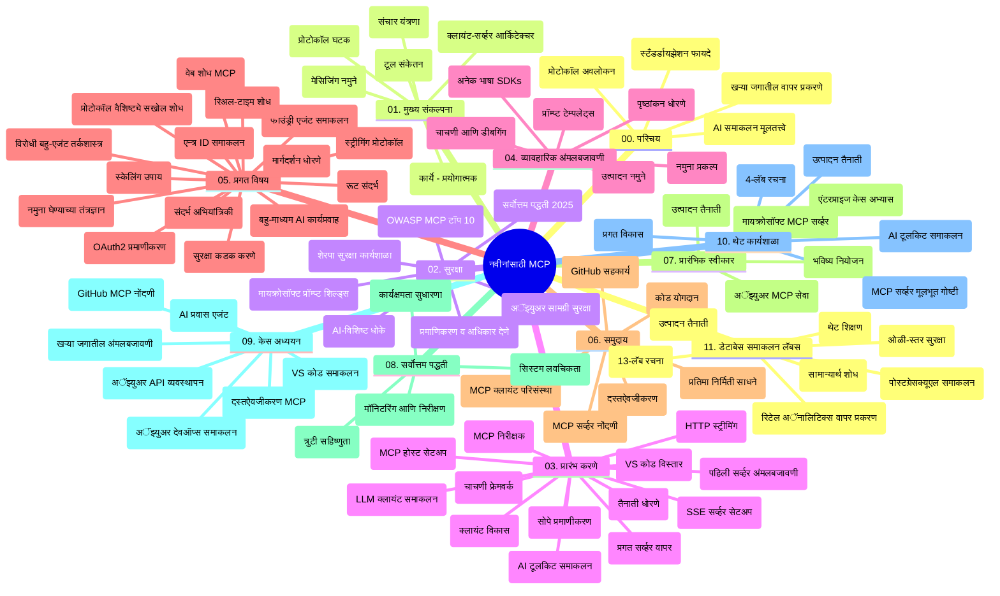

# बिगिनर्ससाठी मॉडेल कॉन्टेक्स्ट प्रोटोकॉल (MCP) - अभ्यास मार्गदर्शक

हा अभ्यास मार्गदर्शक "बिगिनर्ससाठी मॉडेल कॉन्टेक्स्ट प्रोटोकॉल (MCP)" अभ्यासक्रमासाठी रिपॉझिटरीची रचना आणि सामग्री याचा आढावा प्रदान करतो. रिपॉझिटरीमध्ये सहजपणे नेव्हिगेट करण्यासाठी आणि उपलब्ध संसाधनांचा अधिकतम लाभ घेण्यासाठी हा मार्गदर्शक वापरा.

## रिपॉझिटरीचा आढावा

मॉडेल कॉन्टेक्स्ट प्रोटोकॉल (MCP) हे AI मॉडेल्स आणि क्लायंट अनुप्रयोगांमधील परस्परसंवादासाठी एक प्रमाणित फ्रेमवर्क आहे. सुरुवातीला Anthropic ने तयार केलेले, MCP आता अधिक व्यापक MCP कम्युनिटीद्वारे अधिकृत GitHub संघटनेत व्यवस्थापित केले जाते. ही रिपॉझिटरी C#, Java, JavaScript, Python आणि TypeScript मधील प्रॅक्टिकल कोड उदाहरणांसह एक सर्वसमावेशक अभ्यासक्रम प्रदान करते, जो AI विकसक, सिस्टम आर्किटेक्ट आणि सॉफ्टवेअर अभियंत्यांसाठी तयार केला आहे.

## व्हिज्युअल अभ्यासक्रम नकाशा

## रिपॉझिटरी रचना

ही रिपॉझिटरी एकूण अकरा मुख्य विभागांमध्ये विभागलेली आहे, प्रत्येक विभाग MCP च्या वेगवेगळ्या पैलूंवर लक्ष केंद्रित करतो:

1. **परिचय (00-Introduction/)**
   - मॉडेल कॉन्टेक्स्ट प्रोटोकॉलचा आढावा
   - AI पाइपलाइन्समध्ये मानकीकरण का आवश्यक आहे
   - व्यावहारिक वापरकेस आणि फायदे

2. **कोर संकल्पना (01-CoreConcepts/)**
   - क्लायंट-सर्व्हर आर्किटेक्चर
   - प्रमुख प्रोटोकॉल घटक
   - MCP मधील मेसेजिंग पॅटर्न्स

3. **सुरक्षा (02-Security/)**
   - MCP आधारित प्रणालीतील सुरक्षा धोके
   - सुरक्षितता सुनिश्चित करण्याच्या सर्वोत्तम पद्धती
   - प्रमाणीकरण आणि अधिकृत धोरणे
   - **संपूर्ण सुरक्षा दस्तऐवजीकरण**:
     - MCP सुरक्षा सर्वोत्तम पद्धती 2025
     - Azure कंटेंट सुरक्षा अंमलबजावणी मार्गदर्शक
     - MCP सुरक्षा नियंत्रण आणि तंत्रे
     - MCP सर्वोत्तम पद्धती जलद संदर्भ
   - **महत्त्वाचे सुरक्षा विषय**:
     - प्रॉम्प्ट इंजेक्शन आणि टूल विषबाधा हल्ले
     - सत्र हायजॅकिंग आणि गोंधळलेले डेप्युटी समस्या
     - टोकन पासथ्रू दोष
     - जास्त परवानग्या आणि प्रवेश नियंत्रण
     - AI घटकांसाठी पुरवठा साखळी सुरक्षा
     - Microsoft प्रॉम्प्ट शिल्ड्स एकत्रीकरण

4. **सुरूवात करणे (03-GettingStarted/)**
   - पर्यावरण सेटअप आणि कॉन्फिगरेशन
   - मूलभूत MCP सर्व्हर आणि क्लायंट तयार करणे
   - विद्यमान अनुप्रयोगांशी एकत्रीकरण
   - खालील विभागांचा समावेश:
     - पहिला सर्व्हर अंमलबजावणी
     - क्लायंट विकास
     - LLM क्लायंट एकत्रीकरण
     - VS कोड एकत्रीकरण
     - सर्व्हर-सेंट इव्हेंट्स (SSE) सर्व्हर
     - प्रगत सर्व्हर वापर
     - HTTP स्ट्रीमिंग
     - AI टूलकिट एकत्रीकरण
     - चाचणी धोरणे
     - वितरण मार्गदर्शक

5. **प्रॅक्टिकल अंमलबजावणी (04-PracticalImplementation/)**
   - विविध प्रोग्रामिंग भाषांमध्ये SDK वापर
   - डीबगिंग, चाचणी, आणि पडताळणी तंत्रे
   - पुनर्निर्मित करण्यायोग्य प्रॉम्प्ट टेम्पलेट्स आणि वर्कफ्लोज तयार करणे
   - अंमलबजावणी उदाहरणांसह नमुना प्रकल्प

6. **प्रगत विषय (05-AdvancedTopics/)**
   - कॉन्टेक्स्ट अभियांत्रिकी तंत्रे
   - Foundry एजंट एकत्रीकरण
   - मल्टी-मॉडल AI वर्कफ्लोज
   - OAuth2 प्रमाणीकरण डेमो
   - रिअल-टाइम शोध क्षमता
   - रिअल-टाइम स्ट्रीमिंग
   - रूट कॉन्टेक्स्ट्स अंमलबजावणी
   - राउटिंग धोरणे
   - सॅम्पलिंग तंत्रे
   - स्केलिंग पद्धती
   - सुरक्षा विचार
   - Entra ID सुरक्षा एकत्रीकरण
   - वेब शोध एकत्रीकरण
   - प्रतिद्वंद्वी बहु-एजंट कारणमंत्रणा (विवाद पॅटर्न्स)

7. **कम्युनिटी योगदान (06-CommunityContributions/)**
   - कोड आणि दस्तऐवज मध्ये कसे योगदान द्यावे
   - GitHub द्वारे सहकार्य करणे
   - समुदायावर आधारित सुधारणा आणि अभिप्राय
   - विविध MCP क्लायंट्स वापरणे (Claude Desktop, Cline, VSCode)
   - लोकप्रिय MCP सर्व्हर्ससह कार्य करणे ज्यात प्रतिमा निर्मिती समाविष्ट आहे

8. **प्रारंभिक स्वीकारणीतून धडे (07-LessonsfromEarlyAdoption/)**
   - प्रत्यक्ष अंमलबजावण्या आणि यशोगाथा
   - MCP आधारित सोल्यूशन्स तयार करणे आणि वितरण करणे
   - ट्रेंड्स आणि भविष्यातील रोडमॅप
   - **Microsoft MCP सर्व्हर मार्गदर्शक**: 10 उत्पादन-तयार Microsoft MCP सर्व्हरचा सविस्तर मार्गदर्शक ज्यात समाविष्ट आहेत:
     - Microsoft Learn Docs MCP सर्व्हर
     - Azure MCP सर्व्हर (15+ विशेष कनेक्टर्स)
     - GitHub MCP सर्व्हर
     - Azure DevOps MCP सर्व्हर
     - MarkItDown MCP सर्व्हर
     - SQL Server MCP सर्व्हर
     - Playwright MCP सर्व्हर
     - Dev Box MCP सर्व्हर
     - Azure AI Foundry MCP सर्व्हर
     - Microsoft 365 Agents Toolkit MCP सर्व्हर

9. **सर्वोत्कृष्ट पद्धती (08-BestPractices/)**
   - कार्यक्षमता सुधारणा आणि ट्यूनिंग
   - दोष सहिष्णू MCP प्रणाली डिझाइन करणे
   - चाचणी आणि टिकाऊपणा धोरणे

10. **केस स्टडीज (09-CaseStudy/)**
    - **सात सर्वसमावेशक केस स्टडीज** जी विविध परिस्थितींमध्ये MCP च्या लवचिकतेचे प्रदर्शन करतात:
    - **Azure AI ट्रॅव्हल एजंट्स**: Azure OpenAI आणि AI सर्चसह मल्टी-एजंट ऑर्केस्ट्रेशन
    - **Azure DevOps एकत्रीकरण**: YouTube डेटा अद्यतनांसह वर्कफ्लो प्रक्रिया स्वयंचलित करणे
    - **रिअल-टाइम डॉक्युमेंटेशन पुनर्प्राप्ती**: Python कन्सोल क्लायंटसह HTTP स्ट्रीमिंग
    - **इंटरऐक्टिव्ह स्टडी प्लान जनरेटर**: Chainlit वेब अ‍ॅपसह संभाषणात्मक AI
    - **इन-एडिटर डॉक्युमेंटेशन**: VS कोड GitHub Copilot वर्कफ्लोजसह एकत्रीकरण
    - **Azure API व्यवस्थापन**: एंटरप्राइझ API एकत्रीकरण आणि MCP सर्व्हर तयार करणे
    - **GitHub MCP रजिस्टर**: इकोसिस्टम विकास आणि एजंटिक एकत्रीकरण प्लॅटफॉर्म
    - एंटरप्राइझ एकत्रीकरण, विकसक उत्पादकता, आणि इकोसिस्टम विकासावर आधारित अंमलबजावणी उदाहरणे

11. **हँड्स-ऑन वर्कशॉप (10-StreamliningAIWorkflowsBuildingAnMCPServerWithAIToolkit/)**
    - MCP आणि AI टूलकिट एकत्र करून सर्वसमावेशक हँड्स-ऑन वर्कशॉप
    - AI मॉडेल्सना वास्तविक जगातील उपकरणांशी जोडणारे बुद्धिमान अनुप्रयोग तयार करणे
    - मूलभूत गोष्टी, कस्टम सर्व्हर विकास, आणि उत्पादन वितरण धोरणे या व्यावहारिक मॉड्यूल्सचा समावेश
    - **लॅब रचना**:
      - लॅब 1: MCP सर्व्हर मूलभूत गोष्टी
      - लॅब 2: प्रगत MCP सर्व्हर विकास
      - लॅब 3: AI टूलकिट एकत्रीकरण
      - लॅब 4: उत्पादन वितरण आणि स्केलिंग
    - टप्प्याटप्प्याने सूचना देणारी लॅब-आधारित शिकण्याची पद्धत

12. **MCP सर्व्हर डेटाबेस एकत्रीकरण लॅब्स (11-MCPServerHandsOnLabs/)**
    - उत्पादन-तयार MCP सर्व्हर्स PostgreSQL एकत्रीकरणासह तयार करण्यासाठी **पूर्ण 13-लॅब शिकण्याचा मार्ग**
    - Zava Retail वापर प्रकरणासह प्रत्यक्ष रिटेल विश्लेषण अंमलबजावणी
    - एंटरप्राइझ-ग्रेड पॅटर्न्स जसे Row Level Security (RLS), सेमॅंटिक सर्च, आणि मल्टी-टेनेन्ट डेटा प्रवेश
    - **पूर्ण लॅब रचना**:
      - **लॅब्स 00-03: मूलभूत गोष्टी** - परिचय, आर्किटेक्चर, सुरक्षा, पर्यावरण सेटअप
      - **लॅब्स 04-06: MCP सर्व्हर तयार करणे** - डेटाबेस डिझाइन, MCP सर्व्हर अंमलबजावणी, टूल विकास
      - **लॅब्स 07-09: प्रगत वैशिष्ट्ये** - सेमॅंटिक सर्च, चाचणी व डीबगिंग, VS कोड एकत्रीकरण
      - **लॅब्स 10-12: उत्पादन आणि सर्वोत्तम पद्धती** - वितरण, मॉनिटरिंग, ऑप्टिमायझेशन
    - **आवृत तंत्रज्ञान**: FastMCP फ्रेमवर्क, PostgreSQL, Azure OpenAI, Azure कंटेनर अ‍ॅप्स, अ‍ॅप्लिकेशन इन्साइट्स
    - **शिकण्याचे परिणाम**: उत्पादन-तयार MCP सर्व्हर, डेटाबेस एकत्रीकरण नमुने, AI-चालित विश्लेषण, एंटरप्राइझ सुरक्षा

## अतिरिक्त संसाधने

रिपॉझिटरीमध्ये सहाय्यक संसाधने देखील समाविष्ट आहेत:

- **प्रतिमा फोल्डर**: अभ्यासक्रमात वापरलेली आकृती आणि चित्रे
- **अनुवाद**: दस्तऐवजांचे स्वयंचलित बहुभाषिक अनुवाद
- **अधिकृत MCP संसाधने**:
  - [MCP Documentation](https://modelcontextprotocol.io/)
  - [MCP Specification](https://spec.modelcontextprotocol.io/)
  - [MCP GitHub Repository](https://github.com/modelcontextprotocol)

## ही रिपॉझिटरी कशी वापरावी

1. **क्रमिक शिक्षण**: अभ्यासक्रमातील प्रकरणे (00 ते 11) क्रमाने पाठपुरावा करा.
2. **भाषा-विशिष्ट लक्ष केंद्रित करा**: आपल्याला विशेष भाषेत रस असल्यास, आपल्या पसंतीच्या भाषेमध्ये अंमलबजावण्या पाहण्यासाठी सॅम्पल डिरेक्टरीज द्या.
3. **प्रायोगिक अंमलबजावणी**: आपले पर्यावरण सेट करण्यासाठी आणि आपला पहिला MCP सर्व्हर व क्लायंट तयार करण्यासाठी "सुरूवात करणे" विभागातून प्रारंभ करा.
4. **प्रगत अन्वेषण**: मूलभूत गोष्टी समजल्या की प्रगत विषयात खोलवर जा आणि आपले ज्ञान वाढवा.
5. **समुदाय सहभाग**: GitHub चर्चा आणि Discord चॅनेल्सद्वारे MCP समुदायात सहभागी व्हा आणि तज्ञ व अन्य विकसकांशी संपर्क करा.

## MCP क्लायंट्स आणि टूल्स

अभ्यासक्रमात विविध MCP क्लायंट्स आणि टूल्स यांचा समावेश आहे:

1. **अधिकृत क्लायंट्स**:
   - Visual Studio Code
   - Visual Studio Code मधील MCP
   - Claude Desktop
   - VSCode मधील Claude
   - Claude API

2. **समुदाय क्लायंट्स**:
   - Cline (टर्मिनल-आधारित)
   - Cursor (कोड संपादक)
   - ChatMCP
   - Windsurf

3. **MCP व्यवस्थापन टूल्स**:
   - MCP CLI
   - MCP Manager
   - MCP Linker
   - MCP Router

## लोकप्रिय MCP सर्व्हर्स

रिपॉझिटरी विविध MCP सर्व्हर्सची ओळख करुन देतो, त्यात समाविष्ट आहेत:

1. **अधिकृत Microsoft MCP सर्व्हर्स**:
   - Microsoft Learn Docs MCP सर्व्हर
   - Azure MCP सर्व्हर (15+ विशेष कनेक्टर्स)
   - GitHub MCP सर्व्हर
   - Azure DevOps MCP सर्व्हर
   - MarkItDown MCP सर्व्हर
   - SQL Server MCP सर्व्हर
   - Playwright MCP सर्व्हर
   - Dev Box MCP सर्व्हर
   - Azure AI Foundry MCP सर्व्हर
   - Microsoft 365 Agents Toolkit MCP सर्व्हर

2. **अधिकृत संदर्भ सर्व्हर्स**:
   - फाइलसिस्टम
   - Fetch
   - मेमरी
   - सिक्वेन्शियल थिंकिंग

3. **प्रतिमा निर्मिती**:
   - Azure OpenAI DALL-E 3
   - Stable Diffusion WebUI
   - Replicate

4. **विकास टूल्स**:
   - Git MCP
   - टर्मिनल कंट्रोल
   - कोड असिस्टंट

5. **विशेषीकृत सर्व्हर्स**:
   - Salesforce
   - Microsoft Teams
   - Jira & Confluence

## योगदान देणे

ही रिपॉझिटरी समुदायाकडून योगदानांचे स्वागत करते. MCP इकोसिस्टममध्ये प्रभावी योगदान कसे द्यावं यासाठी Community Contributions विभाग पहा.

----

*हा अभ्यास मार्गदर्शक शेवटी 5 फेब्रुवारी 2026 रोजी MCP Specification 2025-11-25 नुसार अद्यतनित करण्यात आला असून त्या तारखेपर्यंतची रिपॉझिटरीची रूपरेषा प्रदान करतो. त्यानंतरची सामग्री अद्यतनित केली जाऊ शकते.*

---

<!-- CO-OP TRANSLATOR DISCLAIMER START -->
**अस्वीकरण**:
हा दस्तऐवज AI भाषांतर सेवा [Co-op Translator](https://github.com/Azure/co-op-translator) वापरून भाषांतरित करण्यात आला आहे. आम्ही अचूकतेसाठी प्रयत्नशील असलो तरी, कृपया हे लक्षात ठेवा की स्वयंचलित भाषांतरांमध्ये चुका किंवा अचूकतेत त्रुटी असू शकतात. मूळ दस्तऐवज त्याच्या स्थानिक भाषेत अधिकृत स्रोत समजला जावा. महत्त्वाची माहिती असल्यास, व्यावसायिक मानवी भाषांतर करण्याचा सल्ला दिला जातो. या भाषांतराचा वापर करताना उद्भवणाऱ्या कोणत्याही गैरसमजुतींबाबत किंवा चुकीच्या अर्थसंकल्पनांसाठी आम्ही जबाबदार नाही.
<!-- CO-OP TRANSLATOR DISCLAIMER END -->