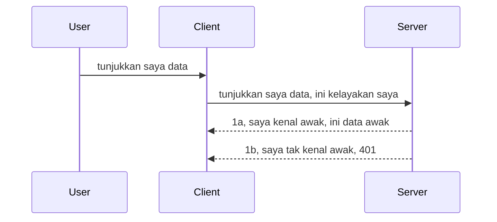

# Pengesahan mudah

SDK MCP menyokong penggunaan OAuth 2.1 yang agak rumit melibatkan konsep seperti pelayan pengesahan, pelayan sumber, menghantar kelayakan, mendapatkan kod, menukar kod kepada token pembawa sehingga anda akhirnya boleh mendapatkan data sumber anda. Jika anda tidak biasa dengan OAuth yang merupakan sesuatu yang bagus untuk dilaksanakan, adalah idea yang baik untuk bermula dengan tahap pengesahan asas dan membina sehingga keselamatan yang lebih baik. Sebab itulah bab ini wujud, untuk membina anda ke pengesahan yang lebih maju.

## Pengesahan, apa maksudnya?

Pengesahan adalah singkatan bagi pengesahan dan kebenaran. Idea ini ialah kita perlu melakukan dua perkara:

- **Pengesahan**, iaitu proses untuk mengetahui sama ada kita membenarkan seseorang masuk ke rumah kita, bahawa mereka mempunyai hak untuk "di sini" iaitu mempunyai akses ke pelayan sumber kita di mana ciri-ciri MCP Server kita berada.
- **Kebenaran**, ialah proses untuk mengetahui jika pengguna harus mempunyai akses ke sumber tertentu yang mereka minta, contohnya pesanan-pesanan ini atau produk ini atau sama ada mereka dibenarkan membaca kandungan tetapi tidak memadam sebagai contoh lain.

## Kelayakan: bagaimana kita memberitahu sistem siapa kita

Kebanyakan pembangun web biasanya mula berfikir dari segi memberikan kelayakan kepada pelayan, biasanya rahsia yang memberitahu jika mereka dibenarkan berada di sini "Pengesahan". Kelayakan ini biasanya ialah versi base64 yang dienkod daripada nama pengguna dan kata laluan atau kunci API yang mengenal pasti pengguna tertentu.

Ini melibatkan penghantaran melalui header yang dipanggil "Authorization" seperti berikut:

```json
{ "Authorization": "secret123" }
```

Ini biasanya dirujuk sebagai pengesahan asas. Cara aliran keseluruhan berfungsi adalah seperti berikut:


Kini kita faham bagaimana ia berfungsi dari sudut aliran, bagaimana kita melaksanakannya? Kebanyakan pelayan web mempunyai konsep yang dipanggil middleware, satu keping kod yang berjalan sebagai sebahagian daripada permintaan yang boleh mengesahkan kelayakan, dan jika kelayakan sah boleh membenarkan permintaan diteruskan. Jika permintaan tidak mempunyai kelayakan yang sah maka anda mendapat ralat pengesahan. Mari kita lihat bagaimana ini boleh dilaksanakan:

**Python**

```python
class AuthMiddleware(BaseHTTPMiddleware):
    async def dispatch(self, request, call_next):

        has_header = request.headers.get("Authorization")
        if not has_header:
            print("-> Missing Authorization header!")
            return Response(status_code=401, content="Unauthorized")

        if not valid_token(has_header):
            print("-> Invalid token!")
            return Response(status_code=403, content="Forbidden")

        print("Valid token, proceeding...")
       
        response = await call_next(request)
        # tambah mana-mana pengepala pelanggan atau ubah balasan dengan cara tertentu
        return response


starlette_app.add_middleware(CustomHeaderMiddleware)
```

Di sini kita ada:

- Mencipta middleware yang dipanggil `AuthMiddleware` di mana kaedah `dispatch`nya dipanggil oleh pelayan web.
- Menambah middleware ke pelayan web:

    ```python
    starlette_app.add_middleware(AuthMiddleware)
    ```

- Menulis logik pengesahan yang memeriksa sama ada header Authorization hadir dan jika rahsia yang dihantar sah:

    ```python
    has_header = request.headers.get("Authorization")
    if not has_header:
        print("-> Missing Authorization header!")
        return Response(status_code=401, content="Unauthorized")

    if not valid_token(has_header):
        print("-> Invalid token!")
        return Response(status_code=403, content="Forbidden")
    ```

    jika rahsia itu hadir dan sah maka kita membenarkan permintaan diteruskan dengan memanggil `call_next` dan mengembalikan respons.

    ```python
    response = await call_next(request)
    # tambah sebarang pengepala pelanggan atau ubah suai dalam respons dengan sesuatu cara
    return response
    ```

Cara ia berfungsi ialah jika permintaan web dibuat ke arah pelayan middleware akan dipanggil dan berdasarkan pelaksanaan ia akan sama ada membenarkan permintaan diteruskan atau akhirnya mengembalikan ralat yang menunjukkan klien tidak dibenarkan meneruskan.

**TypeScript**

Di sini kita buat middleware dengan rangka kerja popular Express dan mencegat permintaan sebelum ia sampai ke MCP Server. Ini adalah kodnya:

```typescript
function isValid(secret) {
    return secret === "secret123";
}

app.use((req, res, next) => {
    // 1. Adakah header kebenaran hadir?
    if(!req.headers["Authorization"]) {
        res.status(401).send('Unauthorized');
    }
    
    let token = req.headers["Authorization"];

    // 2. Periksa kesahan.
    if(!isValid(token)) {
        res.status(403).send('Forbidden');
    }

   
    console.log('Middleware executed');
    // 3. Serahkan permintaan ke langkah seterusnya dalam saluran permintaan.
    next();
});
```

Dalam kod ini kita:

1. Memeriksa jika header Authorization wujud daripada awal, jika tidak, kita hantar ralat 401.
2. Memastikan kelayakan/token sah, jika tidak, kita hantar ralat 403.
3. Akhirnya meneruskan permintaan dalam saluran permintaan dan mengembalikan sumber yang diminta.

## Latihan: Melaksanakan pengesahan

Mari kita gunakan pengetahuan kita dan cuba melaksanakannya. Ini adalah rancangannya:

Pelayan

- Cipta pelayan web dan contoh MCP.
- Laksanakan middleware untuk pelayan itu.

Klien

- Hantar permintaan web, dengan kelayakan, melalui header.

### -1- Cipta pelayan web dan contoh MCP

Dalam langkah pertama kita, kita perlu mencipta contoh pelayan web dan MCP Server.

**Python**

Di sini kita cipta contoh MCP Server, cipta aplikasi web starlette dan hoskan dengan uvicorn.

```python
# mencipta Pelayan MCP

app = FastMCP(
    name="MCP Resource Server",
    instructions="Resource Server that validates tokens via Authorization Server introspection",
    host=settings["host"],
    port=settings["port"],
    debug=True
)

# mencipta aplikasi web starlette
starlette_app = app.streamable_http_app()

# menyajikan aplikasi melalui uvicorn
async def run(starlette_app):
    import uvicorn
    config = uvicorn.Config(
            starlette_app,
            host=app.settings.host,
            port=app.settings.port,
            log_level=app.settings.log_level.lower(),
        )
    server = uvicorn.Server(config)
    await server.serve()

run(starlette_app)
```

Dalam kod ini kita:

- Cipta MCP Server.
- Bina aplikasi web starlette dari MCP Server, `app.streamable_http_app()`.
- Hoskan dan servis aplikasi web menggunakan uvicorn `server.serve()`.

**TypeScript**

Di sini kita buat contoh MCP Server.

```typescript
const server = new McpServer({
      name: "example-server",
      version: "1.0.0"
    });

    // ... sediakan sumber pelayan, alat, dan arahan ...
```

Penciptaan MCP Server ini perlu dilakukan dalam definisi laluan POST /mcp kita, jadi mari kita ambil kod di atas dan pindahkan seperti berikut:

```typescript
import express from "express";
import { randomUUID } from "node:crypto";
import { McpServer } from "@modelcontextprotocol/sdk/server/mcp.js";
import { StreamableHTTPServerTransport } from "@modelcontextprotocol/sdk/server/streamableHttp.js";
import { isInitializeRequest } from "@modelcontextprotocol/sdk/types.js"

const app = express();
app.use(express.json());

// Peta untuk menyimpan pengangkutan mengikut ID sesi
const transports: { [sessionId: string]: StreamableHTTPServerTransport } = {};

// Mengendalikan permintaan POST untuk komunikasi klien-ke-pelayan
app.post('/mcp', async (req, res) => {
  // Semak untuk ID sesi yang sedia ada
  const sessionId = req.headers['mcp-session-id'] as string | undefined;
  let transport: StreamableHTTPServerTransport;

  if (sessionId && transports[sessionId]) {
    // Gunakan semula pengangkutan sedia ada
    transport = transports[sessionId];
  } else if (!sessionId && isInitializeRequest(req.body)) {
    // Permintaan inisialisasi baru
    transport = new StreamableHTTPServerTransport({
      sessionIdGenerator: () => randomUUID(),
      onsessioninitialized: (sessionId) => {
        // Simpan pengangkutan mengikut ID sesi
        transports[sessionId] = transport;
      },
      // Perlindungan pengikatan semula DNS dilumpuhkan secara lalai untuk keserasian ke belakang. Jika anda menjalankan pelayan ini
      // secara tempatan, pastikan untuk menetapkan:
      // enableDnsRebindingProtection: true,
      // allowedHosts: ['127.0.0.1'],
    });

    // Bersihkan pengangkutan apabila ditutup
    transport.onclose = () => {
      if (transport.sessionId) {
        delete transports[transport.sessionId];
      }
    };
    const server = new McpServer({
      name: "example-server",
      version: "1.0.0"
    });

    // ... sediakan sumber pelayan, alat, dan arahan ...

    // Sambung ke pelayan MCP
    await server.connect(transport);
  } else {
    // Permintaan tidak sah
    res.status(400).json({
      jsonrpc: '2.0',
      error: {
        code: -32000,
        message: 'Bad Request: No valid session ID provided',
      },
      id: null,
    });
    return;
  }

  // Mengendalikan permintaan
  await transport.handleRequest(req, res, req.body);
});

// Pengendali boleh guna semula untuk permintaan GET dan DELETE
const handleSessionRequest = async (req: express.Request, res: express.Response) => {
  const sessionId = req.headers['mcp-session-id'] as string | undefined;
  if (!sessionId || !transports[sessionId]) {
    res.status(400).send('Invalid or missing session ID');
    return;
  }
  
  const transport = transports[sessionId];
  await transport.handleRequest(req, res);
};

// Mengendalikan permintaan GET untuk notifikasi pelayan-ke-klien melalui SSE
app.get('/mcp', handleSessionRequest);

// Mengendalikan permintaan DELETE untuk penamatan sesi
app.delete('/mcp', handleSessionRequest);

app.listen(3000);
```

Kini anda nampak bagaimana penciptaan MCP Server dipindahkan ke dalam `app.post("/mcp")`.

Mari teruskan ke langkah seterusnya iaitu mencipta middleware supaya kita boleh mengesahkan kelayakan yang masuk.

### -2- Laksanakan middleware untuk pelayan

Mari kita lihat bahagian middleware seterusnya. Di sini kita akan buat middleware yang mencari kelayakan dalam header `Authorization` dan mengesahkannya. Jika boleh diterima maka permintaan akan diteruskan untuk melakukan apa yang diperlukan (contohnya senaraikan alat, baca sumber atau fungsi MCP yang diminta klien).

**Python**

Untuk membuat middleware, kita perlu mencipta kelas yang mewarisi dari `BaseHTTPMiddleware`. Ada dua bahagian menarik:

- Permintaan `request` , yang kita baca maklumat header daripadanya.
- `call_next` panggilan balik yang perlu kita panggil jika klien membawa kelayakan yang kita terima.

Pertama, kita perlu tangani kes jika header `Authorization` hilang:

```python
has_header = request.headers.get("Authorization")

# tiada tajuk, gagal dengan 401, jika tidak teruskan.
if not has_header:
    print("-> Missing Authorization header!")
    return Response(status_code=401, content="Unauthorized")
```

Di sini kita hantar mesej 401 tidak dibenarkan kerana klien gagal pengesahan.

Seterusnya, jika kelayakan dihantar, kita perlu periksa kesahihannya seperti berikut:

```python
 if not valid_token(has_header):
    print("-> Invalid token!")
    return Response(status_code=403, content="Forbidden")
```

Perhatikan bagaimana kita hantar mesej 403 dilarang di atas. Mari lihat middleware penuh di bawah yang melaksanakan semua yang kita bincangkan:

```python
class AuthMiddleware(BaseHTTPMiddleware):
    async def dispatch(self, request, call_next):

        has_header = request.headers.get("Authorization")
        if not has_header:
            print("-> Missing Authorization header!")
            return Response(status_code=401, content="Unauthorized")

        if not valid_token(has_header):
            print("-> Invalid token!")
            return Response(status_code=403, content="Forbidden")

        print("Valid token, proceeding...")
        print(f"-> Received {request.method} {request.url}")
        response = await call_next(request)
        response.headers['Custom'] = 'Example'
        return response

```

Bagus, tapi bagaimana dengan fungsi `valid_token`? Ini dia di bawah:

```python
# JANGAN guna untuk produksi - tingkatkan ia !!
def valid_token(token: str) -> bool:
    # buang awalan "Bearer "
    if token.startswith("Bearer "):
        token = token[7:]
        return token == "secret-token"
    return False
```

Ini jelas sepatutnya dipertingkatkan.

PENTING: Anda TIDAK SEPATUTNYA menyimpan rahsia seperti ini dalam kod. Anda sebaiknya mengambil nilai untuk dibandingkan dari sumber data atau dari IDP (pembekal perkhidmatan identiti) atau lebih baik lagi, biarkan IDP lakukan pengesahan.

**TypeScript**

Untuk melaksanakan ini dengan Express, kita perlu panggil kaedah `use` yang mengambil fungsi middleware.

Kita perlu:

- Berinteraksi dengan pembolehubah permintaan untuk periksa kelayakan yang dihantar dalam sifat `Authorization`.
- Sahkan kelayakan, dan jika sah, benarkan permintaan diteruskan supaya permintaan MCP klien dapat lakukan yang sepatutnya (contohnya senaraikan alat, baca sumber atau apa-apa yang berkaitan MCP).

Di sini, kita periksa jika header `Authorization` hadir dan jika tidak, kita hentikan permintaan daripada diteruskan:

```typescript
if(!req.headers["authorization"]) {
    res.status(401).send('Unauthorized');
    return;
}
```

Jika header tidak dihantar sama sekali, anda akan terima 401.

Seterusnya, kita periksa jika kelayakan sah, jika tidak kita sekali lagi hentikan permintaan tapi dengan mesej sedikit berbeza:

```typescript
if(!isValid(token)) {
    res.status(403).send('Forbidden');
    return;
} 
```

Perhatikan bagaimana anda kini dapat ralat 403.

Ini adalah kod penuh:

```typescript
app.use((req, res, next) => {
    console.log('Request received:', req.method, req.url, req.headers);
    console.log('Headers:', req.headers["authorization"]);
    if(!req.headers["authorization"]) {
        res.status(401).send('Unauthorized');
        return;
    }
    
    let token = req.headers["authorization"];

    if(!isValid(token)) {
        res.status(403).send('Forbidden');
        return;
    }  

    console.log('Middleware executed');
    next();
});
```

Kita telah sediakan pelayan web untuk menerima middleware bagi memeriksa kelayakan yang diharapkan dihantar oleh klien. Bagaimana pula dengan klien?

### -3- Hantar permintaan web dengan kelayakan melalui header

Kita perlu pastikan klien menghantar kelayakan melalui header. Oleh kerana kita akan gunakan klien MCP untuk ini, kita perlu tahu bagaimana caranya.

**Python**

Untuk klien, kita perlu hantar header dengan kelayakan seperti ini:

```python
# JANGAN kod nilai secara keras, simpan sekurang-kurangnya dalam pembolehubah persekitaran atau penyimpanan yang lebih selamat
token = "secret-token"

async with streamablehttp_client(
        url = f"http://localhost:{port}/mcp",
        headers = {"Authorization": f"Bearer {token}"}
    ) as (
        read_stream,
        write_stream,
        session_callback,
    ):
        async with ClientSession(
            read_stream,
            write_stream
        ) as session:
            await session.initialize()
      
            # TODO, apa yang anda mahu dilakukan di klien, contohnya senaraikan alat, panggil alat dan sebagainya.
```

Perhatikan bagaimana kita isi sifat `headers` seperti ini ` headers = {"Authorization": f"Bearer {token}"}`.

**TypeScript**

Kita boleh selesaikan ini dalam dua langkah:

1. Isi objek konfigurasi dengan kelayakan kita.
2. Serahkan objek konfigurasi kepada transport.

```typescript

// JANGAN masukkan nilai secara keras seperti yang ditunjukkan di sini. Sekurang-kurangnya jadikan ia sebagai pembolehubah persekitaran dan gunakan sesuatu seperti dotenv (dalam mod pembangunan).
let token = "secret123"

// takrifkan objek pilihan pengangkutan klien
let options: StreamableHTTPClientTransportOptions = {
  sessionId: sessionId,
  requestInit: {
    headers: {
      "Authorization": "secret123"
    }
  }
};

// serahkan objek pilihan kepada pengangkutan
async function main() {
   const transport = new StreamableHTTPClientTransport(
      new URL(serverUrl),
      options
   );
```

Di sini anda nampak bagaimana kita perlu cipta objek `options` dan letakkan header kita di bawah sifat `requestInit`.

PENTING: Bagaimana kita tingkatkan dari sini? Sebenarnya pelaksanaan sedia ada ada beberapa isu. Pertama, menghantar kelayakan seperti ini agak berisiko melainkan anda sekurang-kurangnya ada HTTPS. Walaupun begitu, kelayakan boleh dicuri jadi anda perlu sistem di mana anda mudah batalkan token dan tambah semakan tambahan seperti dari mana token berasal, adakah permintaan berlaku terlalu kerap (kelakuan bot), secara ringkas, ada banyak kebimbangan.

Walau begitu, untuk API yang sangat mudah dimana anda tidak mahu sesiapa pun memanggil API anda tanpa pengesahan dan apa yang kita ada di sini adalah permulaan yang baik.

Dengan itu, mari kita cuba kukuhkan keselamatan sedikit dengan menggunakan format piawai seperti JSON Web Token, juga dikenali sebagai JWT atau token "JOT".

## JSON Web Token, JWT

Jadi, kita cuba tingkatkan dari menghantar kelayakan yang sangat mudah. Apakah peningkatan segera yang kita dapat apabila mengguna pakai JWT?

- **Peningkatan keselamatan**. Dalam pengesahan asas, anda hantar nama pengguna dan kata laluan sebagai token base64 (atau kunci API) berulang-ulang yang meningkatkan risiko. Dengan JWT, anda hantar nama pengguna dan kata laluan dan dapat token sebagai balasan serta ia juga terikat masa bermaksud ia akan tamat tempoh. JWT membolehkan anda menggunakan kawalan akses terperinci menggunakan peranan, skop dan kebenaran.
- **Tidak bergantung keadaan dan boleh skala**. JWT adalah berdiri sendiri, ia membawa semua maklumat pengguna dan menghapuskan keperluan penyimpanan sesi pelayan. Token juga boleh disahkan secara tempatan.
- **Interoperabiliti dan persekutuan**. JWT adalah teras Open ID Connect dan digunakan dengan pembekal identiti terkenal seperti Entra ID, Google Identity dan Auth0. Ia juga membolehkan log masuk tunggal dan banyak lagi menjadikannya setaraf perusahaan.
- **Modulariti dan fleksibiliti**. JWT juga boleh digunakan dengan API Gateways seperti Azure API Management, NGINX dan lain. Ia juga menyokong senario pengesahan pengguna dan komunikasi pelayan-ke-perkhidmatan termasuk penyamar dan pendelegasian.
- **Prestasi dan caching**. JWT boleh disimpan cache setelah disahkod yang mengurangkan keperluan untuk mengurai. Ini membantu terutamanya dengan aplikasi trafik tinggi kerana meningkatkan kadar capaian dan mengurangkan beban pada infrastruktur pilihan anda.
- **Ciri-ciri lanjutan**. Ia juga menyokong introspeksi (memeriksa kesahan pada pelayan) dan pembatalan (menjadikan token tidak sah).

Dengan semua manfaat ini, mari lihat bagaimana kita boleh tingkatkan pelaksanaan kita ke tahap seterusnya.

## Menukar pengesahan asas kepada JWT

Jadi, perubahan yang perlu kita buat pada tahap tinggi adalah untuk:

- **Belajar membina token JWT** dan sediakan ia untuk dihantar dari klien ke pelayan.
- **Sahkan token JWT**, dan jika sah, benarkan klien mendapat sumber kita.
- **Simpan token dengan selamat**. Bagaimana kita simpan token ini.
- **Lindungi laluan**. Kita perlu lindungi laluan, dalam kes kita, perlu lindungi laluan dan ciri MCP tertentu.
- **Tambah token penyegaran**. Pastikan kita cipta token yang jangka hayat singkat tapi token penyegaran yang jangka hayat panjang yang boleh digunakan untuk mendapatkan token baru jika token tamat tempoh. Juga pastikan ada titik akhir penyegaran dan strategi pusing ganti.

### -1- Bina token JWT

Pertama, token JWT ada bahagian berikut:

- **header**, algoritma yang digunakan dan jenis token.
- **payload**, tuntutan, seperti sub (pengguna atau entiti yang token wakili. Dalam senario pengesahan ini biasanya ID pengguna), exp (masa tamat tempoh), role (peranan)
- **signature**, ditandatangani dengan rahsia atau kunci persendirian.

Untuk ini, kita perlu bina header, payload dan token yang telah dienkod.

**Python**

```python

import jwt
import jwt
from jwt.exceptions import ExpiredSignatureError, InvalidTokenError
import datetime

# Kunci rahsia yang digunakan untuk menandatangani JWT
secret_key = 'your-secret-key'

header = {
    "alg": "HS256",
    "typ": "JWT"
}

# maklumat pengguna dan tuntutan serta masa luputnya
payload = {
    "sub": "1234567890",               # Subjek (ID pengguna)
    "name": "User Userson",                # Tuntutan khusus
    "admin": True,                     # Tuntutan khusus
    "iat": datetime.datetime.utcnow(),# Dikeluarkan pada
    "exp": datetime.datetime.utcnow() + datetime.timedelta(hours=1)  # Tamat tempoh
}

# menyandikannya
encoded_jwt = jwt.encode(payload, secret_key, algorithm="HS256", headers=header)
```

Dalam kod di atas kita telah:

- Tetapkan header menggunakan HS256 sebagai algoritma dan jenis kepada JWT.
- Bina payload yang mengandungi subjek atau ID pengguna, nama pengguna, peranan, bila ia dikeluarkan dan bila ia akan tamat tempoh dengan itu melaksanakan aspek terikat masa yang kita sebut tadi.

**TypeScript**

Di sini kita akan perlukan beberapa kebergantungan yang akan membantu kita bina token JWT.

Kebergantungan

```sh

npm install jsonwebtoken
npm install --save-dev @types/jsonwebtoken
```

Kini setelah kita ada itu, mari cipta header, payload dan melalui itu cipta token yang dienkod.

```typescript
import jwt from 'jsonwebtoken';

const secretKey = 'your-secret-key'; // Gunakan pembolehubah env dalam pengeluaran

// Tetapkan payload
const payload = {
  sub: '1234567890',
  name: 'User usersson',
  admin: true,
  iat: Math.floor(Date.now() / 1000), // Dikeluarkan pada
  exp: Math.floor(Date.now() / 1000) + 60 * 60 // Tamat dalam 1 jam
};

// Tetapkan header (pilihan, jsonwebtoken menetapkan lalai)
const header = {
  alg: 'HS256',
  typ: 'JWT'
};

// Buat token
const token = jwt.sign(payload, secretKey, {
  algorithm: 'HS256',
  header: header
});

console.log('JWT:', token);
```

Token ini:

Ditandatangani menggunakan HS256
Sah selama 1 jam
Termasuk tuntutan seperti sub, name, admin, iat, dan exp.

### -2- Sahkan token

Kita juga perlu sahkan token, ini sesuatu yang sepatutnya kita lakukan di pelayan untuk pastikan apa yang klien hantar kepada kita adalah benar-benar sah. Ada banyak semakan yang perlu dibuat dari mengesahkan strukturnya kepada kesahihannya. Anda juga digalakkan menambah semakan lain untuk lihat jika pengguna ada dalam sistem anda dan banyak lagi.

Untuk sahkan token, kita perlu nyahkod supaya kita boleh membacanya dan mula periksa kesahihannya:

**Python**

```python

# Nyahkod dan sahkan JWT
try:
    decoded = jwt.decode(token, secret_key, algorithms=["HS256"])
    print("✅ Token is valid.")
    print("Decoded claims:")
    for key, value in decoded.items():
        print(f"  {key}: {value}")
except ExpiredSignatureError:
    print("❌ Token has expired.")
except InvalidTokenError as e:
    print(f"❌ Invalid token: {e}")

```

Dalam kod ini, kita panggil `jwt.decode` menggunakan token, kunci rahsia dan algoritma terpilih sebagai input. Perhatikan kita gunakan konstruksi try-catch kerana jika pengesahan gagal ia akan menyebabkan ralat.

**TypeScript**

Di sini kita perlu panggil `jwt.verify` untuk mendapatkan versi nyahkod token yang boleh kita analisa lanjut. Jika panggilan ini gagal, ini bermakna strukturnya salah atau ia tidak lagi sah.

```typescript

try {
  const decoded = jwt.verify(token, secretKey);
  console.log('Decoded Payload:', decoded);
} catch (err) {
  console.error('Token verification failed:', err);
}
```

CATATAN: seperti disebut sebelum ini, kita harus buat semakan tambahan untuk pastikan token ini menunjukkan pengguna dalam sistem kita dan pastikan pengguna mempunyai hak yang didakwa.

Seterusnya, mari kita lihat kawalan akses berdasarkan peranan, juga dikenali sebagai RBAC.
## Menambah kawalan akses berdasarkan peranan

Idea adalah kita mahu menyatakan bahawa peranan yang berbeza mempunyai keizinan yang berbeza. Contohnya, kita menganggap seorang admin boleh melakukan segala-galanya dan seorang pengguna biasa boleh membaca/menulis dan seorang tetamu hanya boleh membaca. Oleh itu, berikut adalah beberapa tahap keizinan yang mungkin:

- Admin.Tulis 
- Pengguna.Baca
- Tetamu.Baca

Mari kita lihat bagaimana kita boleh melaksanakan kawalan sedemikian dengan middleware. Middleware boleh ditambah untuk setiap laluan serta untuk semua laluan.

**Python**

```python
from starlette.middleware.base import BaseHTTPMiddleware
from starlette.responses import JSONResponse
import jwt

# JANGAN letakkan rahsia dalam kod seperti ini, ini adalah untuk tujuan demonstrasi sahaja. Baca ia dari tempat yang selamat.
SECRET_KEY = "your-secret-key" # letakkan ini dalam pembolehubah persekitaran
REQUIRED_PERMISSION = "User.Read"

class JWTPermissionMiddleware(BaseHTTPMiddleware):
    async def dispatch(self, request, call_next):
        auth_header = request.headers.get("Authorization")
        if not auth_header or not auth_header.startswith("Bearer "):
            return JSONResponse({"error": "Missing or invalid Authorization header"}, status_code=401)

        token = auth_header.split(" ")[1]
        try:
            decoded = jwt.decode(token, SECRET_KEY, algorithms=["HS256"])
        except jwt.ExpiredSignatureError:
            return JSONResponse({"error": "Token expired"}, status_code=401)
        except jwt.InvalidTokenError:
            return JSONResponse({"error": "Invalid token"}, status_code=401)

        permissions = decoded.get("permissions", [])
        if REQUIRED_PERMISSION not in permissions:
            return JSONResponse({"error": "Permission denied"}, status_code=403)

        request.state.user = decoded
        return await call_next(request)


```

Terdapat beberapa cara untuk menambah middleware seperti di bawah:

```python

# Alt 1: tambah middleware semasa membina aplikasi starlette
middleware = [
    Middleware(JWTPermissionMiddleware)
]

app = Starlette(routes=routes, middleware=middleware)

# Alt 2: tambah middleware selepas aplikasi starlette dibina
starlette_app.add_middleware(JWTPermissionMiddleware)

# Alt 3: tambah middleware bagi setiap laluan
routes = [
    Route(
        "/mcp",
        endpoint=..., # pengendali
        middleware=[Middleware(JWTPermissionMiddleware)]
    )
]
```

**TypeScript**

Kita boleh menggunakan `app.use` dan middleware yang akan berjalan untuk semua permintaan.

```typescript
app.use((req, res, next) => {
    console.log('Request received:', req.method, req.url, req.headers);
    console.log('Headers:', req.headers["authorization"]);

    // 1. Periksa jika header kebenaran telah dihantar

    if(!req.headers["authorization"]) {
        res.status(401).send('Unauthorized');
        return;
    }
    
    let token = req.headers["authorization"];

    // 2. Periksa jika token adalah sah
    if(!isValid(token)) {
        res.status(403).send('Forbidden');
        return;
    }  

    // 3. Periksa jika pengguna token wujud dalam sistem kami
    if(!isExistingUser(token)) {
        res.status(403).send('Forbidden');
        console.log("User does not exist");
        return;
    }
    console.log("User exists");

    // 4. Sahkan token mempunyai kebenaran yang betul
    if(!hasScopes(token, ["User.Read"])){
        res.status(403).send('Forbidden - insufficient scopes');
    }

    console.log("User has required scopes");

    console.log('Middleware executed');
    next();
});

```

Terdapat beberapa perkara yang boleh kita benarkan middleware kita dan yang middleware kita SEPATUTNYA lakukan, iaitu:

1. Semak jika header kebenaran (authorization) wujud
2. Semak jika token sah, kita panggil `isValid` yang merupakan kaedah yang kita tulis untuk menyemak integriti dan kesahihan token JWT.
3. Sahkan pengguna wujud dalam sistem kita, kita harus memeriksa ini.

   ```typescript
    // pengguna dalam DB
   const users = [
     "user1",
     "User usersson",
   ]

   function isExistingUser(token) {
     let decodedToken = verifyToken(token);

     // TODO, semak jika pengguna wujud dalam DB
     return users.includes(decodedToken?.name || "");
   }
   ```

   Di atas, kita telah mencipta senarai `users` yang sangat mudah, yang sepatutnya berada dalam pangkalan data sudah tentu.

4. Tambahan, kita juga harus menyemak token mempunyai keizinan yang betul.

   ```typescript
   if(!hasScopes(token, ["User.Read"])){
        res.status(403).send('Forbidden - insufficient scopes');
   }
   ```

   Dalam kod di atas dari middleware, kita menyemak bahawa token mengandungi keizinan User.Read, jika tidak kita menghantar ralat 403. Di bawah adalah kaedah pembantu `hasScopes`.

   ```typescript
   function hasScopes(scope: string, requiredScopes: string[]) {
     let decodedToken = verifyToken(scope);
    return requiredScopes.every(scope => decodedToken?.scopes.includes(scope));
  }
   ```

Have a think which additional checks you should be doing, but these are the absolute minimum of checks you should be doing.

Using Express as a web framework is a common choice. There are helpers library when you use JWT so you can write less code.

- `express-jwt`, helper library that provides a middleware that helps decode your token.
- `express-jwt-permissions`, this provides a middleware `guard` that helps check if a certain permission is on the token.

Here's what these libraries can look like when used:

```typescript
const express = require('express');
const jwt = require('express-jwt');
const guard = require('express-jwt-permissions')();

const app = express();
const secretKey = 'your-secret-key'; // put this in env variable

// Decode JWT and attach to req.user
app.use(jwt({ secret: secretKey, algorithms: ['HS256'] }));

// Check for User.Read permission
app.use(guard.check('User.Read'));

// multiple permissions
// app.use(guard.check(['User.Read', 'Admin.Access']));

app.get('/protected', (req, res) => {
  res.json({ message: `Welcome ${req.user.name}` });
});

// Error handler
app.use((err, req, res, next) => {
  if (err.code === 'permission_denied') {
    return res.status(403).send('Forbidden');
  }
  next(err);
});

```

Sekarang anda telah melihat bagaimana middleware boleh digunakan untuk pengesahan dan kebenaran, bagaimana pula dengan MCP, adakah ia mengubah cara kita melakukan pengesahan? Mari kita ketahui dalam bahagian seterusnya.

### -3- Tambah RBAC ke MCP

Anda telah melihat setakat ini bagaimana anda boleh menambah RBAC melalui middleware, namun, untuk MCP tiada cara mudah untuk menambah RBAC per ciri MCP, jadi apa yang kita buat? Baiklah, kita hanya perlu menambah kod seperti ini yang memeriksa dalam kes ini sama ada klien mempunyai hak untuk memanggil alat tertentu:

Anda mempunyai beberapa pilihan berbeza bagaimana untuk mencapai RBAC per ciri, berikut adalah beberapa:

- Tambah pemeriksaan untuk setiap alat, sumber, prompt di mana anda perlu menyemak tahap keizinan.

   **python**

   ```python
   @tool()
   def delete_product(id: int):
      try:
          check_permissions(role="Admin.Write", request)
      catch:
        pass # pelanggan gagal pengesahan, timbulkan ralat pengesahan
   ```

   **typescript**

   ```typescript
   server.registerTool(
    "delete-product",
    {
      title: Delete a product",
      description: "Deletes a product",
      inputSchema: { id: z.number() }
    },
    async ({ id }) => {
      
      try {
        checkPermissions("Admin.Write", request);
        // todo, hantar id ke productService dan remote entry
      } catch(Exception e) {
        console.log("Authorization error, you're not allowed");  
      }

      return {
        content: [{ type: "text", text: `Deletected product with id ${id}` }]
      };
    }
   );
   ```


- Guna pendekatan pelayan yang maju dan pengendali permintaan supaya anda mengurangkan berapa banyak tempat anda perlu membuat semakan.

   **Python**

   ```python
   
   tool_permission = {
      "create_product": ["User.Write", "Admin.Write"],
      "delete_product": ["Admin.Write"]
   }

   def has_permission(user_permissions, required_permissions) -> bool:
      # user_permissions: senarai kebenaran yang dimiliki pengguna
      # required_permissions: senarai kebenaran yang diperlukan untuk alat
      return any(perm in user_permissions for perm in required_permissions)

   @server.call_tool()
   async def handle_call_tool(
     name: str, arguments: dict[str, str] | None
   ) -> list[types.TextContent]:
    # Anggap request.user.permissions adalah senarai kebenaran untuk pengguna
     user_permissions = request.user.permissions
     required_permissions = tool_permission.get(name, [])
     if not has_permission(user_permissions, required_permissions):
        # Timbulkan ralat "Anda tidak mempunyai kebenaran untuk memanggil alat {name}"
        raise Exception(f"You don't have permission to call tool {name}")
     # teruskan dan panggil alat
     # ...
   ```   
   

   **TypeScript**

   ```typescript
   function hasPermission(userPermissions: string[], requiredPermissions: string[]): boolean {
       if (!Array.isArray(userPermissions) || !Array.isArray(requiredPermissions)) return false;
       // Pulangkan benar jika pengguna mempunyai sekurang-kurangnya satu kebenaran yang diperlukan
       
       return requiredPermissions.some(perm => userPermissions.includes(perm));
   }
  
   server.setRequestHandler(CallToolRequestSchema, async (request) => {
      const { params: { name } } = request;
  
      let permissions = request.user.permissions;
  
      if (!hasPermission(permissions, toolPermissions[name])) {
         return new Error(`You don't have permission to call ${name}`);
      }
  
      // teruskan..
   });
   ```

   Nota, anda perlu pastikan middleware anda menetapkan token yang telah diterjemah (decoded) kepada sifat pengguna permintaan supaya kod di atas menjadi mudah.

### Ringkasan

Kini kita telah berbincang tentang cara menambah sokongan untuk RBAC secara am dan untuk MCP khususnya, tiba masanya untuk mencuba melaksanakan keselamatan sendiri untuk memastikan anda memahami konsep yang dibentangkan.

## Tugasan 1: Bina pelayan mcp dan klien mcp menggunakan pengesahan asas

Di sini anda akan mengambil apa yang telah anda pelajari dari segi menghantar kelayakan melalui header.

## Penyelesaian 1

[Penyelesaian 1](./code/basic/README.md)

## Tugasan 2: Tingkatkan penyelesaian dari Tugasan 1 untuk menggunakan JWT

Ambil penyelesaian pertama tetapi kali ini, mari kita memperbaikinya.

Daripada menggunakan Basic Auth, mari kita gunakan JWT.

## Penyelesaian 2

[Penyelesaian 2](./solution/jwt-solution/README.md)

## Cabaran

Tambah RBAC per alat yang kami terangkan dalam bahagian "Tambah RBAC ke MCP".

## Ringkasan

Harapnya anda telah belajar banyak dalam bab ini, dari tiada keselamatan langsung, kepada keselamatan asas, kepada JWT dan bagaimana ia boleh ditambah ke MCP.

Kami telah membina asas yang kukuh dengan JWT tersuai, tetapi apabila skala berkembang, kami bergerak ke arah model identiti berasaskan piawaian. Menggunakan IdP seperti Entra atau Keycloak membolehkan kami memindahkan penerbitan token, pengesahan, dan pengurusan siklus hayat kepada platform dipercayai — membolehkan kami fokus pada logik aplikasi dan pengalaman pengguna.

Untuk itu, kami ada satu [bab lanjutan tentang Entra](../../05-AdvancedTopics/mcp-security-entra/README.md)

## Apa Seterusnya

- Seterusnya: [Menyediakan Hos MCP](../12-mcp-hosts/README.md)

---

<!-- CO-OP TRANSLATOR DISCLAIMER START -->
**Penafian**:  
Dokumen ini telah diterjemahkan menggunakan perkhidmatan terjemahan AI [Co-op Translator](https://github.com/Azure/co-op-translator). Walaupun kami berusaha untuk ketepatan, sila maklum bahawa terjemahan automatik mungkin mengandungi kesilapan atau ketidaktepatan. Dokumen asal dalam bahasa asalnya harus dianggap sebagai sumber yang sahih. Untuk maklumat kritikal, terjemahan manusia profesional disyorkan. Kami tidak bertanggungjawab atas sebarang salah faham atau salah tafsir yang timbul daripada penggunaan terjemahan ini.
<!-- CO-OP TRANSLATOR DISCLAIMER END -->