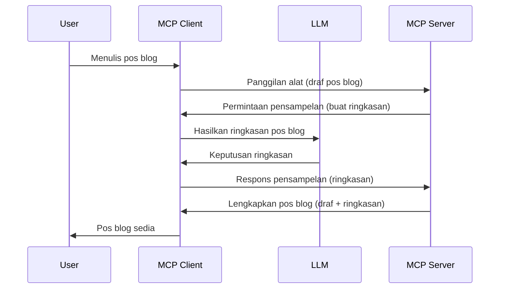

# Sampling - mendelegasikan ciri-ciri kepada Klien

Kadang-kadang, anda memerlukan Klien MCP dan Server MCP untuk bekerjasama mencapai matlamat bersama. Anda mungkin mempunyai kes di mana Server memerlukan bantuan LLM yang berada pada klien. Untuk situasi ini, sampling adalah apa yang anda perlu gunakan.

Mari kita teroka beberapa kes penggunaan dan cara membina penyelesaian yang melibatkan sampling.

## Gambaran Keseluruhan

Dalam pelajaran ini, kita fokus menerangkan bila dan di mana menggunakan Sampling dan bagaimana mengkonfigurasikannya.

## Objektif Pembelajaran

Dalam bab ini, kita akan:

- Terangkan apakah itu Sampling dan bila menggunakannya.
- Tunjukkan cara mengkonfigurasi Sampling dalam MCP.
- Berikan contoh Sampling dalam tindakan.

## Apakah Sampling dan mengapa menggunakannya?

Sampling adalah ciri canggih yang berfungsi dengan cara berikut:


### Permintaan Sampling

Ok, sekarang kita ada gambaran luas sebuah senario yang boleh dipercayai, mari bercakap tentang permintaan sampling yang server hantar balik kepada klien. Ini adalah contoh permintaan tersebut dalam format JSON-RPC:

```json
{
  "jsonrpc": "2.0",
  "id": 1,
  "method": "sampling/createMessage",
  "params": {
    "messages": [
      {
        "role": "user",
        "content": {
          "type": "text",
          "text": "Create a blog post summary of the following blog post: <BLOG POST>"
        }
      }
    ],
    "modelPreferences": {
      "hints": [
        {
          "name": "claude-3-sonnet"
        }
      ],
      "intelligencePriority": 0.8,
      "speedPriority": 0.5
    },
    "systemPrompt": "You are a helpful assistant.",
    "maxTokens": 100
  }
}
```

Ada beberapa perkara di sini yang patut diberi perhatian:

- Prompt, di bawah content -> text, adalah arahan untuk LLM meringkaskan kandungan pos blog.

- **modelPreferences**. Bahagian ini adalah sekadar itu, satu keutamaan, saranan konfigurasi yang digunakan dengan LLM. Pengguna boleh memilih sama ada untuk menerima saranan ini atau mengubahnya. Dalam kes ini ada saranan model yang digunakan serta keutamaan kelajuan dan kepintaran.
- **systemPrompt**, ini adalah prompt sistem biasa yang memberikan personaliti kepada LLM dan mengandungi arahan panduan.
- **maxTokens**, ini adalah satu lagi sifat yang digunakan untuk menyatakan berapa banyak token yang disarankan digunakan untuk tugasan ini.

### Respons Sampling

Respons ini adalah apa yang Klien MCP akhirnya hantar balik kepada Server MCP dan merupakan hasil dari klien memanggil LLM, menunggu respons tersebut dan kemudian membina mesej ini. Ini adalah contoh dalam JSON-RPC:

```json
{
  "jsonrpc": "2.0",
  "id": 1,
  "result": {
    "role": "assistant",
    "content": {
      "type": "text",
      "text": "Here's your abstract <ABSTRACT>"
    },
    "model": "gpt-5",
    "stopReason": "endTurn"
  }
}
```

Perhatikan bagaimana respons itu adalah abstrak pos blog seperti yang kita minta. Juga perhatikan model yang digunakan bukan yang kita minta tetapi "gpt-5" berbanding "claude-3-sonnet". Ini untuk menggambarkan bahawa pengguna boleh berubah fikiran tentang apa yang hendak digunakan dan permintaan sampling anda hanyalah satu saranan.

Ok, sekarang yang kita fahami aliran utama, dan tugasan berguna untuknya "penciptaan pos blog + abstrak", mari kita lihat apa yang perlu dibuat supaya ianya berfungsi.

### Jenis mesej

Mesej sampling tidak terhad kepada teks sahaja tetapi anda juga boleh hantar imej dan audio. Ini adalah bagaimana JSON-RPC kelihatan berbeza:

**Teks**

```json
{
  "type": "text",
  "text": "The message content"
}
```

**Kandungan imej**

```json
{
  "type": "image",
  "data": "base64-encoded-image-data",
  "mimeType": "image/jpeg"
}
```

**Kandungan audio**

```json
{
  "type": "audio",
  "data": "base64-encoded-audio-data",
  "mimeType": "audio/wav"
}
```

> NOTE: untuk info lebih terperinci mengenai Sampling, rujuk [dokumentasi rasmi](https://modelcontextprotocol.io/specification/2025-06-18/client/sampling)

## Cara Mengkonfigurasi Sampling dalam Klien

> Nota: jika anda hanya membina server, anda tidak perlu buat banyak di sini.

Dalam klien, anda perlu tentukan ciri berikut seperti ini:

```json
{
  "capabilities": {
    "sampling": {}
  }
}
```

Ini kemudiannya akan diambil semasa klien yang dipilih anda inisialisasikan bersama server.

## Contoh Sampling dalam Tindakan - Buat Pos Blog

Mari kita kodkan server sampling bersama-sama, kita perlu buat yang berikut:

1. Cipta alat pada Server.
1. Alat tersebut harus buat permintaan sampling
1. Alat mesti tunggu permintaan sampling dari klien dijawab.
1. Kemudian hasil alat itu perlu dihasilkan.

Mari lihat kod langkah demi langkah:

### -1- Cipta alat

**python**

```python
@mcp.tool()
async def create_blog(title: str, content: str, ctx: Context[ServerSession, None]) -> str:
    """Create a blog post and generate a summary"""

```

### -2- Buat permintaan sampling

Lanjutkan alat anda dengan kod berikut:

**python**

```python
post = BlogPost(
        id=len(posts) + 1,
        title=title,
        content=content,
        abstract=""
    )

prompt = f"Create an abstract of the following blog post: title: {title} and draft: {content} "

result = await ctx.session.create_message(
        messages=[
            SamplingMessage(
                role="user",
                content=TextContent(type="text", text=prompt),
            )
        ],
        max_tokens=100,
)

```

### -3- Tunggu respons dan pulangkan respons

**python**

```python
post.abstract = result.content.text

posts.append(post)

# pulangkan produk lengkap
return json.dumps({
    "id": post.title,
    "abstract": post.abstract
})
```

### -4- Kod penuh

**python**

```python
from starlette.applications import Starlette
from starlette.routing import Mount, Host

from mcp.server.fastmcp import Context, FastMCP

from mcp.server.session import ServerSession
from mcp.types import SamplingMessage, TextContent

import json


from uuid import uuid4
from typing import List
from pydantic import BaseModel


mcp = FastMCP("Blog post generator")

# app = FastAPI()

posts = []

class BlogPost(BaseModel):
    id: int
    title: str
    content: str
    abstract: str

posts: List[BlogPost] = []

@mcp.tool()
async def create_blog(title: str, content: str, ctx: Context[ServerSession, None]) -> str:
    """Create a blog post and generate a summary"""

    post = BlogPost(
        id=len(posts) + 1,
        title=title,
        content=content,
        abstract=""
    )

    prompt = f"Create an abstract of the following blog post: title: {title} and draft: {content} "

    result = await ctx.session.create_message(
        messages=[
            SamplingMessage(
                role="user",
                content=TextContent(type="text", text=prompt),
            )
        ],
        max_tokens=100,
    )

    post.abstract = result.content.text

    posts.append(post)

    # pulangkan pos blog lengkap
    return json.dumps({
        "id": post.title,
        "abstract": post.abstract
    })

if __name__ == "__main__":
    print("Starting server...")
    # mcp.run()
    mcp.run(transport="streamable-http")

# jalankan app dengan: python server.py
```

### -5- Uji dalam Visual Studio Code

Untuk menguji ini dalam Visual Studio Code, lakukan yang berikut:

1. Mulakan server dalam terminal
1. Tambahkan ke *mcp.json* (dan pastikan ia bermula) contohnya seperti ini:

   ```json
   "servers": {
      "blog-server": {
        "type": "http",
        "url": "http://localhost:8000/mcp"
      }
   }
   ```

1. Taipkan prompt:

   ```text
   create a blog post named "Where Python comes from", the content is "Python is actually named after Monty Python Flying Circus"
   ```

1. Benarkan sampling berlaku. Kali pertama anda uji ini, anda akan dihadapkan dengan dialog tambahan yang perlu anda terima, kemudian anda akan melihat dialog biasa yang meminta anda menjalankan alat

1. Periksa hasil. Anda akan lihat hasil dipaparkan dengan kemas dalam GitHub Copilot Chat tetapi anda juga boleh periksa respons JSON mentah.

**Bonus**. Peralatan Visual Studio Code sangat baik menyokong sampling. Anda boleh konfigurasikan akses Sampling pada server yang dipasang dengan menavigasi seperti ini:

1. Navigasi ke seksyen sambungan.
1. Pilih ikon gear untuk server yang dipasang dalam seksyen "MCP SERVERS - INSTALLED".
1 Pilih "Configure Model Access", di sini anda boleh pilih Model yang dibenarkan GitHub Copilot guna semasa melakukan sampling. Anda juga boleh lihat semua permintaan sampling yang berlaku baru-baru ini dengan memilih "Show Sampling requests".

## Tugasan

Dalam tugasan ini, anda akan bina Sampling yang sedikit berbeza iaitu integrasi sampling yang menyokong menghasilkan deskripsi produk. Ini adalah senario anda:

**Senario**: Pekerja pejabat belakang di e-dagang memerlukan bantuan, ia mengambil masa terlalu lama untuk menghasilkan deskripsi produk. Oleh itu, anda perlu bina penyelesaian di mana anda boleh panggil alat "create_product" dengan "title" dan "keywords" sebagai argumen dan ia harus hasilkan produk lengkap termasuk medan "description" yang harus diisi oleh LLM klien.

TIP: gunakan apa yang anda pelajari sebelum ini untuk membina server dan alatnya menggunakan permintaan sampling.

## Penyelesaian

[Solution](./solution/README.md)

## Perkara Penting

Sampling adalah ciri berkuasa yang membenarkan server mendelegasikan tugasan kepada klien apabila memerlukan bantuan LLM.

## Apa Seterusnya

- [Bab 4 - Pelaksanaan praktikal](../../04-PracticalImplementation/README.md)

---

<!-- CO-OP TRANSLATOR DISCLAIMER START -->
**Penafian**:  
Dokumen ini telah diterjemahkan menggunakan perkhidmatan terjemahan AI [Co-op Translator](https://github.com/Azure/co-op-translator). Walaupun kami berusaha untuk ketepatan, sila maklum bahawa terjemahan automatik mungkin mengandungi kesilapan atau ketidaktepatan. Dokumen asal dalam bahasa asalnya harus dianggap sebagai sumber yang sahih. Untuk maklumat kritikal, terjemahan profesional oleh manusia adalah disyorkan. Kami tidak bertanggungjawab atas sebarang salah faham atau salah tafsir yang timbul daripada penggunaan terjemahan ini.
<!-- CO-OP TRANSLATOR DISCLAIMER END -->