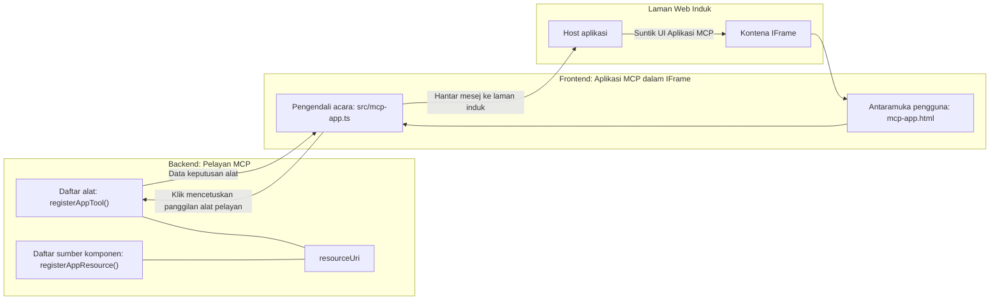

# Aplikasi MCP

Aplikasi MCP adalah paradigma baru dalam MCP. Idea ini bukan sahaja anda memberi respon dengan data kembali dari panggilan alat, tetapi anda juga menyediakan maklumat tentang bagaimana maklumat ini harus berinteraksi. Itu bermakna hasil alat kini boleh mengandungi maklumat UI. Kenapa kita mahukannya? Baiklah, pertimbangkan bagaimana anda melakukan perkara hari ini. Anda mungkin menggunakan hasil dari Server MCP dengan meletakkan beberapa jenis frontend di hadapannya, itu kod yang anda perlu tulis dan selenggara. Kadangkala itu apa yang anda mahu, tetapi kadangkala lebih baik jika anda hanya boleh membawa sekeping maklumat yang bersendirian yang mempunyai semuanya dari data ke antara muka pengguna.

## Gambaran Keseluruhan

Pelajaran ini memberikan panduan praktikal tentang Aplikasi MCP, bagaimana untuk bermula dengannya dan bagaimana mengintegrasikannya dalam Aplikasi Web sedia ada anda. Aplikasi MCP adalah penambahan yang sangat baru kepada Standard MCP.

## Objektif Pembelajaran

Pada akhir pelajaran ini, anda akan dapat:

- Menjelaskan apa itu Aplikasi MCP.
- Bila menggunakan Aplikasi MCP.
- Membangun dan mengintegrasi Aplikasi MCP anda sendiri.

## Aplikasi MCP - bagaimana ia berfungsi

Idea dengan Aplikasi MCP adalah untuk menyediakan respon yang sebenarnya adalah komponen untuk dirender. Komponen sebegini boleh mempunyai kedua-dua visual dan interaktiviti, contohnya, klik butang, input pengguna dan lain-lain. Mari bermula dengan bahagian server dan Server MCP kami. Untuk membuat komponen Aplikasi MCP anda perlu membuat alat tetapi juga sumber aplikasi. Kedua-dua bahagian ini dihubungkan oleh resourceUri.

Berikut adalah contoh. Mari cuba visualisasikan apa yang terlibat dan bahagian mana melakukan apa:

```text
server.ts -- responsible for registering tools and the component as a UI component
src/
  mcp-app.ts -- wiring up event handlers
mcp-app.html -- the user interface
```

Visual ini menerangkan seni bina untuk membuat komponen dan logiknya.


Mari cuba terangkan tanggungjawab seterusnya untuk backend dan frontend masing-masing.

### Backend

Ada dua perkara yang perlu kita capai di sini:

- Mendaftar alat yang ingin kita interaksi.
- Mendefinisikan komponen.

**Mendaftar alat**

```typescript
registerAppTool(
    server,
    "get-time",
    {
      title: "Get Time",
      description: "Returns the current server time.",
      inputSchema: {},
      _meta: { ui: { resourceUri } }, // Menghubungkan alat ini kepada sumber UI-nya
    },
    async () => {
      const time = new Date().toISOString();
      return { content: [{ type: "text", text: time }] };
    },
  );

```

Kod di atas menerangkan tingkah laku, di mana ia mendedahkan alat yang dipanggil `get-time`. Ia tidak mengambil input tetapi akhirnya menghasilkan masa semasa. Kita boleh mentakrifkan `inputSchema` untuk alat di mana kita perlu menerima input pengguna.

**Mendaftar komponen**

Dalam fail yang sama, kita juga perlu mendaftar komponen:

```typescript
const resourceUri = "ui://get-time/mcp-app.html";

// Daftarkan sumber, yang mengembalikan HTML/JavaScript yang dibundel untuk UI.
registerAppResource(
  server,
  resourceUri,
  resourceUri,
  { mimeType: RESOURCE_MIME_TYPE },
  async () => {
    const html = await fs.readFile(path.join(DIST_DIR, "mcp-app.html"), "utf-8");

    return {
    contents: [
        { uri: resourceUri, mimeType: RESOURCE_MIME_TYPE, text: html },
    ],
    };
  },
);
```

Perhatikan bagaimana kita menyebut `resourceUri` untuk menghubungkan komponen dengan alatnya. Yang menarik juga adalah callback di mana kita memuatkan fail UI dan mengembalikan komponen.

### Frontend komponen

Sama seperti backend, ada dua bahagian di sini:

- Frontend yang ditulis dalam HTML tulen.
- Kod yang mengendalikan acara dan apa yang perlu dilakukan, contohnya memanggil alat atau menghantar mesej ke tetingkap induk.

**Antara muka pengguna**

Mari kita lihat antara muka pengguna.

```html
<!-- mcp-app.html -->
<!DOCTYPE html>
<html lang="en">
  <head>
    <meta charset="UTF-8" />
    <title>Get Time App</title>
  </head>
  <body>
    <p>
      <strong>Server Time:</strong> <code id="server-time">Loading...</code>
    </p>
    <button id="get-time-btn">Get Server Time</button>
    <script type="module" src="/src/mcp-app.ts"></script>
  </body>
</html>
```

**Penyambungan acara**

Bahagian terakhir adalah penyambungan acara. Itu bermakna kita mengenal pasti bahagian mana dalam UI kita memerlukan pengendali acara dan apa yang perlu dilakukan jika acara dicetuskan:

```typescript
// mcp-app.ts

import { App } from "@modelcontextprotocol/ext-apps";

// Dapatkan rujukan elemen
const serverTimeEl = document.getElementById("server-time")!;
const getTimeBtn = document.getElementById("get-time-btn")!;

// Buat contoh aplikasi
const app = new App({ name: "Get Time App", version: "1.0.0" });

// Tangani hasil alat dari pelayan. Tetapkan sebelum `app.connect()` untuk mengelakkan
// kehilangan hasil alat awal.
app.ontoolresult = (result) => {
  const time = result.content?.find((c) => c.type === "text")?.text;
  serverTimeEl.textContent = time ?? "[ERROR]";
};

// Sambungkan klik butang
getTimeBtn.addEventListener("click", async () => {
  // `app.callServerTool()` membolehkan UI meminta data baru dari pelayan
  const result = await app.callServerTool({ name: "get-time", arguments: {} });
  const time = result.content?.find((c) => c.type === "text")?.text;
  serverTimeEl.textContent = time ?? "[ERROR]";
});

// Sambung ke hos
app.connect();
```

Seperti yang anda lihat di atas, ini adalah kod biasa untuk mengaitkan elemen DOM kepada acara. Yang patut diperhatikan adalah panggilan ke `callServerTool` yang akhirnya memanggil alat di backend.

## Mengendalikan input pengguna

Setakat ini, kita telah melihat komponen yang mempunyai butang yang apabila diklik memanggil alat. Mari lihat jika kita boleh tambah elemen UI seperti medan input dan lihat jika kita boleh menghantar argumen ke alat. Mari laksanakan fungsi FAQ. Begini caranya ia sepatutnya berfungsi:

- Harus ada butang dan elemen input di mana pengguna menaip kata kunci untuk mencari contohnya "Shipping". Ini harus memanggil alat pada backend yang membuat carian dalam data FAQ.
- Alat yang menyokong carian FAQ yang disebutkan.

Mari tambah sokongan yang diperlukan pada backend dahulu:

```typescript
const faq: { [key: string]: string } = {
    "shipping": "Our standard shipping time is 3-5 business days.",
    "return policy": "You can return any item within 30 days of purchase.",
    "warranty": "All products come with a 1-year warranty covering manufacturing defects.",
  }

registerAppTool(
    server,
    "get-faq",
    {
      title: "Search FAQ",
      description: "Searches the FAQ for relevant answers.",
      inputSchema: zod.object({
        query: zod.string().default("shipping"),
      }),
      _meta: { ui: { resourceUri: faqResourceUri } }, // Pautkan alat ini kepada sumber UI-nya
    },
    async ({ query }) => {
      const answer: string = faq[query.toLowerCase()] || "Sorry, I don't have an answer for that.";
      return { content: [{ type: "text", text: answer }] };
    },
  );
```

Apa yang kita lihat di sini adalah bagaimana kita mengisi `inputSchema` dan memberinya skema `zod` seperti berikut:

```typescript
inputSchema: zod.object({
  query: zod.string().default("shipping"),
})
```

Dalam skema di atas kita mengisytiharkan kita mempunyai parameter input bernama `query` dan bahawa ia adalah pilihan dengan nilai lalai "shipping".

Ok, mari teruskan ke *mcp-app.html* untuk lihat UI apa yang perlu kita cipta untuk ini:

```html
<div class="faq">
    <h1>FAQ response</h1>
    <p>FAQ Response: <code id="faq-response">Loading...</code></p>
    <input type="text" id="faq-query" placeholder="Enter FAQ query" />
    <button id="get-faq-btn">Get FAQ Response</button>
  </div>
```

Hebat, sekarang kita ada elemen input dan butang. Mari pergi ke *mcp-app.ts* seterusnya untuk sambungkan acara ini:

```typescript
const getFaqBtn = document.getElementById("get-faq-btn")!;
const faqQueryInput = document.getElementById("faq-query") as HTMLInputElement;

getFaqBtn.addEventListener("click", async () => {
  const query = faqQueryInput.value;
  const result = await app.callServerTool({ name: "get-faq", arguments: { query } });
  const faq = result.content?.find((c) => c.type === "text")?.text;
  faqResponseEl.textContent = faq ?? "[ERROR]";
});
```

Dalam kod di atas kita:

- Mencipta rujukan kepada elemen UI yang interaktif.
- Mengendalikan klik butang untuk mengurai nilai elemen input dan juga memanggil `app.callServerTool()` dengan `name` dan `arguments` di mana yang terakhir menghantar `query` sebagai nilai.

Apa yang sebenarnya berlaku apabila anda memanggil `callServerTool` adalah ia menghantar mesej ke tetingkap induk dan tetingkap itu akhirnya memanggil Server MCP.

### Cuba ia

Mencubanya sekarang kita sepatutnya lihat yang berikut:


dan ini adalah apabila kita cuba dengan input seperti "warranty"


Untuk jalankan kod ini, pergi ke [seksyen Kod](./code/README.md)

## Ujian dalam Visual Studio Code

Visual Studio Code mempunyai sokongan hebat untuk Aplikasi MCP dan mungkin salah satu cara paling mudah untuk menguji Aplikasi MCP anda. Untuk menggunakan Visual Studio Code, tambah entri server pada *mcp.json* seperti berikut:

```json
"my-mcp-server-7178eca7": {
    "url": "http://localhost:3001/mcp",
    "type": "http"
  }
```

Kemudian mulakan server, anda sepatutnya boleh berkomunikasi dengan Aplikasi MCP anda melalui Tetingkap Sembang asalkan anda telah memasang GitHub Copilot.

Anda boleh mencetuskannya melalui prompt, contohnya "#get-faq":


dan sama seperti apabila anda menjalankannya melalui pelayar web, ia memaparkan cara yang sama seperti berikut:


## Tugasan

Cipta permainan batu gunting kertas. Ia sepatutnya mengandungi yang berikut:

UI:

- senarai turun dengan pilihan
- butang untuk menghantar pilihan
- label yang menunjukkan siapa memilih apa dan siapa yang menang

Server:

- harus mempunyai alat batu gunting kertas yang mengambil "choice" sebagai input. Ia juga harus merender pilihan komputer dan menentukan pemenang

## Penyelesaian

[Penyelesaian](./assignment/README.md)

## Rumusan

Kita telah belajar tentang paradigma baru ini Aplikasi MCP. Ia paradigma baru yang membolehkan Server MCP mempunyai pendapat bukan sahaja tentang data tetapi juga bagaimana data ini harus dipersembahkan.

Selain itu, kita belajar bahawa Aplikasi MCP ini dihoskan dalam IFrame dan untuk berkomunikasi dengan Server MCP mereka perlu menghantar mesej ke aplikasi web induk. Terdapat beberapa perpustakaan untuk JavaScript biasa dan React dan lain-lain yang menjadikan komunikasi ini lebih mudah.

## Perkara Penting

Berikut adalah apa yang anda telah pelajari:

- Aplikasi MCP adalah standard baru yang berguna apabila anda mahu menghantar kedua-dua data dan ciri UI.
- Jenis aplikasi ini berjalan dalam IFrame untuk sebab keselamatan.

## Apa Seterusnya

- [Bab 4](../../04-PracticalImplementation/README.md)

---

<!-- CO-OP TRANSLATOR DISCLAIMER START -->
**Penafian**:  
Dokumen ini telah diterjemahkan menggunakan perkhidmatan terjemahan AI [Co-op Translator](https://github.com/Azure/co-op-translator). Walaupun kami berusaha untuk ketepatan, sila maklum bahawa terjemahan automatik mungkin mengandungi kesilapan atau ketidaktepatan. Dokumen asal dalam bahasa asalnya harus dianggap sebagai sumber rasmi. Untuk maklumat penting, terjemahan profesional oleh manusia adalah disyorkan. Kami tidak bertanggungjawab terhadap sebarang salah faham atau salah tafsir yang timbul daripada penggunaan terjemahan ini.
<!-- CO-OP TRANSLATOR DISCLAIMER END -->