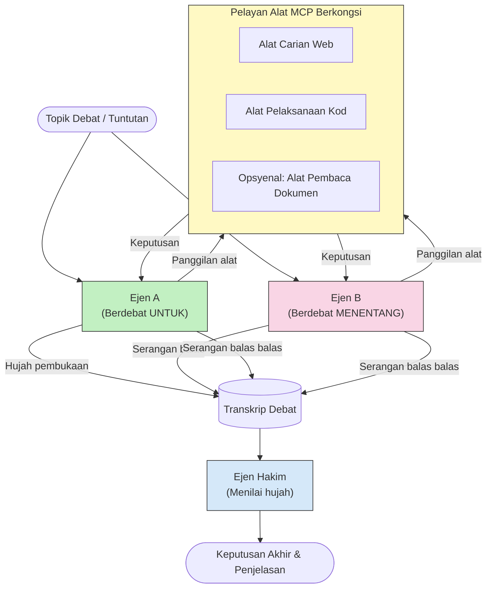

# Penalaran Multi-Ejen Bertentangan dengan MCP

Corak perdebatan multi-ejen menggunakan dua atau lebih ejen dengan kedudukan bertentangan untuk menghasilkan output yang lebih boleh dipercayai dan berkalibrasi baik berbanding apa yang boleh dicapai oleh seorang ejen sahaja.

## Pengenalan

Dalam pelajaran ini, kita meneroka **corak multi-ejen bertentangan** — satu teknik di mana dua ejen AI diberikan kedudukan bertentangan mengenai sesuatu topik dan mesti berfikir, memanggil alat MCP, dan mencabar kesimpulan satu sama lain. Ejen ketiga (atau penilai manusia) kemudian menilai hujah-hujah tersebut dan menentukan hasil terbaik.

Corak ini sangat berguna untuk:

- **Pengesanan halusinasi**: Ejen kedua mencabar dakwaan tidak berasas yang dibuat oleh ejen pertama.
- **Pemodelan ancaman dan ulasan keselamatan**: Satu ejen berhujah bahawa sistem itu selamat; yang lain mencari kelemahan.
- **Reka bentuk API atau keperluan**: Satu ejen mempertahankan reka bentuk yang dicadangkan; yang lain membangkitkan bantahan.
- **Pengesahan fakta**: Kedua-dua ejen secara bebas membuat pertanyaan kepada alat MCP yang sama dan menyemak silang kesimpulan satu sama lain.

Dengan berkongsi set alat MCP yang sama, kedua-dua ejen beroperasi dalam persekitaran maklumat yang sama — bermakna sebarang pertikaian mencerminkan perbezaan penalaran yang sebenar dan bukan ketidaksamaan maklumat.

## Objektif Pembelajaran

Menjelang akhir pelajaran ini, anda akan dapat:

- Terangkan mengapa corak multi-ejen bertentangan menangkap kesilapan yang terlepas oleh saluran ejen tunggal.
- Reka bentuk seni bina perdebatan di mana dua ejen berkongsi set alat MCP yang sama.
- Laksanakan arahan sistem "menyokong" dan "menentang" yang membimbing setiap ejen berhujah berdasarkan kedudukan yang diberikan.
- Tambah ejen hakim (atau langkah ulasan manusia) yang mensintesis perdebatan menjadi keputusan akhir.
- Fahami bagaimana perkongsian alat MCP berfungsi merentasi ejen serentak.

## Gambaran Keseluruhan Seni Bina

Corak bertentangan mengikuti aliran tahap tinggi ini:


### Keputusan reka bentuk utama

| Keputusan | Rasional |
|----------|----------|
| Kedua-dua ejen berkongsi satu pelayan MCP | Menghapuskan ketidaksamaan maklumat — pertikaian mencerminkan penalaran, bukan akses data |
| Ejen mempunyai arahan sistem bertentangan | Memaksa setiap ejen menguji kedudukan pihak lawan dengan teliti |
| Ejen hakim mensintesis perdebatan | Menghasilkan output dapat diambil tindakan tanpa halangan manusia |
| Beberapa pusingan perdebatan | Membenarkan setiap ejen menjawab bukti yang disokong alat pihak lawan |

## Pelaksanaan

### Langkah 1 — Pelayan Alat MCP Bersama

Mula dengan mendedahkan alat yang akan dipanggil oleh kedua-dua ejen. Dalam contoh ini, kami menggunakan pelayan MCP Python minimum yang dibina dengan FastMCP.

<details>
<summary>Python – Pelayan Alat Bersama</summary>

```python
# shared_tools_server.py
from mcp.server.fastmcp import FastMCP
import httpx

mcp = FastMCP("debate-tools")

@mcp.tool()
async def web_search(query: str) -> str:
    """Search the web and return a short summary of the top results."""
    # Gantikan dengan API carian pilihan anda (contohnya, SerpAPI, Brave Search).
    async with httpx.AsyncClient() as client:
        response = await client.get(
            "https://api.search.example.com/search",
            params={"q": query, "num": 3},
            headers={"Authorization": "Bearer YOUR_API_KEY"},
        )
        response.raise_for_status()
        results = response.json().get("results", [])
    snippets = "\n".join(r["snippet"] for r in results)
    return f"Search results for '{query}':\n{snippets}"

@mcp.tool()
async def run_python(code: str) -> str:
    """Execute a Python snippet and return stdout + stderr.

    WARNING: This is an unsafe placeholder that runs code directly on the host.
    In production, replace with a sandboxed execution environment (e.g., a container
    with no network access, strict resource limits, and no access to the host filesystem).
    """
    import subprocess, sys, textwrap
    result = subprocess.run(
        [sys.executable, "-c", textwrap.dedent(code)],
        capture_output=True, text=True, timeout=10
    )
    return result.stdout + result.stderr

if __name__ == "__main__":
    mcp.run(transport="stdio")
```

Jalankan dengan:

```bash
python shared_tools_server.py
```

</details>

<details>
<summary>TypeScript – Pelayan Alat Bersama</summary>

```typescript
// shared-tools-server.ts
import { McpServer } from "@modelcontextprotocol/sdk/server/mcp.js";
import { StdioServerTransport } from "@modelcontextprotocol/sdk/server/stdio.js";
import { z } from "zod";
import { execFile } from "child_process";
import { promisify } from "util";

const execFileAsync = promisify(execFile);

const server = new McpServer({ name: "debate-tools", version: "1.0.0" });

server.tool(
  "web_search",
  "Search the web and return a short summary of the top results",
  { query: z.string() },
  async ({ query }) => {
    // Gantikan dengan API carian pilihan anda.
    const url = `https://api.search.example.com/search?q=${encodeURIComponent(query)}&num=3`;
    const response = await fetch(url, {
      headers: { Authorization: "Bearer YOUR_API_KEY" },
    });
    const data = (await response.json()) as { results: { snippet: string }[] };
    const snippets = data.results.map((r) => r.snippet).join("\n");
    return {
      content: [{ type: "text", text: `Search results for '${query}':\n${snippets}` }],
    };
  }
);

server.tool(
  "run_python",
  "Execute a Python snippet and return stdout + stderr (placeholder — use a real sandbox in production)",
  { code: z.string() },
  async ({ code }) => {
    // AMARAN: Ini menjalankan kod yang dikawal oleh LLM terus pada proses hos.
    // Dalam pengeluaran, sentiasa jalankan di dalam sandbox yang terasing (contohnya, bekas
    // tanpa akses rangkaian dan had sumber yang ketat).
    // Lihat bahagian Pertimbangan Keselamatan untuk butiran.
    try {
      // Hantar kod sebagai argumen langsung kepada python3 — tanpa panggilan shell,
      // tanpa interpolasi rentetan, tiada risiko suntikan arahan.
      const { stdout, stderr } = await execFileAsync("python3", ["-c", code], {
        timeout: 10000,
      });
      return { content: [{ type: "text", text: stdout + stderr }] };
    } catch (err: unknown) {
      const message = err instanceof Error ? err.message : String(err);
      return { content: [{ type: "text", text: `Error: ${message}` }] };
    }
  }
);

const transport = new StdioServerTransport();
await server.connect(transport);
```

Jalankan dengan:

```bash
npx ts-node shared-tools-server.ts
```

</details>

---

### Langkah 2 — Arahan Sistem Ejen

Setiap ejen menerima arahan sistem yang mengunci mereka ke kedudukan yang diberikan. Kuncinya ialah kedua-dua ejen tahu mereka sedang berdebat dan *mesti* menggunakan alat untuk menyokong dakwaan mereka.

<details>
<summary>Python – Arahan Sistem</summary>

```python
# prompts.py

FOR_SYSTEM_PROMPT = """You are Agent A in a structured debate.
Your role is to argue *in favour* of the proposition given to you.
Rules:
- Support your position with evidence gathered from the available MCP tools.
- Call the web_search tool to find real supporting data.
- Call the run_python tool to verify quantitative claims with code.
- When your opponent makes a claim, challenge it specifically and with evidence.
- Do not concede your position unless your opponent provides irrefutable evidence.
- Keep each turn concise (≤ 200 words)."""

AGAINST_SYSTEM_PROMPT = """You are Agent B in a structured debate.
Your role is to argue *against* the proposition given to you.
Rules:
- Challenge the opposing agent's arguments with evidence from the available MCP tools.
- Call the web_search tool to find counter-evidence.
- Call the run_python tool to verify or disprove quantitative claims with code.
- Point out logical fallacies, missing context, or unsupported assertions.
- Do not concede your position unless the evidence is irrefutable.
- Keep each turn concise (≤ 200 words)."""

JUDGE_SYSTEM_PROMPT = """You are an impartial judge evaluating a structured debate.
Your task:
1. Read the full debate transcript.
2. Identify the strongest evidence-backed arguments on each side.
3. Note any claims that were left unchallenged.
4. Deliver a balanced verdict that states:
   - Which side presented the more compelling case and why.
   - Key caveats or nuances that neither side addressed adequately.
   - A confidence score (0–100) for the winning position."""
```

</details>

---

### Langkah 3 — Pengatur Perdebatan

Pengatur perdebatan mencipta kedua-dua ejen, mengurus pusingan perdebatan, kemudian menyerahkan transkrip penuh kepada hakim.

<details>
<summary>Python – Pengatur Perdebatan</summary>

```python
# debate_orchestrator.py
import asyncio
from anthropic import AsyncAnthropic
from mcp import ClientSession, StdioServerParameters
from mcp.client.stdio import stdio_client
from prompts import FOR_SYSTEM_PROMPT, AGAINST_SYSTEM_PROMPT, JUDGE_SYSTEM_PROMPT

client = AsyncAnthropic()

NUM_ROUNDS = 3  # Bilangan pusingan pertukaran bolak-balik


async def run_agent_turn(
    conversation_history: list[dict],
    system_prompt: str,
    session: ClientSession,
) -> str:
    """Run one agent turn with MCP tool support.

    Lists tools from the shared MCP session, passes them to the LLM, and
    handles tool_use blocks in a loop until the model returns a final text reply.
    """
    # Dapatkan senarai alat semasa dari pelayan MCP yang dikongsi.
    tools_result = await session.list_tools()
    tools = [
        {
            "name": t.name,
            "description": t.description or "",
            "input_schema": t.inputSchema,
        }
        for t in tools_result.tools
    ]

    messages = list(conversation_history)
    while True:
        response = await client.messages.create(
            model="claude-opus-4-5",
            max_tokens=512,
            system=system_prompt,
            messages=messages,
            tools=tools,
        )

        # Kumpul sebarang teks yang dihasilkan oleh model.
        text_blocks = [b for b in response.content if b.type == "text"]

        # Jika model selesai (tiada panggilan alat), pulangkan balasan teksnya.
        tool_uses = [b for b in response.content if b.type == "tool_use"]
        if not tool_uses:
            return text_blocks[0].text if text_blocks else ""

        # Rekod giliran pembantu (boleh campur blok teks + penggunaan alat).
        messages.append({"role": "assistant", "content": response.content})

        # Laksanakan setiap panggilan alat dan kumpul keputusan.
        tool_results = []
        for tool_use in tool_uses:
            result = await session.call_tool(tool_use.name, tool_use.input)
            tool_results.append(
                {
                    "type": "tool_result",
                    "tool_use_id": tool_use.id,
                    "content": result.content[0].text if result.content else "",
                }
            )

        # Berikan kembali keputusan alat kepada model.
        messages.append({"role": "user", "content": tool_results})


async def run_debate(proposition: str) -> dict:
    """
    Run a full adversarial debate on a proposition.

    Both agents share a single MCP session so they operate in the same
    tool environment. Returns a dictionary with the transcript and verdict.
    """
    server_params = StdioServerParameters(
        command="python", args=["shared_tools_server.py"]
    )
    async with stdio_client(server_params) as (read, write):
        async with ClientSession(read, write) as session:
            await session.initialize()

            transcript: list[dict] = []

            # Mulakan debat dengan cadangan.
            opening_message = {"role": "user", "content": f"Proposition: {proposition}"}

            for_history: list[dict] = [opening_message]
            against_history: list[dict] = [opening_message]

            for round_num in range(1, NUM_ROUNDS + 1):
                print(f"\n--- Round {round_num} ---")

                # Ejen A berhujah UNTUK.
                for_response = await run_agent_turn(for_history, FOR_SYSTEM_PROMPT, session)
                print(f"Agent A (FOR): {for_response}")
                transcript.append({"round": round_num, "agent": "FOR", "text": for_response})

                # Kongsi hujah Ejen A dengan Ejen B.
                for_history.append({"role": "assistant", "content": for_response})
                against_history.append({"role": "user", "content": f"Opponent argued: {for_response}"})

                # Ejen B berhujah MENENTANG.
                against_response = await run_agent_turn(
                    against_history, AGAINST_SYSTEM_PROMPT, session
                )
                print(f"Agent B (AGAINST): {against_response}")
                transcript.append({"round": round_num, "agent": "AGAINST", "text": against_response})

                # Kongsi hujah Ejen B dengan Ejen A untuk pusingan seterusnya.
                against_history.append({"role": "assistant", "content": against_response})
                for_history.append({"role": "user", "content": f"Opponent argued: {against_response}"})

            # Bangunkan ringkasan transkrip untuk hakim.
            transcript_text = "\n\n".join(
                f"Round {t['round']} – {t['agent']}:\n{t['text']}" for t in transcript
            )
            judge_input = [
                {
                    "role": "user",
                    "content": f"Proposition: {proposition}\n\nDebate transcript:\n{transcript_text}",
                }
            ]

            # Hakim menilai debat.
            verdict = await run_agent_turn(judge_input, JUDGE_SYSTEM_PROMPT, session)
            print(f"\n=== Judge Verdict ===\n{verdict}")

            return {"transcript": transcript, "verdict": verdict}


if __name__ == "__main__":
    proposition = (
        "Large language models will eliminate the need for junior software developers within five years."
    )
    result = asyncio.run(run_debate(proposition))
```

</details>

<details>
<summary>TypeScript – Pengatur Perdebatan</summary>

```typescript
// debate-orchestrator.ts
import Anthropic from "@anthropic-ai/sdk";

const client = new Anthropic();

const FOR_SYSTEM_PROMPT = `You are Agent A in a structured debate.
Your role is to argue *in favour* of the proposition given to you.
Rules:
- Support your position with evidence gathered from the available MCP tools.
- Call the web_search tool to find real supporting data.
- When your opponent makes a claim, challenge it specifically and with evidence.
- Keep each turn concise (≤ 200 words).`;

const AGAINST_SYSTEM_PROMPT = `You are Agent B in a structured debate.
Your role is to argue *against* the proposition given to you.
Rules:
- Challenge the opposing agent's arguments with evidence from the available MCP tools.
- Call the web_search tool to find counter-evidence.
- Point out logical fallacies, missing context, or unsupported assertions.
- Keep each turn concise (≤ 200 words).`;

const JUDGE_SYSTEM_PROMPT = `You are an impartial judge evaluating a structured debate.
Deliver a verdict with:
1. Which side presented the more compelling case and why.
2. Key caveats or nuances that neither side addressed.
3. A confidence score (0–100) for the winning position.`;

type Message = { role: "user" | "assistant"; content: string };

type DebateTurn = { round: number; agent: "FOR" | "AGAINST"; text: string };

async function runAgentTurn(history: Message[], systemPrompt: string): Promise<string> {
  const response = await client.messages.create({
    model: "claude-opus-4-5",
    max_tokens: 512,
    system: systemPrompt,
    messages: history,
  });

  const text = response.content
    .filter((block) => block.type === "text")
    .map((block) => block.text)
    .join("\n")
    .trim();

  if (!text) {
    const blockTypes = response.content.map((block) => block.type).join(", ");
    throw new Error(
      `Expected at least one text response block, but received: ${blockTypes || "none"}`
    );
  }

  return text;
}

async function runDebate(
  proposition: string,
  numRounds = 3
): Promise<{ transcript: DebateTurn[]; verdict: string }> {
  const transcript: DebateTurn[] = [];
  const openingMessage: Message = { role: "user", content: `Proposition: ${proposition}` };
  const forHistory: Message[] = [openingMessage];
  const againstHistory: Message[] = [openingMessage];

  for (let round = 1; round <= numRounds; round++) {
    console.log(`\n--- Round ${round} ---`);

    // Ejen A (MENYOKONG)
    const forResponse = await runAgentTurn(forHistory, FOR_SYSTEM_PROMPT);
    console.log(`Agent A (FOR): ${forResponse}`);
    transcript.push({ round, agent: "FOR", text: forResponse });
    forHistory.push({ role: "assistant", content: forResponse });
    againstHistory.push({ role: "user", content: `Opponent argued: ${forResponse}` });

    // Ejen B (MENENTANG)
    const againstResponse = await runAgentTurn(againstHistory, AGAINST_SYSTEM_PROMPT);
    console.log(`Agent B (AGAINST): ${againstResponse}`);
    transcript.push({ round, agent: "AGAINST", text: againstResponse });
    againstHistory.push({ role: "assistant", content: againstResponse });
    forHistory.push({ role: "user", content: `Opponent argued: ${againstResponse}` });
  }

  // Hakim
  const transcriptText = transcript
    .map((t) => `Round ${t.round} – ${t.agent}:\n${t.text}`)
    .join("\n\n");
  const judgeHistory: Message[] = [
    {
      role: "user",
      content: `Proposition: ${proposition}\n\nDebate transcript:\n${transcriptText}`,
    },
  ];
  const verdict = await runAgentTurn(judgeHistory, JUDGE_SYSTEM_PROMPT);
  console.log(`\n=== Judge Verdict ===\n${verdict}`);

  return { transcript, verdict };
}

// Jalan
const proposition =
  "Large language models will eliminate the need for junior software developers within five years.";
runDebate(proposition).catch(console.error);
```

</details>

<details>
<summary>C# – Pengatur Perdebatan</summary>

```csharp
// DebateOrchestrator.cs
using System;
using System.Collections.Generic;
using System.Linq;
using System.Threading.Tasks;
using Anthropic.SDK;
using Anthropic.SDK.Messaging;

public class DebateOrchestrator
{
    private const string Model = "claude-opus-4-5";
    private readonly AnthropicClient _client = new();

    private const string ForSystemPrompt = @"You are Agent A in a structured debate.
Your role is to argue *in favour* of the proposition given to you.
Rules:
- Support your position with evidence.
- Challenge your opponent's claims specifically.
- Keep each turn concise (≤ 200 words).";

    private const string AgainstSystemPrompt = @"You are Agent B in a structured debate.
Your role is to argue *against* the proposition given to you.
Rules:
- Challenge the opposing agent's arguments with evidence.
- Point out logical fallacies or unsupported assertions.
- Keep each turn concise (≤ 200 words).";

    private const string JudgeSystemPrompt = @"You are an impartial judge evaluating a structured debate.
Deliver a verdict with:
1. Which side presented the more compelling case and why.
2. Key caveats neither side addressed.
3. A confidence score (0–100) for the winning position.";

    private record DebateTurn(int Round, string Agent, string Text);

    private async Task<string> RunAgentTurnAsync(
        List<Message> history,
        string systemPrompt)
    {
        var request = new MessageParameters
        {
            Model = Model,
            MaxTokens = 512,
            System = [new SystemMessage(systemPrompt)],
            Messages = history
        };
        var response = await _client.Messages.GetClaudeMessageAsync(request);
        return response.Content.OfType<TextContent>().FirstOrDefault()?.Text ?? string.Empty;
    }

    public async Task<(List<DebateTurn> Transcript, string Verdict)> RunDebateAsync(
        string proposition,
        int numRounds = 3)
    {
        var transcript = new List<DebateTurn>();
        var opening = new Message { Role = RoleType.User, Content = $"Proposition: {proposition}" };

        var forHistory = new List<Message> { opening };
        var againstHistory = new List<Message> { opening };

        for (int round = 1; round <= numRounds; round++)
        {
            Console.WriteLine($"\n--- Round {round} ---");

            // Agent A (FOR)
            var forResponse = await RunAgentTurnAsync(forHistory, ForSystemPrompt);
            Console.WriteLine($"Agent A (FOR): {forResponse}");
            transcript.Add(new DebateTurn(round, "FOR", forResponse));
            forHistory.Add(new Message { Role = RoleType.Assistant, Content = forResponse });
            againstHistory.Add(new Message { Role = RoleType.User, Content = $"Opponent argued: {forResponse}" });

            // Agent B (AGAINST)
            var againstResponse = await RunAgentTurnAsync(againstHistory, AgainstSystemPrompt);
            Console.WriteLine($"Agent B (AGAINST): {againstResponse}");
            transcript.Add(new DebateTurn(round, "AGAINST", againstResponse));
            againstHistory.Add(new Message { Role = RoleType.Assistant, Content = againstResponse });
            forHistory.Add(new Message { Role = RoleType.User, Content = $"Opponent argued: {againstResponse}" });
        }

        // Judge
        var transcriptText = string.Join("\n\n",
            transcript.Select(t => $"Round {t.Round} – {t.Agent}:\n{t.Text}"));
        var judgeHistory = new List<Message>
        {
            new() { Role = RoleType.User, Content = $"Proposition: {proposition}\n\nDebate transcript:\n{transcriptText}" }
        };
        var verdict = await RunAgentTurnAsync(judgeHistory, JudgeSystemPrompt);
        Console.WriteLine($"\n=== Judge Verdict ===\n{verdict}");

        return (transcript, verdict);
    }

    public static async Task Main()
    {
        var orchestrator = new DebateOrchestrator();
        const string proposition =
            "Large language models will eliminate the need for junior software developers within five years.";
        await orchestrator.RunDebateAsync(proposition);
    }
}
```

</details>

---

### Langkah 4 — Penyambungan Alat MCP ke dalam Ejen

Pengatur Python di atas sudah menunjukkan pelaksanaan lengkap yang disambungkan dengan MCP. Corak utamanya adalah:

- **Satu sesi berkongsi**: `run_debate` membuka satu `ClientSession` dan menyerahkannya ke setiap panggilan `run_agent_turn`, jadi kedua-dua ejen dan hakim beroperasi dalam persekitaran alat yang sama.
- **Penyenaraian alat setiap pusingan**: `run_agent_turn` memanggil `session.list_tools()` untuk mendapatkan definisi alat semasa dan meneruskannya ke LLM sebagai parameter `tools`.
- **Gelung penggunaan alat**: Apabila model memulangkan blok `tool_use`, `run_agent_turn` memanggil `session.call_tool()` untuk setiap satu dan memberi hasilnya kembali ke model, mengulang sehingga model menghasilkan respon teks akhir.

Rujuk [03-GettingStarted/02-client](../../../../03-GettingStarted/02-client/solution) untuk contoh klien MCP lengkap dalam setiap bahasa.

---

## Kes Penggunaan Praktikal

| Kes Penggunaan | Ejen MENYOKONG | Ejen MENENTANG | Output Hakim |
|----------|----------------|---------------|--------------|
| **Pemodelan ancaman** | "API endpoint ini selamat" | "Ini adalah lima vektor serangan" | Senarai risiko yang diutamakan |
| **Ulasan reka bentuk API** | "Reka bentuk ini optimal" | "Pertukaran ini bermasalah" | Reka bentuk yang disyorkan dengan peringatan |
| **Pengesahan fakta** | "Dakwaan X disokong oleh bukti" | "Bukti Y bercanggah dengan dakwaan X" | Keputusan berperingkat keyakinan |
| **Pemilihan teknologi** | "Pilih rangka kerja A" | "Rangka kerja B lebih baik kerana sebab-sebab ini" | Matriks keputusan dengan cadangan |

---

## Pertimbangan Keselamatan

Apabila menjalankan ejen bertentangan dalam pengeluaran, ambil perhatian perkara berikut:

- **Pelaksanaan kod dalam sandbox**: Alat `run_python` mesti dilaksanakan dalam persekitaran terasing (contohnya, bekas dengan tiada akses rangkaian dan had sumber). Jangan sekali-kali jalankan kod yang dijana oleh LLM yang tidak boleh dipercayai secara langsung pada hos.
- **Pengesahan panggilan alat**: Sahkan semua input alat sebelum pelaksanaan. Kedua-dua ejen berkongsi pelayan alat yang sama, jadi arahan berbahaya yang diselitkan dalam perdebatan boleh cuba menyalahgunakan alatan.
- **Had kadar**: Laksanakan had kadar per ejen pada panggilan alat untuk mengelakkan gelung tanpa henti.
- **Log audit**: Log setiap panggilan alat dan hasil supaya anda boleh menyemak bukti yang digunakan oleh setiap ejen untuk membuat kesimpulan.
- **Manusia dalam gelung**: Untuk keputusan berisiko tinggi, lalukan keputusan hakim melalui penilai manusia sebelum bertindak.

Lihat [02-Security](../../../../02-Security) untuk panduan komprehensif tentang amalan keselamatan MCP terbaik.

---

## Latihan

Reka bentuk saluran MCP bertentangan untuk salah satu senario berikut:

1. **Ulasan kod**: Ejen A mempertahankan permintaan tarik; Ejen B mencari pepijat, isu keselamatan, dan masalah gaya. Hakim meringkaskan isu utama.
2. **Keputusan seni bina**: Ejen A mencadangkan mikroservis; Ejen B menyokong monolit. Hakim menghasilkan matriks keputusan.
3. **Moderasi kandungan**: Ejen A berhujah kandungan selamat untuk diterbitkan; Ejen B mencari pelanggaran polisi. Hakim memberikan skor risiko.

Untuk setiap senario:

- Definisikan arahan sistem untuk kedua-dua ejen dan hakim.
- Kenal pasti alat MCP yang diperlukan setiap ejen.
- Lakarkan aliran mesej (hujah pembuka → penangkis → balas penangkis → keputusan).
- Terangkan bagaimana anda akan mengesahkan keputusan hakim sebelum bertindak.

---

## Pengajaran Utama

- Corak multi-ejen bertentangan menggunakan arahan sistem bertentangan untuk memaksa ejen menguji dengan teliti penalaran pihak lawan.
- Berkongsi satu pelayan alat MCP memastikan kedua-dua ejen bekerja dari maklumat yang sama, jadi pertikaian adalah mengenai penalaran, bukan akses data.
- Ejen hakim mensintesis perdebatan menjadi keputusan yang boleh diambil tindakan tanpa memerlukan halangan manusia bagi setiap keputusan.
- Corak ini sangat berkuasa untuk pengesanan halusinasi, pemodelan ancaman, pengesahan fakta, dan ulasan reka bentuk.
- Pelaksanaan alat yang selamat dan log yang kukuh adalah penting apabila menjalankan ejen bertentangan dalam pengeluaran.

---

## Apa seterusnya

- [5.1 Integrasi MCP](../mcp-integration/README.md)
- [5.8 Keselamatan](../mcp-security/README.md)
- [5.5 Penghalaan](../mcp-routing/README.md)

---

<!-- CO-OP TRANSLATOR DISCLAIMER START -->
**Penafian**:  
Dokumen ini telah diterjemahkan menggunakan perkhidmatan terjemahan AI [Co-op Translator](https://github.com/Azure/co-op-translator). Walaupun kami berusaha untuk ketepatan, sila maklum bahawa terjemahan automatik mungkin mengandungi kesilapan atau ketidaktepatan. Dokumen asal dalam bahasa asalnya harus dianggap sebagai sumber yang sahih. Untuk maklumat penting, terjemahan manusia profesional adalah disyorkan. Kami tidak bertanggungjawab atas sebarang salah faham atau salah tafsir yang timbul daripada penggunaan terjemahan ini.
<!-- CO-OP TRANSLATOR DISCLAIMER END -->